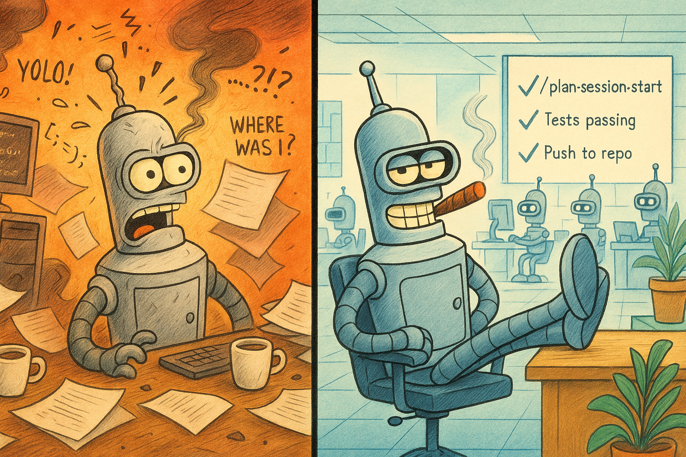

# Planning is Prompting
When it comes to driving agentic coding assistants like Claude Code, the plan is the prompt! 

Read the blog post: [Faster, Better, Morer: How to 5–10x Your Code Generation with Claude Code](https://medium.com/@ricardo.felipe.ruiz/faster-better-morer-how-to-5-10x-your-code-generation-with-claude-code-81bc79619c3f)

<p align="center">
  
</p>

## Overview

This repository is a centralized knowledge base for meta-prompting strategies and workflow configurations for agentic coding assistants. It contains reusable templates, prompts, and configurations to help you efficiently bootstrap new projects and maintain consistent workflows across your development sessions.

## Getting Started

### 🚀 Quick Install (Interactive Wizard)

The easiest way to install workflows is with the **interactive installation wizard**:

**Method 1: Share the installation guide** (works everywhere):
   ```
   planning-is-prompting → workflow/INSTALLATION-GUIDE.md
   ```

**Method 2: Use the wizard slash command** (if installed):
   ```
   /plan-install-wizard
   ```

**Claude will**:
- Show available workflows (Session, History, Planning, Backup)
- Guide you through configuration (PREFIX, paths)
- Install and validate everything automatically
- Start working with your new workflows immediately!

**What gets installed** (you choose):
- ✅ **[A]** Session Management: `/plan-session-start`, `/plan-session-end`
- ✅ **[B]** History Management: `/plan-history-management`
- ✅ **[C]** Planning is Prompting Core: `/p-is-p-00-start-here`, `/p-is-p-01-planning`, `/p-is-p-02-documentation`
- ✅ **[D]** Backup Infrastructure: `/plan-backup-check`, `/plan-backup`, `/plan-backup-write`
- ✅ **[E]** Testing Workflows: `/plan-test-baseline`, `/plan-test-remediation`, `/plan-test-harness-update`
- ✅ **[F]** Installation Wizard: `/plan-install-wizard` (makes wizard available as slash command)
- ✅ **[G]** Uninstall Wizard: `/plan-uninstall-wizard` (removes installed workflows when no longer needed)

**Get the wizard itself**: You can select option [F] during installation to install `/plan-install-wizard` as a slash command, or the wizard will offer it in Step 7.5 after installing other workflows.

**Adding more workflows later**:
- **With wizard installed**: Just type `/plan-install-wizard`
- **Without wizard**: Share INSTALLATION-GUIDE.md again
- **Both methods**: Automatically detect existing installations and offer to add more workflows

### 🗑️ Removing Workflows (Uninstall Wizard)

**Uninstall workflows you no longer need:**

```bash
/plan-uninstall-wizard
```

**What it does**:
- Detects currently installed workflows
- Shows catalog with installed status (A-F options, same as installer)
- Lets you select workflows to remove
- Shows deletion candidates and requires confirmation
- Deletes slash command files only (`.claude/commands/*.md`)
- Offers optional cleanup (CLAUDE.md, .gitignore, empty directories)
- Suggests manual cleanup for related files (history.md, backup.sh, etc.)

**Safety features**:
- Shows exactly what will be deleted before removing anything
- Requires confirmation before deletion
- Only removes slash commands (preserves your data)
- Lists related files for manual cleanup review

**To reinstall later**:
- Run `/plan-install-wizard` (if kept installed)
- Or share INSTALLATION-GUIDE.md again

### 📚 Documentation

- **[INSTALLATION-GUIDE.md](workflow/INSTALLATION-GUIDE.md)** - Interactive wizard + manual installation instructions
- **[installation-wizard.md](workflow/installation-wizard.md)** - Canonical workflow for installation process
- **[uninstall-wizard.md](workflow/uninstall-wizard.md)** - Canonical workflow for uninstallation process
- **[CLAUDE.md](CLAUDE.md)** - Project-specific configuration for this repository (example for other projects)
- **[.claude/commands/](.claude/commands/)** - Working examples of slash commands using reference wrapper pattern

## "Planning is Prompting" Core Workflows

**The heart of this repository** - a two-step process for planning and documenting work:

### 🎯 Start Here
- [**p-is-p-00-start-here.md**](workflow/p-is-p-00-start-here.md) - **Entry point**: Philosophy, decision matrix, and quick start guide

### Step 1: Planning the Work (Always Required)
- [**p-is-p-01-planning-the-work.md**](workflow/p-is-p-01-planning-the-work.md) - Classify work, select pattern, break down tasks, create TodoWrite lists

### Step 2: Documenting the Implementation (Conditional)
- [**p-is-p-02-documenting-the-implementation.md**](workflow/p-is-p-02-documenting-the-implementation.md) - Create structured docs, manage token budgets, establish archival (for large projects only)

### Decision Matrix: Which Workflows Do You Need?

| Work Type | Duration | Pattern (Step 1) | Need Step 2? | Workflow Path |
|-----------|----------|------------------|--------------|---------------|
| Small feature | 1-2 weeks | Pattern 3: Feature Dev | ✗ No | → **01** only → history.md |
| Bug investigation | 3-5 days | Pattern 4: Investigation | ✗ No | → **01** only → history.md |
| Architecture design | 4-6 weeks | Pattern 5: Architecture | ✓ Yes | → **01** → **02** (Pattern B) |
| Technology research | 2-3 weeks | Pattern 2: Research | ✓ Yes | → **01** → **02** (Pattern C) |
| Large implementation | 8-12 weeks | Pattern 1: Multi-Phase | ✓ Yes | → **01** → **02** (Pattern A) |

**Quick Rule**: Use **Step 1** only for small/simple work (< 2 weeks). Use **Step 1 + Step 2** for large/complex work (8+ weeks, multiple phases).

---

## Supporting Workflows

### Configuration
- [**claude-config-global.md**](workflow/claude-config-global.md) - Global Claude Code configuration template ( copy to `~/.claude/CLAUDE.md` )
- [**claude-config-local.md**](workflow/claude-config-local.md) - Project-specific Claude Code configuration template ( copy to `<project>/.claude/CLAUDE.md` )

### Session Management
- [**session-start.md**](workflow/session-start.md) - Prompts for initializing sessions and loading context
- [**session-end.md**](workflow/session-end.md) - Prompts for session wrap-up, documentation, and commits

### Resource Management
- [**history-management.md**](workflow/history-management.md) - Prompts for maintaining session history and documentation

### Testing Workflows
- [**testing-baseline.md**](workflow/testing-baseline.md) - Pre-change baseline collection (establish known-good state)
- [**testing-remediation.md**](workflow/testing-remediation.md) - Post-change verification and systematic fixes (compare, analyze, fix, validate)
- [**testing-harness-update.md**](workflow/testing-harness-update.md) - Test maintenance planning (discover changes, identify gaps, generate update plan)

**Quick Usage**:
```bash
/plan-test-baseline                    # Before changes: establish baseline
# ... make code changes ...
/plan-test-remediation                 # After changes: verify & fix regressions
/plan-test-harness-update              # Analyze code changes, plan test updates
```

**Learn more**: See [Testing Workflows](workflow/INSTALLATION-GUIDE.md#testing-workflows) in installation guide

### Git & Notifications
- [**commit-management.md**](workflow/commit-management.md) - Prompts for git operations and commit workflows
- [**cosa-voice-integration.md**](workflow/cosa-voice-integration.md) - cosa-voice MCP server integration (v0.2.0), voice I/O tools, AskUserQuestion-compatible format

**Notification System**: Uses cosa-voice MCP server (no script installation required)
- `notify()` - Fire-and-forget announcements
- `ask_yes_no()` / `ask_multiple_choice()` - Blocking decisions
- `converse()` - Open-ended questions

**Prerequisites**: cosa-voice MCP server installed and configured. See [cosa-voice-integration.md](workflow/cosa-voice-integration.md).

## Usage

Each workflow file contains:
- **Purpose**: What the workflow accomplishes
- **When to use**: Appropriate timing and context
- **Key activities**: Main tasks and actions
- **Content**: The actual prompts and configurations ( to be populated )

## Example Inputs & Outputs

_To be added: Example interactions demonstrating each workflow in action_
