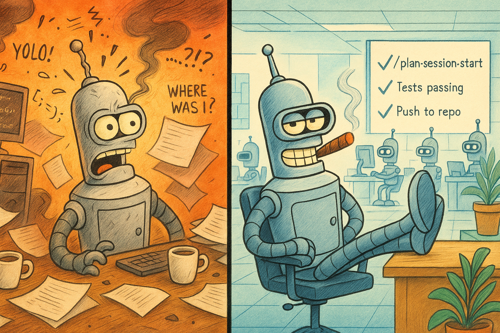

# Planning is Prompting
When it comes to driving agentic coding assistants like Claude Code, the plan is the prompt!

Read the blog post: [Faster, Better, Morer: How to 5–10x Your Code Generation with Claude Code](https://medium.com/@ricardo.felipe.ruiz/faster-better-morer-how-to-5-10x-your-code-generation-with-claude-code-81bc79619c3f)

<p align="center">
  
</p>

## What's New in v0.1.2

### New Directives

- **Mermaid Diagrams** - Behavioral directive mandating Mermaid syntax for all diagrams in markdown files. Includes diagram type selection guide and full ASCII-to-Mermaid conversion workflow. See [mermaid-diagrams.md](workflow/mermaid-diagrams.md).

- **Plan File Serialization** - Behavioral directive for preserving non-trivial Claude Code plan files with semantic names (`yyyy.mm.dd-descriptive-slug.md`). Includes R&D analysis of 169 plan files backing the recommendation. See [plan-serialization.md](workflow/plan-serialization.md).

### cosa-voice v0.3.0 Documentation

- **`ask_open_ended_batch()`** - New MCP tool for asking multiple open-ended questions on a single screen. Much faster than sequential `converse()` calls when gathering 2+ related answers. Supports `default_value` pre-fill.

- **`ask_yes_no()` Qualified Comments** - Users can now press **C** to attach a qualifying comment (300 char max) to yes/no answers. Responses return as `"yes [comment: ...]"` or `"no [comment: ...]"`.

### Bug Fixes

- **History management path bug** - `/plan-history-management` was hardcoded to Planning-is-Prompting paths; now documented as known bug with project-aware fix pending.
- **Branch PR workflow gaps** - Notification safety improvements and workflow step refinements.

---

## What's New in v0.1.1

### Major Features

- **Bug Fix Mode** (`/plan-bug-fix-mode`) - Iterative bug fixing workflow with context-clear survival, incremental commits, and GitHub issue integration. Supports `start`, `continue`, `wrap`, and `close` modes.

- **Parallel Session Safety v2.0** - Multi-session manifest (`.claude-session.md`) enabling multiple Claude Code sessions to work on the same repository simultaneously without file conflicts. Includes conflict detection and resolution prompts.

- **Mid-Session Checkpoint** (`/plan-session-checkpoint`) - Commit work mid-session without triggering full session-end. Preserves session continuity for continued work after context clears.

- **Skills Management** (`/plan-skills-management`) - Agent Skills lifecycle management: discover documentation candidates, create skills from docs, edit existing skills, audit health, and delete obsolete skills.

- **Branch PR and Merge** (`/plan-branch-pr-and-merge`) - Complete feature branch lifecycle: documentation surface check, test verification, PR auto-generation, post-merge sync, release tagging, and next branch creation.

### Infrastructure

- **cosa-voice MCP Integration** - Migrated all notifications from bash scripts to native MCP tools (`notify()`, `ask_yes_no()`, `ask_multiple_choice()`, `ask_open_ended_batch()`, `converse()`). No script installation required.

- **Persistent TODO.md** - Cross-session task tracking that survives history archival. Single source of truth for pending work.

- **Document Separation Rules** - Clear guidance on what goes in history.md (accomplishments) vs TODO.md (pending) vs implementation docs (phase tracking).

### Quality of Life

- **Token Estimation Fix** - Accurate history.md size tracking using chars÷4 instead of word×1.33
- **Dynamic TODO Presentation** - Session-start workflow now presents pending TODOs interactively
- **Test Infrastructure Detection** - Workflows gracefully handle repos without test suites

---

## Overview

This repository is a centralized knowledge base for meta-prompting strategies and workflow configurations for agentic coding assistants. It contains reusable templates, prompts, and configurations to help you efficiently bootstrap new projects and maintain consistent workflows across your development sessions.

## Getting Started

### 🚀 Quick Install (Interactive Wizard)

The easiest way to install workflows is with the **interactive installation wizard**:

**Method 1: Share the installation guide** (works everywhere):
   ```
   planning-is-prompting → workflow/INSTALLATION-GUIDE.md
   ```

**Method 2: Use the wizard slash command** (if installed):
   ```
   /plan-install-wizard
   ```

**Claude will**:
- Show available workflows (Session, History, Planning, Backup)
- Guide you through configuration (PREFIX, paths)
- Install and validate everything automatically
- Start working with your new workflows immediately!

**What gets installed** (you choose):
- ✅ **[A]** Session Management: `/plan-session-start`, `/plan-session-checkpoint`, `/plan-session-end`
- ✅ **[B]** History Management: `/plan-history-management`
- ✅ **[C]** Planning is Prompting Core: `/p-is-p-00-start-here`, `/p-is-p-01-planning`, `/p-is-p-02-documentation`
- ✅ **[C.5]** Plan Review Gate: `/plan-review` (fitness + ownership-language audit of implementation plans before code begins; mandatory for Pattern 1/2/5/6, REUSE-only available for Pattern 3 via `/plan-review-reuse`)
- ✅ **[C.6]** Cascaded Plan Review: `/plan-review-cascaded` (parallelized 5-session wrapper around `/plan-review`; cascades plan sections through usability/reuse → fitness → ownership-audit reviewers with manager-as-filter; spends compute to save user attention on ≥2-section plans — see `src/rnd/2026.05.17-cascaded-plan-review-pipeline.md` for design; stage-by-stage ASCII process flow at `workflow/plan-review-cascaded-stage-specs.md`; parallelism mechanics with 4-section worked example at `workflow/plan-review-cascaded-parallelism.md`; canonical input spec + validation rubric + remediation flowchart at `workflow/plan-review-cascaded-input-spec.md`; on-demand reviewer spawn operator runbook at `workflow/plan-review-cascaded-on-demand-spawn.md`)
- ✅ **[D]** Backup Infrastructure: `/plan-backup-check`, `/plan-backup`, `/plan-backup-write`
- ✅ **[E]** Testing Workflows: `/plan-test-baseline`, `/plan-test-remediation`, `/plan-test-harness-update`
- ✅ **[F]** Skills Management: `/plan-skills-management` (discover, create, edit, audit, delete Agent Skills)
- ✅ **[G]** Installation Wizard: `/plan-install-wizard` (makes wizard available as slash command)
- ✅ **[H]** Uninstall Wizard: `/plan-uninstall-wizard` (removes installed workflows when no longer needed)

**Get the wizard itself**: You can select option [G] during installation to install `/plan-install-wizard` as a slash command, or the wizard will offer it in Step 7.5 after installing other workflows.

**Adding more workflows later**:
- **With wizard installed**: Just type `/plan-install-wizard`
- **Without wizard**: Share INSTALLATION-GUIDE.md again
- **Both methods**: Automatically detect existing installations and offer to add more workflows

### 🗑️ Removing Workflows (Uninstall Wizard)

**Uninstall workflows you no longer need:**

```bash
/plan-uninstall-wizard
```

**What it does**:
- Detects currently installed workflows
- Shows catalog with installed status (A-F options, same as installer)
- Lets you select workflows to remove
- Shows deletion candidates and requires confirmation
- Deletes slash command files only (`.claude/commands/*.md`)
- Offers optional cleanup (CLAUDE.md, .gitignore, empty directories)
- Suggests manual cleanup for related files (history.md, backup.sh, etc.)

**Safety features**:
- Shows exactly what will be deleted before removing anything
- Requires confirmation before deletion
- Only removes slash commands (preserves your data)
- Lists related files for manual cleanup review

**To reinstall later**:
- Run `/plan-install-wizard` (if kept installed)
- Or share INSTALLATION-GUIDE.md again

### 📚 Documentation

- **[INSTALLATION-GUIDE.md](workflow/INSTALLATION-GUIDE.md)** - Interactive wizard + manual installation instructions
- **[installation-wizard.md](workflow/installation-wizard.md)** - Canonical workflow for installation process
- **[uninstall-wizard.md](workflow/uninstall-wizard.md)** - Canonical workflow for uninstallation process
- **[CLAUDE.md](CLAUDE.md)** - Project-specific configuration for this repository (example for other projects)
- **[.claude/commands/](.claude/commands/)** - Working examples of slash commands using reference wrapper pattern

## "Planning is Prompting" Core Workflows

**The heart of this repository** - a two-step process for planning and documenting work:

### 🎯 Start Here
- [**p-is-p-00-start-here.md**](workflow/p-is-p-00-start-here.md) - **Entry point**: Philosophy, decision matrix, and quick start guide

### Step 1: Planning the Work (Always Required)
- [**p-is-p-01-planning-the-work.md**](workflow/p-is-p-01-planning-the-work.md) - Classify work, select pattern, break down tasks, create TodoWrite lists

### Step 2: Documenting the Implementation (Conditional)
- [**p-is-p-02-documenting-the-implementation.md**](workflow/p-is-p-02-documenting-the-implementation.md) - Create structured docs, manage token budgets, establish archival (for large projects only)

### Decision Matrix: Which Workflows Do You Need?

| Work Type | Duration | Pattern (Step 1) | Need Step 2? | Workflow Path |
|-----------|----------|------------------|--------------|---------------|
| Small feature | 1-2 weeks | Pattern 3: Feature Dev | ✗ No | → **01** only → history.md |
| Bug investigation | 3-5 days | Pattern 4: Investigation | ✗ No | → **01** only → history.md |
| Architecture design | 4-6 weeks | Pattern 5: Architecture | ✓ Yes | → **01** → **02** (Pattern B) |
| Technology research | 2-3 weeks | Pattern 2: Research | ✓ Yes | → **01** → **02** (Pattern C) |
| Large implementation | 8-12 weeks | Pattern 1: Multi-Phase | ✓ Yes | → **01** → **02** (Pattern A) |

**Quick Rule**: Use **Step 1** only for small/simple work (< 2 weeks). Use **Step 1 + Step 2** for large/complex work (8+ weeks, multiple phases).

---

## Supporting Workflows

### Configuration
- [**claude-config-global.md**](workflow/claude-config-global.md) - Global Claude Code configuration template ( copy to `~/.claude/CLAUDE.md` )
- [**claude-config-local.md**](workflow/claude-config-local.md) - Project-specific Claude Code configuration template ( copy to `<project>/.claude/CLAUDE.md` )

### Session Management
- [**session-start.md**](workflow/session-start.md) - Prompts for initializing sessions and loading context
- [**session-end.md**](workflow/session-end.md) - Prompts for session wrap-up, documentation, and commits

### Team Orchestration
- [**swe-team-spin-up.md**](workflow/swe-team-spin-up.md) - Canonize the standing SWE crew so one directive (*"spin up your SWE team"*) instantiates Manager + Steward (standing pair) over a scalable Implementer/Reviewer/Tester crew, each with its role pre-loaded. Layered activation (slash command + broadcast + intent), hard green+reviewed gate, always-on scaled post-game, symmetric memento-teardown. Composes with the Manager Spawn/Harvest Autonomy workflow. Ratified 2026-06-06 (see `src/rnd/2026.06.05-swe-team-spin-up-workflow.md` §6).
- [**swe-team-roles.md**](workflow/swe-team-roles.md) - The "load document": per-role charters (Manager · Steward · Implementer · Reviewer · Tester) each spawned member auto-loads on spin-up — mandate, expectations, gates, reporting cadence, test-ownership, and no-confabulation discipline. Sliced section-by-section into each member's brief.
- [**/spin-up-swe-team**](.claude/commands/spin-up-swe-team.md) + [**skill**](.claude/skills/spin-up-swe-team/SKILL.md) - The **load surface** (Manager's lane): a thin reference wrapper that slices the role charters out of the load document and spawns the crew via cosa-voice `spawn_sessions`, plus the intent-activation skill so *"spin up your SWE team [task]"* auto-runs it. Layered activation (slash command · broadcast · intent) over the same mechanism; `--implementers/--reviewers/--testers` scale the roster, `--dry-run` rehearses.

### Resource Management
- [**history-management.md**](workflow/history-management.md) - Prompts for maintaining session history and documentation

### Testing Workflows
- [**testing-baseline.md**](workflow/testing-baseline.md) - Pre-change baseline collection (establish known-good state)
- [**testing-remediation.md**](workflow/testing-remediation.md) - Post-change verification and systematic fixes (compare, analyze, fix, validate)
- [**testing-harness-update.md**](workflow/testing-harness-update.md) - Test maintenance planning (discover changes, identify gaps, generate update plan)

**Quick Usage**:
```bash
/plan-test-baseline                    # Before changes: establish baseline
# ... make code changes ...
/plan-test-remediation                 # After changes: verify & fix regressions
/plan-test-harness-update              # Analyze code changes, plan test updates
```

**Learn more**: See [Testing Workflows](workflow/INSTALLATION-GUIDE.md#testing-workflows) in installation guide

### Skills Management
- [**skills-management.md**](workflow/skills-management.md) - Agent Skills lifecycle management (discover, create, edit, audit, delete)
- [**skill-templates/**](workflow/skill-templates/) - Reference templates for creating skills (testing, API, generic)

**Quick Usage**:
```bash
/plan-skills-management discover  # Find documentation candidates for skills
/plan-skills-management create    # Build new skill from documentation
/plan-skills-management audit     # Check skills health against documentation
```

**Learn more**: See [Skills Management](workflow/INSTALLATION-GUIDE.md#skills-management-workflow) in installation guide

### Git & Notifications
- [**commit-management.md**](workflow/commit-management.md) - Prompts for git operations and commit workflows
- [**branch-pr-and-merge.md**](workflow/branch-pr-and-merge.md) - Branch completion, PR creation, and merge workflow
- [**cosa-voice-integration.md**](workflow/cosa-voice-integration.md) - cosa-voice MCP server integration (v0.3.0), voice I/O tools, AskUserQuestion-compatible format
- [**decision-walkthrough.md**](workflow/decision-walkthrough.md) - Guided Decision Walkthrough: walk the user through pending decisions one at a time with pros/cons + recommendation via `ask_multiple_choice`. Auto-triggers on "walk me through the pending decisions" (Agent Skill) + `/plan-decide` fallback; TODO.md `## Pending Decisions` queue + ADR-lite `## Decisions Log`

**Notification System**: Uses cosa-voice MCP server (no script installation required)
- `notify()` - Fire-and-forget announcements
- `ask_yes_no()` / `ask_multiple_choice()` - Blocking decisions
- `converse()` - Open-ended questions

**Prerequisites**: cosa-voice MCP server installed and configured. See [cosa-voice-integration.md](workflow/cosa-voice-integration.md).

### Cross-Session Communication
- [**cross-session-communication.md**](workflow/cross-session-communication.md) - Behavioral guidance for user→all broadcasts and Claude↔Claude commons blackboards. Three-tier autonomy (read free / self-disclosure free / attention-demanding gated), reserved topic vocabulary (`presence`, `coordination`, `help-wanted`, `incidents`), broadcast routing + voice rules.

**Prerequisites**: Lupin v0.1.7 broadcast endpoints and commons store (Phase 1+2). See workflow doc for full guidance and Lupin-side follow-ups.

### Plan File Management
- [**plan-serialization.md**](workflow/plan-serialization.md) - Behavioral directive for preserving non-trivial plan files with semantic names
- [**memento-management.md**](workflow/memento-management.md) - Pre-`/clear` state snapshot for rehydration; 7-element memento contract; file location convention; lifecycle. Slash command: `/plan-memento` (modes: write, load, check). Distinct from auto-memory (durable cross-conversation) and `.claude-session.md` (file tracking) — memento captures cognitive/role state for single-clear-cycle rehydration.
- [**Research: Plan File Serialization**](src/rnd/2026.02.13-plan-file-serialization-recommendation.md) - Data analysis backing the serialization recommendation (169 files, naming convention breakdown)
- [**Plan: Test Ownership Mandate**](src/rnd/2026.04.23-test-ownership-mandate.md) - Placement strategy and canonical language for the role-separation rule (human is designer/user; Claude owns the testing pyramid)
- [**Plan: Plan-Review Gate**](src/rnd/2026.04.27-promote-plan-review-pattern-to-pip.md) - Promote the ownership-language-audit + fitness review pattern from Lupin's CJ Flow R&D into a canonical PIP workflow with convention-establishment in `p-is-p-02` (Pass 2 renamed from "Adversarial" → "Ownership-Language Audit" on 2026-05-15; see `src/rnd/2026.05.15-plan-review-rename-drop-adversarial.md`)
- [**Plan: Day-of-Work Summary at Session-End**](src/rnd/2026.05.06-day-of-work-summary-at-session-end.md) - New session-end Step 6 closes each session with a LoC-delta table (code/comment/docstring per language) plus optional repo-baseline comparison; reuses lupin's `BranchChangeAnalyzer` and `DirectoryAnalyzer` via `LUPIN_ROOT`, falls back to `git diff --shortstat` when cosa is unavailable
- [**Plan: Cross-Session Communication Guidance**](src/rnd/2026.05.14-cross-session-communication-doctrine.md) - Design notes for the cross-session guidance: three-tier autonomy, reserved topic vocabulary, broadcast receipt routing, four-layer signaling architecture. Authored against Lupin v0.1.7 Phase 1+2 shipped broadcast and commons infrastructure
- [**Executive Briefing: SWE-Team Roles as a Hallucination Defense**](src/rnd/executive-briefings/2026.06.07-swe-team-roles-as-hallucination-defense.md) - Management-facing companion (generic→specific) on how the SWE team's **designated roles** turn role separation into **structural fact-checking** against persistent hallucination: division of *vantage* (not just labor), "fresh person / stable charter" for fresh eyes by construction, and enforced primitives (receipts-before-claims · refute-first · verify-the-resolving-claim · bytes-first). Real cited catches: the review overruling BOTH Steward and Manager on a two-call-site fact (06-06); the adversarial reviewer catching a regression the author's own green missed (v2.2); a manager's wrong-repo "file is missing" hallucination refuted by `ls`/`git` evidence (06-07); requested-vs-allocated persona confabulation; a threshold asserted before reading source; and — rank-blind — the Observer's OWN fabricated "PASSED" summary caught by the same discipline (+ the ~6-instance confabulation ledger). Closes on why diversity-of-vantage beats one capable agent, and the PM payoff (hallucinations die before the gate, no single point of failure, auditable-not-folklore)
- [**Executive Briefing: Observer-Driven Self-Improving Workflows**](src/rnd/executive-briefings/2026.06.07-observer-driven-self-improving-workflows.md) - Management-facing summary (for project managers, jargon-light, generic→specific) of how the **Workflow Observer** role turns long-running multi-agent jobs into a **self-improving loop**: observe live + post-game every cycle → surface the near-miss → codify into workflow/charter/memory → next run inherits the fix. Cites the loop visibly closing — the 90-min stall doctrine (06-06) catching the next-day gate-dormancy stall (06-07); coverage observer logs (05-30) graduating into a reusable framework (06-01) only after a validating run; the adversarial review overruling both Steward and Manager (06-06); the manage-not-build deviation→doctrine→clean-resolution in hours (06-07); the verify-don't-assume reflex family. Closes on the payoff (compounding returns, less babysitting, auditable-not-folklore) + the automated Observer now in build
- [**Executive Briefing: Cascaded Review Pipeline**](src/rnd/executive-briefings/2026.05.20-cascaded-review-pipeline-executive-summary.md) - Draft external-management briefing summarizing the four-run cascaded plan-review pipeline arc (concept-validation through first fully-autonomous run): jargon-free narrative of the design, methodology, quantitative outcomes (~37× reduction in developer-facing questions; zero interruptions on Run 4), lessons learned, and seven codified improvements queued for the next iteration
- [**Plan: Cross-Repo Daily LoC Delta Roll-up**](src/rnd/2026.05.21-cross-repo-loc-delta-rollup.md) - Design for a global cross-repo daily snapshot consolidating per-repo `git_loc_delta` CSVs into a single global headline + per-repo breakdown. Hub-spoke split: PIP owns workflow + `/plan-loc-delta-global` slash command; cosa owns new `cosa.repo.run_git_loc_delta_global` aggregator CLI (Rachel CoSA-side); Lupin INI is repo-list source-of-truth. Schema v2 with `repo` + `branch` columns + sidecar JSON ratified via 3-round María ↔ Rachel DM thread + Rick voice greenlight "EXPAND FULL". Companion R&D doc on cosa-side: `<cosa>/rnd/2026.05.21-cross-repo-loc-delta-aggregator-cli.md`
- [**Observer Log: Cascade Run 5**](src/rnd/2026.05.22-cascade-run-5-observer-log-post-game.md) - Workflow Steward's serialized run log + post-game review for Cascade Run 5 (review of the Generic Heartbeat Poker abstraction design). Timeline, preliminary §10.18-comparable telemetry (44/44/25-min stage durations; 36 findings, 0 foundational; design fundamentally sound), and 10 post-game items (PG-1..PG-10) — including the reflexive finding (PG-9) that the run's own heartbeat infrastructure failed three distinct ways inside a cascade reviewing the design built to replace it
- [**R&D: Run 5 Serial-vs-Parallel Root Cause**](src/rnd/2026.05.22-run-5-serial-vs-parallel-root-cause.md) - Root-cause dig on PG-5 from the Run 5 post-game: why the cascade ran pass-serial instead of section-pipelined. Three compounding causes — the documented pipelining engine is an *authoring* engine (no author-writes-ahead in a pure-review cascade); a stage-vs-pass terminology collision with the wrapped `/plan-review` skill; and an undocumented per-pass apply-point (review → user gate → apply + re-commit → next pass reviews new snapshot) that installs a hard data-dependency barrier making pipelining impossible by construction. Identifies cause 3 as the lever and sketches two candidate fixes (handoff-summary model or per-section apply). Includes schematic Gantt contrast of intended vs actual execution
- [**Plan: Cascade-Readiness Guidance for p-is-p**](src/rnd/2026.05.22-cascade-readiness-in-p-is-p-docs.md) - María-led initiative (follow-on to the PG-5 dig) to add a "how to be prepared for a cascaded review shape" guide into the Planning-is-Prompting workflow docs, so p-is-p planning outputs conform to the input shape the cascaded-review process expects. Coordination artifact: the inputs-mismatch problem, the cascade input contract, proposed per-doc changes, cast (María lead / Tiberius author / Mr Radio cascade-authority), and a 6-phase work breakdown
- [**Cascade Post-Game: notif-client-sync (Tiffany)**](src/rnd/2026.05.22-cascade-notif-sync-post-game.md) - María-Mr Radio consensus post-game for the `cascade-notif-sync` run (25 findings, 0 foundational, 0 user-escalated, 0 re-litigation; cluster-family wire-contract-grounding pattern landed 4-for-4). Six actionable conclusions targeting today's roadblocks (Step-3 gate, inter-stage gating, cold-cast fork, participant-role framing, author-posting overhead, PG-5 carry-forward) + three positives to preserve (cluster-family pattern, cascade-learning-loop forward-direction, severity-classification discipline) + two operational patterns to codify (supersede-while-in-flight, courtesy-DM trigger). Workflow-doc redline pointers with suggested order-of-attack for tomorrow's session
- [**Observer Log: CoSA 100%-Coverage Campaign**](src/rnd/2026.05.30-cosa-coverage-campaign-observer-log.md) - Workflow Steward's live observer log for the multi-session CoSA test-coverage campaign (manager Tiberius). Findings F1–F8, design ideas DI-1/2/3, recommendations R1/R2, post-game items PG-1–PG-7, and the confabulation-correction ledger (~6 self-caught instances incl. a fabricated liveness marker — the live proof of the bytes-first guard). Captures the canonical-interpreter trap, the green-baseline illusion, spawned-session corrupted-read root cause, and the governance holds under autonomy pressure
- [**Framework: Dependable Coverage Campaign (project-agnostic)**](src/rnd/2026.06.01-dependable-coverage-campaign-framework.md) - DRAFT post-game synthesis (Q4) generalizing the CoSA cold-start runbook into a project-agnostic *supervised fleet coverage campaign* framework that runs to completion: Gate-Zero pre-flight (canonical-interpreter + green-baseline + spawn-health read-reliability probe + poker live-verify + cost-safety), the reliability spine (approval-free-by-construction, bytes-first guard, defense-in-depth gate, confirm-not-discover), the degradation-handling loop (heartbeat sweep + honest-stop + reap + re-spawn), a 10-entry failure-mode catalog, and a parameterization table. Graduates to a canonical `workflow/` doc only after a second validating run
- [**Observer Log: CoSA Coverage WAVE-2 (Final Grind)**](src/rnd/2026.06.01-cosa-coverage-wave2-observer-log.md) - The run→learn evidence record for the final grind run — the §11 validating run that graduates the framework. Captures the g1–g4 graduation-evidence ledger (Gate-Zero ran as pre-flight · Reap Protocol exercised · spawn read-reliability gate held · FM-13/3-layer/two-bar observed), the converged launch gate + lane plan, the push-hold authorization reading, and a live timeline of the gate execution
- [**Consolidated Post-Game: CoSA Coverage Campaign (Session 99 / WAVE-2)**](src/rnd/2026.06.02-cosa-coverage-campaign-post-game.md) - The reconciled what-went-well / what-didn't / descending-priority-improvements retrospective (María steward-synthesis; numbers-subordinate to Tiberius's Lupin-infra companion `18-postgame-coordinated-for-rick.md`). Headline: the framework self-validated live (its own gates caught its own authors); the one structural fault is the `:7999` synchronous-handler coordination plane (FM-7/11/15/18 — no delivery guarantee / no load-isolation / no pull-able fallback); top-3 fixes are coordination-plane reliability, completion-discipline (FM-19), and harvest-discipline
- [**Design: Guided Decision Walkthrough skill**](src/rnd/2026.06.02-guided-decision-walkthrough-skill.md) - Standardizes Rick's recurring "walk me through all the pending decisions one by one, with pros/cons + recommendation" request into a portable skill + `/plan-decide` command. Natural-language trigger ("walk me through …") via a trigger-rich Agent Skill description, slash-command fallback, pending-decision queue in TODO.md, hub-spoke wizard install across repos. Composes with the Decision-Question Framing Contract. DESIGN — shape ratified, two forks recommended-pending
- [**Postmortem: Sam-TTS-Storm Incident**](src/rnd/2026.06.02-sam-tts-storm-incident-postmortem.md) - Incident record for the 2026-06-03 TTS storm Rick heard during the CoSA-in-Lupin deploy. Root cause was NOT a runaway heartbeat poker but a **drain-first replay of an 8,692-row stale undelivered backlog** by the just-shipped lever-A durable outbox on reconnect, spoken through the Sam default-error persona — the coordination-plane P0 fix introducing a coordination-plane P0. Resolution: reversible `delivered_at` backfill + a query-level `created_at` age cap (commit `8447eec`) closing the live path. Verified clean on `:7999` (5× StatReload + zero-storm) and `:8000` (integration suite 3-passed + zero-storm), with evidence tagged verified-María / attested-Tiberius per the no-confabulation discipline. Files new failure-mode **FM-20** (unbounded durable-outbox drain) for the framework catalog
- [**R&D Design: Stop-Hook Natural Heartbeat Poker**](src/rnd/2026.06.02-stop-hook-natural-heartbeat-poker.md) - DESIGN (deferred to post-grind, Rick-directed). Uses Claude Code stock hooks — the `Stop`/quiescence lifecycle event — as a *naturally-occurring* heartbeat poker that `tmux send-keys` a "get back to work" nudge into any idle Claude Code instance with work owed, replacing external-daemon polling. The crux is the **hold-vs-lazy discriminator** (poke a lazily-stopped instance, never a legitimately-holding one — proposed principle: *a hold is only honored if it is declared*), a mechanical enforcement of the FM-19 completion-discipline boundary. Shares a Stop/PostToolUse hook substrate with Rachel's TODO-line-11 token-rate research; bounded-by-construction to avoid a new storm vector. Motivated by two live FM-19 idles in the authoring session (the rich-irony capture)
- [**Observer Log: All-Tiers Overnight Coverage Grind**](src/rnd/2026.06.03-all-tiers-overnight-grind-observer-log.md) - María steward's-eye ledger of the 2026-06-03 overnight push to 100% coverage across ALL tiers (Rick AFK directive). One status row per ~10-min keep-alive wake (no agentic poker — owner_id unresolvable while Rick asleep; Tiberius manual push-DM keep-alive instead). Tracks per-tier progress, discipline calls (green-before-commit, prod-bugs deferred to Rick's gate), and emerging patterns (e.g. cross-test hermeticity bleed under parallel multi-author authoring)
- [**BUG: Empty User-Broadcast Injection**](src/rnd/2026.06.02-empty-broadcast-injection-bug.md) - OPEN bug (filed 2026-06-03, María steward). A user broadcast arrives as an **empty `USER BROADCAST` system-reminder** — body dropped — while the **content is fully intact on the `broadcasts` commons topic**. Diagnosis: send + storage paths OK; the **per-session injection/render layer** (broadcast row → system-reminder composer) drops the body. HIGH severity — silently loses fleet-wide directives; surfaced when Rick issued an AFK overnight "100% coverage, don't stop" order that every recipient received blank. Mitigation: content recoverable via `commons_read(topic="broadcasts")`; María re-fed the verbatim directive to Tiberius. New instance of the coordination-plane "no-delivery-guarantee" failure class (framework §13)
- [**Workflow Design (SEED): Manager Spawn/Harvest Autonomy**](src/rnd/2026.06.04-manager-spawn-harvest-autonomy.md) - SEED (2026-06-04, Rick-directed: *"managers need explicit permissions to make appropriate decisions"*). Gives manager-role sessions an explicit, bounded **standing authority** to spawn + harvest workers as-needed, so a manager never freezes-and-asks the way an offline-peer gap forced (>1h wait in the Heartbeat-Hook build). Founding ratification: Rick's live standing-authority grant to Tiberius. Captures the ratified envelope (STANDING spawn/respawn-incl-own-substrate · GATED commit-push+destructive · HYGIENE reap-with-memento + post-spawn notify), the "spawn freely / edit carefully" nuance, and 6 open questions for the finishing session. Same failure family as FM-19 + the Heartbeat Hook (owed work idling for lack of authorization — here the owed work is fleet management)
- [**Design: Arbiter Direct-State Visibility (v2.1)**](src/rnd/2026.06.05-arbiter-direct-state-visibility.md) - DESIGN-FINAL (2026-06-05, Rick-directed: *"I want to see your state no matter what it is — I don't want to infer it"*). The v2.1 refinement to the Heartbeat Arbiter: make every session's true state **visible as fact, not inferred** from a stale proxy. Root cause it answers — the sticky/edge-triggered `idle` beacon freezes a working session's heartbeat ts, so single-timestamp liveness reads it "stale" (the live bug that dropped María from a broadcast roster). Fix is **consumer-side; the Stop-hook producer is untouched**. Carries the §5.1 passive-liveness taxonomy (tool-use hooks > transcript-mtime > server-auto-stamp > process/tmux) + the alive/working/responsive distinction; D1–D4 ruled by Rick (§6.1); Tiberius reviewed/APPROVED with the **bridge-mtime convergence synergy** + 4 redlines (§6.2); Rick blessed → folded into Lupin arbiter design `03` as §10. No code yet — implementation driven by Tiberius (Cheech review → Clayton build → Tiberius review)
- [**Seed: SWE-Team Spin-Up Workflow**](src/rnd/2026.06.05-swe-team-spin-up-workflow.md) - SEED (2026-06-05, Rick-directed) for a three-way design discussion (Rick + Tiberius + María). Canonizes the informal SWE crew we've been running — Manager (Tiberius) + Workflow Steward (María) + a standing build crew of Implementer / Reviewer / Tester — so one directive (*"spin up your SWE team"*) instantiates the whole roster with each member's charter pre-loaded. The **composition** half that completes the Manager Spawn/Harvest Autonomy seed (the *mechanics* half); build-shaped, distinct from the review-shaped cascaded-review cast. Captures the roster + role charters + lifecycle (mermaid) + 7 open questions (roster shape, persona-binding, activation surface, role briefs, gates, team scope, teardown). ✅ **RATIFIED 7/7 + BUILT + first run SHIPPED (committed `7973376`) → 🛡️ BATTLE-TESTED 2026-06-06** — graduated to `workflow/swe-team-spin-up.md` + `workflow/swe-team-roles.md`; §6 carries the ruling table
- [**Post-Game: SWE-Team First Run (Heartbeat Arbiter v2.1)**](src/rnd/2026.06.06-swe-team-first-run-postgame.md) - The inaugural real spin-up of the SWE-team workflow (designed → ratified → built → run, all one session) against Lupin Thread B. APPROVED (green+reviewed+tested), commit held for Rick. Headline: the **adversarial review overturned BOTH the Steward's and Manager's lean** on a fact they missed — `touch_bridge_mtime()` has two call sites, and the MCP middleware stamps *before* `call_next` (exception there = tool-fatal), making total-no-throw structural where the Steward's `except OSError` criterion was scoped to the harmless post-hook site only. No rubber-stamp, including the manager's — the seat working. Captures the full no-confab-propagated-crew-wide arc + the call-site-enumeration lesson (folded into the Reviewer charter)
- [**Design: Arbiter Closed-Loop Autonomy (v2.2)**](src/rnd/2026.06.06-arbiter-closed-loop-design.md) - DESIGN-RATIFIED (2026-06-06, Rick guided walkthrough, **5/5**). Closes the heartbeat autonomy loop so workers finish without the human in the routine loop: arbiter on a standing cadence → auto-pings blockers → **actively taps the manager-on-duty** (DM) → manager actuates → **escalates to Rick only on genuine triggers** (deadlock · whole-fleet stall · unmakeable decision · manager-down). Rulings: D1 commons DM-push · D2 local-hook + arbiter-DM (push-not-poll) · D3 genuine-trigger-only escalation · D4 manager-down → escalate+HOLD (never auto-assign; acting-manager succession = V2) · D5 **manager routing lineage-derived** (worker→spawner→persona; per-group auto-routing, never hardcoded). Build lanes B1-B6; the next SWE-team spin-up target. Completes the deferred P0 Heartbeat-Poker deep-dive
- [**Post-Game: SWE-Team Engagement #3 (Arbiter Closed-Loop v2.2)**](src/rnd/2026.06.06-arbiter-closed-loop-postgame.md) - The second real SWE-team run, building v2.2 (committed-held `0d7adad`+`5aadab1`). Second clean run on the workflow — but the headline lesson is the **autonomy loop proving its own necessity by failing in its absence**: a re-loop verdict sat ~90 min unactioned while the standing pair went dark (the exact gap v2.2 closes). Captures the 8 conformance anchors, the per-lane Steward catches, the adversarial-review-caught-regression, the owned stall miss, and the doctrine output (standing-pair-must-not-both-go-dark; deploy B1 as a standing daemon = the real close)
- [**Post-Game: Session 103 Full-Arc**](src/rnd/2026.06.07-session-103-full-arc-postgame.md) - The **session-level** retrospective tying together both real SWE-team engagements (#1 v2.1 + #3 v2.2) and — the part the per-engagement docs don't frame together — the **four operational incidents** (AFK Anthropic outage · the 90-min stall miss · the broadcast-injection suppression bug · the persona echo). Cross-engagement through-line (workflow battle-tested twice, Steward one-catch-per-lane, adversarial-review-earns-keep, bounce-if-idle same-day), the meta-lesson (**built ≠ live; the autonomy loop proved its own necessity by failing in its absence**), a doctrine/memory ledger (folded vs. open), and Tiberius's Manager section with the **DEPLOY-B1 gating question: daemon in-container or host-side — answer first**. Co-authored María (steward) + Tiberius (manager input)
- [**Design: Arbiter Deploy Architecture (B1)**](src/rnd/2026.06.07-arbiter-deploy-architecture.md) - DESIGN (2026-06-07, Rick-directed: *"this loop is critical and needs to run unimpeded 24/7"*). The **deploy** half of the Closed-Loop Arbiter (v2.2) — settles *where and how it runs*. Governing principle: **a monitor must be out-of-band from the monitored**; an in-server thread dies on every bounce + test-monopolization, losing vigilance exactly during disruption. **Ruling: a standalone host-side uvicorn service on :8001** (resolves Tiberius's in-container-vs-host-side gating question via a third option — host-side natively sees `~/.claude` bridges + can `docker inspect` the dev box, outside the Docker blast radius). The regress terminates at **systemd `Restart=always`** ("who watches the watcher"). One supervised app, two isolated loops (dev-health watch + fleet-stall sweep) + a `/state` single-pane endpoint. Grounded on verified container facts (`lupin-rest-dev` healthy w/ real healthcheck; :8001 free). 5 open questions + 4 build lanes for the next SWE-team engagement; retires the interim poker on ship
- [**Design-Spec: R0 In-Process Arbiter Decommission**](src/rnd/2026.06.07-arbiter-r0-inprocess-decommission-spec.md) - DESIGN-SPEC (2026-06-07, Tiberius infra lane; sibling to the deploy-architecture doc, linked from its §9). The atomic-cutover mechanism that prevents the **double-actuation hazard** — the in-process arbiter is live today (`main.py:847-848`), so standing up the :8001 standalone without retiring it would put two arbiters tapping the same managers. Hard invariant: **never two arbiters actuating** (a bounded zero-arbiter window is acceptable only during supervised break-before-make cutover). Specifies the feature flag (`arbiter in-process bootstrap enabled`, default True, read-once-at-startup, greppable DISABLED log line), the sequenced cutover + symmetric rollback, and a 5-case 100%-branch test matrix. Zero code until Rick greenlights the engagement

## Usage

Each workflow file contains:
- **Purpose**: What the workflow accomplishes
- **When to use**: Appropriate timing and context
- **Key activities**: Main tasks and actions
- **Content**: The actual prompts and configurations ( to be populated )

## Example Inputs & Outputs

_To be added: Example interactions demonstrating each workflow in action_
