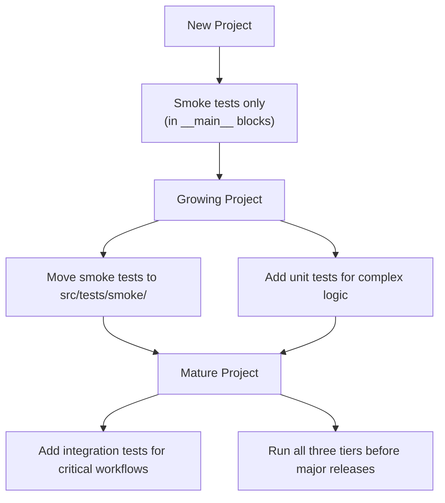

## Session Workflows

**Session Start**: Read history.md, TODO.md, and implementation document at start of each session

**Session End**: Use project-specific slash command (e.g., `/plan-session-end`) or see planning-is-prompting → workflow/session-end.md

**For workflow installation in new projects**: See planning-is-prompting → workflow/INSTALLATION-GUIDE.md

## PARALLEL SESSION SAFETY (v2.0)

**Purpose**: Prevent accidentally committing files modified by parallel Claude sessions when multiple sessions work on the same repository.

**Mechanism**: Multi-section `.claude-session.md` manifest file in project root. Each session has its own section, enabling true parallel session support with conflict detection.

**Format Version**: 2.0 (Multi-Session)

### The Problem

When multiple Claude Code sessions work on the same repository simultaneously:
- Session A modifies `src/auth.py`, `src/utils.py`
- Session B modifies `src/database.py`, `tests/test_db.py`
- At Session A's commit time: `git status` shows ALL 4 files
- **Without tracking**: Session A commits ALL 4 files (wrong!)
- **With v2.0 tracking**: Session A commits only its 2 files (correct!)

### The Solution: Multi-Section `.claude-session.md` Manifest (v2.0)

**Format**:
```markdown
# Claude Session Manifest (Multi-Session)

**Format Version**: 2.0
**Last Updated**: 2026-01-31T10:30:00

---

## Session: 5c8a3081

**Started**: 2026-01-31T09:00:00
**Last Activity**: 2026-01-31T10:25:00
**Status**: active
**Project**: my-project

### Touched Files

- 2026-01-31T09:15:00 | src/auth.py
- 2026-01-31T09:30:00 | src/utils.py

---

## Session: a357ab00

**Started**: 2026-01-31T08:00:00
**Last Activity**: 2026-01-31T10:20:00
**Status**: active
**Project**: my-project

### Touched Files

- 2026-01-31T08:30:00 | src/database.py
- 2026-01-31T09:45:00 | tests/test_db.py

---
```

**At Session-Start** (Step 3.5):
1. Get session ID from `get_session_info()`
2. Check for existing manifest:
   - If v1.0 format → auto-migrate to v2.0
   - If v2.0 format → search for your session's section
3. Create/resume your section:
   - Found + active → resume (context clear recovery)
   - Not found → append new section
4. Check for stale sessions (>24h inactive)

**During Session** (after EVERY Edit/Write):

**MANDATE**: Find YOUR section and append to `### Touched Files`:
```markdown
- 2026-01-31T10:35:00 | workflow/session-start.md
```
Also update `**Last Activity**` timestamp in your section.

**At Session-End** (Step 3.5 + 4.4):
1. Read your section from manifest
2. **Conflict Detection**: Compare your files against other active sessions
3. If conflict detected → prompt user (Include mine / Skip conflicts / Cancel)
4. Stage ONLY files from your section (plus auto-includes)
5. **NEVER** use `git add .` or `git add -A`
6. Update your section: Status → `committed`, add commit hash
7. If only section → delete manifest; if others active → keep manifest

### Session Status Values

| Status | Meaning |
|--------|---------|
| `active` | Session running or may resume after context clear |
| `committed` | Session completed commit successfully |
| `stale` | Auto-detected: >24h inactive |

### Conflict Detection

When Session A commits and `src/config.py` was edited by both A and B:

```
⚠️  FILE CONFLICT DETECTED

  src/config.py
    • Session 5c8a3081 (this session): 2026-01-31T10:25:00
    • Session a357ab00 (other session): 2026-01-31T09:45:00

Options:
  [1] Include mine - I made the relevant changes
  [2] Skip conflicts - Let other session commit it
  [3] Cancel - I'll investigate first
```

### Manifest Lifecycle (v2.0)

| Event | Action |
|-------|--------|
| Session-start (new) | Create manifest with single section |
| Session-start (resume) | Find section by ID, update Last Activity |
| Session-start (parallel) | Append new section to existing manifest |
| Every Edit/Write | Append to YOUR section only |
| Session-end | Parse your section, check conflicts, selective commit |
| After successful commit | Update status to `committed`, add commit hash |
| Cleanup | Remove `committed` sections older than 7 days |
| Context clear | Manifest persists, section found by ID on resume |

### Auto-Include Files

These files are always included in commits even if not in your section:
- `history.md` - Session documentation
- `TODO.md` - If modified
- `CLAUDE.md` - If modified
- `bug-fix-queue.md` - If bug-fix-mode active (v2.0 format with Active Sessions table)

### Fallback: When Manifest is Missing

If `.claude-session.md` doesn't exist (session-start was skipped):
1. Display warning to user
2. Show all modified files from `git status`
3. Ask user: "Commit all", "Let me select", or "Cancel"

### Backward Compatibility

v1.0 manifests are auto-migrated to v2.0:
- If file starts with `# Claude Session Manifest (Multi-Session)` → v2.0
- If file starts with `# Claude Session Manifest` → v1.0 (migrate)

Migration is automatic and transparent.

### .gitignore Recommendation

Add to your project's `.gitignore`:
```
.claude-session.md
```

### ⚠️ SESSION ISOLATION RULES (CRITICAL)

**Multiple Claude sessions may run on the same repository simultaneously.** Each session has its own `## Session: {ID}` section. You **MUST** follow these rules:

**ABSOLUTE PROHIBITIONS**:
| ❌ NEVER | Why It's Forbidden |
|----------|-------------------|
| Modify another session's section | Corrupts their file tracking |
| Overwrite the entire manifest | Destroys all parallel sessions' data |
| Delete another session's section | They may still be working |
| Read another session's files and stage them | Mixes unrelated commits |
| Use `git add .` or `git add -A` | Stages another session's work |

**MANDATORY SCOPING**:
1. Get YOUR session ID: `get_session_info()`
2. Find YOUR section: `## Session: {your_id}`
3. Edit ONLY within YOUR section
4. Leave other sections UNTOUCHED

**Before EVERY manifest edit, verify**:
```
□ I know my session ID
□ I found my section in the manifest
□ My edit is ONLY within that section
□ Other sessions' sections remain UNCHANGED
```

**If you corrupt another session's data, that Claude instance will commit wrong files or lose tracking entirely.**

### Key Principle

**Selective staging is strictly better than bulk staging.** Even when not working in parallel sessions, explicitly staging files prevents accidental commits of temporary files, IDE artifacts, or unintended changes.

**See**: planning-is-prompting → workflow/session-start.md (Step 3.5) and workflow/session-end.md (Step 3.5 + 4.4)

## TODO.md MANAGEMENT

**Purpose**: Persistent tracking of pending work items across sessions.

**Location**: `TODO.md` at project root (alongside `history.md`)

**Workflow Integration**:
- **Session-Start**: Read TODO.md to review pending items (Step 4.5)
- **Session-End**: Update TODO.md with new items and mark completions (Step 1.5)

**Key Principle**: TODO.md is the single source of truth for pending work. Do NOT embed TODO lists in history.md entries.

**File Format**:
```markdown
# TODO

Last updated: YYYY-MM-DD (Session N)

## Pending
- [ ] Item description

## Completed (Recent)
- [x] Item description - Session N
```

**Slash Command**: `/plan-todo` (modes: add, complete, edit)

**Canonical Workflow**: See planning-is-prompting → workflow/todo-management.md

## DOCUMENT SEPARATION RULES

**Three-Document System** - Know what goes where:

| Document | Purpose | ✅ Include | ❌ Exclude |
|----------|---------|-----------|-----------|
| **history.md** | Brief accomplishments | What was done, files changed | TODOs, phase tracking |
| **TODO.md** | Pending work items | Tasks not yet done | Detailed step tracking |
| **Implementation docs** | Multi-phase tracking | Phase/step progress | General TODOs |

**Key Principle**: When user says "update all tracking documents":
1. **First**: Update implementation docs with phase/step progress
2. **Second**: Update TODO.md with pending items
3. **Last**: Update history.md with brief accomplishments only

**For complete guidance**: See planning-is-prompting → workflow/session-end.md (Document Separation Rules)

## INTERACTIVE REQUIREMENTS ELICITATION

**Purpose**: When users arrive with vague or early-stage ideas, proactively engage in Socratic dialogue to refine requirements before invoking structured planning workflows. This pattern emerged organically and should be standardized.

### When to Trigger (Proactive Detection)

Automatically offer interactive requirements elicitation when detecting:
- **Vague phrasing**: "I want to...", "I'm thinking about...", "Maybe we could..."
- **Short descriptions**: User description is <3 sentences
- **Missing implementation details**: Goals mentioned but no architecture/approach
- **Exploratory language**: "Not sure exactly...", "Wondering if...", "What if..."
- **Plan mode active**: User explicitly entered plan mode for design discussion

### Proactive Offer Template

When triggers detected, use this phrasing:
```
"I notice you're in the early stages of thinking about this project. Before we dive into
structured planning, would it be helpful if I asked some clarifying questions? I can also
suggest common approaches based on your previous work and industry best practices."

[If user accepts]
"Great! Let me ask a few questions to understand what you're envisioning..."
```

### Smart Defaults Algorithm (Historical + Best Practices)

When offering suggestions or candidate answers, synthesize BOTH sources:

**Step 1: Gather Historical Context** (from history.md in current project)
- Last 3-5 planning patterns used (Pattern 1-6)
- Typical project durations in this repository
- Common technologies/frameworks mentioned in recent sessions
- Previous TodoWrite structures and phase breakdowns
- Recurring architectural patterns

**Step 2: Gather Best Practices** (from general knowledge)
- Industry standards for the work type mentioned
- Common architectural patterns for similar projects
- Standard approaches and proven methodologies
- Typical timelines for this type of work

**Step 3: Synthesize 3-4 Candidate Options**

Present options with **labeled provenance** so user understands the reasoning:

```
Based on your description and recent work in this project, here are 4 possible directions:

1. **[Approach Name]** (Pattern X)
   📊 Historical: Matches your [recent project reference from history.md]
   ⏱️ Timeline: [duration] based on your typical Pattern X projects

2. **[Approach Name]** (Pattern Y)
   ✅ Best Practice: Standard industry approach for [this type of work]
   ⏱️ Timeline: [duration] industry average

3. **[Hybrid Approach]** (Pattern X + Pattern Y)
   🔄 Blend: Combines your typical [phase] with standard [methodology]
   ⏱️ Timeline: [duration] based on synthesis

4. **[Alternative Approach]** (Pattern Z)
   💡 Alternative: Less common but might fit if [specific condition]
   ⏱️ Timeline: [duration]

Which direction resonates most? [1/2/3/4 or describe your own]
```

**Transparency Principle**: Always show WHY you suggested each option (historical pattern, best practice, or hybrid blend).

### Socratic Questioning Examples

Use clarifying questions to refine vague requirements:

**Scope Questions**:
- "Is this adding a new feature to an existing system, or building something from scratch?"
- "Will this involve multiple components/services, or is it more self-contained?"
- "Are you working alone, or will others need to understand/maintain this?"

**Timeline Questions**:
- "What's your target timeline? Days, weeks, or months?"
- "Is there a specific deadline, or is this exploratory?"
- "Do you need something working quickly, or can we take time to design it well?"

**Constraint Questions**:
- "Are there existing systems/APIs you need to integrate with?"
- "Do you have preferences for technologies/frameworks?"
- "Are there performance, security, or scalability requirements?"

**Outcome Questions**:
- "What does success look like for this project?"
- "Who are the users, and what problems are you solving for them?"
- "How will you know when it's ready to ship?"

### Topic Tracking During Conversation

As the conversation progresses, build and display a **topic list** showing what's been discussed:

```
Topics covered so far:
✓ Project scope (adding email notifications to existing app)
✓ Timeline (target 2 weeks)
✓ Integration points (existing user management system)
~ Tech stack (React preferred, but open to suggestions)
○ Testing strategy (not yet discussed)
○ Deployment approach (not yet discussed)

Remaining clarifications needed: [...]
```

This helps both user and Claude track progress through the elicitation conversation.

### Transition to Structured Planning

Once requirements are sufficiently refined, transition explicitly:

```
"Based on our conversation, I now have a clear understanding of what you're building:

[2-3 sentence summary of refined requirements]

This looks like a good fit for [Pattern X - Name] based on [reasoning].

Would you like me to use /p-is-p-01-planning to create a structured task breakdown?
Or would you prefer to continue refining requirements first?"
```

**Key principle**: Always ASK before transitioning to workflow invocation. User might want more free-form discussion.

### Integration with Planning is Prompting Workflows

**Pre-Planning Conversation** (Interactive Requirements Elicitation)
↓
User approves transition
↓
**Invoke /p-is-p-01-planning** with refined requirements as input
↓
Workflow uses elicitation output to populate Phase 1 Discovery questions
↓
Continue structured planning process

**References**:
- **Detailed guidance**: See planning-is-prompting → workflow/p-is-p-00-start-here.md (Pre-Planning section)
- **Pattern catalog**: See planning-is-prompting → workflow/p-is-p-01-planning-the-work.md (Patterns 1-6)

## Environment Configuration

**Planning is Prompting Root Path**:

```bash
export PLANNING_IS_PROMPTING_ROOT="/mnt/DATA01/include/www.deepily.ai/projects/planning-is-prompting"
```

**Purpose**: Points to the planning-is-prompting repository for:
- Backup script version checking (automatic update discovery)
- Canonical workflow reference lookups
- Template file locations for installation

**Usage**: Add to your ~/.bashrc, ~/.zshrc, or shell configuration file

**Verification**: `echo $PLANNING_IS_PROMPTING_ROOT` should display the repository path

## Python Development

**Virtual Environment Naming**: When creating new Python virtual environments, always use `.venv` as the directory name.

**Rationale**:
- Consistency across all Python projects
- Widely recognized convention (PEP standard)
- Already excluded by most .gitignore templates
- Auto-detected by most Python IDEs

**Example**:
```bash
python3 -m venv .venv
source .venv/bin/activate  # Linux/Mac
```

## General Preferences

- With debugging and print statements, you can make the test a one liner: if self.debug: print( "Doing foo..." )
- I like white space inside of my parentheses and square brackets
- When delimiting strings I prefer double quotes, not single. Except in the case of print statements when it's handy to use a single quote and not have to escape a double quote
- I'm going to be working with multiple repos at a time. Whenever you create a to do list, or you need to ask my permission or guidance on any issue please use the `[SHORT_PROJECT_PREFIX]` mentioned below. That would mean for every to do list item you would insert this short prefix at the beginning of each item
- When running quick smoke tests always pipe the output to the console and summarize the results in tabular form when the run is finished
- All research and planning documents should be stored in the `src/rnd` directory. They should always begin with the date in the format of yyyy.mm.dd. Anytime you add a new research document you should add a link to it in the readme file
- When I ask you to show me all untracked or uncommitted changes like "Please give me a comprehensive tree list view of all untracked files", I want you to use your internal wrapper for the following CLI commands: `Bash(git ls-files --others --exclude-standard | tree --fromfile -a)`

## CLAUDE CODE NOTIFICATION SYSTEM

**Purpose**: Real-time voice notifications via cosa-voice MCP server (v0.3.0)

The cosa-voice MCP server provides audio notifications and interactive prompts for Claude Code workflows. All notifications are delivered as voice announcements, and blocking questions support both voice-to-text and text input responses.

### Available MCP Tools

| Tool | Purpose | Blocking | Example |
|------|---------|----------|---------|
| `notify()` | Fire-and-forget announcement | No | `notify( "Task complete", notification_type="progress" )` |
| `ask_yes_no()` | Binary yes/no decision | Yes | `ask_yes_no( "Proceed?", default="no", abstract="..." )` |
| `converse()` | Open-ended question | Yes | `converse( "What approach?", response_type="open_ended" )` |
| `ask_multiple_choice()` | Menu selection (mirrors AskUserQuestion) | Yes | `ask_multiple_choice( questions=[...], abstract="..." )` |
| `ask_open_ended_batch()` | Batch open-ended questions (single screen) | Yes | `ask_open_ended_batch( questions=[...], priority="high" )` |
| `get_session_info()` | Session metadata | No | `get_session_info()` |

### Key Features

- **No [PREFIX] needed**: Project auto-detected from working directory
- **No --target-user parameter**: Routing handled internally by MCP server
- **AskUserQuestion compatible**: `ask_multiple_choice()` uses identical format
- **Native MCP tool calls**: No bash command execution required

---

### Fire-and-Forget Notifications

Use `notify()` for progress updates, completions, alerts, and informational messages.

**Parameters**:
- `message` (required): The message to announce
- `notification_type`: task | progress | alert | custom (default: task)
- `priority`: urgent | high | medium | low (default: medium)
- `abstract`: Supplementary context (markdown, URLs, details) shown in UI but not spoken
- `suppress_ding`: Suppress notification sound while still speaking via TTS (default: false)

**Priority Levels and Audio Behavior**:

Priority determines **how the user is alerted**, not workflow importance:

| Priority | Audio Behavior | When to Use |
|----------|----------------|-------------|
| `urgent` | Alert tone + TTS read aloud | Critical errors, blockers, failures |
| `high` | Prominent ping + TTS read aloud | Blocking decisions requiring response |
| `medium` | Gentle ping | Informational updates user should notice |
| `low` | Silent (no sound) | Background info, minor completions |

**Key Principle**: If you need user attention, use `high` or `urgent`. If it's FYI, use `medium` or `low`.

**Examples**:
```python
# Progress update (silent - background info)
notify( "Starting session initialization...", notification_type="progress", priority="low" )

# Session ready (gentle ping - informational)
notify( "All set! Config loaded, ready to work.", notification_type="task", priority="medium" )

# Error alert (alert tone + TTS - critical)
notify( "Build failed: 3 type errors found", notification_type="alert", priority="urgent" )

# Conversational TTS without notification sound
notify( "Task complete", suppress_ding=True )
```

---

### Blocking Decisions

Use blocking tools when you need user input before proceeding. All blocking tools support an optional `abstract` parameter for supplementary context (markdown, file lists, URLs) shown in UI but not spoken aloud.

#### ask_yes_no()

For simple binary yes/no decisions. Users can press **C** to attach a qualifying comment (300 char max).

```python
response = ask_yes_no(
    question="Commit these changes?",
    default="no",
    timeout_seconds=300,
    abstract="**Staged files**:\n- src/auth.py (+45/-12)\n- tests/test_auth.py (+67/-0)"
)
# Returns: "yes", "no", "yes [comment: ...]", or "no [comment: ...]"
# Use response.startswith( "yes" ) to handle both plain and commented responses
```

#### converse()

For open-ended questions requiring text or voice response.

```python
response = converse(
    message="Which migration approach should I use?",
    response_type="open_ended",
    timeout_seconds=600,
    response_default="defer to next session"
)
# Returns: {"response": "Use incremental migration"}
```

#### ask_multiple_choice()

For menu selections with 2-6 options. Uses same format as Claude Code's `AskUserQuestion`. Supports `title`, `priority`, `timeout_seconds`, and `abstract` parameters.

```python
response = ask_multiple_choice(
    questions=[
        {
            "question": "How would you like to proceed with the commit?",
            "header": "Commit",
            "multiSelect": False,
            "options": [
                {"label": "Commit only", "description": "Keep changes local"},
                {"label": "Commit and push", "description": "Sync to remote"},
                {"label": "Modify", "description": "Edit commit message"},
                {"label": "Cancel", "description": "Skip commit"}
            ]
        }
    ],
    title="Commit Decision",
    abstract="**Changed files**: 3 modified, 2 new\n**Diff summary**: +124/-45 lines"
)
# Returns: {"answers": {"0": "Commit and push"}}
```

#### ask_open_ended_batch()

For asking multiple open-ended questions at once on a single screen. Much faster than sequential `converse()` calls when gathering 2+ related answers.

```python
response = ask_open_ended_batch(
    questions=[
        {"question": "What is the main goal?", "header": "Goal"},
        {"question": "Any constraints?", "header": "Constraints"},
        {"question": "Target branch?", "header": "Branch", "default_value": "main"}
    ],
    title="Requirements",
    priority="high",  # MANDATORY for blocking tools
    abstract="Gathering requirements before planning."
)
# Returns: {"answers": {"Goal": "Add OAuth2", "Constraints": "Use existing DB", "Branch": "main"}}
```

The optional `default_value` key pre-fills the text input so the user can accept defaults by hitting **Submit All**.

---

### Timeout Handling

All blocking tools support timeout with safe defaults:

| Tool | Default Timeout | Safe Default Action |
|------|-----------------|---------------------|
| `ask_yes_no()` | 300s (5 min) | Return `default` value |
| `converse()` | 600s (10 min) | Return `response_default` |
| `ask_multiple_choice()` | 300s (5 min) | Return first option or cancel |
| `ask_open_ended_batch()` | 300s (5 min) | Return empty dict or timeout message |

**Safe Default Principle**: On timeout, choose actions that preserve data integrity:
- Commit decisions → default to "Cancel"
- Archive decisions → default to "Next session"
- Destructive actions → default to "No"

---

### Project Auto-Detection

cosa-voice automatically detects project from working directory:

| Directory Pattern | Detected Project |
|-------------------|------------------|
| `*/planning-is-prompting/*` | `plan` |
| `*/genie-in-the-box/*` | `lupin` |
| Other | Directory name |

**No need for [PREFIX] in messages** - project context handled automatically.

---

### CRITICAL: The User Is NOT Watching the Terminal

**Mental Model**: You are communicating with a user who may be:
- In another room or away from the computer
- Working on another task
- Waiting for AUDIO alerts to know when you need them

**PRIMARY vs SECONDARY Communication**:
| Channel | Purpose | When User Sees It |
|---------|---------|-------------------|
| cosa-voice notifications | **PRIMARY** - Status, decisions | **Immediately** (audio alert) |
| Terminal text output | SECONDARY - Detailed explanations | When user checks back |

**Consequence**: If you complete work without notifying, the user has NO IDEA you finished.

---

### MANDATORY Notification Requirements

**MANDATE**: You MUST send notifications for the events below. These are NOT suggestions.

**Required `notify()` Events**:
| Event | Priority | Requirement |
|-------|----------|-------------|
| TodoWrite item completed | low | **MUST** notify after EVERY item |
| Phase/milestone complete | medium | **MUST** notify at phase boundaries |
| Error encountered | urgent | **MUST** notify immediately |
| Test suite finished | medium | **MUST** notify pass or fail |
| Long process finished (>30s) | low | **MUST** notify completion |

**Required Blocking Tool Events**:
| Event | Tool | Requirement |
|-------|------|-------------|
| Before significant code changes | `ask_yes_no()` | **MUST** get approval |
| Multiple valid approaches | `ask_multiple_choice()` | **MUST** ask - never choose silently |
| Unclear requirements | `converse()` | **MUST** clarify - never assume |
| Destructive operations | `ask_yes_no()` | **MUST** confirm before deletion |

**PROHIBITED Anti-Patterns** - **NEVER** do the following:
1. **NEVER** complete a multi-step task without progress notifications
2. **NEVER** finish work and "wait" for user to check back
3. **NEVER** make architectural decisions without `ask_multiple_choice()`
4. **NEVER** encounter an error and continue without `notify(..., priority="urgent")`
5. **NEVER** mark >3 TodoWrite items complete without at least one `notify()`

---

### Notification Accountability Checkpoint

**MANDATE**: Before completing ANY task, execute this self-check:

```
NOTIFICATION VERIFICATION:
□ Did I notify when I started significant work?
□ Did I notify for each TodoWrite item completed?
□ Did I use blocking tools when I needed decisions?
□ Did I notify about any errors encountered?
□ Will the user know I'm finished?
```

**If ANY checkbox is unchecked**: Send the missing notification(s) NOW.

---

### Integration with TodoWrite

**MANDATE**: Notifications are TIED to TodoWrite status changes.

**Protocol**:
1. Mark TodoWrite item `in_progress` → `notify( "Starting: [item]", priority="low" )`
2. Mark TodoWrite item `completed` → `notify( "[Item] complete", priority="low" )`
3. ALL items complete → `notify( "All tasks complete", priority="medium" )`

**CRITICAL**: A task is NOT complete until BOTH:
- TodoWrite status is updated
- Notification is sent

---

### Full Documentation

For comprehensive patterns, examples, and migration reference:

**See**: planning-is-prompting → workflow/cosa-voice-integration.md

---

### DEPRECATED (Removed)

The following bash commands have been replaced by cosa-voice MCP tools:

| Deprecated Command | Replacement |
|--------------------|-------------|
| `notify-claude-async` | `notify()` |
| `notify-claude-sync --response-type=yes_no` | `ask_yes_no()` |
| `notify-claude-sync --response-type=open_ended` | `converse()` |
| `notify-claude-sync` with menu options | `ask_multiple_choice()` |
| `notify-claude` | Removed entirely |

The `bin/` directory with notification scripts has been removed. All notifications now use native MCP tool calls.

## Code Style
- **Imports**: Group by stdlib, third-party, local packages
- **Indentation**: 4 spaces (not tabs)
- **Naming for Python**: snake_case for functions/methods, PascalCase for classes, UPPER_SNAKE_CASE for constants
- **Naming for JavaScript/TypeScript**: camelCase for variables, functions/methods, PascalCase for classes, UPPER_SNAKE_CASE for constants
- **Documentation**: Use Design by Contract docstrings for all functions and methods
  ```python
  def process_input(text, max_length=100):
      """
      Process the input text according to specified parameters.

      Requires:
          - text is a non-empty string
          - max_length is a positive integer

      Ensures:
          - returns a processed string no longer than max_length
          - preserves the case of the original text
          - removes any special characters

      Raises:
          - ValueError if text is empty
          - TypeError if max_length is not an integer
      """
  ```
- **Error handling**: Catch specific exceptions with context in messages
- **XML Formatting**: Use XML tags for structured agent responses
- **Variable Alignment**: Maintain vertical alignment of equals signs within code blocks
  ```python
  # CORRECT - keep vertical alignment
  self.debug           = debug
  self.verbose         = verbose
  self.path_prefix     = path_prefix
  self.model_name      = model_name
  ```
- **Spacing**: Use spaces inside parentheses and square brackets
  ```python
  # CORRECT - with spaces inside parentheses/square brackets
  if requested_length is not None and requested_length > len( placeholders ):
  for command in commands.keys():
  words = text.split()

  # INCORRECT - no spaces inside parentheses/square brackets
  if requested_length is not None and requested_length > len(placeholders):
  for command in commands.keys():
  words = text.split()
  ```

- **One-line conditionals**: Use one-line format for simple, short conditionals
  ```python
  # CORRECT - one-line conditionals for simple checks
  if debug: print( f"Debug: {value}" )
  if verbose: cu.print_banner( "Processing complete" )

  # CORRECT - multi-line for more complex operations
  if condition:
      perform_complex_operation()
      update_something_else()
  ```
- **Dictionary Alignment**: Align dictionary contents vertically centered on the colon symbol
  ```python
  # CORRECT - vertically aligned colons in dictionaries
  config = {
      "model_name"  : "gpt-4",
      "temperature" : 0.7,
      "max_tokens"  : 1024,
      "top_p"       : 1.0
  }

  # INCORRECT - unaligned dictionary
  config = {
      "model_name": "gpt-4",
      "temperature": 0.7,
      "max_tokens": 1024,
      "top_p": 1.0
  }
  ```
- **Explicit Attribute Access**: NEVER use defensive `getattr()` chains with fallbacks
  ```python
  # ❌ PROHIBITED - Fragile attribute fishing
  'agent_type': getattr( job, 'agent_class_name', getattr( job, 'JOB_TYPE', 'Unknown' ) )
  agent_name = getattr( obj, 'name', getattr( obj, 'title', 'Unnamed' ) )

  # ❌ PROHIBITED - Silent fallback hiding missing attributes
  value = getattr( config, 'timeout', 30 )  # Hides that timeout should be required

  # ✅ CORRECT - Object has explicit attributes from instantiation
  'agent_type': job.agent_type  # Fails loudly if missing

  # ✅ CORRECT - Use Optional typing with explicit None checks
  if job.agent_type is not None:
      process( job.agent_type )

  # ✅ CORRECT - If fallback truly needed, be explicit about why
  # Only acceptable when interfacing with external/legacy code you don't control
  timeout = config.timeout if hasattr( config, 'timeout' ) else DEFAULT_TIMEOUT
  ```

  **Rationale**:
  - Objects should be instantiated with all required information
  - Missing attributes should fail at runtime, not silently fallback
  - Explicit is better than implicit (Python Zen)
  - Debugging is easier when errors happen at the source

## PATH MANAGEMENT
**Purpose**: Use canonical path resolution instead of fragile relative path manipulation

### The Canonical Pattern

**NEVER use fragile path manipulation**:
```python
# ❌ WRONG - Fragile and breaks easily
project_root = Path(__file__).parent.parent.parent.parent
base_path = os.path.dirname(os.path.dirname(os.path.abspath(__file__)))
```

**ALWAYS use the canonical function**:
```python
# ✅ CORRECT - Canonical pattern
import cosa.utils.util as cu

# Get project root from environment variable (LUPIN_ROOT)
project_root = cu.get_project_root()

# Combine with relative paths from config
full_path = cu.get_project_root() + "/src/conf/long-term-memory/events.csv"
```

### How It Works

1. **Import the utility module**:
   ```python
   import cosa.utils.util as cu
   ```

2. **Use `cu.get_project_root()` for all path operations**:
   - Returns `LUPIN_ROOT` environment variable value
   - Falls back to `/var/lupin` if env var not set
   - Single source of truth for project root

3. **Store relative paths in configuration**:
   - Config files store paths starting with `/src/`
   - Example: `solution snapshots lancedb path = /src/conf/long-term-memory/lupin.lancedb`
   - Combine at runtime: `cu.get_project_root() + config_path`

### Real-World Examples from COSA

**Configuration Manager**:
```python
# Correct pattern from configuration_manager.py
self.config_path = cu.get_project_root() + cli_args["config_path"]
self.splainer_path = cu.get_project_root() + cli_args["splainer_path"]
```

**File Operations**:
```python
# Correct pattern from util_code_runner.py
code_path = cu.get_project_root() + "/io/code_execution.py"
os.chdir( cu.get_project_root() + "/io" )
```

**Data Loading**:
```python
# Correct pattern from util_pandas.py
df = read_csv( cu.get_project_root() + "/src/conf/long-term-memory/todo.csv" )
```

**API Key Access**:
```python
# Correct pattern from util.py
def get_api_key( key_name: str, project_root: str = None ):
    if project_root is None:
        project_root = get_project_root()
    path = project_root + f"/src/conf/keys/{key_name}"
```

### Benefits

1. **Environment-Aware**: Works in Docker, local dev, and production
2. **Single Source of Truth**: One function controls all path resolution
3. **Configuration-Driven**: Paths stored in config files, not hardcoded
4. **Testable**: Easy to mock `get_project_root()` in unit tests
5. **Maintainable**: No fragile parent directory counting

### Enforcement

- Always import: `import cosa.utils.util as cu`
- Always use: `cu.get_project_root()` for base paths
- Never use: `Path(__file__).parent` chains, `os.path.dirname()` chains, `sys.path.append()`
- Store relative paths (starting with `/src/`) in config files
- Combine paths: `cu.get_project_root() + relative_path`
- **Exception**: Bootstrap files only (see below)

### Bootstrap Files - The Exception

**Problem**: Some files run BEFORE cosa is importable and cannot use `cu.get_project_root()`.

**Bootstrap Files** (Manual path setup required):
1. Entry points: `src/fastapi_app/main.py`
2. Standalone scripts: `src/scripts/*.py`
3. Test bootstrap: `src/tests/conftest.py`

**Bootstrap Pattern** (ONLY for these files):
```python
import sys
import os

# Bootstrap using LUPIN_ROOT environment variable
lupin_root = os.environ.get( 'LUPIN_ROOT' )
if lupin_root is None:
    raise RuntimeError(
        "LUPIN_ROOT environment variable not set.\n"
        "Set it before running:\n"
        "  export LUPIN_ROOT=/path/to/project\n"
        "  python src/fastapi_app/main.py"
    )

src_path = os.path.join( lupin_root, 'src' )
if src_path not in sys.path:
    sys.path.insert( 0, src_path )  # Use insert(0), not append()

# Now cosa is importable
import cosa.utils.util as cu
```

**After Bootstrap**: Use `cu.get_project_root()` for all subsequent paths.

### Test Infrastructure

**Pytest Bootstrap** (`src/tests/conftest.py`):
- Create top-level conftest.py with LUPIN_ROOT bootstrap
- All test files can then import cosa directly
- No path manipulation needed in individual test files

**Package Markers**: Add `__init__.py` files for:
- `src/tests/__init__.py`
- `src/tests/<test_subdirs>/__init__.py`

**Standalone Test Scripts** (with `__main__` blocks):
- Must include bootstrap pattern (can't rely on conftest.py)
- Use absolute imports after bootstrap: `from tests.smoke.utilities import ...`

### File Categories

**Category 1: Bootstrap Files** (4-6 files maximum)
- Use LUPIN_ROOT bootstrap pattern
- Unavoidable manual path setup
- Examples: main.py, migration scripts, conftest.py

**Category 2: Regular Code** (Everything else)
- Use `cu.get_project_root()` - NO path manipulation
- Rely on conftest.py (tests) or proper imports (app code)
- Never touch sys.path

## TESTING & INCREMENTAL DEVELOPMENT
**Purpose**: Build testable, maintainable code through progressive testing adoption

### Testing Philosophy

**Tests grow with your code** - Start simple, add rigor as complexity increases:
1. **Early/Simple Projects**: Smoke tests only (`__main__` blocks or `src/tests/smoke/`)
2. **Growing Projects**: Add unit tests for complex logic (`src/tests/unit/`)
3. **Mature Projects**: Add integration tests for workflows (`src/tests/integration/`)

**Integration tests may not be needed initially** - Only add when you have actual integrations to test (API + database + auth, multi-service workflows, etc.)

### Three-Tier Testing Strategy

#### 1. Smoke Tests (Always Start Here)
**Purpose**: Quick sanity check - "Does this module even work?"

**Location**:
- **Inline**: `if __name__ == "__main__"` block with `quick_smoke_test()` function
- **Organized**: `src/tests/smoke/test_module_name_smoke.py`

**Pattern**:
```python
def quick_smoke_test():
    """
    Quick smoke test for ModuleName - validates basic functionality.
    """
    import cosa.utils.util as cu

    cu.print_banner( "ModuleName Smoke Test", prepend_nl=True )

    try:
        # Test 1: Module loads
        print( "Testing module import..." )
        from module_name import SomeClass
        print( "✓ Module imported successfully" )

        # Test 2: Core workflow executes
        print( "Testing core workflow..." )
        obj = SomeClass( debug=True )
        result = obj.do_something()
        assert result is not None
        print( f"✓ Core workflow executed: {result}" )

        print( "\n✓ Smoke test completed successfully" )

    except Exception as e:
        print( f"\n✗ Smoke test failed: {e}" )
        import traceback
        traceback.print_exc()

if __name__ == "__main__":
    quick_smoke_test()
```

**Run**: `python -m path.to.module` or `pytest src/tests/smoke/`

**Characteristics**:
- Fast (10-100ms per module)
- Tests complete workflow, not just object creation
- Uses `cu.print_banner()` for consistent formatting
- Includes try/catch with ✓/✗ status indicators
- Professional output with clear progress messages

#### 2. Unit Tests (Add as Complexity Grows)
**Purpose**: Isolated function testing with mocked dependencies

**Location**: `src/tests/unit/test_module_name.py`

**Pattern**:
```python
import pytest
from unittest.mock import Mock, patch
from module_name import SomeClass

class TestSomeClass:
    def test_specific_function_success_case(self):
        """Test specific_function with valid input."""
        obj = SomeClass()
        result = obj.specific_function( "valid_input" )
        assert result == "expected_output"

    def test_specific_function_error_case(self):
        """Test specific_function handles invalid input."""
        obj = SomeClass()
        with pytest.raises( ValueError ):
            obj.specific_function( None )
```

**Run**: `pytest src/tests/unit/`

**Characteristics**:
- Very fast (1-10ms per test)
- Isolated with mocked dependencies
- Tests edge cases and error handling
- High coverage of business logic

#### 3. Integration Tests (Add When You Have Integrations)
**Purpose**: End-to-end workflow validation across components

**Location**: `src/tests/integration/test_feature_integration.py`

**Pattern**:
```python
import pytest
from fastapi.testclient import TestClient

def test_complete_user_registration_flow():
    """Test full registration: API → Database → Email → Auth."""
    client = TestClient( app )

    # Step 1: Register user
    response = client.post( "/auth/register", json={...} )
    assert response.status_code == 201

    # Step 2: Verify database entry
    user = get_user_by_email( "test@example.com" )
    assert user is not None

    # Step 3: Verify auth works
    login_response = client.post( "/auth/login", json={...} )
    assert login_response.status_code == 200
```

**Run**: `pytest src/tests/integration/` (requires server running)

**Characteristics**:
- Slower (100-1000ms per test)
- Tests real workflows across multiple systems
- Requires running services (database, API server, etc.)
- Validates critical user paths

### Test Directory Structure

```
src/tests/
├── smoke/              # Quick sanity checks (parallel to unit/integration)
│   ├── test_auth_smoke.py
│   └── test_queue_smoke.py
├── unit/               # Isolated function tests
│   ├── test_jwt_service.py
│   └── test_password_service.py
└── integration/        # End-to-end workflow tests
    ├── test_auth_integration.py
    └── test_queue_integration.py
```

### Incremental Test Commands

```bash
# Smoke tests (fastest - always run first)
python -m cosa.rest.jwt_service              # Single module
pytest src/tests/smoke/                       # All smoke tests

# Unit tests (fast - run frequently)
pytest src/tests/unit/                        # All unit tests
pytest src/tests/unit/test_jwt_service.py    # Single file

# Integration tests (slower - run before commits)
pytest src/tests/integration/                 # Requires running server

# All tests
pytest src/tests/                             # Everything

# With coverage
pytest --cov=cosa.rest --cov-report=html src/tests/
```

### CRITICAL WORKFLOW: Always Offer Test Updates

**When making ANY code changes, ALWAYS ask the user about test updates:**

#### Trigger Conditions
- Fixing a bug
- Adding a new feature/capability
- Expanding existing module functionality
- Refactoring code
- Changing APIs or interfaces

#### What to Ask

**Template**:
```
I've [fixed bug X / added feature Y / expanded module Z].

Would you like me to update the tests?
1. ✓ Update smoke tests (quick_smoke_test() or src/tests/smoke/)
2. ✓ Update unit tests (src/tests/unit/)
3. ✓ Update integration tests (src/tests/integration/)
4. ○ Skip testing for now

Which tests should I create/update?
```

**Guidelines**:
- **Always offer** - Never assume user wants or doesn't want tests
- **List all three types** - Let user choose appropriate level
- **Default to smoke tests** - Simplest option for quick validation
- **Explain trade-offs** if user asks:
  - Smoke: Fast, catches major breakage
  - Unit: Thorough, catches edge cases
  - Integration: Validates real workflows, requires infrastructure

#### Example Interactions

**Example 1 - Bug Fix**:
```
I've fixed the JWT token expiration bug in jwt_service.py:142.

Would you like me to update the tests?
1. ✓ Update smoke tests (test token refresh in quick_smoke_test())
2. ✓ Add unit test (test_token_expiration_edge_case())
3. ✓ Update integration test (test_token_refresh_flow())
4. ○ Skip testing for now

Which tests should I create/update?
```

**Example 2 - New Feature**:
```
I've added password strength validation to the registration endpoint.

Would you like me to create tests?
1. ✓ Add smoke test (validate registration with weak/strong passwords)
2. ✓ Add unit tests (test_password_strength_validator() with edge cases)
3. ✓ Add integration test (test_registration_rejects_weak_passwords())
4. ○ Skip testing for now

This is a new security feature, so I recommend at minimum unit tests.
Which tests should I create?
```

**Example 3 - Simple Project**:
```
I've created a new utility function parse_date_string() in util.py.

Would you like me to create tests?
1. ✓ Add to smoke test (test a few date formats in quick_smoke_test())
2. ✓ Create unit tests (comprehensive edge cases: invalid dates, timezones, etc.)
3. ○ Skip integration tests (not needed for utility function)
4. ○ Skip testing for now

For early projects, smoke tests are usually sufficient.
Which tests should I create?
```

### Progressive Adoption Pattern

**Project Lifecycle**:


**Decision Guide**:
- **Need fast feedback?** → Smoke tests
- **Need confidence in edge cases?** → Unit tests
- **Need end-to-end validation?** → Integration tests
- **Need production readiness?** → All three

### Test Output Formatting

**Smoke Tests** - Use `cu.print_banner()`:
```
==================================================
  ModuleName Smoke Test
==================================================
Testing module import...
✓ Module imported successfully
Testing core workflow...
✓ Core workflow executed: result_value

✓ Smoke test completed successfully
```

**Pytest Tests** - Tabular summary requested:
```bash
# After running tests, always summarize:
pytest src/tests/ -v

# Then provide summary table:
Test Results Summary:

| Test Type   | Passed | Failed | Skipped |
|-------------|--------|--------|---------|
| Smoke Tests |   12   |    0   |    0    |
| Unit Tests  |   45   |    2   |    1    |
| Integration |    8   |    0   |    0    |

Total: 65 passed, 2 failed, 1 skipped
```

### Key Principles

1. **Start Simple**: Every module gets a `quick_smoke_test()` in its `__main__` block
2. **Grow Deliberately**: Add unit/integration tests when complexity warrants it
3. **Always Ask**: Never assume - always offer test updates when changing code
4. **Test What Matters**: Early projects may only need smoke tests
5. **Progressive Rigor**: smoke → unit → integration as project matures
6. **Fast Feedback**: Smoke tests should run in <100ms
7. **Comprehensive Coverage**: All three tiers cover different aspects

## HISTORY DOCUMENT MANAGEMENT
**Purpose**: Prevent history.md from exceeding 25,000 token limits through adaptive archival strategy

### Automated Workflow

**Canonical Workflow**: See planning-is-prompting → workflow/history-management.md

**When to use**:
- Integrated into session-end workflows (automatic health check)
- Manual invocation via project-specific `/history-management` slash command (if available)
- Proactive monitoring when approaching token limits

**How it works**:
1. Read the canonical workflow document
2. Execute based on operational mode (check, archive, analyze, dry-run)
3. Apply project-specific context (paths, prefixes, thresholds)

### Quick Reference

**Token Thresholds**: 17k warning, 19k critical, velocity-based forecasting (chars÷4 estimation)

**Archive Naming**: `YYYY-MM-DD-to-DD-history.md` (partial month), no consolidation

**Retention**: Adaptive 8-12k tokens in main file, 7-14 days of recent history

**Visual Storytelling**: Multiple archives per month = high-intensity period

For complete details, algorithms, and implementation, see the canonical workflow document above.

## PLAN FILE SERIALIZATION

**Purpose**: Preserve non-trivial Claude Code plan files with semantic names for cross-session recall.

**The Problem**: Claude Code generates random plan names (`dreamy-wiggling-pretzel.md`) with zero correlation to content. At 5+ plans/day, `~/.claude/plans/` becomes unsearchable.

**MANDATE**: After plan mode produces a non-trivial plan (>1KB, involves architectural decisions, or will need future recall), serialize it to the project's `src/rnd/` directory:

```
~/.claude/plans/dreamy-wiggling-pretzel.md
  → <project>/src/rnd/2026.02.07-runtime-args-whitelist-expeditor.md
```

**Naming**: `yyyy.mm.dd-descriptive-slug.md` (3-6 hyphenated words capturing the plan's SUBJECT)

**Serialize when**: Architectural decisions, >30min development, needs cross-session recall, multi-step implementation.

**Skip when**: Tiny plans (<1KB), abandoned plans, trivial fixes, session-specific only.

**Detailed Reference**: See `~/.claude/skills/plan-serialization/SKILL.md`

**Canonical Workflow**: planning-is-prompting → workflow/plan-serialization.md

## MERMAID DIAGRAMS

**Purpose**: Use Mermaid syntax for all diagrams in markdown files across all projects.

**MANDATE**: When creating or modifying any diagram in a markdown file, use Mermaid
(` ```mermaid ` code blocks) instead of ASCII art or box-drawing characters.

**Diagram Type Selection**:

| Use Case | Mermaid Type |
|----------|-------------|
| Decision trees, process flows | `flowchart TD` |
| State transitions | `stateDiagram-v2` |
| Task/concept hierarchies | `mindmap` |
| Schedules, phased roadmaps | `gantt` |
| Chronological progressions | `timeline` |
| Actor interactions | `sequenceDiagram` |

**Exempt from Mermaid** (keep as-is):
- Directory/file trees (`├── └──` notation) — no Mermaid equivalent
- Terminal UI chrome (menu borders, section dividers) — structural formatting
- Simple data tables — use standard markdown tables

**Detailed Reference**: See `~/.claude/skills/mermaid-diagrams/SKILL.md`

**Canonical Workflow**: planning-is-prompting → workflow/mermaid-diagrams.md

## Final instructions
When you have arrived at this point in reading this CLAUDE.md file, you MUST:

1. **Send a medium-priority notification** using the cosa-voice MCP server confirming your commitment:
   ```
   mcp__cosa-voice__notify( message: "CLAUDE.md acknowledged. I will ALWAYS notify you for progress updates, completions, and decisions.", notification_type: "task", priority: "medium" )
   ```

2. **Respond with**: "CLAUDE.md read and understood. I will abide with your instructions and preferences throughout this session."

3. **Summarize** the key points of this CLAUDE.md file in a concise bullet point list.
