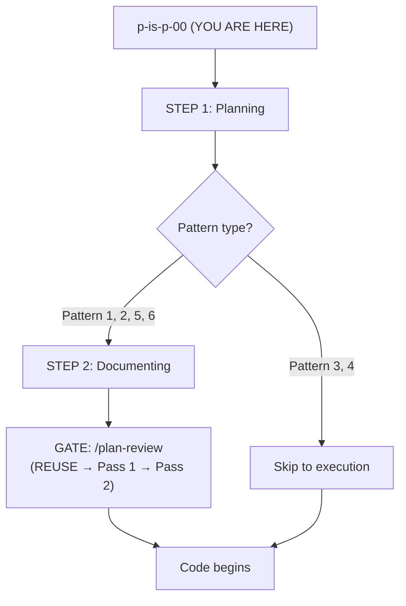

# Plan-Review Gate: Promote Adversarial + Fitness Review Pattern from Lupin to PIP

**Date**: 2026.04.27
**Status**: Approved — implementation in progress (Session 79)
**Originating proposal**: `<lupin>/src/rnd/v0.1.7/2026.04.27-promote-plan-review-pattern-to-pip.md` (read 2026-04-27)
**Source artifacts**: `<lupin>/src/rnd/v0.1.7/2026.04.23-cj-flow-async-multi-lane/{00,01,05,06}-*.md`

---

## Context

The two-pass adversarial+fitness review pattern was authored ahead of CJ Flow phases 1–3 in the Lupin repo. It caught a meaningful set of ownership-language and design-completeness gaps **before any code was written**. Phases 1–3 then landed cleanly with no rework rounds attributable to gaps in the design docs.

The technique is project-agnostic. Today it lives buried in one Lupin milestone's R&D folder. The originating proposal recommends lifting it into PIP as a canonical workflow + per-project wrappers, sequenced behind a convention-establishment amendment to `p-is-p-02-documenting-the-implementation.md` (the linchpin: without conventions, the review's greps are blind).

The current PIP chain has a quality hole between `/p-is-p-02-documentation` and code: the `DOCUMENTATION-FIRST PROTOCOL` mandates "create docs before code" but imposes no quality bar on the docs themselves. Plan-review fills that gap.

---

## Recommended Change Set (5 file deltas + 1 new wrapper)

### Delta 1 — NEW: `workflow/plan-review.md` (canonical, ~450 lines)

The canonical two-pass workflow document. Project-agnostic with parametrization slots; per-project skill wrappers fill them in.

**Location**: `<pip>/workflow/plan-review.md`

**Section structure**:

| # | Section | Notes |
|---|---------|-------|
| 1 | Purpose & When to use | Pattern 1/2/5/6 mandatory; Pattern 3 standalone-REUSE only; Pattern 4 skip |
| 2 | Hierarchy of anchors (3 layers) | Layer 1 (global rule, mandatory) + Layer 2 (project anchor, **optional**) + Layer 3 (milestone anchor, mandatory). Pass 1 enforces L1+L2; "Design concerns" lane applies to L3 only |
| 3 | Prerequisites | Conventions enumerated with cross-link to `p-is-p-02` (Delta 2) |
| 4 | Pre-pass: REUSE detection | **Runs BEFORE Pass 1**; own table format; verdicts `reuse-as-is\|extend-existing\|genuinely-new`; output appended to plan doc as "Prior art referenced" section (persists past review) |
| 5 | Pass 1 template — Adversarial | Full prompt with `{{ANCHOR_FILES}}`, `{{DESIGN_ANCHOR_FILE}}`, `{{DECISION_ANCHOR_FORMAT}}`, `{{PLAN_DOC_PATHS}}`, `{{TAGGING_CONVENTIONS}}`, `{{GREP_TARGETS}}` slots. Findings: 4-col table. 3 greps. "Design concerns" optional |
| 6 | Gate 1 (non-negotiable) | Quoted "DO NOT fix yet" wording from source `05-`; anti-pattern call-out |
| 7 | Resolution loop | Review with user → apply approved fixes → **re-run greps against pre-fix baseline snapshot** → confirm convergence → only then advance |
| 8 | Pass 2 template — Fitness | Full prompt with `{{TBD_QUESTIONS}}` slot. Findings: 5-col table (with `Deficiency type` column). 8 deficiency types (REUSE extracted to pre-pass). 2 greps. "Design concerns" mandatory |
| 9 | Gate 2 | Same shape as Gate 1 |
| 10 | Termination rule | "0 new structural findings (only wording tweaks remain) **OR** 2 rounds completed — whichever fires first." Belt-and-suspenders against quality-vs-count gaming |
| 11 | Layer-3 design concerns: closing the loop | When a finding challenges a Q-N decision: pause review → user re-opens design-anchor doc, adds new Q or amends existing → re-date the FROZEN line → review continues from gate. Never park to phase-end retrospective |
| 12 | Idempotency & re-invocation | Doc-set carries `last-reviewed-at: <date>` marker in `00-index.md`; `/plan-review` checks and prompts on re-run; bundled command supports `--from=reuse\|adversarial\|fitness` for partial reruns |
| 13 | Anti-patterns | Applying findings without gate; collapsing two passes; AI volunteering "let me fix"; running on Pattern 3/4 trivia; silently overriding L3 in either pass; skipping convergence re-grep |
| 14 | Cross-references | `p-is-p-00`, `p-is-p-01`, `p-is-p-02`, `plan-serialization`, `~/.claude/CLAUDE.md` `DOCUMENTATION-FIRST PROTOCOL` + `TEST OWNERSHIP MANDATE` |

**Source extraction notes**: Pass 1 prompt body lifts verbatim from `<lupin>/.../05-adversarial-review-prompt.md`. Pass 2 prompt body lifts from `<lupin>/.../06-fitness-review-prompt.md` MINUS the REUSE bullet (extracted to pre-pass §4). Three greps preserved exactly. "DO NOT fix yet" gate wording quoted verbatim — it's the most-violated rule in practice and deserves the prominence.

---

### Delta 2 — AMEND: `workflow/p-is-p-02-documenting-the-implementation.md` (linchpin, ~120 lines added)

**Location**: insert after line 395 (between Pattern C structure and "Creating Your Documentation Structure"). New section: `## Doc Conventions for Plan-Review Compatibility`.

**Five conventions to establish** (each with worked example, not just spec):

1. **Working-contract document** — optional sibling at `00-working-contract.md`. Doc shape: "Before closing any phase, the AI MUST have executed..." + test-layer enumeration + "User involvement is gated to ONLY these N things" (exhaustive enumeration) + "If AI cannot execute X, name blocker and ASK — not skip, defer, or declare done" + Phase-complete definition (checkboxes `[x]` with evidence + commit hash).

2. **Decision-anchor format** — required in `03-decisions.md` (or equivalent). Header line `**Status**: FROZEN YYYY-MM-DD` (re-dated when amended). Numbered decisions: `Q1`, `Q2`, … (or `D1`, `D2`, … — format spec, not literal). Each decision has Question / ✅ Decision / Rationale / Implication. Sub-decisions get sub-section labels (§3a, §3b).

3. **EXECUTOR tagging** — every verification step tagged. `EXECUTOR: AI` for AI-runnable. `EXECUTOR: HUMAN <reason>` with **same-line justification** when human required (subjective UX, GPU access, privileged shell). Bare checkboxes prohibited in verification sections.

4. **TBD markers** — explicit unresolved questions. Use `TBD` and `Open sub-question N:` (numbered). Pass 2 grep finds these and demands proposed answers per number.

5. **"Manual E2E" semantics** — anti-pattern call-out with worked example. "Manual E2E" labels tests that are **not-yet-automated**, NEVER means "human does it." If AI cannot execute, that's an `EXECUTOR: HUMAN <reason>` line, not a "Manual E2E" line. Pass 1 grep flags any "Manual" / "manual" hit and treats every one as suspect.

**Optional refinement** (decide at write-time): if the 5-convention block bloats `p-is-p-02` past readability, extract to sibling `p-is-p-02-conventions.md` and link from main doc. Keeps `p-is-p-02` scannable.

---

### Delta 3 — AMEND: `workflow/p-is-p-00-start-here.md` (flowchart only, ~10 lines)

**Location**: lines 260–268 mermaid block. The decision-matrix table at lines 313–322 stays untouched (it classifies work by TYPE; the gate is a flow concern, not a type concern).

**Amended flowchart**:



Add one paragraph below the flowchart explaining the gate fires for Pattern 1/2/5/6 (mandatory), Pattern 3 has standalone `/plan-review-reuse` available (optional), Pattern 4 skips entirely.

---

### Delta 4 — AMEND: `README.md` (1 line added)

**Location**: lines 87–95 "What gets installed" enumeration. Insert new bullet between [C] and [D]:

```markdown
- ✅ **[C.5]** Plan Review Gate: `/plan-review` (adversarial + fitness review of implementation plans; mandatory for Pattern 1/2/5/6, REUSE-only available for Pattern 3)
```

---

### Delta 5 — NEW: `.claude/commands/plan-review.md` (thin wrapper, ~30 lines)

**Location**: `<pip>/.claude/commands/plan-review.md`

Thin slash-command wrapper following existing patterns. Supports `--from=reuse|adversarial|fitness` for partial reruns, `--doc-set=<path>`, `--skip-with-reason "<reason>"` (Pattern 3 escape hatch). Sub-command `/plan-review-reuse` for standalone REUSE pre-pass on any doc shape.

Per-project wrappers in target repos (`<lupin>/.claude/skills/plan-review/SKILL.md`) inject project-specific tagging conventions, anchor file paths, and verification venues — out of scope for this PIP-side change set; tracked as Phase 3 of the originating proposal.

---

## Critical Files

| File | Action | Source for content |
|------|--------|-------------------|
| `<pip>/workflow/plan-review.md` | NEW | Lift from `<lupin>/.../05-` + `06-` per Delta 1 §-by-§ map |
| `<pip>/workflow/p-is-p-02-documenting-the-implementation.md` | AMEND @ line 395 | Convention specs from `<lupin>/.../00-working-contract.md` + `01-design-review.md` §3 + tagging patterns observed across `02-..04-` and `90-..92-` |
| `<pip>/workflow/p-is-p-00-start-here.md` | AMEND @ lines 260–268 | New mermaid block per Delta 3 |
| `<pip>/README.md` | AMEND @ lines 87–95 | One-line bullet per Delta 4 |
| `<pip>/.claude/commands/plan-review.md` | NEW | Thin wrapper per Delta 5; pattern from `<pip>/.claude/commands/plan-session-end.md` |

**Reuse audit**:

- `workflow/plan-serialization.md` already exists — `plan-review.md` cross-references it; no duplication.
- `workflow/skill-templates/generic-skill-template.md` exists — per-project skill wrappers (Phase 3, out of scope here) will use this as their base.
- `workflow/INSTALLATION-GUIDE.md` Testing-Workflows section pattern — `plan-review.md` follows the same prose shape (Purpose / When to use / Workflow / Cross-references).
- No existing PIP doc covers plan-doc-quality review (verified by Explore agent across `testing-baseline.md`, `testing-remediation.md`, `testing-harness-update.md`, `workflow-execution-audit.md`, `skills-management.md`). Net-new gate, no collision.

---

## Phase Sequencing

| Order | Delta | Why this order |
|-------|-------|----------------|
| 1 | Delta 2 (`p-is-p-02` conventions) | **Linchpin** — without conventions, review greps are blind. Doing this first means the canonical `plan-review.md` (Delta 1) can reference established convention specs rather than inlining them. |
| 2 | Delta 1 (`plan-review.md`) | The canonical doc. Pulls from Delta 2's convention spec via cross-link. |
| 3 | Delta 5 (`.claude/commands/plan-review.md`) | Thin wrapper around Delta 1. Cheap once Delta 1 is solid. |
| 4 | Delta 3 (`p-is-p-00` flowchart) | Ties the gate into the canonical chain. Last so the chain isn't broken mid-implementation. |
| 5 | Delta 4 (`README.md`) | Surface visibility once everything else lands. |

---

## Verification

1. **Convention coverage check**: `grep -n "EXECUTOR\|FROZEN\|Open sub-question\|TBD\|Manual E2E" <pip>/workflow/p-is-p-02-documenting-the-implementation.md` — expect ≥5 hits across the new section.
2. **Cross-reference integrity**: `grep -n "plan-review" <pip>/workflow/p-is-p-00-start-here.md <pip>/workflow/p-is-p-02-documenting-the-implementation.md <pip>/README.md <pip>/.claude/commands/plan-review.md` — every file references the canonical.
3. **Slot inventory**: `grep -nE "\{\{[A-Z_]+\}\}" <pip>/workflow/plan-review.md` — expect 9 slots documented in §"Parametrization Slots": `{{MILESTONE_NAME}}`, `{{BRANCH_NAME}}`, `{{ANCHOR_FILES}}`, `{{DESIGN_ANCHOR_FILE}}`, `{{DECISION_ANCHOR_FORMAT}}`, `{{PLAN_DOC_PATHS}}`, `{{CODEBASE_ROOTS}}`, `{{GREP_TARGETS}}`, `{{TBD_QUESTIONS}}`. (Plan estimated 7; implementation revealed 3 additional milestone/branch/codebase slots and dropped unused `{{TAGGING_CONVENTIONS}}` since conventions are referenced via cross-link to `p-is-p-02` rather than inlined.)
4. **Anti-pattern audit**: `grep -n "DO NOT fix\|do not fix" <pip>/workflow/plan-review.md` — verbatim wording from source `05-`/`06-` is preserved (the 3-times repetition is intentional).
5. **Smoke test the technique on this very plan**: dogfood — after these deltas land, run `/plan-review` against this same proposal doc. The gate must catch any ownership-language drift introduced by the writing process. (Pattern 3 today; if dogfood reveals shape-fit issues, that's a finding to fold back into Delta 1.)
6. **Manual readthrough** (`EXECUTOR: HUMAN — design-review fidelity check`): user reads the canonical `plan-review.md` end-to-end against the source `05-`/`06-` prompts to confirm no signal was lost in the abstraction. This is the one step that genuinely needs human judgment — the AI can't validate "this captures the spirit of the original" against its own extraction.

---

## Out of Scope (deferred)

- **Phase 3 of originating proposal** — per-project skill wrappers (`<lupin>/.claude/skills/plan-review/SKILL.md`). Belongs in Lupin-rooted session, not PIP. Tracked.
- **Retroactive convention enforcement** on existing PIP-tracked plans (CJ Flow phases 4+, BFE, TFE). Per originating proposal open-question 3: no retroactive enforcement; new milestones adopt, old ones stay at current convention level.
- **Other-project rollout** (cosa-voice, mobile, plugin-firefox). Same pattern, copy-and-adapt the SKILL.md, deferred until those projects start a Pattern 1/2 plan.
- **Source `05-`/`06-` files in Lupin** — leave in place + add header pointer to canonical PIP doc. Don't replace with stubs (revisionist) or delete (loses milestone history).

---

## Open question parked for write-time decision

Decision H optional refinement (from Plan-agent stress-test): if Delta 2's 5-convention block bloats `p-is-p-02-documenting-the-implementation.md` past readability, extract to sibling `p-is-p-02-conventions.md` and link from main doc. Decide at write-time once block size is concrete; both paths preserve all 5 conventions, only the housing differs.
