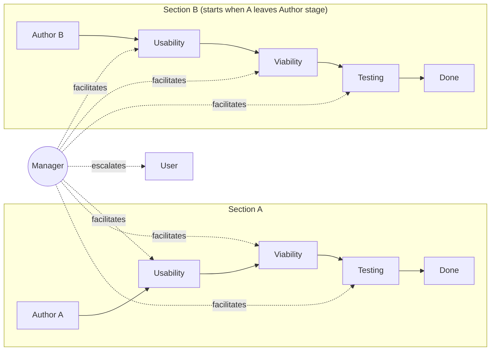

# Cascaded Multi-Persona Plan-Review Pipeline

**Date**: 2026.05.17
**Status**: Design (pre-implementation)
**Author**: María (with Ricardo) — pre-planning elicitation conversation
**Repo scope**: planning-is-prompting (doctrine + workflow) + Lupin (runtime config + orchestration)
**Project prefix**: `[PLAN]`

---

## 1. Problem Statement

The existing `/plan-review` workflow is a 4-phase serial review process (REUSE pre-pass + Pass 1 Fitness + Pass 2 Ownership-Language Audit + Test-perspective evaluation). On a substantive plan, walking through all four phases serially produces high-quality output but consumes a lot of the user's attention because they sit in a blocking review loop at every stage.

**The user's attention is the scarce resource.** Token cost is bounded and cheap. The point of this design is to spend the abundant currency (compute, inter-session DM traffic) to save the scarce one (user attention).

---

## 2. Core Idea

Break the plan into sections (A, B, C, D…) and run the 4-phase review **as a cascading pipeline** across **5 concurrent Claude Code sessions**:

- **1 author** — produces and revises a plan section
- **3 reviewers** — usability/reuse, viability/gap, testing perspectives
- **1 manager** — facilitates discussions, classifies findings, escalates to user only when needed

The pipeline parallelism: while section A is being reviewed by the usability reviewer, the author can start section B; once A passes usability, B enters usability while A enters viability — pipelined throughput on a constant per-section latency.

The manager is the load-bearing piece: it filters which issues reach the user, breaks tied votes on non-foundational severity, picks subsets of upstream personas to pull into a re-litigation, and detects/escalates phantom sessions.



---

## 3. Design Decisions

### 3.1 Architecture

**Decision**: New orchestration wrapper around existing `/plan-review`.

Each reviewer persona runs `/plan-review` (or a single phase of it) on its assigned section. A new wrapper skill — provisionally `/plan-review-cascaded` — handles the 5-session orchestration, the cascading handoffs, and the manager-as-facilitator behavior.

**Implementation note (markdown-driven, no code)**: the wrapper is pure markdown. The manager session reads the playbook and coordinates the other four sessions via the existing cosa-voice MCP DM/commons tools. There is no orchestration script, no programmatic session spawning, no `configuration_manager` interaction. The user manually launches 5 CC sessions (typically in 5 tmux panes), assigns roles to the manager via the manager's invocation, and the manager DMs role assignments to the other four.

**Alternatives rejected**:
- Modifying `/plan-review` itself to support cascading natively (risk of breaking single-session use)
- Building a standalone workflow with no dependency on `/plan-review` (doctrine divergence risk)
- Script-based orchestration (introduces non-markdown surface; not portable; not consistent with planning-is-prompting conventions)

### 3.2 Prototype Scope

**Decision**: At least **2 sections × 5 personas** for the first build.

**User's insight (correction of my one-section recommendation)**: a one-section prototype cannot demonstrate pipeline parallelism. Parallelism is by definition an N≥2 phenomenon — the value proposition is that section B's author can start work the moment section A leaves the author stage and enters usability review. Minimum viable demonstration of the value prop is N=2.

### 3.3 Persona Casting

**v1 decision**: User assigns roles to personas at pipeline launch time. Roles are decoupled from voice identity; the same persona could play author in one run and manager in the next.

**v2 evolution path**: Dedicated role-specific personas (e.g., `AuthorBot`, `UsabilityCritic`, `ViabilityAnalyst`, `TestingPedant`, `PipelineManager`). Rationale: persona-conditioning research shows specialists outperform generalists when given a specific lens. Defer this until v1 dynamics are validated.

### 3.4 Severity Taxonomy

Used by the manager to classify any finding surfaced during review:

| Tier | Treatment | Examples |
|------|-----------|----------|
| **Cosmetic** | Ignore or document; no re-work | Style preferences, naming nits, wording polish |
| **Inconsistency (within section)** | DM the relevant subset of upstream chain in this section; re-litigate | Design choice in section A's testing phase conflicts with a decision made in A's usability phase |
| **Foundational / cross-section** | Escalate to user immediately | Section A's testing finding invalidates a load-bearing assumption used in section C |

### 3.5 Escalation Taxonomy

The manager escalates to the user on:

1. Foundational finding (load-bearing assumption invalidated)
2. Cross-section conflict no single chain can resolve
3. Consensus failure after vote (deadlock on foundational severity)
4. Scope expansion beyond original plan
5. Resource blocker (missing data, API access, etc.)
6. Hard contradiction with user's prior explicit decision
7. Pipeline stall (no progress for N intervals)

The manager handles autonomously:

- Cosmetic findings
- Intra-section inconsistencies
- Style/format debates → vote, move on
- Minor scope clarifications

### 3.6 Backflow Rule (Simplified after User Insight)

**Original framing (mine)**: cross-section invalidation is the main case.

**Corrected framing (user's insight)**: conflicts stay within a section's own upstream chain. A phase-N conflict bounds the DM scope to at most N−1 upstream personas in that section. Cross-section interference is the edge case (foundational severity → escalates).

This simplification dropped one INI key I had proposed (`scope_detection`) — it became implicit in the upstream-chain rule.

### 3.7 Phantom Session Handling

Manager periodically pings each persona (heartbeat). Absence of response for `stall_threshold_minutes` declares phantom. **Current platform constraint**: the manager cannot spawn new Claude Code sessions, so reassignment policy is `park_and_escalate` — section pauses, user decides what to do.

**Future v2 path**: a bounded Claude Code job (Agent tool with `isolation: worktree`) could give the manager autonomous respawn capability. Tricky to engineer cleanly; deferred.

### 3.8 Section Decomposition

Manager autonomously proposes section boundaries based on the **independence criterion**: each section must be reviewable in isolation. User signs off on the decomposition before sections enter the pipeline. User-as-terminating-authority bounds the regress (no meta-review of the decomposition itself).

---

## 4. Configuration & Defaults

### 4.1 Why defaults live IN the workflow

> **Correction received 2026-05-17 mid-planning**: an earlier version of this doc placed defaults in a new `[cascaded-plan-review]` section of `lupin-app.ini`. That was a category error — planning-is-prompting workflows are meant to be portable across many consuming projects (Lupin, lupin-mobile, claude-plans, par-pacific, …). Putting defaults in a project-runtime config file means the workflow is broken by default in any project that doesn't have that exact file. **The defaults must travel with the workflow itself.**

### 4.2 File layout (segregated defaults reference)

```
planning-is-prompting/workflow/
├── plan-review-cascaded.md            # Main skill — the manager's playbook (orchestration instructions)
├── plan-review-cascaded-defaults.md   # Defaults reference table (this doc's §4.3 content lives here)
└── plan-review-cascaded-personas.md   # Persona role briefs + reviewer rubrics
```

The main skill references the defaults doc by name:

> "Default configuration values for this workflow are documented in `planning-is-prompting/workflow/plan-review-cascaded-defaults.md`. Consuming projects override defaults via their local `CLAUDE.md` or at invocation time."

### 4.3 Defaults table

| Key | Default | Description |
|-----|---------|-------------|
| **Discussion mechanics** | | |
| `discussion_turn_cap` | `3` | Max author↔reviewer rounds per consensus attempt before vote/escalate. Long enough to surface real disagreement, short enough to avoid ratholes. |
| `reviewer_context_scope` | `narrow` | Reviewer launch scope: just the section + their rubric. Biggest token saver. |
| `stage_handoff_format` | `decisions_plus_ambiguities` | What flows downstream: structured summary, not raw transcript. |
| **Persona activation & traffic** | | |
| `persona_activation` | `all_hot` | All 5 personas hot simultaneously. Trades higher standing context cost for lower wake latency. *(User override from proposed `hybrid`.)* |
| `dm_cc_policy` | `participants_plus_manager_observes` | Author + reviewer in thread; manager silently CC'd. |
| **Budget enforcement** | | |
| `budget_enforcement_mode` | `soft_cap` | Manager warned at threshold; can extend with reason or escalate. |
| `budget_enforcement_threshold` | `25` | Messages per section. *(User override from proposed `50`; tighter cap pairs with `all_hot`.)* |
| **Backflow handling** | | |
| `backflow_policy` | `manager_severity_tiers` | Cosmetic→ignore, Inconsistency→DM upstream subset, Foundational→escalate. |
| `reopen_return_point` | `manager_assigns_by_severity` | Cosmetic stays at current stage; structural goes back to author. |
| `upstream_dm_scope` | `manager_picks_subset` | Manager bounded by N−1 upstream chain; picks which subset to pull in. |
| **Manager behavior** | | |
| `manager_push_frequency` | `per_section_complete` | Manager auto-pushes status when a whole section clears all 4 stages. |
| `escalation_form` | `notify_immediate` | High-priority `notify()` in manager's own persona voice. |
| `vote_tiebreaker_policy` | `severity_dependent` | Manager breaks tie on cosmetic/inconsistency; escalates tie on foundational. |
| `vote_electorate` | `four_substantive_personas` | Author + 3 reviewers vote; manager stays neutral as referee. |
| **Phantom session resilience** | | |
| `phantom_detection_mode` | `heartbeat_ping` | Manager DMs each persona periodically; absence = phantom. |
| `stall_threshold_minutes` | `10` | Time without response before declaring phantom. |
| `phantom_reassignment_policy` | `park_and_escalate` | *(User override grounded in current platform: manager cannot spawn new CC sessions. v2 path: bounded Claude Code job for autonomous respawn.)* |
| `phantom_recovery_context` | `commons_log_recent_discussions` | Moot under `park_and_escalate`; ready if bounded-job respawn is added later. |
| **Decomposition** | | |
| `section_decomposition_authority` | `manager_autonomous` | Manager reads input plan and proposes section boundaries. |
| `decomposition_review_policy` | `manager_proposes_user_approves` | Single human gate; bounds the regress without meta-review pipeline. |
| `section_sizing_heuristic` | `independence_criterion` | Each section must be reviewable in isolation. |
| **Persona casting (v1)** | | |
| `persona_casting_strategy` | `user_assigns_at_launch` | Roles decoupled from voice identity. *(v2 path: `role_specific_personas`.)* |

**Total: 22 defaults.**

### 4.4 Override mechanism

Consuming projects override defaults in two ways:

**1. Persistent override** — in the consuming project's local `CLAUDE.md`:

```markdown
## [cascaded-plan-review] Overrides
- discussion_turn_cap = 5         # we prefer longer consensus rounds
- prototype_scope     = 3         # we want a wider parallelism demo
```

**2. Invocation override** — at slash command call time:

```
/plan-review-cascaded --turn-cap=5 --prototype-scope=3
```

**Precedence**: invocation > consumer CLAUDE.md > workflow default.

The manager (in v1) reads both files at pipeline start and resolves the effective values. No code; just Claude reading markdown.

---

## 5. User Overrides (where my recommendations were corrected)

Tracking these explicitly because they encode design judgment that should survive into the implementation. These overrides are the defaults that ship in `plan-review-cascaded-defaults.md`.

| Knob | My recommendation | User pick | Rationale |
|------|-------------------|-----------|-----------|
| `persona_activation` | hybrid (manager hot, others wake) | `all_hot` | Trade standing cost for latency |
| `budget_enforcement_threshold` | 50 | `25` | Tighter cap pairs well with all-hot activation |
| `phantom_reassignment_policy` | respawn_same_persona | `park_and_escalate` | Platform reality: can't spawn new sessions today |
| `prototype_scope` | 1 section first | **≥2 sections required** | Parallelism is N≥2 by definition; can't validate it on N=1 |
| **Config home** | `lupin-app.ini` `[cascaded-plan-review]` section | **`planning-is-prompting/workflow/plan-review-cascaded-defaults.md`** | Workflow portability across consuming projects; INI is consumer-runtime, not workflow-portable |

The `prototype_scope` override caught a category error in my framing. The **config home** override caught a portability error.

---

## 6. Phased Implementation Plan

### v1 (prototype validation) — markdown-only

**Goal**: prove the parallelism hypothesis and the manager-as-filter pattern actually save user attention.

**Phase A — Defaults + skill scaffolding** (the portable workflow artifacts):

1. Create `planning-is-prompting/workflow/plan-review-cascaded-defaults.md` with the full defaults table from §4.3 (22 keys + descriptions + override mechanism docs)
2. Create `planning-is-prompting/workflow/plan-review-cascaded-personas.md` with persona role briefs (manager, author, 3 reviewers) and per-reviewer rubrics (usability, viability/gap, testing)
3. Create `planning-is-prompting/workflow/plan-review-cascaded.md` — the manager's playbook (orchestration instructions, references the defaults + personas docs)
4. Create `planning-is-prompting/.claude/commands/plan-review-cascaded.md` — slash command wrapper

**Phase B — Manager behavior spec** (lives inside the playbook):

5. Draft the manager system prompt (load-bearing — manager judgment is the whole game)
6. Draft severity classification heuristics + worked examples (cosmetic / inconsistency / foundational)
7. Draft escalation taxonomy template (7 triggers, formatted for manager reference)
8. Draft DM-subset selection heuristics (when phase-N conflict, who in upstream chain to pull in)
9. Draft vote mechanics spec (commons topic format, message format, tally procedure)
10. Draft heartbeat ping protocol (cadence, what to send, timeout interpretation)

**Phase C — Reviewer + author rubrics** (lives in personas doc):

11. Author rubric: how to produce a section the reviewers can evaluate
12. Usability reviewer rubric: aligned with existing `/plan-review` REUSE pre-pass
13. Viability/gap reviewer rubric: aligned with `/plan-review` Fitness pass
14. Testing reviewer rubric: aligned with `/plan-review` test-perspective pass

**Phase D — Prototype run + telemetry + evaluation**:

15. Pick a real ≥2-section plan to use as the prototype input (candidate: the cascaded-pipeline plan itself, eating our own dog food)
16. Define telemetry: (a) user intervention count, (b) inter-session message count, (c) wall-clock duration, (d) per-stage breakdown
17. Run prototype end-to-end with 5 sessions in 5 tmux panes
18. Baseline comparison: serial `/plan-review` on the same plan
19. Write findings memo back into design doc §10 (new section)

**Phase E — Doctrine integration**:

20. Update `planning-is-prompting/README.md` to list `/plan-review-cascaded` alongside existing skills
21. Cross-reference from `/plan-review` doctrine — "for large plans, consider `/plan-review-cascaded`"

### v2 (autonomy enhancements)

- Bounded Claude Code job pattern for autonomous phantom recovery (replaces `park_and_escalate` for non-foundational stalls)
- Role-specific personas (`AuthorBot`, `UsabilityCritic`, `ViabilityAnalyst`, `TestingPedant`, `PipelineManager`) — replaces `user_assigns_at_launch`
- Possibly: dependency annotations on sections for more precise scope detection on cross-section invalidation

**Estimated v1 scope**: ~20 tasks, ~1-2 weeks. All markdown; no code; no INI; no `configuration_manager` interaction.

---

## 7. Open Items / Risks

All open items are now scoped as Phase B/C/D tasks in §6 (no longer floating), but listing them again here for visibility:

- **Manager system prompt** — load-bearing; deserves careful crafting (Phase B task 5)
- **Severity heuristics** — manager needs concrete worked examples for cosmetic/inconsistency/foundational classification (Phase B task 6)
- **Reviewer rubrics** — must map cleanly to existing `/plan-review` phases for doctrine continuity (Phase C tasks 12-14)
- **Vote mechanics** — concrete commons topic + message format (Phase B task 9)
- **Heartbeat ping** — protocol shape, what to send, how to interpret silence (Phase B task 10)
- **First-run telemetry** — without measurement we can't validate the attention-saving claim (Phase D task 16)
- **Risk: dogfooding loop** — if we use the cascaded pipeline to plan the cascaded pipeline itself (Phase D task 15), there's a circular dependency. Mitigation: use a different plan for the first run, eat-our-own-dogfood once stable.

---

## 8. References

- `planning-is-prompting/workflow/p-is-p-00-start-here.md` — entry-point workflow that triggered this discussion
- `planning-is-prompting/workflow/plan-review.md` — the existing 4-phase review skill being wrapped
- `planning-is-prompting/workflow/cross-session-communication.md` — DM / commons doctrine the manager + personas operate under
- `planning-is-prompting/workflow/plan-review-cascaded.md` — **to be created** — main skill
- `planning-is-prompting/workflow/plan-review-cascaded-defaults.md` — **to be created** — defaults table (content from §4.3)
- `planning-is-prompting/workflow/plan-review-cascaded-personas.md` — **to be created** — persona role briefs + reviewer rubrics
- Conversation: María session 3e0c6e15, 2026-05-17

---

## 9. Next Step

`/p-is-p-01-planning` Phase 2 (Pattern Selection) **confirmed**: Pattern 3 (Feature Development); no Step 2 docs needed (this serialized design covers the architecture).

Phase 3 (Work Breakdown) is the §6 implementation plan above. Phase 4 (TodoWrite creation) follows once the user signs off on the breakdown.

**Scope shift from corrected config-home decision**: the implementation is now even lighter than originally framed — pure markdown across 3 new workflow files + 1 slash command wrapper, no code, no INI, no `configuration_manager` interaction. Total Phase A footprint is ~600-800 lines of markdown.
