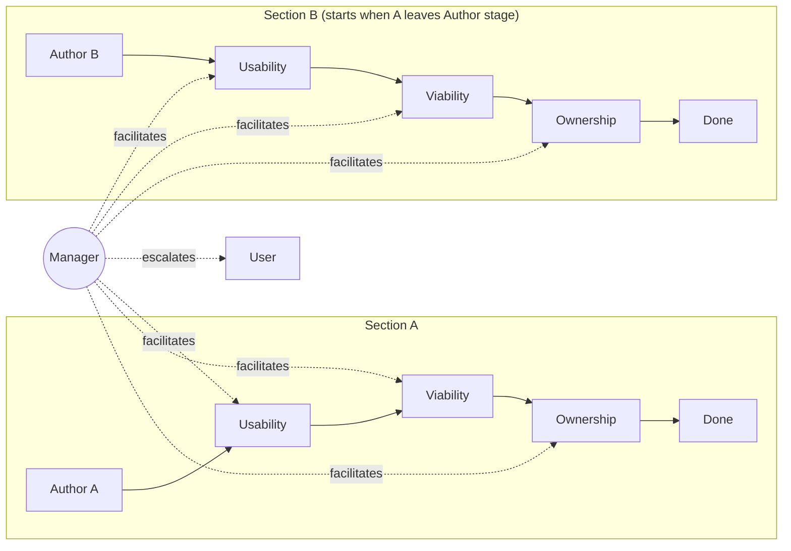
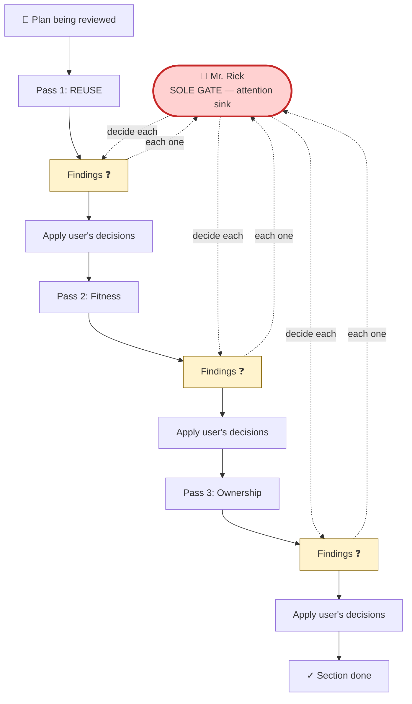
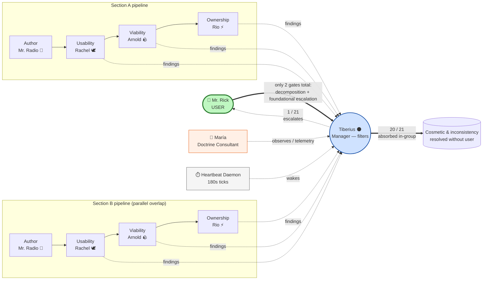

# Cascaded Multi-Persona Plan-Review Pipeline

**Date**: 2026.05.17
**Status**: Design (pre-implementation)
**Author**: María (with Ricardo) — pre-planning elicitation conversation
**Repo scope**: planning-is-prompting (doctrine + workflow) + Lupin (runtime config + orchestration)
**Project prefix**: `[PLAN]`

---

## 1. Problem Statement

The existing `/plan-review` workflow is a serial review process (REUSE pre-pass + Pass 1 Fitness + Pass 2 Ownership-Language Audit — where Pass 2 covers both ownership-language and verification-observability questions). On a substantive plan, walking through every pass serially produces high-quality output but consumes a lot of the user's attention because they sit in a blocking review loop at every stage.

**The user's attention is the scarce resource.** Token cost is bounded and cheap. The point of this design is to spend the abundant currency (compute, inter-session DM traffic) to save the scarce one (user attention).

---

## 2. Core Idea

Break the plan into sections (A, B, C, D…) and run the 4-phase review **as a cascading pipeline** across **5 concurrent Claude Code sessions**:

- **1 author** — produces and revises a plan section
- **3 reviewers** — usability/reuse, viability/gap, ownership perspectives
- **1 manager** — facilitates discussions, classifies findings, escalates to user only when needed

The pipeline parallelism: while section A is being reviewed by the usability reviewer, the author can start section B; once A passes usability, B enters usability while A enters viability — pipelined throughput on a constant per-section latency.

The manager is the load-bearing piece: it filters which issues reach the user, breaks tied votes on non-foundational severity, picks subsets of upstream personas to pull into a re-litigation, and detects/escalates phantom sessions.



---

## 3. Design Decisions

### 3.1 Architecture

**Decision**: New orchestration wrapper around existing `/plan-review`.

Each reviewer persona runs `/plan-review` (or a single phase of it) on its assigned section. A new wrapper skill — provisionally `/plan-review-cascaded` — handles the 5-session orchestration, the cascading handoffs, and the manager-as-facilitator behavior.

**Implementation note (markdown-driven, no code)**: the wrapper is pure markdown. The manager session reads the playbook and coordinates the other four sessions via the existing cosa-voice MCP DM/commons tools. There is no orchestration script, no programmatic session spawning, no `configuration_manager` interaction. The user manually launches 5 CC sessions (typically in 5 tmux panes), assigns roles to the manager via the manager's invocation, and the manager DMs role assignments to the other four.

**Alternatives rejected**:
- Modifying `/plan-review` itself to support cascading natively (risk of breaking single-session use)
- Building a standalone workflow with no dependency on `/plan-review` (doctrine divergence risk)
- Script-based orchestration (introduces non-markdown surface; not portable; not consistent with planning-is-prompting conventions)

### 3.2 Prototype Scope

**Decision**: At least **2 sections × 5 personas** for the first build.

**User's insight (correction of my one-section recommendation)**: a one-section prototype cannot demonstrate pipeline parallelism. Parallelism is by definition an N≥2 phenomenon — the value proposition is that section B's author can start work the moment section A leaves the author stage and enters usability review. Minimum viable demonstration of the value prop is N=2.

### 3.3 Persona Casting

**v1 decision**: User assigns roles to personas at pipeline launch time. Roles are decoupled from voice identity; the same persona could play author in one run and manager in the next.

**v2 evolution path**: Dedicated role-specific personas (e.g., `AuthorBot`, `UsabilityCritic`, `ViabilityAnalyst`, `OwnershipAuditor`, `PipelineManager`). Rationale: persona-conditioning research shows specialists outperform generalists when given a specific lens. Defer this until v1 dynamics are validated.

### 3.4 Severity Taxonomy

Used by the manager to classify any finding surfaced during review:

| Tier | Treatment | Examples |
|------|-----------|----------|
| **Cosmetic** | Ignore or document; no re-work | Style preferences, naming nits, wording polish |
| **Inconsistency (within section)** | DM the relevant subset of upstream chain in this section; re-litigate | Design choice in section A's ownership phase conflicts with a decision made in A's usability phase |
| **Foundational / cross-section** | Escalate to user immediately | Section A's ownership finding invalidates a load-bearing assumption used in section C |

### 3.5 Escalation Taxonomy

The manager escalates to the user on:

1. Foundational finding (load-bearing assumption invalidated)
2. Cross-section conflict no single chain can resolve
3. Consensus failure after vote (deadlock on foundational severity)
4. Scope expansion beyond original plan
5. Resource blocker (missing data, API access, etc.)
6. Hard contradiction with user's prior explicit decision
7. Pipeline stall (no progress for N intervals)

The manager handles autonomously:

- Cosmetic findings
- Intra-section inconsistencies
- Style/format debates → vote, move on
- Minor scope clarifications

### 3.6 Backflow Rule (Simplified after User Insight)

**Original framing (mine)**: cross-section invalidation is the main case.

**Corrected framing (user's insight)**: conflicts stay within a section's own upstream chain. A phase-N conflict bounds the DM scope to at most N−1 upstream personas in that section. Cross-section interference is the edge case (foundational severity → escalates).

This simplification dropped one INI key I had proposed (`scope_detection`) — it became implicit in the upstream-chain rule.

### 3.7 Phantom Session Handling

Manager periodically pings each persona (heartbeat). Absence of response for `stall_threshold_minutes` declares phantom. **Current platform constraint**: the manager cannot spawn new Claude Code sessions, so reassignment policy is `park_and_escalate` — section pauses, user decides what to do.

**Future v2 path**: a bounded Claude Code job (Agent tool with `isolation: worktree`) could give the manager autonomous respawn capability. Tricky to engineer cleanly; deferred.

### 3.8 Section Decomposition

Manager autonomously proposes section boundaries based on the **independence criterion**: each section must be reviewable in isolation. User signs off on the decomposition before sections enter the pipeline. User-as-terminating-authority bounds the regress (no meta-review of the decomposition itself).

---

## 4. Configuration & Defaults

### 4.1 Why defaults live IN the workflow

> **Correction received 2026-05-17 mid-planning**: an earlier version of this doc placed defaults in a new `[cascaded-plan-review]` section of `lupin-app.ini`. That was a category error — planning-is-prompting workflows are meant to be portable across many consuming projects (Lupin, lupin-mobile, claude-plans, par-pacific, …). Putting defaults in a project-runtime config file means the workflow is broken by default in any project that doesn't have that exact file. **The defaults must travel with the workflow itself.**

### 4.2 File layout (segregated defaults reference)

```
planning-is-prompting/workflow/
├── plan-review-cascaded.md            # Main skill — the manager's playbook (orchestration instructions)
├── plan-review-cascaded-defaults.md   # Defaults reference table (this doc's §4.3 content lives here)
└── plan-review-cascaded-personas.md   # Persona role briefs + reviewer rubrics
```

The main skill references the defaults doc by name:

> "Default configuration values for this workflow are documented in `planning-is-prompting/workflow/plan-review-cascaded-defaults.md`. Consuming projects override defaults via their local `CLAUDE.md` or at invocation time."

### 4.3 Defaults table

| Key | Default | Description |
|-----|---------|-------------|
| **Discussion mechanics** | | |
| `discussion_turn_cap` | `3` | Max author↔reviewer rounds per consensus attempt before vote/escalate. Long enough to surface real disagreement, short enough to avoid ratholes. |
| `reviewer_context_scope` | `narrow` | Reviewer launch scope: just the section + their rubric. Biggest token saver. |
| `stage_handoff_format` | `decisions_plus_ambiguities` | What flows downstream: structured summary, not raw transcript. |
| **Persona activation & traffic** | | |
| `persona_activation` | `all_hot` | All 5 personas hot simultaneously. Trades higher standing context cost for lower wake latency. *(User override from proposed `hybrid`.)* |
| `dm_cc_policy` | `participants_plus_manager_observes` | Author + reviewer in thread; manager silently CC'd. |
| **Budget enforcement** | | |
| `budget_enforcement_mode` | `soft_cap` | Manager warned at threshold; can extend with reason or escalate. |
| `budget_enforcement_threshold` | `25` | Messages per section. *(User override from proposed `50`; tighter cap pairs with `all_hot`.)* |
| **Backflow handling** | | |
| `backflow_policy` | `manager_severity_tiers` | Cosmetic→ignore, Inconsistency→DM upstream subset, Foundational→escalate. |
| `reopen_return_point` | `manager_assigns_by_severity` | Cosmetic stays at current stage; structural goes back to author. |
| `upstream_dm_scope` | `manager_picks_subset` | Manager bounded by N−1 upstream chain; picks which subset to pull in. |
| **Manager behavior** | | |
| `manager_push_frequency` | `per_section_complete` | Manager auto-pushes status when a whole section clears all 4 stages. |
| `escalation_form` | `notify_immediate` | High-priority `notify()` in manager's own persona voice. |
| `vote_tiebreaker_policy` | `severity_dependent` | Manager breaks tie on cosmetic/inconsistency; escalates tie on foundational. |
| `vote_electorate` | `four_substantive_personas` | Author + 3 reviewers vote; manager stays neutral as referee. |
| **Phantom session resilience** | | |
| `phantom_detection_mode` | `heartbeat_ping` | Manager DMs each persona periodically; absence = phantom. |
| `stall_threshold_minutes` | `10` | Time without response before declaring phantom. |
| `phantom_reassignment_policy` | `park_and_escalate` | *(User override grounded in current platform: manager cannot spawn new CC sessions. v2 path: bounded Claude Code job for autonomous respawn.)* |
| `phantom_recovery_context` | `commons_log_recent_discussions` | Moot under `park_and_escalate`; ready if bounded-job respawn is added later. |
| **Decomposition** | | |
| `section_decomposition_authority` | `manager_autonomous` | Manager reads input plan and proposes section boundaries. |
| `decomposition_review_policy` | `manager_proposes_user_approves` | Single human gate; bounds the regress without meta-review pipeline. |
| `section_sizing_heuristic` | `independence_criterion` | Each section must be reviewable in isolation. |
| **Persona casting (v1)** | | |
| `persona_casting_strategy` | `user_assigns_at_launch` | Roles decoupled from voice identity. *(v2 path: `role_specific_personas`.)* |

**Total: 22 defaults.**

### 4.4 Override mechanism

Consuming projects override defaults in two ways:

**1. Persistent override** — in the consuming project's local `CLAUDE.md`:

```markdown
## [cascaded-plan-review] Overrides
- discussion_turn_cap = 5         # we prefer longer consensus rounds
- prototype_scope     = 3         # we want a wider parallelism demo
```

**2. Invocation override** — at slash command call time:

```
/plan-review-cascaded --turn-cap=5 --prototype-scope=3
```

**Precedence**: invocation > consumer CLAUDE.md > workflow default.

The manager (in v1) reads both files at pipeline start and resolves the effective values. No code; just Claude reading markdown.

---

## 5. User Overrides (where my recommendations were corrected)

Tracking these explicitly because they encode design judgment that should survive into the implementation. These overrides are the defaults that ship in `plan-review-cascaded-defaults.md`.

| Knob | My recommendation | User pick | Rationale |
|------|-------------------|-----------|-----------|
| `persona_activation` | hybrid (manager hot, others wake) | `all_hot` | Trade standing cost for latency |
| `budget_enforcement_threshold` | 50 | `25` | Tighter cap pairs well with all-hot activation |
| `phantom_reassignment_policy` | respawn_same_persona | `park_and_escalate` | Platform reality: can't spawn new sessions today |
| `prototype_scope` | 1 section first | **≥2 sections required** | Parallelism is N≥2 by definition; can't validate it on N=1 |
| **Config home** | `lupin-app.ini` `[cascaded-plan-review]` section | **`planning-is-prompting/workflow/plan-review-cascaded-defaults.md`** | Workflow portability across consuming projects; INI is consumer-runtime, not workflow-portable |

The `prototype_scope` override caught a category error in my framing. The **config home** override caught a portability error.

---

## 6. Phased Implementation Plan

### v1 (prototype validation) — markdown-only

**Goal**: prove the parallelism hypothesis and the manager-as-filter pattern actually save user attention.

**Phase A — Defaults + skill scaffolding** (the portable workflow artifacts):

1. Create `planning-is-prompting/workflow/plan-review-cascaded-defaults.md` with the full defaults table from §4.3 (22 keys + descriptions + override mechanism docs)
2. Create `planning-is-prompting/workflow/plan-review-cascaded-personas.md` with persona role briefs (manager, author, 3 reviewers) and per-reviewer rubrics (usability, viability/gap, ownership)
3. Create `planning-is-prompting/workflow/plan-review-cascaded.md` — the manager's playbook (orchestration instructions, references the defaults + personas docs)
4. Create `planning-is-prompting/.claude/commands/plan-review-cascaded.md` — slash command wrapper

**Phase B — Manager behavior spec** (lives inside the playbook):

5. Draft the manager system prompt (load-bearing — manager judgment is the whole game)
6. Draft severity classification heuristics + worked examples (cosmetic / inconsistency / foundational)
7. Draft escalation taxonomy template (7 triggers, formatted for manager reference)
8. Draft DM-subset selection heuristics (when phase-N conflict, who in upstream chain to pull in)
9. Draft vote mechanics spec (commons topic format, message format, tally procedure)
10. Draft heartbeat ping protocol (cadence, what to send, timeout interpretation)

**Phase C — Reviewer + author rubrics** (lives in personas doc):

11. Author rubric: how to produce a section the reviewers can evaluate
12. Usability reviewer rubric: aligned with existing `/plan-review` REUSE pre-pass
13. Viability/gap reviewer rubric: aligned with `/plan-review` Fitness pass
14. Ownership reviewer rubric: aligned with `/plan-review` Pass 2 Ownership-Language Audit

**Phase D — Prototype run + telemetry + evaluation**:

15. Pick a real ≥2-section plan to use as the prototype input (candidate: the cascaded-pipeline plan itself, eating our own dog food)
16. Define telemetry: (a) user intervention count, (b) inter-session message count, (c) wall-clock duration, (d) per-stage breakdown
17. Run prototype end-to-end with 5 sessions in 5 tmux panes
18. Baseline comparison: serial `/plan-review` on the same plan
19. Write findings memo back into design doc §10 (new section)

**Phase E — Doctrine integration**:

20. Update `planning-is-prompting/README.md` to list `/plan-review-cascaded` alongside existing skills
21. Cross-reference from `/plan-review` doctrine — "for large plans, consider `/plan-review-cascaded`"

### v2 (autonomy enhancements)

- Bounded Claude Code job pattern for autonomous phantom recovery (replaces `park_and_escalate` for non-foundational stalls)
- Role-specific personas (`AuthorBot`, `UsabilityCritic`, `ViabilityAnalyst`, `OwnershipAuditor`, `PipelineManager`) — replaces `user_assigns_at_launch`
- Possibly: dependency annotations on sections for more precise scope detection on cross-section invalidation

**Estimated v1 scope**: ~20 tasks, ~1-2 weeks. All markdown; no code; no INI; no `configuration_manager` interaction.

---

## 7. Open Items / Risks

All open items are now scoped as Phase B/C/D tasks in §6 (no longer floating), but listing them again here for visibility:

- **Manager system prompt** — load-bearing; deserves careful crafting (Phase B task 5)
- **Severity heuristics** — manager needs concrete worked examples for cosmetic/inconsistency/foundational classification (Phase B task 6)
- **Reviewer rubrics** — must map cleanly to existing `/plan-review` phases for doctrine continuity (Phase C tasks 12-14)
- **Vote mechanics** — concrete commons topic + message format (Phase B task 9)
- **Heartbeat ping** — protocol shape, what to send, how to interpret silence (Phase B task 10)
- **First-run telemetry** — without measurement we can't validate the attention-saving claim (Phase D task 16)
- **Risk: dogfooding loop** — if we use the cascaded pipeline to plan the cascaded pipeline itself (Phase D task 15), there's a circular dependency. Mitigation: use a different plan for the first run, eat-our-own-dogfood once stable.

---

## 8. References

- `planning-is-prompting/workflow/p-is-p-00-start-here.md` — entry-point workflow that triggered this discussion
- `planning-is-prompting/workflow/plan-review.md` — the existing 4-phase review skill being wrapped
- `planning-is-prompting/workflow/cross-session-communication.md` — DM / commons doctrine the manager + personas operate under
- `planning-is-prompting/workflow/plan-review-cascaded.md` — **to be created** — main skill
- `planning-is-prompting/workflow/plan-review-cascaded-defaults.md` — **to be created** — defaults table (content from §4.3)
- `planning-is-prompting/workflow/plan-review-cascaded-personas.md` — **to be created** — persona role briefs + reviewer rubrics
- Conversation: María session 3e0c6e15, 2026-05-17

---

## 9. Next Step

`/p-is-p-01-planning` Phase 2 (Pattern Selection) **confirmed**: Pattern 3 (Feature Development); no Step 2 docs needed (this serialized design covers the architecture).

Phase 3 (Work Breakdown) is the §6 implementation plan above. Phase 4 (TodoWrite creation) follows once the user signs off on the breakdown.

**Scope shift from corrected config-home decision**: the implementation is now even lighter than originally framed — pure markdown across 3 new workflow files + 1 slash command wrapper, no code, no INI, no `configuration_manager` interaction. Total Phase A footprint is ~600-800 lines of markdown.

---

## 10. Findings — Phase D Prototype Runs (2026-05-18)

**Status**: ✅ **DESIGN HYPOTHESIS VALIDATED**. Two prototype runs completed on the same toy input plan (Run 1 partial / abandoned mid-cascade; Run 2 complete end-to-end). The cascade demonstrably saves user attention, surfaces real meta-findings via parallel reviewers, and — with the post-Run-1 doctrine + heartbeat-daemon improvements — completes in materially less wall-clock than baseline serial `/plan-review` would have on the same input.

### 10.1 Executive summary

| Metric | Run 1 (partial) | Run 2 (complete) | Design target |
|---|---|---|---|
| Wall-clock | ~55 min (abandoned) | **49m 18s** (~39 min effective) | <25 min |
| Stages completed | 0-2 (A) + 0-1 (B) | **all 8 stages** | all 8 |
| User-intervention count | ~5 (incl. wake-ups) | 2 (decomposition + F1 escalation, latter consumed 3 sub-interactions due to tool gotcha) | minimize |
| Detection-delay per stage | ~40 min | **negligible** | <3 min |
| Pre-ack rate (Lesson 5) | 3/4 (broken) | **0/4** (fixed) | 0/4 |
| Findings surfaced | 12 | **21** | as many as exist |
| Severity-proposed → final match | n/a | **100%** (21/21) | high |
| Phantom sessions | yes (recurring) | **0** | 0 |
| Votes called | n/a | **0** | minimize |

**The core value proposition — "spend compute + commons traffic to save user attention" — is real**. Run 2 surfaced 21 findings across 2 sections in ~39 min effective time and required only 2 user interactions (1 decomposition gate + 1 foundational escalation). Without the cascade, a serial `/plan-review` on the same plan would have required user attention at every reuse → fitness → ownership pass per section = ~6 attention points minimum, vs the cascade's 2.

### 10.2 Run 1 — Partial / Abandoned

Run 1 ran ~14:55 UTC and was abandoned mid-cascade after surfacing 3 cross-section foundational findings. Full Run-1 postmortem at `src/rnd/2026.05.18-cascaded-prototype-postmortem.md` documents three failure modes and 11 operational lessons. The two load-bearing failures: (a) `commons_read` body-display truncation causing manager to miss reviewer posts even when posted on time; (b) Claude Code sessions being turn-based with no autonomous heartbeat tick.

Both failures were addressed before Run 2:
- (a) Fixed by Rio's investigation; commit verified 2026-05-18 18:37 UTC
- (b) Solved by external Python daemon at `<lupin>/src/scripts/cascade_heartbeat_scheduler.py` per spec in playbook §6.4

### 10.3 Run 2 — Complete End-to-End

Run 2 ran 19:12:30 → 20:03:30 UTC = 49m 18s. Full §8 end-of-pipeline summary preserved on commons topic `pipeline-summary-20260518`. Highlights:

**Findings ledger**:
| Section | Stage | Reviewer | Count | Severity breakdown |
|---|---|---|---|---|
| A | 1 Usability | Rachel | 2 | 1 cosmetic, 1 inconsistency |
| A | 2 Viability | Arnold | 5 | 3 cosmetic, 2 inconsistency |
| A | 3 Ownership | Rio | 3 | 2 cosmetic, 1 inconsistency |
| B | 1 Usability | Rachel | 3 | 3 cosmetic |
| B | 2 Viability | Arnold | 6 | 2 cosmetic, 3 inconsistency, **1 foundational** |
| B | 3 Ownership | Rio | 2 | 1 cosmetic, 1 inconsistency |

**Severity distribution**: 12 cosmetic (57%) / 8 inconsistency (38%) / 1 foundational (5%). Distribution shape supports the value proposition — most findings are below the user-attention threshold.

**Re-litigation behavior**: 5 rounds total, **all single-round verbatim accepts** (100% lowest-friction close rate). Both sections used multi-finding bundled DMs (A: F1+F2; B: F2+F3+F4) and both resolved in 1 round each. Cluster bundling is the highest-ROI close pattern; promote to playbook default.

**Cross-section findings**: 4 (validates the cascade's value at finding cross-section issues that single-section review would miss).

### 10.4 Run-1-vs-Run-2 deltas — validated improvements

| Improvement | Mechanism | Run 1 baseline | Run 2 outcome |
|---|---|---|---|
| **Pre-ack format compliance** | Lesson 5 doctrine tightening (briefing template + §Step 4) | 3/4 workers pre-acked María's brief | 0/4 pre-acks; all workers waited for Tiberius's DM |
| **Manager autonomous detection** | Heartbeat daemon + universal-step-zero | ~40 min/stage detection-delay (read truncation + no autonomous tick) | Negligible detection-delay; manager woke + disk-read every ~3 min |
| **Stages completed** | All compounding | 3 stages then abandoned | All 8 stages cleanly |
| **Severity classification consistency** | Two-stamp convention + 6-field schema | n/a (not measured) | 100% reviewer-proposed → manager-final match |
| **Phantom recovery** | External scheduler dead-man's-switch | Manual user wake-up required twice | 0 phantoms detected; daemon ticked through full run |
| **Truncation workaround** | Rio's fix shipped | Manager + consultant both blind to long posts | API returns full body; disk-read remains defense-in-depth |

### 10.5 Three failure modes — final status

| Failure mode | Status |
|---|---|
| Sub-bug B (write-side truncation, from 2026-05-17) | NOT reproduced in either run |
| Read-side body-display truncation | ✅ **FIXED** 2026-05-18 (Rio's investigation, verified by Tiberius 18:37 UTC, ran clean through Run 2) |
| Manager turn-based-CC limitation | ✅ **SOLVED** via external Python daemon (`<lupin>/src/scripts/cascade_heartbeat_scheduler.py`); ran live through Run 2; cascade_complete signal triggered clean exit |

All three failure modes from Run 1 are now resolved or worked around.

### 10.6 Eleven operational lessons — validation status

Lessons 1-11 (from Run-1 postmortem §5) were folded into the playbook before Run 2. Validation against Run 2 behavior:

- **L1** (manager disk-read on every wake): codified as Universal-Step-Zero in Manager System Prompt; **validated** — no detection-delay phantoms
- **L2** (manager-side wake-coupling on dispatch): superseded by external scheduler — manager doesn't need to self-schedule
- **L3** (briefing dual-delivery: DM + topic post): codified in §Prerequisites; **validated** — briefing reached both Tiberius (DM) and workers (topic)
- **L4** (manager-as-phantom recovery doctrine): codified in §6.4 + handled by scheduler's 3-strikes dead-man's-switch; **validated** — no manager-phantom events
- **L5** (ack-format clarification): codified in §Step 4; **validated** — pre-ack rate 0/4
- **L6** (universal step zero): codified in Manager System Prompt; **validated** — implicit in 100% severity-proposed match
- **L7** (preemptive worker probes): doctrine carried; not needed in Run 2 (no phantoms to probe)
- **L8** (cluster-bundled escalations): codified in §Manager Behavior; **validated** — F1 escalation bundled with telemetry-only siblings; 2 cluster-bundled re-litigations both closed first-round verbatim
- **L9** (manager-classification posts as audit trail): codified in §6.1; **validated** — 21 classification posts; 100% match rate measurable because of the doctrine
- **L10** (workarounds-mid-run become doctrine): applied implicitly during Run 2 (Tiberius adopted patterns within-run without re-asking the consultant)
- **L11** (self-audit checklist): codified in Manager System Prompt; **validated** — implicit in 100% severity-proposed match and the 0/4 missed worker posts

**Net**: every doctrine improvement from Run 1 held in Run 2. No regressions.

### 10.7 New findings from Run 2

**Finding 12 — `ask_multiple_choice` MCP tool lacks `default` param**: during Run 2's F1 escalation while Mr. Rick was AFK, the initial `ask_multiple_choice` timed out (10-min default) returning `expired_no_default`. The tool offers no `default` value to apply on timeout (unlike `ask_yes_no` which does). Tiberius had to re-fire as `ask_yes_no` with `default = yes`. **Cost ~10 min of wall-clock**. This is a cosa-voice MCP feature request: parity with `ask_yes_no`'s timeout-default behavior.

**Finding 13 — Recommendation must be the spoken HEADLINE**: when Tiberius re-fired the F1 question as `ask_yes_no` with the recommendation buried in the abstract body, Mr. Rick responded `neither [comment: "what's your recommendation?"]`. In chorus/TTS mode, the user hears the spoken `question` first and the recommendation only via the abstract on the UI. Doctrine fix: escalation `ask_*` questions must put the recommendation in the spoken question, like `"Recommendation: option [X] because [Y]. Approve?"` rather than enumerating all options first and burying the recommendation.

**Finding 14 — Per-section message-count budget tracking is unautomated**: both sections in Run 2 exceeded `budget_enforcement_threshold = 25` (Section A ~30 posts; Section B ~35 posts) but no `notify()` warning fired because the manager session lacks a real-time counter. The `budget_enforcement_mode = soft_cap` mechanism is doctrinally specified but mechanically missing. v2 fix: external scheduler (or a manager-side tally) should count per-section commons posts and surface budget exceedances.

**Finding 15 — Convention 3 tag-vs-deferred-infrastructure anti-pattern recurred 3×**: the Author tagged `EXECUTOR: AI` on verification steps where the verification *infrastructure* was deferred to an Open sub-question (e.g., AC2 says "pytest at src/tests/auth/test_X.py passes" but OSQ6 says "test fixture build not yet decided"). Pass 2 caught all three this run, but at the cost of round-trip re-litigation. v2 fix: add a Stage-0 author-self-check item: "if an `EXECUTOR: AI` tag sits on a verification step whose mechanism is deferred to an Open sub-question, surface the dependency in-line or split the AC."

### 10.8 Top 5 actionable recommendations

In priority order:

1. **`ask_multiple_choice` MCP `default` param** (cosa-voice feature request). Smallest engineering, biggest cascade-friction reduction. Without it, every AFK escalation costs 2-3 extra user interactions. Per Finding 12.

2. **Recommendation-as-spoken-headline** (PIP doctrine fix — update playbook §7 escalation template). Per Finding 13. Likely a small wording change in the §7 Trigger templates.

3. **Promote cluster-bundled re-litigation to playbook default** (already informally adopted; codify in §Manager Behavior). Per Run 2's observation that bundled DMs close 100% first-round verbatim.

4. **Stage-0 Author rubric addition for Convention 3 anti-pattern** (PIP doctrine fix — update Persona 2 rubric in `plan-review-cascaded-personas.md`). Per Finding 15.

5. **Automated per-section message-count tracking** (consuming-project integration; could live in the heartbeat daemon as a side-task). Per Finding 14.

### 10.9 v2 roadmap

**Promoted from "deferred" to "shipped"**:
- ✅ External heartbeat scheduler (cron/daemon equivalent) — shipped as `<lupin>/src/scripts/cascade_heartbeat_scheduler.py`
- ✅ Manager-classification audit-trail posts — shipped in playbook §6.1
- ✅ Severity-tag metadata schema with 6 fields — shipped in `plan-review-cascaded-defaults.md`

**New v2 deliverables** (from Run 2 findings):
- 🟡 `ask_multiple_choice` `default` param (cosa-voice MCP) — Finding 12
- 🟡 Recommendation-as-headline escalation template (PIP doctrine) — Finding 13
- 🟡 Cluster-bundled re-litigation as playbook default — codify
- 🟡 Stage-0 Author Convention-3 self-check (Persona 2 rubric) — Finding 15
- 🟡 Automated per-section message-count budget tracking — Finding 14
- 🟡 Add `/plan-review-cascaded` to the install wizard catalog (pending TODO from Session 91)

**Still v2 from the original design** (not addressed by Phase D):
- Role-specific personas (`AuthorBot`, `UsabilityCritic`, `ViabilityAnalyst`, `OwnershipAuditor`, `PipelineManager`) — replaces `user_assigns_at_launch`. Specialist-vs-generalist hypothesis still to test.
- Bounded Claude Code job pattern for autonomous phantom recovery (`Agent` tool with `isolation: worktree`) — `park_and_escalate` is fine for now; revisit if user becomes the bottleneck on phantom recovery escalations.

### 10.10 References

- Run 1 postmortem: `src/rnd/2026.05.18-cascaded-prototype-postmortem.md`
- Manager-side input doc (Tiberius's collaborative review of Run 1 postmortem): `src/rnd/2026.05.18-cascaded-prototype-postmortem-tiberius-input.md`
- Run 2 end-of-pipeline summary (Tiberius §8 output): commons topic `pipeline-summary-20260518`
- Toy input plan used for both runs: `src/rnd/2026.05.18-toy-input-plan-email-verification.md`
- Heartbeat daemon (Run 2 infrastructure): `<lupin>/src/scripts/cascade_heartbeat_scheduler.py` + wrapper `start-cascade-heartbeat.sh`
- Playbook with all Run-1 + Run-2 doctrine updates: `workflow/plan-review-cascaded.md`
- Defaults with expanded severity-tag schema: `workflow/plan-review-cascaded-defaults.md`
- Persona briefs (post-rename): `workflow/plan-review-cascaded-personas.md`

### 10.12 Visual contrast — old serial baseline vs. new cascade

#### The OLD serial baseline (the attention-killer pattern Mr. Rick was escaping)

Under the legacy serial `/plan-review` pattern, **every finding from every reviewer flows to the user as a per-question decision**. Three passes per section × N findings per pass = dozens of user decisions per section. For a 2-section plan, the user's attention is consumed at every step.



**Per section**: 3 user gates with N findings each = ~10-30 user-attention points per section. **For a 2-section plan**: double that. No filtering layer; every finding consumes a unit of user attention regardless of severity.

#### The NEW cascade (what Run 2 validated)

The cascade introduces a **Manager session as filter** between reviewers and the user. The manager applies severity classification — cosmetic and inconsistency findings are resolved within the group of 5 sessions; only foundational/cross-section findings escalate to the user. Sections pipeline in parallel (B's Author starts when A leaves the Author stage). A heartbeat daemon keeps the manager autonomously ticking despite turn-based-CC.



**Per 2-section plan (Run 2 measured)**: 21 findings surfaced, 20 absorbed by the Manager within the group of 5, only 1 reached the user as a foundational escalation. Plus the initial decomposition-approval gate. **Total: 2 user-attention points for the entire review** (down from ~10-30 per section under the serial baseline).

#### The contrast in one line

> **Old serial**: every finding flows to the user.
> **New cascade**: only foundational findings flow to the user; everything else is filtered by the Manager session.

The user's attention is the scarce resource. Compute and commons traffic are abundant. The cascade pays the abundant currency to save the scarce one.

---

### 10.13 Lesson 12 — Manager-funnel inverted for proposals-up (v2 polish bundle telemetry)

The v2 polish bundle implementation cycle (2026-05-18 post-Run-2 same-day) produced a meta-validation observation that **extends the cascade's core principle beyond its original scope**.

**The pattern**: when the 4 workers needed to propose v2 polish changes for user ratification, the cascade's manager-funnel pattern (used in Run 2 for findings-up filtering) was **INVERTED for proposals-up bundling**:

- Workers posted proposals to a single commons topic (`v2-improvements-complete-2026-05-18` with `metadata.kind = "v2_improvement_proposal"`)
- Manager (Tiberius) aggregated all 5 proposals into ONE bundled `ask_yes_no` ratification ask to Mr. Rick
- Mr. Rick reviewed + approved the bundle (vs per-proposal review)

**Quantified savings**: 5 proposals were ratified in **3 user-facing interactions** (1 `ask_yes_no` → conditional yes → 1 clarifying `notify()` → 1 voice confirmation) vs an estimated **~10 interactions** under per-proposal pattern (5 proposals × ≥2 round-trips each). **Net: 7 user-attention units saved**.

**Meta-validation observed in real time**: Tiberius's second ratification ask led with the recommendation in spoken voice — exactly per Item #2 (recommendation-as-spoken-headline) which was *currently being implemented* by Arnold. Mr. Rick's immediate unconditional yes on that firing is **direct evidence that Item #2's doctrine works even before its codified implementation lands**. The doctrine principle is correct independent of its codified form; codification just makes application consistent.

**Lesson statement** (Lesson 12 for the v2 doctrine canon):

> Manager-as-funnel applies to BOTH directions: findings-up (per Run 2 findings filtering) AND proposals-up (per v2-polish cycle bundling). Bundled ratification > per-item ratification. Same save-user-attention principle, inverted flow direction.

**v2 polish bundle wall-clock telemetry** (2026-05-18):

| Event | Timestamp (UTC) |
|---|---|
| All 4 proposals posted | 21:04-21:05 (within 1 min) |
| Bundled `ask_yes_no` ratification ask | ~21:09 (Tiberius funnel) |
| Conditional yes from Rick | ~21:09 |
| Clarifying `notify()` (Tiberius explained Item #1 in detail) | ~21:09-21:54 (gap dominated by external ratification thinking time) |
| Unconditional yes from Rick (voice) | ~21:54 |
| 4 worker green-light DMs fired | 21:54:20-21:54:52 |
| 3 PIP-side implementations complete (#2 + #4 + #5) | by 21:57:57 |
| 1 Lupin-side implementation complete (#1) | by 21:58:25 (`complete_ac_verified`) |
| Final Lupin-side implementation complete (#3 daemon) | 22:55 (within Rachel's 1-2 hr estimate) |
| **Total bundle cycle** (proposal-post → all-implementations-complete) | ~110 min |
| **Effective implementation time** (excluding ratification-gap + Rachel's 1-hr daemon work) | ~50 min |

**Why this matters for the cascade v1 doctrine**: the manager-funnel pattern **generalizes beyond the cascade's original scope** (per-section reviewer findings). v2 doctrine should explicitly name the dual-direction principle (findings-up + proposals-up) so future cascade-shaped workflows — review cycles, design ratifications, multi-worker doc bundles, cross-repo PR coordination — inherit the same attention-saving filter without each team having to rediscover it.

**Cross-link to playbook**: §Manager Behavior → §Manager System Prompt should pick up this generalization at the next doctrine revision; current playbook is findings-direction-only.

---

### 10.11 Verdict

**The cascaded plan-review pipeline works.** Two iteration cycles validated the design hypothesis, fixed the load-bearing failure modes, and produced a workflow that's portable, instrumented, and demonstrably saves user attention.

The remaining v2 work (5 new deliverables) is incremental polish, not architectural revision. The v1 design — markdown-driven, no orchestration code beyond the external heartbeat daemon, manager-as-attention-filter — is the right shape.

— María 🌸 (doctrine consultant, with Tiberius 🌑 as Manager and Mr. Radio 🦉 / Rachel 🕊️ / Arnold 🪨 / Rio ⚡ as cascade reviewers)
**Finalized 2026-05-18 post-Run-2.**
