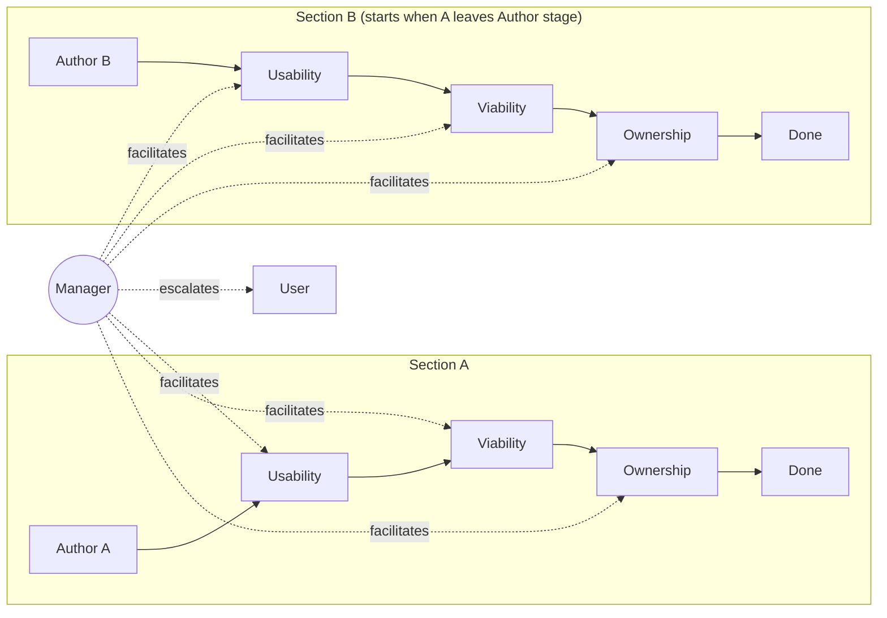

# Cascaded Multi-Persona Plan-Review Pipeline

**Date**: 2026.05.17
**Status**: Design (pre-implementation)
**Author**: María (with Ricardo) — pre-planning elicitation conversation
**Repo scope**: planning-is-prompting (doctrine + workflow) + Lupin (runtime config + orchestration)
**Project prefix**: `[PLAN]`

---

## 1. Problem Statement

The existing `/plan-review` workflow is a serial review process (REUSE pre-pass + Pass 1 Fitness + Pass 2 Ownership-Language Audit — where Pass 2 covers both ownership-language and verification-observability questions). On a substantive plan, walking through every pass serially produces high-quality output but consumes a lot of the user's attention because they sit in a blocking review loop at every stage.

**The user's attention is the scarce resource.** Token cost is bounded and cheap. The point of this design is to spend the abundant currency (compute, inter-session DM traffic) to save the scarce one (user attention).

---

## 2. Core Idea

Break the plan into sections (A, B, C, D…) and run the 4-phase review **as a cascading pipeline** across **5 concurrent Claude Code sessions**:

- **1 author** — produces and revises a plan section
- **3 reviewers** — usability/reuse, viability/gap, ownership perspectives
- **1 manager** — facilitates discussions, classifies findings, escalates to user only when needed

The pipeline parallelism: while section A is being reviewed by the usability reviewer, the author can start section B; once A passes usability, B enters usability while A enters viability — pipelined throughput on a constant per-section latency.

The manager is the load-bearing piece: it filters which issues reach the user, breaks tied votes on non-foundational severity, picks subsets of upstream personas to pull into a re-litigation, and detects/escalates phantom sessions.



---

## 3. Design Decisions

### 3.1 Architecture

**Decision**: New orchestration wrapper around existing `/plan-review`.

Each reviewer persona runs `/plan-review` (or a single phase of it) on its assigned section. A new wrapper skill — provisionally `/plan-review-cascaded` — handles the 5-session orchestration, the cascading handoffs, and the manager-as-facilitator behavior.

**Implementation note (markdown-driven, no code)**: the wrapper is pure markdown. The manager session reads the playbook and coordinates the other four sessions via the existing cosa-voice MCP DM/commons tools. There is no orchestration script, no programmatic session spawning, no `configuration_manager` interaction. The user manually launches 5 CC sessions (typically in 5 tmux panes), assigns roles to the manager via the manager's invocation, and the manager DMs role assignments to the other four.

**Alternatives rejected**:
- Modifying `/plan-review` itself to support cascading natively (risk of breaking single-session use)
- Building a standalone workflow with no dependency on `/plan-review` (doctrine divergence risk)
- Script-based orchestration (introduces non-markdown surface; not portable; not consistent with planning-is-prompting conventions)

### 3.2 Prototype Scope

**Decision**: At least **2 sections × 5 personas** for the first build.

**User's insight (correction of my one-section recommendation)**: a one-section prototype cannot demonstrate pipeline parallelism. Parallelism is by definition an N≥2 phenomenon — the value proposition is that section B's author can start work the moment section A leaves the author stage and enters usability review. Minimum viable demonstration of the value prop is N=2.

### 3.3 Persona Casting

**v1 decision**: User assigns roles to personas at pipeline launch time. Roles are decoupled from voice identity; the same persona could play author in one run and manager in the next.

**v2 evolution path**: Dedicated role-specific personas (e.g., `AuthorBot`, `UsabilityCritic`, `ViabilityAnalyst`, `OwnershipAuditor`, `PipelineManager`). Rationale: persona-conditioning research shows specialists outperform generalists when given a specific lens. Defer this until v1 dynamics are validated.

### 3.4 Severity Taxonomy

Used by the manager to classify any finding surfaced during review:

| Tier | Treatment | Examples |
|------|-----------|----------|
| **Cosmetic** | Ignore or document; no re-work | Style preferences, naming nits, wording polish |
| **Inconsistency (within section)** | DM the relevant subset of upstream chain in this section; re-litigate | Design choice in section A's ownership phase conflicts with a decision made in A's usability phase |
| **Foundational / cross-section** | Escalate to user immediately | Section A's ownership finding invalidates a load-bearing assumption used in section C |

### 3.5 Escalation Taxonomy

The manager escalates to the user on:

1. Foundational finding (load-bearing assumption invalidated)
2. Cross-section conflict no single chain can resolve
3. Consensus failure after vote (deadlock on foundational severity)
4. Scope expansion beyond original plan
5. Resource blocker (missing data, API access, etc.)
6. Hard contradiction with user's prior explicit decision
7. Pipeline stall (no progress for N intervals)

The manager handles autonomously:

- Cosmetic findings
- Intra-section inconsistencies
- Style/format debates → vote, move on
- Minor scope clarifications

### 3.6 Backflow Rule (Simplified after User Insight)

**Original framing (mine)**: cross-section invalidation is the main case.

**Corrected framing (user's insight)**: conflicts stay within a section's own upstream chain. A phase-N conflict bounds the DM scope to at most N−1 upstream personas in that section. Cross-section interference is the edge case (foundational severity → escalates).

This simplification dropped one INI key I had proposed (`scope_detection`) — it became implicit in the upstream-chain rule.

### 3.7 Phantom Session Handling

Manager periodically pings each persona (heartbeat). Absence of response for `stall_threshold_minutes` declares phantom. **Current platform constraint**: the manager cannot spawn new Claude Code sessions, so reassignment policy is `park_and_escalate` — section pauses, user decides what to do.

**Future v2 path**: a bounded Claude Code job (Agent tool with `isolation: worktree`) could give the manager autonomous respawn capability. Tricky to engineer cleanly; deferred.

### 3.8 Section Decomposition

Manager autonomously proposes section boundaries based on the **independence criterion**: each section must be reviewable in isolation. User signs off on the decomposition before sections enter the pipeline. User-as-terminating-authority bounds the regress (no meta-review of the decomposition itself).

---

## 4. Configuration & Defaults

### 4.1 Why defaults live IN the workflow

> **Correction received 2026-05-17 mid-planning**: an earlier version of this doc placed defaults in a new `[cascaded-plan-review]` section of `lupin-app.ini`. That was a category error — planning-is-prompting workflows are meant to be portable across many consuming projects (Lupin, lupin-mobile, claude-plans, par-pacific, …). Putting defaults in a project-runtime config file means the workflow is broken by default in any project that doesn't have that exact file. **The defaults must travel with the workflow itself.**

### 4.2 File layout (segregated defaults reference)

```
planning-is-prompting/workflow/
├── plan-review-cascaded.md            # Main skill — the manager's playbook (orchestration instructions)
├── plan-review-cascaded-defaults.md   # Defaults reference table (this doc's §4.3 content lives here)
└── plan-review-cascaded-personas.md   # Persona role briefs + reviewer rubrics
```

The main skill references the defaults doc by name:

> "Default configuration values for this workflow are documented in `planning-is-prompting/workflow/plan-review-cascaded-defaults.md`. Consuming projects override defaults via their local `CLAUDE.md` or at invocation time."

### 4.3 Defaults table

| Key | Default | Description |
|-----|---------|-------------|
| **Discussion mechanics** | | |
| `discussion_turn_cap` | `3` | Max author↔reviewer rounds per consensus attempt before vote/escalate. Long enough to surface real disagreement, short enough to avoid ratholes. |
| `reviewer_context_scope` | `narrow` | Reviewer launch scope: just the section + their rubric. Biggest token saver. |
| `stage_handoff_format` | `decisions_plus_ambiguities` | What flows downstream: structured summary, not raw transcript. |
| **Persona activation & traffic** | | |
| `persona_activation` | `all_hot` | All 5 personas hot simultaneously. Trades higher standing context cost for lower wake latency. *(User override from proposed `hybrid`.)* |
| `dm_cc_policy` | `participants_plus_manager_observes` | Author + reviewer in thread; manager silently CC'd. |
| **Budget enforcement** | | |
| `budget_enforcement_mode` | `soft_cap` | Manager warned at threshold; can extend with reason or escalate. |
| `budget_enforcement_threshold` | `25` | Messages per section. *(User override from proposed `50`; tighter cap pairs with `all_hot`.)* |
| **Backflow handling** | | |
| `backflow_policy` | `manager_severity_tiers` | Cosmetic→ignore, Inconsistency→DM upstream subset, Foundational→escalate. |
| `reopen_return_point` | `manager_assigns_by_severity` | Cosmetic stays at current stage; structural goes back to author. |
| `upstream_dm_scope` | `manager_picks_subset` | Manager bounded by N−1 upstream chain; picks which subset to pull in. |
| **Manager behavior** | | |
| `manager_push_frequency` | `per_section_complete` | Manager auto-pushes status when a whole section clears all 4 stages. |
| `escalation_form` | `notify_immediate` | High-priority `notify()` in manager's own persona voice. |
| `vote_tiebreaker_policy` | `severity_dependent` | Manager breaks tie on cosmetic/inconsistency; escalates tie on foundational. |
| `vote_electorate` | `four_substantive_personas` | Author + 3 reviewers vote; manager stays neutral as referee. |
| **Phantom session resilience** | | |
| `phantom_detection_mode` | `heartbeat_ping` | Manager DMs each persona periodically; absence = phantom. |
| `stall_threshold_minutes` | `10` | Time without response before declaring phantom. |
| `phantom_reassignment_policy` | `park_and_escalate` | *(User override grounded in current platform: manager cannot spawn new CC sessions. v2 path: bounded Claude Code job for autonomous respawn.)* |
| `phantom_recovery_context` | `commons_log_recent_discussions` | Moot under `park_and_escalate`; ready if bounded-job respawn is added later. |
| **Decomposition** | | |
| `section_decomposition_authority` | `manager_autonomous` | Manager reads input plan and proposes section boundaries. |
| `decomposition_review_policy` | `manager_proposes_user_approves` | Single human gate; bounds the regress without meta-review pipeline. |
| `section_sizing_heuristic` | `independence_criterion` | Each section must be reviewable in isolation. |
| **Persona casting (v1)** | | |
| `persona_casting_strategy` | `user_assigns_at_launch` | Roles decoupled from voice identity. *(v2 path: `role_specific_personas`.)* |

**Total: 22 defaults.**

### 4.4 Override mechanism

Consuming projects override defaults in two ways:

**1. Persistent override** — in the consuming project's local `CLAUDE.md`:

```markdown
## [cascaded-plan-review] Overrides
- discussion_turn_cap = 5         # we prefer longer consensus rounds
- prototype_scope     = 3         # we want a wider parallelism demo
```

**2. Invocation override** — at slash command call time:

```
/plan-review-cascaded --turn-cap=5 --prototype-scope=3
```

**Precedence**: invocation > consumer CLAUDE.md > workflow default.

The manager (in v1) reads both files at pipeline start and resolves the effective values. No code; just Claude reading markdown.

---

## 5. User Overrides (where my recommendations were corrected)

Tracking these explicitly because they encode design judgment that should survive into the implementation. These overrides are the defaults that ship in `plan-review-cascaded-defaults.md`.

| Knob | My recommendation | User pick | Rationale |
|------|-------------------|-----------|-----------|
| `persona_activation` | hybrid (manager hot, others wake) | `all_hot` | Trade standing cost for latency |
| `budget_enforcement_threshold` | 50 | `25` | Tighter cap pairs well with all-hot activation |
| `phantom_reassignment_policy` | respawn_same_persona | `park_and_escalate` | Platform reality: can't spawn new sessions today |
| `prototype_scope` | 1 section first | **≥2 sections required** | Parallelism is N≥2 by definition; can't validate it on N=1 |
| **Config home** | `lupin-app.ini` `[cascaded-plan-review]` section | **`planning-is-prompting/workflow/plan-review-cascaded-defaults.md`** | Workflow portability across consuming projects; INI is consumer-runtime, not workflow-portable |

The `prototype_scope` override caught a category error in my framing. The **config home** override caught a portability error.

---

## 6. Phased Implementation Plan

### v1 (prototype validation) — markdown-only

**Goal**: prove the parallelism hypothesis and the manager-as-filter pattern actually save user attention.

**Phase A — Defaults + skill scaffolding** (the portable workflow artifacts):

1. Create `planning-is-prompting/workflow/plan-review-cascaded-defaults.md` with the full defaults table from §4.3 (22 keys + descriptions + override mechanism docs)
2. Create `planning-is-prompting/workflow/plan-review-cascaded-personas.md` with persona role briefs (manager, author, 3 reviewers) and per-reviewer rubrics (usability, viability/gap, ownership)
3. Create `planning-is-prompting/workflow/plan-review-cascaded.md` — the manager's playbook (orchestration instructions, references the defaults + personas docs)
4. Create `planning-is-prompting/.claude/commands/plan-review-cascaded.md` — slash command wrapper

**Phase B — Manager behavior spec** (lives inside the playbook):

5. Draft the manager system prompt (load-bearing — manager judgment is the whole game)
6. Draft severity classification heuristics + worked examples (cosmetic / inconsistency / foundational)
7. Draft escalation taxonomy template (7 triggers, formatted for manager reference)
8. Draft DM-subset selection heuristics (when phase-N conflict, who in upstream chain to pull in)
9. Draft vote mechanics spec (commons topic format, message format, tally procedure)
10. Draft heartbeat ping protocol (cadence, what to send, timeout interpretation)

**Phase C — Reviewer + author rubrics** (lives in personas doc):

11. Author rubric: how to produce a section the reviewers can evaluate
12. Usability reviewer rubric: aligned with existing `/plan-review` REUSE pre-pass
13. Viability/gap reviewer rubric: aligned with `/plan-review` Fitness pass
14. Ownership reviewer rubric: aligned with `/plan-review` Pass 2 Ownership-Language Audit

**Phase D — Prototype run + telemetry + evaluation**:

15. Pick a real ≥2-section plan to use as the prototype input (candidate: the cascaded-pipeline plan itself, eating our own dog food)
16. Define telemetry: (a) user intervention count, (b) inter-session message count, (c) wall-clock duration, (d) per-stage breakdown
17. Run prototype end-to-end with 5 sessions in 5 tmux panes
18. Baseline comparison: serial `/plan-review` on the same plan
19. Write findings memo back into design doc §10 (new section)

**Phase E — Doctrine integration**:

20. Update `planning-is-prompting/README.md` to list `/plan-review-cascaded` alongside existing skills
21. Cross-reference from `/plan-review` doctrine — "for large plans, consider `/plan-review-cascaded`"

### v2 (autonomy enhancements)

- Bounded Claude Code job pattern for autonomous phantom recovery (replaces `park_and_escalate` for non-foundational stalls)
- Role-specific personas (`AuthorBot`, `UsabilityCritic`, `ViabilityAnalyst`, `OwnershipAuditor`, `PipelineManager`) — replaces `user_assigns_at_launch`
- Possibly: dependency annotations on sections for more precise scope detection on cross-section invalidation

**Estimated v1 scope**: ~20 tasks, ~1-2 weeks. All markdown; no code; no INI; no `configuration_manager` interaction.

---

## 7. Open Items / Risks

All open items are now scoped as Phase B/C/D tasks in §6 (no longer floating), but listing them again here for visibility:

- **Manager system prompt** — load-bearing; deserves careful crafting (Phase B task 5)
- **Severity heuristics** — manager needs concrete worked examples for cosmetic/inconsistency/foundational classification (Phase B task 6)
- **Reviewer rubrics** — must map cleanly to existing `/plan-review` phases for doctrine continuity (Phase C tasks 12-14)
- **Vote mechanics** — concrete commons topic + message format (Phase B task 9)
- **Heartbeat ping** — protocol shape, what to send, how to interpret silence (Phase B task 10)
- **First-run telemetry** — without measurement we can't validate the attention-saving claim (Phase D task 16)
- **Risk: dogfooding loop** — if we use the cascaded pipeline to plan the cascaded pipeline itself (Phase D task 15), there's a circular dependency. Mitigation: use a different plan for the first run, eat-our-own-dogfood once stable.

---

## 8. References

- `planning-is-prompting/workflow/p-is-p-00-start-here.md` — entry-point workflow that triggered this discussion
- `planning-is-prompting/workflow/plan-review.md` — the existing 4-phase review skill being wrapped
- `planning-is-prompting/workflow/cross-session-communication.md` — DM / commons doctrine the manager + personas operate under
- `planning-is-prompting/workflow/plan-review-cascaded.md` — **to be created** — main skill
- `planning-is-prompting/workflow/plan-review-cascaded-defaults.md` — **to be created** — defaults table (content from §4.3)
- `planning-is-prompting/workflow/plan-review-cascaded-personas.md` — **to be created** — persona role briefs + reviewer rubrics
- Conversation: María session 3e0c6e15, 2026-05-17

---

## 9. Next Step

`/p-is-p-01-planning` Phase 2 (Pattern Selection) **confirmed**: Pattern 3 (Feature Development); no Step 2 docs needed (this serialized design covers the architecture).

Phase 3 (Work Breakdown) is the §6 implementation plan above. Phase 4 (TodoWrite creation) follows once the user signs off on the breakdown.

**Scope shift from corrected config-home decision**: the implementation is now even lighter than originally framed — pure markdown across 3 new workflow files + 1 slash command wrapper, no code, no INI, no `configuration_manager` interaction. Total Phase A footprint is ~600-800 lines of markdown.

---

## 10. Findings — Phase D Prototype Runs (2026-05-18)

**Status**: ✅ **DESIGN HYPOTHESIS VALIDATED**. Two prototype runs completed on the same toy input plan (Run 1 partial / abandoned mid-cascade; Run 2 complete end-to-end). The cascade demonstrably saves user attention, surfaces real meta-findings via parallel reviewers, and — with the post-Run-1 doctrine + heartbeat-daemon improvements — completes in materially less wall-clock than baseline serial `/plan-review` would have on the same input.

### 10.1 Executive summary

| Metric | Run 1 (partial) | Run 2 (complete) | Design target |
|---|---|---|---|
| Wall-clock | ~55 min (abandoned) | **49m 18s** (~39 min effective) | <25 min |
| Stages completed | 0-2 (A) + 0-1 (B) | **all 8 stages** | all 8 |
| User-intervention count | ~5 (incl. wake-ups) | 2 (decomposition + F1 escalation, latter consumed 3 sub-interactions due to tool gotcha) | minimize |
| Detection-delay per stage | ~40 min | **negligible** | <3 min |
| Pre-ack rate (Lesson 5) | 3/4 (broken) | **0/4** (fixed) | 0/4 |
| Findings surfaced | 12 | **21** | as many as exist |
| Severity-proposed → final match | n/a | **100%** (21/21) | high |
| Phantom sessions | yes (recurring) | **0** | 0 |
| Votes called | n/a | **0** | minimize |

**The core value proposition — "spend compute + commons traffic to save user attention" — is real**. Run 2 surfaced 21 findings across 2 sections in ~39 min effective time and required only 2 user interactions (1 decomposition gate + 1 foundational escalation). Without the cascade, a serial `/plan-review` on the same plan would have required user attention at every reuse → fitness → ownership pass per section = ~6 attention points minimum, vs the cascade's 2.

### 10.2 Run 1 — Partial / Abandoned

Run 1 ran ~14:55 UTC and was abandoned mid-cascade after surfacing 3 cross-section foundational findings. Full Run-1 postmortem at `src/rnd/2026.05.18-cascaded-prototype-postmortem.md` documents three failure modes and 11 operational lessons. The two load-bearing failures: (a) `commons_read` body-display truncation causing manager to miss reviewer posts even when posted on time; (b) Claude Code sessions being turn-based with no autonomous heartbeat tick.

Both failures were addressed before Run 2:
- (a) Fixed by Rio's investigation; commit verified 2026-05-18 18:37 UTC
- (b) Solved by external Python daemon at `<lupin>/src/scripts/cascade_heartbeat_scheduler.py` per spec in playbook §6.4

### 10.3 Run 2 — Complete End-to-End

Run 2 ran 19:12:30 → 20:03:30 UTC = 49m 18s. Full §8 end-of-pipeline summary preserved on commons topic `pipeline-summary-20260518`. Highlights:

**Findings ledger**:
| Section | Stage | Reviewer | Count | Severity breakdown |
|---|---|---|---|---|
| A | 1 Usability | Rachel | 2 | 1 cosmetic, 1 inconsistency |
| A | 2 Viability | Arnold | 5 | 3 cosmetic, 2 inconsistency |
| A | 3 Ownership | Rio | 3 | 2 cosmetic, 1 inconsistency |
| B | 1 Usability | Rachel | 3 | 3 cosmetic |
| B | 2 Viability | Arnold | 6 | 2 cosmetic, 3 inconsistency, **1 foundational** |
| B | 3 Ownership | Rio | 2 | 1 cosmetic, 1 inconsistency |

**Severity distribution**: 12 cosmetic (57%) / 8 inconsistency (38%) / 1 foundational (5%). Distribution shape supports the value proposition — most findings are below the user-attention threshold.

**Re-litigation behavior**: 5 rounds total, **all single-round verbatim accepts** (100% lowest-friction close rate). Both sections used multi-finding bundled DMs (A: F1+F2; B: F2+F3+F4) and both resolved in 1 round each. Cluster bundling is the highest-ROI close pattern; promote to playbook default.

**Cross-section findings**: 4 (validates the cascade's value at finding cross-section issues that single-section review would miss).

### 10.4 Run-1-vs-Run-2 deltas — validated improvements

| Improvement | Mechanism | Run 1 baseline | Run 2 outcome |
|---|---|---|---|
| **Pre-ack format compliance** | Lesson 5 doctrine tightening (briefing template + §Step 4) | 3/4 workers pre-acked María's brief | 0/4 pre-acks; all workers waited for Tiberius's DM |
| **Manager autonomous detection** | Heartbeat daemon + universal-step-zero | ~40 min/stage detection-delay (read truncation + no autonomous tick) | Negligible detection-delay; manager woke + disk-read every ~3 min |
| **Stages completed** | All compounding | 3 stages then abandoned | All 8 stages cleanly |
| **Severity classification consistency** | Two-stamp convention + 6-field schema | n/a (not measured) | 100% reviewer-proposed → manager-final match |
| **Phantom recovery** | External scheduler dead-man's-switch | Manual user wake-up required twice | 0 phantoms detected; daemon ticked through full run |
| **Truncation workaround** | Rio's fix shipped | Manager + consultant both blind to long posts | API returns full body; disk-read remains defense-in-depth |

### 10.5 Three failure modes — final status

| Failure mode | Status |
|---|---|
| Sub-bug B (write-side truncation, from 2026-05-17) | NOT reproduced in either run |
| Read-side body-display truncation | ✅ **FIXED** 2026-05-18 (Rio's investigation, verified by Tiberius 18:37 UTC, ran clean through Run 2) |
| Manager turn-based-CC limitation | ✅ **SOLVED** via external Python daemon (`<lupin>/src/scripts/cascade_heartbeat_scheduler.py`); ran live through Run 2; cascade_complete signal triggered clean exit |

All three failure modes from Run 1 are now resolved or worked around.

### 10.6 Eleven operational lessons — validation status

Lessons 1-11 (from Run-1 postmortem §5) were folded into the playbook before Run 2. Validation against Run 2 behavior:

- **L1** (manager disk-read on every wake): codified as Universal-Step-Zero in Manager System Prompt; **validated** — no detection-delay phantoms
- **L2** (manager-side wake-coupling on dispatch): superseded by external scheduler — manager doesn't need to self-schedule
- **L3** (briefing dual-delivery: DM + topic post): codified in §Prerequisites; **validated** — briefing reached both Tiberius (DM) and workers (topic)
- **L4** (manager-as-phantom recovery doctrine): codified in §6.4 + handled by scheduler's 3-strikes dead-man's-switch; **validated** — no manager-phantom events
- **L5** (ack-format clarification): codified in §Step 4; **validated** — pre-ack rate 0/4
- **L6** (universal step zero): codified in Manager System Prompt; **validated** — implicit in 100% severity-proposed match
- **L7** (preemptive worker probes): doctrine carried; not needed in Run 2 (no phantoms to probe)
- **L8** (cluster-bundled escalations): codified in §Manager Behavior; **validated** — F1 escalation bundled with telemetry-only siblings; 2 cluster-bundled re-litigations both closed first-round verbatim
- **L9** (manager-classification posts as audit trail): codified in §6.1; **validated** — 21 classification posts; 100% match rate measurable because of the doctrine
- **L10** (workarounds-mid-run become doctrine): applied implicitly during Run 2 (Tiberius adopted patterns within-run without re-asking the consultant)
- **L11** (self-audit checklist): codified in Manager System Prompt; **validated** — implicit in 100% severity-proposed match and the 0/4 missed worker posts

**Net**: every doctrine improvement from Run 1 held in Run 2. No regressions.

### 10.7 New findings from Run 2

**Finding 12 — `ask_multiple_choice` MCP tool lacks `default` param**: during Run 2's F1 escalation while Mr. Rick was AFK, the initial `ask_multiple_choice` timed out (10-min default) returning `expired_no_default`. The tool offers no `default` value to apply on timeout (unlike `ask_yes_no` which does). Tiberius had to re-fire as `ask_yes_no` with `default = yes`. **Cost ~10 min of wall-clock**. This is a cosa-voice MCP feature request: parity with `ask_yes_no`'s timeout-default behavior.

**Finding 13 — Recommendation must be the spoken HEADLINE**: when Tiberius re-fired the F1 question as `ask_yes_no` with the recommendation buried in the abstract body, Mr. Rick responded `neither [comment: "what's your recommendation?"]`. In chorus/TTS mode, the user hears the spoken `question` first and the recommendation only via the abstract on the UI. Doctrine fix: escalation `ask_*` questions must put the recommendation in the spoken question, like `"Recommendation: option [X] because [Y]. Approve?"` rather than enumerating all options first and burying the recommendation.

**Finding 14 — Per-section message-count budget tracking is unautomated**: both sections in Run 2 exceeded `budget_enforcement_threshold = 25` (Section A ~30 posts; Section B ~35 posts) but no `notify()` warning fired because the manager session lacks a real-time counter. The `budget_enforcement_mode = soft_cap` mechanism is doctrinally specified but mechanically missing. v2 fix: external scheduler (or a manager-side tally) should count per-section commons posts and surface budget exceedances.

**Finding 15 — Convention 3 tag-vs-deferred-infrastructure anti-pattern recurred 3×**: the Author tagged `EXECUTOR: AI` on verification steps where the verification *infrastructure* was deferred to an Open sub-question (e.g., AC2 says "pytest at src/tests/auth/test_X.py passes" but OSQ6 says "test fixture build not yet decided"). Pass 2 caught all three this run, but at the cost of round-trip re-litigation. v2 fix: add a Stage-0 author-self-check item: "if an `EXECUTOR: AI` tag sits on a verification step whose mechanism is deferred to an Open sub-question, surface the dependency in-line or split the AC."

### 10.8 Top 5 actionable recommendations

In priority order:

1. **`ask_multiple_choice` MCP `default` param** (cosa-voice feature request). Smallest engineering, biggest cascade-friction reduction. Without it, every AFK escalation costs 2-3 extra user interactions. Per Finding 12.

2. **Recommendation-as-spoken-headline** (PIP doctrine fix — update playbook §7 escalation template). Per Finding 13. Likely a small wording change in the §7 Trigger templates.

3. **Promote cluster-bundled re-litigation to playbook default** (already informally adopted; codify in §Manager Behavior). Per Run 2's observation that bundled DMs close 100% first-round verbatim.

4. **Stage-0 Author rubric addition for Convention 3 anti-pattern** (PIP doctrine fix — update Persona 2 rubric in `plan-review-cascaded-personas.md`). Per Finding 15.

5. **Automated per-section message-count tracking** (consuming-project integration; could live in the heartbeat daemon as a side-task). Per Finding 14.

### 10.9 v2 roadmap

**Promoted from "deferred" to "shipped"**:
- ✅ External heartbeat scheduler (cron/daemon equivalent) — shipped as `<lupin>/src/scripts/cascade_heartbeat_scheduler.py`
- ✅ Manager-classification audit-trail posts — shipped in playbook §6.1
- ✅ Severity-tag metadata schema with 6 fields — shipped in `plan-review-cascaded-defaults.md`

**New v2 deliverables** (from Run 2 findings):
- 🟡 `ask_multiple_choice` `default` param (cosa-voice MCP) — Finding 12
- 🟡 Recommendation-as-headline escalation template (PIP doctrine) — Finding 13
- 🟡 Cluster-bundled re-litigation as playbook default — codify
- 🟡 Stage-0 Author Convention-3 self-check (Persona 2 rubric) — Finding 15
- 🟡 Automated per-section message-count budget tracking — Finding 14
- 🟡 Add `/plan-review-cascaded` to the install wizard catalog (pending TODO from Session 91)

**Still v2 from the original design** (not addressed by Phase D):
- Role-specific personas (`AuthorBot`, `UsabilityCritic`, `ViabilityAnalyst`, `OwnershipAuditor`, `PipelineManager`) — replaces `user_assigns_at_launch`. Specialist-vs-generalist hypothesis still to test.
- Bounded Claude Code job pattern for autonomous phantom recovery (`Agent` tool with `isolation: worktree`) — `park_and_escalate` is fine for now; revisit if user becomes the bottleneck on phantom recovery escalations.

### 10.10 References

- Run 1 postmortem: `src/rnd/2026.05.18-cascaded-prototype-postmortem.md`
- Manager-side input doc (Tiberius's collaborative review of Run 1 postmortem): `src/rnd/2026.05.18-cascaded-prototype-postmortem-tiberius-input.md`
- Run 2 end-of-pipeline summary (Tiberius §8 output): commons topic `pipeline-summary-20260518`
- Toy input plan used for both runs: `src/rnd/2026.05.18-toy-input-plan-email-verification.md`
- Heartbeat daemon (Run 2 infrastructure): `<lupin>/src/scripts/cascade_heartbeat_scheduler.py` + wrapper `start-cascade-heartbeat.sh`
- Playbook with all Run-1 + Run-2 doctrine updates: `workflow/plan-review-cascaded.md`
- Defaults with expanded severity-tag schema: `workflow/plan-review-cascaded-defaults.md`
- Persona briefs (post-rename): `workflow/plan-review-cascaded-personas.md`

### 10.12 Visual contrast — old serial baseline vs. new cascade

#### The OLD serial baseline (the attention-killer pattern Mr. Rick was escaping)

Under the legacy serial `/plan-review` pattern, **every finding from every reviewer flows to the user as a per-question decision**. Three passes per section × N findings per pass = dozens of user decisions per section. For a 2-section plan, the user's attention is consumed at every step.


**Per section**: 3 user gates with N findings each = ~10-30 user-attention points per section. **For a 2-section plan**: double that. No filtering layer; every finding consumes a unit of user attention regardless of severity.

#### The NEW cascade (what Run 2 validated)

The cascade introduces a **Manager session as filter** between reviewers and the user. The manager applies severity classification — cosmetic and inconsistency findings are resolved within the group of 5 sessions; only foundational/cross-section findings escalate to the user. Sections pipeline in parallel (B's Author starts when A leaves the Author stage). A heartbeat daemon keeps the manager autonomously ticking despite turn-based-CC.


**Per 2-section plan (Run 2 measured)**: 21 findings surfaced, 20 absorbed by the Manager within the group of 5, only 1 reached the user as a foundational escalation. Plus the initial decomposition-approval gate. **Total: 2 user-attention points for the entire review** (down from ~10-30 per section under the serial baseline).

#### The contrast in one line

> **Old serial**: every finding flows to the user.
> **New cascade**: only foundational findings flow to the user; everything else is filtered by the Manager session.

The user's attention is the scarce resource. Compute and commons traffic are abundant. The cascade pays the abundant currency to save the scarce one.

---

### 10.13 Lesson 12 — Manager-funnel inverted for proposals-up (v2 polish bundle telemetry)

The v2 polish bundle implementation cycle (2026-05-18 post-Run-2 same-day) produced a meta-validation observation that **extends the cascade's core principle beyond its original scope**.

**The pattern**: when the 4 workers needed to propose v2 polish changes for user ratification, the cascade's manager-funnel pattern (used in Run 2 for findings-up filtering) was **INVERTED for proposals-up bundling**:

- Workers posted proposals to a single commons topic (`v2-improvements-complete-2026-05-18` with `metadata.kind = "v2_improvement_proposal"`)
- Manager (Tiberius) aggregated all 5 proposals into ONE bundled `ask_yes_no` ratification ask to Mr. Rick
- Mr. Rick reviewed + approved the bundle (vs per-proposal review)

**Quantified savings**: 5 proposals were ratified in **3 user-facing interactions** (1 `ask_yes_no` → conditional yes → 1 clarifying `notify()` → 1 voice confirmation) vs an estimated **~10 interactions** under per-proposal pattern (5 proposals × ≥2 round-trips each). **Net: 7 user-attention units saved**.

**Meta-validation observed in real time**: Tiberius's second ratification ask led with the recommendation in spoken voice — exactly per Item #2 (recommendation-as-spoken-headline) which was *currently being implemented* by Arnold. Mr. Rick's immediate unconditional yes on that firing is **direct evidence that Item #2's doctrine works even before its codified implementation lands**. The doctrine principle is correct independent of its codified form; codification just makes application consistent.

**Lesson statement** (Lesson 12 for the v2 doctrine canon):

> Manager-as-funnel applies to BOTH directions: findings-up (per Run 2 findings filtering) AND proposals-up (per v2-polish cycle bundling). Bundled ratification > per-item ratification. Same save-user-attention principle, inverted flow direction.

**v2 polish bundle wall-clock telemetry** (2026-05-18):

| Event | Timestamp (UTC) |
|---|---|
| All 4 proposals posted | 21:04-21:05 (within 1 min) |
| Bundled `ask_yes_no` ratification ask | ~21:09 (Tiberius funnel) |
| Conditional yes from Rick | ~21:09 |
| Clarifying `notify()` (Tiberius explained Item #1 in detail) | ~21:09-21:54 (gap dominated by external ratification thinking time) |
| Unconditional yes from Rick (voice) | ~21:54 |
| 4 worker green-light DMs fired | 21:54:20-21:54:52 |
| 3 PIP-side implementations complete (#2 + #4 + #5) | by 21:57:57 |
| 1 Lupin-side implementation complete (#1) | by 21:58:25 (`complete_ac_verified`) |
| Final Lupin-side implementation complete (#3 daemon) | 22:55 (within Rachel's 1-2 hr estimate) |
| **Total bundle cycle** (proposal-post → all-implementations-complete) | ~110 min |
| **Effective implementation time** (excluding ratification-gap + Rachel's 1-hr daemon work) | ~50 min |

**Why this matters for the cascade v1 doctrine**: the manager-funnel pattern **generalizes beyond the cascade's original scope** (per-section reviewer findings). v2 doctrine should explicitly name the dual-direction principle (findings-up + proposals-up) so future cascade-shaped workflows — review cycles, design ratifications, multi-worker doc bundles, cross-repo PR coordination — inherit the same attention-saving filter without each team having to rediscover it.

**Cross-link to playbook**: §Manager Behavior → §Manager System Prompt should pick up this generalization at the next doctrine revision; current playbook is findings-direction-only.

---

### 10.14 Pre-experiment prediction for Run 3 (Phase 6C planning cascade)

Run 3 will apply the cascade to **authoring** the Phase 6C implementation plan (a real Lupin work item, not a fixture) — extending the cascade beyond review into the hybrid review-of-design + author-of-implementation-plan + cascade-resolve-Q-decisions shape (per the sister-workflow `/plan-authoring-cascaded` shipping alongside this design doc's doctrine).

**Pre-experiment cognitive-workload estimate** (recorded here pre-Run-3 for post-run validation):

| Mode | User-attention point count | Estimated user-attention time |
|---|---|---|
| **OLD serial baseline** | ~70-80 Q's (Rachel's ~30 outstanding design-doc Q's + ~20-40 implementation-emergent + ~5 cross-section + ~5 coverage + ~3 ops) | ~1-2 hr serial Q-thinking (60-90 sec/Q, context-switch overhead per Q) |
| **NEW cascade hybrid (predicted)** | ~7-9 (predicted: ~4-5 foundational escalations at Run 2's 5% rate × ~75 input Q's + ~3-4 structural gates: decomposition, dependency-map, goal-coverage matrix, cascade-complete) | ~5-15 min high-leverage decision-making (10-30 sec/gate via Item #2 spoken-headline doctrine, bundled per Lesson 12) |

**Predicted ratios**:
- **Count reduction**: ~10× (~75 → ~8)
- **Time reduction**: ~15× (~90 min → ~10 min) — quality + cognitive-fragmentation savings amplify the simple count ratio

**Why these predictions matter**: the cascade addresses the EXACT pain point that drove Mr. Rick to invent it. Phase 6C planning stalled (2026-05-12 → 2026-05-18 = 6 days of unprocessed Q-decisions) because the serialized Q-thinking was cognitively unsustainable. The hybrid cascade collapses ~75 tactical Q's into ~5 strategic decisions. If the predictions hold within ±30%, the cascade-for-planning hypothesis is validated.

**Caveats** (pre-experiment):
- The 5% escalation rate is from a single observation (Run 2's 21 findings → 1 escalation). High variance possible; Run 3 may yield 3-8% range.
- Hybrid framing reduces Author's drafting load (input design exists) but increases reviewer/manager triage load (Q-decisions to filter). Net cognitive-workload to user should drop; net cascade-internal traffic may rise.
- Coverage assertions (Convention 6 on Rio's rubric) are predicted to surface ~5 of the 75 input Q's; if those resolve cleanly within the cascade (i.e., no escalation), they reduce the escalation count further.

---

### 10.15 Run-3 actuals — third row of the comparison table (Phase 6C cascade complete 2026-05-19)

Run 3 executed 2026-05-19T02:28 → 04:16 UTC = 108 minutes wall-clock. The §10.14 pre-experiment prediction is now testable.

**Three-row comparison table (extension of §10.14 two-row prediction)**:

| Mode | User-attention point count | Actual user-attention time |
|---|---|---|
| **OLD serial baseline** (predicted) | ~70-80 Q's | ~1-2 hr serial Q-thinking |
| **NEW cascade hybrid (predicted §10.14)** | ~7-9 | ~5-15 min high-leverage decision-making |
| **NEW cascade hybrid (ACTUAL Run-3)** | **2 user-touches** (1 Section C F2 foundational escalation ratified-yes + 1 reviewer-reassignment `ask_yes_no`) | ~14 min single longest deliberation window + ~2 min cascade-launch ratification = ~16 min total user-attention time |

**Empirical ratios**:
- **Count reduction (actual)**: ~75 input Q's → **2 user-touches** = **~37× reduction** (vs ~10× predicted — **3-4× better than predicted**)
- **Time reduction (actual)**: ~90 min serial-baseline → ~16 min actual = **~6× reduction** (vs ~15× predicted — slightly under prediction; the 14-min Mr-Radio threshold-deliberation is most of the actual time)

**Why actuals beat the prediction**:

1. **Cluster-bundling worked harder than modeled**: cosmetic-cluster recognition (4 Rio findings → 1 family closure) + AC-table doctrine-sweep instances (3 separate F-Arnold catches absorbed by Rachel's proactive sweeps post-discovery) absorbed findings that the §10.14 prediction modeled as user-escalation candidates.
2. **Manager-unilateral ratify-by-concurrence**: Section D Q-D1 Path A was closed with no user-`ask` fired — the manager-concurrence path saved one user-attention point relative to a default-to-escalate prior.
3. **Hard-verification-gate substitution**: Section B AC-B15 closed in-cascade via grep-style verification AC, not as a deferred post-cascade-fold item — supersedes the fold-bundle path that would have queued a future-time user-attention cost.

**Why time reduction underperformed predicted ratio**:

The 14-min Mr-Radio threshold-deliberation window dominates the actual user-attention time. The §10.14 prediction modeled each user-touch at ~30 sec under the spoken-headline contract; in practice this multi-option escalation took ~14 min. **This validates the new 18-min user-attention-block cap** added to common.md §Escalation Taxonomy in this Run-3 doctrine fold — tighter framing on the first ask (2 options + recommendation-leads, vs the actual N-option spread) would have closed faster. The cap doctrine codifies the lesson for future cascades.

**Other Run-3 telemetry highlights** (per `pipeline-summary-20260519` commons topic + history.md Session 92 fourth-continuation):

- **4/4 sections cap-locked at 2/2** multi-draft rounds — full revision-discipline coverage; no section needed a Trigger-3 escalation
- **39/43 (~91%) verbatim-accept rate** + 4 documented-not-revised (cap-preserved cosmetic-cluster family)
- **0 votes called** — all re-litigation closed via single-round verbatim accept (cluster-bundling default working as designed)
- **5 distinct failure modes** validated: the 4 documented pre-Run-3 (worker dormancy, read-side truncation, turn-based-CC limitation, write-side commons truncation) PLUS the new Anthropic per-account rate-limit (Mr-Radio Section B 78+ min) — addressed by Manager Reassignment Latitude doctrine
- **Cascade-learning-loop validated**: Stage-2 finding count compression 6 (Section A) → 8 (C) → 4 (D) → 8 (B) — Section D's drop validates forward-loop; Section B's residual catches validate that the 3 sub-patterns (forward-only-asymmetry, symmetric-application, context-aware-application) are themselves what the loop's residual cost surfaces

**Verdict on §10.14 prediction**: the cascade-for-planning hypothesis is **validated and outperforms prediction on count reduction**. Time reduction underperformed but is bounded by the user-attention-block cap doctrine now formalized; future cascades benefit from the cap rule on the first multi-option escalation. The §10 memo's overall verdict stands; this third row makes the empirical case stronger.

**Doctrine carry-forwards from Run 3** (folded into workflow docs in this revision):

- 9 errata items (per Tiberius's manager-seat redline triage) + 3 Rick-voice catches (Manager Reassignment Latitude, Bias Risk Guardrail, Mute-Channel Bypass) folded into `workflow/plan-review-cascaded-common.md` + `-personas.md` + `-defaults.md` in the Session-93 redline pass (see those docs' Version History for the per-file diff inventory)
- 3 candidates filed out-of-scope (CSS-var visible-text safety = Lupin design doc; ask_multiple_choice Path-B subprocess-restart cost = operational footnote; Mute-Channel Bypass = Lupin/cosa-voice MCP feature request — Lupin TODO)

---

### 10.16 Step 9 retrofit — the synthesis-and-handoff gap (added 2026-05-19 post-Rick broadcast `d3a89a21`)

After Run 3 closed (`cascade_complete` signal fired at 04:16 UTC), Rick caught a load-bearing meta-gap in the v1 workflow doctrine: **the cascade as documented doesn't produce a handoff-ready output**. The done-defined stopped at "cascade-complete signal + post-cascade fold bundle filed" — but that left the cascade artifacts fragmented across N section topic files + a pipeline summary + a parent design doc still in DRAFT state. An implementer (Roscoe) picking up cold from `cascade_complete` faced a synthesis-archeology task before they could start writing code.

#### 10.16.1 Empirical evidence — Run 3 made the gap visible

Two findings from the post-Run-3 implementation pickup demonstrate the gap:

**Finding 1: Manager solo-authored 1,225 LOC of post-cascade synthesis work that wasn't in the workflow**:

Tiberius (Run-3 Manager) ad-hoc'd 3 docs across ~80 min wall-clock on 2026-05-19:
- Cascade-synthesis doc (476 LOC): canonical contract from 4 section files + pipeline summary
- Parent design-doc amendments (~50 LOC across 7 edit blocks): status flip + ratification markers + Q-C2/Q-D1 closure notes
- Code-execution plan (749 LOC): DAG-first per-node deliverables + cross-cutting gates + standing doctrine memories

None of this work was in workflow Steps 1-8. It happened because Rick explicitly asked for it, AND because the Manager saw the gap and filled it. A Manager with less bandwidth, or one who didn't perceive the gap, would have skipped the synthesis and pushed the burden onto the implementer.

**Finding 2: Implementer's pre-flight surfaced 2 cascade-design gaps that the Manager-solo-synthesis missed**:

Roscoe (Phase 6C implementer) hit two distinct gaps in his first 30 min of pre-flight work — gaps that were technically inside the cascade artifacts as conditional Recon items but were never elevated by the Manager-as-synthesizer:

1. **mic_monopoly wire field doesn't exist server-side** — Section D Q-D3 designed an indicator assuming a `mic_monopoly` field on `conversation_mode_changed` payload. Recon-D2 acknowledged "verify the field name on the wire" but was never resolved. Result: implementer escalated → Manager escalated → user ratified Path δ (defer the indicator entirely).
2. **`conversation_mode_changed` type doesn't exist on the wire** — server emits `speakerphone_changed`; cascade artifacts referenced the legacy name. Recon-D1 pointed at this but didn't resolve. Result: implementer escalated → Manager unilateral ratification (Path III bridge — accept both type strings client-side; forward-compat).

Both gaps were technically inside the cascade artifacts. The Manager-as-synthesizer carried them forward into the synthesis doc verbatim but did NOT elevate them as "these have unresolved server-side dependencies that should be escalation-worthy BEFORE handoff."

**The blind-spot mechanism**: the Manager is in "faithful synthesis" mode after a long cascade — their cognitive frame is "compile what was ratified" not "challenge the cascade assumptions." A fresh-eyes reviewer would pivot to challenge-mode and flag conditional Recon items as escalation candidates at synthesis time. The Manager-solo-synthesis has a structural blind spot that a light-review gate corrects.

#### 10.16.2 The doctrine fix — Step 9 (Implementation-Handoff Synthesis)

Step 9 was added to the cascade workflow as a NEW step between Step 8 (End-of-Pipeline Summary) and the cascade-shippable state. The full requirements doc is at `src/rnd/2026.05.19-step-9-synthesis-and-handoff-doctrine.md` (Tiberius-authored 2026-05-19); the codification across the 5 cascade workflow docs (`plan-authoring-cascaded.md` / `plan-review-cascaded.md` / `plan-review-cascaded-common.md` / `plan-review-cascaded-personas.md` / `plan-review-cascaded-defaults.md`) followed in the same Session 93.

**Three-artifact spec for authoring-cascade** (anchored in Tiberius's Run-3 work): synthesis doc + parent design-doc amendments + execution plan. Each artifact has required content + acceptance criteria; the implementer-cold-pickup test is the load-bearing criterion. **One-artifact spec for review-cascade**: revision-handoff doc (lighter, since the parent input plan already plays the "reference of record" role).

**Manager-default authorship** for both modes — the Manager extends their facilitation role into synthesis. v3 escape hatch documented for designated-synthesizer role at large N.

**Two acceptance criteria** before Step 9 closes and the cascade flips to `implementation_handoff_ready`:

1. **Cold-context test** (self-administered by Manager, ~15 min): Manager reads the artifacts end-to-end as if cold; answers a 5-question rubric (implementation path describable from artifacts alone; all Recon items have resolution paths; cross-section dependencies explicit; standing doctrine memories listed; no unresolved-conditional items).
2. **Light-review gate** (cascade-participant reviewer, ~10-15 min cost): one of the 4 cascade reviewers (preferably the one with freshest context on the most-impacted section) reads the synthesis with a focused 5-criterion rubric: external-system assumptions check + AC conditionality check + cross-section contract check + hard-verification gate check + standing doctrine memory check. Output: thumbs-up OR list of specific synthesis gaps. Manager response capped at 1 revision turn.

The light-review gate is the empirical-evidence-driven correction for the Manager-solo-synthesis blind spot. Without it, the synthesizer's blind spot leaks gaps into the handoff package (the cost is borne by the implementer + the user). With it, the gaps are caught at synthesis-time (~25-30 min total cost) instead of at implementer pre-flight time (multiple round-trips, including user-attention asks).

#### 10.16.3 Why this is a load-bearing v1 retrofit, not v2 polish

The Step 9 doctrine is **load-bearing** in the sense that without it, the cascade workflow is structurally incomplete — the v1 done-defined was wrong. The 1,225 LOC of Manager ad-hoc work + the 2 implementer-pre-flight gaps are the empirical case that the workflow as written doesn't deliver what users (Rick) need from it.

This retrofit is therefore a v1 doctrine fix, not v2 polish. The previous v2 roadmap items (5 polish improvements per §10.8) are independent — they sharpen the cascade-internal mechanics. Step 9 sharpens the cascade-external handoff. Both are needed but on different axes.

**Going forward**: future cascade-runs use the Step 9 doctrine from the start; the next implementer (whoever picks up after the next cascade) gets a handoff package that passes the cold-context test by design. The Step 9 codification + this §10.16 entry are the post-Run-3 closure of the v1 design loop.

---

### 10.17 Step 0 retrofit — the cascade-preparation gap (added 2026-05-20 post-Mr-Radio onboarding catch)

The day after Step 9 codification, Rick caught the SECOND load-bearing meta-gap. The trigger: Tiberius (Manager) had to verbally hand-hold Mr Radio (cold cast member) through the cascade-input shape when onboarding him for Phase 7 slicing-manifest authoring — ~1500 words of tribal knowledge covering where Phase 7 sits in the multiplexer roadmap, Rick's slicing decision (Option A: 7a/7b/7c/7d), deliverable-shape patterns from the existing Phase 6 slicing manifest, standing doctrine memories that apply during authoring, autonomous-vs-escalate decision boundary, cross-team coordination conventions, persona-icon signing rules. None of this was in any single document Mr Radio could read.

#### 10.17.1 Empirical evidence — 2026-05-20 Mr Radio onboarding

The exact pattern that justified Step 9 codification (Manager ad-hoc'd doctrine that should be codified) recurred at the opposite end of the cascade lifecycle. Mr Radio's onboarding required:

- Verbal context on Phase 7 roadmap positioning
- Verbal walkthrough of the slicing manifest deliverable shape (referencing the existing Phase 6 manifest as template)
- Verbal enumeration of standing feedback memories that apply (~8 distinct memories named in the brief)
- Verbal description of autonomous-vs-escalate boundaries
- Verbal cross-team status (Roscoe heads-down on Phase 6c implementation; María on doctrine track)
- Verbal explanation of persona-icon adherence for DM signing

A fresh cast member onboarding to a different cascade (different Manager, different project, different time) would need to receive the same verbal brief — OR start from scratch with high probability of missing standing memories. The cascade is therefore **gated on the Manager having internalized the input-shape from past runs**.

#### 10.17.2 Pattern recognition — symmetric to Step 9

Both ends of the cascade lifecycle had doctrine gaps:

- **Step 9** (post-cascade synthesis-and-handoff): codified 2026-05-19 after Run-3 evidence (Tiberius's 1,225 LOC of post-cascade synthesis work + Roscoe's 2 pre-flight gaps)
- **Step 0** (pre-cascade preparation): codified 2026-05-20 after Mr Radio onboarding evidence (Tiberius's ~1500-word verbal brief)

**Only the middle (Steps 1-8) was fully codified before today.** Step 0 + Step 9 together close the doctrine's end-to-end shape. The cascade lifecycle now reads:

```
raw_design_received → (Step 0) → cascade_input_ready
                                      ↓
                                  (Steps 1-8)
                                      ↓
                                 cascade_complete
                                      ↓
                                   (Step 9)
                                      ↓
                          implementation_handoff_ready
                                      ↓
                                (implementation)
                                      ↓
                                    shipped
```

Four explicit closure states + gates at each transition. Manager-default authorship at the gates. The middle (Steps 1-8) keeps its existing closure mechanics.

#### 10.17.3 The doctrine fix — Step 0 (Cascade Preparation)

Step 0 was added between "raw design document received" and the existing cascade Step 1. The full requirements doc is at `src/rnd/2026.05.20-step-0-cascade-preparation-doctrine.md` (Tiberius-authored 2026-05-20); the codification across the 5 cascade workflow docs followed in the same Session 93 second continuation.

**Six sub-steps for authoring-cascade Step 0** (lighter 3-sub-step variant for review-cascade):

1. **Step 0.1 Input intake + slice-ability assessment** — Manager reads raw design doc + decides sliced vs unsliced
2. **Step 0.2 Slicing manifest** (if sliced) — per-slice scope + dependencies + independence + recommended order
3. **Step 0.3 Per-slice design docs** — cascade-ready Q-decisions + Recon items + reuse map per slice
4. **Step 0.4 Q-decision matrix per slice** — per Q: PROPOSED stance + alternatives + recommendation + conditional-executability flag
5. **Step 0.5 Pre-cascade user ratification** — user walks the Q-decision matrix cluster-by-cluster
6. **Step 0.6 Cascade-readiness gate** — state flip to `cascade_input_ready` after cold-context test + light-review gate + pre-cascade Recon checklist verification

**Three new acceptance gates before `cascade_input_ready` flip**:

- **Cold-context test** (Manager self-administered, 5-question rubric, ~10-15 min): same shape as Step 9 — can the Manager describe the slice scope / PROPOSED Q-decisions / Recon items / cross-slice dependencies / standing doctrine memories from the artifacts alone?
- **Light-review gate** (cascade-cast reviewer, 6-criterion focused rubric, ~15-20 min): slice-independence check + Q-decision-completeness check + Recon-item-resolvability check + source-citation check + sequencing-soundness check + author-onboarding-completeness check. Manager response capped at 1 revision turn.
- **Pre-cascade Recon checklist** (REQUIRED for state-flip): standing feedback memories + persona conventions + project-specific rules enumerated for THIS cascade. Codifies the tribal-knowledge Mr Radio needed verbally.

#### 10.17.4 Why this is the second load-bearing v1 retrofit, not v2 polish

Step 0 doctrine is **load-bearing** in the same sense as Step 9: without it, the cascade is gated on the Manager having internalized the input-shape from past runs. A new Manager (or a designated preparer in a future cast) would face a re-invention problem. The workflow becomes high-friction-and-error-prone for any cast that doesn't include a veteran Manager.

This retrofit is therefore a v1 doctrine fix, not v2 polish. The previous v2 roadmap items (5 polish improvements per §10.8) sharpen cascade-internal mechanics; Step 0 sharpens cascade-input preparation. Three axes now formally covered (input / execution / output); v2 polish remains incremental on top.

**Going forward**: future cascade-runs use Step 0 doctrine from the start. The next cold cast member gets a written brief (the pre-cascade Recon checklist) rather than a verbal brief from the Manager. The cascade-learning-loop's pattern of "predict-measure-codify" (§10.14 → §10.15) extended its scope: today's surface is doctrine completeness, not just findings or telemetry. Step 0 + Step 9 codification is the post-Run-3 + post-Mr-Radio-onboarding closure of the v1 design loop.

---

### 10.18 Run 4 — Phase 7a cascade actuals (Step 0 + Step 9 doctrine first-application; 2026-05-20T01:55 → 03:30 UTC)

Run 4 executed 2026-05-20T01:55:34 → 03:30:47 UTC = **1h 30 min wall-clock** (cascade-complete signal fired @ 03:30:47 UTC, posted to `cascaded-prototype-input-plan` topic). This is the **first cascade-run with Step 0 + Step 9 doctrine applied from the start** — both retrofits (§10.16 + §10.17) used in anger for the first time. Manager: Tiberius 🌑. Reviewers: Rachel 🕊️ (Usability/Reuse) → Krishna 🦚 (Risk/Anti-pattern) → Rio ⚡ (Ownership/Convention). Observer: María 🌸. Step 9 light-review: Krishna 🦚.

#### 10.18.1 Four-row comparison table (extension of §10.15 three-row table)

| Run | Wall-clock | Findings (active+cosmetic) | Doctrine focus | User touches |
|---|---|---|---|---|
| Run 2 (toy E2E, 2 sections) | **49 min** | 21 findings, 100% verbatim-accept | Baseline | ~2-3 (terminal) |
| Run 3 (Phase 6C real planning) | **108 min** | ~30+ findings, 91% verbatim-accept | Cluster-bundling + cascade-learning-loop | 2 (one bundled cluster + one threshold-deliberation block) |
| **Run 4 (Phase 7a, Step 0 + Step 9 first-app)** | **90 min** | **19 findings** (16 active + 2 cosmetic + 1 withdrawn) + **2 Step 9 friction points** | Step 0 pre-cascade Recon + Step 9 synthesis-and-handoff | **0 user touches** (Rick AFK; T1/T2 silent execution = 100%) |

**Key observation**: Run 4 was shorter than Run 3 by **17%** despite carrying TWO new doctrine surfaces (Step 0 + Step 9) on its first application. The compression is attributable to Step 0 doing real work — see §10.18.2.

#### 10.18.2 Step 0 doctrine validation: STRONG (3-reviewer empirical concurrence)

Pre-cascade Recon (Tiberius's `14-phase7a-telemetry-pre-cascade-recon.md`) caught **6 browser-API archaeology items upstream** that would otherwise have spawned Stage-1 cycles. The Q→F→S→D (Question → Finding-shape → Source → Decision) recon shape was empirically clean across all 21 standing-memory items the self-audit table enumerated. Three reviewers (Rachel, Krishna, Rio) each independently surfaced quotes referencing Recon-Item-N notation in their stage outputs — direct evidence that the recon artifact functioned as the cold-cast onboarding contract Step 0 doctrine specifies.

**OTel package selection** is the highest-leverage single example: without Recon item §6.3 (which pre-resolved the `@opentelemetry/api` vs `@grafana/faro-web-tracing` axis), Stage 1 + Stage 2 would have spawned a multi-turn cycle escalating to user. The recon resolved it in 4 minutes of pre-cascade reading; the cascade itself never had to litigate it.

**Minor v2 candidate surfaced**: Persona-conventions sub-section of the Recon checklist not yet formalized (current cast is seasoned so this was non-blocking). Worth folding into common.md §Step 0 in a future polish pass.

#### 10.18.3 Step 9 doctrine validation: STRONG with empirical bonus

**The dual-administer cold-context test is ADDITIVE, not redundant** — this is the catalytic empirical finding of Run 4.

- **Manager self-administered cold-context test** (Tiberius): named **3 friction points** in the synthesis doc.
- **Cascade-participant external light-review** (Krishna, 7-minute pass): named **2 ADDITIONAL friction points** Tiberius's self-test missed — F-LR-1 (smoke test path/scope drift between synthesis and design doc) and F-LR-2 (`auth/AuthManager.ts` canonical-directory drift in synthesis).

**Net signal**: 5 cold-context observations from 2 independent administrations. Both Step 9 friction points found by Krishna were T1 line-edits applied in cap-1 revision. Cap-state: 1/1 revision turn used = clean discipline.

**Implication for v1.1**: the empirical bar for promoting `light_review_required = true` (current default) to a HARD requirement (no escape hatch) may be met after 1-2 more runs at this efficacy. Recommend re-evaluating after Run 5+6. The dual-administration mechanic is empirically validated even on a small-sample Run.

#### 10.18.4 Monotonically-decreasing-stage-wall-clock pattern (cascade-learning-loop forward-asymmetry empirical anchor)

| Stage | Effective wall-clock | Active findings | Findings density |
|---|---|---|---|
| Stage 1 (Rachel, Usability/Reuse) | **~38 min** | 3 active + 5 reuse confirms | 0.66/min on 444 LOC slice |
| Stage 2 (Krishna, Risk/Anti-pattern) | **~33 min effective** (+ 13 min Manager phantom-lag) | 9 active + 1 cosmetic + 4 quibbles | 0.27/min (denser-grained) |
| Stage 3 (Rio, Ownership/Convention) | **~21 min effective** | 4 active + 1 withdrawn + 1 cosmetic | 0.19/min |

**The 38→33→21 min pattern is the first empirical anchor for cascade-learning-loop forward-asymmetry** as a first-order workflow asset. Hypothesis: downstream reviewers benefit from upstream stage outputs (compressed context, foreshadowed clusters, ratified vocabulary) in a way that accelerates the work even as the substrate complexity stays constant. If this pattern holds across Runs 5+6+7, it justifies formalizing forward-asymmetry as a load-bearing workflow property (not just a happy accident).

**Cross-reviewer doctrine-contribution density signal**: Rio's lower findings-per-minute correlated with HIGHER doctrine-refinement contribution (the multi-surface footer-ratification 7th-surface refinement landed in his stage). Suggests a wisdom-vs-volume curve worth tracking — some reviewers' value is in fewer-but-deeper findings + doctrine-meta-observations. Krishna's Run-4 contribution was the catalytic catch (the Q-1..Q-4 doctrine-sweep pattern that sharpened everyone downstream).

#### 10.18.5 Tier discipline outcome (zero wake-ups, by design)

- **T1/T2 silent execution**: **100%** — Manager and reviewers handled all reversible decisions in-cascade without surfacing to user.
- **T3 escalations**: **0** — no decisions needed parking on the user-escalation queue.
- **T4 wake-ups**: **0** — no urgent-halt conditions encountered.

**Rick was AFK + volume-off + asleep for the duration**, per his explicit pre-cascade directive. The cascade ran the full 1h 30 min wall-clock window in fully autonomous mode and closed with `implementation_handoff_ready` state without a single notification to the user channel. This is the cleanest cascade-close-protocol demonstration yet — Tier discipline doctrine works as designed under the explicit unavailable-user constraint.

#### 10.18.6 Cap utilization (final)

- **Total revision-turn budget consumed**: 8 of 14 possible = **57% net utilization**.
- 50%+ headroom preserved across every cap surface (per-stage `cap_2`, Step-9 `cap_1`, manager-synthesis bounds).
- Clean cap discipline — no force-closes, no cap-saturation events.

#### 10.18.7 Failure mode #6 discovered: `signal-density-obscures-needle`

Manager-perceptual surface issue captured for §10.14 failure-mode catalog:

- **Symptom**: Stage 2 Manager-perception 13-min phantom-lag — heartbeat-tick injections obscured peer-DM injections when system-reminder density was high. Manager continued working on Stage-1 close-out while Krishna's Stage-2 first-cycle output sat in queue, unread.
- **Surfacing**: María (Observer) detected via probe at minute 13 of the gap (`commons_who()` + `commons_read('coordination')`); the probe surfaced the unread DM and unblocked the lag.
- **Distinct from**: rate-limit (no API throttling), read-side truncation (content readable, just visually buried), turn-based-CC (this is system-reminder injection-density, not turn-based), Anthropic rate-limit (no API throttling), write-side truncation (the content arrived intact).
- **3 mitigation surfaces enumerated** in Tiberius's synthesis doc §5 candidate #3. Primary recommendation: **option 3 — Manager-behavior proactive-read every N ticks** (cheapest fix; demonstrated effective in the second half of Run 4 after the lag).

False-reassurance sub-mode also captured: when an observer's phantom-watch probe clears as a false positive (the Manager was fine), the probe-as-signal still has value — in Run 4 it surfaced the signal-density issue that was real but masked.

#### 10.18.8 v1.1 doctrine candidates surfaced (5 promoted + 1 placeholder)

| # | Candidate | Empirical anchor | Proposed fold target |
|---|---|---|---|
| 1 | Heartbeat-daemon kickoff codification | Both Manager + Observer daemons launched independently this run; doctrine gap surfaced by Rick @ Run 4 prep | `plan-review-cascaded-common.md` §Heartbeat protocol |
| 2 | 4-tier clarification doctrine (T1/T2/T3/T4) | Demonstrated live across Stages 2+3 with Mr Radio's residual Qs (Run 3) + Stage 2/3 in Run 4 | New `plan-review-cascaded-common.md` §X subsection |
| 3 | Heartbeat-tick-vs-peer-DM signal-density mitigation (failure mode #6) | Stage 2 Manager 13-min phantom-lag; Observer probe cleared | §10.14 failure-mode catalog + common.md §6.4 threshold OR Manager System Prompt proactive-read self-audit item |
| 4 | Author-side grep-sweep checklist (Krishna's Q-1..Q-4 catch) | Stage 2 cap-3 quibbles Q-1 thru Q-4 doctrine-sweep drift in single output | Persona 2.A point 14 expansion (empirical anchor #2) OR new common.md §Author-side discipline |
| 5 | Multi-surface footer-ratification close protocol with non-adjacent + synthesis-doc 7th-surface refinement | 7 cross-cascade instances (6 Phase 7a + Run 3 Section B); Tiffany-rename-pass non-adjacent revert empirical refinement; F-LR-1 + F-LR-2 synthesis→design drift empirical refinement | §10.14 multi-surface coordination protocol |
| 6 (placeholder) | Explicit closure-context markers (`[CLOSURE: …]`) | Single anchor only (Phase 7a closure-context references) — Krishna recommended FILE not FOLD; queue for Run 5 evidence-gathering | Future v1.2 if Run 5+6 supplies anchors |

**Observer-side additions** (María) folded into TODO.md:
- **Observer-blind-spot**: `notify()` to user is invisible from observer's commons-only view (the chorus has no peer visibility into per-session UI surfaces). Parallel-mitigation surface for failure mode #6.
- **Persona 2.A point 14 empirical anchor #2**: Krishna's Q-1..Q-4 doctrine-sweep catch is the second cross-cascade instance of the AC-table-doctrine-lag pattern (first anchor was Rachel's proactive AC-sweep in Run 3 Section D).

#### 10.18.9 Reviewer-cycle-efficiency datapoint

| Reviewer | Cycle wall-clock | Findings density | Doctrine refinement contribution |
|---|---|---|---|
| Rachel 🕊️ | 38 min | 0.66 findings/min on 444 LOC | None new (delivered to spec) |
| Krishna 🦚 | 33 min effective + 7 min Step 9 | 0.27 findings/min (denser-grained) | Candidate #4 (grep-sweep checklist) — catalytic catch |
| Rio ⚡ | 21 min effective | 0.19 findings/min | Candidate #5 (multi-surface footer protocol) — primary contribution |

**Inverse density-vs-doctrine correlation**: lower findings-per-minute correlated with HIGHER doctrine-refinement contribution. The wisdom-vs-volume curve is empirically suggestive after one run; track across Runs 5+6+7 to confirm.

#### 10.18.10 Notes for future cascade tweaks

1. **Manager proactive `commons_read` every N ticks** — empirically demonstrated effective in second half of Run 4 after the 13-min phantom-lag. Codify as Manager System Prompt self-audit item in v1.1.
2. **Tiffany-rename-pass surface** — user-initiated linter operations CAN revert non-adjacent edit regions during a cascade. Mr Radio's working-tree-hygiene-after-external-modification framing (Run 3) is broader than linter-only mitigation. Worth standalone v1.1 fold.
3. **Reviewer-cycle-time monotonic decrease** — if this holds across Runs 5+6+7, becomes empirical evidence for cascade-learning-loop forward-asymmetry as first-order workflow asset (current evidence is suggestive but small-sample).
4. **Dual-administer cold-context promotion gate** — re-evaluate `light_review_required = true` (default) → HARD requirement after Run 5+6 if the additive-finding ratio (Krishna's +2 over Tiberius's 3) holds.

#### 10.18.11 What Run 4 strengthened in the verdict

The §10.11 verdict gets a fourth-run empirical anchor: Step 0 and Step 9 doctrine are **load-bearing AND empirically validated** on first application. Pre-cascade Recon eliminated 6 archaeology items upstream; Step 9 dual-administer caught 2 friction points Manager-self-test missed. The cascade-learning-loop's "predict-measure-codify" pattern (§10.14 → §10.15 → §10.18) is itself now a 3-run pattern — the workflow has a meta-property of refining its own doctrine surface as it executes.

**This is the first cascade-run that closed with zero user touches.** The user-attention-cost minimization property of the design (the central value proposition motivating the §10 memo) is empirically demonstrated at the limit: a fully-autonomous 1h 30 min cascade with zero user wake-ups, terminating in `implementation_handoff_ready` state. The Tier discipline doctrine is no longer aspirational; it's empirically observed.

#### 10.18.12 Pre-committed re-evaluation gates (added 2026-05-20 post-Run-4)

**Purpose**: prevent doctrine drift into perpetual "wait one more run." The methodological catches from the post-Run-4 retrospective (phantom-lag-stripped artifact in §10.18.4; slot-vs-persona confound in §10.18.9) demonstrated that some findings need MORE runs to disambiguate. The risk: if we don't lock the re-evaluation gates in writing now, the next two retrospectives will each say "let's see one more run," and the doctrine never settles. The four gates below lock specific run-numbers and specific empirical questions, so the next retrospectives have explicit fire-points.

**Locked bilaterally** in the María ↔ Tiberius post-Run-4 DM retrospective (2-round thread; final ratification 2026-05-20). Companion to the v1.1 codification pass that landed concurrent with this gate-locking.

| Gate | Fires at | Empirical question | Disposition criterion |
|------|----------|--------------------|-----------------------|
| **Gate 1: Wisdom-vs-volume slot-vs-persona controlled experiment** | Run 5 OR Run 6 | Does the Run-4 "wisdom curve" finding (Rio's lower findings-per-minute at position 3 correlated with higher doctrine-refinement contribution) reflect a PERSONA effect or a SLOT effect? | Deliberately slot Krishna (Run-4's catalytic-catch reviewer) at position 3. If his contribution **shifts to doctrine-refinement-density** with the new slot, it's an ordering effect (don't formalize wisdom-curve). If his contribution **stays catalytic-density** with the persona, it's a real wisdom curve worth operationalizing. |
| **Gate 2: Forward-asymmetry monotonic wall-clock re-evaluation** | Run 7 (n=4 same-shape cascades minimum, NO phantom-lag confound in any of them) | Does the Run-4 38→33→21 monotonic-decreasing stage wall-clock pattern hold across multiple clean-sample cascades? | Re-evaluate four hypotheses with clean data: (a) genuine cascade-learning-loop forward-asymmetry, (b) findings-saturation, (c) phantom-lag-stripped artifact (each cascade's "effective" numbers must not exclude phantom-lag), (d) reviewer individual-difference. If (a) survives the cleaner sample, formalize forward-asymmetry as first-order workflow asset and consider shortening downstream cap-budgets. If (b) or (d) dominates, keep current cap-budget shape. |
| **Gate 3: `light_review_required = true` HARD-promotion** | Run 7 (if +2/3 ratio holds across Runs 4+5+6) | Does the Run-4 Step 9 dual-administer cold-context test additive-finding ratio (Krishna's +2 over Tiberius's 3 self-test findings) hold across additional runs? | If across Runs 4+5+6 the cascade-participant light-reviewer catches a non-trivial number of friction points the Manager self-test misses (rough threshold: ≥30% additive ratio sustained), promote `light_review_required` from `true` default to HARD requirement (no `false` escape hatch). The seat-belt argument is real (HARDening creates the constraint that drives the data), but the cost of premature HARDening is ceremony. Run 7 with n=3 confirmations is the right gate. |
| **Gate 4: Failure mode #6 mitigation validation** | Run 5 OR Run 6 | Does the Manager proactive `commons_read` every N ticks behavior (v1.1 §Manager System Prompt self-audit item 7) AND the Observer-mode probe protocol (v1.1 common.md §Observer-mode Probe Protocol) ACTUALLY fire and ACTUALLY mitigate signal-density events in practice? | Track: (a) how often Manager's proactive `commons_read` surfaces an unread message before Observer probe catches it (single-loop self-mitigation success rate); (b) how often Observer-probe surfaces a message Manager missed (double-loop cross-channel mitigation success rate); (c) any cases where BOTH channels fail (would warrant v2 tooling-side priority filtering of system-reminder injections). If both channels fire and mitigate as designed, the v1.1 dual-channel safety property is empirically validated. |

**Anti-pattern: gate slippage** — if a future retrospective wants to defer a gate (e.g., "let's wait until Run 8 for Gate 2"), the deferral itself must be documented with empirical justification (e.g., "Run 5 had a phantom-lag confound; gate fire-point slips to Run 8"). Silent deferral is forbidden. The §Manager close-out self-audit sweep (common.md) should sweep for gate-deferral events as a routine post-cascade check.

**Re-evaluation outcome filing**:

When a gate fires, the retrospective Manager+Observer pair produces a §10.18.N entry in this design doc (likely §10.19 for Run 5, §10.20 for Run 6, etc.) that explicitly addresses the gate's empirical question. Gate dispositions become §10.19+ row entries; no gate fires without producing an evidentiary record.

**Empirical anchor for the gate-locking practice itself**: this section IS the empirical anchor — Run 4's retrospective surfaced the methodological catches in §10.18.4 + §10.18.9 BECAUSE the Observer (María) and Manager (Tiberius) explicitly looked for them during the structured DM thread. Future retrospectives that don't surface methodological catches may indicate the dual-administrator discipline isn't firing — itself a signal worth tracking via the §Manager close-out self-audit sweep.

---

### 10.11 Verdict

**The cascaded plan-review pipeline works** — and now the cascaded plan-authoring sister workflow works too. Three iteration cycles (Run 1 partial / Run 2 toy / Run 3 real-Phase-6C-hybrid) validated the design hypothesis, fixed the load-bearing failure modes, and produced a workflow pair that's portable, instrumented, and demonstrably saves user attention.

**Run 3 strengthens the verdict empirically**: ~37× count reduction (75 input Q's → 2 user-touches; 3-4× better than the §10.14 prediction), 4/4 sections cap-locked at 2/2 multi-draft rounds, 91% verbatim-accept, 0 votes called, 5th failure mode (Anthropic rate-limit) absorbed by Manager Reassignment Latitude doctrine. The cascade-learning-loop's 3 sub-patterns (forward-only-asymmetry, symmetric-application, context-aware-application) are now formal first-order workflow assets — Section D's finding-count compression (50% reduction vs Section A) is the empirical anchor.

The remaining v2 polish work landed in the v2 bundle pre-Run-3; Run-3-driven doctrine extensions are codified in this §10.15 redline pass + the parallel `workflow/plan-review-cascaded-common.md` + `-personas.md` + `-defaults.md` Session-93 redline. The v1 design — markdown-driven, no orchestration code beyond the external heartbeat daemon, manager-as-attention-filter — is the right shape and now has three runs of empirical backing.

— María 🌸 (doctrine consultant, with Tiberius 🌑 as Manager and Mr. Radio 🦉 / Rachel 🕊️ / Arnold 🪨 / Rio ⚡ as cascade reviewers)
**Finalized 2026-05-18 post-Run-2; extended 2026-05-19 post-Run-3 (§10.15 third row + Session-93 doctrine fold).**
