# Run 5 — Why It Ran Serial Instead of Cascade-Parallel (PG-5 Root Cause)

**Author**: María 🌸 — Workflow Steward, Cascade Run 5
**Written**: 2026-05-22 (PIP session `d66169f2`)
**Status**: COMPLETE — root-cause diagnosis + intent confirmed by the Run 5 Manager (Mr Radio, 2026-05-22). See §5: per-pass-freeze was a deliberate but *undocumented divergence* from the cascade's documented handoff-summary model.
**Routes to**: PG-5 in the [Run 5 observer log](2026.05.22-cascade-run-5-observer-log-post-game.md); PIP cascade workflow workflow guidance.

---

## What this document is

Rick's post-game question on Cascade Run 5: **the entire run executed serially, not as the cascading parallel pipeline the design promises.** This is item PG-5 in the Run 5 observer log. This document is the root-cause dig.

## TL;DR

Run 5 ran **pass-serial** — one whole review pass across all 5 sections, then a barrier, then the next pass — when the design specifies a **section-pipelined** cascade where reviewers run concurrently. Three compounding causes:

1. **The documented pipelining engine is an *authoring* engine.** Its parallelism comes from "the author writes section B while reviewers review section A." Run 5 reviewed a finished document — there is no author writing ahead.
2. **A terminology collision** between the cascade's *stages* and the wrapped `/plan-review` skill's *passes* nudged the cast into `/plan-review`'s serial one-pass-at-a-time shape.
3. **An undocumented per-pass apply-point** (review pass → user gate → Author applies all findings + re-commits → next pass reviews the new snapshot) installs a hard data-dependency barrier that makes pipelining mathematically impossible.

Causes 1 and 2 explain the *drift*; **cause 3 is the mechanical blocker** and therefore the lever for any fix.

---

## 1. What "cascade-parallel" was supposed to mean

The design doc is explicit. §2 ("Core Idea"): *"while section A is being reviewed by the usability reviewer, the author can start section B; once A passes usability, B enters usability while A enters viability — pipelined throughput on a constant per-section latency."* §10.12's "NEW cascade" diagram labels "Section B pipeline (parallel overlap)". The playbook's Step 5 ("Section Pipeline Execution") carries the same staggered model.

The intended shape is an **instruction-pipeline**: sections are staggered so that, at steady state, all three reviewers are busy at once on different sections.

*(Schematic — unit durations are illustrative, not Run 5 telemetry.)* At time-slices 2–4 all three reviewers work concurrently; total wall-clock is roughly `sections + stages − 1`.

## 2. What Run 5 actually did

Run 5 ran **pass-serial**: each review pass (REUSE → Fitness → Ownership) covered all 5 sections A–E, followed by a blocking user pass-gate, followed by an Author apply-point that re-committed the document. Snapshots: `5f319e5` (initial) → `2f3072b` (post-REUSE apply) → `a241be9` (post-Fitness apply). Stage durations were 44 / 44 / 25 min — and only **one reviewer was ever active at a time**; the other two sat idle.

```mermaid
gantt
    title Actual Run 5 — pass-serial with global barriers (one reviewer active at a time)
    dateFormat X
    axisFormat %s
    section Pass 1 REUSE
      Sections A-E (Krishna) :p1, 0, 5
      User gate + Author apply :crit, g1, 5, 2
    section Pass 2 Fitness
      Sections A-E (Rio) :p2, 7, 5
      User gate + Author apply :crit, g2, 12, 2
    section Pass 3 Ownership
      Sections A-E (Sam) :p3, 14, 5
```

*(Schematic — unit durations illustrative.)* The two `crit`-marked bars are the global barriers. No two reviewers ever overlap.

## 3. Root cause — three compounding causes

### Cause 1 — The documented pipelining engine is an *authoring* engine, misapplied to a pure *review* cascade

The §2 / §10.12 / Step-5 parallelism derives **entirely** from the author working ahead: section B's *author* starts the moment section A leaves the author stage. That staggered overlap needs a producer running ahead of the reviewers.

Run 5's input was a **finished 304-line design document** (`2026.05.20-generic-heartbeat-poker-abstraction-design.md`). All 5 sections A–E existed on day one. There is no "author writes section B" — nothing is being produced. The documented source of pipeline parallelism **structurally does not exist** for a pure-review cascade.

Why this stayed hidden until Run 5: Run 2 was the only prior pure-review cascade and it was a 2-section toy. Runs 3 and 4 were *authoring* cascades — the authoring engine genuinely had something to do, so the pipeline "worked" and the gap was masked. Run 5 is the first substantive pure-review cascade; the gap surfaced.

### Cause 2 — Terminology collision: cascade *stages* vs `/plan-review` *passes*

The cascade's own unit of work is the **stage** (Stage 1 usability, Stage 2 viability, Stage 3 ownership) — meant to be applied per-section. But the personas doc labels each stage with a name inherited from the wrapped `/plan-review` skill:

- Stage 2 (Viability/Gap) → **"Pass 1: Fitness"**
- Stage 3 (Ownership) → **"Pass 2: Ownership-Language Audit"**

`/plan-review` is itself a **serial** process — design doc §1 describes it as *"a serial review process (REUSE pre-pass + Pass 1 Fitness + Pass 2 Ownership-Language Audit)."* When Run 5's cast organized work around the inherited "Pass" vocabulary, they ran it the way `/plan-review` runs: one whole pass at a time, across everything. The Run 5 observer log literally describes the structure as *"3 serial passes."* The vocabulary pulled the execution back into the parent skill's serial shape.

### Cause 3 — An undocumented per-pass apply-point — the mechanical blocker

Run 5 ran each pass as: review pass over all sections → blocking user pass-gate → Author applies **all** findings + re-commits → **new git snapshot** → next pass reviews the *new* snapshot. Pass 2 (Fitness) reviewed `2f3072b`, the post-REUSE-applied document; Pass 3 reviewed `a241be9`, the post-Fitness-applied document.

This is a **global data dependency**: Pass N+1 reviews the post-Pass-N-applied document, so Pass N+1 cannot begin on *any* section until Pass N completes on *all* sections, the user gate clears, and the Author re-commits. Pipelining is impossible **by construction** — there is a hard barrier between every pass.

The decisive fact: **"apply-point", "re-commit", "snapshot", and "pass-gate" appear nowhere in any of the four cascade workflow docs** (`plan-review-cascaded.md`, `-common.md`, `-personas.md`, `-defaults.md`). This model was never workflow guidance — it emerged ad-hoc. The *documented* model (playbook Step 5 + defaults `stage_handoff_format = decisions_plus_ambiguities`) has each downstream reviewer consume a structured **handoff summary** of upstream decisions — there is **no global apply step between stages**, and therefore no barrier.

**Update (2026-05-22, via peer DM)**: the barrier *was named in execution.* Mr Radio's Run 5 Manager DMs repeatedly framed each apply as "the ONE Pass-N apply-point … per the **per-pass-freeze discipline**" (qids `0abce4a8`, `bb4967a8`, `cd747509`). So this was not an unconscious accretion — it was a deliberate, consistently-applied, *named* discipline — yet the name and the mechanism appear in *no* workflow doc. The precise gap is **named-in-practice vs codified-in-spec**: the mechanism accreted as operational practice without ever passing through workflow guidance.

(Cause 3's user pass-gate is the same barrier the observer log flags independently as PG-10 — "the pass-gate is unconditionally blocking." PG-5 and PG-10 are two faces of the one apply-point barrier.)

## 4. The lever — what a fix actually requires

Causes 1 and 2 explain how the run *drifted* serial; **cause 3 is what mechanically locks it in.** That makes cause 3 the lever.

Importantly: **review-mode pipelining is genuinely feasible** — arguably *more* feasible than authoring mode, because all sections pre-exist (no need to wait for an author to produce them). The classic instruction-pipeline works directly: Krishna runs REUSE on A, hands off; Rio runs Fitness on A while Krishna runs REUSE on B; Sam runs Ownership on A while Rio runs Fitness on B while Krishna runs REUSE on C. Three reviewers concurrently busy — exactly the §2 shape — with **no author-writes-ahead engine needed**.

The *only* thing blocking that is the per-pass apply barrier. Two structural options:

- **Drop the apply barrier; reviewers consume the handoff summary.** Each downstream reviewer reviews the *original* snapshot plus the upstream `decisions_plus_ambiguities` summary (the documented mechanism), so it knows what upstream already decided without the edits being physically applied. A single apply happens once at the end (Step 9-style fold). Restores true pipelining.
- **Per-section apply instead of per-pass apply.** Section A flows stage→stage→stage and is applied when *it* finishes, independent of B–E. Sections still pipeline.

This is consistent with PG-5's own framing — *"restoring true parallelism is a re-architecture, not a Q11-amendment tweak."* The re-architecture is specifically: replace the per-pass apply-point with either a handoff-summary model or a per-section apply, and resolve the stage-vs-pass vocabulary so the execution model is unambiguous.

The temptation behind cause 3 is real and worth naming: the apply-point lets each pass review a "clean," internally-consistent document rather than a moving target. The documented answer to the moving-target problem is the handoff summary — downstream reviewers are *told* what upstream changed, so they neither re-flag it nor review soon-to-be-rewritten text, without the edits needing to be physically applied. Any fix must preserve that property.

## 5. Open item — RESOLVED (2026-05-22, Mr Radio)

Mr Radio (Run 5 Manager, session `679e8f04`) — answering from his written record (the 3 apply-DMs + cascade artifacts; his context was `/clear`'d and rehydrated from a memento) — settled both halves:

**Was per-pass-freeze deliberate?** YES, confirmed. All three apply-DMs (qids `0abce4a8`, `bb4967a8`, `cd747509`) carry identical framing — "per the per-pass-freeze discipline this is the ONE Pass-N apply-point — apply all the above in a single revision pass, re-commit." A mechanism named identically three times under a stable rule is a deliberate discipline, not unconscious accretion.

**Was moving-target avoidance the rationale?** YES — the only rationale the mechanics support: each pass reviewed a frozen, internally-consistent snapshot, so a downstream reviewer never re-flags an upstream fix nor audits soon-to-be-rewritten text. (Mr Radio flags this as intent *reconstructed from mechanics* — the apply-DMs name the discipline but never state its *why*.)

**Why was it never codified?** Because **per-pass-freeze was a divergence from documented workflow guidance, adopted at execution time without being recognized as a divergence.** The documented flow is `stage_handoff_format = decisions_plus_ambiguities` (`-defaults.md:37`) — a downstream reviewer consumes a structured *summary* of upstream decisions + ambiguities; the document is *not* physically re-applied and re-committed between stages. Per-pass-freeze silently substituted "apply all findings + re-commit + re-review the new snapshot" for "pass a handoff summary forward." The deliberateness was *local* (each apply deliberately run as per-pass-freeze); the *adoption* of per-pass-freeze over the documented model was never a recorded decision — so it landed in no doc.

**The corrected lesson** (supersedes the earlier framing): the fix is NOT "codify per-pass-freeze." It is "per-pass-freeze should never have displaced the documented handoff-summary model." The moving-target problem it solved was *already solved* by `decisions_plus_ambiguities` — a downstream reviewer is *told* what upstream changed, so it neither re-flags nor reviews soon-to-be-rewritten text, without the edits being physically applied. Of §4's two fix options, the handoff-summary option is therefore **restoring the documented model**, not inventing a new one — which makes it the preferred fix.

*(Side note carried from the routing of this question: `dm-tiberius` is persona-keyed, so the original DM reached a fresh Tiberius session `2ce59c03`, not the Run 5 Author `bc15c374` — a two-sessions-one-persona collision worth its own cross-session-comms note.)*

## 6. References

- [Run 5 observer log & post-game](2026.05.22-cascade-run-5-observer-log-post-game.md) — PG-5 (serial-not-parallel), PG-10 (unconditional pass-gate)
- [Cascaded plan-review pipeline design doc](2026.05.17-cascaded-plan-review-pipeline.md) — §2 Core Idea, §10.12 visual contrast, §10 run telemetry
- `workflow/plan-review-cascaded.md` — playbook Step 5 (Section Pipeline Execution)
- `workflow/plan-review-cascaded-common.md` — shared workflow guidance
- `workflow/plan-review-cascaded-personas.md` — stage-to-`/plan-review`-pass labels (lines 22–23)
- `workflow/plan-review-cascaded-defaults.md` — `stage_handoff_format = decisions_plus_ambiguities`
