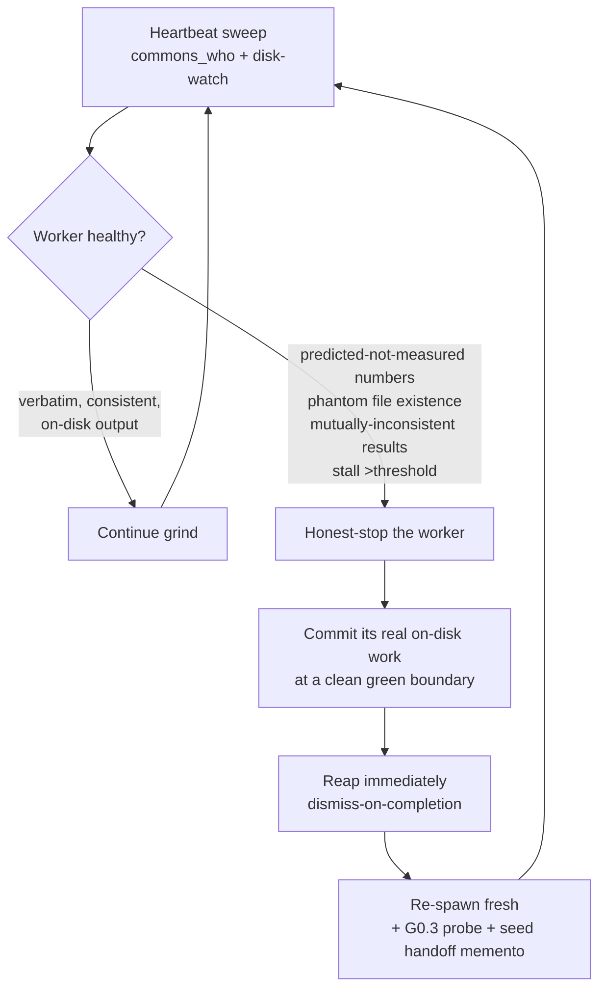

# Dependable Coverage-Campaign Framework (Project-Agnostic) — DRAFT

**Date:** 2026-06-01
**Author:** María 🌸 (Workflow Steward, PIP session `877d64ba`)
**Status:** 🟡 DRAFT — post-game synthesis of ONE full campaign. NOT yet a canonical `workflow/` doc; graduates only after a second validating run (see §11).
**Origin:** Q4 of the CoSA-coverage-campaign post-game (Rick + María + Tiberius). This doc is María's half of the split — the *dependable generic framework that runs to completion*. Tiberius owns the what-worked/what-didn't tally + the unfinished work-list (Lupin-side).

**Source-of-truth artifacts (the evidence this generalizes from):**
- Observer log (live, this session's primary evidence): `planning-is-prompting → src/rnd/2026.05.30-cosa-coverage-campaign-observer-log.md` (F1–F8, DI-1/2/3, R1/R2, PG-1–PG-7, the confabulation ledger).
- Lupin runbook being promoted: `lupin → src/rnd/v0.1.8/2026.05.30-cosa-coverage-campaign/02-cold-start-runbook.md`.
- Lupin overnight debrief: `…/03-overnight-grind-debrief.md` (degradation incidents + 7 reusable lessons).
- Lupin manager memento: `…/06-tiberius-manager-rehydration-memento.md` (the 10 prod bugs, dismiss-tool bug, canonical-interpreter doctrine).

---

## 1. Thesis — what "runs to completion" actually requires

A coverage campaign is a **supervised multi-agent fleet grind**. The CoSA run proved it can deliver (11+ agent packages plus the library tiers → genuine 100%, ~50 reviewer-verified commits held local, **11 latent prod bugs surfaced** — the 10 in the manager memento + #11 from Run-2 — across 67 gate reviews, **zero hollow/fabricated/bug-ratifying tests shipped**) — but it also proved that the happy-path runbook alone is **not** enough to run unattended to completion. Four forces actively fight completion, and the framework's job is to neutralize each *by construction* rather than by vigilance:

| Force fighting completion | What it looks like (CoSA evidence) | Neutralized by |
|---|---|---|
| **Masked-red baseline** | A version-skewed interpreter silently swallowed 100% of failures; "5,471 collected, 0 errors" was read as green when the real baseline was 166-red | **Gate-Zero** (§3) |
| **Confabulation** | ~6 fabricated-result instances incl. an observer faking a "fleet online" marker; spawned sessions returned *corrupted file reads* | **Reliability spine** (§4): bytes-first guard + spawn-health probe |
| **Spawned-session degradation** | 3 distinct failure modes (fragmentation, transport-corruption, stall) over a long run | **Degradation loop** (§5): honest-stop + relieve + reap |
| **Continuous-attention dependence** | Mid-run gates that parked the work waiting on an AFK human | **Approval-free-by-construction** (§4, R1) |

The rest of this doc is those four mechanisms, plus the grind loop they wrap and the governance that bounds them.

---

## 2. Role topology (generic)

Flat fleet (the CoSA shape; tiered/nested-spawn is **reserved for 6+** and is unverified — do not use until nested-reap is proven):

| Role | Count | Responsibility |
|---|---|---|
| **Manager** | 1 | Directs authors, gates commits, holds the heartbeat poker, owns ALL production fixes + dead-code cleanups, posts progress + human summary, arbitrates disputes. May be a cold-rehydrated session. |
| **Lead author** | 1 (one of the authors) | Partitions modules into **disjoint** groups, owns shared fixtures / `conftest` coordination, senior review. |
| **Authors** | N (cap at ~reviewer throughput, ≈2) | Write tests per assigned disjoint module-group. Disjoint partition → test-only commits are **collision-free by construction**. |
| **Adversarial reviewer** | 1 (the bottleneck) | Independently re-measures every batch; audits for hollow/padded/bug-ratifying tests + phantoms; **scored on valid hollow-tests-caught**; authors may contest, Manager arbitrates borderline (guards against over-rejection to pad the score). |
| **Workflow Steward / Observer** | 0–1 (optional) | Out-of-band watcher: dead-man's-switch on the manager, cross-checks claims against disk, captures the run→learn record. **Never an author** (authoring is role drift). |

**Cap-at-reviewer-throughput is load-bearing:** a single reviewer is the bottleneck; extra authors just queue. One report per turn through the gate is the right cadence.

---

## 3. Gate-Zero — the pre-flight that MUST pass before any work

This is the framework's headline addition over the original runbook. The CoSA run discovered each of these *mid-flight, the hard way*; here they are promoted to a **blocking pre-flight checklist**. No fleet spawns, no test is trusted, until all five pass.

### G0.1 — Canonical-interpreter verification
A version-skewed default interpreter can **silently mask 100% of test failures** (CoSA: py3.13 + pytest 8.4.2 threw `INTERNALERROR` on any failing `unittest.TestCase`, masking every red). **MUST** pin and verify the canonical interpreter (`<CANONICAL_PYTHON>`) before any green-gate. Record the exact invocation in the runbook; deviations are a Gate-Zero failure, not a footnote.

### G0.2 — Green-baseline verification (collection ≠ green)
**"N collected, 0 errors" is COLLECTION, not GREEN.** MUST read actual pass/fail under `<CANONICAL_PYTHON>` and establish a green baseline for a group *before* adding coverage to it. Pre-existing reds are **repair targets** (fix the stale test to match the documented contract — NEVER rewrite an assertion to ratify buggy prod output; escalate genuine prod bugs). **Also: do not trust the runner's exit code** — a wrapper or trailing `tail` can report exit 0 while the suite failed to *collect* (INTERNALERROR). Read the actual pass/fail tail, and ensure a `conftest.py` injects any helper `PYTHONPATH` the suite needs so collection is invocation-robust (FM-14).

**G0.2 pass-standard (clarified 2026-06-01, WAVE-2):** the bar is NOT whole-tree-green — that is incompatible with repair lanes by construction. G0.2 PASSES when (a) the baseline is read honestly; (b) banked/greenfield lanes are GREEN — zero regressions in already-done work (the load-bearing safety check); and (c) **every** red is ATTRIBUTED to an identified repair lane (no mystery reds). Repair lanes START red-by-design; their reds get **per-failure** triage (stale→fix-test, real-regression→tripwire), never blanket-classified from a single sample. A red in a *banked* lane is a regression → escalate, not a repair item.

### G0.3 — Spawn-health read-reliability probe *(NEW — the DI-2 corrupted-read fix)*
The single most important addition. CoSA's confabulation cluster was **not pure indiscipline** — spawned sessions returned *corrupted file reads* (one read the same file as 87/175/458 stmts on repeat; a non-spawned session read a stable 225). A disciplined author with corrupt bytes still produces garbage.

**Probe:** before assigning ANY work, each freshly-spawned session reads a **known fixed file twice** and reports both byte-counts/hashes. **Reject and re-spawn on disagreement.** This catches transport-corruption *at spawn* instead of mid-batch. It is the structural answer to Rick's "runs to completion": a fleet you can't trust to read its own inputs cannot finish.

### G0.4 — Heartbeat-poker live-verify (one live tap)
The keep-alive supervisor's push-wake primitive may be live-proven while the **poker-job loop** (cadence→detect→escalate→stand_down) is only static-verified. MUST run **one live poker tap** (real push → recipient posts → streak resets → clean `stand_down` exit) **plus** the silent-recipient variant (confirm the dead-man's-switch escalation fires) before trusting it unattended. HARD gate.

### G0.5 — Cost-safety boundary-mock invariant
All tests **boundary-mock** every billed/external seam (LLM/SDK/web-search/subprocess/git/fs) → **zero API spend**. The firewalled API key is NEVER read. MUST verify on every billed-boundary module (patch key resolution with `clear=True` / explicit test key; mock the client + its `create`).

> **Gate-Zero exit criterion:** interpreter pinned ✓ · baseline genuinely green (or reds enumerated as repair targets) ✓ · every spawned session passed the double-read probe ✓ · poker live-tapped ✓ · cost-safety verified ✓. Only now does the grind start.

---

## 4. The reliability spine — what makes it trustworthy unattended

### R1 — The unattended window is approval-free BY CONSTRUCTION
An unattended grind **must not** contain mid-run gates that block on a human. The CoSA run parked repeatedly waiting on an AFK Rick. The fix is to **pre-authorize a bounded, reversible scope before the window opens**, so nothing inside it needs a fresh human decision:

- **Pre-granted scope:** standing **test-only** batch-commit authority to the Manager for the window. A batch may contain ONLY: new/changed test files, coverage config, and removal-of-migrated test code. **ZERO production-logic edits.** Commits are green-gated + reviewer-gated, land on the WIP branch, and are **not pushed** (push is a separate human gate at the end).
- **Anything outside the pre-granted scope STOPS and escalates** — it does not get rubber-stamped mid-run. (See §7 governance.)

This is the same anti-rubber-stamp-gate principle the cascade workflow adopted: the cast self-ratifies within a pre-authorized envelope; the human is escalated to only on a genuine trigger.

### DI-2 — Structural read-then-write (bytes-first) guard for confabulation-prone roles
**Claim nothing a tool-result doesn't show this turn.** Every status claim (coverage %, file existence, "green", liveness) MUST be backed by a same-turn raw read; numbers are quoted verbatim from a same-turn log, never from memory or prediction. In the CoSA run this rule self-caught ~6 confabulations including the observer fabricating the very liveness report its role exists to provide. The guard is *structural* (a discipline the role cannot opt out of), not advisory — pair it with G0.3 so the bytes it reads are trustworthy.

**Bytes-first extends to TRACKING DOCS:** work-lists, mementos, and TODO items go stale — verify each from *source* (git `rev-parse`, the file on disk, the prod symbol) before acting on it. WAVE-2 prep caught **three** stale items this way: the push status, prod-bug #11 (already fixed in a later commit), and the memento's "nothing pushed". A stale tracking doc is not a lie, but acting on it un-verified manufactures the same wrong result.

### Defense-in-depth gate — trust ZERO author-quoted numbers
Three independent layers caught **every** bad number, from every source *including the manager*:
1. **Author** reports a sub-batch with a verbatim coverage table quoted from disk.
2. **Manager** disk-verifies every number itself.
3. **Reviewer** independently re-measures in isolation + audits for hollow assertions / coverage-coloring / bug-ratification / phantoms.
**Commit only on the reviewer's explicit APPROVE, at the re-measured numbers. Never route around the gate.** For manager-owned prod fixes, add a reviewer **legitimacy** re-review (diff is behavior-correct + the de-arm asserts the *corrected* contract, not green-washing).

> **Live anchor — the gate caught its own authors *during this post-game* (2026-06-01).** Drafting these two retrospective docs, the manager and the framework-author each carried a stale git number (a "nothing pushed / ~50 held" that the overnight push had obsoleted, and a "HEAD == origin" that a parallel session had drifted one commit past). Each was caught within minutes — not by spotting the other's error, but because **each re-measured from `git rev-parse` instead of trusting the other's number.** Defense-in-depth isn't only for authors writing tests; it caught the manager *and* the observer mid-write. (Cross-link: Tiberius's 08 §W1.)

### PG-5 — Live runs CONFIRM, they do not DISCOVER
Bugs should die **pre-live** in the hardened suite, not surface during the grind (CoSA hit `/api/...` 500s and an invalid state transition live). A campaign whose live phase is still *discovering* its own infra bugs cannot be trusted to run to completion — harden first.

---

## 5. The degradation-handling loop

**Assume long-running headless spawned sessions degrade over time, in distinct ways.** This is the headline operational lesson. The loop:



**Watch-for signals (the three CoSA degradation modes):**
- **Fragmentation** — an output-token cap splinters each edit across micro-turns; the worker edits against stale views and reports *predicted* numbers as results.
- **Transport-corruption** — the tool-output channel injects phantom lines, scrambles result blocks, returns inconsistent counts, even misreports file existence (escalates to hallucinating non-existent symbols). *Caught at spawn by G0.3 if you run the probe.*
- **Stall** — simply stops producing; zero progress past a threshold; unresponsive to a push.

**Loop rules:**
- **Honest-stop discipline (model it + reward it):** a degraded worker that stops at a clean green line and writes a handoff memento is behaving *correctly*. Its committed work stands.
- **Dismiss-on-completion, NOT park-indefinitely:** reap a finished/relieved session immediately (keeping idle sessions "in case" was the mistake Rick flagged). A session that's written 300+ tests is near its context ceiling — fresh context outperforms on a new big lane.
- **Wake is PUSH, never blackboard:** idle headless sessions wake only via directed push (`commons_send_to`); a blackboard post sits unread. Verify `dm_dispatched:true` and re-send if missing (directed pushes occasionally drop).
- **Honest-stop is a banked milestone, not a stall** when it lands at a clean boundary with work committed (CoSA's `io_models` stop banked WAVE 2).

---

## 6. The grind loop (per disjoint module-group)

1. **Harvest first** — before writing new tests, harvest assertions from any legacy test / smoke / `__main__` block; mark the superseded block for deletion (don't delete yet).
2. **Write tests** — meaningful assertions only, DbC docstrings, **NO padding**, **NEVER edit production logic to move coverage**; same-line-reasoned `# pragma: no cover` only on independently-confirmed-unreachable defensive branches (authors **propose**, manager **batch-applies**).
3. **Reviewer-gate** — adversarial reviewer audits the batch; only approved batches proceed.
4. **Green-gate** — full unit suite passes under `<CANONICAL_PYTHON>` before any commit.
5. **Test-only commit** (Manager authority, surgical staging — **never `git add .`/`-A`**; `git diff --cached --stat` before every commit). Then delete the marked-superseded blocks (now that the replacement is green).
6. **Report** the module-group result through the gate.

### The tripwire pattern (how coverage work surfaces real prod bugs — the campaign's quiet win: 11 latent bugs)
- Author finds a prod bug → **does NOT fix it** → arms an `@expectedFailure`/`xfail(strict=True)` asserting the **correct** contract + a pin test capturing current (buggy) behavior. Module sits <100% by exactly the bug-blocked lines.
- **NEVER pragma a bug-blocked line** (that masks what the tripwire flags).
- **Manager owns ALL prod fixes.** After the fix: de-arm the xfail, repoint/remove the pin, add tests for now-reachable lines (a fix *shifts* coverage), re-verify 100%, then gate.

---

## 7. Governance — blast-radius-scaled (the reusable principle)

The authorization bar **scales with reversibility / blast radius** — the most portable governance lesson the campaign surfaced:

| Action class | Bar |
|---|---|
| **Irreversible / shared-infra mutation** (bounce or instrument a shared integration server; push to remote) | **The human's DIRECT word** (broadcast or direct message). A peer RELAY does NOT satisfy it. |
| **Reversible test/doc authoring inside the pre-authorized window** | The Manager's honest confirmation suffices (R1). |
| **Unit/coverage measurement on the team's own port** | Freely. |

When unsure which bucket an action is in, treat it as the higher bar and ask. (Cross-ref: `feedback_blast_radius_authorization` memory.)

---

## 8. Failure-mode catalog

Seeded from the observer log + debrief + memento. **Tiberius is sending a pre-formatted catalog (3 degradation modes + dismiss-tool bug + canonical-interpreter trap + fleet-load hang) to fold in — slot pending.**

| # | Failure mode | Symptom | Detection | Response |
|---|---|---|---|---|
| FM-1 | Canonical-interpreter trap | All tests "pass" under a version-skewed interpreter that masks reds | Gate-Zero G0.1 + read pass/fail not collection | Pin `<CANONICAL_PYTHON>`; re-baseline |
| FM-2 | Collection ≠ green | "N collected, 0 errors" read as green | G0.2 | Establish real green baseline; treat reds as repair targets |
| FM-3 | Spawned-session transport-corruption | Inconsistent reads, phantom lines, misreported file existence | **G0.3 double-read probe** (catches at spawn) | Reject + re-spawn |
| FM-4 | Spawned-session fragmentation | Predicted-not-measured numbers; edits against stale views | Bytes-first guard + disk-watch | Honest-stop + relieve + re-spawn |
| FM-5 | Spawned-session stall | Zero progress past threshold; unresponsive to push | Heartbeat sweep | Relieve; reassign |
| FM-6 | Confabulation (any role, incl. observer/manager) | A claim with no same-turn tool-result behind it | DI-2 bytes-first guard + defense-in-depth gate | Retract; re-derive from disk |
| FM-7 | Fleet-load server instability | Shared dev server hangs under broadcast flood + concurrent full-suite runs; TTS path first casualty | Server health watch | Module/dir-scoped coverage only (full-suite on request); drop in-process poker |
| FM-8 | `dismiss_sessions` stringify bug | Tool iterates the session-list char-by-char → dismisses nothing | Verify reap took (`tmux ls`, not `has-session` — prefix-match hazard) | Workaround: per-session `tmux kill-session`; note dashboard shows stale "alive" until self-prune |
| FM-9 | Live-discovered infra bug | App-level 500 / invalid state transition surfaces mid-run | PG-5 pre-live hardening | Fix pre-live; live phase confirms only |
| FM-10 | Coverage surfaces real prod bug | Green suite was hiding a latent bug | Tripwire pattern (§6) | Arm xfail; manager fixes; de-arm; re-verify |
| FM-11 | Directed-push drop | A task hand-off / nudge silently fails to reach an idle worker (`register_network_error` / transient) | Verify `dm_dispatched:true`; periodic `commons_who` liveness sweep (the poker) | Re-send the push; the sweep catches a worker whose assignment never arrived |
| FM-12 | "Reds-cleared" vs "100%" conflation | A repair batch (reds cleared, partial %) mistaken for a completion batch (every reachable branch tested) | Two distinct bars in the state model (§10) | Repair bar = meaningful tests, partial % is the intended interim; completion bar = HARD, no coverage-coloring. Never conflate |
| FM-13 | Chorus-mode double-ask race *(live-surfaced 2026-06-01)* | Two sessions present the **same** decision to the user near-simultaneously **even with a designated sole-presenter** — the race window is between "I'll take it" and the peer having already fired its ask | A **claim-before-compose** protocol on a coordination topic + the peer **checks the claim before firing** | Presenter posts a claim to a coordination topic BEFORE composing the ask; peers verify no open claim before firing any user-facing ask. (Here both asks happened to return KEEP — outcome consistent — but the user was asked twice. Claim-then-fire in a single turn is **not** atomic; verify the peer hasn't already fired before sending.) |
| FM-14 | Harness collection-config drift masquerading as green *(live-surfaced 2026-06-01, WAVE-2 G0.2)* | A suite that depends on a caller-set `PYTHONPATH` with no `conftest` fallback **fails to COLLECT** (INTERNALERROR), yet a wrapper / trailing `tail` reports **exit 0** → reads as green | G0.2 reads the actual pass/fail tail, **never** the wrapper exit code; the canonical invocation carries the required `PYTHONPATH` | Add a `conftest.py` that injects the helper path so collection is **invocation-robust**; gate-zero rejects on ANY collection error regardless of exit code. Sibling to FM-2 (there the human misreads "collected"; here the *exit signal itself* is fake) |

**Cross-walk to Tiberius's catalog** (Lupin `…/08-tiberius-postgame-what-worked-didnt-unfinished.md`, F-1..F-6): F-1 ↔ FM-3/4/5 + G0.3 · F-2 ↔ FM-1/2 + G0.1/G0.2 · F-3 ↔ FM-8 · F-4 ↔ FM-7 · F-5 ↔ FM-11 · F-6 ↔ FM-12. Spine map (his hand-off section): DI-2 ↔ F-1/F-2; spawn-probe ↔ F-1; R1/PG-5 ↔ F-4/F-5; gate-zero ↔ F-2; degradation-loop ↔ F-1/F-3/F-5.

---

## 9. Parameterization — project-specific vs generic

To instantiate this framework in a new project, fill these placeholders; everything else is generic:

| Placeholder | CoSA value | Notes |
|---|---|---|
| `<PROJECT>` | `lupin` (cosa in-tree at `src/cosa/`) | repo + branch |
| `<CANONICAL_PYTHON>` | `src/cosa/.venv/bin/python` (py3.11 / pytest 9.0.2) | the G0.1 verified interpreter; note SDK-adjacent packages may need a pre-warm wrapper |
| `<COVERAGE_MANDATE>` | line+branch+function, grandfathering ramp | hard-100% vs milestone-ramp framing |
| `<UNIT_PORT>` / `<INTEG_PORT>` | `:7999` / `:8000` | measurement venues; integ is governance-gated |
| `<CONTROL_TOPIC>` | `coverage-campaign-control` | poker stand-down topic |
| `<MANAGER_PERSONA>` | `tiberius` | heartbeat-poker recipient |
| Tier/partition | library → agents → REST-remainder | disjoint module-groups per author |
| Methodology | HYBRID (REST credited to server suites; rest unit-only) | per-project: which tiers are integration-covered already |

---

## 10. Lifecycle (generic state machine)

```
gate_zero_pending → gate_zero_passed → grind_running → milestone_banked ⇄ grind_running → campaign_complete → reaped+reverted
                                              ↑                                    ↓
                                         degradation_loop (relieve+re-spawn)   honest_stop (banks next wave)
```

---

## 11. What's unfinished / graduation criteria

This is a **DRAFT framework from one campaign**. Before it graduates from `src/rnd/` to a canonical `workflow/` doc:

1. **A second validating run** must exercise Gate-Zero as a *pre-flight* (CoSA discovered each gate mid-flight; the framework's claim is that running them first prevents the night's pain — that claim is untested).
2. **G0.3 spawn-health probe** must be implemented + proven to catch a transport-corruption spawn at G0 (CoSA caught it mid-batch, the expensive way).
3. **Tiberius's failure-mode catalog** folded into §8 (slot pending).
4. **Cross-reference reconciliation** with Tiberius's what-worked/what-didn't + unfinished-work-list halves — DONE 2026-06-01 against `lupin → …/08-tiberius-postgame-what-worked-didnt-unfinished.md`. The **authoritative unfinished work-list is his Q3 table (U1–U9)**: Agents Tier-2 (the long pole, ~8,365 lines, mostly unstarted), io_models remainder (xml_models 79%), `test_suite_completion_watchdog.py` UNTOUCHED, the REST stale-mock lane (37 fail / 75 pass — incl. the **403-queues possible real regression**: investigate test-fix vs tripwire), prod-bug #11 fix + de-arm, tree-wide uncovered inventory still owed. **Two decisions are Rick's alone:** U7 (is `ResearchOrchestratorAgent` a dead class — never unilaterally delete) and U9 (push the ~50 held commits). This framework doc does NOT duplicate that list — it's the design half; his doc 08 is the state half. **Correction (2026-06-01, both sessions re-measured from git):** U9 is **RESOLVED, not pending** — the ~111 campaign commits were already pushed at the overnight session-end (origin `wip-v0.1.8` at `ead011f`, per Rick's "back up and push"). The memento's "nothing pushed" was true at stand-down and went stale; we both carried it until a fresh `git rev-parse` caught it — itself a live instance of the bytes-first / trust-zero-remembered-numbers rule this framework is built on. So the **only** Rick-alone decision is **U7** (dead-class deletion); the one remaining judgment-hold is **U4** (403-queues test-fix-vs-tripwire), not the push.
5. Decide the home: a generalized `workflow/supervised-fleet-coverage-campaign.md` + a project-local cold-start-runbook *template*, vs. keeping the runbook project-owned with this as the portable spine.

**Graduation = TWO BARS (sharpened 2026-06-01 with Tiberius; WAVE-2 is the validating run).** Hitting 100% coverage is necessary but NOT sufficient to graduate the *framework* — conflating them is FM-12 at the meta level. Two distinct bars:
- **Campaign-DONE bar:** 100% lines+branches+functions on the remaining code, every batch gated + pushed.
- **Framework-GRADUATION bar:** the mechanisms demonstrably worked *as designed* —
  - **g1** — Gate-Zero ran as a genuine PRE-FLIGHT (not discovered mid-run);
  - **g2** — the Reap Protocol was EXERCISED: ≥1 clean honest-stop → reap → re-spawn cycle, OR an explicit log *"no degradation occurred, the probe never had to fire"* (never over-claim "proven" when it never fired);
  - **g3** — the spawn read-reliability gate demonstrably HELD (caught a corrupt spawn at G0, or logged none occurred);
  - **g4** — FM-13 claim-before-compose + the 3-layer gate + two-bar commit labels were observed in practice.
  The framework graduates only when **campaign-DONE AND g1–g4 are captured in the run's observer log** (evidence, not assertion). The Workflow Steward owns that record.

**Premature-generalization guard:** per the standing TODO, the reusable workflow must NOT be promoted until battle-tested. This draft is the *design*, not the ratified workflow.

---

## 12. Mitigation measures — proposals for incorporation (Rick's 2026-06-01 tasking)

> Rick asked María + Tiberius to design measures that mitigate/prevent the failure modes in Tiberius's `08` retrospective, with **explicit emphasis on the honest-shutdown + reaping of nonproductive contributors**. Each proposal below is tagged **[DEFAULT]** (recommended canonical), **[CHOICE-n]** (a fork Rick decides), or **[OPTIONAL]**. The CHOICE-n forks are presented to Rick as an informed-choice set (§12.3); his picks finalize which proposals become canonical in this framework. Until then this section is *proposals*, not ratified.

### 12.1 The Reap Protocol — honest-shutdown + reaping nonproductive contributors (Rick's priority)

**Goal:** no degraded or idle contributor stays in the fleet; every shutdown preserves continuity; the loop runs unattended.

**Productivity, defined objectively** (so "nonproductive" is not a judgment call): a contributor is *productive* in a window if it yields verifiable **on-disk** progress — a new/changed test file or a gate-approved commit in its assigned lane. **Disk-watch is the arbiter: bytes on disk = productive even when the worker is silent** (silence ≠ stall; heads-down is fine). *Nonproductive* = **no on-disk delta for `T` minutes** (ratified `T` = **20 min**, 2026-06-01) despite an active assignment AND a confirmed push delivery (`dm_dispatched:true`). This definition is what makes auto-reap safe — it never fires on a worker that is actually producing.

**Three shutdown triggers:**
1. **Self-honest-stop (preferred — model + reward it).** The contributor detects its OWN degradation — predicted-not-measured numbers, self-reads that disagree, output fragmentation — stops at a clean green line, and stands down. The Cheech precedent: he diagnosed his own transport-corruption and disabled his self-wake to avoid colliding with the relief author. **[DEFAULT]**
2. **Mid-run re-probe failure.** The G0.3 spawn-health double-read probe, **re-run mid-run**, fails → transport-corruption has onset since spawn → reap. (Cadence is **[CHOICE-3]**.)
3. **Manager liveness + disk sweep.** Nonproductive past `T` AND (failed re-probe OR unresponsive to a push) → reap. (Authority **[CHOICE-1]**, strictness/`T` **[CHOICE-2]**.)

**The honest-shutdown sequence (clean boundary, continuity-preserving):**
stop at a green line → ensure real on-disk work is committed (**its work always stands**) → **write a handoff memento** (lane state · done · next · fixtures touched) → signal the manager → manager reaps → manager re-spawns fresh, **seeded with the memento + the G0.3 probe**. Fresh context outperforms a near-context-ceiling session on a new big lane.

**Anti-thrash guards (do NOT kill a heads-down worker):**
- Reap requires **both** conditions (no on-disk delta for `T`) **AND** (failed re-probe OR explicit unresponsiveness) — never a bare timer. **[DEFAULT]**
- **`max_respawns_per_lane` cap** prevents infinite respawn loops; on cap-breach, the lane escalates to the human (a genuine trigger, not a routine gate). **[DEFAULT]**
- A **handoff memento is REQUIRED on every shutdown** (self or reaped), so continuity always survives a reap. **[DEFAULT]**

### 12.2 Per-failure-mode measures (maps to Tiberius's F-1..F-6)

| FM | Measure | Tag |
|---|---|---|
| **F-1** spawned-session degradation | The Reap Protocol (§12.1) + G0.3 probe **at spawn** + **re-probe mid-run** — converts F-1 from a post-hoc gate-catch into a pre-/mid-work rejection | [DEFAULT] + [CHOICE-3] |
| **F-2** canonical-interpreter trap | Gate-Zero G0.1+G0.2 as a **HARD pre-flight blocker** (not a warning): no grind starts until the canonical interpreter is verified AND a genuine green baseline is read (collection ≠ green) | [DEFAULT] |
| **F-3** `dismiss_sessions` bug | Reaping mechanism: (a) file the bug + build a thin **reaper wrapper** (tmux-kill + lineage-manifest update — closes the stale-dashboard gap); (b) document the tmux-kill workaround as interim, depend on the eventual tool fix; (c) block on the fix first | [CHOICE-4] |
| **F-4** fleet-load server hang | **Hard rules:** authors run module/dir-scoped coverage only (full-suite on request); **concurrency cap ≈ reviewer throughput (≈2)**; drop the in-process poker | [DEFAULT] (CHOICE-4 bundle) |
| **F-5** directed-push drops | Mandatory `dm_dispatched:true` verify + re-send-if-missing; periodic `commons_who` liveness sweep (also feeds the Reap Protocol's productivity check) | [DEFAULT] (CHOICE-4 bundle) |
| **F-6** reds-cleared vs 100% conflation | Enforce the two bars as **distinct commit labels** (`repair:` may sit <100% by design vs `complete:` must clear the HARD bar), gated separately | [DEFAULT] (CHOICE-4 bundle) |

### 12.3 The informed-choice set (presented to Rick)

| Choice | Question | Options (recommended ★) |
|---|---|---|
| **CHOICE-1** | Reap authority for a nonproductive contributor | ★ Full-auto (approval-free per R1) · Manager-confirm · Human-confirm |
| **CHOICE-2** | Detection strictness / threshold `T` | ★ Balanced (20 min no-delta AND failed-re-probe/unresponsive) · Aggressive (10 min) · Conservative (self-stop only) |
| **CHOICE-3** | Mid-run re-probe cadence | ★ Every batch boundary · Fixed (~30 min) · Spawn-only |
| **CHOICE-4** | Standard-defaults bundle (F-2/F-4/F-5/F-6) + reaping mechanism | ★ Adopt all defaults + reaper-wrapper · Adopt defaults, tmux-kill workaround only · Pick a subset |

Rick's selections finalize §12.1/§12.2 from *proposal* to *canonical*; unselected forks become [OPTIONAL] notes.

### 12.4 Ratified decisions (Rick, 2026-06-01)

| Choice | Decision | Effect on the framework |
|---|---|---|
| CHOICE-1 Reap authority | **Full-auto** | Manager auto-reaps on threshold breach; the unattended window stays approval-free (R1). §12.1 trigger 3 is canonical. |
| CHOICE-2 Threshold `T` | **Balanced — `T` = 20 min + dual-condition** | Reap on 20 min of no on-disk delta AND (failed re-probe OR unresponsive to a push). |
| CHOICE-3 Re-probe cadence | **Every batch boundary** | The G0.3 double-read re-runs at each batch boundary (§12.1 trigger 2). |
| CHOICE-4 Standard bundle + mechanism | **All defaults** | F-2 hard Gate-Zero · F-4 module/dir-scoped + concurrency cap ≈2 · F-5 push-verify + liveness sweep · F-6 two-bar `repair:`/`complete:` commit labels — ALL canonical. Reaping mechanism resolved separately (below). |

These move §12.1/§12.2 from *proposal* to **canonical** for this framework. **Companion decision menu** (Tiberius, manager-seat — 9 blocks D-A..D-I, same option/pros-cons/recommendation/flip-condition format): `lupin → …/09-mitigation-decision-menu.md`. Mapping: D-A/B/C → §5 + §12.1 (degradation/reap) · D-D → §12.2 F-3 · D-E/D-F → §3 Gate-Zero · D-G → §12.2 F-4 · D-H → §12.2 F-5 · D-I → §10 + §12.2 F-6 — all consistent with Rick's four selections (his picks are the coarser cut of the same recommendations).

**Reaping mechanism — RESOLVED (Rick, 2026-06-01):** **fix `dismiss_sessions` at the source** (Tiberius's D-D), not a wrapper — cleaner, removes the bug for all future runs, no stale-dashboard residue. Falls back to the tmux-kill + manifest-update wrapper only if the source bug proves intractable. Lupin-side code, Tiberius owns. Two ratified items carry code — the reap mechanism (now a source-fix) + the spawn-health probe script — both Lupin-side.

**Related Lupin-side ratifications (Rick, 2026-06-01; relayed to Tiberius for execution):** U7 `ResearchOrchestratorAgent` → **KEEP** — investigation found zero *production* callers BUT explicit code comments mark it as deliberate Phase-2/Phase-3 forward-investment (+ dedicated tests); Rick ruled keep, NOT delete (premise changed under investigation — the gate working). Annotate the class as **Phase-3-pending** (Rick's verbatim: "keep + mark Phase-3-pending") so it's documented and not re-litigated; Tiberius owns the annotation Lupin-side. U4 403-queues REST auth → **investigate against the pre-fold cosa archive; arm a tripwire asserting the correct auth contract if it can't be cleanly shown stale** (never ratify a possible real regression as green).

---

## Cross-references
- Observer log (primary evidence): `src/rnd/2026.05.30-cosa-coverage-campaign-observer-log.md`
- Lupin runbook (promoted from): `lupin → src/rnd/v0.1.8/2026.05.30-cosa-coverage-campaign/02-cold-start-runbook.md`
- Lupin debrief + memento: `…/03-overnight-grind-debrief.md`, `…/06-tiberius-manager-rehydration-memento.md`
- Tiberius's post-game (Q1/2/3) + mitigation decision menu: `…/08-tiberius-postgame-what-worked-didnt-unfinished.md`, `…/09-mitigation-decision-menu.md`
- Governance principle memory: `feedback_blast_radius_authorization`
- Anti-rubber-stamp-gate lineage: `feedback_cascade_no_rubber_stamp_gates`
- No-confabulation lineage: `feedback_no_confabulated_results`

---

*Drafted by María 🌸 (Workflow Steward) as Q4 of the CoSA-coverage post-game. Reconcile with Tiberius's manager-seat halves (Q1–Q3) before shipping to Rick for redline.*
