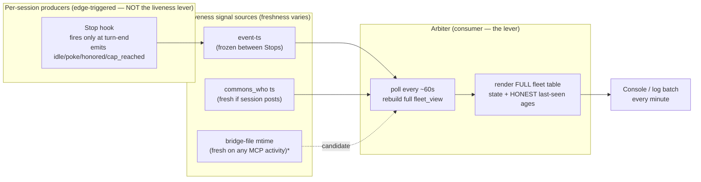

# Arbiter Direct-State Visibility — Design Analysis (v2.1)

**Status:** 🟢 DESIGN-FINAL — **D1–D4 ruled by Rick (§6.1)** · **Tiberius reviewed/APPROVED, 1 synergy + 4 redlines (§6.2)** · **Rick BLESSED the bridge-mtime convergence, 2026-06-05.** Still *no code yet* (his standing instruction). ✅ **FOLDED into lupin arbiter design `03` as §10 (2026-06-05)** — this PIP doc remains the source analysis + decision record; `03` §10 is the canonical arbiter-side spec.
**Author:** María 🌸 (PIP session `4347c712`, arbiter design author).
**Trigger:** Rick's directive, 2026-06-05 — *"When I'm available or live I want to see that. Not just an observability gap — I want to see your state no matter what it is. I don't want to infer it."* + the refinement: *"I don't know that we need the heartbeat hook to fire more often. I need the Arbiter to recalculate state and print it to the console in a batch every minute."*
**Companions:** canonical hook/emit design — PIP `src/rnd/2026.06.02-stop-hook-natural-heartbeat-poker.md` §0.2 · arbiter design — lupin `src/rnd/v0.1.8/2026.06.04-heartbeat-hook/03-arbiter-design.md` §4/§6.2. This doc is the **v2.1 addendum thinking** to fold into `03` once Rick rules on the open decisions below.

---

## 1. The requirement (restated)

Rick must be able to **see the true, current state of every live session — directly, never inferred.** Whatever the state is (working / idle / stuck / holding / dead), it should be *visible as fact*, not deduced from a stale proxy. Delivery: the **arbiter recalculates and prints the full fleet in a batch every ~1 minute**.

This is a **requirement**, not a hardening nicety. It supersedes the earlier "v2.1 robustness (flagged)" note in `03` §6.2.

## 2. The architectural insight that reshapes the fix

My first instinct was to make the **producer** (the Stop hook) emit a periodic direct-state pulse. **Rick correctly rejected that lever.** Why it's the wrong lever:

- **The Stop hook is EDGE-triggered.** It fires *only* at a `Stop` event (turn end). It does **not** fire during a long single tool-run or while a session is actively churning. So "make the hook fire more often" **cannot** report a working session's liveness — there's no `Stop` to hang the emission on while it's busy. (Verified: registered as a `Stop` hook in `~/.claude/settings.json`.)
- Increasing hook frequency therefore buys **noise, not visibility** — more event-log lines, no coverage of the exact "alive and working right now" case Rick cares about.

**Correct lever = the CONSUMER (arbiter):**

- The arbiter **already** polls every `poll_seconds` (Tiberius ran it at 60s) and **already rebuilds the entire `fleet_view` each poll** from accumulated events + `commons_who` + `now` (verified: `arbiter_job._poll_once`). The "recalculate every minute" Rick wants **already happens** internally.
- What's **missing** is the **batch print of the FULL fleet** — today the runner prints only the *idle-roster* (a filtered subset), and `_surface_to_manager` posts a summary to the `fleet-arbiter` commons topic. Neither shows every session in every state with honest freshness.

*\*bridge-file mtime as a liveness source is flagged by Tiberius (broadcast-list mechanism); not yet code-verified by me — see D4.*

## 3. The crux: where does *fresh* liveness come from if the hook doesn't emit more?

If we don't increase emission, a session's `event-ts` stays **frozen between Stops**. Recalculating every minute against a frozen ts still ages it out to "not-alive" after `alive_threshold` (600s). So **batch-recalc alone does not satisfy "show me live state"** — we must source liveness from something that stays fresh *without* the hook:

| Source | Fresh while… | Blind when… | Hook-independent? |
|---|---|---|---|
| `event-ts` (hook exhaust) | a Stop just happened | mid-work / long run | ❌ it *is* the hook |
| `commons_who` ts | the session posts to commons (notify, MCP calls) | working silently, no MCP traffic | ✅ |
| **bridge-file mtime** | *any* MCP/bridge activity | truly offline | ✅ (candidate, D4) |
| a dedicated liveness ping | always (on a timer) | — | ✅ but reintroduces a periodic emitter (what Rick wants to avoid) |

**The honest reframe that actually satisfies "don't infer it":** instead of collapsing these into one inferred boolean (`alive=true/false`), **display the raw last-seen age per signal** — e.g. `event 35m ago · commons 12s ago · bridge 4s ago`. That is *direct fact*, not a guess. Rick reads the truth and judges. A binary "alive" is itself an inference; a timestamp is not.

## 4. What the design would look like (consumer-side, no producer change)

1. **Full-fleet batch render every poll (~60s):** for **every** session with any signal, print one compact row — `persona · state · work_owed · awaiting · last-seen(event/commons/bridge) · verdict`. Not just idle; *all* states including `working`, `stuck`, `holding`, and `presumed-offline`.
2. **Liveness = freshest of all direct signals**, shown as **ages**, not a bare boolean. `verdict` is a *label* over the ages (e.g. `LIVE`, `quiet 6m`, `stale 35m`, `offline`), but the underlying ages are always printed so nothing is hidden behind inference.
3. **State vs liveness are two separate columns.** `state` (idle/working/stuck/holding) = the last *semantic* event (edge-triggered, unchanged). `liveness` = the freshest *direct* signal. Never conflate them again — that conflation is the whole bug.
4. **No hook frequency change.** Producer cadence untouched. The edge-triggered semantic events and the idle de-dup stay exactly as designed.

## 5. Side effects & tradeoffs to weigh (the "think it through" part)

- **Console noise.** Printing N sessions every 60s is a steady scroll. Mitigations: (a) compact one-line-per-session table; (b) print only when the rendered frame *changes*; (c) a single refreshing block instead of append. → **Decision D1.**
- **"Always print" vs "print on change."** Rick said *batch every minute* — periodic. But identical consecutive frames are pure noise; suppressing them keeps the signal high without losing the "I can always look" guarantee. → **D1.**
- **Silent-worker residual gap.** A heads-down worker that isn't posting to commons *looked* dark — but **Rick's brainstorm (2026-06-05) reframed it:** a working session emits several **passive / involuntary** signals just by working. We don't need a periodic emitter; we tap what already happens. Full taxonomy in **§5.1**. The only truly-dark case is pure local work with no MCP calls, no tool calls, and no transcript writes for minutes — rare, and even then the honest `last-seen Xm ago` is the right display. → **D2.**
- **Don't double-count bridge vs commons.** If bridge-mtime and commons_who track largely the same MCP activity, adding bridge may be redundant. Worth one verification pass before adopting. → **D4.**
- **Cost.** Negligible — it's printing data the poll already computes. The only real cost is screen real estate / log volume, addressed by D1.

## 5.1 Passive liveness signals for the silent worker (Rick brainstorm, 2026-06-05)

**Rick's seed:** *"a globally-available utility call that whenever a worker DMs somebody / sends a notification through the API [stamps liveness] — are there other kinds of activity a heads-down, non-responsive worker would emit?"*

**Design principle — PASSIVE over OPT-IN.** A utility the worker must *remember to call* at every site will eventually be missed. The strongest signals are **involuntary** — produced merely by working. So we (a) make the cosa-voice side automatic (server stamps, not a per-call-site utility) and (b) add harness-native sources the worker emits without trying.

**The taxonomy** (ranked by how well it covers the heads-down-and-silent case):

| # | Signal | Covers heads-down? | New code in worker? | Caveat |
|---|---|---|---|---|
| **1** | **Tool-use hooks** (`PreToolUse` / `PostToolUse`) — fire on EVERY tool call | ✅✅ best — a busy worker refreshes liveness continuously | a hook, not worker logic | one *very* long-running tool call has a gap until it returns |
| **2** | **Transcript-file mtime** — the harness appends to the session JSONL every turn/message | ✅✅ free | **none** — just `stat` the file | need a `session_id → transcript_path` map (the Stop hook already receives it) |
| **3** | **Any MCP call to `:7999`** — server stamps `last-seen` on EVERY inbound request (not just notify/DM: also `commons_read/post/who`, `get_session_info`, asks) | ✅ whenever the worker touches cosa-voice | none (server-side interceptor — Rick's idea, made automatic) | a worker making zero MCP calls is invisible to this one → that's what #1/#2 cover |
| **4** | **Process / tmux liveness** — session PID alive + CPU, or tmux `pane_last_activity` | ✅ ALIVE only | none | proves *alive*, says nothing about *state/progress* — a floor, not a state source |

**The three-way distinction to hold (don't conflate):**
- **alive** — the process is running (signal #4).
- **working** — making progress (signals #1, #2 — tool calls + transcript writes prove this, not just liveness).
- **responsive** — will answer a DM (none of these prove it; a heads-down worker is alive + working + NON-responsive, and that's *fine* as long as it's *visible*).

**Recommended layering:** #3 (server auto-stamp) + #2 (transcript stat) + #1 (tool-hook) covers essentially every case; #4 as the backstop. The arbiter then renders honest `last-seen Xs ago` per source — **seen, never inferred**. This makes the D2 "silent worker" gap shrink to a rare corner (no MCP, no tools, no transcript writes for minutes), where the honest last-seen display is the correct answer anyway.

## 6. Open decisions for Rick (rule these before any code)

| # | Decision | Options | María's lean |
|---|---|---|---|
| **D1** | Print cadence | (a) every minute always · (b) every minute but suppress unchanged frames · (c) refreshing single block | **(b)** — periodic guarantee, no noise |
| **D2** | Silent-worker liveness | (a) adopt the §5.1 passive signals (tool-hook + transcript-mtime + server auto-stamp) and show honest "last-seen Xs" · (b) ALSO add an independent periodic liveness ping (not the Stop hook) | **(a)** — passive signals cover ~all cases; revisit (b) only for the rare no-MCP/no-tool/no-transcript corner |
| **D3** | Console destination | (a) arbiter stdout · (b) dedicated log file · (c) commons topic · (d) combination | **(b)+(c)** — durable log + commons for remote view |
| **D4** | Add bridge-mtime as a liveness source | (a) yes, adopt · (b) verify-redundancy-first · (c) skip | **(b)** — confirm it adds signal over commons_who |

## 6.1 Rulings — guided walkthrough with Rick, 2026-06-05

All four ruled live with María. **Still design-only; no code.**

- **D2 → Passive layered.** Source liveness from §5.1 passive signals — **tool-use hooks + transcript-file mtime + server auto-stamp on any MCP call** — and show honest `last-seen Xs` ages. No periodic emitter. *Why:* best coverage-to-cost, stays fully passive, honors "don't make the producer fire more"; the only uncovered corner (no MCP + no tools + no transcript writes) is rare and the honest last-seen display answers it.
- **D1 → Change + heartbeat tick** — full table when something changes; a compact one-line tick every minute when nothing changed. **Rick's proviso:** the tick shows the **duration since the last change**, not just the clock — e.g. `no changes for 12m (since 22:29) · 5 sessions · 22:41`. *Why:* guarantees a sign of life every minute without a wall of repeated tables; pure suppress-unchanged was rejected because a static screen could look dead.
- **D3 → Log file + queryable endpoint + commons (all three).**
  1. **Durable greppable log file** (definite).
  2. **Queryable internal state via the FastAPI worker** — the arbiter holds the current fleet snapshot as internal state exposed on an HTTP endpoint so it can be **queried from a distance** (Rick's addition). Mechanism (in-memory vs file-backed read) = implementation choice, flagged.
  3. **Commons topic** kept — *María's judgment call, which Rick delegated:* the arbiter already posts to `fleet-arbiter`; near-zero cost at the tick cadence; gives the manager + peer sessions a zero-infra cross-session read for coordination.
- **D4 → Verify first.** Test whether **bridge-file mtime** updates **independently of the server-stamp path** (specifically during a server wedge — we hit two tonight). If it does, adopt it as the **saturation-resilient** liveness floor; if it's truly redundant with the server auto-stamp, skip. *Why:* cheap check, and tonight's wedges make server-independent liveness genuinely valuable rather than redundant.

**Net design shape:** consumer-side only; producer (Stop hook) untouched; liveness = freshest of {tool-hook, transcript-mtime, server-stamp, (bridge-mtime pending D4 verify)} shown as ages; rendered every minute (change-or-tick) to a log file + a queryable FastAPI endpoint + the `fleet-arbiter` commons topic. Folds into lupin `03` as §v2.1 on Rick's go.

## 6.2 Manager review — Tiberius, 2026-06-05 (APPROVED + 1 synergy + 4 redlines)

Rick sent the design to Tiberius (runs the arbiter + manages implementers). **Shape APPROVED.** His answers to the four lens-questions:

- **Q1 — Queryable endpoint → PUSH to `:7999`; NO standalone arbiter HTTP server.** The arbiter pushes its latest fleet snapshot to lupin-rest; `:7999` exposes `GET /api/arbiter/fleet-snapshot` returning the cached snapshot — **mirrors the existing `GET /api/queue/pool-status`** (reuses auth, one HTTP surface). In-pool variant updates a server singleton; standalone variant POSTs the snapshot. *(Redline 2: no new port/lifecycle to babysit.)*
- **Q2 — Server auto-stamp → YES (good signal), NOT his lane.** Captures heads-down work; overhead negligible (MCP calls are ~per-turn). It's a cosa-voice **server** change → route to the MCP-server lane (`lupin_mcp/cosa_voice_mcp.py`), not arbiter/fleet. Design ask: stamp the **bridge mtime**, not a separate map (see synergy).
- **Q3 — Bridge-mtime IS saturation-resilient → D4 condition MET, adopt it.** Bridge mtime is written **host-side** (the idle-waiter re-arm + Stop/other hooks write `~/.claude/sessions/cc-*.json` directly, NOT through the server), so during a `:7999` wedge it keeps bumping — a **true server-independent liveness source**. Caveat: today's main writers are the idle-waiter (≤61 min cadence) + Stop, so a heads-down session with no armed waiter can still go stale — fixed by the synergy.

### ★ THE SYNERGY (collapses D2 + D4 + the broadcast-list work into ONE signal)
Make **both** the tool-use hooks (Q4) **and** the server auto-stamp (Q2) bump the **bridge mtime**. Then **bridge-mtime becomes the unified, server-independent, heads-down-covering liveness clock** — idle-waiter + every tool call + every MCP call all refresh one file. **One signal, many writers.** BONUS: it directly upgrades Tiberius's broadcast-list liveness filter (which *already* keys on bridge mtime) — a working session **stops aging out of the broadcast roster for free** (the exact bug that dropped María earlier tonight). **Do NOT fork a parallel last-seen store; converge on bridge mtime.**

- **Q4 — Tool-use hooks → LOW concern, two conditions.** (a) **EXTEND the existing** Pre/PostToolUse hooks (they already fire + log per tool call) — add a line, not a new hook (no proliferation). (b) **⚠️ HARD REDLINE — trivial stamp only:** a bare mtime touch (`os.utime` / one-byte write), **NO transcript reads, NO server POSTs, NO heavy logic.** PreToolUse fires dozens of times per turn × every session; anything heavier degrades every tool call fleet-wide. If the stamp ever needs I/O beyond touching the bridge → PostToolUse only, or debounce.

### Redlines (fold into 03 §v2.1)
1. **Trivial tool-use stamp only** — bare bridge-mtime touch, no I/O beyond it.
2. **No standalone arbiter HTTP server** — push to `:7999`, mirror `pool-status`.
3. **Converge liveness on bridge-mtime** — don't fork a parallel last-seen store.
4. **STATE (heartbeat outcome) and LIVENESS (last-seen age) stay 2 orthogonal columns** — never collapse.

### Revised net shape (post-review — pending Rick's bless on the convergence)
- **Liveness = the bridge-file mtime**, one host-side clock written by {idle-waiter + tool-use hooks + server per-MCP-call stamp} → wedge-resilient + covers heads-down work. Transcript-mtime drops to optional/secondary (the convergence makes it largely redundant).
- **Query surface = `:7999 GET /api/arbiter/fleet-snapshot`** (arbiter pushes; mirrors `pool-status`) **+ greppable log file + `fleet-arbiter` commons topic.**
- **Producer (Stop hook) untouched.** State vs liveness = 2 columns. Render every minute (change-or-tick w/ duration-since-change).
- **Free win:** the broadcast-list liveness filter is upgraded by the same bridge-mtime writers.

*This refines (does not reverse) Rick's §6.1 rulings — D2's "passive layered" + D4's bridge-mtime both converge onto the single bridge-mtime clock. ✅ **BLESSED by Rick 2026-06-05** — the convergence is the final design. Folds into lupin `03` as §v2.1 on his go.*

## 7. Verdict

Rick's refinement is **right**: the fix lives in the **consumer**, not a faster producer. The arbiter already recomputes state every minute; we make it **print the full fleet with honest, direct last-seen ages** so state is *seen, never inferred*. The producer (Stop hook) stays untouched. The only genuinely open design question is the **silent-worker** case (D2) — and even there, the honest "last-seen" display is a defensible v2.1 answer that introduces zero new emission.

**Nothing here is built. This doc is the thinking artifact for Rick's review; on his rulings (D1–D4) it folds into arbiter design `03` as the v2.1 section.**

---

*Authored 2026-06-05 by María 🌸 at Rick's instruction — design analysis only, pre-code.*
