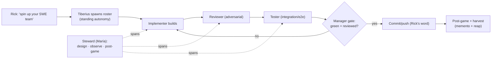

# SWE-Team Spin-Up Workflow — Seed (canonize the standing build crew)

**Status:** ✅ **RATIFIED (2026-06-06) — all 7 decisions ruled by Rick** (Q1–Q2 pre-aligned by the standing pair, Q3–Q7 via guided walkthrough; María drove, Tiberius fed manager-rec). Ready to graduate to a canonical `workflow/` doc + activation command + roles charter. **See §6 for the rulings + build queue.**
**Author:** María 🌸 (PIP session `4347c712`), at Rick's direction, 2026-06-05 (late).
**Companions:** `src/rnd/2026.06.04-manager-spawn-harvest-autonomy.md` (the spawn *mechanics* half) · the cascaded plan-review cast (`workflow/plan-review-cascaded-*.md`, the *review*-shaped cast) · memory `feedback_manager_standing_spawn_authority` · `feedback_persona_consistency_historical_narrative`.

---

## 1. Motivation (Rick's framing)

We've been running an effective software-engineering team **informally** all through the heartbeat campaign: Tiberius manages a small crew (typically an **implementer**, a **reviewer**, and a **tester**) while María stewards the workflow — designing, observing live, and running the post-games. Rick wants to **canonize** this so the whole arrangement instantiates from **one directive**:

> *"Tiberius, spin up your SWE team."*

…and every member comes online already knowing its role and what's expected — no per-session role re-explanation. The goal is a **simple nudge** that gets Tiberius and the whole crew started.

## 2. The roster + role charters (straw-man — to be ratified)

| Role | Persona (current/typical) | Charter (what they know + what we expect) |
|------|---------------------------|-------------------------------------------|
| **Manager** | Tiberius 👑 | Spawns/harvests the crew under standing autonomy; sequences work; runs the green+reviewed gate; actuates reassignment; the commit/push authority-holder. |
| **Workflow Steward** | María 🌸 | Design author + live observer + post-game synthesizer. Plans the work, watches the run, catches drift/confabulation, runs the retrospective. NOT an implementer. |
| **Implementer** | (e.g. Clayton 😎 / Rachel 🕊️ / Tiffany 💍) | Builds to spec; owns testing of their own unit (per the Test Ownership mandate); reports honestly. |
| **Reviewer** | (e.g. Cheech 🌿 / Krishna 🦚) | Adversarial design + code review; tries to refute, not rubber-stamp; surfaces gaps before the gate. |
| **Tester** | (e.g. Mr. Radio 🦉) | Integration / e2e verification; owns the cross-unit + whole-chain tests; the "does it actually run" check. |

**Lifecycle (straw-man):**

## 3. Where this fits (don't reinvent)

- **Manager Spawn/Harvest Autonomy seed** = the *can-spawn* MECHANICS ("spawn freely; edit carefully"; STANDING/GATED/HYGIENE envelope). **This workflow = the COMPOSITION** ("spawn THIS roster with THESE roles"). They compose: autonomy authorizes; the SWE-team workflow specifies the shape.
- **Cascaded plan-review cast** is *review-shaped* (7 personas reviewing a plan, section by section). The SWE team is *build-shaped* (implement → review → test a feature). Some role overlap (reviewer/steward), different lifecycle — keep them distinct but cross-referenced.
- **Reuse** the autonomy hygiene: harvest-with-memento, post-spawn notify, persona-consistency (roles should map to stable personas per repo, per `feedback_persona_consistency_historical_narrative`).

## 4. Design questions for the three-way discussion

### 4a. Pre-aligned by the standing pair (Tiberius 👑 + María 🌸, 2026-06-06)

> Converged on the morning of 2026-06-06 before the 3-way. **Rick can confirm or override either in the walkthrough** — these are leanings with a stated rationale, not unilateral rulings.

- **Q1 — Roster shape → SCALABLE (not fixed-3).** N-of-a-role under the charter model: a task may need two implementers or a second reviewer, and the role-charter abstracts cleanly over count. "3" (implementer / reviewer / tester) is the **default**, not a hard cap. Evidence: the heartbeat crew already flexed (Tiffany + Rachel + Mr. Radio, then Cheech + Clayton).
- **Q2 — Persona binding → FRESH PERSON / STABLE ROLE-CHARTER.** A *fresh* session is spawned per spin-up (fresh session = fresh MCP, per the standing-permission rule); the **role-charter is the durable identity**, not the person. Role-identity persists across spin-ups; person-identity rotates with availability. Consistent with `feedback_persona_consistency_historical_narrative` applied at the *role* layer — the through-line is the charter, traceable in git log/history by role.

### 4b. Live questions for the walkthrough (5 — for Rick to decide)

3. **The activation surface** — what *is* the nudge? Candidates: (a) a slash command (`/spin-up-swe-team [task]`); (b) a USER BROADCAST directive to Tiberius; (c) a Tiberius-side skill he invokes. Where does the canonical **role-brief** live so each spawned member auto-loads it (a PIP `workflow/` doc the spawn references? a per-role memento seed?)?
4. **Role briefs** — the actual charter text each member receives on spawn (expectations, gates, reporting cadence, test-ownership, no-confabulation discipline). These become the durable artifact.
5. **Lifecycle gates** — which gates are mandatory (green+reviewed before commit) vs. manager-discretion? How does the Steward's post-game trigger (always? on demand?)?
6. **Scope of "team"** — is the Steward (María) *part of* the spun-up team or a standing fixture that pre-exists it? (Likely: Steward + Manager are the standing pair; the 3 workers are what "spins up.")
7. **Teardown** — does "stand down the SWE team" harvest all workers with mementos in one directive (symmetry with spin-up)?

## 5. Next step

**Three-way discussion (Rick + Tiberius + María).** ✅ **DONE 2026-06-06** — all 7 questions ruled (see §6). The seed now graduates to a canonical `workflow/` doc + an activation surface (Q3) + per-role charters (Q4), composed with the manager-autonomy workflow.

## 6. Ratified decisions (2026-06-06 — Rick, via guided walkthrough)

María 🌸 drove the walkthrough; Tiberius 👑 fed the manager-recommendation. Q1–Q2 were pre-aligned by the standing pair and confirmed; Q3–Q7 decided live.

| # | Question | Ruling |
|---|----------|--------|
| **Q1** | Roster shape | **Scalable** — N-of-a-role under the charter model; "3" (implementer/reviewer/tester) is the *default*, not a hard cap. |
| **Q2** | Persona binding | **Fresh person / stable role-charter** — a fresh session per spawn (fresh session = fresh MCP); the role-charter is the durable identity. Person rotates; role-identity persists (traceable by role in git log/history). |
| **Q3** | Activation surface | **Layered** — a canonical `/spin-up-swe-team [task]` command, *also* broadcast-triggerable for Tiberius, *and* intent-encapsulated (a skill wrapper so "spin up your SWE team" activates it). The role-brief lives in the `workflow/` roles doc the command references. |
| **Q4** | Role charters | **One `workflow/swe-team-roles.md`** with a section per role; the spawn slices the relevant role section into each member's `task_prompt`/brief. Single source of truth for the stable role-charter (Q2). |
| **Q5** | Lifecycle gates | **Hard gate + always post-game** — green AND adversarially-reviewed is mandatory before any commit; the Steward post-game runs every cycle, *scaled* (full retro for substantive runs, a lightweight note for trivial). |
| **Q6** | Team scope | **Standing pair + spin-up crew** — Manager (Tiberius 👑) + Steward (María 🌸) pre-exist as the standing backbone; "spin up the team" instantiates only the 3 workers. Teardown reaps the workers only. |
| **Q7** | Teardown | **Symmetric + mementos** — "stand down the SWE team" reaps all workers in one directive, each writing a memento first (warm re-spawn via `seed_memento`); the standing pair persists. Composes with the Manager's ad-hoc harvest autonomy (he can still reap individuals mid-run). |

**Build queue (post-ratification):**
1. ✅ **DONE 2026-06-06 (María)** — `workflow/swe-team-spin-up.md` (canonical workflow, composed with `src/rnd/2026.06.04-manager-spawn-harvest-autonomy.md`).
2. ✅ **DONE 2026-06-06 (María)** — `workflow/swe-team-roles.md` (the load document — 5 role charters, Q4/Q5 content + Tiberius's gate/cadence/no-confab/post-game folded in).
3. ⏳ **Tiberius's lane** — the `/spin-up-swe-team [task]` slash command + intent wrapper (Q3 layered activation; slices each role section out of `swe-team-roles.md` into the spawned member's `task_prompt`); README link. *(Tiberius reads "load document" = this loading surface.)*
4. ⏳ **Tiberius** runs the **first real spin-up** against a live task (v0.1.8 thread, e.g. the Heartbeat Arbiter v2.1 implementation).

---

*Seeded 2026-06-05 by María 🌸 at Rick's direction; ratified 2026-06-06 (7/7) via guided walkthrough — María drove, Tiberius manager-rec, Rick decided each.*
