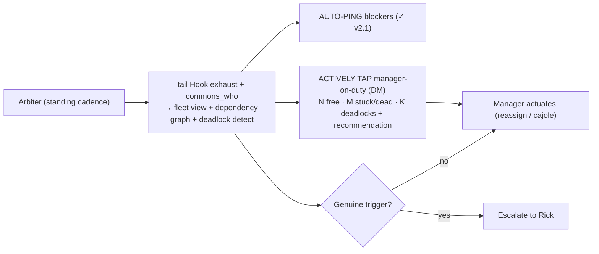

# Arbiter Closed-Loop Autonomy (v2.2) — Design + Implementation Plan

**Status:** ✅ DESIGN-RATIFIED 2026-06-06 (Rick, guided walkthrough — 4/4 decisions). **Steward/design:** María 🌸. **Manager + impl owner:** Tiberius 👑. **Builds on:** v2.1 direct-state visibility (committed Lupin `7973376`).
**Authorization:** Rick greenlit implementation while AFK ("a plan you can work from towards implementation while I'm away — let's hit it running"). Build → green + reviewed → **commit-ready; push HELD for Rick**.

---

## 1. Motivation — close the loop

v2.1 made fleet state **visible + pollable** (`GET /api/arbiter/fleet-snapshot` + `fleet-arbiter` topic + log) and the arbiter already **auto-pings blockers** + detects **deadlock cycles**. But the loop is **not closed** (3 gaps, code-verified 2026-06-06):
1. Arbiter→manager is a **pull** (posts to a topic the manager must read) — no active tap.
2. **Nothing forces the manager to consume it** → checking just moves from Rick → Tiberius.
3. **No standing-cadence registration** — the consumer is built+tested as a job but not confirmed running continuously.

**Goal (Rick):** workers finish without the human in the routine loop. Rick = design + 30,000-ft; reached **only on genuine exceptions**.

## 2. The closed loop (target)

## 3. Ratified decisions (4/4 — Rick, 2026-06-06)

| # | Decision | Ruling |
|---|----------|--------|
| **D1** | Push mechanism | **Commons DM-push** — arbiter `send_to(manager, summary)` (reuses the live push primitive → tmux injection; durable on the topic as fallback). Promote to a tmux-fallback only if DM-push proves unreliable. |
| **D2** | Manager keep-alive | **Local Heartbeat Hook + arbiter DM as the consume-trigger** — the hook keeps the manager from lazily stopping; the D1 DM is what prompts him to consume. **Push, don't poll** — no dedicated manager poll-loop (avoids burning context on empty polls). |
| **D3** | Escalation to Rick | **Genuine-trigger only:** (1) unbreakable **deadlock** cycle · (2) **whole-fleet stall** (no fleet-wide progress for X — the catch-all so nothing rots silently) · (3) a **decision the fleet can't make** (scope / prod-logic / hard ambiguity) · (4) **manager-down**. Manager handles all else. **No periodic digest** (that's polling Rick). |
| **D4** | Manager-down failsafe | **Escalate to Rick + HOLD** — if the manager doesn't ack within a window, arbiter escalates + does **NOT** auto-assign (preserves the "arbiter never actuates" invariant). V1. **Acting-manager succession** (promote a backup w/ memento rehydrate) = noted **V2** enhancement. |
| **D5** | Manager routing (multi-group) | **Lineage-derived + fallback** — each worker's manager = **the session that SPAWNED it** (host-side spawn-lineage → manager `session_id` → persona via bridge → DM). With multiple groups, **each stuck worker routes to ITS OWN manager automatically** (per-group routing by construction). **Never hardcode a persona name.** Un-lineaged/manual worker → **declared manager-on-duty** fallback; if neither resolves → **escalate to Rick**. |

## 4. Invariants preserved (do not regress)

- **Arbiter senses + recommends; never auto-assigns** — D4 keeps this even on manager-down.
- **Additive observer** of the Hook exhaust; **degrades safe** — arbiter down → every local hook still self-pokes.
- **State ≠ liveness** (two columns; honest age, never a false-LIVE boolean).

## 5. Build plan (lanes)

- **B1 — Standing cadence / deployment** *(the #1 missing piece)*: register the arbiter as a continuously-running recurring job (no scheduler registration found today); degrade-safe; one instance (no duplicate pokers).
- **B2 — Manager-tap**: extend the arbiter's manager-surface from `post()`-to-topic → `send_to(manager)` **DM-push** carrying the actionable summary (N free / M stuck-dead / K deadlocks + recommendation). **Throttle: tap on change + a min-interval** (never tap on no-change). **Resolve the recipient per D5** — derive the manager from the stuck worker's spawn-lineage (worker → spawner session_id → persona); group the per-group summaries so each manager gets only THEIR crew; declared-manager fallback; Rick if unresolvable. **No hardcoded persona.**
- **B6 — Manager registry/resolution (D5)**: a `resolve_manager(worker_session_id)` helper reading the spawn-lineage manifest (the source `list_spawned_sessions` uses) → manager session_id → persona; declared manager-on-duty fallback table; unresolved → Rick. Unit-test the lineage-hit, fallback-hit, and unresolved→escalate paths.
- **B3 — Escalation detectors** (the 4 D3 triggers): deadlock = existing cycle-detection; whole-fleet-stall = no-progress-for-X catch-all; decision-needed = a fleet-raised flag the arbiter relays; manager-down = the B4 ack-timeout → escalate to Rick (notify + DM).
- **B4 — Manager-ack tracking**: record the manager's ack of the arbiter DM; on timeout → D4 (escalate + hold).
- **B5 — Tests**: unit (FakeClock / FakeGateway seams, like v2.1) for each detector + manager-tap + ack-timeout; integration on `:7999` (non-mutating) + `:8000` (scheduled, **bounce-if-idle**). 100% line+branch+function on touched code.

## 6. Open tuning params (sane defaults; tune at deploy, not in code)

- Arbiter poll cadence (~60s, per v2.1 render).
- Manager-DM ack window (= the manager-down threshold).
- Whole-fleet-stall window.
- Per-manager-tap throttle (tap-on-change + min interval).

## 7. Next

Tiberius (manager + arbiter impl owner) leads the build via a **SWE-team spin-up** against this spec; María design-conformance + scaled post-game at the gate. Gate = green + adversarially-reviewed; **commit-ready, push held for Rick**. V2 backlog: acting-manager succession (D4-C).

---

*Design by María 🌸 (Steward) from Rick's 2026-06-06 guided walkthrough (4/4 ratified); the closed-loop completion of the deferred P0 "Heartbeat Poker / arbiter-behavior deep-dive." Implementation owner: Tiberius 👑.*
