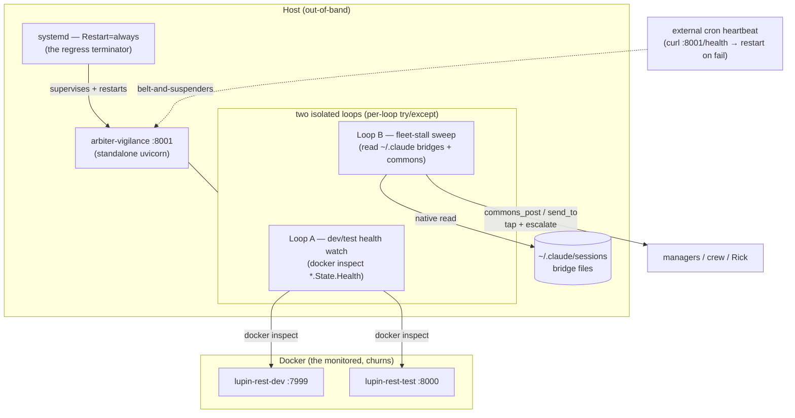

# Arbiter Deploy Architecture (B1) — The Out-of-Band Vigilance Service on :8001

**Date:** 2026-06-07. **Author:** María 🌸 (Workflow Steward, `896d370e`). **Manager:** Tiberius 👑.
**Status:** DESIGN — direction ratified by Rick ("let's pursue this", 2026-06-07 voice). Supersedes the in-container-vs-host-side fork in `src/rnd/2026.06.06-arbiter-closed-loop-design.md` (lane B1) with a **third option: a standalone host-side service**.
**Relationship:** this is the **deploy** half of the Closed-Loop Arbiter (v2.2). v2.2 designed *what the loop does*; this doc settles *where and how it runs* so it runs unimpeded ~24/7 during development.

---

## 1. Problem — built ≠ live, and the blind-spot is structural

The v2.2 closed-loop arbiter is designed, built, and committed-held — but it only exists as **session/hook logic, which naps** when a session goes idle. The loop is not continuously running, so the fleet still depends on Rick (or a lucky peer-ping) to detect stalls. The autonomy is on paper, not in effect.

The deeper hazard Rick named: **if the vigilance service is disrupted or goes down, we go blind to stalls — exactly when we most need eyes.** A monitor that shares the lifecycle of the thing it monitors is worse than no monitor, because it gives false confidence and then fails in the same event it was meant to catch.

## 2. Governing principle — a monitor must be out-of-band from the monitored

The dev/test server is **bounced** to pick up the static snapshot and is **monopolized by test runs** (bounce-if-idle). Any arbiter logic living *inside* that server inherits that churn: it dies on every bounce and is shoved aside by a heavy test run. Vigilance is lost precisely during disruption.

**Therefore the arbiter must be a separate, lifecycle-decoupled service** whose uptime is independent of the dev server, the test server, and any Claude Code session. Rick's instinct — its own FastAPI app on its own port (**:8001**) — is the correct expression of this principle.

## 3. Decision — host-side standalone process on :8001 (not a container, not an in-:8000 thread)

This resolves Tiberius's original gating question (*does the :8000 container even see the host's bridge files?*) by **moving outside the container question entirely.** A host-side standalone process is the natural home for an out-of-band observer:

| Need | Host-side standalone | In-container (2nd container) | In-:8000 thread |
|------|---------------------|------------------------------|-----------------|
| Read host `~/.claude/sessions` bridges (manager resolution + stamping) | ✅ native | ⚠️ needs `~/.claude` bind-mount | ✅ native (but…) |
| `docker inspect` the dev container (health watch) | ✅ host Docker CLI/socket | ⚠️ needs `/var/run/docker.sock` mount | ⚠️ socket access |
| Survives dev-server bounce + test monopolization | ✅ fully decoupled | ✅ decoupled | ❌ **dies with it** |
| Operational simplicity | ✅ one uvicorn + systemd | ⚠️ image + mounts + compose | ❌ couples lifecycles |

**Ruling (D1):** **host-side standalone uvicorn process on :8001**, supervised by systemd. *Trade-off accepted:* it is not containerized like the rest of the stack; the systemd backstop (§6) mitigates the loss of Docker's restart policy.

## 4. Grounding — verified, not asserted (2026-06-07)

Ran `docker inspect lupin-rest-dev --format '{{json .State.Health}}'` and `docker ps`:

- **`lupin-rest-dev` is `healthy`** with a **real Docker HEALTHCHECK** — `CMD-SHELL python3 -c "urllib.request.urlopen('http://localhost:7999/health', timeout=3)"`, interval 30s, timeout 10s, 3 retries, 60s start-period. So `.State.Health` is **populated and usable today** — the health-watch loop has a real feed with **zero new dev-side infra**.
- **Port map (important nuance):**
  - `lupin-rest-dev` → host **:7999** (the dev server)
  - `lupin-rest-test` → host **:8000** (→ ctr :7999) — this is the **static-snapshot "/:8000" box**
  - `lupin-model-server` → :7998 · `lupin-postgres` → :5432
  - **:8001 is free.** ✅

> Caveat: all four containers expose the **same** Docker healthcheck shape (probe their own :7999/health). The arbiter's health-watch loop should `docker inspect` **each container by name**, not assume one global health.

## 4.1 Liveness inputs — what the arbiter counts as a sign of life (VERIFIED, 2026-06-07)

Rick's rigor check: *do DMs / commons writes register as signs of life?* **Answer: YES, via two independent paths.** Code-traced in Lupin (`src/cosa/agents/heartbeat_arbiter/` + `src/lupin_mcp/` + `src/lupin_cli/.../hooks/`), primary evidence cited.

The liveness **verdict** (`fleet_render.compute_liveness`) = freshest of **{`bridge_age`, `event_age`}** — bridge mtime is the wedge-resilient **PRIMARY**, event-ts backstops.

| Signal | What feeds it | Does a commons DM/write count? | Evidence |
|--------|---------------|-------------------------------|----------|
| **Bridge mtime** (primary) | Stamped on EVERY cosa-voice MCP call — **twice**: middleware **before** the call runs, + PostToolUse hook **after** | ✅ YES — `post`, `send_to`, `read`, `notify`, `ask_*` all refresh it. *The act of DMing IS the heartbeat.* | `bridge_liveness_middleware.py:64` (before `call_next`) · `post_tool_use.py:57` (per-session, every tool) |
| **commons_who `last_post_ts`** (secondary) | Merged into `last_activity_ts` = `_newer(last_event_ts, commons_ts)` → drives the `alive` flag + idle_roster | ✅ YES for **posts + DMs** (writes to a topic / `dm-<peer>`). `commons_read` does NOT appear here (not a post) — but the bridge path covers it. | `fleet_data_model.py:150`, `:158` |
| **Heartbeat event-ts** | The Stop/heartbeat-hook event exhaust | (separate signal — not commons) | `fleet_data_model.py:148` |

**★ The one structural caveat (the honest gap):** fleet-view **membership is gated on heartbeat events, not commons.** `build_fleet_view` skips any session with **zero valid events** (`fleet_data_model.py:127, :134`); `commons_who` only *enriches* sessions already in view. So commons activity **refreshes** liveness for a tracked session but **cannot, by itself, make a session trackable.** In practice every live CC session emits events (heartbeat hook v1), so this is structural, not a live hole — but the :8001 port must preserve the event-stream dependency, not assume commons alone suffices.

**Build-time verify (carried to §8):** the middleware stamp "resolves this server process's own bridge file (PPID/grandparent walk)" — on the shared :7999, confirm it attributes to the **caller**, not the server process. The PostToolUse host-side hook is the reliable per-session backstop regardless.

## 5. Architecture

## 6. The terminating backstop — "who watches the watcher?"

This is the heart of Rick's concern and the one principle that must not be fudged. :8001 watches :8000; **you cannot infinitely nest watchers.** The regress must terminate at **OS-level process supervision**, which gives an unconditional restart guarantee that no in-process logic can provide:

- **Primary:** **systemd unit with `Restart=always`** (+ `RestartSec`, `WatchdogSec` optional). If :8001 crashes, systemd brings it back — full stop.
- **Belt-and-suspenders (optional):** a dead-simple external cron (every N min) that curls `:8001/health` and `systemctl restart` on failure — catches a hung-but-not-exited process that systemd's process-liveness alone would miss.

**Robustness comes from process supervision, not from adding more watcher layers.** Two watcher services would just move the regress, not end it.

## 7. :8001 service surface (V1)

- **`GET /health`** — liveness for systemd/cron to poll (must be cheap + always-answer).
- **`GET /state`** — the **single pane of glass**: the arbiter's current view of all teams + Claude Code instances (who's active, last progress, owed-work, stall candidates) + last dev/test health snapshot. This is Rick's "see my state, don't infer it" surface for the *fleet*.
- **Loop A (health watch):** periodically `docker inspect` each named container → record health + restart streaks → escalate on unhealthy/flapping.
- **Loop B (fleet-stall sweep):** the v2.2 closed-loop on a standing cadence — read bridges + commons, detect blockers / whole-fleet stall (progress-keyed, per D3), tap the manager (D1 commons DM-push), escalate to Rick only on genuine triggers (D3) / manager-down (D4). All v2.2 invariants carry unchanged (never-auto-assign, additive-observer, lineage-derived routing).
- **Config:** INI sweep-interval keys for both loops (+ splainer entries); thresholds not hardcoded.
- **Observability:** structured log + the `/state` endpoint; 100% line+branch+function on the daemon wiring (per the standing coverage bar).

## 8. Open questions for the build engagement

> **Q2 (commons-write from a non-CC process) — ✅ RESOLVED 2026-06-07 (Tiberius infra read, code-grounded).** A plain host process CAN `commons_post`/`send_to` **with no session bridge of its own.** Evidence: the arbiter's own gateway is already constructed bridge-less — `arbiter_bootstrap.py:78` → `LupinArbiterGateway.from_environment( sender_session_id="heartbeat-arbiter" )` (`user_id="system"`), and it runs **today** inside the FastAPI server process (which itself has no CC bridge) and posts/sends fine. So commons writes have **never** required a real sender bridge — only (a) a sender-id string + (b) write access to the commons store. The recipient-side push keys on the **recipient's** bridge, not the sender's, so DMs land regardless. **One residual build-time check (not a design fork):** confirm the **physical path of the commons store** and that the :8001 service's user/cwd can write it — host-side files under the project tree → native reach (strictly better than a container); any container-volume segment → map that path. *(Owner: build engagement / Tiberius infra.)*

Remaining four (each REFINED by Tiberius's 2026-06-07 review — now decided-with-recommendation, R1–R4):

1. **Supervisor mechanism (R1) — ladder reframed around ROOT access.** System systemd-units need root to install under `/etc/systemd/system`. The no-root fallback is **NOT cron-only** (cron loses the unconditional-restart guarantee §6 depends on) — it's `systemd --user` + `loginctl enable-linger` (survives logout, keeps `Restart=always`). **Ladder:** system-systemd (if root) → **user-systemd + linger (preferred no-root)** → `supervisord` → cron last. The belt-and-suspenders cron then issues `systemctl --user restart`. *(Confirm root availability on the dev box to pick the rung.)*
2. **Stall thresholds (R2) — reuse v2.2's proven INI values, don't invent.** `fleet_stall_window_seconds=1800`, `manager_ack_window_seconds=600`, `tap_min_interval=300` are already defaulted + test-proven (`arbiter_bootstrap.py:70-76`). Start :8001 with those **verbatim**; tune via `/state` observation. **★ Add a START-PERIOD warm-up:** on boot / systemd-restart the service has EMPTY event history — it must NOT fire a whole-fleet-stall the instant it starts cold (mirror Docker's 60s start-period), or every restart triggers a false stall.
3. **`/state` access path (R3) — localhost-bind is right; settle the UX consequence.** Bind **127.0.0.1 explicit (not 0.0.0.0)**. But "single pane" implies a browser, and a localhost-only :8001 isn't reachable cross-origin from the :7999 UI. **Recommend a thin reverse-proxy route on :7999** (`/api/arbiter/fleet-state` → `:8001/state`) so :8001 stays unexposed **and** inherits :7999's JWT. *(View-path note: the proxy view depends on :7999; the actuation path does not — see R4. Direct `curl localhost:8001/state` is the fallback when :7999 is down.)* **This `/state` SUPERSEDES the in-process `/api/arbiter/fleet-snapshot` on :7999** — the new one is authoritative; the old retires with the in-process arbiter (ties to R0).
4. **Health-watch escalation (R4) — V1 notify-only correct; pin FLAPPING + assert loop independence.** "Flapping" needs a concrete streak (e.g. **≥3 health transitions in 10 min**) or one blip pages Rick. **★ Assert the invariant: Loop B has ZERO dependency on :7999/:8000 being up** — it reads bridges + commons from the **filesystem**, not via any server API. **Build must verify literally** (no :7999 HTTP calls in the stall path). If true, a dev outage that fires Loop A does **not** blind Loop B — that independence is a V1 selling point worth stating outright. Auto-remediation (auto-bounce) stays V2.
5. **Liveness-stamp attribution (R5, from the §4.1 verified note)** — confirm the MCP middleware's bridge-stamp (`touch_bridge_mtime` PPID/grandparent walk) attributes to the **calling** session, not the shared :7999 server process. The PostToolUse host-side hook is the reliable per-session backstop, so Loop B's liveness holds regardless — but verify the attribution so the commons-write-counts-as-life property is real, not assumed. The :8001 port must **preserve the heartbeat-event-stream dependency** (membership is event-gated; commons only enriches — §4.1 caveat).

### 8.1 Validation — this hosting choice resolves THREE prior gaps at once (Tiberius)

The host-side :8001 + systemd ruling isn't only the in-container-vs-host-side answer; it collapses three separately-flagged gaps:
1. **Container file-visibility** → native `~/.claude` read, no bind-mount.
2. **Self-perpetuation past the 12h hard-cap** → systemd restarts it (a session/hook-bound loop cannot outlive the cap).
3. **"Dies with the server"** → out-of-band survives every bounce.

Tiberius's prior **Diagram 3 (the in-process CJ-Flow lifecycle)** is the *as-built v2.2 B1* but is now **SUPERSEDED as the deploy target** by this :8001 architecture; his doc will annotate the pointer to here as the authority.

## 9. Build lanes (proposed — for the next SWE-team engagement)

> ### ★ R0 — CRITICAL SEQUENCING RISK: double-actuation (Tiberius, 2026-06-07)
> The **in-process arbiter is LIVE today** — `arbiter_bootstrap.submit_arbiter_if_absent` is wired into `main.py:847-848` and has fired on :7999. If :8001 **Loop B goes live while that's still running, TWO arbiters tap the same managers → duplicate DMs + double escalations.** The cure would double the noise. **Decommissioning the in-process arbiter is a first-class build lane (L3-coupled), not implicit:** when :8001 Loop B ships, disable the in-process bootstrap via a feature flag (e.g. `arbiter in-process bootstrap enabled = false`) or remove the lifespan call. The cutover must be **atomic with Loop B going live**. **Hard invariant: never two arbiters actuating** — a brief *zero-arbiter* window is acceptable ONLY during supervised cutover (break-before-make), never a steady state. **Full mechanism — flag, gate point, atomic cutover procedure, 5-case test matrix — in the sibling spec:** [`2026.06.07-arbiter-r0-inprocess-decommission-spec.md`](2026.06.07-arbiter-r0-inprocess-decommission-spec.md) *(Tiberius, infra lane; design-spec only, zero code until Rick greenlights the engagement).*

- **L1 — scaffold:** standalone uvicorn app on :8001, `/health`, supervisor unit per the R1 ladder (Restart=always), **127.0.0.1-bind**. *(Smallest shippable: a supervised heartbeat that survives a dev bounce.)*
- **L2 — Loop A (health watch):** `docker inspect` per **named** container, health/streak tracking, **R4 flapping streak** (≥3 transitions/10 min), notify-on-unhealthy.
- **L3 — Loop B (fleet-stall sweep):** port the v2.2 arbiter logic into the standing loop (reuse R2 INI thresholds + **start-period warm-up**); assert the **R4 filesystem-only independence** invariant; **atomically decommission the in-process arbiter (R0)** as Loop B goes live.
- **L4 — `/state` single-pane endpoint** + the **R3 :7999 reverse-proxy route** (`/api/arbiter/fleet-state`, supersedes `/api/arbiter/fleet-snapshot`) + config/splainer keys + coverage.
- **Retire** the interim poker the moment L1+L3 are live (§10).

## 10. Relationship to the interim poker

The interim poker (DESIGNED, NOT BUILT; Tiberius's mechanism lane) is the **stopgap** that keeps idle managers broadcast-reachable + detects whole-fleet stalls until this :8001 service is live. **It retires the moment B1 (L1+L3) ships.** This deploy doc does **not** fix the broadcast-injection bug (separate Lupin listener lane) — kept decoupled.

---

— 🌸 María, Workflow Steward, 2026-06-07
