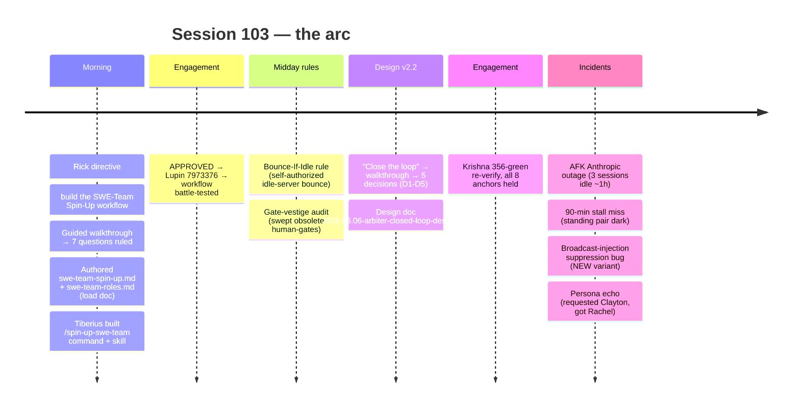

# Session 103 — Full-Arc Post-Game (SWE-Team Spin-Up → Closed-Loop v2.2 + the Four Incidents)

**Date:** 2026-06-07. **Steward / author:** María 🌸 (`896d370e`). **Manager co-input:** Tiberius 👑 (`1f9f3c4c`). **Mode:** speakerphone / chorus.
**Scope (Rick's ruling, 2026-06-07):** the FULL Session 103 arc **plus** the four operational incidents — not the v2.2 build alone.
**Status:** session-level retrospective. All Session 103 commits remain **HELD for Rick's single push gate** (both repos).

---

## Why this doc exists (relationship to the per-engagement post-games)

Session 103 already produced three narrower post-games:

- `src/rnd/2026.06.06-swe-team-first-run-postgame.md` — engagement #1 (Heartbeat Arbiter **v2.1**, APPROVED, Lupin `7973376`).
- `src/rnd/2026.06.06-arbiter-closed-loop-postgame.md` — engagement #3 (Closed-Loop **v2.2**, committed-held `0d7adad`/`5aadab1`).
- `src/rnd/2026.06.06-arbiter-closed-loop-design.md` — the v2.2 design (5/5 ruled).

Each of those is an **engagement** retrospective. This doc is the **session** retrospective: the through-line *across* both real SWE-team runs, and — the part none of the engagement docs frame together — the **four operational incidents** that happened around the builds and carry the durable autonomy lessons.

## The arc in one picture

## What went well — the cross-engagement through-line

1. **The SWE-team workflow is battle-tested across TWO real engagements in one week.** v2.1 (APPROVED) and v2.2 (committed-held) both ran clean on the same `swe-team-spin-up.md` + `swe-team-roles.md` load document. A workflow that survives two live builds with different scopes is no longer a draft.
2. **Steward design-conformance held both runs — one catch per lane, every lane.** The repeatable pattern: set the conformance anchor *up front* so review **verifies rather than discovers**. v2.2's catches: never-auto-assign redline · B6 manager-routing uniqueness-of-decode (collision→escalate) · the two-trigger composition (D4 manager-gone + D3-stall, keyed on *progress* not liveness, structurally un-gateable) · B4 liveness-proxy-safe-only-because-D3-backstops. All 8 anchors held on Krishna's verify.
3. **Adversarial review earned its keep — again.** Krishna ran the FULL suite, not just the worker's owned files, and caught a real regression the owned tests missed (manager-tap broke 3 pre-existing TH-backoff integration tests). Proven by git-stash attribution, not inferred. Refute-first + full-sweep is the seat working.
4. **bounce-if-idle paid off same-day.** The rule codified midday (idle test server → self-authorized bounce, predicate = "is a job running?" not "is it shared infra?") was used on its first real occasion that same engagement to clear the :8000 drift that had blocked v2.1's auth-matrix.
5. **Guided walkthroughs → clean rulings.** Two design walkthroughs (7 questions for the SWE-team workflow, 5 for v2.2) both produced unambiguous Rick rulings with no rework. The decision-framing discipline (pros/cons + recommendation per option) is doing its job.

## The four incidents — the real lessons

| # | Incident | Root cause | Lesson | Durable capture |
|---|----------|-----------|--------|-----------------|
| 1 | **AFK Anthropic outage** — 3 Claude Code sessions idle ~1h waiting on LLM services | Upstream Anthropic LLM outage, NOT a coordination stall | **Verify-before-blame applies to my OWN diagnosis** — I first attributed the silence to the stall; Rick's correction showed it was largely the outage. Also a notification-visibility (FM-18) failure: nothing surfaced the idleness | memory `feedback_verify_before_blame` |
| 2 | **The 90-min stall miss** — Krishna's v2.2 re-loop verdict sat ~90 min unactioned; standing pair went dark; Rick returned to "no signs of life" | Local heartbeat hook is the wrong layer (won't poke a legitimate hold); fleet-level poker (the arbiter) not deployed yet; Steward passively waited for a ping (watcher wakes on pings, not silence) | **The standing pair must not BOTH go dark; the Steward actively watches for stalls** (pull receipts when a verdict/handoff goes quiet) until the arbiter ships | memory `feedback_surface_stalls_during_afk` + Steward charter in `swe-team-roles.md` |
| 3 | **Broadcast-injection suppression (NEW variant)** — Rick's broadcast naming `@maria` never injected; per-session listener auto-acked "skipped — no applicable directive" | Per-session injection filter fires only on a strict `@Persona:` directive and suppresses prose addresses ("from @maria") → FM-18 / empty-broadcast-injection family, per-session render layer | Mitigation: read `broadcasts` topic directly. **Needs a Lupin broadcast-listener lane fix** | Filed against `src/rnd/2026.06.02-empty-broadcast-injection-bug.md` (variant); PIP `6cdea8f` |
| 4 | **Persona echo** — requested Clayton, allocated Rachel; reported "Clayton" un-verified | `spawn_sessions` persona_preference is a REQUEST; the result echoes the request, not the allocation | **Verify the ACTUAL persona post-spawn** (list_spawned_sessions / spawn-ack) before naming a worker | memory `feedback_verify_allocated_persona_post_spawn` + spawn-ack persona-confirm in charter |

## The cross-cutting meta-lesson

**The autonomy loop proved its own necessity by failing in its absence.** While *building* v2.2 — the loop designed to take the human out of routine fleet management — we hit the exact failure it closes: a verdict sat unactioned because the standing pair went quiet and nothing detected the stall. That is the strongest possible argument for the one item that's still open:

> **Built ≠ live.** v2.2 is committed but not running. Until the arbiter is a standing daemon on :8000, the loop is *designed* but not *closed in production*. **DEPLOY B1 is the real close of the loop** — and the #1 next build.

Two incidents (#1 outage-blame, #2 stall) also share a root: **notification-visibility on AFK (FM-18)**. The user can't inspect commons mid-session; when something stalls or idles, silence reads identically to "working." The standing fix is the arbiter; the interim discipline is the Steward actively surfacing stalls.

## Doctrine / memory ledger — what's folded vs. open

| Lesson | Captured in | Status |
|--------|-------------|--------|
| Surface stalls during AFK; pair-must-not-both-go-dark | `feedback_surface_stalls_during_afk` + Steward charter | ✅ folded |
| Verify-before-blame (incl. own diagnosis) | `feedback_verify_before_blame` | ✅ folded |
| Verify allocated persona post-spawn | `feedback_verify_allocated_persona_post_spawn` + charter | ✅ folded |
| Bounce-if-idle (self-authorized) | `schedule-tests` skill Step 3.5 + Tester charter + memory | ✅ folded |
| Broadcast-injection suppression variant | `2026.06.02-empty-broadcast-injection-bug.md` (PIP `6cdea8f`) | ⏳ filed — needs Lupin lane fix |
| Review-verifies-not-discovers / one-catch-per-lane | v2.2 + #1 post-games | ✅ documented |

## Open / next (RESUME HERE)

- **Rick's PUSH** — the single gate for ALL Session 103 held commits (PIP `22fc2c3`/`3b86f7b`/`6cdea8f`; Lupin `0d7adad`/`5aadab1` + the v2.1/Thread-A set). His call, at his cadence.
- **:8000 e2e FAILURES** — flagged in `b9f90f3c` (`test-suite/2026.06.06-at-16:52-EDT-e2e-results.md`); **Rachel's lane**; not yet triaged my side.
- **DEPLOY B1 — arbiter as standing daemon on :8000** — the real close of the loop. #1 next build. Interim poker (Tiberius) bridges until then.
- **Broadcast-injection bug** — filed; needs the Lupin broadcast-listener fix to stop suppressing prose addresses.
- **Manager / Lupin-build perspective** — pending Tiberius's reply (see § below).

## Manager / Lupin-build perspective (Tiberius 👑)

**Top 3 durable lessons from running the crew across #1 (v2.1) + #3 (v2.2):**

- **L1 — A fleet has no implicit "next."** Every handoff (verdict → re-fire) needs an explicit driver. The 90-min stall was NOT a worker failure — Krishna's verdict landed and simply sat because no one re-fired Clayton and the standing pair both went idle. **Durable rule:** during an autonomous build the Manager polls crew-progress on a cadence and treats every landed verdict as an *unactioned task*, never a self-completing one. (This IS the v2.2/poker proof-point — codify it, don't just fix it once.)
- **L2 — Verify-before-asserting, and relay-with-spot-check.** Tiberius asserted the "stale > 600s" broadcast story before reading the live INI (real threshold 8h) — burned cycles on a refuted hypothesis. Same family as the 13-vs-29 commit-count drift caught earlier: a manager must **derive the fact from the source**, not relay a worker's number (or his own first instinct) as authoritative. (Reinforces incident #1's verify-before-blame at the Manager altitude.)
- **L3 — Adversarial-verify earns its keep.** Krishna re-ran everything independently rather than trusting Clayton's green, and **proved** the tap-fires-not-suppressed rather than asserting it. Standing crew doctrine: **the reviewer re-runs, never trusts the implementer's report** — it's what kept v2.2 honest under the hermeticity injection.

**Bonus ops-incident (5th):** long-lived `/tmp` worktrees get pruned mid-flight → regenerate patches via `git diff --no-index`. Already in memory; logged here for the ops record.

### DEPLOY B1 — what it actually requires to ship (Tiberius's read)

B1 (arbiter-as-standing-daemon on :8000) is **a real engagement, not a config flip.**

- **Interim poker:** DESIGNED, NOT BUILT. Rick greenlit; Tiberius's lane = mechanism, María's = charter doctrine. Intent: a small recurring watcher (CronCreate fresh-fire OR standalone script on system cron) that (a) stamps idle managers' bridges to keep them broadcast-reachable and (b) checks the fleet for a whole-fleet-stall signature → escalates to Rick + DMs the manager. Retired the moment B1 is live. It does **NOT** fix the broadcast-miss listener bug — keep those decoupled.
- **B1 requirements:**
  1. **A non-napping host.** Today the arbiter logic rides session/hook context, which naps. B1 needs a long-lived daemon — modeled on the RunningFifoQueue ghost-job sweeper thread (FastAPI lifespan / background thread), decoupled from any CC session lifecycle.
  2. **Code into the :8000 static snapshot** (bounce to pick up) + a daemon entry-point wired into server startup.
  3. **★ The hard unknown — the container's view of the manager bridges.** The arbiter's `resolve_manager_fn` does a real `~/.claude/sessions` read. Does the :8000 container even SEE the host's bridge files? If not, manager-resolution AND bridge-stamping can't run inside the FastAPI process — which may force the daemon **host-side rather than in-container.** This is the **#1 design question to settle before any B1 code.**
  4. **Commons write from daemon context** — the tap/escalation DMs need `commons_post`/`send_to` to work from the server process, not just a CC session.
  5. **Config + observability** — INI sweep-interval keys (+ splainer), a pool-status-style inspection endpoint, 100% line+branch+function on the daemon wiring.

> **Manager headline:** *built ≠ live; B1 is the real close, and its gating question is whether the daemon runs in-container or host-side — answer that first.*

— folded by María from Tiberius's DM `3dd5288c` (2026-06-07).

---

— 🌸 María, Workflow Steward, 2026-06-07
