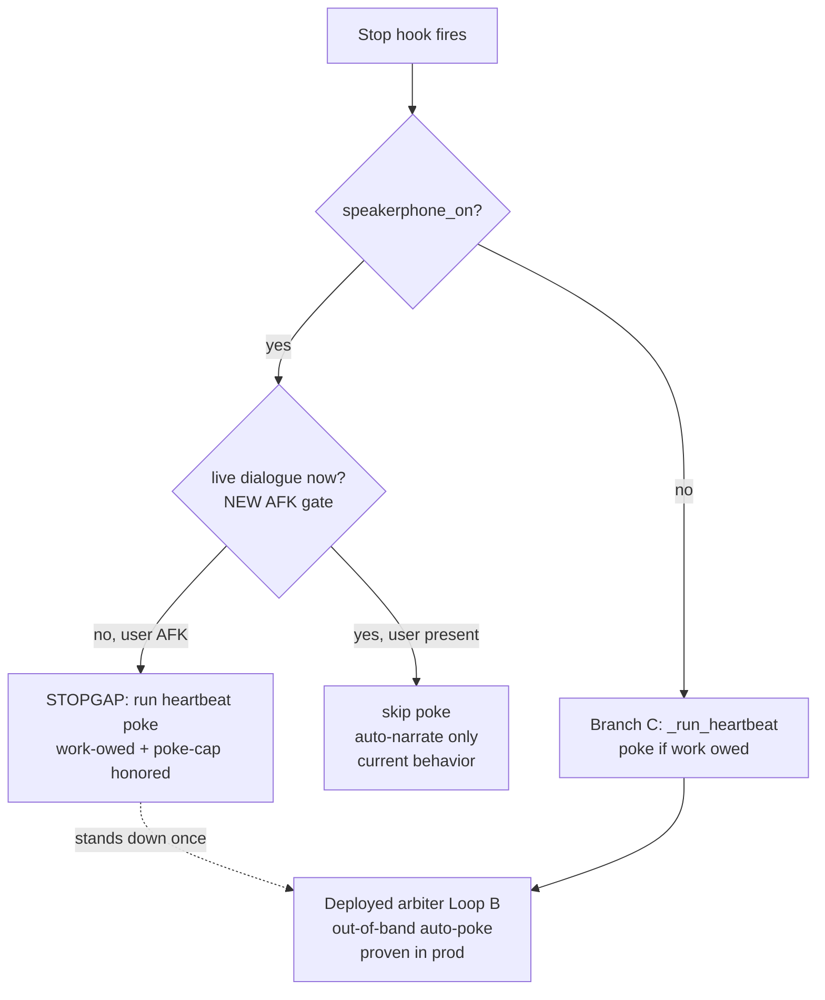

# Speakerphone Heartbeat Gap — Self-Poke for the Standing Pair

**Date:** 2026-06-09
**Author:** María 🌸 (Workflow Steward, PIP session `42954f0b`)
**Trigger:** Rick USER BROADCAST `92400208` — *"create heartbeat poker for yourselves so that you do not fall asleep at the wheel while you manage your SWE team."*
**Decision:** Rick ruled **Both — local-hook stopgap now + arbiter on deploy** (make-before-break) via `ask_multiple_choice`, 2026-06-09.
**Status:** DESIGN — Steward's gap write-up + plan. Implementation of the Lupin-side stopgap is Tiberius's (Manager) to scope through the crew; the `:8001` deploy half stays Rick-gated.

---

## 1. The finding (code-grounded, not assumed)

The heartbeat machinery already exists and is **enabled globally** — `~/.claude/settings.json` wires the `Stop` hook and sets `"heartbeat": { "enabled": true, "poke_cap": 3 }`. The leaf modules (`heartbeat_hold`, `heartbeat_work_owed`, `heartbeat_poke_cap`, `heartbeat_decision`) are pure + tested, and `stop.py`'s Branch-C adapter (`_run_heartbeat`) composes them to poke a session that tries to Stop with work owed.

**But it never fires for us.** In `lupin/src/lupin_cli/claude_code/hooks/stop.py` `main()`, a speakerphone/chorus session **early-exits before the heartbeat path runs**:

```
if get_speakerphone( session_id ):
    _try_auto_narrate( ... )          # Phase-4 narrate safety net
    if idle_behavior == "idle_announce": _announce_idle( ... )   # low-pri DOM bubble, no TTS
    log_to_stream( ... "speakerphone_skip" )
    emit_json( {} ); sys.exit( 0 )    # ← returns HERE, never reaches _run_heartbeat
```

`_run_heartbeat` (and the genuine-idle beacon, and the oracle log) live **downstream** of that early-exit, in the non-speakerphone Branch C. The comment is explicit: speakerphone sessions skip the heartbeat path *"it would interrupt the user's live voice dialogue."*

**Consequence:** the Steward (María) and Manager (Tiberius) run in **chorus/speakerphone exactly while managing a crew** — so the self-poke is off for precisely the two roles that must not go dark. This is the code-level cause of the **90-minute "no signs of life" stall** during the v2.2 closed-loop build (history S103 checkpoint 2; the founding case for the *standing-pair-must-not-both-go-dark* lesson).

The premise was reasonable when written (a poke mid-live-dialogue is rude) — but it conflates two states: **Rick present + talking** (don't poke) vs **Rick AFK on a walk-away** (poke is exactly right). The gate is on `speakerphone_on`, when it should be on *"is the user actually in live dialogue right now."*

## 2. Why a local hold-artifact doesn't already cover it

The `.heartbeat-hold-<sid>.json` artifact is the **opposite** lever — it tells the hook *not* to poke (defend-your-quiescence). It can't wake a dormant session. The wake mechanisms are exactly two:

| Mechanism | Kind | Covers speakerphone today? |
|---|---|---|
| **Local Stop-hook self-poke** (`_run_heartbeat`) | in-process | **No** — early-exited |
| **External arbiter Loop B fleet-stall auto-poke** (built 2026-06-08, `ba57416`) | out-of-band DM | Yes by design, **but not deployed** (`:8001` Rick-gated) |
| *(interim)* manual cascade-poker (`start-cascade-heartbeat.sh`) | out-of-band | partial — the current keep-alive stopgap |

## 3. The plan Rick ruled — make-before-break



**Track 1 — local-hook stopgap (now).** Let the heartbeat run for speakerphone sessions **gated to AFK** (user not in live dialogue), so it never interrupts a real conversation but does keep the standing pair moving on a walk-away. Reuses the existing `_run_heartbeat` + poke-cap + work-owed oracle — the only new logic is the AFK discriminator + relocating the early-exit below it.

**Track 2 — arbiter on deploy (correct long-term).** The out-of-band operator loop we built 2026-06-08 is the architecturally-right answer (a watcher must not share the watched's lifecycle — the B1 principle). Once it's deployed and the auto-poke is **proven in prod**, the Track-1 stopgap stands down. Deploy = `:8001` restart + the push, **Rick's direct gate**, sequenced after the Lupin rename per yesterday's ruling.

## 4. Open design questions for the Track-1 stopgap (for Tiberius's crew)

1. **AFK discriminator — what defines "live dialogue"?** Candidate signals: time since last `UserPromptSubmit` / last inbound voice message on the bridge; an explicit "walk-away" beacon Rick sets; speakerphone-on but no user turn in N minutes. Needs a concrete, testable predicate (mirror the `quiet < alive` threshold discipline from the v2 arbiter F3 fix).
2. **Poke channel in speakerphone.** A `decision:block` re-prompt is the in-process poke; confirm it composes with the auto-narrate path and the chorus TTS queue without double-speaking.
3. **Poke-cap interaction.** Reuse the per-session cap (3/episode, anti-storm, FM-20) verbatim — no new cap logic.
4. **Make-before-break handoff.** The stopgap must read a flag (or detect the arbiter's liveness) so it stands down cleanly once Track 2 is proven, with no window where both poke.
5. **Scope guard.** This is a **fleet-wide** change to the shared Stop hook — every speakerphone session inherits it. Blast-radius test coverage (the AFK gate's true/false matrix) is mandatory before it lands.

### Hard build constraint (Tiberius 👑, ratified 2026-06-09)

**`stop.py` IS the live, enabled heartbeat hook — it executes on every Stop trigger of every session.** Editing it in the live working tree means running **uncommitted, unreviewed code in production on the next trigger** (this exact footgun bit the original Heartbeat Hook build). Therefore the crew **builds the stopgap in a git worktree (or with the hook disabled), never the live working tree**, and re-enables only **after the change is reviewed + committed**. This goes in the crew brief as a non-negotiable. (Composes with the make-before-break handoff in Q4: the current interim keep-alives — the manual cascade-poker AND Tiberius's `/loop` AFK stand-in — stand down once the reviewed stopgap lands.)

## 5. Division of labor

| Owner | Work |
|---|---|
| **María 🌸 (Steward)** | This design/gap doc; the AFK-predicate spec; conformance review of the crew's gate matrix at the green gate. |
| **Tiberius 👑 (Manager)** | Scope + drive the Lupin `stop.py` stopgap through the SWE crew (Manager manages, does not build); green+reviewed gate. |
| **Rick** | The `:8001` deploy + push (Track 2) — direct gate, shared-infra. Already in his court. |

## 6. The through-line

Rick's directive is the structural fix for the exact stall the **§4 post-game finding** is about: the standing pair going dark. The poke for ourselves isn't a new build — it's closing a speakerphone early-exit that was written for the wrong question (*are we in speakerphone?* instead of *is the user actually here?*).

*Related: [[the joint post-game]] `src/rnd/2026.06.09-arbiter-operator-loop-2b-observer-postgame.md`; arbiter deploy design `src/rnd/2026.06.07-arbiter-deploy-architecture.md`; heartbeat hook authority `src/rnd/2026.06.02-stop-hook-natural-heartbeat-poker.md` §0.*
