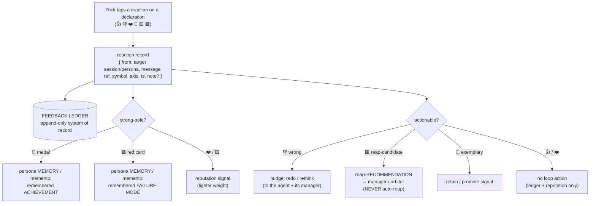

# Reaction Rubric & Consumption Design

**Status:** 🎨 **DESIGN (design-now, build-later — Rick-ruled 2026-06-10).** The UI build is deferred to after the multiplexer cutover (the JS notifications client is being deprecated this week); this captures the **surface-independent** design — the symbol *meanings* and, more importantly, what a reaction *does* — while the thinking is fresh.

**Author:** María 🌸 (PIP session `296b2cf3`, Workflow Steward) · **Date:** 2026-06-10
**Origin:** Rick (voice, 2026-06-10): UI controls to react to what managers/implementers say to him — 👍 👎 ❤️ 🏅 *plus* a negative axis for "fucking up / slacking / obstinate / unproductive" (the explicit *"opposite of a medal"*) — with a rubric defining exactly what each symbol means.
**Build target:** the **multiplexer** (NOT the dying JS notifications client). A "prediction-hint thumbs-vote" precedent already exists there to extend.

---

## 1. The core insight — a reaction is only worth building if something CONSUMES it

The emoji palette is the easy part. The design that matters is: **what does a reaction DO?** A symbol Rick taps that merely renders and disappears is decoration. A symbol that **feeds the agents' memory, the manager/arbiter loop, and a durable feedback ledger** is a control signal — it shapes future behavior. So this doc leads with consumption (§3) and treats the palette (§2) as the vocabulary that serves it.

---

## 2. The rubric — two axes, six symbols

Reactions split along **two independent axes**. Rick's four named symbols populate three of the four poles; the fourth pole (negative character) is the "opposite of a medal" he asked us to design.

### Axis 1 — CORRECTNESS (is the work/claim right?)
High-frequency, low-weight, per-declaration.

| Symbol | Meaning | One-line intent |
|--------|---------|-----------------|
| 👍 | **Acknowledged / correct / proceed** | "Right — carry on." |
| 👎 | **Wrong / reject / redo** | "Not right — fix or rethink this." |

### Axis 2 — CHARACTER & EFFORT (how is this agent performing as a teammate?)
Lower-frequency, higher-weight, shapes reputation + memory. The **football-card metaphor** governs the negative pole and maps cleanly onto the existing reap/escalation model.

| Symbol | Meaning | One-line intent |
|--------|---------|-----------------|
| 🏅 | **Exemplary — remember this** (peak positive) | "Outstanding — this is a keeper, bank it." |
| ❤️ | **Appreciated / good judgment / care** (warm positive) | "I value this — well-judged." |
| 🟨 | **Warning** (mild negative — slipping, sloppy, off-track) | "Caution — tighten up." |
| 🟥 | **Reap-candidate** (serious negative — obstinate / unproductive / repeatedly off) | "This isn't working — replace." |

**The "opposite of a medal" = the red card 🟥** — the sending-off, the reap-candidate signal. The yellow card 🟨 is the caution that precedes it. This deliberately reuses the fleet's existing reap/escalation vocabulary so a reaction isn't a new concept — it's a human-driven entry into a loop the arbiter and managers already run.

**Why two axes, not one scale:** correctness and character are orthogonal. A worker can be *correct* but *obstinate* (👍 + 🟨), or *wrong* but *trying hard and well-judged* (👎 + ❤️). Collapsing them to a single 👍…👎 scale loses exactly the signal Rick wants for "slacking despite getting it right" vs "earnest but mistaken."

---

## 3. Consumption — the three sinks a reaction feeds



### Sink 1 — the feedback ledger (system of record)
Every reaction is an append-only row: `{ reaction_id, ts, from, target: {session_id, persona, message/declaration ref}, symbol, axis, note? }`. This is the durable substrate the other two sinks derive from, and the raw material for **post-game analysis** ("Rick red-carded 3 of this persona's calls this week"). Lives commons-adjacent or in a dedicated store.

### Sink 2 — persona memory / mementos (the strong poles shape behavior)
The high-weight Axis-2 symbols write to durable persona memory:
- **🏅 medal → a remembered achievement** — folded into the persona's memory/memento so the behavior is reinforced and survives `/clear` + rehydration ("you were medaled for X — keep doing that").
- **🟥 red card → a remembered failure-mode** — likewise durable, so the pattern that earned the card is something the persona (or its successor on respawn) carries forward as a known anti-pattern.
- **❤️ / 🟨** feed a lighter reputation signal (no full memento — aggregate trend).

This is what makes the system *learn*: reactions aren't just logged, they bend the agents' future behavior through the memory layer.

### Sink 3 — the manager / arbiter loop (actionable reactions)
The loop-actionable symbols enter the control plane the fleet already runs:
- **👎** → a redo/rethink nudge to the agent and (if a worker) its owning manager.
- **🟥** → a **reap-RECOMMENDATION** routed to the owning manager / the arbiter's existing reap-recommendation path — **never an auto-reap.** This honors the arbiter redline (recommend, the human/manager decides) and ties directly into manager spawn/harvest authority (`workflow/manager-autonomy.md`: a non-responsive/unproductive worker is reaped + replaced).
- **🏅** → a retain/keep signal (the inverse — don't reap this one).
- **👍 / ❤️** → no loop action; ledger + reputation only.

---

## 4. Data model (sketch)

```json
{
  "reaction_id" : "rx-<uuid>",
  "ts"          : "2026-06-10T15:40:00Z",
  "from"        : "rick",
  "target"      : { "session_id": "<sid>", "persona": "tiberius",
                    "ref": "<message_or_declaration_id>" },
  "symbol"      : "medal",            // thumbs_up|thumbs_down|heart|medal|yellow|red
  "axis"        : "character",        // correctness|character
  "note"        : "the per-session-artifact call"   // optional free-text
}
```

Targets a **specific declaration/message**; persona-level reputation is *derived* by aggregating over a persona's records (not stored as a mutable per-persona counter — the ledger is the truth).

---

## 5. Open questions for the build phase (when the multiplexer cutover lands)

1. **Target granularity** — confirmed: a reaction targets a specific declaration; persona reputation is derived. (Any need for a deliberate persona-level reaction, distinct from a message reaction?)
2. **Decay** — do reputation signals decay over time? Recommendation: 🏅 medals + 🟥 red cards **persist** (they're memory); ❤️/🟨 trend signals **decay** (recency-weighted).
3. **Escalation** — do N yellow cards auto-escalate to a red? Recommendation: **no auto-escalation** — yellows inform manager judgment; a red is a deliberate Rick (or manager) act, consistent with "never auto-reap."
4. **Who may react** — start **Rick-only**. Natural extension: **managers may card their own workers** (a manager 🟥 = a reap they're authorized to make under manager-autonomy; a manager 🏅 = a retain/commendation). Design the ledger `from` field to support this from day one.
5. **Auto-reap?** — **No.** A 🟥 is always a *recommendation* into the manager/arbiter loop, never an automatic kill — same redline as the arbiter's auto-poke-then-reap-recommend.
6. **Surfacing back to the agent** — how/when does an agent learn it was carded? Via memory (durable) + optionally a commons note at reaction-time so the agent can course-correct mid-session.

---

## 6. Relationship to existing work

- **Multiplexer** — the build surface (deferred); extend the existing prediction-hint thumbs-vote control.
- **`workflow/manager-autonomy.md`** — the reap-candidate (🟥) consumption routes into manager reap authority; 🏅 = a retain signal.
- **Heartbeat Arbiter** — the reap-recommendation path (the arbiter already escalates reap-recommendations, never auto-reaps); a 🟥 is a human-originated entry into that same path.
- **Mementos / persona memory** — the durable sink for the strong poles (🏅 / 🟥); ties to `plan-memento` + the persona-consistency-across-`/clear` rule.
- **Post-game framework** — the feedback ledger is a rich post-game input (reaction distribution per persona/run).

---

*Version 1.0 (2026-06-10). Design-now-build-later per Rick's guided-walkthrough ruling; build deferred to post-multiplexer-cutover. Consumption-first by design — the rubric serves the three sinks, not the other way around.*
