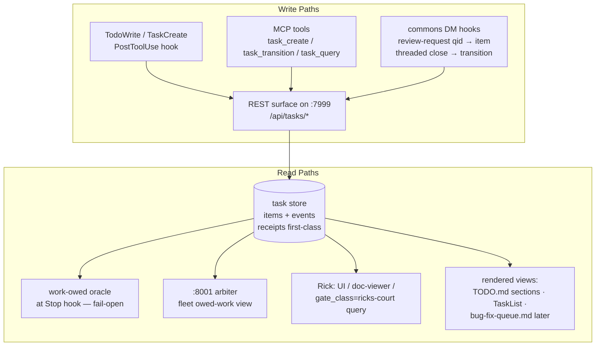

# Unified Task Store — Design

**Date**: 2026.06.11
**Author**: María 🌸 (Workflow Steward, PIP) — session `dbe21f66`, S108
**Status**: v0.3 — **DESIGN-RULED 2026-06-12**: Tiberius review APPROVE (qid `b41042a8`) + **all four forks RULED by Rick** (guided walkthrough, see §3.1) — ready for Lupin build (Phase 1, Tiberius crew, post-GCP-cutover)
**Workflow**: Pattern 2 (Research/Design) per p-is-p-01; tracked in history.md + TODO.md (P0 owed item, S108)
**Origin**: Rick directive 2026-06-11 (voice): *"What I really want is a centralized source of truth that the arbiter, myself, managers, and all workers are able to see... a mechanism that I can audit if needed, and that all involved can read and write from according to their roles."* Plus the live demonstration minutes later: María sat idle with this very design owed, and no ledger anywhere said so.

---

## 0. The Problem in One Sentence

Fleet to-do state lives on **8+ surfaces held consistent by discipline, not mechanism** (Tiberius, manager-seat inventory, 2026-06-11), and **no participant — not the arbiter, not a manager, not Rick — can deterministically query "what is owed, by whom, blocked on what."**

### 0.1 The 8+ surfaces today (audit, S108)

| # | Surface | Substrate | Queryable? | Ownership |
|---|---------|-----------|------------|-----------|
| 1 | `TODO.md` (per repo) | markdown | No — LLM/heuristic parse | none (shared file) |
| 2 | Harness TaskCreate/TaskList | in-memory, per session | per-session only; **evaporates at `/clear`**; invisible to peers | single session |
| 3 | `bug-fix-queue.md` v2.0 | markdown | semi (structured sections, no API) | ✅ Owner/By session tags — best model today |
| 4 | Commons DM threads (`dm-*` qids) | append-only topic files | file parse only | de-facto OWED-WORK ledger (unanswered qid = obligation) |
| 5 | `io/mementos/*.md` | markdown snapshots | no | drift from live board at every handoff |
| 6 | `src/rnd` implementation docs | markdown | no | phase tracking, sign-off trails |
| 7 | `history.md` | markdown | no | completion record (half the audit trail) |
| 8 | Implicit | held branches/worktrees, `:8000` run queue, "Rick's court" prose | no | none |

### 0.2 What breaks (manager-seat evidence, Tiberius 2026-06-11)

- **Dual-write drift** — TaskList ↔ TODO.md mirrored by hand; forget once = lost state.
- **No single owed-work query** — answering "what is owed, by whom, blocked on what" requires TODO.md + DM-board archaeology + worktree inspection.
- **Ownership/status are prose-and-emoji**, not fields.
- **Completions aren't joined to receipts** — commit hashes and test-run ids hand-copied into DM prose (no-confabulation rule has no mechanical support).
- **Memento-vs-board divergence** at every handoff.
- **Rick can't see the qid ledger at all.**
- **The meta-failure (2026-06-11, this session)**: an owed design produced zero `work_owed` signal anywhere — the steward idled, the user had to intervene by voice. The store must make that state impossible to misread.

---

## 1. Requirements

### 1.1 From Rick (R-series)

- **R1 — Single source of truth**: one store visible to arbiter + managers + workers + Rick.
- **R2 — Role-based read/write**: all participants read; writes scoped by role (own/assigned items).
- **R3 — Auditable**: Rick can inspect who did what, when, on whose authority, with what evidence.
- **R4 — Deterministically queryable**: a structured query (not an LLM reading markdown) answers owed-work questions, identically for every caller.

### 1.2 From the manager seat (T-series, Tiberius 2026-06-11 — endorsed)

- **T1 — Real fields**: `owner_persona`, `accountable_manager`, `status`, `blocked_by`, `gate_class` — so "Rick's court" is a QUERY, not a prose section.
- **T2 — Append-only per-item event trail**, linking qids, commit hashes, test-run ids, journal timestamps.
- **T3 — Receipts first-class**: a `completed` transition REQUIRES a receipt ref (mechanizes `feedback_no_confabulated_results`).
- **T4 — DM integration**: a review-request qid auto-creates/updates an owed item; a threaded close is a state transition.
- **T5 — Views, not parallel truths**: `TODO.md` and the harness TaskList become RENDERED VIEWS of the store.
- **T6 — Decisions as items**: `class=decision` carrying the framing payload (pros/cons/recommendation), feeding `/plan-decide`.
- **T7 — Oracle reads the SAME store**: the heartbeat work-owed oracle consumes store queries instead of inferring from scattered files.

### 1.3 Invariants carried over from ratified prior designs

- **I1 — Local poke stays `:7999`-free**: the Stop-hook self-poke must never DEPEND on the store being up (2026-06-03 heartbeat v1 ratification). Store-read at Stop is additive; on store-down the oracle falls back to current file-based inputs. Fail-open.
- **I2 — Arbiter never destructively actuates** (2026-06-09 redline) — the store gives it better eyes, not new hands.
- **I3 — Blocked items carry `next_chase_ts`** (Rick-ratified 2026-06-10, Item-1 fork 3) — no "pending X" graves; STALL ≠ QUIET.
- **I4 — Fail-open + flag-once on non-compliance** (Rick-ratified 2026-06-10, Item-1 fork 4) — a session not writing to the store is a practice bug, not a liveness signal.
- **I5 — Workflow defaults travel with the workflow** — the PIP-side practice lands in `workflow/`; only the service build is Lupin-side (`feedback_workflow_defaults_travel_with_workflow`).

---

## 2. Design Overview

A **small task-store service** on the existing Lupin infra: relational store + thin REST surface + MCP tool wrappers + hook-driven write paths. Everything markdown becomes a derived view.

### 2.1 Data model

**`items`** (one row per obligation):

| Field | Type | Notes |
|---|---|---|
| `id` | uuid | |
| `class` | enum | `task` \| `decision` \| `review_request` \| `bug` \| `gate` |
| `title`, `body` | text | `decision` items carry the framing payload (options, pros/cons, recommendation) in `body`/`payload` |
| `project` | text | repo scope (`lupin`, `planning-is-prompting`, …) |
| `owner_persona` | text | who does the work |
| `accountable_manager` | text | who answers for it (lineage-derived default) |
| `created_by` | text | persona + session id |
| `status` | enum | `queued` \| `claimed` \| `in_progress` \| `blocked` \| `review` \| `done` \| `dropped` |
| `created_ts`, `updated_ts` | timestamp | (Tiberius review F-extra — was implied, now explicit) |
| `blocked_by` | typed refs | list of `{kind: item\|persona\|user, id}` — TYPED, not a mixed string field (Tiberius review finding 3: untyped refs leak R4's determinism at exactly the field the oracle queries). `{kind:user}` ⇒ oracle treats as NOT-owed |
| `next_chase_ts` | timestamp | REQUIRED when `blocked` (I3) |
| `gate_class` | enum | `none` \| `manager` \| `ricks_court` — Rick's court becomes `SELECT … WHERE gate_class='ricks_court'` |
| `priority` | enum | P0–P3 |
| `source_qid` | text | DM question id that spawned it, if any (T4) |

**`events`** (append-only, per item — the audit trail, R3/T2):

| Field | Notes |
|---|---|
| `ts`, `item_id`, `actor` | persona + session id |
| `transition` | e.g. `queued→claimed`, `in_progress→done` |
| `receipt_refs` | JSON: `{commit, test_run, qid, doc_path, log_line}` — **non-empty REQUIRED for `→done`** (T3); the API rejects a bare completion |
| `authority` | `standing` \| `user_direct` \| `manager_relay` — joins the blast-radius model to the trail |

### 2.2 API surface (sketch)

- `POST /api/tasks` — create item
- `POST /api/tasks/{id}/transition` — state change; `→done` validates `receipt_refs`
- `GET /api/tasks?owner=…&status=…&gate_class=…&accountable_manager=…&project=…` — the deterministic query (R4)
- `GET /api/tasks/{id}/events` — the audit trail (R3)
- MCP wrappers (`task_create`, `task_transition`, `task_query`) so any session uses it as naturally as `notify()`; arbiter + hooks use REST directly.

**Role model (R2), enforcement-light to start**: every write stamps `actor` + `authority`; the API enforces only structural rules (receipts on done, chase-ts on blocked). Social/role rules (who may claim what) stay practice-layer in v1 — consistent with the commons trust model — with the trail making violations visible rather than impossible. Hard ACLs are a later phase if practice fails.

### 2.3 Integration: existing mechanisms become clients (not stopgaps)

| In-flight build | Today's plan | Under this design |
|---|---|---|
| Manager-TODO mirror hook (`PostToolUse(TodoWrite)` → `~/.claude/manager-todos/<sid>.md`) — Tiberius | private per-session file | **same hook, write path goes to the store** (file mirror optionally kept as offline fallback per I1) |
| Acked-inbound DM ledger (`.heartbeat-acked-<sid>.json`) — Clayton | private JSON ledger | **an event class**: ack = transition on the `review_request` item the qid auto-created (T4) |
| `stop.py` oracle wiring (Rachel-gated seam) | scrape TODO files + DM topics + manifests | **one store query** (`owner=me, status in (in_progress, queued), blocked_on≠user`), file-based fallback on store-down (I1) |

Sequencing note: **none of the three needs to halt.** The mirror hook and acked ledger are correct shapes; this design only redirects their write/read targets. Sync with Tiberius/Clayton/Rachel before concrete pours, not a stop-work order.

Other integrations: `TODO.md` "Pending/Resume Here" sections render from the store at session-end (human narrative stays hand-authored); `/plan-decide` reads `class=decision`; bug-fix-queue.md folds in as `class=bug` in a later phase (its Owner-tag model maps 1:1).

**T5 mechanism for the harness TaskList (Tiberius review finding 4)**: the harness list cannot be externally rendered INTO — so "TaskList as view" is a **session-START practice**, not a render: at session start the session queries the store (`owner=me, status≠done`) and seeds its TaskCreate list from the result; the `PostToolUse(TodoWrite)` hook closes the loop on the write side. This lands explicitly in the Phase-4 workflow docs (session-start.md integration).

---

## 3. Open Design Forks (for Rick — `/plan-decide` queue)

Per the decision-framing contract: recommendation first, pros/cons each. Self-ratified-and-logged items are NOT here (AFK rule) — only genuine user-level forks.

### F1 — Storage substrate
1. **SQLite on the Lupin host (Recommended)** — pros: zero new infra, single-writer fits the one-user fleet, trivially backed up (one file), Postgres-compatible-enough schema to upgrade later; cons: a ceiling if the fleet ever goes multi-host.
2. PostgreSQL now (Tiberius's instinct, largely conceded to SQLite-first on review) — pros: no later migration, richer concurrent writes, and **the "new service to operate" con is partly sunk cost — Lupin already operates Postgres** (lupin-postgres is in the arbiter's health-watch list); cons: still heavier than the v1 problem.
3. JSONL append-files (commons-style) — pros: matches existing substrate; cons: reinvents queries badly — fails R4, the core ask.

**Deployment-horizon rider (Tiberius review finding 1 — decide F1 WITH this in view)**: the **GCP cutover is Saturday (2026-06-14)**. If fleet + store ever straddle local/cloud hosts, single-file SQLite becomes the migration. SQLite-first + pg-compatible schema remains a sound v1 either way; Rick should rule F1 knowing the horizon, not in the abstract.

### F2 — Where the service lives
1. **Extend `:7999` (cosa-voice/lupin-rest) with `/api/tasks/*` (Recommended)** — pros: every session already reaches it via MCP, auth/persona plumbing exists, arbiter already proxies through it; cons: adds load to a box with known saturation history (FM-7/11/15/18). **⚠ Correction (Tiberius review finding 2, load-bearing)**: the `:7999` async-handlers/starvation fix is **FILED DEBT, UNSTAFFED — not in-flight** (v0.1 mis-stated this). Choosing F2-option-1 therefore carries a rider: **staff the async fix as a Phase-1 prerequisite**, or accept that the store inherits today's saturation risk (partially mitigated by I1's fail-open — the Stop-hook path never blocks on the store).
2. New standalone service (`:8002`) — pros: isolation from `:7999` load; cons: third daemon to deploy/systemd/monitor; another deploy gate.
3. Inside `:8001` arbiter — pros: co-locates with the main reader; cons: violates separation (arbiter = observer, store = shared infrastructure; I2 hygiene).

### F3 — Canonical-truth boundary vs TODO.md
1. **Store = canonical for LIVE work; TODO.md = durable human narrative, partially rendered (Recommended)** — pros: honors the ratified 2026-06-10 "TODO.md is never oracle input" ruling, keeps git history as the long-term record, lowest migration risk; cons: two artifacts persist (but now with a defined master).
2. Store replaces TODO.md entirely — pros: one truth, period; cons: loses the git-versioned, human-readable record Rick greps today; big-bang migration risk.

### F4 — Write-discipline scope at launch
1. **Managers-first writes, everyone reads (Recommended)** — pros: mirrors the ratified managers-first oracle scope, prove-then-widen, smallest blast radius; cons: worker items arrive only via manager/DM hooks initially.
2. All sessions write from day one — pros: complete picture immediately; cons: unproven practice × whole fleet; noisy first weeks.

*(Pre-staged in TODO.md ## Pending Decisions for the next walkthrough.)*

### 3.1 Ratified Rulings (Rick, guided walkthrough 2026-06-12)

| Fork | Ruling | Note |
|---|---|---|
| **F1** | **PostgreSQL now** (option 2 — against the SQLite-first rec) | Horizon-driven: lupin-postgres already operated (sunk cost) + Saturday GCP cutover makes single-file SQLite an immediate-migration risk. Skip the intermediate step. |
| **F2** | **Extend `:7999`** `/api/tasks/*` (per rec) | **Rider now BINDING: the `:7999` async-handlers debt is a staffed Phase-1 PREREQUISITE** (it is filed-debt/unstaffed at ruling time). |
| **F3** | **Store = canonical for live work; TODO.md = durable human narrative, partially rendered** (per rec) | Machines read only the store; rendered sections are derived; narrative prose stays human-owned. |
| **F4** | **Managers-first writes, everyone reads** (per rec) | **Rick's verbatim rider: "make sure this doesn't get lost after initial implementation"** — the widen-to-all-sessions follow-up is double-anchored in TODO.md (P1, extended 2026-06-12). |

---

## 4. Phased Build Plan

| Phase | Deliverable | Owner | Gate |
|---|---|---|---|
| 0 | This design doc → Tiberius review → Rick fork walkthrough (F1–F4) | María | Rick rules forks |
| 1 | Store + REST on chosen substrate + `task_query`/`task_create`/`task_transition` MCP tools; receipts-on-done enforced; **prerequisite rider if F2=:7999: staff the async-handlers debt** | Tiberius crew (Lupin) — **accepted on review, post-Saturday-GCP-cutover capacity permitting** | green+reviewed |
| 2 | Write paths: TodoWrite hook redirect + DM review-request auto-create + acked-ledger-as-events (Clayton's lane folds in) | Tiberius crew + Clayton | green+reviewed |
| 3 | Read paths: oracle store-query (Rachel's seam, fail-open per I1) + arbiter fleet owed-work view | Rachel-gated seam + Lupin | Rick (`:8001` deploy gate stands) |
| 4 | Views: TODO.md section render at session-end + `/plan-decide` reads `class=decision` + Rick-facing query UI (post-multiplexer-cutover) | María (PIP workflow docs) + Lupin (UI) | normal |

PIP-side practice docs (Phase 2–4 companions, María): `workflow/` additions for task-store discipline, session-start/-end integration, manager charter updates — per I5, defaults live in `workflow/`, never in a consuming repo's config.

---

## 5. Risks & Anti-Patterns Guarded

- **Parallel-truth regression** — every markdown surface must be demoted to a view or explicitly labeled narrative; never "also update the store."
- **`:7999` saturation** (F2 fork) — store lands with/after the async-handlers fix; the Stop-hook path never blocks on it (I1).
- **Receipt theater** — receipts must be refs the reviewer can open (commit hash, test-run id, qid), not prose claims; API validates shape.
- **Discipline collapse** — the whole point of the hook-driven write path is that the practice costs a manager nothing beyond the TodoWrite they already owe.

---

## Version History

- **v0.1 (2026.06.11, María)** — initial draft from the S108 audit + Tiberius manager-seat inventory; forks F1–F4 queued for Rick; sent to Tiberius for first review.
- **v0.2 (2026.06.11, María)** — Tiberius first review **APPROVE** (qid `b41042a8`), 4 findings folded: (1) F1 deployment-horizon rider (Postgres partly sunk cost; Saturday GCP cutover in view); (2) **load-bearing correction** — `:7999` async-handlers fix is filed-debt/unstaffed, NOT in-flight → F2 mitigation re-written as an explicit Phase-1 prerequisite rider; (3) `blocked_by` → typed refs `{kind, id}`; (4) T5 TaskList-as-view = session-START seed practice, stated mechanism + Phase-4 docs target. Plus `created_ts`/`updated_ts` made explicit. Tiberius's praise-notes for the record: `authority` field exceeds T-spec; receipts-on-done = the mechanical no-confabulation enforcement requested. Phase-1 crew ownership accepted (post-cutover capacity permitting). Ready for Rick's F1–F4 walkthrough.
