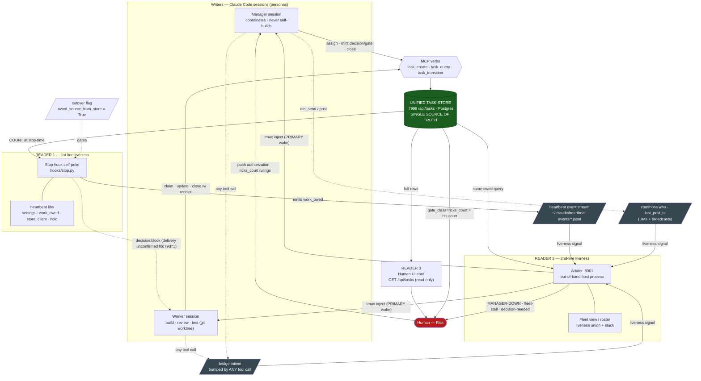
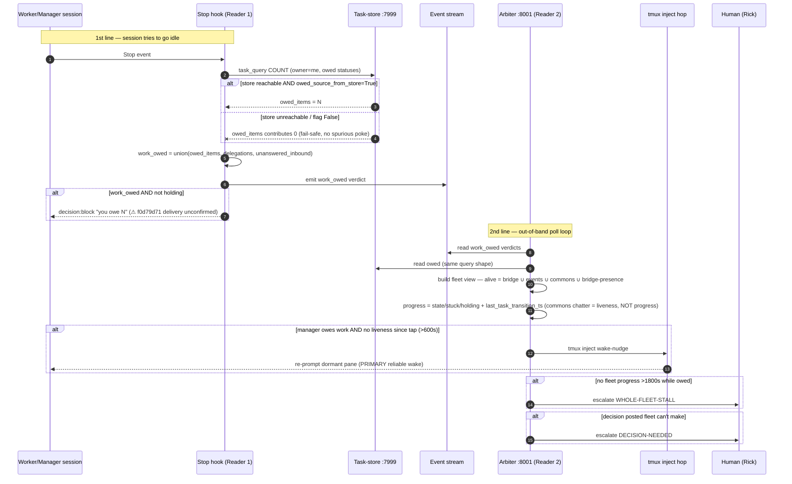
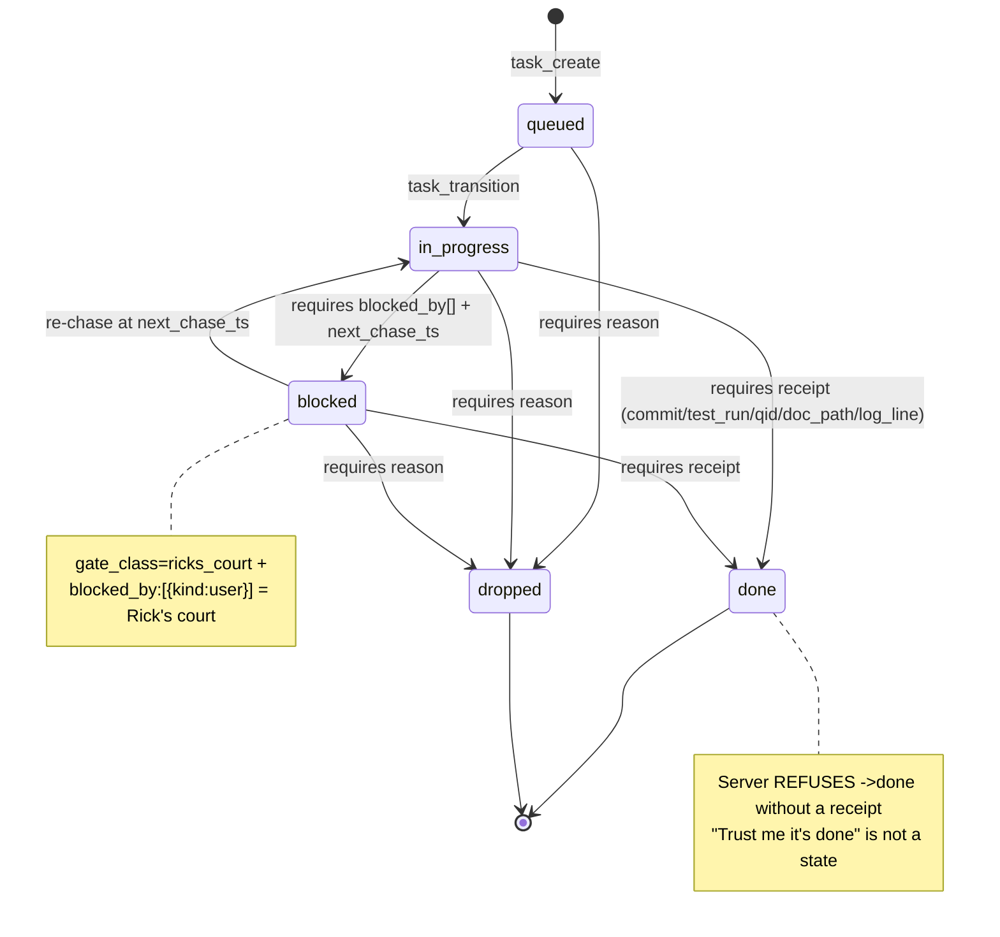
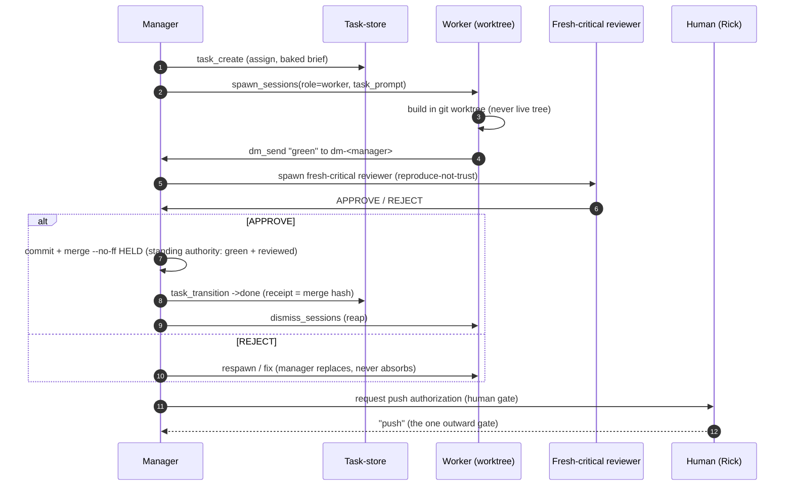

# Diagram Spec — Arbiter + Heartbeat Self-Poke + Unified Task-Store

**Date**: 2026-06-17 · **Author**: María 🌸 · **Audience**: anyone modeling the fleet-liveness system (technical)
**Purpose**: a **technically-accurate** entity/relationship spec + ready-to-render Mermaid diagrams for the latest (post-store-cutover) iteration of the system described in the PM explainer *How the Fleet Ships*.
**Grounded in** (primary sources, not memory):
- Lupin `src/docs/fleet-liveness-and-task-store-architecture.md` (canonical architecture, 2026-06-17)
- Lupin `src/cosa/agents/heartbeat_arbiter/arbiter_job.py` (detector logic, wake hops)
- Lupin `src/lupin_cli/claude_code/hooks/{stop.py, pre_tool_use.py, lib/*}` (self-poke + bridge-mtime)
- PIP `src/rnd/executive-briefings/2026.06.17-how-the-fleet-ships-pm-explainer.md` (operating-model narrative)

> **One sentence**: **One** durable task-store (`:7999 /api/tasks`) is written by a fleet of manager/worker sessions and read by **three** consumers — the Stop-hook self-poke (1st-line liveness), the out-of-band `:8001` arbiter (2nd-line liveness), and a human UI card — with the human (Rick) holding the push + decision gates.

---

## 1. Entity catalog (every node, with type + code anchor)

| # | Entity | Type | Role | Code anchor |
|---|---|---|---|---|
| E1 | **Unified Task-Store** | Datastore | Single source of truth for ALL owed work | `:7999 /api/tasks`, `routers/tasks.py` → `task_repository.py` (Postgres) |
| E2 | **Manager session** | Actor (CC) | Coordinates; never self-builds; assigns + chases + closes | `spawn_sessions` role=manager |
| E3 | **Worker session** | Actor (CC) | Builds / reviews / tests in a git worktree | `spawn_sessions` role=worker |
| E4 | **MCP store verbs** | Interface | `task_create` · `task_query` · `task_transition` | cosa-voice server |
| E5 | **Stop hook (self-poke)** | Reader 1 | On Stop-while-owed, re-nudges the session ("you owe N") | `hooks/stop.py` `_run_heartbeat` |
| E6 | **Heartbeat libs** | Component | settings · work_owed eval · store client · hold record | `hooks/lib/{heartbeat_settings,heartbeat_work_owed,task_store_client,heartbeat_hold}.py` |
| E7 | **Arbiter** | Reader 2 | Out-of-band fleet watcher; pokes / escalates | `:8001` `lupin_arbiter_app/` + `heartbeat_arbiter/arbiter_job.py` |
| E8 | **Fleet view / roster** | Component | Per-session liveness union + stuck detection | `heartbeat_arbiter/fleet_data_model.py` `build_fleet_view` |
| E9 | **Human UI card** | Reader 3 | Read-only task-list card; Rick tracks his court + fleet | multiplexer/cosa-voice, `GET /api/tasks` |
| E10 | **Human (Rick)** | Actor | Holds push + `ricks_court` decision gates; receives escalations | — |
| E11 | **Bridge file (mtime)** | Signal | Liveness clock; bumped by *every* tool call | `pre_tool_use.py:51` `touch_bridge_mtime()` |
| E12 | **Heartbeat event stream** | Signal | `work_owed` verdict the Stop hook emits | `~/.claude/heartbeat-events/*.jsonl` |
| E13 | **Commons / `who`** | Signal + channel | `last_post_ts` presence; DM + broadcast board | `commons_store.py:333` `who()`, scans all topics incl. `dm-*` |
| E14 | **tmux inject hop** | Wake actuator | Reliable external wake of a dormant session pane | arbiter `_tmux_push_fn` / `cc_notification_listener._inject_via_tmux` |
| E15 | **Cutover flag** | Config | `owed_source_from_store` — store-count vs transcript | `~/.claude/settings.json` `heartbeat.owed_source_from_store=True` |

---

## 2. Relationship catalog (labeled edges — the "all entities" map)

| From | → | To | Label / semantics |
|---|---|---|---|
| E2 Manager | writes | E1 Store | assigns work, mints `decision`/`gate`, closes rows (`task_create`/`task_transition` via E4) |
| E3 Worker | writes | E1 Store | claims, updates status, closes own stub with receipt |
| E1 Store | read by | E5 Stop hook | `task_query` **COUNT** at stop-time (cheap; `count_only=true`) |
| E1 Store | read by | E7 Arbiter | same owed query shape (via E12 emitted `work_owed`) — single-source guarantee |
| E1 Store | read by | E9 UI card | `GET /api/tasks` full rows (read-only) |
| E15 Flag | gates | E5 Stop hook | `True` → owed COUNT from store; `False` → transcript replay (degraded fallback) |
| E5 Stop hook | emits | E12 Event stream | `work_owed` verdict per stop evaluation |
| E5 Stop hook | re-pokes | E2/E3 Session | `decision:block` "you owe N" (⚠ delivery unconfirmed — bug `f0d79d71`) |
| E3/E2 Session | bumps | E11 Bridge mtime | any tool call (incl. MCP `dm_send`) refreshes liveness clock |
| E2/E3 Session | posts | E13 Commons | DM (`dm_send`) / broadcast → `last_post_ts` |
| E7 Arbiter | consumes | E11+E12+E13 | liveness union: alive if **ANY** of bridge-mtime ∪ event-stream ∪ commons ∪ live-bridge is fresh |
| E7 Arbiter | builds | E8 Fleet view | per-session state + stuck flag + progress signature |
| E7 Arbiter | wakes | E14 tmux hop | injects nudge into dormant session (PRIMARY reliable wake) |
| E7 Arbiter | escalates | E10 Human | advisories + MANAGER-DOWN / fleet-stall / decision-needed via `live_notify` |
| E10 Human | gates | E2 Manager | push authorization + `ricks_court` rulings |
| E1 Store | surfaces to | E10 Human | `gate_class=ricks_court` items = Rick's court |

---

## 3. Diagram A — System topology (master flowchart)

---

## 4. Diagram B — Liveness loop (sequence: self-poke + arbiter)

---

## 5. Diagram C — Task-item lifecycle (state, with server-enforced gates)

---

## 6. Diagram D — Manager/worker build loop (sequence)

---

## 7. Accuracy notes & known-gap callouts (for diagram fidelity)

These are **deliberately drawn** above so the diagram is honest, not idealized:

1. **Self-poke delivery is unconfirmed** (bug `f0d79d71`): the Stop-hook `decision:block` is *emitted + logged* but not confirmed to force a continuation turn. The **reliable** wake is the arbiter's tmux inject (Diagram A + B). Drawn as a dotted edge.
2. **Liveness ≠ progress** (the load-bearing guard, `arbiter_job.py:1911`, attributed to María): a session can be *alive* (bridge/commons fresh) yet make *no progress*. Commons chatter — **including DMs** — counts as **liveness only**, never progress. Progress = semantic signature + `last_task_transition_ts`. This is why a chatty-but-stuck fleet still stalls. *(The pending DM-as-liveness toggle would make DM activity a first-class, configurable liveness input — it does not change the progress rule.)*
3. **Arbiter over-warns** (follow-up `332af094`): tap-ACK (600s) and whole-fleet-stall (1800s) are **not yet** done-aware / blocked-on-user-aware → a finished or legitimately Rick-gated manager can trip a false MANAGER-DOWN. Mitigation modeled in Diagram C: represent user-gated work as `gate_class=ricks_court` + `blocked_by:[{kind:user}]`.
4. **Single-source guarantee**: Readers 1 & 2 consume the **same** owed query shape, so the poke and the arbiter cannot diverge once `owed_source_from_store=True` (bug `82e4eaf0` — two sources of truth — eliminated by construction).
5. **Fail-safe**: store unreachable → owed COUNT contributes 0 (no spurious poke); the local signals (delegations, unanswered inbound) keep poking during a `:7999` outage.
6. **The mirror is retired** (post-cutover): the old `post_tool_use.py` harness→store auto-mirror is a logged no-op pending deletion — intentionally NOT drawn as a live edge.

---

*Companion: PM-level narrative in `src/rnd/executive-briefings/2026.06.17-how-the-fleet-ships-pm-explainer.md`; full architecture in lupin `src/docs/fleet-liveness-and-task-store-architecture.md`.*
