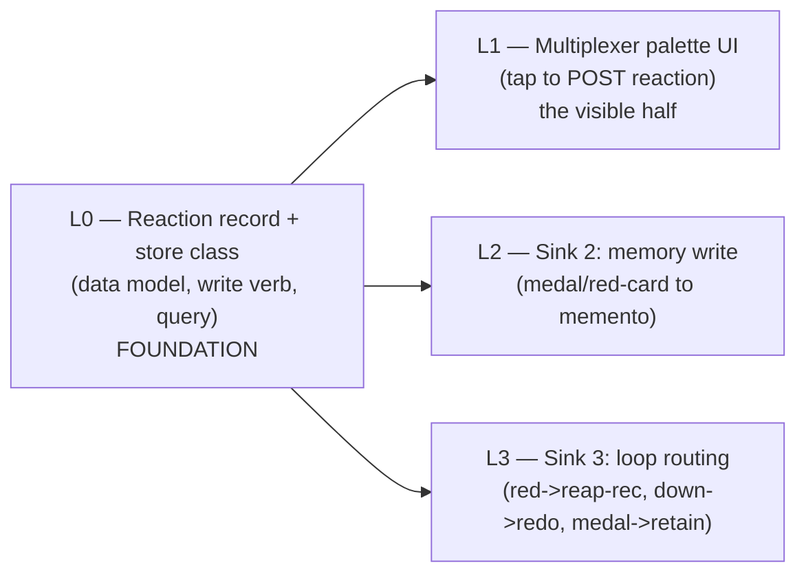

# Reaction Feedback — Implementation-Prep & Walkthrough Plan

**Status**: 🛠️ **BUILD-PREP — NOT APPROVED TO BUILD.** Preparation only, per Rick's 2026-06-17 instruction: *resurrect the plan and prepare for implementation, but do not implement until I've reviewed the plan and we've walked through it.* **Hard gate: zero code until Rick's go after the walkthrough.**
**Author**: María 🌸 · **Date**: 2026-06-17 · **Owner task**: `25d62321`
**Design of record (unchanged source of truth)**: `src/rnd/2026.06.10-reaction-rubric-and-consumption-design.md` (v1.1) — two axes / six symbols (👍👎 ❤️🏅🟨🟥) / three consumption sinks.

> **Purpose**: turn the existing rubric design into a *buildable* plan — surfaces, work breakdown, sequencing, acceptance — and surface the decisions we need to walk through. This doc adds the *how/where/when to build*; it does not change the *what/why* (that's the design doc).

---

## 1. What changed since the design (2026-06-10) — why "resurrect" now

The design deferred the build to "after the multiplexer cutover" and said the feedback ledger would live "commons-adjacent or in a dedicated store." **Two things shipped since that make the build materially more tractable:**

1. **The unified task-store is LIVE** (cutover 2026-06-17, empirically proven this session). It is exactly the "dedicated store" Sink 1 needed — a Postgres-backed, append-only-with-receipts, query-able system of record with typed items and an event trail. **A reaction is a natural new record class in it.**
2. **The arbiter reads the store** and already runs a reap-recommendation path. Sink 3 (🟥 → reap-recommendation; 🏅 → retain) now has a live consumer to route into, rather than a hypothetical one.

So the resurrection isn't a re-design — it's mapping the three sinks onto infrastructure that now exists. The rubric (symbols, axes, meanings) stands as-is.

## 2. Surface map — where each piece is built

| Design element | Build surface | Notes |
|---|---|---|
| **Palette / UI control** (Rick taps 👍👎❤️🏅🟨🟥 on a declaration) | **Multiplexer UI** (extend the existing prediction-hint thumbs-vote control) | ⚠️ **Precondition to confirm at walkthrough**: is the multiplexer the live surface now, or do we target the in-service notifications client? (The design assumed JS-client deprecation.) |
| **Sink 1 — feedback ledger** | **Unified task-store** — new `item_class="reaction"` (or a sibling `reactions` table) | Append-only + receipts already enforced; `task_query` gives per-persona aggregation for free. |
| **Sink 2 — persona memory** | **Memento / persona-memory layer** (`plan-memento`, auto-memory) | 🏅 → remembered achievement; 🟥 → remembered failure-mode; survives `/clear`. |
| **Sink 3 — manager/arbiter loop** | **Arbiter + manager-autonomy** | 🟥 → reap-RECOMMENDATION (never auto-reap); 🏅 → retain; 👎 → redo nudge. |

## 3. Proposed build lanes (sequence; each its own worktree + review gate)

- **L0 (foundation, first)**: the reaction record in the store + a create/query path. Everything else consumes this. Build + test (the store has a real-Postgres test harness now — reuse it).
- **L1 (the visible half)**: the multiplexer palette → POST a reaction. Gated on the surface-confirmation precondition.
- **L2 / L3 (the consumption that gives it meaning)**: memory write + loop routing. These are what make it more than decoration (design §1).
- Standard loop each lane: worktree → 100% L/B/F → fresh-critical review → merge `--no-ff` HELD → push is Rick's.

## 4. Decisions to walk through (walkthrough-ready, with recommendations)

These are the forks I'd want your ruling on before L0 starts. Most were flagged in the design §5; recommendations carried forward.

| # | Decision | Options | Recommendation |
|---|---|---|---|
| D0 | **Build surface** | (a) multiplexer · (b) in-service notifications client · (c) both | **(a) multiplexer** *if* it's live; confirm its status first — this gates L1. |
| D1 | **Ledger home** | (a) new `item_class="reaction"` in the task-store · (b) sibling `reactions` table · (c) commons topic | **(a)** — reuse the store's receipts/query/event-trail; least new infra. |
| D2 | **Who may react** | (a) Rick-only to start · (b) Rick + managers-card-their-workers from day one | **(a) Rick-only**, but design the `from` field to support (b) later (design §5.4). |
| D3 | **Decay** | (a) all persist · (b) medals/red-cards persist, heart/yellow decay | **(b)** — strong poles are memory; light poles are recency-weighted trend (design §5.2). |
| D4 | **Yellow→red auto-escalation** | (a) N yellows auto-escalate · (b) no auto-escalation | **(b) no** — yellows inform judgment; a red is deliberate (consistent with never-auto-reap). |
| D5 | **Agent learns it was carded** | (a) memory only · (b) memory + commons note at reaction-time | **(b)** — durable memory + a mid-session course-correct signal (design §5.6). |
| D6 | **Auto-reap on red card** | (a) never (recommendation only) · (b) auto-reap | **(a) never** — hard redline; a red card is a recommendation into the existing loop. |

## 5. Acceptance criteria (for the eventual build — not now)

- [ ] L0: a reaction record persists in the store with receipts; per-persona aggregation queryable; targets a specific declaration (persona reputation is *derived*, not a mutable counter — design §4).
- [ ] L1: Rick can tap all six symbols on a declaration in the live surface; the tap writes a reaction.
- [ ] L2: medal/red-card write a durable memento entry that survives `/clear`.
- [ ] L3: a red card produces a reap-*recommendation* (never an auto-reap); 👎 a redo nudge; a medal a retain signal.
- [ ] No regression to the arbiter reap path; the redline (recommend, human/manager decides) holds.

## 6. The gate (explicit)

**This document is the preparation. No lane starts until:** (1) Rick reviews this plan, (2) we walk through §4's decisions, (3) Rick gives the go. Then I (or the appropriate manager) create the L0 build task and spawn. Until then: **prep only, build held.**
