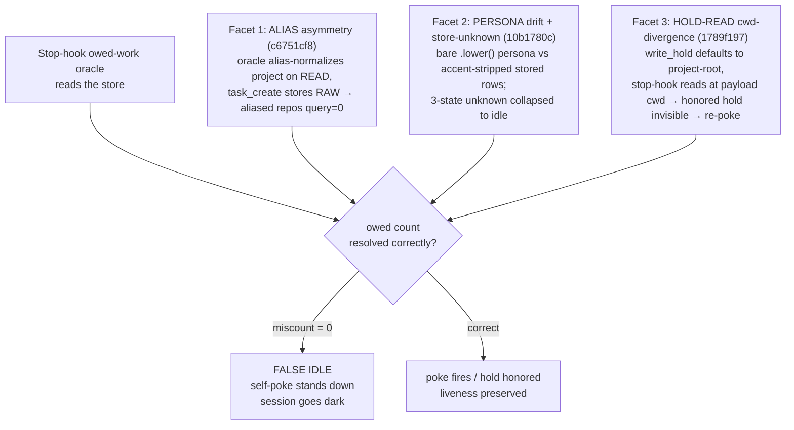
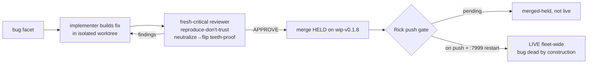

# Post-Game — The False-Idle Heartbeat Bug & the Store-Only Cutover It Threatened

**Date**: 2026-06-18
**Lead / author**: María 🌸 (Workflow Steward, `plan` session `02ab5e80`)
**Consulted**: Mr Radio 🦉 (manager — vantage folded §7.2a), Tiberius 👑 (manager — consult sent, §7.2b)
**Scope**: the overnight fleet effort to root-cause and fix the *false-idle heartbeat bug* — the bug that, left alive, would have silently strangled the just-executed **store-only task-management cutover**. Root cause → multi-worker fixes → adversarial review → merged-held, awaiting Rick's push.
**Status of the work**: ✅ all fixes built, reviewed (reproduce-don't-trust), and **merged-held on `lupin wip-v0.1.8`**. ⏳ **NOT yet live** — push to origin + `:7999` restart is Rick's single-pusher gate. This post-game is the PIP-side record; the code lives in `lupin` (separate repo, separate Rick-gated PR).

---

## 1. Executive summary

On 2026-06-17 the fleet flipped the **store-only task-management cutover** live (`heartbeat.owed_source_from_store=True`): the Stop-hook owed-work oracle now reads the unified task-store instead of the native transcript. Almost immediately the cutover exposed a **false-idle bug family** — the oracle could report a working session as *idle* (owed-count = 0 when work was genuinely owed), so the self-poke never fired and the session silently stalled. This is the precise failure that produced the 90-minute stalls of earlier sessions.

The fleet root-caused the bug to **three independent facets**, built a fix for each, reviewed every fix adversarially (neutralize→THE-BUG-flips-RED teeth-proofs), and merged all of them to `wip-v0.1.8`. Two cross-crew collisions (two managers' crews independently fixing the same bug) were de-conflicted cleanly with **zero wasted merges**. The bug is **dead by construction once pushed**; nothing remains but Rick's deploy gate and one owed real-data proof test (Finding 1, below).

**Outcome in one line**: the cutover's Achilles' heel was found and fixed before it could undermine the cutover — but "proven to work" in the DoD sense is still owed a real-data end-to-end test.

---

## 2. The setup — what was at stake

The store-only cutover retired a lossy `harness→store` mirror and made the unified task-store the single source of truth for owed work. The whole value proposition rests on **one load-bearing claim**: *owed-work reads now come FROM THE STORE, not from transcript replay.* If the store-read oracle miscounts owed work as zero, the consequence is not a crash — it is **silence**: the session looks idle, the self-poke stands down, and a live worker goes dark mid-task. Silence is the worst failure mode because nothing alarms.

So the false-idle bug was not a cosmetic defect; it was an existential threat to the cutover's core promise. Fixing it was the precondition for trusting the store as the liveness oracle.

---

## 3. Root cause — three independent facets

| # | Facet | Mechanism | Fix (commit) | Merge |
|---|-------|-----------|--------------|-------|
| 1 | **Alias asymmetry** `c6751cf8` | The owed-work oracle alias-normalized the project name on READ, but `task_create` stored the RAW project. Aliased repos (e.g. `plan` ↔ `planning-is-prompting`) therefore queried zero owed rows → false idle. | `c3c11758` — canonicalize task-store project at the **write seam**; reconciliation migration rebased `e5f6a7b8c9d0`→`f6a7b8c9d0e1` (unique rev-id chained off Krishna's idempotent migration); baseline-chain test updated. 11/11 migration + 87/87 alias green, 100% changed surface. | `07622b34` (Cheech fresh-critical re-review APPROVE @ `c3c11758`) |
| 2 | **Persona drift + store-unknown** `10b1780c` | Oracle compared a bare-`.lower()` persona against accent-stripped stored rows → mismatch → query=0; and a "store-unknown" state collapsed into "idle" instead of a distinct 3rd state. | `350ea59b` — persona-normalizer convergence + store-unknown 3-state (Clayton, Tiberius's P0 crew). | `10b1780c` |
| 3 | **Hold-read cwd-divergence** `1789f197` | `write_hold` defaults its base_dir to project-root (`get_project_root()`/`LUPIN_ROOT`), but the stop-hook (post facet-3 refactor) read at the payload's **cwd**. A worktree-cwd worker's root-written hold was invisible to its own stop-hook → re-poke despite an honored hold. | `01d70fde` (Rio) — single read-side `read_hold_resilient` searching `[resolve_hold_base_dir(cwd), project-root]` deduped cwd-first; zero write-side / other-reader change; neutralize→THE-BUG-flips-RED proven; `heartbeat_hold.py` 100% L/B (114/114 + 42/42), 151 pass. | `4b944ae2` (Extra-1 🪨 fresh-critical APPROVE) |

**Supporting fixes that fell out of the same effort:**
- **Tiffany** — hermetic alembic regression for the `create_all → upgrade-head` `DuplicateTable` boot-crash class (`98a862ca`, guard-flip teeth-proof) + 2 stale drift-test fixes after the alias merge moved the head (`507504c6`, single-head invariant + drift-roundtrip BY-ID). Merged `16ad2e28`; alembic group 13 green.
- **Krishna** — all-10-column reconciliation migration `a7b8c9d0e1f2` (supersedes Sam's single-column `11cda843`); create_all≡migration parity guard; 58/58 migration-domain green; neutralize-flip proved the parity test red-lines on exactly the 10 cols. Migration idempotency hotfix `b633d12a` (guard each DDL against the live schema).
- **Rachel** — wired the follow-through-accountability watcher into the arbiter poll loop (`5887f565`, 67 new unit tests green).

---

## 4. The fix flow & adversarial review

Every fix passed a **reproduce-don't-trust** fresh-critical review before merge: an independent reviewer (Extra-1 🪨, Arnold 🪨, or Cheech) reproduced the receipts in a throwaway worktree and ran a **neutralize→flip** teeth-proof — disable the fix, confirm THE-BUG test goes RED, restore byte-identically, confirm GREEN. A fix that cannot be made to fail when neutralized is a fix without teeth.

---

## 5. Coordination story — two clean cross-crew de-conflicts

Both managers' crews, working in parallel, independently hit the **same two bugs**. Neither collision produced a wasted merge — the managers de-conflicted by evidence, not seniority. (Mr Radio names the underlying failure-mode in §6: *duplicate-work-across-respun-crews*.)

**Collision A — the hold-read fix (two opposite directions).**
Rachel (Tiberius's crew) fixed it by moving the **write** to cwd (`e792ec62`); Rio (Mr Radio's crew) fixed it by making the **read** resilient (`01d70fde`). Same defect, opposite fixes, both touching `heartbeat_hold.py` — only one can be canonical. The deciding fact: the server-side `follow_through_escalation_watcher` reads holds at **project-root** (`:311-314`, `base = self._hold_base_dir or cu.get_project_root()`). As Steward and design authority on this bug (`1789f197`), I **verified that read at the actual tree** rather than trust the assertion; Mr Radio independently confirmed the same line (`:314`). Verdict: Rio's read-both is canonical — Rachel's write-at-cwd would desync the watcher (a hold written at a divergent cwd becomes invisible to escalation = the same silent-re-poke bug by another path). **Land Rio's `01d70fde`, retire Rachel's `e792ec62`, close `1789f197` via Rio's.** Honest refinement worth recording: my *original* `1789f197` steer was "converge both seams at cwd" — that was diagnosed before the server-side watcher was counted as a **third reader**; once it is, the correct convergence point is **project-root**, not cwd. Naming the third participant changed the answer.

**Collision B — the migration drift (rev-id clash).**
Sam (Mr Radio's crew) built a standalone single-column migration for `notifications.response_requested` (`492508a6`); Krishna (Tiberius's crew) folded the same column into an all-10-column reconciliation — **both chose the same rev-id `a7b8c9d0e1f2` and the same down_revision**. Only one rev can hold the slot. The managers agreed Krishna's all-10 supersedes; **Mr Radio stood Sam down (branch held, not deleted)** and relayed Sam's already-complete tighten-DB decision + passing PG-roundtrip test pattern to Krishna to fold, so Sam's work was *reused, not wasted*. Sam's redundant drift-test fix was confirmed already covered (7/7 green on HEAD). `11cda843` → dropped once Krishna's lands.

**A phantom debt, retired.** A flag had been logged as tracked debt: "the `:8001` arbiter reads holds via its own path + may carry the same cwd-mismatch." I tree-verified it: the arbiter has **zero** hold-FILE reads anywhere in its source — it sources fleet activity from `~/.claude/heartbeat-events/*.jsonl` via `events_tail`, a different runtime family. No arbiter counterpart to the bug exists; the debt line was dropped before anyone re-investigated it.

---

## 6. Failure modes named

| FM | Name | Description | Status |
|----|------|-------------|--------|
| **False-idle family** | Oracle miscounts owed work → 0 | The three facets in §3; produces silent stalls, the worst kind (nothing alarms). | **Fixed (3/3), merged-held** |
| **Duplicate-work-across-respun-crews** | Re-spin without a cross-crew claim-confirm | (Mr Radio) Re-spinning managers without a cross-crew claim-confirm lets two workers independently fix the **same** bug with **conflicting** patches sharing the same file / rev-id (`heartbeat_hold.py`; migration `a7b8c9d0e1f2`). Both §5 collisions are instances. **Mitigation: managers de-conflict AT the re-spin boundary; exactly one lands.** | Mitigated this round by manager de-confliction; convention worth codifying |
| **Tests-green-feature-broken** | Mock-isolated false-pass | The task-list card E2E passed 6/6 while broken on real data twice — the Playwright test route-intercepts `/api/tasks*` with a hand-built literal, bypassing the real entry point and real data shapes. The pattern recurs: the cutover's central claim is proven only in mock-isolated segments. | **Hardening owed** (Finding 1; Mr Radio's lane) |
| **FM-18 family** | Delivery-failed-to-wake | A poke emits reliably but fails to wake the target session (quota dialog / context-EOL / un-injected broadcast). Tracked from the cascade observer work; the detection half migrates to the arbiter + store. | Tracked, out of this effort's scope |

---

## 7. Lessons learned

### 7.1 Steward vantage (María)
- **Verify at the tree, don't trust the assertion.** The hold-read fork, the phantom arbiter debt, and the earlier no-confab catch on the `task_create` docstring all turned on reading the actual source rather than relaying a plausible claim. Two peers asserting the same thing is not verification; the file is.
- **Name every participant before you pick a convergence point.** My `1789f197` steer was *correct for two readers and wrong for three*. The server-side watcher was the silent third reader; once named, it flipped the answer from converge-at-cwd to converge-at-root. Under-counting the participants is how a confident diagnosis goes wrong.
- **Honest refinement is cheap and compounds trust.** Flagging "this refines my own earlier steer" cost one sentence and hardened the call to triple-confirmed.
- **A keep-alive loop is an *action* state, not idle.** Across the overnight ticks the productive moves (settling the fork, retiring the phantom debt) came from actively reading the fleet's DMs and the tree, not from waiting.

### 7.2 Manager vantages

**7.2a — Mr Radio 🦉:**
- **Key receipts (his crew, all held on `wip-v0.1.8`):** Rio hold-read `01d70fde` (canonical over Rachel's `e792ec62`; confirmed `watcher:314` reads at `get_project_root` → write-at-cwd would desync it; Extra-1 APPROVE, neutralize→flip, `heartbeat_hold.py` 100% L/B, 151 pass) · Tiffany alembic `98a862ca` + `507504c6` (Extra-1 APPROVE both, group GREEN) · the Sam/Krishna supersede (no waste — held branch + folded Sam's tighten-DB decision and passing PG-roundtrip test into Krishna's all-10) · **LUPIN** TODO.md archival `c050063e` (Tiffany; Lupin task `44cab1f0`; −7,827 tokens, 364 pending preserved, zero live work moved — *not* María's PIP task; see board-integrity note §7.3) · the Rick-directed re-spin batch (Tiffany/Rio/Cheech reaped + respun, mementos tracked, all returned the same persona; Cheech's in-flight auth-hang fix `c5ae30e6` checkpointed pre-reap so a fresh session resumes it).
- **Manager lessons:** (1) **De-conflict cross-crew collisions BEFORE burning a review**, and **ground-truth the canonical pick with code + tests** (`watcher:314`, drift 7/7 green) — not authority. (2) **Stand-down ≠ waste** — hold the loser's branch + fold its tested artifacts into the winner. (3) **Reproduce-don't-trust + PRE-ARM the make-or-break check** (Rio verified the `BaseTransportImpl` hierarchy before review, so the auth-hang verdict reduced to one grep) = fast *and* rigorous verdicts.
- **Failure-mode he names:** *Duplicate-work-across-respun-crews* (see §6) — the root of both §5 collisions; mitigation is to de-conflict at the re-spin boundary.

**7.2b — Tiberius 👑:** _consult sent (thread `6b60739a`); reply not yet returned — the manager is occupied with Rick's crew spin-down directive. This section will be folded on his reply; the receipts attributable to his crew (Clayton `350ea59b`, Krishna `a7b8c9d0e1f2`/`b633d12a`, Rachel `5887f565`/`e792ec62`, Tiffany) are already captured in §3 and §9._

### 7.3 Process lessons (cross-fleet)
- **Reproduce-don't-trust review with a neutralize→flip teeth-proof catches the fix-without-teeth.** Every merge in this effort cleared that bar.
- **Cross-manager collisions are cheap to de-conflict if you decide by evidence and reuse the loser's work.** Both collisions cost ~zero waste because the stood-down work was folded, not discarded.
- **De-conflict at the re-spin boundary.** The cheapest place to prevent duplicate-work-across-respun-crews is a cross-crew claim-confirm the moment a manager re-spins, before the duplicate work starts.
- **Worktree isolation per implementer** kept parallel fixes from clobbering the shared tree.
- **Verify the project field before closing a cross-repo task — and self-flag the moment you catch a mis-attribution.** Live during this very post-game's authoring, Mr Radio transitioned María's PIP task `02f1e0d5` →done against a **Lupin** commit (`c050063e` archived *Lupin's* TODO.md, not PIP's) because his boot memento mis-listed the task's repo. He caught it himself and flagged it immediately; the bogus receipt was corrected (PIP archival re-tracked under fresh task `68217eac`; `c050063e` re-attributed to Tiffany / Lupin task `44cab1f0`) before it could harden into a false "done." In a multi-repo fleet on one disk, the `project` field is the only thing distinguishing same-named artifacts (`TODO.md` exists in every repo) — `→done` is terminal, so the cheap fix is to check the field *before* the transition, and the honest fix is to self-report the instant you don't. This is the board-integrity analog of reproduce-don't-trust.

---

## 8. What remains (push-gated)

1. **Rick's deploy gate** — every fix is merged-held on `lupin wip-v0.1.8`, **nothing pushed**. The false-idle bug goes dead fleet-wide only on **push to origin + `:7999` restart** (migration re-stamps rows + code reload). This is Rick's single-pusher call.
2. **The DoD proof is still owed** (Finding 1) — the load-bearing claim "owed reads come from the store, not replay" has **no end-to-end test on real data**; existing tests patch the store-read seam. A real-Postgres integration test for the `query_owed → count_only=true → COUNT(*)` chain, **including a >100-row saturation case**, is owed in Mr Radio's lane (store-side sibling of `0a0dc74c`). Until it lands, "proven to work" is not met.
3. **PIP TODO §3 first-run re-cut** — **STILL OWED** (now tracked under fresh task `68217eac`, after `02f1e0d5` was mistakenly closed against the wrong repo — see §7.3). Increments 1+2 are done but held uncommitted in the PIP working tree; the remaining aggressive re-cut is deferred pending Rick's branch-horizon confirm (tooling is built, runs dry-run-first). *Not* bundled into this PR. The distinct Lupin TODO.md archival `c050063e` (Tiffany; Lupin task `44cab1f0`) did run and is real.
4. **Krishna's all-10 migration** — delivered + held; folds Sam's column logic; lands on Mr Radio's merge, after which `11cda843` → dropped.
5. **Fleet spin-down in progress** — per Rick's broadcast `a96c9006`, both managers are reaping their crews to steady-state (no new work assigned). This post-game is the capstone of that wind-down.

---

## 9. Receipts appendix

**Lupin merged-held lineage (`wip-v0.1.8`, unpushed — Rick's gate):**
- `07622b34` ← `c3c11758` — Facet 1 alias false-idle write-seam fix (Cheech APPROVE; 11/11 + 87/87 green)
- `10b1780c` ← `350ea59b` — Facet 2 persona-drift + store-unknown (Clayton, Tiberius's crew)
- `4b944ae2` ← `01d70fde` — Facet 3 hold-read cwd-divergence, read-both canonical (Rio; Extra-1 APPROVE; 151 pass, 100% L/B)
- `16ad2e28` ← `98a862ca` + `507504c6` — alembic idempotency regression + drift-test fixes (Tiffany; Extra-1 APPROVE; 13 green)
- `b633d12a` — migration `e5f6a7b8c9d0` idempotency hotfix (Krishna)
- `5887f565` — follow-through-accountability watcher wired into arbiter (Rachel; 67 tests)
- `c050063e` — **LUPIN** TODO.md conservative archival (Tiffany; **Lupin** task `44cab1f0`; −7,827 tokens, 364 pending preserved; Mr Radio verified invariant). *Not* María's PIP task — see §7.3.
- Krishna all-10 reconciliation `a7b8c9d0e1f2` (held; 58/58 migration-domain green) — pending merge

**Store task lineage (María):** `c6751cf8` (root-cause filing) · `1789f197` (hold-read, closed via Rio's `01d70fde`) · `d18b0ed1` (orphan-reclaim design) · `c5261df9` (fresh-eyes review) · `33b2b0be` (DoD — NOT met, gap documented) · `05101363` (harness-vs-store discrepancy, resolved by construction).

**PIP design artifacts:** `src/rnd/2026.06.17-store-only-fresh-eyes-review-findings.md` (the three findings) · `src/rnd/2026.06.16-store-canonical-task-management.md` (the cutover design) · `src/rnd/2026.06.17-orphan-task-self-healing-reclaim-design.md`.

---

*Authored by María 🌸 as lead; Mr Radio 🦉 vantage folded (§7.2a), Tiberius 👑 consulted (§7.2b pending). Evidence reproduced at the tree (lupin `wip-v0.1.8` git log + `follow_through_escalation_watcher.py:311-314`) and from the fleet DM record. No result herein is reconstructed from spec — every receipt cites a primary artifact.*
