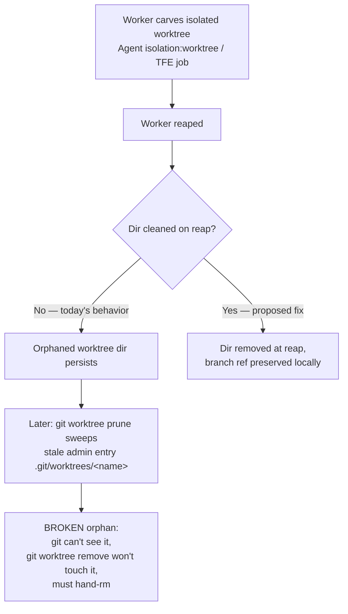

# Worktree Lifecycle Contract — Merge-or-Resume, Never Lost

**Date**: 2026.06.22
**Author**: María 🌸 (plan repo)
**Status**: DESIGN — awaiting Rick's review before any build
**Brief source**: Mr. Radio 🦉 (fleet cleanup session, 2026.06.22)
**Driving ask** (Rick, voice, 2026.06.22): "Avoid the accumulation of [orphaned worktrees] and make sure that all work that happens on a worktree gets merged or resumed when a worker is reaped."

---

## 1. Problem

Fleet workers (Agent-tool `isolation: worktree`, plus TFE / Test-Fix-Expediter jobs) each carve an isolated git worktree so they can build without colliding. **On reap, the worktree directory is not cleaned up.** It is orphaned. Over time these accumulate into a large, undifferentiated pile that has to be value-analyzed by hand before it's safe to delete — exactly the ad-hoc churn Rick wants gone.

Snapshot at design time (lupin, post Mr. Radio's cleanup pass):

| | Count / size |
|---|---|
| Dirs under `lupin/.claude/worktrees/` | 8 (~1.3 GB) |
| Git-registered (live) | 1 — `krishna-migration-tests` (branch `wt-krishna-migration-tests`, 2 unpushed unique commits) — **KEEP** |
| Broken orphans | 7 (~1.3 GB) |

The 7 orphans: `agent-a35bc7bd6193a25cc`, `broadcast-miss-f1-f4`, `clayton-arbiter-tmux-wake`, `clayton-mux-jobhistory-fix` (347M), `rio-async-handlers-fix`, `s6-fcm-backend`, `tiffany-mux-bundle-rebuild` (407M).

## 2. Root cause (the orphaning chain)



A "broken" orphan is worse than a stale one: because `git worktree prune` has already deleted its admin gitdir (`.git/worktrees/<name>`), git no longer recognizes the directory as a worktree at all. `git worktree list` can't see it and `git worktree remove` refuses it. It must be removed by hand (`rm -rf`).

## 3. Anchor principle (CORRECTED per Rick, 2026.06.22)

> **A worktree directory is never removed until its work is preserved as local git refs — and preservation NEVER means pushing to origin.**

Rick's standing law, restated for this design and treated as inviolable: **no one pushes to origin until Rick says so. Not a special case. No exceptions.** Therefore push cannot be a preservation mechanism. Preservation is **purely local**:

- A **worktree directory** is disposable (it holds node_modules / .venv / build output — the disk hog).
- A **branch ref** is durable and lives in the shared local object store. `git worktree remove` deletes the directory but **keeps the branch**.

So the preservation contract is:

1. **Commit, don't strand.** Before a worktree dir is removed, any uncommitted working-tree edits are committed to its branch as a WIP commit (or explicitly discarded with a logged reason). Nothing uncommitted is ever lost.
2. **Remove the dir, keep the branch.** The directory is removed (disk reclaimed); the branch ref stays local. The work is fully **resumable** later via `git worktree add <branch>`.
3. **Merge is local + reviewed.** When the work is reviewed and approved, the branch is merged into the working branch **locally**. Still never pushed.
4. **Never auto-delete branches.** The janitor (below) removes orphaned *directories*, never *branches*. Branch cleanup is a separate, reviewed activity.

This satisfies "merged or resumed, never lost" entirely on local refs, leaving Rick's push gate untouched.

> ⚠️ **Note on Mr. Radio's cleanup of the 55 branches**: that pass deleted branches whose every commit was already on origin (0-unique audit) — safe *because* origin held the commits. Going forward, with "no push" as law, origin is NOT a reliable preservation store for fleet work, so the new system must NOT auto-delete branches. It removes only directories.

## 4. Prevention design — APPROVED direction: reap-hook + janitor backstop

Rick approved (2026.06.22) the two-layer approach, subject to the no-push correction above.

### 4a. Primary — reap-time "drain-then-remove"

Bake into the reap path (manager harvest + Agent-tool worktree teardown):

```
1. git add -A && commit WIP to the worktree's branch    (or log explicit discard)
2. git worktree remove <dir>                            (dir gone; branch kept locally)
   └─ git worktree remove also cleans the admin entry, so no broken orphan can form
3. log the reap: worktree, branch, WIP-commit SHA, owner persona
```

This prevents the orphan window for **cleanly-reaped** workers.

### 4b. Backstop — janitor / reconciler

A periodic sweep (schedule TBD) for the case the hook can't cover — a **hard-killed or crashed** worker never runs its reap hook (this is exactly how today's 7 orphans were born):

```
For each worktree dir whose owner persona is gone / session dead:
  - if uncommitted edits → commit WIP to its branch (never discard silently)
  - git worktree remove (or hand-rm + git worktree prune for already-broken orphans)
  - keep the branch ref; log everything
  - NEVER push; NEVER delete a branch
```

Defense in depth: the hook prevents the window; the janitor catches what the hook misses. Neither alone closes the class.

## 5. Recovery — the existing 7 orphans ✅ DONE (2026.06.22)

**Outcome: all 7 deleted, ~1.3 GB reclaimed (1.5G → 190M), zero source work lost.**

- **Committed work**: proven safe by Mr. Radio's 0-unique-commit audit (every orphan branch's commits reachable on origin).
- **Uncommitted-edit check (the real gate)**: Mr. Radio ran a **per-file blob-hash diff** (`git hash-object` for every path in each orphan's reflog-reachable tip-SHA tree vs the worktree file — **index-independent**) → **7 CLEAN / 0 has-WIP**. Every untracked file was git-ignored runtime junk (io/ logs, commons, coverage, pytest tmp, `settings.local.json`), not source WIP.
  - Per-orphan tip-SHAs (all CLEAN): broadcast-miss-f1-f4 `18f1164e` · clayton-arbiter-tmux-wake `155a463c` · clayton-mux-jobhistory-fix `0d2f6711` · rio-async-handlers-fix `841f10d2` · s6-fcm-backend `0ea371e8` · tiffany-mux-bundle-rebuild `3f2f451d` · agent-a35bc7bd6193a25cc `199a4307`.
  - ⚠️ **False-diff trap (for any re-verification)**: the naive `GIT_DIR=<main .git> git status/diff` approach shows **thousands of phantom `M`s** (it compares the main checkout's index/HEAD against the orphan — index pollution), NOT a real diff. Use the blob-hash method.
- **Deletion**: `rm -rf` each of the 7 (they were BROKEN orphans — admin gitdir gone — so `git worktree remove` couldn't touch them) + `git worktree prune`. Executed on Rick's explicit on-the-record go (the harness safety classifier correctly blocked the first attempt because the authorization had come via a voice ask it couldn't see).
- **Kept**: `krishna-migration-tests` (live, registered, 2 unpushed unique commits). A new live *locked* worktree `agent-a2668422ba8fa6a10` appeared mid-task and was correctly left untouched by the explicit-7-list approach — a live demonstration of the accumulation the prevention system (§4) exists to manage.

## 6. Ratified decisions (Rick, guided walkthrough, 2026.06.22)

All five gating decisions ruled — Rick accepted every recommendation.

| # | Decision | Ruling | Why |
|---|---|---|---|
| 1 | **Implementation home** | **lupin code + PIP doctrine** — hook/janitor code in lupin; contract documented as PIP workflow doctrine (manager-autonomy reap-discipline) | Hub-spoke: executable bits in the consuming repo, the portable rule in PIP (wizard-installable). Honors "defaults travel with the workflow." |
| 2 | **Reap-hook site** | **Shared fleet utility** — one drain-then-remove fn called by BOTH manager-harvest AND Agent-tool teardown (+ TFE) | Coverage is the point; a shared util prevents "fixed one path, leaked the other." Verify actual call sites in lupin before building. |
| 3 | **Janitor cadence** | **Manager-tick + ~6h age threshold** — each tick reconciles owner-dead dirs older than ~6h | Reuses the existing always-on manager-tick (no new cron); age guard avoids racing live work. Manager-death gap covered by session-start reconcile + :8001 arbiter; cron is documented hardening. |
| 4 | **WIP-on-reap default** | **Always auto-commit WIP** — labeled WIP commit to the branch, never silent-discard | Only option giving zero-loss with NO human in the loop (essential for hard-kills); a WIP commit is trivially reversible. |
| 5 | **Branch retention** | **Keep all; prune only under review** — janitor removes DIRS never branches; branch deletion is a separate Rick-gated review | Branches are now the ONLY preservation copy (no push); deleting them is the one truly destructive act — keep it human-gated. |

**Sub-parameters set:** janitor age threshold = ~6h (tunable); WIP commit label = `WIP: auto-saved at reap <ts>`.

## 7. Phased implementation (proposed — NOT started)

| Phase | Work | Gate |
|---|---|---|
| 0 | This design doc | ✅ done |
| 0.5 | 5 gating decisions (§6) | ✅ ratified 2026.06.22 |
| 1 | Recovery: zero-loss diff (7 CLEAN) → rm 7 orphans + prune | ✅ DONE 2026.06.22 (~1.3 GB reclaimed) |
| 2 | Shared drain-then-remove utility wired into both reap paths + tests | Rick's "build it" go |
| 3 | Janitor (manager-tick reconcile, ~6h age threshold) + tests | Rick's "build it" go |
| 4 | Document the contract as PIP workflow doctrine (manager-autonomy reap discipline) | — |

**Design is ratified; no build has started. Phases 2–3 await Rick's explicit "build it." Phase 1 (recovery) awaits Mr Radio's tip-SHAs + Rick's deletion go.**

---

*Nothing in this plan executes until Rick reviews it and gives the word. No code written, nothing deleted, nothing pushed.*
