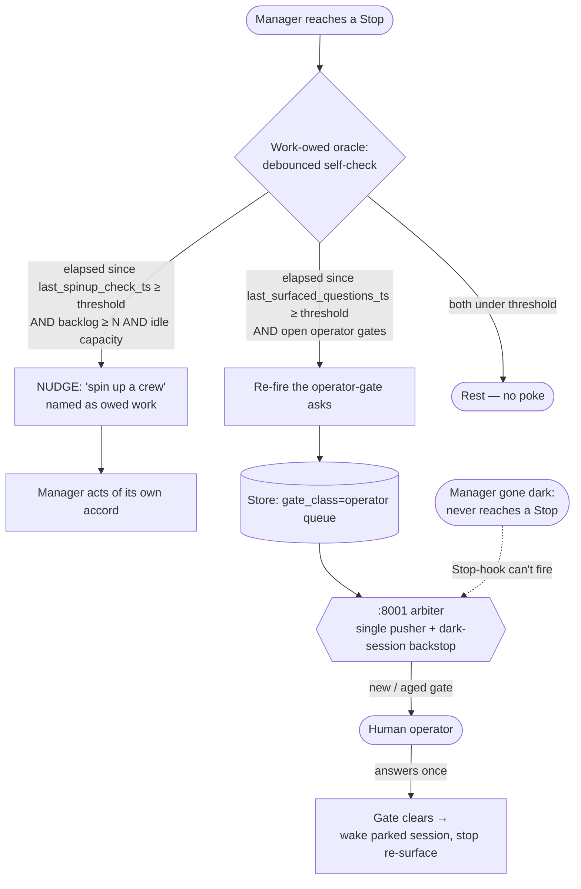

# Proactive-Manager Doctrine + Mechanism

**Date**: 2026-06-23 · **Author**: María 🌸 (Workflow Steward) · **Status**: ✅ DESIGN COMPLETE — all 5 decisions ruled (D1–D5) + `operator` rename. Build = lupin lane. · **Agenda**: post-game items **1 + 11** (the "two-sided coin") · **Priority**: P1 · **Store task**: `98dca8d0`

> Living design doc — captured mid-walkthrough so the rulings are durable. D4–D5 are still open; nothing below them is decided.

---

## 0. Origin

Two Rick voice directives, 2026-06-23 morning, that he himself framed as a single "two-sided coin":

1. **(item 1, the stop-hook question)** *"…use the stop hook to drive Claude Code instances to query the human when they need feedback, and be more proactive instead of simply saying the ball is in the human's court."*
2. **(item 11)** *"…structurally encourage managers to spin up more SWE team members of their own accord, as opposed to me prompting them to get on the clock and get cracking on a big list of to-do items."*

Rick's instruction: *"let's start with this two-sided coin for encouraging managers to self-initiate SWE-team spin-ups and for getting a hold of me."*

---

## 1. The frame — one defect, two faces

Both items are the **same structural defect**: a manager-figure has a *state that should trigger proactive action*, but today it **rests until Rick prompts it**.

| | Face A — **item 11** | Face B — **item 1** |
|---|---|---|
| **Direction** | proactive **DOWN** (spin help) | proactive **UP** (surface question) |
| **Triggering state** | backlog of owed work + idle crew capacity | blocked on a decision only the human can make |
| **Proactive action** | spin up a SWE crew | surface the question to the human + keep surfacing until answered |
| **Anti-pattern it kills** | sitting on a to-do pile waiting to be told to staff it | parking on "the ball's in the human's court" |

The unifying principle: **a manager must act on its own hook signals, not wait to be prompted** — structurally (not disposition-dependent; cf. the Opus-4.8-laid-back-vs-Fable finding).

---

## 2. Decisions ruled

### D1 — Trigger home → **Stop-hook oracle with a folded, debounced self-check + thin arbiter backstop**
Rick's refinement (the key insight): **don't run a brute-force every-N-minutes tick.** Instead, fold the tick's *intent* INTO the Stop-hook work-owed oracle, which already fires **naturally when a manager reaches a stopping point**. On each Stop, the oracle does a **debounced elapsed-check**: *"how long since I last (a) surfaced my blocked questions to the human, or (b) checked whether my backlog warrants a crew spin-up?"* If `elapsed ≥ threshold` → that duty becomes **named owed work** (the manager acts right then, riding the natural pause); if `< threshold` → rest, no poke.

- Same *effect* as a tick, **zero brute-force interrupt** — it piggybacks on a pause that was going to happen anyway.
- This is the **same debounce mechanism** already designed for receipts-of-progress (the `last_looked_in_on_workers_ts` throttle, task `6929f4ac`). Generalized here to two per-manager timestamps:
  - `last_surfaced_questions_ts` (Face B)
  - `last_spinup_check_ts` (Face A)
- Thresholds **INI-configurable** (mirrors the `T_escalate` pattern), tunable per face.
- **+ thin arbiter backstop** (Rick ruled Option A): the Stop-hook only fires when the session is **alive and reaches a Stop**. A manager gone fully dark (crashed / quota-frozen / parked mid-context) never self-checks. The `:8001` arbiter is the **safety net for that dark case only** — resurfaces an aged blocked question (extends tonight's case-18 dark-session resurface to all open gates) and/or flags an idle manager sitting on a backlog. **Not a co-equal engine — just the net under the Stop-hook.**

### D2 — Spin-up action (Face A) → **Nudge (owed-work prompt)**
When the oracle detects backlog ≥ threshold + idle capacity, it **names** *"big backlog, no active crew → consider spinning up a crew"* as owed work on the manager's next Stop; **the manager decides and acts of its own accord**. Faithful to Rick's exact words ("of their own accord"); preserves manager judgment (not every backlog warrants a crew); low blast radius; MANAGE-not-BUILD intact; the debounce re-surfaces until acted. (Rejected: auto-spin = high blast radius + removes judgment. Deferred: *Tiered* — nudge-then-auto-spin-on-repeated-ignore — as the natural v2 if nudges prove too weak.)

### D3 — Questions-up substrate (Face B) → **Always mint a gate (store-canonical) + arbiter as single pusher**
Every user-blocking question becomes a typed **gate item** in the unified store the moment it's raised. `task_query(gate_class=operator)` = **everything awaiting the human, fleet-wide, in one place**. The arbiter is the **single pusher**: surfaces a new gate, re-surfaces an aged one — replacing N per-session re-ask timers (retires the ~10-min hack). Answer-routing-back: the human answers once → the gate clears → the asking session (woken if parked) receives the answer and stops re-surfacing. (Rejected: lazy/inline-first — no unified view until escalation; a parked question stays invisible.)

### Rename — `gate_class = ricks_court` → **`operator`**
Rick's portability catch: `ricks_court` bakes in a person's name — off-putting and non-portable to the next human overseer (aligns with *workflow defaults travel with the workflow*). **`operator`** is role-based, portable, matches our existing "operator loop" lineage, and reads naturally ("awaiting operator", "the operator queue"). Small migration: the store `gate_class` enum + any code filtering `ricks_court` + doctrine docs (this design, Note 1 in the post-game, `manager-autonomy.md`) + the global memory line. To be scoped/landed with the build.

---

## 3. Mechanism sketch

---

## 4. Decisions ruled (cont.)

### D4 — Urgency tiering → **Three tiers: urgent / normal / low** (Rick, 2026-06-23)
An `operator` gate carries an urgency tier: **urgent** → arbiter pushes immediately (interrupt); **normal** → batched into a periodic digest; **low** → sits in the queue until the human pulls it. Prevents both flooding (only urgent interrupts) and starvation (normal digested, low visible). Implementation notes (María to finalize): tier set by the minting manager, **default `normal`**; digest cadence INI-configurable; a **dedicated `urgency`** dimension (NOT the existing importance `priority` field, since importance ≠ time-sensitivity), defaulted for low friction; `urgent` honors blast-radius — reserved for genuinely time-sensitive/irreversible, never a default attention-grab.

### D5 — Gate-minting doctrine → **Blast-radius + 'when uncertain, surface'** (Rick, 2026-06-23) — the load-bearing half
The classification rule. A manager **mints an `operator` gate** when the decision is irreversible / shared-infra / cross-persona-policy / explicitly user-reserved, **OR** it is genuinely unsure it owns the call. It **decides under standing authority** when the work is reversible + in-lane + owned. It uses an **inline ask** (no gate) only when the human is live AND it's a fast clarification. Anchors on the already-ratified **blast-radius authorization** doctrine (no new taxonomy); the **uncertainty tiebreaker leans toward surfacing** — the precise antidote to the 'ball's in your court' under-asking. With D4 tiering, more gates ≠ more interrupts. Doctrine home: `workflow/manager-autonomy.md` + `workflow/task-store-discipline.md`, with worked examples (deploy / :8001 restart → urgent gate; 'which refactor direction, if the human cares' → normal gate; reversible doc edit → standing, no gate; 'confirm this field name while you're here' → inline). Cross-refs *"gate = a direct ask, never buried."*

---

## 5. Reused machinery (build on, don't reinvent)

- **Receipts-of-progress debounce** (`6929f4ac`, deployed tonight) — the `last_*_ts` throttle pattern this generalizes.
- **`pending_user_gates` + `outstanding_user_gate` work-owed signal** (shipped tonight) — an open gate already counts as `work_owed` and the Stop-hook NAMES due gates.
- **Arbiter case-18 dark-session gate-resurface** — the existing backstop; D1/D3 extend it from dark-session-only to all open gates.
- **`gate_class` store type** — already exists (renaming the value to `operator`).
- **Manager-Tick Loop design** (`src/rnd/2026.06.15-always-on-manager-tick-loop.md`, 5 decisions ruled) — its agenda-query (`task_query(accountable_manager=me)`) is the backlog source for Face A; D1 supersedes its *brute-force timer* premise with the Stop-hook-folded debounce.
- **`/spin-up-swe-team` skill + `workflow/swe-team-spin-up.md`** — the spin-up action Face A nudges toward; cap-8 concurrency bound applies.

## 6. Dependency on item 4 (the dark-session backstop must be trustworthy)

The thin arbiter backstop (D1) is only as good as the arbiter's liveness/escalation precision. This morning surfaced a **cluster of arbiter escalation-precision defects** (NOT one tidy root-cause — stated honestly):
1. **tap-ACK** reads only 2/5 liveness signals (commons + bridge, missing the dm/events/idle_prompt union) → false MANAGER-DOWN (Mr Radio's bug; fix = reuse `compute_liveness`).
2. **block-direction** read `accountable_manager` as a worker→manager block edge → false "blocked on Tiberius" storm.
3. **deadlock detector** consumes **stale** view-level `holding_on` (missed the lane-4 alive-prune) + has **no cycle de-dup** → mis-flags a fresh, progressing cutover *sequencing wait* as a deadlock and re-storms (`436a366b`).

All three fold into **Mr Radio's single arbiter-hardening pass** (+ `:8001` restart). **Fixing them is what makes the D1 backstop trustworthy** — so this design's dark-session net rests on item 4 landing.

## 7. Implementation notes (deferred to build)

- Two per-manager debounce timestamps persisted where the Stop-hook can read/update them (per-session state; survives `/clear`).
- INI thresholds (default ~10 min, mirroring `T_escalate`), per-face tunable.
- Doctrine home = `workflow/manager-autonomy.md` (a new §) + `workflow/task-store-discipline.md` for the gate-minting classification (D5).
- Code home = lupin Stop-hook (`heartbeat_work_owed.py` / `stop.py`) + the `:8001` arbiter (backstop) — Mr Radio / Tiberius build lane.

---

## Version history
- **v0.1** (2026-06-23, María) — frame + D1–D3 + operator rename ruled; D4–D5 open. Captured mid-walkthrough.
- **v0.2** (2026-06-23, María) — D4 (three tiers) + D5 (blast-radius + when-uncertain-surface) ruled by Rick. **Design COMPLETE** (5/5 + rename). Next: graduate to a `workflow/manager-autonomy.md` section + the `operator` rename plan; build = lupin lane (Stop-hook + arbiter backstop).
