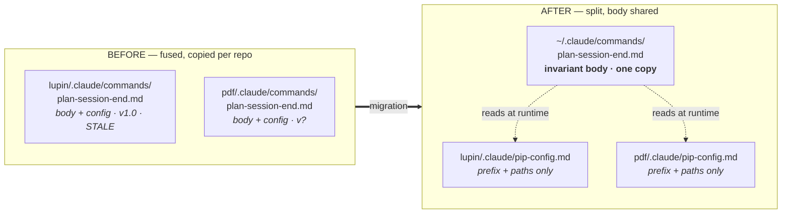

# Workflow Distribution — User-Scope Migration + Session-Start Drift Check

**Date**: 2026-07-19
**Author**: María 🌸 (session `04b11b14`)
**Status**: SPEC — not built, not authorized to build
**Pattern**: 3 (Feature Development)
**Prefix**: `[PLAN]`

---

## 0. One line

**Slash commands are copied per repo and their `Version` field lies — 23 of lupin's 36 commands report the same version as canonical while their content differs, so `/plan-about` reports "✓ Current" on a file that is missing steps.** Fix: hoist the invariant command bodies to user scope, keep only project config per repo, and check drift by content hash at session start.

---

## 1. Measured state (enumerated, not estimated)

⚠️ **Correction to a number I gave earlier this session.** I said "~43 repos" carry copied commands. That figure came from the memento's note about the `brevity-mandate` skill and does not describe the command surface. Actual, counted:

| Scope | Count |
|---|---|
| Directories under `projects/` | 42 |
| Of those, git repos | 22 |
| Of those, with a `.claude/` dir | 7 |
| **Of those, with PIP commands installed** | **3** |

Per-repo coverage:

| Repo | PIP commands | Of 40 canonical |
|---|---|---|
| `planning-is-prompting` | 40 | canonical source |
| `lupin` | 36 | 90% |
| `pdf-reduce-to-text` | 7 | 18% |
| `ampe`, `ampe-to-meridian`, `gcp-pca-certification-prep`, `voicemode` | 0 | have `.claude/`, no PIP |

The drift surface is smaller than I claimed, and it is not currently measurable by the check we have.

---

## 2. The two defects

### D1 — The version field does not track content (PRIMARY)

Of lupin's 36 installed commands, **27 differ byte-for-byte from canonical**. Of those 27, **23 report an identical `Version` string**.

`/plan-about` compares version strings (`workflow/installation-about.md` Step 3). Therefore it reports **✓ Current** for 23 files that are not current.

**Receipt** — `lupin/.claude/commands/plan-session-end.md`, local `v1.0`, canonical `v1.0`, 77 diff lines. Two of them are not project substitution:

```
> ⚠️ Note: This command's canonical workflow uses cosa-voice notifications...
  (TTS Brevity Mandate note — ABSENT from lupin's copy)

<    - Execute ALL steps exactly as described ... (Steps 0, 0.4, 0.5, 1-5)
>    - Execute ALL steps exactly as described ... (Steps 0, 0.4, 0.5, 1-6)
```

Lupin's session-end ritual runs five steps where the canonical ritual has six. The installed check reports it as current.

`plan-memento` is the honest case: local `v1.1`, canonical `v2.0`, 105 diff lines — flagged correctly *because someone remembered to bump the field*. The check works exactly as well as human discipline, which is to say it does not work.

### D2 — Distribution is manual, so coverage is arbitrary

Nothing pushes an updated canonical command anywhere. A repo gets what it got on install day. `pdf-reduce-to-text` sits at 7 of 40 not by decision but by nobody re-running the wizard.

---

## 3. Root cause

**Each command file fuses two things that have opposite change-rates.**

| Layer | Content | Changes when | Varies per repo |
|---|---|---|---|
| **Invariant body** | "read the canonical workflow, execute all steps, do not skip" | canonical workflow evolves | **no** |
| **Project config** | prefix `[PLAN]`, history path, archive dir, nested-repo notes | project setup changes | **yes** |

Measured fusion is thin — 2 to 6 project-specific references per file, in files of 72–173 lines. **Roughly 95% of every command file is identical across repos.**

Because they are fused, distribution requires *copying*, copying requires *substitution*, and substitution forbids a clean overwrite — so the only safe update is a manual merge nobody performs. **The version field is not the bug; it is the symptom of a file that cannot be safely overwritten.**

---

## 4. The fix — separate the layers



### 4.1 Component A — user-scope command body

`~/.claude/commands/plan-*.md` — one copy, serves every repo. Contains zero project strings. Where today's file hardcodes:

```markdown
- **[SHORT_PROJECT_PREFIX]**: [PLAN]
- **History file**: /mnt/DATA01/.../planning-is-prompting/history.md
```

the shared body instructs:

```markdown
1. **MUST load project configuration**: read `.claude/pip-config.md` from the
   current project root. If absent, HALT and tell the user to run
   `/plan-install-wizard mode=config`. Do NOT guess a prefix or a path.
```

The **fail-loud-on-missing-config** rule is deliberate and matches the standing "no defensive fallback" mandate — a command that silently invents a prefix is worse than one that stops.

### 4.2 Component B — per-repo config

`<project>/.claude/pip-config.md` — the only PIP file that stays per-repo:

```markdown
# PIP Project Config
**Project**: Lupin (Genie-in-the-Box)
**Prefix**: [LUPIN]
**Root**: /mnt/DATA01/include/www.deepily.ai/projects/lupin
**History**: history.md
**Archive**: history/
**TODO**: TODO.md
**Notes**: nested repo /src/cosa (merged in-tree 2026-05-29)
```

Small, hand-owned, never overwritten by an update. **All genuine per-repo variation lands here and nowhere else.**

### 4.3 Component C — distribution channel (DECISION REQUIRED)

| | **V1 — copy + drift check** | **V2 — symlink into the repo** |
|---|---|---|
| Mechanism | wizard copies canonical → `~/.claude/commands/` | `~/.claude/commands/plan-x.md` → symlink → `$PLANNING_IS_PROMPTING_ROOT/.claude/commands/plan-x.md` |
| Update | re-run wizard; drift check nags | **`git pull` — that is the entire update** |
| Drift | possible, detected | **structurally impossible** |
| Risk | needs the nag to be honored | depends on Claude Code resolving symlinked commands — **UNVERIFIED** |
| Portability | copies survive without the PIP repo | breaks if `$PLANNING_IS_PROMPTING_ROOT` is absent |

**Recommendation: V2, gated on a Phase-0 smoke test.** V2 makes git the distribution channel and deletes the drift problem rather than monitoring it. If the smoke test fails, fall back to V1 — the rest of the spec is identical either way.

**Phase-0 smoke test** (must run before choosing): symlink one low-risk command into `~/.claude/commands/`, invoke it from a repo with no local copy, confirm it resolves and executes. One command, fully reversible.

### ✅ RESULT — symlink resolution CONFIRMED, 2026-07-19

`~/.claude/commands/probe-symlink.md` → symlink → `workflow/scripts/probe-symlink-userscope.md`. Invoked from `planning-is-prompting`, which has **no** local `probe-symlink.md` (verified: `ls` returns No such file). The command was discovered, the target's content loaded through the link, and its instruction executed.

**Scope of the claim** — the invocation came from the assistant's skill surface, not a user keystroke. Discovery and content-resolution through the symlink are proven; a typed `/probe-symlink` exercises the same file resolution but has not been separately run. **The V2 mechanism is not blocked.**

⚠️ **Test 2 (shadowing) is NOT answered by this.** It needs a session in `lupin`, where a local `probe-symlink.md` exists alongside the user-scope symlink, so the winner can be read from the output rather than inferred.

### 4.4 Component D — shadowing gives a free rollback

Project-scope `.claude/commands/X.md` is expected to take precedence over user-scope `X.md`. **This is an assumption and Phase 0 must confirm it**, because the whole migration safety story rests on it: while a repo keeps its local copy, behavior is byte-identical to today. Adoption is `rm` of the local copy, and rollback is `git checkout` of it.

⚠️ If Phase 0 finds user-scope wins instead, the migration must invert — delete-then-verify per repo, no overlap period. Do not proceed on the assumption.

---

## 5. Session-start drift check

### 5.1 Why hashes, not versions

§2 D1 is the argument: **23 files proved a matching version string means nothing.** The check compares SHA-256 of content.

### 5.2 The manifest

`workflow/MANIFEST.json`, generated — never hand-edited:

```json
{
  "generated_at": "2026-07-19T16:00:00-04:00",
  "generator": "workflow/scripts/pip_manifest.py",
  "commands": {
    "plan-session-end.md": { "sha256": "…", "version": "1.0" },
    "plan-memento.md":     { "sha256": "…", "version": "2.0" }
  }
}
```

Regenerating it is a commit-time step for anyone editing `.claude/commands/` in this repo. **A stale manifest is itself drift** — the generator must be run by the same hand that edits a command, and the drift check reports its own manifest age.

### 5.3 The check

New: `workflow/scripts/pip_drift_check.py`

**Requires**: `$PLANNING_IS_PROMPTING_ROOT` set and readable; run from a project root.
**Ensures**: exit 0 always (never blocks a session); prints exactly one line unless drift exists; classifies every command into one of four states.

| State | Meaning | Reported |
|---|---|---|
| `CURRENT` | hash matches manifest | counted only |
| `DRIFTED` | hash differs, no override marker | **named** |
| `SHADOW` | repo-local copy present, carries `<!-- pip-override: reason -->` | named, not an error |
| `MISSING` | in manifest, not installed anywhere | named |

The `SHADOW` state is what makes this survivable: **a repo is allowed to diverge, but must say so in the file.** Intentional divergence stops being indistinguishable from rot — which is precisely the condition lupin is in today.

Output when clean:

```
[PLAN] PIP workflows: 40/40 current · scanned 40 files · manifest 0d old
```

Output when not:

```
[PLAN] PIP workflows: 34/40 current, 4 drifted, 1 shadow, 1 missing · scanned 39 files
  DRIFTED  plan-session-end, plan-todo, plan-session-start, plan-review
  SHADOW   plan-memento (reason: lupin nested-repo memento slots)
  MISSING  plan-push
  → /plan-install-wizard mode=update
```

**The scanned-file count is required, not decoration.** A clean report must be distinguishable from a broken scan — "0 drifted" and "0 files found" print identically otherwise. Three instances of a null reading taken as a finding surfaced in this fleet within one hour today: a `docker inspect` field answering WHEN read as WHO; a peer's compliant silence read as death; and my own transcript grep returning clean-empty twice because a leading-dash path parsed as a command-line flag. **A negative result is evidence only when the instrument has been shown capable of a positive one.**

### 5.4 Wiring

`workflow/session-start.md` gains **Step 0.2 — PIP drift check**, placed after MCP Phase A (identity first) and before history/TODO reads. Cost is one script call. **Report-only. It never blocks and never auto-updates** — silently rewriting a session's own workflow files at boot is exactly the kind of invisible action that should require the user's word.

---

## 6. Phasing

| Phase | Work | Reversible | Gate |
|---|---|---|---|
| **0** | Smoke-test symlink resolution + shadow precedence (§4.3, §4.4). Build `pip_manifest.py` + `pip_drift_check.py`. Run report-only across all 3 repos. | fully | **Rick reads the real numbers before anything moves** |
| **1** | Split one command (`plan-session-end`) into shared body + config. Install at user scope. Verify lupin's local copy still shadows it. | fully | green Phase 0 |
| **2** | Split remaining 39. Write `pip-config.md` for lupin + pdf-reduce-to-text. Repo copies stay — nothing adopted yet. | fully | Phase 1 verified live |
| **3** | Per repo: delete local copies, confirm drift check reads clean, smoke one command. Mark deliberate divergences `SHADOW`. | per-file `git checkout` | per-repo, one at a time |
| **4** | Wire Step 0.2 into `session-start.md`. Retire `/plan-about` version comparison in favor of hash. | trivially | Phase 3 clean |

**Phase 0 is the deliverable that matters.** It costs little and either proves the mechanism or kills the design before a single command moves. Rio ⚡ has offered to take the smoke test.

---

## 7. Open risks

1. **`~/.claude` is machine-local.** Everything here fixes *this* machine. A second machine or a fresh clone inherits nothing. V2 (symlink) narrows this to "clone the PIP repo and set the env var"; V1 does not. **Unsolved either way for a genuinely multi-machine fleet** — out of scope, worth naming.
2. **Spawned workers inherit `~/.claude`** on this machine, so the fleet converges for free. Untested against remote/cloud spawns.
3. **Skills have the same disease.** 8 skills sit at user scope, more sit in repos; this spec covers commands only. The manifest format extends to skills unchanged, but that is a separate migration.
4. **Manifest staleness** — mitigated by reporting its age (§5.2), not eliminated. The honest fix is a pre-commit hook, which is its own decision.
5. **Precedence assumption** (§4.4) is load-bearing and unverified. Phase 0 or bust.
6. **No per-seat attribution exists in git.** Confirmed in lupin today: `a877e7b3` and the preceding 8 commits all author as `deepily <…@users.noreply.github.com>`. If a migrated command file is ever edited in place, git cannot say by which seat. This does not block the migration — it argues *for* it, since a single canonical copy has one owner by construction — but it is why §5.3's `SHADOW` marker must carry a written reason rather than relying on blame.

---

## 8. What this does not do

- Does not auto-update anything. The check reports; a human runs the wizard.
- Does not touch `workflow/*.md` — those are referenced by path, already single-copy, already drift-free. **They were never the problem.**
- Does not change any command's behavior. A correctly migrated command executes identically; only its storage location changes.

---

## 9. Decisions — RULED 2026-07-19 (Rick, via `/plan-decide`)

| # | Decision | Ruling |
|---|---|---|
| 1 | Distribution channel (§4.3) | ✅ **V2 — symlink into the repo.** `git pull` becomes the entire update; drift structurally impossible rather than detected. Falls back to V1 if the Phase-0 smoke test fails. |
| 2 | How far to authorize (§6) | ✅ **Phase 0 only.** The symlink-resolution (§4.3) and shadowing (§4.4) assumptions are unverified and load-bearing for rollback. Phases 1–4 stay unauthorized. |
| 3 | Lupin's `plan-session-end` (Steps 1-5 vs 1-6) | ✅ **Fix now, as its own single-file commit** — not as a migration side-effect. Lupin is being actively committed in; keep the commit narrow. |

**Not authorized**: Phases 1–4, and the hand-audit of the other 22 same-version diffs (the Phase-0 drift checker answers that mechanically).

---

## 10. Writeup register

State the defect, the fix, the receipt. No stakes-escalation — no "would have killed X," no severity framing layered onto a factual finding (Rick, 2026-07-19). This applies to the prose in this document and to anything derived from it. Two lines in §1 and §2 were scrubbed on that ruling.

---

## Version History

- **2026.07.19**: Initial spec. Drift measured across 3 repos; version-field defect proven on `lupin/plan-session-end.md`. Decisions §9 ruled same day; §10 register added; two drama lines scrubbed.
