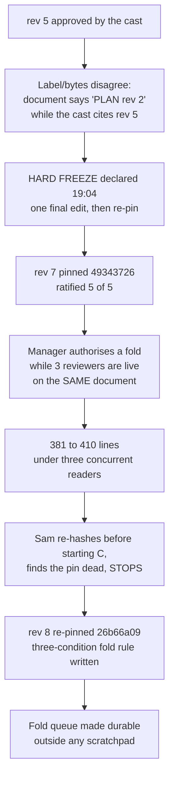

# Post-game — cascaded plan review of the spoken-ask streamed door

**Status**: Pipeline COMPLETE — nine stages, nine closes, all classified (23:51:19Z). **The fold HAS since landed** — rev 9 `3a97776` (20:11) · rev 10 `99c4eeb` (20:40) · rev 11 `feda7bf` (20:58) · rev 12 `2def6e4` (21:15), with rev 13 in reconciliation as of 22:45. Steps 8 and 9 remain open.

> ⚠️ **This line read "Fold authorised but not yet applied" for three hours after it stopped being true**, and I did not correct it until the operator asked what the fleet had been doing. Four revisions landed underneath a status line I owned. It is the same defect this document catalogues in others at §2.2 — a claim stated as current that nobody re-measured — and it is mine. Corrected 2026-09-11 22:50 EDT.
**Date**: 2026-09-11 · **Steward**: María 🌸 · **Manager**: Mr. Radio 🦉 · **Author**: Tiffany 💍
**Reviewers**: Sam 🎙️ (Stage 1, Usability/Reuse) · Chloé 🗼 (Stage 2, Viability/Gap) · John 🏄🏽 (Stage 3, Ownership-Language)
**Artifact**: `lupin-mobile/src/rnd/2026.09.11-spoken-ask-streamed-door-implementation-plan.md`
**Ledger**: `epic:cascade-spoken-ask-door` · Steward row `e5b5b8a5` · sections §A `5f017ca9`, §B `b1dbc1bd`, §C `360ec1e5`
**Pins**: rev 7 `49343726…`, rev 8 `26b66a09…`, both durable at `projects-data/lupin/cascade-pins/`

---

## 1. What the run produced

Nine stages across three sections, **0 rounds, 0 votes, 0 escalations** beyond the single operator decision R1. Every stage closed with a posted report citing the hash it read.

| Section | Stage 1 (Sam) | Stage 2 (Chloé) | Stage 3 (John) |
|---|---|---|---|
| §A server door | F1–F6 | S2-1…S2-8 | A1–A5 + C1–C4 |
| §B phone transport | SB1–SB5 | CB1–CB5 | B-J1–B-J4 |
| §C phone behaviour | SC1–SC4 | CC1–CC6 | C-J1–C-J4 |

**The three-stage shape earned its cost.** Repeatedly the later stage found something structurally invisible to the earlier one, rather than restating it:

- Stage 2 **extended** Stage 1's F2 into S2-1: §2.2 has no `except` at all, so the OOM mapping Stage 1 asked for would still leave every other failure diverging from both existing doors.
- Stage 3 caught **A5 — a Manager ruling that broke a section's own acceptance criteria**. Mr. Radio's F5 ruling pulled `speech.py` into the change footprint, contradicting §2.4's "`test_speech_*` pass untouched" row. No other seat is positioned to catch the Manager.
- Stage 3's §C verdict is the sharpest single result of the run: **§C is Layer 1 clean but three of its eight rows cannot fail for the behaviour they name** — and among the things they cannot see are *both* of Stage 2's substantive findings. The section's tests would stay green whether CC1 and CC2 were fixed or not.

**Corroboration across instruments, not repetition.** The fixture-currency defect was found three times, three ways — seeded as R3, measured in the phone tree as B-J2, and reasoned from the step order as CC3. The Manager folded them as one PRIORITY 0 item rather than three small edits. That is the cascade working exactly as designed.

---

## 2. The failure catalogue, with receipts

Everything here was caught in-run. None of it reached the operator.

### 2.1 Freeze discipline failed twice in twenty minutes

**What caught it**: not the Manager's memory and not the Steward. Sam re-hashed before opening §C and refused to cite text whose offsets had moved. John had already read the moved file, delivered nothing, and discarded that read. Chloé declined an excuse the Manager offered her. **No finding was contaminated, and the only reason the boundary was knowable is that every report cited its hash.**

**The durable fix** — the Manager's own three-condition test, which replaced a judgement call with something a seat can apply:
1. No section sits between a stage-open DM and its stage-handoff post.
2. Two hashes taken ≥10s apart agree.
3. The Manager writes the frozen copy and broadcasts the new pin to every reviewer *before* anyone resumes.

With three sections sharing one document, **there is no such thing as a per-section fold**, and the Author never picks the moment.

⚠️ **Condition 2 needed sharpening within the hour, and Chloé supplied it.** The Manager's two samples were 95 seconds apart but *both taken after the file had settled* — which proves an idle file is idle, not that the write had finished. The samples must be spaced **across the end of the author's write**. This is the same defect class as Sam's "hash, never length": a check that cannot fail in the case it exists to catch. A rule can be correct in form and useless in practice, and only running it reveals which.

### 2.2 Claims stated as measured that were not — five, all caught by a checker

| # | Claim | Reality | Caught by |
|---|---|---|---|
| 1 | A pin that was current | The file had moved twice | Sam, John (independently) |
| 2 | "rev 8's blast radius is §A only" | §2.1, a shared anchor, had changed | Steward demanded the diff |
| 3 | A §2.1 change attributed to whitespace | A ~250-char substantive rewrite | Chloé's byte-level diff |
| 4 | "§0 quotes a 'sections within 1.5×' property" | Zero hits in either pin — never in the plan | Tiffany grepped it |
| 5 | S2-8 filed under §B | It is §A end to end | Both reviewers |

Item 3 was **mine**, and item 4 originated with me. See §3.

### 2.3 An answer that exists in only one session is invisible

Twice in one evening: an operator escalation that lived in a card with no board row, and a ruling that lived in DM prose with no ask and no row. Both were declared closed over.

**Root cause, mechanical rather than anyone's lapse**: the store **discards** the text passed as `manager_attestation` and keeps only the server-resolved identity. Reproduced independently on two seats across six closes. So an operator-gated decision closed that way looks identical whether the operator ruled or not. Filed as bug `8639d1ad`.

---

## 3. My own errors, as Steward

A steward who stops a pipeline owes the evidence standard he demands. I fell short three times.

1. **I asserted a diff conclusion from truncated output.** Both my diff passes printed lines truncated at 400 and 150 characters against a row exceeding 1,700. What I read as "the line ends with a trailing space" was the truncation boundary. I asserted "whitespace only", **lifted a hold on it**, and filed a finding against the Author and Manager for a misattribution that never happened. Retracted in full; they were right.
2. **I ratified against a property that was not in the text I checked** — the "within 1.5×" sizing — then treated it as invalidated by rev 8 and asked for a correction to prose that does not exist.
3. **I nearly filed two more false findings and stopped only because I verified first**: a "the fold-queue file does not exist" claim that was a race against a file written seconds later, and a row-id 404 obtained by *inventing* the UUID suffix around an 8-hex prefix — the very error the fold queue warns about on its own line 10.

The operational conclusion in case 1 survived, but on **Chloé's** measurement rather than mine. That distinction is the point: a conclusion that happens to be right, reached through an instrument that could not see the thing being judged, is not a finding.

---

## 4. Lessons worth graduating into `workflow/`

Ordered by how much they would have saved.

1. **A freeze needs a pinnable anchor, not an mtime.** A file with a moving mtime cannot be pinned after any `/clear`. Record the sha on the section row *and* keep a frozen copy outside every session scratchpad. Both pin copies surviving four re-spins is what turned later delta claims into diffs.
   ⚠️ **The "the plan is untracked" line — including in my own amendments — was itself wrong, and it circulated for an hour.** Tiffany had committed the file at `b505bfb`; what was uncommitted was the **rev-8 fold**, with HEAD holding rev 7. Exposure was one revision deep, not the whole document. The Manager carried the error out of a stale memento line, repeated it to two people and wrote it into the durable fold queue; I repeated it too, in two of my own amendments, having never run `git log` on another repo's file. **Tiffany is the one who narrowed it** — she committed the file, then corrected the Manager's premise with the receipt rather than letting a convenient overstatement of her own diligence stand. **A claim about a file's VCS state is one command away from being measured, and none of us ran it.** Closed at `32b2055c`, bytes verified with `git show HEAD:<path> | sha256sum` rather than by reading the working tree.
2. **"Which sections changed" is a measured claim, generated from a diff against the previous pin — never written from memory.** Two seats in sequence reported a change from recollection, and it cost a Steward hold, two Manager diffs and a paused pipeline.
3. **Never conclude from truncated output.** Print lengths and the first divergence index, or diff on full strings.
4. **When a guard is retired because its subject moved, ask what the arm was *claiming*.** Chloé's arm (e) died with the dict it named and took "no eviction" — a property never about the dict — with it. Her own replacement arm vanished in the same fold, and her delta review recorded "back to four arms" as correct, because the prose had been honestly updated to match. *Nothing in the document contradicted itself, which is exactly why it read clean.* Same shape as John's C1/C3.
5. **A test whose fixture cannot express the case the row names.** SB4 (a fake yielding one chunk, for a split-chunk test) and C-J2 (one `StreamController`, for a two-stream case). Two sections, two reviewers, one defect class.
6. **Finding numbers collide when a section has more than one reviewer.** §B ran two disjoint B1–B5 sets where one reviewer's B3 *extended* the other's B2 — folding a bare "B2" lands the wrong fix. Resolved by per-reviewer prefixes, posted *beside* the original rather than by editing it. The numbering rule belongs at Step 1.
7. **An escalation needs both a card and a board row.** The card alone is invisible to every other seat; the row alone is not an ask.
8. **A cascade audit must query `not_approved` explicitly.** Under the holding gate every freshly minted row is born there and the default query cannot see it. I nearly reported a Manager's missing row off that blindness.
9. **A fix that is merged is not a fix that is running.** See §5.
10. **Write the full 64 characters wherever a later reader must match on them.** Truncated identifiers cost time three separate ways in one evening: the Manager's memento carried a truncated section-row id and the amend 404'd; I called `task_get` with a UUID whose suffix I *invented* around an 8-hex prefix and came within one sentence of reporting that 404 as evidence of a missing row; and §B's row records its pin as eight hex. A prefix is for reading aloud. It is never the record.

---

## 5. Infrastructure defects the run exposed

| Row | Defect |
|---|---|
| `8639d1ad` | The store discards `manager_attestation` text, so an operator-gated decision cannot carry its own evidence |
| `b5035039` | A seat whose MCP subprocess predates a merge fires `/clear` into a busy pane with no idle gate — and **a `/clear` does not reload the MCP**, so the seat cannot heal itself. Three of seven live seats were affected, including the Steward's and the cascade Manager's. The verb reports success, the consumed fire token reads as "never created", and the seat is left lucid enough to act on that and re-fire into its own successor |

Both sit `not_approved` with no admit requests filed — accurate while the operator is away, since he has not ruled them not-now.

---

## 6. Ledger state and the admit bottleneck

Steward ledger checks ran twice, both PASS. All 13 rows reconcile, and there is correctly no Step 7 row.

**Structural finding for Step 8**: under the create-door holding gate, every cascade row is born `not_approved`. This run minted 8 step rows, 3 section rows, a decision row and the Steward row — **roughly a dozen separate admit clicks before the board reflects reality**. The section rows have been amended with full receipts but **never transitioned**, because they cannot be while unadmitted. So the cascade can complete its work without its ledger ever reaching a terminal state. Worth asking whether cascade ledger rows should be admitted as a unit.

---

## 7. Discipline worth naming

- **Sam** re-hashed before opening a section and stopped rather than cite moved text; later took ownership of a gap his own finding had opened, unprompted.
- **Chloé** read code at a different sha than the plan cited and *proved the substitution safe* before trusting one line number; built a three-arm compile probe **with a positive control**, so a red proved the defect rather than her probe; hunted a sixth finding, found the code refuted it, and reported the cleared suspicion by name.
- **John** refused to re-file another reviewer's finding as his own, refused to pad two wording items into a three-instance cluster, and refused to open a section on an inference.
- **Tiffany** re-checked a numbering claim she had disputed, found the error was hers, and said so unprompted.
- **The Manager** self-reported his own freeze break, wrote the rule that prevents it, applied it to himself by queuing rather than patching mid-flight, and withdrew his own claim when the grep refuted it.

**The pattern that matters more than any single lesson**: every one of the five false claims in §2.2 was caught by a seat that checked instead of complying. The cascade's value came from mutual verification, not from any one seat's care — including mine.

---

## 8. Outcome and what remains

**The pipeline completed at 23:51:19Z: nine stages, nine closes, all classified, 0 rounds, 0 votes, 0 escalations** beyond the single operator decision R1. The reviewed bytes are now recoverable from git rather than from any working tree — `git show 32b2055c:src/rnd/2026.09.11-spoken-ask-streamed-door-implementation-plan.md`, hashing to `26b66a09…` at 410 lines.

**The last stage was also the strongest.** Stage 3 on §C returned *Layer 1 clean* and, in the same breath, the run's sharpest structural result: three of the eight §C rows cannot fail for the behaviour they name, and two of Stage 2's substantive findings sit inside that blind spot. A section can be honest, complete and self-consistent and still be untestable — which is the same shape as the retired-guard lesson in §4, arriving from the opposite direction.

**CC6 deserves naming as the methodological high point.** Asked whether a naming collision was real or cosmetic, Chloé answered "both, and the split is the finding", then *built* the answer: three analyzer arms, one variable each, **including a positive control** — because without it a red proves only that the probe reddens. The plan's `_SpokenAskArrived` cannot be both private and a `QuickAskEvent`; the seal forces it into one library and the underscore hides it from the other. A builder would have hit it on their first `analyze` and "fixed" it by dropping an underscore that was load-bearing.

**Still open:**
- ~~The fold itself.~~ **DONE — and it took four revisions, not one.** Condition 1 of the three-condition test became satisfiable for the first time only at pipeline completion. The bundle landed as rev 9; rev 10 was a verification fold that found **19 PASS / 1 FAIL plus three defects the rev-9 fold had itself introduced**; rev 11 corrected two claims the document made about itself (an unattributed "RULED" that read as the operator's, and a broken two-place revision rule); rev 12 folded Chloé's rev-10 verification at **3 PASS / 4 FAIL**, including a §3.4 row that was unsatisfiable by any correct implementation. ⇒ **A fold is not a transcription step.** Every one of these four revisions found defects the previous fold introduced or left, which is the strongest argument in this document for verifying a fold the way the artifact under it was verified.
- **Rev 13, live at time of writing**: `cascade-pins/rev13-item-reconciliation.md` (Sam, 22:30–22:45) reconciles an eleven-item list against a nine-item one — arithmetic closes at 11 − 3 + 1 = 9 — and carries **E4b**, a live §2.3 defect in neither list that will be mistaken for a finding the DM condenser fabricated and the Manager briefly ratified. ⚠️ **"Struck as never-existing" is not "fixed", and a channel-invented finding is not a withdrawn one** — both distinctions have to survive into rev 13 or the fold re-introduces what it was closing.
- **C-J4 carries a deadline, not a preference.** The `SharedPreferences` key rename is a one-way door once it reaches a device, and no tier can detect a silently reset user setting afterwards. It must land before §4 step 5 commits — an ordering constraint the fold queue has no way to express today.
- **Pin provenance on §B and §C.** The §A row now carries the full pinned sha, the backing commit and the discharged fold test. §B still names rev 7 as its pinned text and mentions rev 8 only as a bare 8-hex prefix inside a narrative clause; §C names rev 7 and carries no rev-8 sha value at all. Neither carries the commit. By the Manager's own argument on §A — the section row is the anchor that survives a `/clear` — two thirds of the cascade point a successor at the wrong revision. Stated at its real size: **a record defect, not a review defect**, since every stage report cited the hash it actually read and both pin copies are on disk. Asked of the Manager; a fix applied to one instance of a class is what a Steward checks rather than assumes.
- Steps 8 and 9, and the two infrastructure bug rows in §5, which stay unadmitted while the operator is away.
