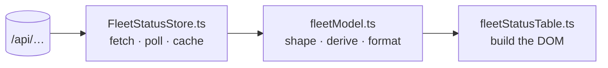
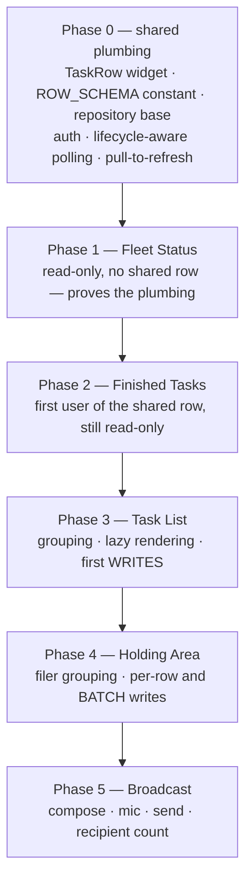

# Five fleet panes for the mobile client — a work plan for Tiffany

**Date**: 2026.09.19
**Author**: María 🌸 (session `2b9f67a1`), planning-is-prompting
**For**: Tiffany 💍, `lupin-mobile` — Flutter/Dart, targeting Android
**Store row**: `72d16636` · epic `mobile-pane-parity`
**Origin**: Rick, by voice, 2026-09-19 — *"build a work plan for Tiffany to implement parallel functionality on the … cell phone client … review 4 or 5 different accordions and use that as the basis for a design document that she's going to use to build these new capabilities."*
**Status**: **draft — plan only, cascade review first. NOTHING IS TO BE BUILT, not even Phase 0.** (Rick, 2026-09-19, to Tiffany directly: *"this is a big piece of work so we need to make sure we get multiple eyes on this"*. An earlier revision of this doc told her Phase 0 plumbing was safe to start; **his instruction overrides that and it has been withdrawn.**)

---

## 1. What this is

Five things you can do in the web clients today cannot be done on the phone. This plan says how to build them there.

| # | Web accordion | Becomes | What it answers |
|---|---|---|---|
| 1 | Fleet Status | `fleet_status` pane | Who is alive, what are they doing, how full are they |
| 2 | Finished Tasks | `finished_tasks` pane | What just got done, by whom, and why it closed |
| 3 | Task List | `task_list` pane | Everything owed, grouped |
| 4 | Holding Area | `holding_area` pane | What is filed but not yet cleared to start |
| 5 | Broadcast to all CC sessions | `broadcast` pane | **Says something to the whole fleet at once** |

Rick's word was **panes**, not accordions. On a phone the collapse-and-scroll model stops paying for itself — a pane that owns the screen is the right shape.

⚠️ **Number 5 is not like the other four.** Rick added it by broadcast on 2026-09-19: *"I forgot to include the sub accordion that allows us to broadcast all ClaudeCode sessions. It's not a high-use piece of UI, but it is high value for sure."* The first four **read** fleet state; this one **writes** to the entire fleet. It is the only pane whose primary job is composing and sending, it shares none of the row machinery, and — see §8.5 — it is the one with the strongest claim to being better on a phone than on the desktop.

> **This document is the plan, not the build.** The implementation belongs to a session resident in `lupin-mobile`. Nothing here should be built from the planning repo.

---

## 2. Read this first

Do not start from the web source. Start from the inventory that already exists:

**`lupin → src/rnd/2026.09.05-fleet-accordions-current-state-inventory.md`** (37 KB)

It is the current-state census of these very accordions and it is authoritative. This plan cites it rather than restating it; where the two disagree, the inventory wins and this document is wrong.

---

## 3. Rick's rulings

Asked and answered 2026-09-19 (`ask_multiple_choice`, `answered: true`, `default_used: false` — genuine keypresses):

| # | Question | Ruling |
|---|---|---|
| 1 | Navigation | **Destinations in the existing nav**, each pane owning its lifecycle. Four at the time of the ruling; **five** since his `cca24be0` broadcast |
| 2 | Interactivity | **Full parity — reads *and* writes** |
| 3 | Refresh | **Not ruled.** He asked whether these four actually emit socket events, and wants the push design thought through before committing. §6 answers it |
| 4 | Deliverable | One doc, phased — **and it gets cascade reviewed** |

⚠️ **Ruling 2 is the big one.** An earlier draft of this plan assumed read-only for v1 and deferred writes. That is overturned: the panes ship with their write actions. §7 and §8 reflect the larger scope.

---

## 4. Where the data comes from

Verified against the running tree on 2026-09-19, not from memory:

| Pane | Endpoint(s) | Writes |
|---|---|---|
| Fleet Status | `/api/arbiter/fleet-state` · `/api/arbiter/fleet-size-cap` | none — read-only even on web |
| Finished Tasks | `/api/tasks/events` | none |
| Task List | `/api/tasks?limit=500&unscoped_audit=true&hide_parked=false&char_budget=0` ⚠️ see §12 | row actions |
| Holding Area | `/api/tasks?limit=500&unscoped_audit=true&status=not_approved&char_budget=0` ⚠️ see §12 | `/api/tasks/{id}` — per-row **and batch** |
| Broadcast | `GET /api/commons/active-sessions` · `GET /api/commons/broadcast-history` | `POST /api/commons/broadcast-to-cc-sessions` |

All of them sit behind the same bearer-token auth your client already handles.

⚠️ **`status=not_approved` is the whole Holding Area.** The store excludes those rows from an ordinary query by default, which is exactly why the pane exists. Do not "simplify" the query by dropping that parameter — you will get a pane that renders an empty list and looks like it works.

⚠️ **`/api/tasks/events` is the door for Finished Tasks, and that is a ruling (R5), not a preference.** The source explains why, and it is worth understanding before you reach for `/api/tasks` instead: there is no terminal-timestamp column in the schema, so `updated_ts` moves on *every* write and an amended three-day-old row reads as freshly finished; and `/api/tasks` orders by `created_ts`, so a row finished ten minutes ago sorts below every row created today. `task_events` is append-only, one row per state change, already ordered `ts DESC`.

---

## 5. The shape to copy

The multiplexer client has the cleaner of the two implementations, and it separates into three layers per pane:



That maps onto your app's existing layout without inventing anything:

| Web layer | Your layer | Lives in |
|---|---|---|
| `*Store.ts` | Repository | `lib/core/repositories/` |
| `*Model.ts` | Model + mapper | `lib/features/<pane>/domain/` |
| `*Table.ts` | Widget | `lib/features/<pane>/presentation/` |

So: `lib/features/fleet_status/`, `finished_tasks/`, `task_list/`, `holding_area/`, each following the pattern `focus_mode/` and `docs/` already set.

---

## 6. Refresh — the honest answer, and why it is a decision not a detail

**Rick asked whether these four are actually emitting WebSocket events. They are not. Not one of them.**

Measured in the multiplexer tree on 2026-09-19:

| Store | Subscribes to EventBus / socket | Poll interval |
|---|---|---|
| `FleetStatusStore` | **0** | 60 s |
| `FinishedTasksStore` | **0** | 60 s |
| `TaskListStore` | **0** | 60 s |
| `HoldingAreaStore` | **0** | 60 s |

The source says it outright, in `FinishedTasksStore.ts`:

> *"Like FleetStatusStore and TaskListStore this is an AUTONOMOUS 60s poller: it does not subscribe to the EventBus and rides none of the WS transports."*

And the server side agrees. The WebSocket event types lupin emits are `auth_request` / `auth_success` / `auth_error`, `job_update`, `notification_queue_update`, `user_initiated_message`, `sys_ping` / `sys_pong`, and the TTS and audio-streaming family. **There is no `task_*` and no `fleet_*` event.** Nothing pushes this data to anyone today; all four web panes discover change by asking again every sixty seconds.

### What that means for the plan

There is no existing push path to "reuse." Socket-first is not a cheap option on the mobile side — it is a **lupin-side feature that does not exist yet**, and it would have to be designed and built before the phone could consume it.

> 🔴 **Carve-out: destination 5 is the exception, and it inverts this section.** The measurement above is true of the four task-and-fleet panes only. **The Broadcast pane's live ack aggregate is push-driven**: every `commons_broadcast_ack` envelope arrives inside `notification_queue_update`, which *is* one of the types lupin emits and which the mobile client **already subscribes to and holds open**.
>
> ⇒ So for that one pane, socket-first is not merely available — **it is how the feature works**, and a polled version would be a downgrade rather than a simplification. Do not let §8.5 inherit the polling recommendation.
>
> *Found by Tiffany, 2026-09-19, against the running tree. My original text generalized "none of them ride a socket" across all five; that generalization was measured on four and asserted about five.*

**Recommendation: ship v1 polling, and treat push as its own piece of work.**

| | Polling (v1) | A real push path (later) |
|---|---|---|
| Mobile work | A timer per pane, same as web | Consume an event type that does not exist yet |
| Lupin work | **none** | New event types, emission at every mutation site, fan-out, auth scoping per subscriber |
| Correctness risk | low — proven behaviour, identical to what Rick watches today | a missed emission is a pane that is silently, indefinitely stale |
| Battery | a timer in a pocket; mitigate by polling **only the visible pane**, and pausing when the app is backgrounded | better, once it works |

⚠️ **Polling on a phone is not the same as polling in a browser tab.** The web client polls all four panes continuously because a desktop browser can afford it. The phone must not: poll the **foreground pane only**, stop on `AppLifecycleState.paused`, and refresh once on resume. That single rule is most of the battery difference, and it should be in the shared repository base (§7 Phase 0), not re-implemented per pane.

Pull-to-refresh should be there too, on every pane, regardless — it is the gesture a phone user will reach for, and it costs almost nothing.

### If push is wanted, here is the shape to argue about

Recorded so the conversation starts from something concrete rather than from scratch. **This is not in scope for this plan** and should become its own lupin-side row:

- **Emit where the state changes, not where it is read.** The task store already writes an append-only `task_events` row per state change — that table is the natural emission point, and it is the one place that cannot be bypassed by a new caller.
- **One event type, not four.** A `task_event` carrying `{id, from, to, ts}` serves Task List, Finished Tasks and Holding Area; Fleet Status is a different source and needs its own `fleet_state` tick.
- **The event is a nudge, not a payload.** Push "something changed in your scope," let the client re-query. That avoids fanning full row bodies to every subscriber and avoids auth-scoping a payload per recipient.
- **The client must survive a missed event.** Keep a slow poll underneath — a socket that silently stops is indistinguishable from a quiet fleet, which is precisely the failure mode worth designing against.

---

## 7. The one constraint that is not negotiable

🔴 **Three of the four panes share a single row definition, and that is a behavioural requirement Rick asked for — not an implementation convenience.**

The web source says so in as many words, in `holdingAreaTable.ts`:

> *"The JS card shares `_renderRow` across all three panes because cell-for-cell row identity between panes is a behavioural requirement Rick asked for, not a convenience. Do not give this pane a row of its own."*

The schema is one constant, `ROW_SCHEMA` in `multiplexer/render/rowSchema.ts`, three lines of fields:

| Line | Fields |
|---|---|
| 1 | `id` · `title` · `class` · `status` · `priority` |
| 2 | `blocked` · `chase` · `accountable` · `filer` · `project` |
| 3 | `detail` · `actions` |

Labels: ID, Title, Class, Status, Priority, Blocked by, Next chase, Accountable, Filed by, Project, Detail, Actions.

**Build one `TaskRow` widget driven by one schema constant, and let Task List, Holding Area and Finished Tasks all render it.** If you build three row widgets that happen to look alike today, they will drift — that is precisely the failure the web side wrote that comment to prevent.

### The disclosure behaviour comes with it

Rick's spec, quoted in the web source:

> *"an ellipsis right-justified **on the title line** indicating hidden functionality; clicking it discloses the controls as **one narrow row** spanning the full width of the item; that second row is **not displayed by default**."*

And the accessibility half, which the web card is emphatic about:

> *"A disclosure that only exists in CSS is invisible to a keyboard user, who then has no way to reach any of these verbs at all."*

On web the state lives in `aria-expanded` **and** the `hidden` attribute — both, because either alone produces a pane that is broken for one class of user while looking fine to the other. The Flutter equivalent is a real `Semantics(expanded: …)` on the toggle, not just a visual rotation. Please carry the substance across, not the markup.

**Under ruling 2 this row is where the write actions live**, so the disclosed controls row is not decoration — it is the pane's primary verb surface on a phone.

---

## 8. Per-pane notes

### 8.1 Fleet Status — eight columns

`Who · Role · State · Holding on · Stuck · Liveness · % Window · Window`

- Liveness carries a hover tooltip on web (four raw ages). A phone has no hover — put it behind a tap on the cell, or into the row's detail line.
- There is an **offline toggle** that hides or shows offline seats. Keep it; it is the difference between a readable list and a wall of dead seats.
- `% Window` and `Window` are the context-pressure figures. They drive real decisions, so they should stay legible at phone width even if something else has to wrap.
- The only genuinely read-only pane of the four, on web and here.

### 8.2 Finished Tasks — four columns

`When · Title · Who · Why`, plus a status glyph per row.

- Sourced from `task_events`, so "when" is when it actually finished. See the R5 note in §4.
- The glyph carries the terminal status (done vs dropped). Do not flatten the two into one checkmark.
- Has a **window** (default measured in days) — carry the control, not just the default.

### 8.3 Task List — grouped, collapsible, and now writable

- Rows group into collapsible groups; the group header toggles the collapse.
- Uses the shared row from §7, including its actions.
- 500-row limit with `unscoped_audit=true`. On a phone, render lazily — a `ListView.builder`, not a column of 500 built widgets.

### 8.4 Holding Area — grouped by filer, with batch actions

- Grouped **by filer**, each group carrying *batch approve* and *batch won't-fix*.
- ⚠️ **It is deliberately not an accordion.** The web source is explicit — *"IT IS NOT AN ACCORDION LISTENER"* — so each filer group is its own block, not a collapsible section. Do not normalise it to match the Task List; that would invent a collapse the pane does not have.
- Uses the shared row from §7.

🔴 **Batch approve carries no confirmation on web**, justified in its tooltip as the non-destructive direction. Batch won't-fix is the destructive one.

**On a phone I recommend a confirm on batch won't-fix even though the web has none**, because a mis-tap is materially likelier than a mis-click and the action kills a whole filer's group at once. That is a deliberate divergence from web parity, so it is Rick's call rather than mine — it is listed in §11 as an open question, and until he rules, build it to match web.

### 8.5 Broadcast to all CC sessions — the odd one out, and the best fit for a phone

Added by Rick 2026-09-19. Low use, high value, and structurally unlike its four siblings: **no table, no shared row, no polling loop.** It is a compose-and-send surface plus a recipient count.

**The web layout is one row**, settled in a 2026-05-13 redesign and worth copying exactly:

```
[🎤]  [ textarea, half-height ]  [ Send ]
```

Above it, a *"Sending to:"* line with a **↻ refresh** button that re-reads `/api/commons/active-sessions`. Send is **disabled until the textarea has content**.

🔴 **The mic is not an accessory — it is the point, and it has a history.** The web source records why it was added:

> *"The 🎤 voice-input mic was added 2026-05-13 because Lupin is a voice-first app — typing into the textarea was a regression from the established STT-button pattern used everywhere else."*

That argument is *stronger* on a phone, not weaker. Rick talks to this fleet; a broadcast pane that makes him thumb-type a paragraph has missed the pane's purpose. **Your app already has the ASR and voice services** (`lib/services/asr/`, `lib/services/voice/`), so this is wiring, not new capability. If any part of this pane is worth extra care, it is the mic path.

⇒ **This is the pane I would argue is genuinely better on the phone than on the desktop**, and it is worth saying out loud because "low use" could otherwise read as "low priority." A thought you want the whole fleet to hear usually arrives when you are not sitting at the machine.

**Other details that carry:**

- The textarea placeholder documents the feature and should be preserved in substance: *"Message body — use `@PersonaName:` lines for persona-specific directives. Markdown supported."* That `@PersonaName:` convention is how a broadcast addresses one seat inside a message to everyone — do not drop it from the hint text, it is the only place a user learns it exists.
- **Post-send feedback does not appear inline.** The web deliberately removed the inline status and aggregate panels in 2026-05-13 because empty containers rendered as a visual artifact; acknowledgements now arrive through the ordinary notification stream as `commons_broadcast_ack` cards. Match that — do not invent an inline result panel.
- The recipient list is a **count and a refresh**, not a picker. There is no per-recipient selection to build.
- **There is a third endpoint**: `GET /api/commons/broadcast-history` (`since` / `hours` / `limit=200`) backs the Recent Activity stream. *(Found by Tiffany; `commons.py:1046` and `:1089`.)*

✅ **It already has a confirm modal before send** — `showConfirmModal()` at `broadcast-panel.js:240`, shipped as AC8. Carry it; a fan-out to every live session that cannot be recalled should not be one tap away on a phone either.

> 🔴 **Correction.** An earlier revision of this section said the web had no confirm here and asked Rick to rule on adding one. That was wrong — I had not read the panel's JS, only its markup. Tiffany caught it and I verified it. **It also changes the §8.4 question**: the web is *not* uniformly confirm-free, so adding a confirm to batch won't-fix would be **consistent with this surface**, not a divergence from house style.

### 8.5.1 Three constraints that only bite on a phone

*All three found by Tiffany in the running tree.*

1. **The ack aggregate is push-driven — this pane is the exception to §6.** See the carve-out there. It is not a poller.
2. **The aggregate auto-dismisses after 5 minutes**, matching the ack-tracker TTL. On a desktop that is invisible; on a phone, backgrounding the app through that window means the aggregate is **gone on resume**. The pane must then say the acks have expired — *not* render an empty success, which reads as "nobody answered."
3. **Sanitization is deliberately asymmetric.** The compose *preview* renders markdown (DOMPurify + `marked`); each ack's `body_summary` is rendered as `textContent`, never `innerHTML`. The Flutter equivalent: markdown for the preview (she already ships `flutter_markdown_plus`), a plain `Text` for the summary. **Do not let both become a markdown widget** — the asymmetry is the safety property.

---

## 9. Build order



Fleet Status is first on purpose: it is the only pane that does not touch the shared row, so it proves the repository, auth and navigation plumbing without also proving the row schema. Finished Tasks is second because it is the simplest consumer of that row and still carries no write risk — by the time writes land in Phase 3, the row and the transport are both already proven.

**Broadcast is last by dependency, not by value.** It shares nothing with the other four — no row, no table, no poll — so it can be built at any point once Phase 0's auth is in place, and it is the phase most safely handed to a second pair of hands in parallel. If Rick wants it sooner, moving it does not disturb Phases 1–4. Its real prerequisite is the mic path (§8.5), not anything the task panes build.

---

## 10. What "done" means per phase

Every phase lands with tests. The pyramid, not just a compile:

| Tier | What it covers |
|---|---|
| Unit | Model mapping — a store payload in, a typed model out. One per pane, plus one pinning `ROW_SCHEMA`'s field list so a silent reorder goes red |
| Widget | The pane renders its columns; the disclosure toggle flips both the visual and the semantic state; an empty list renders an empty state rather than a blank screen |
| Integration | The repository hits a mocked endpoint, handles a 401, and handles an empty `not_approved` result without mistaking it for an error |

Your repo already has `test/widget/`, `test/unit/` and `test/service_integration/` with a mock WebSocket server, so none of this needs new scaffolding.

**Three tests worth naming, because they guard the things most likely to go quietly wrong:**

1. **All three task panes render the same row widget type.** The guard on §7 — without it, the drift the web source warned about happens silently.
2. **A failed write leaves the row visibly unsent, and retries.** Under ruling 2 the phone writes over a connection that drops. Your repo already solved this shape once, for an answer that failed to send on a card (commit `a8c30b3`) — reuse that pattern rather than inventing a second one.
3. **Polling stops when the app is backgrounded and resumes once on return.** The battery rule from §6, pinned so it cannot regress into a continuous timer.

---

## 11. Open questions

| # | Question | Who | Note |
|---|---|---|---|
| 1 | Confirm on **batch won't-fix**? | Rick | §8.4. **Reframed**: the Broadcast pane already ships a confirm modal, so this would be *consistent* with the web, not a divergence. Until ruled: match web, no confirm |
| 2 | ~~What does `char_budget=0` do?~~ | — | **ANSWERED** — see §12. Not an open question any more |
| 3 | Is a push path wanted for the task panes, and when? | Rick | §6 sketches a shape. **Own row, lupin-side, not this plan.** Does not affect destination 5, which already has push |
| 4 | ~~Confirm before a broadcast sends?~~ | — | **ANSWERED by the source** — it already has one (`broadcast-panel.js:240`, AC8). Carry it |
| 5 | Should Broadcast move earlier than Phase 5? | Rick | It shares nothing with the task panes, so it can move freely or run in parallel. "Low use, high value" may argue for sooner |

---

## 12. `char_budget=0` — answered, and the web's value is the wrong one to copy

Both task queries in §4 carry `char_budget=0`. I had it filed as an open question and guessed it was a truncation length. **It is not.**

`src/cosa/rest/routers/tasks.py:2958` — `char_budget : Optional[int] = Query( default=None, ge=0 )`, and at `:3196`:

```python
budget = rules.RESPONSE_CHAR_BUDGET if char_budget is None else char_budget
```

with the comment at `:3193` saying it plainly: *"char_budget=0 opts out; any other value overrides."*

⇒ So `char_budget=0` is an **explicit opt-out from the server's response byte budget** — not a size, an off switch. A browser on a LAN can afford that. **A phone on LTE cannot**, and copying the web query verbatim would hand it 500 unbudgeted rows.

🔴 **Recommendation: drop `char_budget=0` from the mobile queries and let the server default apply.** This is the one place in this plan where copying the web verbatim is the wrong move, which is precisely why it is called out rather than left to be noticed.

*Found and corrected by Tiffany; verified against the router before this section was written.*

---

## 13. Review

Rick, 2026-09-19: *"We will definitely want to have this cascade reviewed right? … this is a big piece of work so we need to make sure we get multiple eyes on this."*

And by broadcast `f93072ef`, he set the shape:

> *"I want Tiffany to spin up a cascade review team once Maria is done with her design document. Tiffany will be the manager on duty. I'm going to bump the cap up to 3 additional reviewers."*

**Tiffany manages the cascade; I do not.** That is also the structurally correct call — I authored this document, and the cascade playbook is explicit that the Manager is not a reviewer and does not write or rewrite plan content. An author managing the review of their own plan is the one seat arrangement the workflow's identity guard exists to prevent.

This document goes through `/plan-review-cascaded` **before anything is built at all** — his instruction was plan-only, review first, not even Phase 0. The reviewers most worth having on it:

- someone who knows the **web panes** well enough to catch a parity claim I got wrong;
- someone who knows **`lupin-mobile`**, to catch where I have mapped a web idiom onto a Flutter pattern that does not fit;
- and a **fitness** pass on §6, since the polling-versus-push call is the one with the largest downstream cost.

### What the review should look hardest at

Not a formality — this draft has already been wrong three times in ways I could not see from inside it, and every catch came from someone reading the source rather than reading me:

| Was wrong | Caught by | Now |
|---|---|---|
| "Socket-first, reuse her existing WebSocket" | **Rick**, who asked whether these panes emit events at all | Measured: four do not, one does. §6 |
| "The Broadcast pane has no confirm before send" | **Tiffany** | It ships one — `broadcast-panel.js:240`, AC8. §8.5 |
| "`char_budget=0` is a truncation length" | **Tiffany** | It is a byte-budget **opt-out**; the web's value is the wrong one to copy. §12 |

⇒ **The pattern in all three is the same**: I read markup and store headers, then generalized. The claims that broke were the ones where I described behaviour I had not opened the implementation for. A reviewer who only checks whether this document is *internally consistent* will not catch the fourth one — **please check it against the running tree.**

---

## 14. References

| What | Where |
|---|---|
| Current-state inventory (**read first**) | `lupin → src/rnd/2026.09.05-fleet-accordions-current-state-inventory.md` |
| Shared row schema | `lupin → src/lupin_app/static/js/multiplexer/render/rowSchema.ts` |
| Row disclosure spec | `lupin → .../render/templates/rowDisclosure.ts` |
| Fleet Status template · store | `lupin → .../templates/fleetStatusTable.ts` · `.../stores/FleetStatusStore.ts` |
| Finished Tasks template · store (R5 note) | `lupin → .../templates/finishedTasksTable.ts` · `.../stores/FinishedTasksStore.ts` |
| Holding Area template · store | `lupin → .../templates/holdingAreaTable.ts` · `.../stores/HoldingAreaStore.ts` |
| Broadcast panel (legacy, the fuller one) | `lupin → src/lupin_app/static/js/broadcast-panel.js` · markup at `notifications.html:531` |
| Broadcast (multiplexer) | `lupin → .../stores/BroadcastStore.ts` · `.../templates/broadcastCard.ts` |
| Legacy client | `lupin → src/lupin_app/static/html/notifications.html` |
| Multiplexer client | `lupin → src/lupin_app/static/html/multiplexer.html` |

---

## Appendix A — Task items, ready to mint

Drafted for Tiffany (cascade manager) at her request, 2026-09-19, so Rick can batch-approve the implementation work ahead of the build. **These are not minted** — the manager mints them under her own correlation key so the run pulls as a unit. Suggested key: `epic:mobile-pane-parity`.

⚠️ **Every item below assumes the cascade review has closed.** The build hold in the status line is not lifted by this appendix.

| # | Title (as minted) | P | Depends on | Done means |
|---|---|---|---|---|
| 1 | `[LUPIN-MOBILE] Phase 0: shared plumbing — TaskRow widget, ROW_SCHEMA constant, repository base, auth, lifecycle-aware polling` | P1 | — | One `TaskRow` widget driven by one schema constant; repository base handles 401 and empty results; polling is foreground-pane-only and pauses on `AppLifecycleState.paused`; pull-to-refresh available to every pane. Unit test pinning `ROW_SCHEMA`'s field list; integration test for the 401 path; test that polling stops when backgrounded and refreshes once on resume |
| 2 | `[LUPIN-MOBILE] Phase 1: Fleet Status pane — eight columns, offline toggle, read-only` | P1 | 1 | Eight columns render at phone width; Liveness detail reachable by tap (no hover on a phone); offline toggle hides and shows offline seats; `% Window` and `Window` stay legible. Unit test on the model mapping; widget test on the columns and the toggle; empty state renders rather than a blank screen |
| 3 | `[LUPIN-MOBILE] Phase 2: Finished Tasks pane — four columns from /api/tasks/events, window control` | P2 | 1 | `When · Title · Who · Why` plus the status glyph, sourced from `task_events` per ruling R5 — **not** from `/api/tasks`; done and dropped stay visually distinct; the window control is carried, not just its default. First pane to consume the shared row, so its widget test asserts the shared type |
| 4 | `[LUPIN-MOBILE] Phase 3: Task List pane — grouping, lazy rendering, first writes` | P1 | 1, 3 | Collapsible groups; `ListView.builder`, not 500 pre-built widgets; row actions write to `/api/tasks/{id}`. **Drops `char_budget=0`** per §12 and keeps the server default. A failed write leaves the row visibly unsent and retries — reuse the pattern from `a8c30b3`, do not invent a second one |
| 5 | `[LUPIN-MOBILE] Phase 4: Holding Area pane — filer grouping, per-row and batch writes` | P1 | 1, 4 | Grouped **by filer**, each group carrying batch approve and batch won't-fix; **not** an accordion (§8.4) — do not normalise it to the Task List's shape; `status=not_approved` stays in the query. Batch behaviour matches web until Rick rules §11 q1 |
| 6 | `[LUPIN-MOBILE] Phase 5: Broadcast pane — compose, mic, send, recipient count` | P2 | 1 | `[🎤][textarea][Send]` in one row, Send disabled until non-empty; recipient count with refresh; the existing confirm modal is carried; acks arrive via the notification stream, **no inline status panel**; the 5-minute ack TTL is handled — an app backgrounded through it says the acks expired rather than rendering an empty success; markdown for the preview, plain `Text` for `body_summary`. **Push, not poll** (§6 carve-out) |
| 7 | `[LUPIN-MOBILE] Cross-cutting: assert all three task panes render the same row widget type` | P2 | 3, 4, 5 | The guard on §7. Without it the drift the web source warned about happens silently |
| 8 | `[LUPIN] Design a push path for the four task and fleet panes` | P3 | — | **Lupin-side, not mobile.** §6 sketches the shape: emit at the append-only `task_events` write, one event type not four, nudge-not-payload, slow poll underneath so a dead socket is distinguishable from a quiet fleet. Separate from this build; filed so it is not lost |

**Ordering note**: 6 depends only on 1. It can run in parallel with 3–5, or move earlier if Rick answers §11 q5 that way — it shares no machinery with the task panes.

**Two items still need Rick before 5 and 6 are final**: §11 q1 (confirm on batch won't-fix) and §11 q5 (whether Broadcast moves earlier). Neither blocks minting; both change acceptance wording.

---

## Version history

| Date | Change |
|---|---|
| 2026.09.19 | First draft, written under four stated assumptions while Rick's questions were open. |
| 2026.09.19 | **Revised on his rulings**: writes are in scope (full parity), so they move from a deferred phase into Phases 3–4 and gain a test tier. §6 rewritten from assumption to measurement — none of the four panes rides a socket, all four are 60 s pollers, and no `task_*` or `fleet_*` event type exists server-side; polling recommended for v1 with a push sketch recorded as separate lupin-side work. Cascade review added as a gate before Phase 1. |
| 2026.09.19 | **Fifth destination added** on Rick's broadcast `cca24be0`: Broadcast to all CC sessions (§8.5). Structurally unlike the other four — write-only, no row, no poll — and voice-first by a documented 2026-05-13 ruling, which makes it the pane with the strongest claim to being *better* on a phone than on the desktop. Phase 5 by dependency only; it can move freely. Two new open questions: a confirm before sending, and whether it should come earlier. |
| 2026.09.19 | **Appendix A added** — eight task items drafted for the manager to mint, so Rick can batch-approve the implementation work ahead of the build. Not minted here; the manager owns her own ledger. |
| 2026.09.19 | **Three corrections, all from readers who opened the source.** Tiffany found that the Broadcast pane is push-driven via `notification_queue_update` (so §6's polling finding is true of four panes, not five), that it already ships a confirm modal (§8.5 — I had published the opposite), and that `char_budget=0` is a byte-budget opt-out rather than a truncation length (§12 — the web's value should NOT be copied to a phone). Both verified against the router and the panel JS before landing. Build hold tightened to Rick's actual instruction: plan only, review first, not even Phase 0. |
