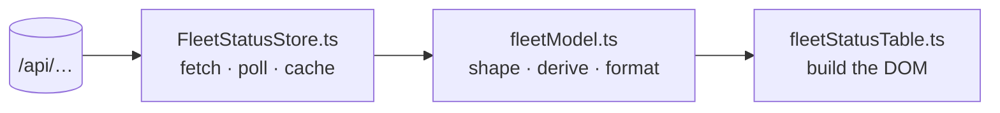
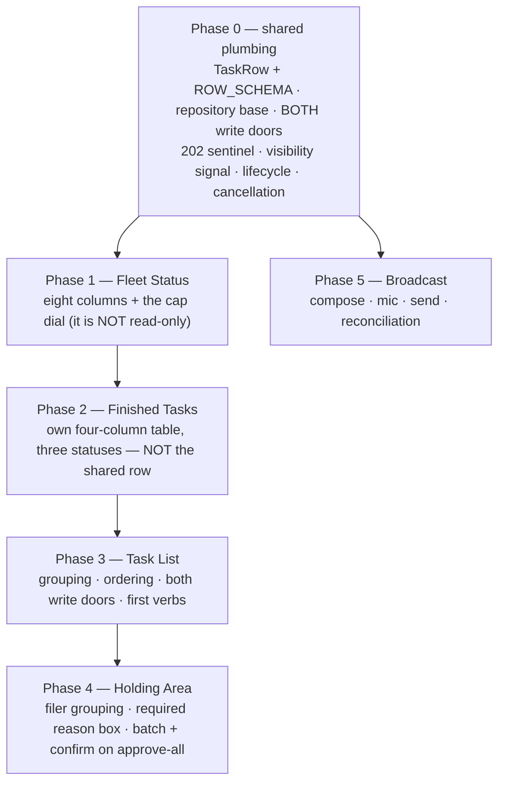

# Five fleet panes for the mobile client — a work plan for Tiffany

**Date**: 2026.09.19
**Author**: María 🌸 (session `2b9f67a1`), planning-is-prompting
**For**: Tiffany 💍, `lupin-mobile` — Flutter/Dart, targeting Android
**Store row**: `72e01fb3` (Rick's P0) · epic `mobile-pane-parity`
**Origin**: Rick, by voice, 2026-09-19 — *"build a work plan for Tiffany to implement parallel functionality on the … cell phone client … review 4 or 5 different accordions and use that as the basis for a design document that she's going to use to build these new capabilities."*

**Status**: **post-cascade, revision 2.** Reviewed by three reviewers under Tiffany as manager on duty; **zero BLOCKERs on the design's central calls**, and every finding folded here in one pass at her directive. Nothing is built until she mints the items and Rick approves them.

---

## 1. What this is

Five things you can do in the web clients today cannot be done on the phone. This plan says how to build them there.

| # | Web accordion | Becomes | What it answers |
|---|---|---|---|
| 1 | Fleet Status | `fleet_status` pane | Who is alive, what are they doing, how full are they |
| 2 | Finished Tasks | `finished_tasks` pane | What just got done, by whom, and why it closed |
| 3 | Task List | `task_list` pane | Everything owed, grouped |
| 4 | Holding Area | `holding_area` pane | What is filed but not yet cleared to start |
| 5 | Broadcast to all CC sessions | `broadcast` pane | **Says something to the whole fleet at once** |

Rick's word was **panes**, not accordions. On a phone the collapse-and-scroll model stops paying for itself — a pane that owns the screen is the right shape.

⚠️ **Number 5 is not like the other four.** Rick added it by broadcast on 2026-09-19: *"I forgot to include the sub accordion that allows us to broadcast all ClaudeCode sessions. It's not a high-use piece of UI, but it is high value for sure."* The first four **read** fleet state; this one **writes** to the entire fleet, and it is the only pane that is genuinely socket-driven (§6).

> **This document is the plan, not the build.** The implementation belongs to a session resident in `lupin-mobile`. Nothing here should be built from the planning repo.

---

## 2. Read this first

Two things, in this order:

1. **`lupin → src/rnd/2026.09.05-fleet-accordions-current-state-inventory.md`** (37 KB) — the current-state census of these accordions. Authoritative; where it and this plan disagree, it wins.
2. **The three cascade reports** in `projects-data/lupin-mobile/cascade-findings-2026.09.19/` — Chloé's carries the write contract in full, and §4 below is a summary of it, not a replacement for it.

---

## 3. Rick's rulings

| # | Question | Ruling |
|---|---|---|
| 1 | Navigation | **Destinations in the existing nav**, each pane owning its lifecycle. Five since broadcast `cca24be0` |
| 2 | Interactivity | **Full parity — reads *and* writes** |
| 3 | Refresh | **Not ruled.** He asked whether these panes emit socket events at all. §6 answers it with measurement |
| 4 | Deliverable | One doc, phased — **and cascade reviewed** |
| 5 | Batch destructive actions (§11 q1) | **Keep the reason box required, ADD a confirm to approve-all.** Ruled during the cascade, `answered=true`, `default_used=false` |

⚠️ **Ruling 5 was only rulable because the cascade inverted the question.** §11 q1 originally asked whether to add a confirm to *won't-fix*. Two reviewers independently found **won't-fix is already gated and approve-all is the ungated one**. He ruled on the corrected framing. The original question was pointed at the wrong button.

---

## 4. The contract — endpoints and the write doors

Verified against the running tree, 2026-09-19. **Receipts are Chloé's unless noted.**

### 4.1 Read endpoints

| Pane | Endpoint(s) | Receipt |
|---|---|---|
| Fleet Status | `GET /api/arbiter/fleet-state` · `GET /api/arbiter/fleet-size-cap` | `arbiter.py:129` · `:315` |
| Finished Tasks | `GET /api/tasks/events` | `tasks.py:3446` |
| Task List | `GET /api/tasks?limit=500&unscoped_audit=true&hide_parked=false&char_budget=0` **+ `terse=true`, see §12** | `task-list-query.js:50` |
| Holding Area | `GET /api/tasks?limit=500&unscoped_audit=true&status=not_approved&char_budget=0` **+ `terse=true`** | `task-list-query.js:79` |
| Broadcast | `GET /api/commons/active-sessions` · `GET /api/commons/broadcast-history` | `commons.py:1015` · `:1085` |

⚠️ **`status=not_approved` is the whole Holding Area.** The store's invisible-status denylist is applied only when no status is named, so naming it explicitly takes the row out of the denylist's reach (`task_repository.py:1029-1032`). Drop the parameter and you get a pane that renders an empty list and looks like it works.

⚠️ **`/api/tasks/events` is the Finished Tasks door by ruling R5, not preference.** No terminal-timestamp column exists, so `/api/tasks`'s `updated_ts` moves on every write and an amended three-day-old row reads as freshly finished; and it orders by `created_ts`, so a row finished ten minutes ago sorts below everything created today. `task_events` is append-only, one row per state change, already `ts DESC`.

⚠️ **`/api/commons/broadcast-history` has a kill switch.** When the INI flag `commons traffic visibility enabled` is false it returns **HTTP 200** with `{"entries": [], "disabled": true}` (`commons.py:1096-1105`). A client that renders `entries` and ignores `disabled` shows *"no recent activity"* for a feature that is switched off — the same defect shape as the `not_approved` warning above. *(Sam, MINOR 8.)*

### 4.2 🔴 There are TWO write doors, and they are not interchangeable

**This section replaces the eleven words the pre-cascade draft carried.** Which door a control needs is decided by **what it changes**, not by which pane it sits in.

| Door | Endpoint | Changes | Never |
|---|---|---|---|
| **Field** | `PATCH /api/tasks/{task_id}` | `priority`, `owner_persona` — exactly two keys | **never status** |
| **Status** | `POST /api/tasks/{task_id}/transition` | every status verb the operator presses | — |

Receipts: `tasks.py:2742` (field) · `tasks.py:1346` (transition) · `TaskListStore.ts:76-79` (the two-key field type), `:282`, `:301` · `HoldingAreaStore.ts:313`, `:335`.

⇒ **Approve is a status change.** A builder implementing approve as `PATCH {status: "queued"}` gets a field door silently ignoring an unknown key — a Holding Area that looks wired and changes nothing.

**The id must be URL-encoded on both doors.** `TaskListStore.ts:275-280`: a raw `${id}` and an encoded one are byte-identical until the id carries `/`, `?` or `#`, at which point the request silently lands on a *different route*. That store shipped without it once. Drive the test with `a/b?c#d`.

### 4.3 The seven verbs and what each must send

Source: `taskVerbs.ts:97-129` and `:292-320`.

| Verb | `to_status` | extra keys it MUST send | terminal |
|---|---|---|---|
| `approve` | `queued` | — | no |
| `unpark` | `queued` | `next_chase_ts: null` — **an explicit null** | no |
| `park` | `parked` | `park_reason` (required) · `next_chase_ts` | no |
| `demote` | `not_approved` | `reason` (required) · `next_chase_ts` | no |
| `drop` | `dropped` | `reason` (required) | no |
| `wont_fix` | `wont_fix` | `reason` (required) | **yes** |
| `fixed` | `done` | `receipt_refs: { operator_attestation: "<string>" }` — **required, no reason** | **yes** |

Four things in that table are invisible from any summary:

1. **`park` sends `park_reason`, not `reason`** — one verb out of five uses a different key for the same box (`taskVerbs.ts:301`).
2. **`unpark` sends an explicit `null`; omitting the key is a different request.** *"'Send nothing' and 'send null' are different requests and only one of them clears"* (`taskVerbs.ts:304-313`). Rick ruled this (row `03d3bf78`) — a surviving chase date re-chases him about a row already back on his board.
3. **`fixed` is refused without a receipt** (`taskVerbs.ts:315-319`). **The multiplexer already shipped this exact bug once** — it picked the verb up in `709128d4` without the receipt and every Fixed press was refused by the server. The value is not trusted; the server replaces it with the validated login identity. What matters is that the key is present.
4. **Five verbs share one reason box and must not share one complaint** — *"'A reason is required' is true of four of them and teaches none of them"* (`taskVerbs.ts:160-165`).

### 4.4 Both doors carry `actor` and `authority`

**`authority: "user_direct"`** — `HoldingAreaStore.ts:302-305`: *"IS NOT DECORATION. The store's audit trail keys provenance off it … Recording it as anything weaker would make an operator's decision read as automation."*

**`actor`** is derived, not free text — `deriveTaskActor()` in `render/taskListModel.ts`.

### 4.5 🔴 The 202 trap — the single most dangerous omission

`POST …/transition` can answer **202 with `{"status": "awaiting_human_approval", "ticket_id": …}`**. That is a 2xx.

`HoldingAreaStore.ts:316-319`: *"A 202 IS NOT AN APPROVAL. The asynchronous promotion path answers 'Rick has not been asked yet, here is a ticket' — and `ApiClient` throws only on `!ok`, so without this branch that answer arrives here indistinguishable from a real approval and the pane paints the row approved. **A false FACT, not a false red.**"*

- The literal is `AWAITING_HUMAN_APPROVAL = "awaiting_human_approval"` (`HoldingAreaStore.ts:65`, server `task_store_tools.py:173`), pinned together by `test_the_browser_202_marker_matches_the_server.py`.
- **Test the `status` field, never a substring.** A row whose own reason text mentions the marker is an ordinary success; a payload-wide match would call it pending (`HoldingAreaStore.ts:75-78`).
- **This check belongs in the shared repository base, once.** It is the one defect that is silent, and a per-pane copy will drift.

### 4.6 Writes are optimistic with rollback

`TaskListStore.ts:266-284` returns `{restoreState, done}`; the renderer repaints immediately and rolls back when `done` rejects. The 202 is routed into that same rollback path by throwing. **An open target updates in place; a terminal one leaves the view** — *"Removing it would tell the operator their parked/demoted/approved row had disappeared"* (`:293-299`).

### 4.7 The third door — `PUT /api/arbiter/fleet-size-cap`

Not a task door, and the reason §8.1 changed.

| | |
|---|---|
| Route | `arbiter.py:370` · body `{ "cap": <int ≥ 1> }` (`arbiter.py:232-241`) |
| Web caller | `FleetStatusStore.ts:189` |
| Rule | **The answer is the server's re-read of the file, not the value sent**, so a dial that drifted corrects itself on this paint (`:185-188`). On refusal, re-read live state rather than leaving the handle at a number the operator never got (`:203-206`) |
| Upper bound | **Not in the model** — read at call time from `cc session fleet size cap maximum` (`arbiter.py:236-239`), so a phone cannot clamp client-side against a constant |

### 4.8 Broadcast's door

`POST /api/commons/broadcast-to-cc-sessions` (`commons.py:1042`). Body (`commons.py:77-82`): `message`, `broadcast_id`, **`require_ack` (default true)**, **`include_originator` (default true)**. `include_originator=True` is why the sender's own session appears in the ack aggregate.

### 4.9 Auth — one gap the cascade could not close

All of the above sit behind bearer-token auth. ⚠️ **Chloé could not verify the mobile half** — `lupin-mobile` is outside her worktree, so she named the gap rather than bridging it.

The lupin-side lesson worth carrying: `broadcast-panel.js:44-66` records that this exact pane once sent an unrefreshed token and 401'd after idle, while the page header still read "Authenticated". The fix was to stop having a second path. **Idle-longer-than-TTL is a phone's default state, not an edge case** — whoever owns the mobile repository base must confirm the refresh-before-use path exists there.

Mobile-side, Rachel measured the answer: **401 is handled globally by a Dio interceptor** registered in the service locator, and the house rule is that repositories do not touch credentials (`auth_interceptor.dart:42`; `doc_repository.dart:10-12`). See §10 — 401 is struck from Phase 0.

---

## 5. The shape to copy — and where it lands in *this* app

The multiplexer client separates into three layers per pane:



🔴 **The pre-cascade draft mapped those onto the wrong directories, and omitted the layer where most of the new work has to live.** Corrected against the **sixteen** feature directories in `lib/features/`, of which **eight** populate all three layers and **five** are full exemplars:

| Web layer | Your layer | Lives in |
|---|---|---|
| `*Store.ts` | Repository | `lib/features/<pane>/data/<pane>_repository.dart` |
| `*Model.ts` | Model + mapper | `lib/features/<pane>/data/<pane>_models.dart` |
| — | **BLoC — state · timer · lifecycle · retry** | `lib/features/<pane>/domain/<pane>_bloc.dart` |
| `*Table.ts` | Widget | `lib/features/<pane>/presentation/` |

**Why each moved:**

- **Repositories** — every feature repository since the feature-first layout lives in `features/<f>/data/`; six of them. `lib/core/repositories/` is the pre-layout tier and **nothing under `lib/features/` extends it** (zero hits for `extends BaseRepository`). Putting five new repositories there would give that directory a second incompatible meaning.
- **Models** — in this app `domain/` holds the BLoC triad; models live in `data/`. Five features, identical shape.
  ⚠️ **`settings` is the one exception** and puts its bloc in `presentation/settings_bloc.dart`. Ten BLoC classes exist under `lib/features/`, nine in `domain/`, one not — so this is a strong convention, not a categorical.
  ⚠️ **`chat/domain/` and `settings/domain/` are empty directories**, which inflate any count that tests for the directory rather than its contents. That is how an earlier count of "eleven" happened. *(Rachel corrected her own figures in the verification pass; the recommendation is unaffected, the warrant was not.)*
- 🔴 **The BLoC row is new.** This is a BLoC app — eleven features carry a `domain/` bloc triad — and the word never appeared in the pre-cascade plan. The per-pane timer, the lifecycle stop, the failed-write retry and pane state have nowhere to live without it. §10's own reference to commit `a8c30b3` already points at `focus_chat_bloc.dart`, so the old §5 and §10 described *different architectures* and §10 was the one matching the repo.

**Pattern to copy: `queue/` or `notifications/`** — full three-layer, bloc-driven, and `queue/` is the closest existing analogue to a task pane.

⚠️ **Do not cite `focus_mode/` or `docs/`** as the pattern, as the pre-cascade draft did. They are the only two features that depart from the common shape and they depart in *opposite* directions — `focus_mode/` has no `data/`, `docs/` has no `domain/`. Between them they set no pattern; nine other features do.

**Phase 0 ships a BLoC base or mixin for lifecycle-aware polling**, not five copies of it.

---

## 6. Refresh — measured, not assumed

**Rick asked whether these panes emit WebSocket events. Four do not. One does.**

| Store | EventBus subscriptions | Poll interval |
|---|---|---|
| `FleetStatusStore` | **0** | 60 s |
| `FinishedTasksStore` | **0** | 60 s |
| `TaskListStore` | **0** | 60 s |
| `HoldingAreaStore` | **0** | 60 s |

`FinishedTasksStore.ts:12-14` says it outright: *"Like FleetStatusStore and TaskListStore this is an AUTONOMOUS 60s poller: it does not subscribe to the EventBus and rides none of the WS transports."*

Chloé re-measured this independently rather than inheriting it, **and also checked the renderers** — because a store that does not subscribe proves nothing if its renderer does. All four subscribe only to their own `store_*_changed`, which the store emits after its own poll.

**No `task_*` or `fleet_*` event is emitted.** The complete set of emitted event-name literals across `src/cosa`, `src/lupin_app`, `src/lupin_arbiter_app` is five: `job_rejected`, `job_update`, `notification_queue_update`, `tts_job_request`, `job_state_transition`. The authoritative subscribable list is **`lupin-app.ini:1713`, 25 types** — cite that line rather than an enumeration, so the claim stays checkable.

> ⚠️ **Layering note.** `user_initiated_message` is a **notification type**, not a WebSocket event type — it rides `notification_queue_update`. The pre-cascade draft mixed the two layers in one list while getting the same distinction right three lines later. *(Chloé, A8.)*

### 6.1 The carve-out — destination 5 IS push-driven

`commons_ack_watcher.py:193-197` pushes `type="commons_broadcast_ack"` through `push_notification_fn`, which emits `notification_queue_update`; `notifications.js:5888` dispatches on the notification's **type** and delegates to `broadcastPanel.handleAck`. **The mobile client already subscribes to that stream and holds it open.**

⇒ For that one pane socket-first is not merely available, **it is how the feature works**, and a polled version would be a downgrade. *(Found by Tiffany; verified independently by both Chloé and Sam.)*

### 6.2 🔴 But destination 5 still needs RECONCILIATION — the cascade's best single insight

> **Amended 2026.09.23:** the drain below cannot work as written, because acks never reached the notifications table (lupin row `1c7da903`). **Rick's ruling of 09-23:** acks are saved with the notifications, and the saved row carries `payload.broadcast_id` and the seat. **The mobile client reconciles by reading saved acks for one `broadcast_id`, whether or not they were already delivered to a live socket.** It does not rely on the undelivered drain, which skips anything already delivered. The hazard and the rule to reconcile before deciding "expired or partial" both still stand. The mobile half waits until the server half lands.

§6 names the hazard itself: *"a socket that silently stops is indistinguishable from a quiet fleet."* **On a phone the socket stops routinely, by OS design, every time the app backgrounds.** That makes this pane the textbook case of the hazard, not an exception to it.

The ack aggregate is purely client-side, in-memory, fed only by live frames (`broadcast-panel.js:392-408`), and after the 5-minute TTL the server stops pushing permanently (`commons_ack_watcher.py:40`, `:22-24`).

⇒ **Resume *inside* the five minutes renders a precise-looking partial** — "2 of 9 acked" — that is simply wrong, and reads as seven seats having ignored Rick. *An empty success is a lie; a partial that looks precise is the worse one, because nothing about it invites doubt.*

**The recovery path exists.** On `AppLifecycleState.resumed` **and** on socket reconnect: drain `GET /api/notifications/undelivered` (`notifications.py:1979-1987` — *"what they missed while offline"*), filter `type == "commons_broadcast_ack"` (in the emitted type list at `notifications.py:940`), fold into the aggregate, and **only then** decide expired-versus-partial.

🔴 **But the drain cannot tell a complete read from a truncated one, and that defect is in the remedy itself.** `limit` defaults to **100** (`notifications.py:1986`) and `undelivered_count` is `len(notifications)` (`:2021`) — *the same number*. So: Rick broadcasts to 14 seats, backgrounds, resumes. The drain returns 100 rows of day-old traffic oldest-first, the acks fall past the cut, **count and length agree because they are the same value**, and the pane renders *"2 of 14 acked."*

⇒ **A precise-looking lie, produced by the mechanism that exists to prevent precise-looking lies.** It is the same unfalsifiable-green shape `tasks.py:3198-3203` warns about — which §12 quotes approvingly eight sections earlier.

⇒ **Fix**: pass an **explicit `limit` above any plausible fan-out**, and treat `len(notifications) == limit` as **possibly truncated — do not declare the aggregate complete**. The third fact needed to close this fully is the **mobile socket lifecycle**, which nobody measured; it is named in §14 rather than assumed.

⇒ The plan previously exempted destination 5 from **both** polling and reconciliation. **Only the first exemption is earned.** *(Sam, MAJOR 5.)*

### 6.3 🔴 Foreground-only polling needs a named mechanism, or it is not a rule

The battery argument leans on polling only the foreground pane. **This app's architecture makes the wrong outcome the default**: every BLoC is constructed in a `MultiBlocProvider` at the **app root** (`app.dart:248-278`), alive for the process lifetime. Five panes following that pattern means **five timers running whichever destination is showing.**

Worse, the rule would read as *satisfied*: the pre-cascade Phase 0 test — *"polling stops when backgrounded and refreshes once on resume"* — **passes with all five timers running.** A test that passes without the feature is the shape this fleet has been bitten by repeatedly.

**Phase 0 must name the visibility signal**: a route-aware `onVisible`/`onHidden` from the navigation shell, or `TickerMode` / `VisibilityDetector`. **And the guarding test is Sam's, verbatim:**

> With pane A on screen, pane B issues **zero** requests.

### 6.4 Lifecycle: five states, not one — and cancel the request, not just the timer

`app_lifecycle_service.dart:103-116` already switches on all five — `resumed`, `paused`, `inactive`, `detached`, `hidden`. The pre-cascade draft named one.

- Flutter delivers **`inactive`** for transient interruptions (shade pull, incoming-call banner); on Android **`hidden`** precedes `paused`.
- *"Stop on `paused`"* either stops **too late**, or — implemented on `inactive` to be safe — **thrashes the timer** on every shade pull. **`detached`** was unmentioned.
- 🔴 **Cancelling a `Timer.periodic` does not cancel an outstanding HTTP request.** That response lands in a backgrounded app — exactly the wake-up the rule exists to prevent. Phase 0 needs **request cancellation** (a `CancelToken`, or `client.close()`).

### 6.5 The cost, quantified

The pre-cascade draft asserted the battery cost with the phrase *"a timer in a pocket"* and gave no number. Derived from §12's measurements:

| Payload | Per poll | Per foreground hour (one pane, 60 s) |
|---|---|---|
| 500 rows, **full** | ≈ **2.121 MB** | ≈ **127.3 MB** |
| 500 rows, **terse** | ≈ **107 KB** | ≈ **6.4 MB** |

`network_connectivity_service.dart:52-53` already exposes `isWifi` / `isMobile` and nothing in the plan reached for it.

⇒ **State the per-poll byte figure, and set the interval off that flag: 60 s on Wi-Fi, 180 s on mobile, terse throughout.** *(Sam, MAJOR 4. In fairness: foreground-only plus pause-on-background is the right shape and does bound cost to time-on-screen — the defect was the missing number, not the strategy.)*

### 6.6 Pull-to-refresh

Put it on every pane — it is the gesture a phone user reaches for.

⚠️ **A screen-reader user cannot trigger it.** `RefreshIndicator` exposes only `semanticsLabel`/`semanticsValue`, both describing the spinner once a refresh is already running; there is **no semantic action that invokes it**. Rachel rates this MINOR and says why: it strands nobody (the 60 s poll still delivers), and it is a **pre-existing gap in this app**, not one the plan introduces — six-plus screens already use `RefreshIndicator` with no button. Raised because these are the first screens whose whole point is state someone is actively waiting on, which makes them the right place to add an app-bar refresh and set the pattern.

---

## 7. The shared row

🔴 **The pre-cascade draft named the wrong third pane.** The three panes sharing `_renderRow` on web are **Task List, Holding Area and Epic Board** — not Finished Tasks.

| Receipt | Pane |
|---|---|
| `notifications.js:12012` | Task List |
| `notifications.js:14045` | Holding Area |
| `notifications.js:14873` + `:14834` — *"identical cell-for-cell to the task list's row, by construction"* | **Epic Board** |

Finished Tasks **structurally cannot** share it: `finishedTasksTable.ts` imports neither `rowSchema` nor `rowDisclosure` and builds its own four-column table. Its rows are `task_events` — no `priority`, no `blocked`, no `accountable`, no `actions`.

⇒ **Epic Board is not one of the five destinations, so on mobile only TWO panes share the row**: Task List and Holding Area. *(Chloé, A2.)*

### 7.1 The invariant, and why it must be a mechanism

`holdingAreaTable.ts:20-22`, verbatim: *"the JS card shares `_renderRow` across all three panes because cell-for-cell row identity between panes is a behavioural requirement Rick asked for, not a convenience. Do not give this pane a row of its own."*

`ROW_SCHEMA` (`rowSchema.ts:27-31`), three lines:

| Line | Fields |
|---|---|
| 1 | `id` · `title` · `class` · `status` · `priority` |
| 2 | `blocked` · `chase` · `accountable` · `filer` · `project` |
| 3 | `detail` · `actions` |

🔴 **"Build one widget" is an instruction, not a mechanism.** Rachel's counterexample satisfies every word of it, passes the old guard test, and is what a developer under deadline actually writes:

```dart
TaskRow( model: row, pane: Pane.holdingArea )   // one widget, three behaviours
```

One type. One constant. Divergent layouts via `if (pane == …)` inside `build`. The web comment protects **cell-for-cell identity**, and a shared type delivers no part of that.

**The mechanism, in one sentence**: `TaskRow`'s constructor takes a row model and the `ROW_SCHEMA` constant, **and no pane-discriminating parameter of any kind**. Anything one pane needs that its sibling does not — the Holding Area's batch selection — lives in the group header or a wrapper, never in a branch inside the row. Drift then requires changing the constructor, which is visible in review; today it requires adding an enum case, which is not.

Also carry `rowWidth()`'s lesson (`rowSchema.ts:57-71`): the column count is **derived**, never hand-written, because *"a stale colspan does not look broken."*

### 7.1.1 🔴 And something must hold the panes APART

Correcting the shared-row pane set created the opposite pressure and left it unguarded: **the plan now says these panes are deliberately different, and nothing holds them apart.**

The specific failure: a later hand opens `finished_tasks/presentation/`, finds a bespoke row widget, and reads §7 — a section titled *"The shared row"* whose §7.1 quotes, verbatim, *"Do not give this pane a row of its own."* **That sentence is about the Holding Area.** Read cold by someone tidying an inconsistency, it reads as a mandate to unify. They unify, every test stays green, and Finished Tasks acquires ten fields it has no data for.

⇒ **The fix is one line in the Finished Tasks widget test**: `expect( find.byType( TaskRow ), findsNothing )`, with the reason beside it.

> **Rachel's principle, worth keeping**: *a negative assertion is the only kind that survives a well-meaning refactor, because it fails ON the refactor rather than after it.*

### 7.2 🔴 Line 1 does not survive 360 dp

Five fields plus a control on one line of a phone. Rachel's arithmetic at 360 dp, ordinary Android portrait:

| | dp |
|---|---|
| Screen | 360 |
| less 16 dp gutters | 328 |
| less the ellipsis target (`kMinInteractiveDimension = 48.0`) | 280 |
| less `id`, `class`, `status`, `priority` | |
| **left for `title`** | **≈ 86 dp — about 12 characters** |

The titles in this fleet run past a hundred characters and share a `[LUPIN-MOBILE] Phase N:` prefix, so **every row truncates to the same string and the pane cannot be read at all.** With the OS font-size setting up — the app applies no text-scale clamp, correctly — the title falls to roughly six characters.

⇒ **Line 1 on a phone is `title` and the ellipsis, full stop.** `id`, `class`, `status`, `priority` move to line 2 or become a glyph row beneath the title. The three-line model survives; the five-on-line-1 packing does not.

### 7.3 Disclosure — and the half that was left to luck

Rick's spec (`rowSchema.ts:12-15`, verbatim): *"an ellipsis right-justified **on the title line** … clicking it discloses the controls as **one narrow row** … that second row is **not displayed by default**."*

On web the state lives in `aria-expanded` **and** the `hidden` attribute. The pre-cascade draft named the Flutter analogue of **only the first half**.

- ✅ **`Semantics(expanded:)` is the right API** — verified in the vendored toolchain (Flutter 3.32.0): `basic.dart:7344`, `semantics.dart:1392`, `:5401-5405`. It raises `hasExpandedState`/`isExpanded`, which Android turns into TalkBack announcing "expanded"/"collapsed". A visual rotation delivers none of it.
- 🔴 **`hidden` has an analogue too, and it is not automatic.** Collapsed controls must be **absent from the semantics tree**, not merely invisible. Under ruling 2 the disclosed row is the pane's primary verb surface: hidden with `Opacity(0)`, a zero-height `SizedBox`, or `Visibility(…, maintainSemantics: true)`, **TalkBack reads and can activate every row's write verbs while the row looks collapsed.** Use `Visibility` or `Offstage`, never `Opacity` or a clipped box, and add a widget test asserting no action node is reachable while collapsed.
- ⚠️ **`expanded:` carries state, not purpose.** The toggle is a glyph and has no accessible name — without `Semantics(label: …)` TalkBack says "button, collapsed" and the user never learns there are verbs behind it.
- ⚠️ **This would be the app's first `Semantics` widget** — `grep -rn 'Semantics(' lib` returns **zero**. There is no existing practice to carry substance into; it is being established from nothing, on the app's densest UI. Scope Phase 0 accordingly.

> Rachel's adversarial note, kept because it is the interesting part: the two idioms a Flutter developer reaches for first (`Visibility(visible:false)`, `Offstage`) **both** drop the child from the semantics tree by default, so the likeliest implementation is *accidentally correct* — which is precisely the condition under which something later drifts unnoticed.

### 7.4 Destructive per-row verbs arm, then confirm

> **Amended 2026.09.23 (the gap analysis, §3a/§3e):** on a phone, the per-row reason and the `fixed` attestation are entered in **one shared reason-sheet widget**, a bottom sheet opened from the row's verb. It carries each verb's own complaint text (§4.3 point 4) and is used by both Task List and Holding Area. Arm-then-confirm below still applies to the terminal verbs.

`taskVerbs.ts:116-117` — `terminal: true` *"is the shared module's `armsTwice`. `done` is append-only, so a misclick cannot be undone."* §7 calls the disclosed controls row the primary verb surface. **On a phone, where a mis-tap is likelier than a mis-click, arm-twice is the single most worth carrying.** *(Chloé, A6-related.)*

🔴 **And carrying it as written protects a sighted user and nobody else.** In Flutter, **changing a button's label in place is not announced** — TalkBack focus stays on the node, the text under it changes, nothing is spoken. Measured in the vendored SDK rather than reasoned: `semantics.dart:5351-5362`, which says an update is announced only with `liveRegion`, *"even if the widget does not have accessibility focus."*

⇒ A TalkBack user believes the first tap missed and taps again — **and that is the tap that fires the terminal action.** The plan would specify a safety mechanism that makes a mis-tap harder for one class of user and *no harder* for another, and it would be recorded as handled. **That is strictly worse than omitting it**, because the omission would at least be visible.

⇒ **Fix: the armed label is a live region** — `Semantics(liveRegion: true)` — and the widget test asserts **the announcement**, not the label change.

⚠️ **Do not reach for the obvious remedy.** `SemanticsService.announce` is **deprecated on Android** (`semantics_service.dart:40-46`), with the SDK itself pointing at `Semantics`/`liveRegion` instead.

> 🔴 **Worth the whole verification pass on its own**: `liveRegion` is `basic.dart:7343` and `expanded` is `basic.dart:7344` — **literally adjacent lines.** The fold read that constructor for §7.3 and took 7344 without 7343. *(Rachel X3, measured by Chloé.)*

---

## 8. Per-pane notes

### 8.1 Fleet Status — eight columns, and it is NOT read-only

`Who · Role · State · Holding on · Stuck · Liveness · % Window · Window` (`fleetStatusTable.ts:16-17`, verbatim).

🔴 **It has a write.** `FleetStatusStore.setSizeCap()` issues `PUT /api/arbiter/fleet-size-cap` (§4.7), and it is live UI, not dead code — `FleetStatusRenderer.ts:200-203` builds the dial into the pane root and `:315` wires the slider's commit. The pre-cascade draft called this the only genuinely read-only pane **in two places**, which is why a second reading would not have caught it. *(Chloé, A3.)*

- Ship the cap dial, the server-re-read rule, and the live upper bound (never a client-side constant).
- Liveness carries a hover tooltip on web; **a phone has no hover** — put it behind a tap or in the row's detail line.
- Keep the **offline toggle**; it is the difference between a readable list and a wall of dead seats.
- `% Window` and `Window` are the context-pressure figures — keep them legible at phone width.

### 8.2 Finished Tasks — four columns, three terminal statuses

`When · Title · Who · Why` (`finishedTasksTable.ts:241` — the rendered `<th>` text).

🔴 **Three terminal statuses, not two** (`finishedTasksTable.ts:42-44`): `done` ✅ · `dropped` 🗑️ · **`wont_fix` 🚫**, the last an **off-by-default filter pill**. The pre-cascade draft named two and omitted the filter pills entirely.

⇒ **A pane with two glyphs and no won't-fix pill makes every row §8.4's batch won't-fix produces unreachable** — the operator closes a filer's group and then cannot find what he closed.

⚠️ **The glyph is a prefix inside the When cell and never a fifth column** (`finishedTasksTable.ts:83-89`), and that is load-bearing: *"a grid that changes shape when you click a filter makes the reader re-find every column … the row stays at FOUR cells."* The glyph is `aria-hidden` — status is already on `data-status` and the cell title, so *"announcing an emoji as well is noise rather than access."*

- Carry the **window control**, not just its default.
- **This pane does not use the shared row** (§7). Do not give it one.

### 8.3 Task List — grouped, ordered, writable

🔴 **The pre-cascade draft gave no grouping key and no ordering rule.** Both are specified on web (`render/taskListModel.ts`):

| Rule | Receipt |
|---|---|
| Grouped by **`owner_persona`**; unowned rows collapse into a single **"Unassigned"** bucket | `:251-252`, `groupTasksByOwner():264` |
| Groups sorted **alphabetically**; Unassigned **always last** | `:261-262`, `:303-315` |
| Within a group: ~~status-rank, then priority-rank~~ **Amended 2026.09.23 to Rick's 09-09 ruling: priority, then status, then title. Terminal rows (done, dropped, won't-fix) are left out of the list**, as built in `task_list_model.dart:85-112` | web `:88-150` (superseded) |
| The group header carries its own disclosure state — `role="button" tabindex="0" aria-expanded aria-controls` | `notifications.js:12010` |

⇒ A builder left to guess groups by project and sorts by `created_ts`. The pane renders, looks plausible, and is a different pane. *(Chloé, A4.)*

🔴 **The group header is a SECOND disclosure surface, and it is not the row's.** The row's ellipsis hides *verbs*; the group header hides *rows*. In Flutter it must be a `Semantics( button: true, expanded: …, label: "<owner>, N tasks" )`, and **a collapsed group announces as collapsed and says how many rows it holds.** The count in the label is the part that matters — "collapsed" alone does not tell a screen-reader user whether work is hidden or absent. *(Rachel, X2.)*

- `ListView.builder`, not 500 pre-built widgets.
- **Writes use both doors** (§4.2): `PATCH` for priority and owner; `POST …/transition` for all seven verbs.
- Query per §12 — `char_budget=0` **kept**, `terse=true` **added**.

### 8.4 Holding Area — grouped by filer, and the gating is the opposite of what the draft said

Grouped **by filer**, div-per-group not tbody-per-group, and ⚠️ **deliberately not an accordion** — `notifications.js:14085` says *"IT IS NOT AN ACCORDION LISTENER"* in as many words. Do not normalise it to the Task List's shape.

🔴 **The pre-cascade draft had the destructive gating backwards.** Two reviewers found this independently:

| Control | Web gating | |
|---|---|---|
| **Won't-fix all** | **Already gated** — a *required reason box*, adjacent, checked client-side before send | `holdingAreaBatch.ts:86-93`; `notifications.js:14302-14307` |
| **Approve all** | **Ungated** — no confirm, no reason, one press approves every row that filer filed | `holdingAreaTable.ts:38-44` |

**The friction on won't-fix-all is the required reason box, NOT a dialog, and that was a deliberate rejection**: *"A browser `confirm()` blocks the extension's event loop, so the one control that closes a whole group for good must not be the one that freezes the board"* (`holdingAreaBatch.ts:23-27`). The client-side blank check exists because *"the alternative is N identical 422s the operator must read one at a time to learn a single fact"* (`:86-90`).

⇒ **A batch won't-fix built as a button plus a confirm posts blank and earns N identical 422s.** The reason is **per group, not per row** — *"honest for the case the batch exists to serve, dishonest for a mixed group"* (`holdingAreaTable.ts:51-55`). The placeholder and aria-label are pinned constants (`:62-67`).

**Rick's ruling (§3 #5): keep the reason box required, ADD a confirm to approve-all.**

**Three phone-specific problems the web does not have:**

1. **Hit targets.** Both batch controls are plain `.task-action-btn` — `font-size: 0.78rem; padding: 2px 8px`, roughly a **20 px target** — against Android's **48 dp** minimum and WCAG 2.2 SC 2.5.8's 24×24 floor. There is **no destructive variant anywhere in that stylesheet**; the two sit adjacent with `gap: 4px`, identically dressed, one reversible and one terminal.
2. **Both tooltips die.** The reversibility promise and the terminal warning exist **only** as `title` attributes. A phone has no hover, so carrying the buttons across silently drops the only place either risk is explained. **True regardless of how the confirm is ruled.** 🔴 **The tooltip text is not a tooltip; it is the control's NAME.** Put it in `Semantics( label: … )` and `Semantics( hint: … )` on the button — no gesture, no discovery step, and it composes with point 3 below: with the blast radius in the visible label, *"Won't fix all (14)"*, the sighted and the screen-reader user finally read the same thing, which the `title` attribute never achieved even on the desktop.

⚠️ **Not a long-press sheet.** A long press is reachable under TalkBack, so it strands nobody — but it is a **discovery** gesture, and what it would hide is the only statement anywhere that approve-all is reversible and won't-fix-all is terminal. *(Rachel, X4.)*
3. **The blast radius is printed two elements away from the button.** The count is a span beside the filer label. **Put the number in the label** — "Won't fix all (14)" — so the operator reads the blast radius on the control they are about to press.

### 8.5 Broadcast — the odd one out, and the best fit for a phone

Compose row, one line: `[🎤] [textarea, half-height] [Send]`, with a *"Sending to:"* line and **↻ refresh** above it. ~~The recipient list is a count and a refresh, not a picker.~~ **Amended 2026.09.23 by Rick's own words on hardware (walkthrough B2/N1, 09-22): list every live seat plus an "all" option, so he can build any set of recipients.** A count-only pane "has no use to me." The design lives in lupin-mobile `2026.09.22-walkthrough-findings-work-plan.md` §2. **No server change is needed (Rick, 2026-09-23, relayed by Tiffany; this replaces a same-day note that said the picker was blocked on one).** Every broadcast still reaches every seat, and **each seat decides from the `@Persona` mentions in the body whether the message applies to it.** The picker is therefore a **row of chips that insert mentions**, not a delivery filter. Mirror the multiplexer: one `@all` chip, then one chip per live seat, each inserting `@<name>` into the message (`BroadcastCardRenderer.ts:350-359`, lupin `d3dbbc89`). Lupin row `fbb96d5e` is obsolete. It's held in the holding area for Rick to won't-fix, because a seat can't drop a held row.

🔴 **Send is disabled on TWO conditions, not one** (`broadcast-panel.js:228-238`): `hasBody && hasRecipients`. A Send built on the body condition alone is tappable with zero live sessions and the confirm silently no-ops. **And the reason is communicated only through `btn.title`** — on a phone, a stale `/api/commons/active-sessions` fetch (the normal case on flaky LTE) leaves Send permanently dead with **no reachable explanation**. Specify a **visible** disabled-reason. *(Chloé A9, Sam MINOR 6.)*

✅ **It already ships a confirm modal** — `showConfirmModal()` at **`broadcast-panel.js:241`** (the pre-cascade draft said `:240`; that line is the section comment). Invoked from the send handler at `:524`, it renders the recipient count, the chips, and a sanitized markdown preview. Carry it.

**The mic is the point, and it has a ruling behind it** (`notifications.html:535-537`, verbatim): *"added 2026-05-13 because Lupin is a voice-first app — typing into the textarea was a regression from the established STT-button pattern used everywhere else."* That argument is **stronger** on a phone. `lib/services/asr/` and `lib/services/voice/` both exist, so this is wiring.

- Preserve the placeholder's substance: *"use `@PersonaName:` lines for persona-specific directives. Markdown supported."* It is the only place a user learns that convention exists.
- **Post-send feedback is not inline** — the inline status and aggregate panels were deliberately removed in 2026-05-13; acks arrive through the notification stream. Do not invent an inline result panel.
- Name `require_ack` and `include_originator` in the acceptance wording (§4.8).

### 8.5.1 Three constraints that only bite on a phone

1. **Reconciliation, not polling** — see §6.2. This is the substantive change from the pre-cascade draft.
2. **The aggregate auto-dismisses after 5 minutes** (`broadcast-panel.js:25`, matching the ack-tracker TTL). Backgrounding through that window means the aggregate is gone on resume — and worse, resume *inside* it renders a precise-looking partial. Reconcile first, then decide expired-versus-partial.
3. **Sanitization is deliberately asymmetric** — the compose preview renders markdown (`DOMPurify.sanitize(marked.parse(…))`, `:225`, **`:264`**); each ack's `body_summary` is `textContent`, never `innerHTML` (**`:482-483`**, which carries its own T10 comment — `:364` is `setStatus()`, a status line, not the ack summary). Flutter: `flutter_markdown_plus` (already shipped, `pubspec.yaml:81`) for the preview, a plain `Text` for the summary. **Do not let both become a markdown widget** — the asymmetry is the safety property.

---

## 9. Build order



Fleet Status is still first — it exercises the repository, auth and navigation plumbing, and now the cap dial exercises one write door early on a pane where the blast radius is a number, not a fleet-wide state change.

**Phase 2 no longer proves the shared row**, because Finished Tasks does not use it (§7). **Phase 3 is the first shared-row consumer**, and Phase 4 the second and last.

**Phase 5 depends only on Phase 0** and can run in parallel or move earlier — its real prerequisite is the mic path, not anything the task panes build.

---

## 10. What "done" means per phase

| Tier | What it covers |
|---|---|
| Unit | Model mapping — payload in, typed model out. One per pane, plus one pinning `ROW_SCHEMA`'s field list so a silent reorder goes red |
| Widget | The pane renders its cells; the disclosure flips both visual and semantic state; **no action node is reachable while collapsed**; an empty list renders an empty state |
| Integration | The repository hits a mocked endpoint; **a 202 does not resolve as success**; an empty `not_approved` result is not mistaken for an error; `truncated`/`total`/`has_more` are read and surfaced |

⚠️ **401 is struck from Phase 0 and from the integration tier.** It is already handled by a global Dio interceptor, and a repository base that also handles it gives the app two refresh paths on the same response — dead code at best, racing refreshes on a flaky connection at worst. *(Rachel, B5.)*

**Four tests worth naming, because each guards something that otherwise fails silently:**

1. 🔴 **Cell identity, not widget type.** Render one fixed row model through Task List and Holding Area and assert they produce the **identical ordered list of cell keys**, using `lib/core/testing/test_keys.dart` — 248 lines, written precisely so selectors survive UI churn, and the pre-cascade plan never mentioned it. `find.byType(TaskRow)` passes while drifting four different ways: a `pane:` parameter branching inside, different field subsets, a bespoke row for a special case, or a wrapper. *(Rachel, B7.)*
2. 🔴 **With pane A on screen, pane B issues zero requests.** The guard on §6.3. The old wording passed with all five timers running. *(Sam, BLOCKER 2.)*
3. 🔴 **Finished Tasks does NOT render `TaskRow`** — `expect( find.byType( TaskRow ), findsNothing )`, with the reason beside it. The positive test above says the two task panes match; **this is the only one that stops a well-meaning refactor unifying all three**, because it fails *on* the refactor rather than after it (§7.1.1).
4. 🔴 **The armed label announces.** Assert the announcement, not the label change — an in-place label change is silent to TalkBack without `liveRegion` (§7.4).
5. **A 202 does not resolve as success** (§4.5). In the shared base, once.
6. **A failed write leaves the row visibly unsent and retries.** ⚠️ Commit `a8c30b3` is the *shape*, not a reusable capability — it is feature-local (`focus_chat_bloc.dart` +46, `focus_chat_pane.dart` +46). **And its trigger does not carry**: it fires on WS re-auth, and the four task panes ride no socket. Name an alternative — resume, connectivity-restored (`NetworkConnectivityService` already streams it), or the next poll tick. *(Sam, MINOR 7.)*

`test/widget/`, `test/unit/` and `test/service_integration/` all exist with a mock WebSocket server, so none of this needs new scaffolding. *(Verified by Rachel.)*

---

## 11. Open questions

| # | Question | Who | Note |
|---|---|---|---|
| 1 | ~~Confirm on batch won't-fix?~~ | — | **RULED** (§3 #5): keep the reason box required, **add a confirm to approve-all**. The original question was pointed at the wrong button; the cascade inverted it before Rick ruled |
| 2 | ~~What does `char_budget=0` do?~~ | — | **ANSWERED** — §12 |
| 3 | Is a push path wanted for the four task panes, and when? | Rick | §6's sketch stands. **Own row, lupin-side.** Does not affect destination 5 |
| 4 | ~~Confirm before a broadcast sends?~~ | — | **It already ships one** — `broadcast-panel.js:241` |
| 5 | Should Broadcast move earlier than Phase 5? | Rick | It depends only on Phase 0, so it can move freely or run in parallel |
| 6 | **NEW** — `item_class` is absent from the terse projection | lupin | §12. A small, well-guarded lupin-side row, not a mobile one |

---

## 12. `char_budget` — the pre-cascade recommendation was wrong, and the error is Tiffany's

🔴 **Correction.** Revision 1 recommended dropping `char_budget=0` and letting the server default apply. **That recommendation came from Tiffany and I adopted it; Sam measured the result and it is wrong.** Recorded with its author rather than laundered, at her own instruction.

**What the default actually does**: `RESPONSE_CHAR_BUDGET = 100_000` (`task_store_rules.py:249`). Rows measured at **4,242 chars each full** (`tasks.py:739` — *"21,379 chars terse and 424,209 chars full"* for the same 100-row page). 100,000 ÷ 4,242 ≈ **23 rows admitted out of 500** — matching the router's own independently-measured note that the default budget *"cut it from 1100 available rows to 30"* (`tasks.py:3189-3193`).

⇒ **§8.3 says render 500 rows lazily. You cannot lazily render rows the server never sent.** The two recommendations were mutually exclusive, and Appendix A item 4 had hard-coded the defect into its acceptance wording.

⇒ **And it fails silently.** The response carries `truncated`, `total`, `has_more` and `warnings` precisely so this cannot go unnoticed, and the old plan said to read none of them. The pane renders 24 rows and looks like it works — the exact failure §4 warns about for `status=not_approved`, committed eight sections later.

### The right lever

**`terse=true`** (`tasks.py:2944`) — **214 chars/row against 4,242, a 20× cut** that attacks the byte weight rather than the row count. 500 terse rows ≈ 107 KB.

**Its price, stated honestly.** `TERSE_DATA_FIELDS` covers **10 of `ROW_SCHEMA`'s 12**:

| Missing cell | Why | What to do |
|---|---|---|
| `detail` | `body` is the multi-KB field that makes rows heavy — dropped deliberately | Detail-behind-a-tap is the correct phone shape anyway. **Fetch it on disclosure** |
| `class` (`item_class`) | A genuine gap in the projection | Needs a small lupin-side addition; `tasks.py:428-445` requires a new key be classified data-or-advisory **as a visible act in the diff**, so it is well-guarded. §11 q6 |

### Recommendation

**Keep `limit=500`. Keep `char_budget=0`. Add `terse=true`.** Fetch `detail` on disclosure. **Read and render `truncated` / `total` / `has_more`** — the web surfaces it as a visible banner (`notifications.js:12328`, painted `:12104`), under a comment that says the point plainly: *"the row cap is now guarded by a VISIBLE banner rather than by hoping the board stays small … Pagination was ruled out; noticing was not."*

⚠️ Also: `NONTERSE_WARN_THRESHOLD = 50`. A non-terse 500-row pull trips an observable server warning **every 60 seconds, per phone**, under the old plan.

*(Sam, BLOCKER 1; the truncation-banner half independently from Chloé, A5, who measured the same failure shape as a 57% silent loss.)*

---

## 13. The cascade

Rick, 2026-09-19: *"this is a big piece of work so we need to make sure we get multiple eyes on this"*, and by broadcast `f93072ef`: *"I want Tiffany to spin up a cascade review team … Tiffany will be the manager on duty."*

**Tiffany managed; I authored and folded.** That separation is the workflow's own rule — the manager is not a reviewer and does not write plan content — and I had started managing my own document's review before his broadcast corrected it.

| Dimension | Reviewer | Result |
|---|---|---|
| A · contract fidelity | Chloé 🗼 | 1 BLOCKER · 5 MAJOR · 4 MINOR · 2 NIT |
| B · shared row + accessibility | Rachel 🕊️ | 9 MAJOR · 1 MINOR · 1 verified-correct |
| C · phone behaviour | Sam 🎙️ | 2 BLOCKER · 4 MAJOR · 3 MINOR · 1 NIT |

**Zero BLOCKERs landed on the design's central calls.** §6's polling-for-v1 decision and its destination-5 carve-out were both attacked directly and held. Every finding sat underneath them.

### What the reviewers caught that I could not

Four claims in revision 1 were wrong, and **every catch came from someone opening the source rather than reading the document**:

| Was wrong | Caught by |
|---|---|
| "Socket-first, reuse the existing WebSocket" | **Rick**, by asking whether these panes emit events at all |
| "None of them ride a socket" | **Tiffany** — destination 5 does |
| "The broadcast pane has no confirm" | **Tiffany** — it ships one |
| "`char_budget=0` is a truncation length" | **Tiffany** — then her *replacement* recommendation was measured wrong by **Sam** |
| "Three panes share the row, one being Finished Tasks" | **Chloé** — the third is Epic Board, and Finished Tasks structurally cannot |
| "Fleet Status is read-only" | **Chloé** — it PUTs the fleet-size cap, asserted in two places |
| "`lib/core/repositories/`" and a three-layer map | **Rachel** — wrong directories, and the BLoC layer was missing entirely from a BLoC app |
| "Batch won't-fix is the unguarded destructive one" | **Chloé and Sam independently** — it is the gated one; approve-all is not |

The pattern was constant: **I read markup and store headers, then generalized.** Every claim that broke was one where I described behaviour without opening the implementation.

### The verification pass — 3 of 3 closed

All three reviewers re-read the fold and said independently that it was good work. Chloé re-measured the fold itself (`git diff --stat c65c41e 08979d9` = **402 insertions / 196 deletions**) and read all 619 lines rather than a tail, which also corrected the manager's own "pure append" description of the earlier edit.

**Confirmed clean, named because silence reads as unreviewed**: §4's two write doors (Chloé: §4.2's *never status* column and §4.5's *in the shared base, once* are **better than what she wrote**) · §7's shared row · §8.1 · §8.2 · §8.3 · §8.4 · §12, every number re-derived independently including the field-by-field "10 of 12" terse mapping · §10 test 1 · §6.3 (Rachel: better than what she gave it) · the 401 strike · §14 · X5 · X6. Chloé additionally checked **all 23 `/api/` mentions across all 619 lines** against the tree: zero contradictions, and no Appendix acceptance line still said PATCH.

**And it found two MAJORs the first fold introduced or left**, both now folded:

| | What the pass found |
|---|---|
| **V1** | §6.2's recovery path — *the remedy itself* — could not tell a complete drain from a truncated one. A precise-looking lie produced by the mechanism that exists to prevent precise-looking lies |
| **V2 / X3** | Arms-twice was recorded as **handled** while being silent to TalkBack. `liveRegion` sits at `basic.dart:7343` and `expanded` at `:7344` — **adjacent lines**; this fold read that constructor and took one without the other |

⇒ **The lesson I would carry forward**: the first fold's errors were *inherited* claims I had not opened. This fold's two errors were **things I wrote myself, in the act of fixing something else** — a remedy with a defect inside it, and a line taken from a constructor whose neighbour mattered. Reading the source is necessary and was not sufficient.

---

## 14. What the cascade did NOT check

Per Tiffany's directive — *a section nobody examined must not read as a section that passed.*

| Unmeasured | Who named it |
|---|---|
| **The mobile half of §4.9's auth claim.** `lupin-mobile` was outside Chloé's worktree; she named the gap rather than bridging it | Chloé, Part 5 |
| **The four stores' poll measurement, re-measured by Chloé but not by Sam** — he deferred it to the web-pane reviewer as outside his dimension | Sam |
| **Appendix A** was out of scope for Rachel's dimension by Tiffany's ruling | Rachel |
| **Phase sizing and time estimates.** No reviewer was asked whether a phase is a day or a week, and none offered a view | — |
| **The push-path sketch (§6, q3)** was read for coherence, not designed. It remains a sketch | Sam |
| **The approve-all confirm dialog Rick ruled in (§3 #5).** Its focus behaviour is unexamined by any reviewer. Routine, almost certainly fine — **unchecked** | Rachel, flagged twice |
| **The mobile socket lifecycle.** The third fact needed to close §6.2's V1 truncation problem. **Nobody measured it** | Chloé |
| **§4.9's Dio interceptor.** Chloé deliberately did not audit the app's auth wiring, and says so | Chloé |

Each report additionally carries its own "checked and found correct" inventory, named so silence is not mistaken for not having looked.

---

## 15. References

| What | Where |
|---|---|
| Current-state inventory (**read first**) | `lupin → src/rnd/2026.09.05-fleet-accordions-current-state-inventory.md` |
| Cascade reports (3) | `projects-data/lupin-mobile/cascade-findings-2026.09.19/` |
| Rachel's report, durable copy | `lupin-mobile → src/rnd/2026.09.19-cascade-review-b-shared-row-and-accessibility.md` |

All paths below are under `lupin → src/lupin_app/static/js/`. ⚠️ **Every `multiplexer/` segment is written out in full below** — an earlier revision stated this base and then dropped the segment on six of eighteen rows, all templates or controllers. A stated base reads as authoritative, so a reader concludes the file was renamed rather than that the path was elided. *(Chloé, V3.)*

| What | Path |
|---|---|
| Shared row schema | `multiplexer/render/rowSchema.ts` |
| Row disclosure | `multiplexer/render/templates/rowDisclosure.ts` · `multiplexer/render/templates/taskRowDisclosed.ts` |
| **The seven verbs + transition extras** | `multiplexer/render/taskVerbs.ts` |
| **Task List** — store · model · template · controller | `multiplexer/stores/TaskListStore.ts` · `multiplexer/render/taskListModel.ts` · `multiplexer/render/templates/taskListTable.ts` · `multiplexer/render/taskRowController.ts` |
| **Holding Area** — store · batch · template | `multiplexer/stores/HoldingAreaStore.ts` · `multiplexer/render/holdingAreaBatch.ts` · `multiplexer/render/templates/holdingAreaTable.ts` |
| **Both query strings, verbatim** | `shared/task-list-query.js` |
| Fleet Status | `multiplexer/stores/FleetStatusStore.ts` · `multiplexer/render/templates/fleetStatusTable.ts` |
| Finished Tasks | `multiplexer/stores/FinishedTasksStore.ts` · `multiplexer/render/templates/finishedTasksTable.ts` |
| Broadcast | `broadcast-panel.js` |
| Legacy client | `../html/notifications.html` |

Server-side: `tasks.py` (`:1346` transition · `:2742` patch · `:2920` query · `:3446` events) · `arbiter.py` (`:129` · `:315` · `:370`) · `commons.py` (`:1015` · `:1042` · `:1085`) · `notifications.py:1979` (undelivered drain) · `lupin-app.ini:1713` (the 25 subscribable event types).

---

## Appendix A — Task items, ready to mint

**Rewritten as part of the fold.** Items 1, 2, 4, 5, 6 and 7 all changed; Sam's and Chloé's replacement acceptance wording is used rather than paraphrased. **These are not minted** — Tiffany mints them under her own correlation key.

⚠️ **Every item assumes the build hold is lifted.** Nothing is built until she mints and Rick approves.

| # | Title (as minted) | P | Depends on | Done means |
|---|---|---|---|---|
| 1 | `[LUPIN-MOBILE] Phase 0: shared plumbing — TaskRow, ROW_SCHEMA, repository base with BOTH write doors, visibility signal, lifecycle` | P1 | — | One `TaskRow` driven by one schema constant **with no pane-discriminating constructor parameter**. Repository base carries **both doors** (`PATCH /api/tasks/{id}` and `POST /api/tasks/{id}/transition`), URL-encoding of the id, the `actor`+`authority` envelope, and **the 202 sentinel check, once** — its test asserts a 202 does **not** resolve as success. A named visibility signal (route-aware `onVisible`/`onHidden`, `TickerMode` or `VisibilityDetector`); lifecycle handling across **all five** states; **in-flight request cancellation**, not only timer cancellation. **Poll interval reads `NetworkConnectivityService` — 60 s on Wi-Fi, 180 s on mobile.** Tests: `ROW_SCHEMA` field-list pin · *with pane A on screen, pane B issues zero requests* · *with `isMobile` true, the timer period is 180 s* · 202-is-not-success. **401 is NOT in scope** — the Dio interceptor already owns it |
| 2 | `[LUPIN-MOBILE] Phase 1: Fleet Status — eight columns, offline toggle, AND the fleet-size cap dial` | P1 | 1 | Eight columns legible at 360 dp; Liveness detail by tap, not hover; offline toggle. **Plus the cap dial** — `PUT /api/arbiter/fleet-size-cap` with `{cap:int≥1}`, holding **the server's re-read rather than the value sent**, re-reading live state on refusal, and taking its upper bound from the server at call time rather than a client constant |
| 3 | `[LUPIN-MOBILE] Phase 2: Finished Tasks — own four-column table, three terminal statuses` | P2 | 1 | `When · Title · Who · Why` from `/api/tasks/events` per R5. **Three** statuses — done, dropped, won't-fix — with won't-fix as an off-by-default filter pill. Glyph is a **prefix inside the When cell, never a fifth column**, and `aria-hidden`. Window control carried. **This pane does NOT use the shared row**, and its widget test asserts that negatively — `expect( find.byType( TaskRow ), findsNothing )` — because a negative assertion is the only kind that survives a well-meaning refactor |
| 4 | `[LUPIN-MOBILE] Phase 3: Task List — owner grouping, urgency ordering, both write doors` | P1 | 1 | Grouped by **`owner_persona`**, Unassigned bucket **last**, groups alphabetical, within-group sort **status-rank then priority-rank**; **the group header is a `Semantics( button: true, expanded: …, label: "<owner>, N tasks" )`; a collapsed group announces as collapsed and says how many rows it holds.** `ListView.builder`. Query keeps `char_budget=0` and **adds `terse=true`**; `detail` fetched on disclosure; **`truncated`/`total`/`has_more` read and surfaced as a visible banner**. Verbs go through **the transition door** with their required extras per §4.3; priority/owner through the field door. Failed writes leave the row visibly unsent and **retry on connectivity-restored** (`NetworkConnectivityService` already streams it) — **not** WS re-auth, which the task panes do not have; a builder may argue for resume or the next poll tick instead, but the item names one rather than deferring the choice |
| 5 | `[LUPIN-MOBILE] Phase 4: Holding Area — filer grouping, required reason box, batch with confirm on approve-all` | P1 | 1, 4 | Grouped **by filer**; **not** an accordion. Batch won't-fix keeps the **required reason box, adjacent and per-group** — not a dialog — with the client-side blank check that avoids N identical 422s. **Approve-all gains a confirm** per Rick's ruling. **Doors, named**: batch approve = N× **transition** door (`to_status: "queued"`); batch won't-fix = N× **transition** door (`to_status: "wont_fix"` + `reason`); the pane's own priority-Update and owner-select controls = **field** door (`HoldingAreaStore.ts:183-185`, PATCH at `:335`). Both batch controls at **≥48 dp**; the blast-radius count **in the visible button label**; the tooltip text carried as `Semantics( label: )` / `hint:`, **not** a long-press sheet. Per-row destructive verbs **arm then confirm, and the armed label is a `liveRegion`** — the widget test asserts the announcement, not the label change |
| 6 | `[LUPIN-MOBILE] Phase 5: Broadcast — compose, mic, send, and ack reconciliation` | P2 | 1 | `[🎤][textarea][Send]`; Send disabled on **both** conditions (body **and** recipients) with a **visible** disabled-reason, not a tooltip; existing confirm modal carried; `require_ack`/`include_originator` named. **On resume and on socket reconnect, drain `/api/notifications/undelivered` with an EXPLICIT `limit` above any plausible fan-out, filter `type == "commons_broadcast_ack"`, fold into the aggregate, and only then decide expired-versus-partial** — the aggregate on resume is **partial**, not expired. 🔴 **Treat `len(notifications) == limit` as possibly-truncated and do NOT declare the aggregate complete**: the default limit is 100 and `undelivered_count` is `len(notifications)`, so count and length agree by construction and a truncated drain reports a precise-looking lie. `broadcast-history`'s `disabled:true` handled. Markdown preview, plain `Text` summary |
| 7 | `[LUPIN-MOBILE] Cross-cutting: assert Task List and Holding Area render identical ordered cell keys` | P2 | 4, 5 | **Two panes, not three** — Finished Tasks does not share the row and Epic Board is not a mobile destination. Assert the **ordered cell-key list** via `lib/core/testing/test_keys.dart`, **not** `find.byType` — which passes while drifting four different ways |
| 8 | `[LUPIN] Design a push path for the four task and fleet panes` | P3 | — | **Lupin-side, not mobile.** §6's sketch: emit at the append-only `task_events` write, one event type not four, nudge-not-payload, slow poll underneath. Does not affect destination 5 |
| 9 | `[LUPIN] Add item_class to the terse task projection` | P3 | — | **NEW, from the cascade.** `terse=true` covers 10 of `ROW_SCHEMA`'s 12 cells; `class` is a genuine gap. `tasks.py:428-445` requires a new key be classified data-or-advisory as a visible act in the diff |
| 10 | `[LUPIN] Fix a stale citation in holdingAreaTable.ts` | P5 | — | **NEW, tree-side bonus from Chloé.** `holdingAreaTable.ts:15` cites `notifications.js:12787` for *"IT IS NOT AN ACCORDION LISTENER"*; the string is at `:14085` and `:12787` is now Finished Tasks pill code |

---

## Version history

| Date | Change |
|---|---|
| 2026.09.19 | First draft, written under four stated assumptions while Rick's questions were open. |
| 2026.09.19 | Revised on his rulings: full read/write parity; §6 rewritten from assumption to measurement. |
| 2026.09.19 | Fifth destination added on broadcast `cca24be0`. |
| 2026.09.19 | Three corrections from Tiffany; Appendix A added; committed `c65c41e` and frozen at `be890581` for review. |
| 2026.09.23 | **Amendments from the Phase 2 gap analysis** (lupin-mobile `de19ffe`, row `b422b23d`): §6.2 reconciliation now reads saved acks per `broadcast_id` (Rick's `1c7da903` ruling); §7.4 adds the shared reason sheet; §8.3 ordering follows Rick's 09-09 ruling; §8.5 becomes a recipient picker with "all" (Rick, B2/N1). |
| 2026.09.19 | **Revision 3 — the verification-pass fold.** V1: §6.2's drain gains an explicit limit and a saturation check, because `undelivered_count` is `len(notifications)` against a default limit of 100 and the two agree by construction. V2/X3: §7.4's arms-twice gains `liveRegion` and an announcement assertion — an in-place label change is silent to TalkBack, so the mechanism protected a sighted user and nobody else. New §7.1.1 and a negative test assert Finished Tasks does **not** render `TaskRow`. Appendix item 4's *"group header keyboard-operable"* — a criterion a phone can neither satisfy nor fail — replaced with Rachel's `Semantics` wording; item 5 gains its doors and the Holding Area's own field-door controls; item 1 gains the Wi-Fi/mobile interval split; item 4 names connectivity-restored rather than deferring the trigger. §5's warrant corrected (sixteen feature directories, eight populating all three layers; `settings` is a live counter-example). Stale coordinates fixed in §8.5.1 and §15. §14 gains three unexamined items. |
| 2026.09.19 | **Revision 2 — the cascade fold.** One pass, per the manager's directive, after three reviewers reported. The write contract goes from eleven words to §4.2–4.8 (two doors, seven verbs, the 202 trap). §5's architecture map corrected in four ways and gains the BLoC layer. §7's third shared-row pane corrected from Finished Tasks to Epic Board — on mobile only two panes share the row — and the invariant becomes a mechanism. §8.1 stops claiming Fleet Status is read-only. §8.4's destructive gating is inverted to match the source. §12 reverses its own recommendation on Sam's measurement. §6 gains a quantified cost, a named visibility mechanism, five lifecycle states, and reconciliation for destination 5. New §14 states what nobody checked. Appendix A rewritten; items 9 and 10 are new. |
