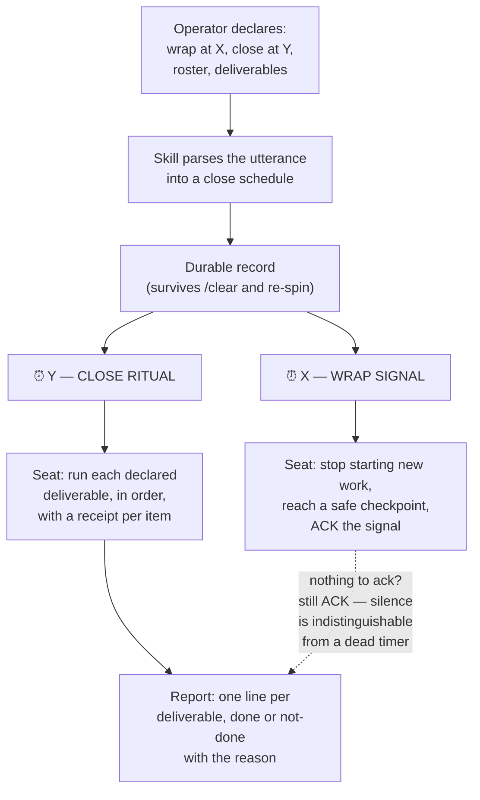

# Scheduled Session Close — a two-stage, operator-declared shutdown

**Status**: 🟡 **PROPOSAL ONLY. NOTHING IS IMPLEMENTED, BY EXPLICIT INSTRUCTION.** No `workflow/` document, no skill, no slash command, no script, no cron installer has been created. This file is the entire deliverable. Rick walks through it on his return; my open questions are in §9 and are **not** being asked tonight.

**Authorizing grant** — Rick, by voice, 2026-09-22 ~22:07 EDT, verbatim:

> *"Maria I want you to propose but not implement a workflow with a skill attached to it that reflects the instructions I just gave you in the generic sense. That is, I wanted to be able to say we're going to start shutting down at X o'clock and we're going to run a full end-of-session ritual at Y o'clock. I want you to make this generic and generalizable. But do not implement — save only as a planning document that we can review when we get back and you walk me through whatever questions you might have."*

---

## 1. The concrete instance this generalizes

Broadcast `7d802286`, 2026-09-22 ~22:02 EDT, verbatim:

> *"set your timers. For 10:45 is a 15 minutes to wrap-up signal, and 11 o'clock for a end-of-session ritual. Each one of you managers will give me a push and a backup. I remember one of you guys forgot it last time, so make a note: it's a push and a backup for every one of you managers I just mentioned."*

Four things are in that sentence, and the proposal's job is to keep all four:

| # | Element | In the instance | Generic name |
|---|---|---|---|
| 1 | A **soft** time — stop starting new work | 22:45 | `wrap_at` |
| 2 | A **hard** time — run the close | 23:00 | `close_at` |
| 3 | A named **roster** — who this binds | Tiffany, María, Mr. Radio | `participants` |
| 4 | An explicit **deliverable set** per participant | push **and** backup | `deliverables` |

⚠️ **Element 4 is the one that failed last time and it is the reason this is worth building.** Rick did not ask for a reminder to close; he asked for a reminder that names *both* deliverables, because a manager previously delivered one of the two. A generic "wrap up now" poke reproduces exactly the failure he called out. **The deliverable list is not decoration — it is the payload.**

---

## 2. What the mechanism must survive

Three failure modes, all of them already measured in this fleet:

| Failure | Evidence | Consequence for the design |
|---|---|---|
| **An in-session timer dies at `/clear`** | this very seat re-spun at 22:05 tonight, between the broadcast and the deadline | the schedule must live **outside** the session process |
| **A stale banner keeps repeating a lifted order** | the Skeleton Crew heartbeat banner repeated an exclusivity for ~11 hours after Rick lifted it by voice | the schedule needs an **expiry**, and a cancelled close must actually stop firing |
| **A status card cannot discover a misunderstanding** | five `notify` cards about the worktree fork surfaced nothing; one question did | the wrap signal is a **poke to act**, not a question, and must not be mistaken for one |

⇒ **The split that follows from this: cron detects, a live seat acts.** The durable half knows only *when* and *whom*; the judgment half — what "done" means, what is safe to commit, whether a peer is mid-run — stays with the seat.

---

## 3. Proposed shape — three artifacts, one canonical

| Artifact | Proposed path | Role |
|---|---|---|
| **Workflow doc** (canonical) | `workflow/scheduled-session-close.md` | the whole contract; other repos cite it by path |
| **Skill** | `.claude/skills/scheduled-session-close/SKILL.md` | trigger-rich description so the utterance alone fires it |
| **Slash command** | `.claude/commands/plan-session-close.md` | thin wrapper — `set` · `status` · `cancel` · `run` |

This matches the repo's existing three-tier pattern (canonical doc · skill · thin command wrapper) and adds no new structure.

### 3.1 The workflow document — proposed table of contents

1. **Purpose / When to use / Key activities** (the repo's standard header)
2. **The declaration** — what the operator says, and the four elements it must yield
3. **Stage 1: the wrap signal** — soft; what a seat does and does not do
4. **Stage 2: the close ritual** — hard; the deliverable loop and its receipts
5. **Durability** — why the schedule lives outside the session, and what installs it
6. **Roster semantics** — named vs "all managers" vs "everyone"
7. **Failure and partial completion** — what to do when a deliverable cannot be done
8. **Cancellation and expiry**
9. **Integration** — how this relates to `session-end.md`, `memento-management.md`, `/plan-backup-write`
10. Version history

### 3.2 The skill — trigger surface

Fires on utterances of the shape: *"we start shutting down at X and run the full ritual at Y"* · *"set your timers for X and Y"* · *"wrap-up signal at X, session end at Y"* · *"fifteen minutes to wrap-up at X"* · *"everybody closes out at Y"* · and the explicit `/plan-session-close`.

Its job is narrow: **turn one spoken sentence into a filled-in close schedule, read it back for confirmation, and make it durable.** It does not run the ritual.

### 3.3 What "durable" means

The schedule is a small record — times, roster, deliverables, expiry — plus one scheduler entry per stage that pokes the seat. Tonight I installed exactly this by hand as two `cron` lines, and it is what carried the deadlines across my own re-spin at 22:05. **The hand-rolled version already works; the proposal is to make it a first-class, cancellable, inspectable artifact instead of two lines I wrote in a scratchpad.**

⚠️ Where that record should live is genuinely open — see §9 Q3. It is the only part of this proposal I do not have a confident recommendation for.

---

## 4. Stage 1 — the wrap signal (soft)

**Meaning**: *stop starting, start finishing.* It is not a stop order.

| Do | Do not |
|---|---|
| finish the step in flight, reach a safe checkpoint | start a new investigation, spawn a new worker |
| write or amend the memento if a re-spin is near | begin anything that cannot be abandoned cleanly |
| surface anything that needs the operator **while he is still here** | open a new blocking ask that will time out |
| **ACK the signal** — one line | stay silent |

🔴 **The ACK is not politeness, it is the liveness check.** A seat that has crashed, wedged, or lost its timer is indistinguishable from a seat that is quietly working — and the whole reason for a 15-minute warning is to find that out **while there is still time to act on it**. If nobody must ACK, the warning's only function is lost.

---

## 5. Stage 2 — the close ritual (hard)

For each participant, for each declared deliverable, in the declared order:

1. **Run it.**
2. **Produce a receipt** — a sha, a test-run id, a path, an exit code. Not a claim.
3. **Report one line**: deliverable · done/not-done · receipt, or the reason.

🔴 **Every declared deliverable gets a line, including the ones that could not be done.** A short report that omits a failure is exactly the defect Rick called out ("one of you guys forgot it"); the omission and the failure look identical from his side. **A checklist that permits a blank is a checklist that permits the original bug.**

⚠️ **Deliverables are declared, not inferred, and the ritual does not invent scope.** Tonight's set is `push` + `backup`. Another night it might be `backup` only, or `push` + `backup` + `post-game`. The ritual runs what was declared and says so; it does not decide that a push was "probably implied."

⚠️ **And a declared deliverable overrides a standing gate — but only for that deliverable.** `push` is normally the operator's discretion and never mine to initiate. Naming it in the close declaration *is* the order. That widening is scoped to the named item and expires with the schedule; nothing else in the standing gate list moves.

---

## 6. Roster semantics

| Form | Binds | Note |
|---|---|---|
| named personas | exactly those | tonight's form — Tiffany, María, Mr. Radio |
| "all managers" | every manager-role seat | needs a live roster at fire time, not at declare time |
| "everyone" | every active seat | workers included |

⚠️ **A seat that is spawned *after* the declaration is not covered by it.** Either the declaration must be relayed into new seats' briefs, or the roster resolves at fire time rather than at declare time. §9 Q2.

---

## 7. What this deliberately does **not** do

- It does **not** replace `session-end.md`. The close ritual *invokes* the project's existing session-end procedure; it does not restate or fork it.
- It does **not** decide what is safe to commit. Manifest discipline, the parallel-session conflict prompt, and the ban on `git add .` all still apply, unchanged.
- It does **not** auto-run anything unattended. Cron pokes; the seat acts, and the seat is still accountable for every judgment it makes.
- It does **not** ask the operator questions at fire time. He is, by construction, leaving.

---

## 8. Estimated cost, if approved

| Piece | Size |
|---|---|
| `workflow/scheduled-session-close.md` | ~200 lines, one sitting |
| Skill + command wrapper | ~80 lines |
| Scheduler install/cancel/status helper + tests | the real work — depends entirely on Q3 |

The document and skill are cheap. **The durable-record half is where the design risk is**, and it should not be built before Q3 is answered.

---

## 9. Open questions — for the walkthrough, not for tonight

> ✅ **RULED 2026-09-23 in Rick's walkthrough.** Every recommendation below was accepted. Q3 is answered as **cron + a store row**: the first-named manager files it, the row does not need promoting, and dropping it cancels. The name is **Last Call** (`/plan-last-call`, 🔔; "last call" means wrap and "closing time" means close). Full table: `TODO.md` § Decisions Log, 2026-09-23. **The build still needs Rick's go.**

Each carries my recommendation. None of these is being asked as a blocking question; they are here so the walkthrough has an agenda.

**Q1 — Is the wrap ACK mandatory?**
My recommendation: **yes, mandatory, one line, from every named participant.** It converts the warning from a courtesy into a liveness probe, which is the only thing that makes 15 minutes of lead time useful. Cost: three extra cards in your notification stream at 22:45.

**Q2 — Does the roster resolve at declare time or at fire time?**
My recommendation: **fire time for "all managers" / "everyone", declare time for named personas.** Named means named — a person you did not name should not be bound retroactively. But "all managers" plainly means whoever is managing when the bell rings.

**Q3 — Where does the durable schedule live?** *(the one I have no confident answer to)*
Three candidates: a `cron` entry per stage (what I hand-installed tonight, proven, but invisible to the fleet and easy to orphan) · a task-store row with `next_chase_ts` (visible, inspectable, cancellable — but the chase machinery pokes on its own cadence, which is not the same as firing at a wall-clock instant) · a file in the notification server with a scheduler behind it (most capable, most new code). **I would want to talk through what you already consider authoritative for "a thing that must happen at a specific time" before recommending one.**

**Q4 — What happens if the operator is still present at `close_at`?**
My recommendation: **the ritual runs anyway.** A close that silently waits for you to leave is a close that never happens on the nights you stay.

**Q5 — Should an unmet deliverable block the close, or be reported and carried?**
My recommendation: **report and carry, never block.** Blocking at 23:00 with you AFK produces a stalled seat and no report at all — the worst of both. A named, receipted "not done, because X" is strictly more useful.

**Q6 — Is this repo-generic or fleet-generic?**
My recommendation: **fleet-generic, canonical here.** The deliverable *names* (`push`, `backup`) are portable; the deliverable *procedures* are per-project and already exist as each project's own commands. The workflow doc should name the slots and let each project bind them — same pattern as every other document in `workflow/`.

---

## 10. Provenance and honesty notes

- The two `cron` lines referenced in §3.3 are real and were installed by hand at ~22:03 EDT tonight; they fired correctly across my 22:05 re-spin. That is the only part of this proposal with any running evidence behind it. **Everything else is design on paper.**
- The failure in §1 element 4 ("one of you guys forgot it last time") is **Rick's report, not my measurement.** I have not gone back through the logs to identify the manager or the night, and this document should not be read as having done so.
- No files outside this one were created or modified in producing it.
