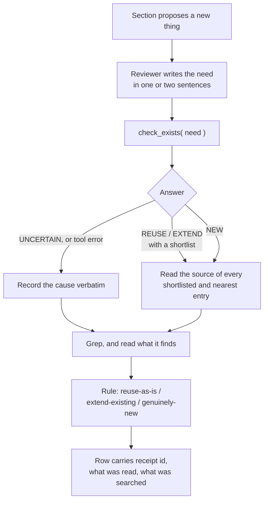

# Cascade reuse check through the code index — design for review

**Author**: María 🌸, 2026-10-01 · **Status**: proposal, nothing in `workflow/` changed · **For**: Rick

**Asked for** (Rick, voice, 2026-10-01): *"the reuse phase will now have a resource that it can call through MCP to see if similar functionality already exists, so that [there is] a fact based check that a reviewer can make on any given claim as to whether something new needs to be built, modified or reused."*

## 1. Summary

1. **The cascade can adopt the check today as a rule about evidence, but the tool cannot answer yet.** The three lookup tools are mounted and the index builds, but the part that asks Jev to compare a need against the index is a stub. Until lupin finishes it, every lookup returns "uncertain, read the source".
2. **The real gap in the cascade is that a "nothing like this exists" ruling carries no evidence at all.** The reviewer is told to grep, and nothing asks what was searched or what came back. The index check fixes that whether or not Jev is live, because every call returns a receipt id.
3. **The tool never decides.** It builds a shortlist. The reviewer rules after reading the source. That is lupin's own design, and this proposal keeps it.

## 2. What exists today

Read on 2026-10-01 at lupin `0c617d906`. Gathered by a read-only helper; the six rows marked ✔ I re-read myself.

| Fact | Where |
|---|---|
| ✔ Three lookup tools are mounted on the cosa-voice server: `check_exists( need )`, `fetch_similar( entry )`, `read_capability( names )`, plus `replay( receipt_id )` | lupin `src/lupin_mcp/cosa_voice_mcp.py` 5735–5816 |
| ✔ The live Jev call behind `check_exists` is not built: `LiveJevTransport.post` raises `NotImplementedError( "live Jev transport is phase W-A" )` | lupin `src/lupin_mcp/reuse_tools.py` 210–217 |
| ✔ No key file for it exists, so a call today would answer `UNCERTAIN_READ_SOURCE` with cause `KEY_UNREADABLE` (inferred from the code; the tool was not called, since a call writes a receipt) | `src/conf/keys/` has no typesafe entry |
| ✔ The tools refuse any repository that is not lupin (`NOT_LUPIN_TREE`), lupin-mobile included, although the index builder can read Dart | `reuse_tools.py` 411 |
| ✔ `fetch_similar` takes the id of a symbol **already in the index**. It cannot be asked about something a plan only proposes (`UNKNOWN_ENTRY`) | `reuse_tools.py` 504–509 |
| ✔ `read_capability` returns `NOT_FOUND` for every name: no capability pages are written yet | lupin `src/docs/wiki/capabilities/` does not exist |
| The index holds **public symbols only**, each as signature plus the first line of its docstring. No function bodies. Tests, `src/rnd`, private and nested helpers are not in it | lupin `src/cosa/repo/symindex/`, `README-symindex.md` 24–29 |
| The index is rebuilt on demand when files on disk change. It sees one working tree: not other worktrees, not unwritten code | `build.py` 290–314 |
| Sam's merged Jev adapter is a **different job**: it judges whether a rewritten docstring still states a claim. It uses a different question type from the reuse sweep and reads its key from an environment variable; the reuse path expects a key file | lupin `src/cosa/repo/doc_lint/jev_transport.py`, `jev_judge.py` |
| No recall number exists for the reuse check. Lupin's plan says the tools stay advisory until Rick sets one | lupin plan 2, ruling E10 |

**What the cascade says today** (✔ re-read): reuse belongs to the Stage 1 Usability/Reuse reviewer. The mandate is "actively grep the codebase for prior art", one row per new thing, with a verdict of `reuse-as-is`, `extend-existing` or `genuinely-new`. A `genuinely-new` row needs only "no prior art found; explain WHY this is novel" (`workflow/plan-review-cascaded-personas.md` 220–231). No later stage re-checks it. None of the cascade files mention the lookup tools.

## 3. The proposal

### 3.1 Who and when

| Moment | Who | Tool |
|---|---|---|
| Writing the plan's reuse map | Plan author | `check_exists` per proposed new thing; receipts go in the map |
| Stage 1 of the cascade | Usability/Reuse reviewer | `check_exists` per "new thing" row, then reads source, then rules |
| A `reuse-as-is` or `genuinely-new` ruling is disputed | Counter-reviewer (charter already exists in `workflow/swe-team-roles.md`) | `replay` on the cited receipts, then reads what the reviewer dismissed |
| Reviewing code, not a plan | SWE Reviewer | `fetch_similar` per new definition in the diff. **Not usable in plan review**: it needs a symbol that already exists |

### 3.2 The check, per claimed-new thing

1. **Write the need** from the section's own words: what the new code would do, not what it would be called.
2. **Call `check_exists`** and keep the `receipt_id`, the verdict and, if uncertain, the cause.
3. **Read the source** of every entry on the shortlist and the nearest list. A `NEW` answer does not excuse this: the tool compares one-line descriptions, not behaviour.
4. **Grep anyway.** The index cannot see private helpers, tests, other repositories, another worktree's uncommitted work, or code whose docstring's first line does not describe it. Grep covers what the index is blind to; the index covers same-behaviour-different-name, which grep is blind to.
5. **Rule**, and write the row.

### 3.3 The evidence row

Replaces today's three-column table.

| New thing | Need sent | Receipt | Tool answer | Candidates read (file:line) | Grep: terms, roots, hits | Ruling | Why |
|---|---|---|---|---|---|---|---|

- **A `genuinely-new` ruling with an empty "Candidates read" or an empty "Grep" cell is unsupported**, and the manager classifies it as a finding against the review. This is the cascade's existing rule, *state what you ran, not what you considered*, applied to the one ruling that today needs no evidence.
- **The receipt proves a call happened; the row proves the reviewer used it.** A receipt beside a ruling that ignores the shortlist is a finding.

### 3.4 How the tool's words map to the cascade's

| Tool answer | Cascade ruling | Condition |
|---|---|---|
| `REUSE` | `reuse-as-is` | after reading the candidate |
| `EXTEND` | `extend-existing`, naming the symbol | after reading the candidate |
| `NEW` | `genuinely-new` | only after reading the shortlist and nearest entries, and the grep |
| `UNCERTAIN_READ_SOURCE` | none yet | the reviewer rules from source and grep alone, and says so |

### 3.5 When the tool cannot answer

This is the normal case today, so the rule has to be usable without it.

| Situation | What the reviewer records | What the reviewer does |
|---|---|---|
| `UNCERTAIN_READ_SOURCE` with a cause (`KEY_UNREADABLE`, `CALL_FAILED`, `INDEX_STALE`, …) | the cause, verbatim, and the receipt id | grep plus reading; the row says "index check gave no shortlist: `<cause>`" |
| `NOT_LUPIN_TREE` (any other repository) | that word | grep plus reading; this is every lupin-mobile and planning-is-prompting plan today |
| `REUSE_TOOLS_UNAVAILABLE`, or the tool is not mounted | the error text | grep plus reading |

**Never** write `genuinely-new` on the strength of an answer that was uncertain or absent. **Never** leave the Receipt cell blank without a reason in it: a blank reads as "did not try".

### 3.6 Advisory until a number exists

Lupin's ruling E10 keeps the tools advisory until a recall figure is measured and Rick sets a bar. This proposal follows it: the **receipt and the recorded search are required now**; the **tool's verdict carries no weight in a dispute** until E10 is ruled. When it is, one sentence in the persona file changes.

## 4. Where the text would land

All in this repository, none written yet.

| File | Change |
|---|---|
| `workflow/plan-review-cascaded-personas.md`, Persona 3 | the mandate, the evidence row, the mapping and the cannot-answer table (§3.2–3.5) |
| `workflow/plan-review.md` §4 | the same receipt requirement; lupin's plan 2 already says this section will require receipts, and it does not yet |
| `workflow/plan-authoring-cascaded.md`, reuse map and must-reuse list | each entry carries a receipt or the reason there is none |
| `workflow/plan-review-cascaded-input-spec.md` | a plan arriving for review states whether its reuse map was index-checked |
| `workflow/swe-team-roles.md` | Reviewer charter gains `fetch_similar` per new definition; the Counter-reviewer charter cites a `dispute-flow.mmd` that does not exist in lupin (the diagram is a block inside plan 2) and should point there |

## 5. What this depends on in lupin

None of it is this repository's to build. Listed because each one changes what the rule can honestly promise.

| Gap | Effect on the rule | Whose |
|---|---|---|
| The reuse sweep's live Jev call is a stub | No shortlist anywhere until built. Sam's merged transport reaches the same service but asks a different kind of question; whether it can be reused for the sweep is unverified | Cheech's crew |
| 🔴 **The exclusion list is not wired.** Rick approved sending signatures and first docstring lines to the service *"under an exclusion list he approves"*. The code accepts a list but production never passes one, and no config key for it was found | The day the live call is switched on, every public symbol is sent, including any module Rick meant to exclude. **This should block switching it on** | Cheech's crew, then Rick's approval of the list |
| The tools refuse non-lupin repositories | The check does nothing for lupin-mobile or this repository | Cheech's crew |
| Key location: plan says a key file, Sam's transport reads an environment variable | Two key paths for one service | Cheech's crew |
| Index written inside lupin's working tree; ruling B4 said the fleet data folder | Not a blocker; a divergence from a ruling | Cheech's crew |
| No gating flag exists in config | Nothing to flip when E10 is ruled | Cheech's crew |
| No capability pages | `read_capability` has nothing to return until the package sweep | plan 1 |

## 6. Decisions for Rick

| # | Decision | Recommendation | Why | The other way |
|---|---|---|---|---|
| 1 | Adopt the evidence row and the recorded-search requirement now, before the tool can answer? | **Yes** | It closes the "nothing exists" hole today with grep evidence alone, and reviewers build the habit before the tool matters | Wait for the live call: simpler rollout, but the hole stays open for weeks |
| 2 | Should a missing receipt block a section from closing? | **No, a finding the manager classifies** | The tool cannot answer yet, and blocking on it would stall every cascade | Blocking: stronger, appropriate once E10 is ruled |
| 3 | Who checks first, author or reviewer? | **Both: author fills the reuse map with receipts, reviewer re-checks the rows ruled new** | Receipts are cached per need, so the second look is cheap, and the reviewer writes the need independently | Reviewer only: less author work, but plans arrive unchecked |
| 4 | Hold the live Jev sweep until the exclusion list is wired and approved? | **Yes** | It was your condition for approving the send | Switch on first: faster, sends everything |
| 5 | Should the tools answer for lupin-mobile and this repository? | **Yes, as a lupin ticket** | Two of the three repositories get nothing from the check otherwise | Leave lupin-only: no work, grep-only reviews elsewhere |

## 7. Not established

- What the three tools actually return when called. Not called, because each call writes a receipt and a log line.
- Whether the sweep's question type is accepted by the service. The only code that makes a real call uses the other type.
- Cost and time per check at the current index size (lupin's wiki index page records 7,240 public symbols; the plan estimated minutes per question).
- Whether any seat's server writes receipts somewhere other than the default data folder.
- Recall. No number exists; nobody should trust a `NEW` until one does.
