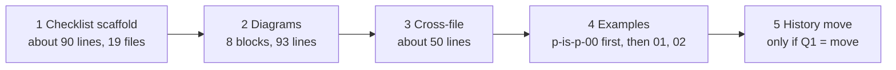

# Wider pruning of `workflow/`: assessment and plan

Sam (author seat for María), 2026-10-10. Base commit `1b8479c`. Nothing under `workflow/` was edited. This document is for Rick to decide from; the batches below start only after he okays them.

## 1. Verdict

The first pass took the high-yield text (net about 1,900 lines out of 40,713). What is left is smaller per cut and riskier per line, so I recommend doing **four small batches and leaving three classes alone**. Do, in this order: (1) the remaining step-checklist scaffolding, which Rick already ruled optional (about 90 lines, no trial needed); (2) about eight diagrams that only restate the prose beside them (93 lines, with a per-edge test); (3) one cross-file pair and the four copies of the brevity paragraph (about 50 lines); (4) the filled examples in the three `p-is-p-0x` entry docs (560 lines at stake, moved rather than deleted, after a trial). Leave alone: clause-level repeats (each clause has its own scope, and the first pass changed meaning three times by folding them), retired material Rick fenced as historical, and the trial class in section 6 until Rick decides whether it is worth a live-seat rig. The one large pool is version histories: 189 KB, 8.1% of all bytes. I recommend moving them out losslessly, which needs Rick's ruling (question 1). Expected yield of everything recommended: about 700 lines (estimate), 1.7% of the corpus, plus 189 KB from the history move.

## 2. The classes at a glance

Corpus: 70 files (64 top-level, 3 skill templates, 3 slash-command templates), 40,713 lines, 2,325,603 bytes. "Pool" is measured by the method in section 3; "estimate" says how it was made.

| # | Class | Pool (measured) | Files | Risk if a cut is wrong | Recommendation |
|---|---|---|---|---|---|
| 1 | Diagrams and summary tables that restate prose | 21 mermaid blocks, 233 lines, outside `mermaid-diagrams.md`; 12 "At a glance / Quick reference" sections, 199 lines; surveys reported 487 lines (both copies of each pair counted) | 12 | A session picks the wrong branch or step order that only the diagram stated | **Do with a test**, 8 blocks only |
| 2 | Filled examples | 26 sections, 1,291 lines; 560 of them in `p-is-p-00/01/02` | 20 | Model output loses the shape the example taught (trial 7 below) | **Do with a test** for the three entry docs; **leave** examples that define an output form |
| 3a | Version histories | 56 files, 665 lines, **189,219 bytes (8.1%)**; 153 entries over 400 B hold 61,159 B | 56 | Loses the record of Rick's rulings and incident anchors if deleted; nothing if moved whole | **Rick's ruling** (Q1); recommend lossless move |
| 3b | Retired or historical material | 11 sections headed retired/legacy/superseded, 91 lines; 32 lines carry a HISTORICAL fence; 24 history lines still say "HELD for" | 10 | Rick fenced several on his own GO; deleting them overrides him | **Leave** fenced items; fix the 24 stale markers as defects, not cuts |
| 4 | Clause-level repeats inside one file | 76 lines (19 files) by shingle test; 25 are one scaffold line in `bug-fix-mode.md`; survey-measured byte repeats: 6,551 B in 16 lines of `plan-review.md` | 19 | Saves bytes, not lines; folding sentences changed scope three times in pass four | **Leave** (scaffold lines go with batch 1) |
| 5 | Duplicates across files | 323 lines in 45 files; top pair `plan-review-cascaded.md` and `-common.md` 84 lines (40 + 44) | 45 | A seat reads one doc alone and no longer has the text; pasted prompts and templates need their own copy | **Do with a test**, one pair plus the brevity paragraph; **leave** the rest |
| 6 | Cut only after a trial run (action plan section 11) | 139 lines name a native feature (22 files); 107 are checklist scaffolding (19 files) | 22 | Removing a rule the model does not in fact follow unprompted | Checklist part is **ruled** (batch 1); the rest **leave** until Q3 |

## 3. Per class: method, examples, test

All commands run from the repo root against `workflow/*.md`, `workflow/skill-templates/*.md`, `workflow/slash-command-templates/*.md`. Line numbers are at `1b8479c`.

### Class 1: diagrams and summary tables

**Count.** Mermaid blocks: lines between a fence opening with `mermaid` and its closing fence, per file (`mermaid-diagrams.md` excluded: it is the guide, 10 blocks, 83 lines). Summary sections: headings matching `at a glance|quick reference|cheat sheet|tl;dr|decision tree|flowchart|diagram|summary table`, non-blank lines to the next heading of the same or higher level. Overlap screen: for each block, the share of its node and edge labels whose words (over 3 letters) all appear in the file's prose outside any fence. The screen says the words are there, not that the order is; the edge test below is the real check.

| Example | Lines | Screen |
|---|---|---|
| `post-game.md` §6 lifecycle flowchart | 293-306 | 9 of 9 labels in prose |
| `rnd-directory-policy.md` placement flowchart | 76-87 | 9 of 9 |
| `swe-team-spin-up.md` flowchart | 79-92 | 9 of 9 |
| `last-call.md` flowchart | 89-109 | 13 of 14 |
| `plan-serialization.md` flowchart (precedent: cut 17 lines in pass two, merged) | 149-165 at `3d39d74` | n/a |
| Keep, not cut: `p-is-p-01-planning-the-work.md` pattern decision tree | 955-977 | 14 of 14 words, but it carries the branch order, which prose may not |

**Test (edge recall).** For each block, delete it in a detached worktree and build one question per edge: "When <source label> and <edge label>, what comes next?" Ask each with `claude -p --setting-sources project --strict-mcp-config --no-session-persistence --allowedTools Read`, three runs per question, once with the block kept (control) and once removed. **Safe** only if every edge gets the same destination in 3 of 3 runs in both arms. A wrong or "not stated" answer in the removed arm means the diagram carried it: keep it. Cost: about 10 edges x 3 runs x 2 arms per block.

### Class 2: filled examples

**Count.** Sections whose heading says worked example, real-world example, common scenarios, before/after, sample or usage examples, to the next heading of the same level; I excluded by title the sections that are instructions (example-based message pattern, trigger-rich descriptions, notification examples, shell-rc setup). The pool is every remaining section, not a recommendation to cut all of it.

| Example | Lines | Non-blank |
|---|---|---|
| `p-is-p-00-start-here.md` Common Scenarios with Complete Examples | 474-797 | 253 |
| `p-is-p-01-planning-the-work.md` Examples from Real Projects | 1439-1631 | 157 |
| `p-is-p-02-documenting-the-implementation.md` Real-World Example: JWT/OAuth | 965-1057 | 80 |
| `plan-review-cascaded-parallelism.md` §2 worked example | 27-162 | 109 (pass 5 listed it out of scope) |
| Keep: `session-start.md` Example-Based Message Generation | 1493-1744 | 183; trial 7 below |

**Test (format trial).** The earlier trial rig (`io/tmp/2026.10.09-pruning-pilot/trials.md` in lupin) showed an example section changes output: with it, 6 different wordings in 10 runs; without it, the same sentence 10 times. So for each doc: five headless runs per arm on one planning task ("plan adding email notifications using this workflow"), scored on a fixed rubric (pattern chosen, breakdown present, tracking form named, store rows proposed). **Safe** if the removed arm scores the same rubric items in 5 of 5 runs. Wording differences do not count.

### Class 3: histories and retired material

**Count.** Version histories: from a heading matching `version history|changelog|change log|revision history|document history` to the next heading of the same or higher level; non-blank lines and bytes. Entry lines: bullets, numbered items and table rows inside those sections (536 lines, 177,113 B); the 400-byte figure is the bytes above a 400-byte cap per entry. Retired: headings matching `retired|legacy|deprecated|historical|superseded|obsolete|archived|retracted|pre-cutover|no longer`; plus lines containing the fence marker.

| Example | Lines | Measure |
|---|---|---|
| `memento-management.md` version history | 567-584 | 17,357 B, 23% of the file, 5 lines still "HELD for" |
| `plan-review-cascaded-defaults.md` version history | 266-308 | 10,995 B, 26% of the file |
| `plan-review-cascaded-common.md` version history | 1064-1097 | 12,290 B |
| `task-store-discipline.md` HISTORICAL material (retired epic board) | 259-267 | 9 lines, fenced |
| `neutral-execution.md` retracted section 6 | per pass 6 survey | 7 lines, not fenced |

**Test.** A move is lossless, so the test is mechanical: the moved text, concatenated, is byte-identical to the text removed (`diff` of the two extracts is empty); no live citation points at a moved heading (grep `workflow/`, `.claude/`, `global/`, scripts, tests, and lupin `src`, `.claude`); suite and `pip_drift_check.py` unchanged (1200 passed, 40 of 40). For a deletion of retired text the same grep applies and Rick's word is required.

### Class 4: clause-level repeats

**Count.** Lines of 10 or more words, outside fences and table separators, where at least 60% of the 6-word shingles (lowercased, markup stripped) also occur in an earlier line of the same file. Measured: 76 lines, 19 files; `bug-fix-mode.md` 27, `INSTALLATION-GUIDE.md` 10, `installation-wizard.md` 7, `session-end.md` 6.

| Example | Lines | What it is |
|---|---|---|
| `bug-fix-mode.md` "If you keep a step checklist: Mark Step N complete" | 249, 277, 802, 1159 and 21 more | Scaffold; batch 1 |
| `INSTALLATION-GUIDE.md` `[SHORT_PROJECT_PREFIX]` field text | 511-512, 1188-1189 | Each install prompt is pasted alone; by design |
| `cosa-voice-integration.md` parameter rows | 498, 641 | Same table for two tools; each tool section is read alone |
| `plan-review.md` sequential rule, security-review rule, rename story | 11/55/408, 13/268/283-287/409, 9/13/63/388 (survey) | 6,551 B in 16 lines; pasted prompts must keep their copies |

**Test.** None is cheap: each clause is a rule with its own scope. A cut needs a reviewer reading the hunk against its neighbors; the pass-four reviewer found three scope changes that way, none by a script. That cost is why the recommendation is to leave.

### Class 5: duplicates across files

**Count.** Lines of 10 or more words outside fences where at least 60% of the 8-word shingles also occur in one other file. Measured: 323 lines in 45 files. Largest pairs (both sides counted): `plan-review-cascaded` with `-common` 84, `plan-authoring-cascaded` with `plan-review-cascaded` 20, `brevity-mandate` with `cross-session-communication` 18, `bug-fix-mode` with `session-checkpoint` 18.

**Precision (estimate).** I read 12 randomly chosen hits (seed 7). 7 were real duplicates a pointer could replace; 5 were by design (global-config template text, sibling test workflows that each run alone). So about 55% of 323, roughly 180 lines, are candidates; the number is an estimate from 12 reads and its range is wide.

| Example | Lines | Note |
|---|---|---|
| "Brevity mandate (universal)" paragraph, four copies | `session-checkpoint.md:90`, `installation-wizard.md:43`, `session-end.md:57`, `branch-pr-and-merge.md:21` | Server now injects the rule each turn; each copy points to `cosa-voice-integration.md` §98 |
| Step 0 acceptance and brevity items | `plan-review-cascaded.md:261`, `-common.md:261` and 40+44 lines in all | One doc is the shared home |
| Anti-pattern table rows | `rnd-directory-policy.md:59`, `plan-serialization.md:105, 116` | 7 lines |

**Test (pointer followed).** In a detached worktree with the duplicate replaced by a pointer, run the step that needs it headless, three runs per arm, tool log on. **Safe** if all three runs open the target doc and the output matches the control. A run that does not open it means the pointer fails and the text stays. Pasted prompts, installed templates and sibling workflows are excluded before the test.

### Class 6: the trial-run class

**Count.** Lines matching `(Write|Edit|Read|Bash|Glob|Grep) tool|TaskCreate|TaskUpdate|TodoWrite|task list|Mark Step N|step checklist`: 139 lines, 22 files. The subset about checklist scaffolding: 107 lines, 19 files (`bug-fix-mode.md` 29, `installation-wizard.md` 23, `uninstall-wizard.md` 11, `task-store-discipline.md` 9, `session-start.md` 5).

**What the seven trials showed** (lupin `trials.md`): 4 of 7 rules were unnecessary (same behavior without them), 1 differed only in form, 1 showed the rule works (example pattern), and 3 were inconclusive because headless runs have no task-list tool and hooks are off. Rick already ruled the checklist optional (row `efa0a4cf`) and cut the Step 0 class in pass one, so the scaffolding in batch 1 is follow-through, not a trial. The rest of the pool (139 less 107) would need a live seat with hooks on.

**Estimate.** Batch 1 is about 90 lines: the 107 measured, less 17 lines in files that describe the task store or the native list rather than instruct a checklist (`task-store-discipline` 9, `swe-team-roles` 3, `cosa-voice-integration` 3, `claude-config-global` 1, `deterministic-wrapper-pattern` 1).

**Test.** Cross-reference grep as in class 3, then suite and drift at the tip. For the non-checklist remainder: control and trial runs in a live seat (Q3).

## 4. Batches, review and stop rule



| Batch | Size cap | Test before the shortlist | Review | Stops if |
|---|---|---|---|---|
| 1 Checklist scaffold | 10 files, 100 lines | Cross-reference grep; suite; drift | Reviewer seat reads each hunk against the lines around it | Any row cites a heading another file links |
| 2 Diagrams | 8 blocks, 93 lines | Edge-recall test per block | Same; reviewer also re-runs two blocks | Any edge unanswered in the removed arm: that block stays, others continue |
| 3 Cross-file | 5 files, 60 lines | Pointer-followed test | Same | A run does not open the target doc |
| 4 Examples | One doc per sub-batch | Format trial, 5 runs per arm | Same | Rubric differs in any run |
| 5 History move | 56 files, mechanical | Byte-identical extract diff; grep; suite; drift | Reviewer checks the extract diff and a 5-file sample | Any citation to a moved heading |

Common to every batch, as in the first pass: shortlist reviewed before any edit; one commit per file with a version entry; suite and drift run by the manager at the exact tip; merge without a card under Rick's standing ruling; push stays Rick's.

**Stop rule.** Stop and re-scope a batch if the reviewer fails more than 1 row in 10 or finds one meaning change (history: rows held 95% in batch three, 87% in batch five, 85% in batch six). Stop the whole program after two consecutive batches that net under 30 lines, or if a merged cut is later found to have broken a citation (revert that commit alone, then stop).

## 5. Open questions for Rick

| # | Question | Options (recommended first) | Pros and cons |
|---|---|---|---|
| 1 | What to do with the 189 KB of version histories | **A. Move each to a sibling file, whole** (recommended); B. Leave; C. Cap each entry at 400 B plus the commit sha | A: 8.1% off every full read, nothing lost; adds 56 files and a convention change (CLAUDE.md says "update the version history at the bottom"). B: no risk, no gain. C: saves 61 KB but rewrites records of your rulings |
| 2 | Examples in the three `p-is-p-0x` docs (560 lines) | **A. Move to `docs/explainer/` after the trial passes** (recommended); B. Delete; C. Leave | A: out of the loaded path, still there for people outside the fleet. B: smallest result. C: no change |
| 3 | Build a live-seat trial rig for the rest of class 6 | **A. No, skip class 6 after batch 1** (recommended); B. Build one (a seat with hooks on, scripted control and trial) | A: pool beyond the checklist is at most 32 lines. B: costs a seat-evening; only worth it if you want to prune the "Native" bin more broadly |
| 4 | Material you fenced as historical (32 lines, e.g. retired heartbeat daemon) | **A. Keep as is** (recommended); B. Move to `src/docs/`; C. Delete | A: you fenced it on purpose. B/C: recovers 91 lines at most |
| 5 | Does your okay of this plan cover merging each batch without a card, under the stop rule | **A. Yes** (recommended); B. Card per batch | A: matches the pass-one ruling; push still yours. B: slower, you are usually away |

## 6. What this plan did not check

- Installed copies in other repos, and lupin-side consumers of any doc text, beyond what the pass reports already grepped.
- Whether any text-reading test would catch a cut: only `session-end.md` (ritual test), `decision-walkthrough.md`, `push-to-completion.md` (citation resolver) and `branch-pr-and-merge.md` Step 8.5 have one, so a green suite is weak evidence for most docs.
- The 25 "within" lines outside `bug-fix-mode.md` and the 323 cross-file lines were not all read; section 3 gives the sample size for each estimate.
- `src/rnd/README.md` does not exist, so there is no index line to add.

## Appendix: rerunning the counts

```bash
# corpus
cat workflow/*.md workflow/skill-templates/*.md workflow/slash-command-templates/*.md | wc -lc   # 40713 lines, 2325603 bytes
# class 1, mermaid lines outside mermaid-diagrams.md
for f in $(ls workflow/*.md workflow/*/*.md | grep -v mermaid-diagrams); do awk '/^[ \t]*```mermaid/{b=1;next} b&&/^[ \t]*```/{b=0;next} b' $f; done | wc -l   # 233
# class 6
grep -c -i -E "step checklist|checklist, if you kept|Mark (Step|cycle|Phase) [0-9A-Za-z.]+ complete|TaskUpdate|TaskCreate|TodoWrite" workflow/*.md workflow/*/*.md | awk -F: '{s+=$2} END{print s}'   # 107
```

Classes 2 to 5 use heading-bounded sections and word shingles (6-word within a file, 8-word across files) over lowercased, markup-stripped, fence-free lines; the scripts are in Sam's scratchpad (`measure.py`, `rep.py`, `final.py`, `vh.py`, `diag.py`) and can be attached to the review on request.
