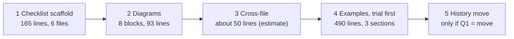

# Wider pruning of `workflow/`: assessment and plan

Sam (author seat for María), 2026-10-10. Base commit `1b8479c`; revised after Pocholo's review (`io/tmp/2026.10.10-wider-pruning-plan-review.md`). Nothing under `workflow/` was edited. Batches start only after Rick okays them. Every count has its command in the appendix.

## 1. Verdict

The first pass took the high-yield text: the 68 prune commits netted 1,324 lines out of `workflow/*.md`, and the corpus fell from 42,092 to 40,713 lines (1,379). What is left is smaller per cut and riskier per line. I recommend **three small batches that can be tested now, one large batch that needs a trial first, and leaving three classes alone**.

- **Batches 1 to 3, about 308 lines:** the step-checklist scaffolding in six files (165 lines, read in full; Rick's ruling makes it optional, but he has not ordered it deleted, see Q6); eight diagrams (93 lines, listed in section 3); and one cross-file pair plus the four brevity copies (about 50 lines, estimate).
- **Batch 4, 490 lines, pending a trial:** the three large worked-example sections in `p-is-p-00/01/02`. Nothing yet shows they are redundant; the one earlier trial (trial 7) points the other way, so this is a candidate, not a recommendation to cut.
- **Leave alone:** clause-level repeats, retired material Rick fenced on his own word, and the trial class beyond the checklist until he decides on a live-seat rig (Q3).
- **Version histories:** 185 to 189 KB, about 8% of all bytes. Moving them out whole loses nothing but needs Rick's ruling (Q1).

If everything recommended lands the yield is about 800 lines (165 + 93 measured, about 50 estimated, 490 pending), 2.0% of the corpus, plus the history move.

## 2. The classes at a glance

Corpus: 70 files (64 top-level, 3 skill templates, 3 slash-command templates), 40,713 lines, 2,325,603 bytes. Pool is measured by the appendix commands unless marked estimate.

| # | Class | Pool (measured) | Files | Risk if a cut is wrong: a session would stop... | Recommendation |
|---|---|---|---|---|---|
| 1 | Diagrams and summary tables that restate prose | 21 mermaid blocks, 233 lines, outside `mermaid-diagrams.md`; 12 summary-headed sections, 199 lines; surveys reported 487 lines (both copies of each pair counted) | 12 | ...following the branch or step order only the diagram stated | **Do with a test**: 8 blocks, 93 lines |
| 2 | Filled examples | 26 sections, 1,291 lines (list in appendix); the three `p-is-p-0x` docs hold 6 of them, 560 lines, of which 3 large sections are 490 | 20 | ...producing the form and section order the example showed (trial 7: the example changes wording) | **Candidate, trial first**; leave examples that define an output form |
| 3a | Version histories | 52 files, 638 lines, 185,022 B by heading; 56 files, 665 lines, 189,219 B counting bold-label headings; 153 entries over 400 B hold 61,159 B above a 400 B cap | 52-56 | ...finding the incident anchor behind a rule, and re-arguing a ruled question | **Rick's ruling** (Q1); lossless move recommended |
| 3b | Retired or historical material | 11 sections headed retired, legacy and similar, 91 lines (upper bound: at least five are live instructions, see Q4); 29 lines say HISTORICAL, 32 with the 🗄️ marker; 24 history lines still say "HELD for" (32 corpus-wide) | 10 | ...knowing a retired mechanism is retired, where Rick fenced it on purpose | **Leave** fenced items; fix the stale "HELD" markers as defects |
| 4 | Clause-level repeats inside one file | 76 lines, 19 files by my rule; 69 lines, 23 files by Pocholo's rerun; 25 are one scaffold line in `bug-fix-mode.md` | 19-23 | ...applying a rule to the scope its own clause set | **Leave** (scaffold lines go with batch 1) |
| 5 | Duplicates across files | 323 lines in 45 files by my rule; 397 in 50 by Pocholo's rerun; top pair 84-85 lines | 45-50 | ...finding text a seat reading one doc alone no longer has; pasted prompts and templates need their own copy | **Do with a test**: one pair plus the brevity paragraph; **leave** the rest |
| 6 | Cut only after a trial run (action plan section 11) | 139 lines name a native feature (22 files); 107 match the scaffold regex (19 files); the scaffold I read is 165 non-blank lines in 6 files (those hits plus the Step 0 and Step 1 blocks around them) | 6 | ...a step it was not doing unprompted | Checklist part: **batch 1, Q6**; rest **leave** until Q3 |

## 3. Per class: method, examples, test

All commands run from the repo root over `workflow/*.md`, `workflow/skill-templates/*.md`, `workflow/slash-command-templates/*.md`. Line numbers are at `1b8479c`.

### Class 1: diagrams and summary tables

**Count.** Mermaid blocks: lines between a fence opening with `mermaid` and its closing fence (indented fences included), `mermaid-diagrams.md` excluded (it is the guide: 10 blocks, 83 lines). Summary sections: headings matching `at a glance|quick reference|cheat sheet|tl;dr|decision tree|flowchart|diagram|summary table`, non-blank lines to the next heading of the same or higher level, minus `mermaid-diagrams.md`.

**The eight blocks proposed for batch 2** (content lines between the fences; sum 93):

| File | Fence lines | Content lines | Earlier survey note |
|---|---|---|---|
| `post-game.md` §6 lifecycle | 293-306 | 12 | |
| `rnd-directory-policy.md` placement flowchart | 76-87 | 10 | pass 5: summary form, for a ruling |
| `swe-team-spin-up.md` flowchart | 79-92 | 12 | pass 6: for a ruling |
| `last-call.md` flowchart | 89-109 | 19 | pass 5: flowchart against prose, for a ruling |
| `worktree-lifecycle.md` flowchart | 15-25 | 9 | pass 6: for a ruling |
| `p-is-p-00-start-here.md` | 260-274 | 13 | |
| `cross-session-communication.md` | 598-607 | 8 | |
| `cross-session-communication.md` | 772-783 | 10 | |

Precedent: the `plan-serialization.md` flowchart (17 lines) was cut in pass two and merged. Keep, not cut: the `p-is-p-01-planning-the-work.md` pattern decision tree (955-977); it carries the branch order.

**Test (edge recall, three arms).** For each block build questions from the diagram itself: one per edge ("when <source> and <edge label>, what comes next?"), one per fan-in node ("list the inputs to <node> in order"), and one per dotted relation. Run headless (`claude -p --setting-sources project --strict-mcp-config --no-session-persistence --allowedTools Read`), three runs per question, in three arms: A the doc as is, B the block removed, C no doc at all. Score each answer against the diagram, not against the other arm. **Safe** only if, for every question, B matches the diagram in 3 of 3 runs, and a question that C also answers is dropped as guessable (and counted, so a block with every question guessable is flagged as untested). Any B miss means the diagram carried it: that block stays.

### Class 2: filled examples

**Count.** Sections whose heading matches `worked example|example|real-world example|real projects|common scenarios|before/after|sample|usage examples|migration examples`, to the next heading of the same level, nested sections not double-counted, minus nine titles that are instructions (listed in the appendix). Result: 26 sections, 1,291 non-blank lines, 20 files. Pocholo counted only the headings the first draft named: 15 sections, 958 lines. Both lists are in the appendix.

| Example | Lines | Non-blank |
|---|---|---|
| `p-is-p-00-start-here.md` Common Scenarios with Complete Examples | 474-797 | 253 |
| `p-is-p-01-planning-the-work.md` Examples from Real Projects | 1439-1631 | 157 |
| `p-is-p-02-documenting-the-implementation.md` Real-World Example: JWT/OAuth | 965-1057 | 80 |
| `plan-review-cascaded-parallelism.md` §2 worked example | 27-162 | 109 (pass 5: out of scope) |
| Keep: `session-start.md` Example-Based Message Generation | 1493-1744 | 183 (trial 7, STAND-IN: 6 wordings in 10 runs with it, the same sentence 10 times without) |

The three large sections are 490 non-blank lines (610 spanned). The other three sections in those docs (Example Interaction 19, Pattern Selection Examples 31, Budget Allocation 20) bring the docs' pool to 560 and stay.

**Test (form and content, ground truth from the example).** The risk is lost form, not lost wording, so the rubric scores both. For each scenario in the section under test, run one task ("do this scenario using the doc"), five runs per arm (doc as is, section removed), and score against the example's own output as the answer key: content items (pattern chosen, breakdown present, tracking form named, rows proposed) and form items (section order matches the example, tracking form is the one shown, rows carry the project prefix). **Safe** only if the removed arm scores every item in 5 of 5 runs for every scenario. Two arms wrong in the same way fail, because both are scored against the key. Wording differences do not count.

### Class 3: histories and retired material

**Count.** Version histories: from a heading matching `version history|changelog|change log|revision history|document history` (and, in the larger figure, a bold line saying the same) to the next heading of the same or higher level; fences respected. Entry lines: bullets, numbered items and table rows inside those sections: 536 lines, 177,113 B (Pocholo: 177,649 B). The 400-byte figure is the bytes above a 400-byte cap per entry. Retired: headings matching `retired|legacy|deprecated|historical|superseded|obsolete|archived|retracted|pre-cutover|no longer`; marker lines contain HISTORICAL or 🗄️.

| Example | Lines | Measure |
|---|---|---|
| `memento-management.md` version history | 567-584 | 17,357 B, 23% of the file; 5 lines still "HELD for" |
| `plan-review-cascaded-defaults.md` version history | 266-308 | 10,995 B, 26.8% of the file |
| `plan-review-cascaded-common.md` version history | 1064-1097 | 12,290 B |
| `task-store-discipline.md` retired epic board (fenced) | 259-267 | 9 lines |
| `neutral-execution.md` retracted section 6 | per pass 6 survey | 7 lines, not fenced |

**Test.** A move is lossless, so: the moved text concatenated is byte-identical to the text removed (`diff` of the two extracts is empty); no live citation points at a moved heading (grep `workflow/`, `.claude/`, `global/`, scripts, tests, and lupin `src` and `.claude`); suite and `pip_drift_check.py` unchanged (1200 passed, 40 of 40). The extract diff cannot see an entry that is the only statement of a live rule (`memento-management.md` 572 holds one), so the reviewer reads each entry of the five largest histories for a live rule before they move; any such rule is promoted into the body in the same commit. A deletion of retired text needs the same grep and Rick's word.

### Class 4: clause-level repeats

**Count.** Lines of 10 or more words, outside fences, table separators and headings, where at least 60% of the 6-word shingles (lowercased, markup stripped) also occur in an earlier line of the same file. My rule: 76 lines, 19 files (`bug-fix-mode.md` 27, `INSTALLATION-GUIDE.md` 10, `installation-wizard.md` 7, `session-end.md` 6). Pocholo's rerun with the same stated thresholds: 69 lines, 23 files (17 and 9 for the first two); the difference is in tokenizing, not in the conclusion.

| Example | Lines | What it is |
|---|---|---|
| `bug-fix-mode.md` "If you keep a step checklist: Mark Step N complete" | 249, 277, 802, 1159 and 21 more | Scaffold; batch 1 |
| `INSTALLATION-GUIDE.md` `[SHORT_PROJECT_PREFIX]` field text | 511-512, 1188-1189 | Each install prompt is pasted alone; by design |
| `cosa-voice-integration.md` parameter rows | 498, 641 | Same table for two tools; each tool section is read alone |

**Test.** None is cheap: each clause is a rule with its own scope, and in pass four the reviewer failed 3 of 65 shortlisted rows for changing meaning before any edit, none by script. The cost of reading each hunk is why the recommendation is to leave.

### Class 5: duplicates across files

**Count.** Lines of 10 or more words outside fences where at least 60% of the 8-word shingles also occur in one other file. Mine: 323 lines, 45 files; Pocholo's rerun: 397 lines, 50 files. Largest pairs (both sides counted): `plan-review-cascaded` with `-common` 84 (his rerun 85), `plan-authoring-cascaded` with `plan-review-cascaded` 20, `brevity-mandate` with `cross-session-communication` 18, `bug-fix-mode` with `session-checkpoint` 18.

**Precision (estimate).** I read 12 randomly chosen hits (seed 7): 7 were real duplicates a pointer could replace, 5 were by design (global-config template text, sibling test workflows that each run alone). About 55% of 323, roughly 180 lines; the range is wide because the sample is 12.

| Example | Lines | Note |
|---|---|---|
| "Brevity mandate (universal)" paragraph, four copies | `session-checkpoint.md:90`, `installation-wizard.md:43`, `session-end.md:57`, `branch-pr-and-merge.md:21` | The server injects the rule each turn; each copy points to `cosa-voice-integration.md` §98 |
| Step 0 acceptance and brevity items | `plan-review-cascaded.md:471`, `plan-review-cascaded-common.md:261` | One doc is the shared home; 40 + 44 lines in all |
| Anti-pattern table row | `rnd-directory-policy.md:59`, `plan-serialization.md:116` | table row appears in both |

**Test (pointer followed on an unrelated task).** In a detached worktree with the duplicate replaced by a pointer, give a task that needs the removed text but does not name the target doc ("perform Step 0 of the cascade"), three runs per arm, tool log on. **Safe** if the log shows the target doc opened without being named and the output matches the control in 3 of 3 runs. A run that does not open it means the pointer fails and the text stays. Pasted prompts, installed templates and sibling workflows are excluded before the test.

### Class 6: the trial-run class

**Count.** Lines matching `(Write|Edit|Read|Bash|Glob|Grep) tool|TaskCreate|TaskUpdate|TodoWrite|task list|Mark Step N|step checklist`: 139 lines, 22 files. The narrower scaffold regex (`step checklist|checklist, if you kept|Mark (Step|cycle|Phase) X complete|TaskUpdate|TaskCreate|TodoWrite`): 107 lines, 19 files. I read all 107. Most are not scaffold: they are version-history entries recording the 2026-10-02 ruling (about 20), store-doc narrative that explains why the harness list is not the store (about 15), and instructions that are about the task store. What is scaffold, by file:

| File | Scaffold | Non-blank lines |
|---|---|---|
| `bug-fix-mode.md` | Step 0 section 147-189 (also says "MANDATORY", contradicting its own "Optional" line: a defect) plus 25 "If you keep a step checklist" lines | 33 + 25 = 58 |
| `testing-remediation.md` | Step 1 section 201-265 plus line 1182 | 58 + 1 = 59 |
| `testing-harness-update.md` | Step 1 section 183-200 plus line 886 | 14 + 1 = 15 |
| `installation-wizard.md` | 19 per-step lines (866 to 3916) plus the two "Optional" notes at 515 and 2743 | 21 |
| `uninstall-wizard.md` | 9 per-step lines (195 to 897) plus the note at 92 | 10 |
| `INSTALLATION-GUIDE.md` | 104, 126 | 2 |
| **Total** | | **165** |

**What the seven trials showed** (lupin `trials.md`, after the re-runs):

| Trial | Rule | Result |
|---|---|---|
| 1 | step checklist (`session-start` 2, 19; `testing-baseline` 14) | inconclusive: headless has no task-list tool |
| 2 | use Write / Edit (`testing-baseline` 27, 30) | same, with and without |
| 3 | read the two `CLAUDE.md` files (`session-start` 21) | same for `./CLAUDE.md`; inconclusive for `~/.claude/CLAUDE.md` |
| 4 | `ls` the commands (`session-start` 23) | same |
| 5 | commit footer (`session-end` 28) | different in form only |
| 6 | git safety (`session-end` 34) | same |
| 7 | example-based message pattern (`session-start` 62, 63), STAND-IN | different: 6 wordings in 10 runs with the section, the same sentence 10 times without |

**What is ruled and what is inferred.** Row `efa0a4cf` (2026-10-02, "yes" on a direct ask): a step checklist is optional scratch; "keep one or keep none". Rick's "All of it, 122 lines" on 2026-10-09 removed the Step 0 sections in four files (`session-start`, `branch-pr-and-merge`, `session-checkpoint`, `testing-baseline`; found by grepping their version entries). I read both as covering the six files above. Rick has not said so for these six, and one earlier cut in this class failed review once (pass four row 19, a wrapper's acceptance test). So batch 1 is a candidate under the existing rulings, and Q6 asks.

**Test.** Cross-reference grep as in class 3 for each heading, step number and "Step 0" mention; suite and drift at the tip; the reviewer reads each hunk against the lines around it. The non-checklist remainder (139 less the lines above) would need control and trial runs in a live seat with hooks on (Q3).

## 4. Batches, review and stop rule



| Batch | Size cap | Test before the shortlist | Review | Stops if |
|---|---|---|---|---|
| 1 Checklist scaffold | 6 files, 165 lines | Cross-reference grep; suite; drift | Reviewer seat reads each hunk against the lines around it | A row cites a heading another file links, or Q6 is answered no |
| 2 Diagrams | 8 blocks, 93 lines | Edge-recall test, three arms | Same; reviewer re-runs two blocks | Any question B misses: that block stays, the others continue |
| 3 Cross-file | 5 files, 60 lines | Pointer-followed test | Same | A run does not open the target doc |
| 4 Examples | One section per sub-batch | Form-and-content trial, 5 runs per arm | Same | Any rubric item missed in any run |
| 5 History move | 52-56 files, mechanical | Byte-identical extract diff; grep; suite; drift | Reviewer checks the extract diff, reads the five largest histories, and samples 5 files | Any citation to a moved heading |

Common to every batch, as in the first pass: shortlist reviewed before any edit; one commit per file with a version entry; suite and drift run by the manager at the exact tip; merge without a card under Rick's standing ruling (Q5); push stays Rick's.

**Stop rule.** Stop and re-scope a batch on any row failed for a meaning change, or when more than 20% of its rows fail for any reason (the history of shortlist rows failed: 3 of 65 in pass four, 3 of 23 in pass six, 2 of 13 in pass seven; 20% sits above all three, so the second clause only trips on a worse batch than any so far). Rows failed for other reasons are dropped and the batch continues. Stop the whole program after two consecutive batches that net under 30 lines, or if a merged cut is later found to have broken a citation (revert that commit alone, then stop).

## 5. Open questions for Rick

| # | Question | Options (recommended first) | Pros and cons |
|---|---|---|---|
| 1 | What to do with the 185 to 189 KB of version histories | **A. Move each to `docs/version-history/<doc>.md`, whole** (recommended); B. Leave; C. Cap each entry at 400 B plus the commit sha | A: about 8% off every full read, nothing lost; adds 52 to 56 files outside `workflow/` (inside it the corpus would not shrink), and CLAUDE.md says "update the version history at the bottom", so that line changes too; the citation grep must cover lupin and `global/`. B: no risk, no gain. C: saves 61 KB but rewrites records of your rulings |
| 2 | The three large examples in `p-is-p-00/01/02` (490 lines) | **A. Run the trial; if it passes, move them to a new `docs/examples/` folder** (recommended); B. Delete; C. Leave | A: out of the loaded path, kept for people who want them; `docs/explainer/` is for readers outside the fleet and does not fit process examples, so a new folder. B: smallest result. C: no change, and nothing shows they are redundant |
| 3 | Build a live-seat trial rig for the rest of class 6 | **A. No, skip class 6 after batch 1** (recommended); B. Build one (a seat with hooks on, scripted control and trial) | A: the pool beyond the scaffold is small and 3 of 7 earlier trials were inconclusive for want of a live seat. B: costs a seat-evening; worth it only if you want the "Native" bin pruned more broadly |
| 4 | Material you fenced as historical (29 HISTORICAL lines, 32 with the marker) | **A. Keep as is** (recommended); B. Move to `src/docs/`; C. Delete | A: you fenced it on purpose. The 91-line figure is an upper bound that includes live text (p-is-p-01 1243-1252, skills-management 768-780, cosa-voice-integration 814-823, session-end 881-893, plan-review 99-120), so the recoverable pool is smaller than 91 |
| 5 | Does your okay of this plan cover merging each batch without a card, under the stop rule | **A. Yes** (recommended); B. Card per batch | A: matches the pass-one ruling; push still yours. B: slower, and you are usually away |
| 6 | Does your ruling that a step checklist is optional (`efa0a4cf`) and your "All of it, 122 lines" cover removing the same scaffolding from the six remaining files (165 lines) | **A. Yes, remove it** (recommended); B. Remove only the per-step "If you keep a step checklist" lines (53) and keep the Step 0 and Step 1 sections; C. Leave | A: finishes the class you already cut in four files; `bug-fix-mode.md` Step 0 says "MANDATORY" and "Optional" in one section, so leaving it is a live contradiction. B: smaller, leaves the contradiction. C: no change |

## 6. What this plan did not check

- Installed copies in other repos, and lupin-side consumers of any doc text, beyond what the pass reports grepped.
- Whether a text-reading test would catch a cut: only `session-end.md` (ritual test), `decision-walkthrough.md`, `push-to-completion.md` (citation resolver) and `branch-pr-and-merge.md` Step 8.5 have one, so a green suite is weak evidence for most docs.
- The 76 within-file and 323 cross-file lines were not all read; section 3 gives the sample size for each estimate. The edge, form and pointer tests are specified, not yet built or run.
- The 12 random reads behind the class-5 precision are mine; Pocholo did not redraw them.
- `src/rnd/README.md` does not exist, so there is no index line to add.

## Appendix: commands that reproduce the counts

Run from the repo root. `F` is `workflow/*.md workflow/*/*.md`.

```bash
# corpus: 70 files, 40713 lines, 2325603 bytes
cat workflow/*.md workflow/skill-templates/*.md workflow/slash-command-templates/*.md | wc -lc

# section 1: prune commits netted 1324 (68 commits whose message names "Pass N" or row 681745a9)
git log --format=%h --grep="Pass [0-9]" --grep="681745a9" 3d39d74^..1b8479c \
  | xargs -I{} git show --numstat --format= {} -- 'workflow/*.md' 'workflow/*/*.md' \
  | awk '{a+=$1;d+=$2} END{print a,d,d-a}'          # 317 1641 1324
# corpus before and after: 42092 and 40713 (1379)
for c in 3d39d74^ 1b8479c; do n=0; for f in $(git ls-tree -r --name-only $c -- workflow \
  | grep -E '^workflow/([^/]+|skill-templates/[^/]+|slash-command-templates/[^/]+)\.md$'); do \
  n=$((n+$(git show $c:$f | wc -l))); done; echo $c $n; done

# class 1: mermaid content lines outside mermaid-diagrams.md = 233
for f in $(ls $F | grep -v mermaid-diagrams); do \
  awk '/^[ \t]*```mermaid/{b=1;next} b&&/^[ \t]*```/{b=0;next} b' $f; done | wc -l

# class 3b markers: 29 lines say HISTORICAL; 32 with the 🗄️ marker; "HELD for" 32 corpus-wide
grep -c HISTORICAL $F | awk -F: '{s+=$2} END{print s}'
grep -h -E "HISTORICAL|🗄️" $F | wc -l
grep -c "HELD for" $F | awk -F: '{s+=$2} END{print s}'

# class 6 scaffold regex: 107 lines, 19 files
grep -c -i -E "step checklist|checklist, if you kept|Mark (Step|cycle|Phase) [0-9A-Za-z.]+ complete|TaskUpdate|TaskCreate|TodoWrite" $F \
  | awk -F: '{s+=$2} END{print s}'
```

Heading-bounded and shingle counts (classes 2, 3a, 4, 5) are Python over lowercased, markup-stripped, fence-free lines: sections run from a heading to the next heading of the same or higher level, nested matches not double-counted; shingles are 6 words within a file and 8 words across files. Results: version histories 52 files, 638 lines, 185,022 B by heading (Pocholo, fence-aware: 52, 638, 184,830 B; 188,190 B in 53 files not fence-aware) and 56, 665, 189,219 with bold-label headings; 24 "HELD for" lines inside them (Pocholo: 25); 11 retired-headed sections and 91 lines (both reproduced).

### Class 2 pool: 26 sections, 1,291 non-blank lines

Excluded by title as instructions: Guided Decision Walkthrough, Ratified (design decisions), Sample plan, Mermaid Diagrams (whole file), Trigger-Rich (description examples), Example-Based (message generation), Notification Examples, Example shell-rc setup, Examples with `abstract`.

| File | Lines | Non-blank | Heading |
|---|---|---|---|
| `INSTALLATION-GUIDE.md` | 1655-1702 | 41 | Configuration Examples |
| `INSTALLATION-GUIDE.md` | 2442-2456 | 10 | Examples |
| `cosa-voice-integration.md` | 372-392 | 14 | Examples |
| `cosa-voice-integration.md` | 416-468 | 43 | Worked example: anti-pattern vs canonical |
| `cosa-voice-integration.md` | 824-875 | 42 | Migration Examples |
| `cross-session-communication.md` | 553-571 | 14 | Examples |
| `deterministic-wrapper-pattern.md` | 263-311 | 36 | Examples |
| `history-management.md` | 461-503 | 34 | Usage Examples |
| `installation-about.md` | 375-499 | 89 | Example Outputs |
| `mermaid-diagrams.md` | 198-301 | 90 | Before/After Examples (the guide's own examples; not proposed) |
| `p-is-p-00-start-here.md` | 474-797 | 253 | Common Scenarios with Complete Examples |
| `p-is-p-01-planning-the-work.md` | 103-128 | 19 | Example Interaction |
| `p-is-p-01-planning-the-work.md` | 1439-1631 | 157 | Examples from Real Projects |
| `p-is-p-01-planning-the-work.md` | 1632-1671 | 31 | Pattern Selection Examples |
| `p-is-p-02-documenting-the-implementation.md` | 834-859 | 20 | Budget Allocation Example |
| `p-is-p-02-documenting-the-implementation.md` | 965-1057 | 80 | Real-World Example: JWT/OAuth Implementation |
| `plan-authoring-cascaded.md` | 380-401 | 15 | Hybrid Mode: Phase 6C as Canonical Example |
| `plan-review-cascaded-defaults.md` | 250-265 | 11 | Worked Example: How the Manager Resolves Effective Values |
| `plan-review-cascaded-input-spec.md` | 186-253 | 50 | §6 Worked example |
| `plan-review-cascaded-on-demand-spawn.md` | 43-99 | 40 | §3 Spawn flow worked example |
| `plan-review-cascaded-parallelism.md` | 27-162 | 109 | §2 Worked Example |
| `plan-review-cascaded-personas.md` | 487-508 | 17 | Worked example: hybrid-mode divergence-check |
| `plan-review-cascaded-stage-specs.md` | 293-309 | 13 | Worked example |
| `plan-serialization.md` | 75-86 | 9 | Serialization Examples |
| `skills-management.md` | 721-780 | 42 | Usage Examples |
| `task-store-discipline.md` | 312-329 | 12 | 10. Worked examples |

### Batch 1 read set (165 non-blank lines)

`bug-fix-mode.md` 147-189 and the 25 lines matching "If you keep a step checklist"; `testing-remediation.md` 201-265 and 1182; `testing-harness-update.md` 183-200 and 886; `installation-wizard.md` 515, 866, 1013, 1202, 1428, 1658, 1914, 2003, 2109, 2339, 2455, 2575, 2743, 2860, 2967, 3109, 3232, 3403, 3549, 3733, 3916; `uninstall-wizard.md` 92, 195, 287, 361, 460, 522, 642, 729, 820, 897; `INSTALLATION-GUIDE.md` 104, 126. The other hits of the scaffold regex are version-history entries and store-doc narrative, not instructions.
