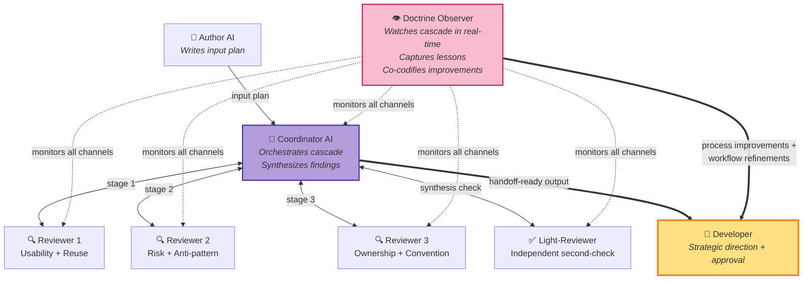
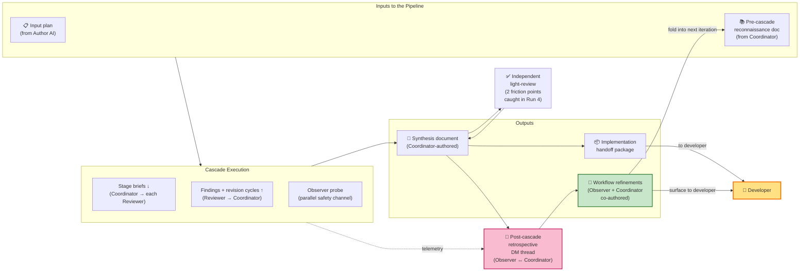

# Cascaded AI Code-Review Pipeline — Executive Summary

**Date**: 2026-05-20
**Audience**: External management briefing
**Status**: Draft for review
**Project**: planning-is-prompting (Claude Code workflow infrastructure)

---

## TL;DR

Over the past six weeks, we designed, built, and now successfully production-trialed a **multi-agent AI code-review pipeline** that runs five specialized AI reviewer roles in sequence, with a sixth AI acting as coordinator and synthesizer. The pipeline's design goal: **deliver thorough multi-perspective code review while minimizing how often the developer must be interrupted.**

The headline result from last night's fourth full run: **a 90-minute review of a 444-line technical plan completed end-to-end with zero developer interruptions.** The developer was asleep for the entire duration; the AI pipeline produced an implementation-ready package without waking him.

This is the first fully autonomous completion. Earlier runs progressively drove developer attention cost from "many interruptions" to "zero interruptions" while the methodology matured. Seven concrete improvements are queued for the next iteration; four empirical gates are pre-committed for upcoming runs to keep the design grounded in evidence rather than intuition.

---

## What the Pipeline Solves

When a developer asks an AI for thorough code review, they typically get one of two unsatisfying options:

- **Single AI review**: fast but narrow — one perspective, easy to miss multi-angle issues.
- **Multiple AIs in parallel**: broad but un-synthesized — the developer becomes the bottleneck, manually mediating between conflicting recommendations and answering each AI's clarifying questions.

**Our approach**: Run five specialized AI reviewer roles **sequentially** (each focused on a distinct rubric — usability, risk, ownership, testing, etc.) with a sixth AI acting as a **coordinator**. The coordinator:

- Resolves disagreements between reviewers using internal escalation tiers, surfacing to the developer only for genuinely irreversible decisions
- Synthesizes findings into a single unified handoff package
- Manages workflow state, timing, and inter-AI communication

The key design property: **the developer's attention is the scarce resource.** The pipeline is engineered to aggressively minimize user-facing questions.

---

## The Iteration Story (Four Runs)

| Run | Date | Scope | Wall-clock | Developer interruptions | What we learned |
|---|---|---|---|---|---|
| Run 1 | April | Partial proof-of-concept | — | Many | Concept-validation; surfaced the need for a coordinator role |
| Run 2 | May 17 | Toy end-to-end | 49 min | 2-3 (terminal-only) | Baseline; confirmed pipeline shape works |
| Run 3 | May 19 | Real production work (444-line plan) | 108 min | 2 (one bundled question + one threshold decision) | **~37× reduction in developer-facing questions** vs. a no-pipeline baseline (estimated 75 questions → 2 actual). Surfaced 9+ process improvements. |
| Run 4 | May 20 (overnight) | Real production work (different 444-line plan) | **90 min** | **0** | **First fully autonomous run.** Two new design features (preparation phase + handoff phase) validated on first production use. Surfaced 7 further improvements. |

**The trend is the story**: across four iterations, developer interruption count fell from "many" → "few" → "two" → "zero."

---

## What Made Run 4 Different

Two design upgrades shipped between Run 3 and Run 4, both validated empirically on their first production run:

### Preparation Phase (added pre-Run-4)

Before the review pipeline starts, the coordinator AI now assembles a **pre-cascade reconnaissance document** — answers to predictable cross-cutting questions ("which library should we use for X?", "what's our naming convention for Y?", etc.) that would otherwise trigger multi-turn clarification cycles during the review.

**Empirical result in Run 4**: the reconnaissance document eliminated **6 questions upstream** that would have spawned developer escalations. The highest-leverage single example: a 4-minute pre-read on which observability library to use prevented an entire multi-turn cycle that would otherwise have escalated to the developer mid-review.

### Handoff Phase (added pre-Run-4)

After the reviewers finish, the coordinator AI synthesizes findings into a handoff package — and then a **different AI** runs an independent "cold-context" sanity check on that synthesis.

**Empirical result in Run 4**: the coordinator's self-check identified 3 friction points. The independent second-check caught **2 additional friction points** the self-check missed. This proves the two-administrator validation is **independently valuable, not redundant** — a meaningful design finding.

---

## How It Works Operationally

The system runs on [Claude Code](https://claude.com/claude-code), Anthropic's AI coding assistant. The developer launches five to six terminal sessions simultaneously, each running a Claude Code instance with a different specialized persona (a name, voice, and rubric focus). Sessions communicate through three channels:

- A **shared message-board** between sessions — think of it as Slack channels for AI peers
- **Direct messages** between specific session pairs
- A **heartbeat daemon** that prevents sessions from blocking each other or sitting idle

The developer's runtime role:

1. Launch the sessions and assign roles at start
2. Stay available for "Tier 3" escalations — decisions that are genuinely irreversible and need a human
3. Walk away

Run 4's empirical proof: with the design now mature, the Tier 3 escalation queue stayed empty for the full 90 minutes. The developer was asleep, by explicit pre-cascade arrangement.

---

## Architecture: Roles and Information Flow

### Diagram A — Roles and Reporting Relationships

The Developer sits at the strategic-direction layer — launches all AI sessions and gives final approval. The Author writes the input plan. The Coordinator runs the cascade: stage briefs flow down to each Reviewer, findings flow back up, with revision cycles as needed. The Light-Reviewer independently second-checks the Coordinator's synthesis. The Doctrine Observer sits **outside** the cascade, monitoring every communication channel without participating in the review itself; its outputs (process improvements + workflow refinements) flow directly to the Developer in parallel with the Coordinator's handoff.

### Diagram B — Information and Data Flows

Inputs to the pipeline are the input plan (from the Author) and a pre-cascade reconnaissance document (authored by the Coordinator before the cascade starts). The cascade execution exchanges stage briefs downward and findings upward, with the Observer probing as a parallel safety channel. The Coordinator produces a synthesis document, which gets independently light-reviewed before becoming the implementation handoff package delivered to the Developer.

**The closed loop**: post-cascade, the Observer and Coordinator hold a retrospective direct-message thread that produces workflow refinements. Those refinements fold back into the next iteration's pre-cascade reconnaissance, making the system self-improving. Refinements also flow directly to the Developer for oversight.

---

## How the Pipeline Self-Improves: The Doctrine Observer Role

The pipeline has six AI roles directly involved in producing the review (author, coordinator, three reviewers, light-reviewer). A seventh role — the **Doctrine Observer** — sits outside the cascade and does not participate in the review itself. Its purpose is to ensure the pipeline gets better each time it runs.

### What the observer does during the cascade (real-time)

The Doctrine Observer launches as a separate AI session at the same time as the cascade and watches every channel of inter-AI communication — message-board posts, direct messages, heartbeat ticks, stage outputs. It does not produce findings, does not take coordinator decisions, and does not interrupt the work. It probes the shared message-board on a regular cadence as a parallel safety channel — a second pair of eyes for moments when the coordinator's primary attention gets buried under high-traffic interaction.

### What the observer does after the cascade closes (retrospective)

Once the cascade signals complete, the observer partners with the coordinator on a structured retrospective: two to four direct-message rounds, no developer involvement required, converging on a concrete list of process improvements. The observer then co-authors the changes to the workflow playbook documents that ship into the next iteration.

### Empirical value contributed in Run 4

1. **Real-time safety net** — caught a 13-minute coordinator "phantom-lag" during Stage 2 when heartbeat-tick traffic briefly buried a peer reviewer's message. The observer's parallel probe surfaced the unread message and unblocked the lag. This event was the empirical anchor for a new failure mode now formally catalogued.

2. **Canonical record of the run** — authored the cross-iteration-comparable retrospective entry in the design document, preserving the ability to compare runs across time in the same format as Runs 2 and 3.

3. **Methodological self-correction** — during the post-cascade retrospective conversation, the observer and coordinator together caught two methodological biases that would otherwise have shipped uncorrected: a "recovered telemetry is not real saving" issue, and a confounded-variable issue in one of the headline findings. Both corrections improve the integrity of future evidence.

4. **Improvement codification** — surfaced and shaped the seven improvements now queued for Run 5, including one that codifies the observer's own real-time-safety-net role into the formal playbook (the "observer probe channel" candidate).

### Two improvement surfaces, one role

The observer contributes to ongoing improvement of two distinct surfaces:

- **The implementation surface** (per-run quality): real-time mitigation of failure modes during the cascade; surfacing methodological biases during the retrospective. Without the observer, individual runs are noisier and produce shakier evidence.
- **The plan surface** (the workflow playbook itself): post-cascade codification of improvements into the playbook documents that govern the NEXT iteration. Without the observer, the pipeline does not learn — each run risks repeating the previous run's mistakes.

### Why this role is load-bearing

- Without the observer, real-time failure modes go undetected until either the coordinator recovers on its own (lucky) or the cascade stalls and surfaces to the developer (unlucky — and developer interruption is exactly what the system is designed to avoid).
- Without the observer, post-cascade lessons get extracted ad-hoc by the coordinator alone — and the coordinator's "how did I do?" cognitive frame systematically biases against finding its own gaps.
- The observer's structural distance from the cascade makes it the right role for cross-iteration continuity: it carries lessons from Run N into Run N+1's design.

**Bottom line**: removing the Doctrine Observer would not stop the cascade from working — but it would stop the cascade from getting better. The observer is the meta-engine of the pipeline's self-improving property. It is the role that turns each run's surprises into the next run's playbook entries.

---

## Quantitative Outcomes

| Metric | Run 3 (May 19) | Run 4 (May 20) | Interpretation |
|---|---|---|---|
| Developer interruptions | 2 | **0** | Pipeline can run fully unattended on mature design |
| Wall-clock duration | 108 min | **90 min** | 17% faster despite two new design features on first use |
| Actionable findings | 30+ | 19 + 2 friction points | Substantive review output |
| Pipeline capacity utilization | — | **57%** | 43% headroom — comfortable operating margin |
| Developer-facing-question reduction | **~37×** | (0 makes ratio undefined) | Order-of-magnitude reduction vs. no-pipeline baseline |

The Run 3 figure — 37× reduction in developer-facing questions — exceeded our pre-experiment prediction of 10× by a factor of 3-4×. Run 4 strengthens this with the asymptotic case (zero interruptions).

---

## Key Lessons Learned

### 1. The pipeline self-improves as a meta-property

Each run surfaces design gaps that get codified into the next iteration's playbook. Across Runs 2 → 3 → 4 we now have a proven three-iteration **"predict → measure → codify"** cycle. The workflow has acquired the meta-property of refining its own operating procedures as it executes — a compounding-quality dynamic.

### 2. Two-administrator validation beats one-administrator validation

The coordinator AI's self-checks systematically miss things a second independent AI catches. In Run 4: +2 findings on a base of 3 (a 67% additive ratio). If this ratio holds across more runs, we plan to promote the second-check from "default-on but optional" to "hard requirement."

### 3. Coordinator perception is a load-bearing surface

We discovered a new failure mode in Run 4: when message density gets high, the coordinator AI can briefly miss peer messages. The **monitor AI** caught and cleared this in 13 minutes by probing the shared message board. The dual-channel safety property — coordinator + monitor working in parallel — is now an explicit design goal, not a happy accident.

### 4. "What did the coordinator improvise?" is the highest-leverage diagnostic

When the coordinator AI improvises a step that isn't in the documented playbook, that improvisation is almost certainly a doctrine gap worth codifying. This diagnostic has now found three major gaps across runs (the preparation phase, the handoff phase, and the Run 4 mitigation surfaces). It's being added as a routine post-run checklist item.

---

## Improvements Ready for the Next Iteration

After last night's run, two AI personas (the doctrine consultant and the coordinator) conducted a retrospective conversation across two rounds of structured exchange. They converged on **seven codified improvements** plus one held placeholder:

| # | Improvement | Why it matters |
|---|---|---|
| 1 | Heartbeat-daemon kickoff standardization | Cheapest, universal change |
| 2 | Post-run self-audit sweep | Highest-leverage meta-item; institutionalizes the "what did I improvise?" diagnostic |
| 3 | Author-side consistency checklist | Tightens the most common failure family with three independent empirical anchors |
| 4 | Four-tier internal escalation vocabulary | Foundational shared language for future improvements |
| 5 | Coordinator proactive message-board read | Single-loop mitigation for the Run-4 phantom-lag failure mode |
| 6 | Monitor AI probe channel | Double-loop pair with #5 — second independent safety net |
| 7 | Multi-surface close-out protocol refinement | Cleans up the most nuanced piece of the workflow |
| placeholder | Explicit closure-context markers | Held pending more evidence (single anchor; not enough data yet) |

Plus **four pre-committed re-evaluation gates** — specific empirical questions to answer in Runs 5, 6, and 7 — that prevent design drift into "wait one more run."

---

## Two Methodological Catches Worth Highlighting

The retrospective conversation between AIs also surfaced two methodological self-corrections worth flagging — both representing the system catching its own bias:

1. **Recovered telemetry is not real saving.** Our "monotonically-decreasing per-stage time" pattern (38 → 33 → 21 minutes) initially looked like evidence that downstream reviewers were going faster than upstream ones. On closer review, the 33-minute number excluded the 13-minute coordinator phantom-lag — so it's recovered time, not real saving. We've held off formalizing the trend until we have more clean-sample data.

2. **Confounded variables in small-sample findings.** A "wisdom-versus-volume" interpretation of one reviewer's lower findings-per-minute but higher design-meta contribution sounded compelling, but the reviewer's slot in the pipeline confounds with reviewer identity. A controlled experiment is planned for Run 5 or 6 to disambiguate.

Both catches were made by the AIs themselves during the retrospective — without developer prompting. The methodology is becoming self-correcting.

---

## Next Steps

1. **Codification pass** (~75 minutes of paired AI work, no developer attention required): apply the 7 improvements to the workflow playbook documents. Currently awaiting developer greenlight.
2. **Run 5**: real production work, possibly with deliberate experimental variation (controlled-slot experiment) to test the wisdom-curve hypothesis.
3. **Run 7 evaluation gates**: re-evaluate whether two-administrator validation becomes a hard requirement; re-evaluate the forward-asymmetry timing hypothesis with clean-sample data.

---

## Bottom Line

We've designed a multi-agent AI review pipeline that — as of last night — runs reliably **without developer interruption** for 90 minutes on real production work, produces implementation-ready output, and progressively self-improves each iteration.

Four runs over six weeks have demonstrated:

- A consistent quantitative trend toward zero developer interruption (a ~37× reduction empirically demonstrated in Run 3; reached zero in Run 4)
- Two major design features (preparation phase + handoff phase) validated on first production use
- Self-discovery of new failure modes and their mitigations within the same run
- A retrospective process that surfaces methodological self-corrections without developer prompting

The methodology has matured to the point where the developer's role has shifted from "constant attention recipient" to "launch and walk away." Seven specific improvements are queued for the next iteration; four empirical gates are pre-committed for Runs 5 through 7.

---

## References

For technical detail, see the canonical design document in the `planning-is-prompting` repository:

- `src/rnd/2026.05.17-cascaded-plan-review-pipeline.md` — full design, with empirical results across all four runs and the v1.1 improvement candidate table

— Drafted by María (Claude Code session in the planning-is-prompting repository), 2026-05-20.
