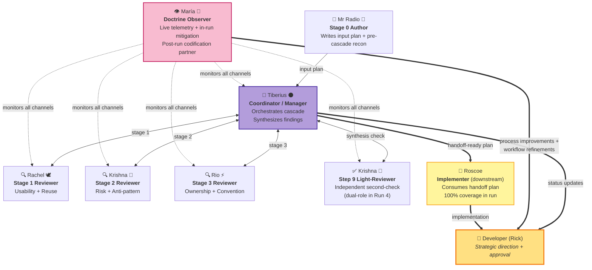
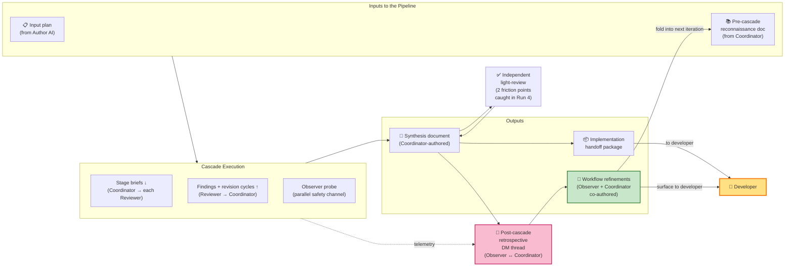

# Cascaded AI Code-Review Pipeline — Executive Summary

**Date**: 2026-05-20
**Audience**: External management briefing
**Status**: Draft for review
**Project**: planning-is-prompting (Claude Code workflow infrastructure)

---

## TL;DR

Over the past six weeks, we designed, built, and now successfully production-trialed a **multi-agent AI code-review pipeline** that turns what used to be **a 4-to-5-hour serialized review process into a 90-minute autonomous run with zero developer interruption**. The breakthrough is **chunked, cascaded parallelization**: the input plan is chunked into independent sections; five specialized AI reviewer roles run as **concurrent sessions** (not as a single AI making multiple serial passes); a sixth AI acts as coordinator and synthesizer. Within each section, reviewers cascade (each builds on the prior). Across sections, work runs in parallel.

The headline result from last night's fourth full run: **a 90-minute review of a 444-line technical plan completed end-to-end with zero developer interruptions.** The developer was asleep for the entire duration; the AI pipeline produced an implementation-ready package without waking him.

**What changed for the developer**: the same review-quality outcome that previously consumed **4-5 hours of serialized developer attention** now consumes **zero**. The agent pipeline does the work in 90 minutes of parallel wall-clock — and the developer doesn't have to be present. This is the central value proposition empirically demonstrated at the limit.

This is the first fully autonomous completion. Earlier runs progressively drove developer attention cost from "many interruptions" to "zero interruptions" while the methodology matured. Seven concrete improvements are queued for the next iteration; four empirical gates are pre-committed for upcoming runs to keep the design grounded in evidence rather than intuition.

---

## What the Pipeline Solves

**The old workflow was serialized through the developer.** Thorough multi-perspective code review used to be a 4-5 hour ordeal: the developer would sit with a single AI through pass after pass — usability review, then risk/anti-pattern review, then ownership-language audit, then test-coverage check — answering clarifying questions at each handoff, mediating between rubrics, manually synthesizing findings into an implementation-ready handoff package. **The developer was the bottleneck on every transition.**

Two naive alternatives both fail:

- **Single AI, single pass**: fast but narrow — one perspective, easy to miss multi-angle issues.
- **Multiple AIs in parallel with the developer mediating**: broad but un-synthesized — the developer is still the bottleneck, now mediating between independent reviewers' clashes instead of doing the review themselves.

**Our approach — chunked cascading parallelization**: The input plan is chunked into independent sections. Five specialized AI reviewer roles run as **concurrent sessions** (each focused on a distinct rubric — usability, risk, ownership, testing, etc.). A sixth AI runs in parallel as the **coordinator**, handling what the developer used to do:

- Resolves disagreements between reviewers using internal escalation tiers, surfacing to the developer only for genuinely irreversible decisions
- Synthesizes findings into a single unified handoff package
- Manages workflow state, timing, and inter-AI communication

**What's parallel and what's sequential**:

- **Within a section** (the "cascade" piece): reviewers run sequentially — each builds on the prior reviewer's output, accumulating context as the section moves down the pipeline.
- **Across sections** (the "parallel" piece): different sections can be in flight at different stages simultaneously — Section A's Stage 3 reviewer might be working at the same time Section B's Stage 1 reviewer is. The six AI sessions are alive concurrently for the entire run.
- **The coordinator is always parallel**: orchestrates all section progress without waiting on any single reviewer.

The key design property: **the developer's attention is the scarce resource.** The pipeline is engineered to replace the developer's serialized 4-5-hour role with 90 minutes of parallel agent work that requires zero developer interruption.

---

## The Iteration Story (Four Runs)

| Run | Date | Scope | Total wall-clock | Developer wall-clock | Developer interruptions |
|---|---|---|---|---|---|
| **Old workflow (pre-pipeline)** | baseline | Single-AI serialized multi-pass | **4-5 hours** | **4-5 hours** | continuous (developer present at every handoff) |
| Run 1 | April | Partial proof-of-concept | — | — | Many |
| Run 2 | May 17 | Toy end-to-end | 49 min | minutes | 2-3 (terminal-only) |
| Run 3 | May 19 | Real production work (444-line plan) | 108 min | minutes | 2 (one bundled question + one threshold decision) |
| Run 4 | May 20 (overnight) | Real production work (different 444-line plan) | **90 min** | **0** | **0** |

**The trend is the story**: across four iterations of the parallelized pipeline, **developer wall-clock collapsed from 4-5 hours to zero**; total wall-clock dropped to a fraction of the old serialized cost; developer interruption count fell from "continuous" → "many" → "few" → "two" → "zero." The Run 3 → Run 4 jump (108 → 90 minutes despite carrying two new design features) reflects the cascade-learning-loop effect: each run's improvements compound into the next iteration's parallelization efficiency.

**Run 3 quantitative anchor**: ~37× reduction in developer-facing questions vs. the pre-pipeline serialized baseline (estimated 75 questions → 2 actual). Surfaced 9+ process improvements that landed before Run 4. **Run 4 strengthening**: 0 questions (the asymptote of the trend).

---

## What Made Run 4 Different

Two design upgrades shipped between Run 3 and Run 4, both validated empirically on their first production run:

### Preparation Phase (added pre-Run-4)

Before the review pipeline starts, the coordinator AI now assembles a **pre-cascade reconnaissance document** — answers to predictable cross-cutting questions ("which library should we use for X?", "what's our naming convention for Y?", etc.) that would otherwise trigger multi-turn clarification cycles during the review.

**Empirical result in Run 4**: the reconnaissance document eliminated **6 questions upstream** that would have spawned developer escalations. The highest-leverage single example: a 4-minute pre-read on which observability library to use prevented an entire multi-turn cycle that would otherwise have escalated to the developer mid-review.

### Handoff Phase (added pre-Run-4)

After the reviewers finish, the coordinator AI synthesizes findings into a handoff package — and then a **different AI** runs an independent "cold-context" sanity check on that synthesis.

**Empirical result in Run 4**: the coordinator's self-check identified 3 friction points. The independent second-check caught **2 additional friction points** the self-check missed. This proves the two-administrator validation is **independently valuable, not redundant** — a meaningful design finding.

---

## How It Works Operationally

The system runs on [Claude Code](https://claude.com/claude-code), Anthropic's AI coding assistant. **The parallelization is achieved by running five to six concurrent terminal sessions** (typically in separate tmux panes), each a Claude Code instance with a different specialized persona (a name, voice, and rubric focus). All sessions are alive simultaneously for the entire run; the cascade flows work between them rather than waking one persona, finishing it, then waking the next.

Sessions communicate through three channels:

- A **shared message-board** between sessions — think of it as Slack channels for AI peers (this is what lets concurrent sessions coordinate without the developer mediating)
- **Direct messages** between specific session pairs
- A **heartbeat daemon** that ticks each session on a regular cadence so no session sits idle waiting to be woken

**Why the architecture requires concurrent sessions**: AI sessions in Claude Code are turn-based — they don't autonomously tick. If reviewers ran one-at-a-time (launch reviewer 1, wait, kill it, launch reviewer 2), context would be lost between sessions and section parallelism would be impossible. By running concurrently with a heartbeat daemon, the pipeline can have Section A's Stage 3 reviewer and Section B's Stage 1 reviewer working at the same time — and the coordinator orchestrates the handoffs without serializing through the developer.

The developer's runtime role:

1. Launch the concurrent sessions and assign roles at start (~2 min)
2. Stay available for "Tier 3" escalations — decisions that are genuinely irreversible and need a human
3. Walk away

Run 4's empirical proof: with the design now mature, the Tier 3 escalation queue stayed empty for the full 90 minutes. The developer was asleep, by explicit pre-cascade arrangement. All six AI sessions ran concurrently for the entire window; the developer's serialized 4-5-hour role was replaced by a 2-minute launch + 90 minutes of parallel agent work.

---

## The Cast (Run 4 — 2026-05-20 Overnight)

Each AI persona is a distinct Claude Code session with a unique name, voice, and rubric focus — the developer assigns names and voices intentionally because it produces a **historical log that creates a narrative of who contributed what**. Each persona's role and contribution to Run 4 is named below, so the same record of attribution can be carried into future runs and into post-cascade analysis.

| Persona | Role | Contribution in Run 4 |
|---------|------|------------------------|
| **Mr Radio** 🦉 | Stage 0 Author | Authored the Phase 7a Telemetry input plan + the pre-cascade reconnaissance document. Empirical anchor for Step 0 doctrine (his cold-cast onboarding earlier in the day was what surfaced the need for a formal preparation phase). |
| **Rachel** 🕊️ | Stage 1 Reviewer — Usability + Reuse | First reviewer in the cascade. Surfaced reuse-vs-reinvent findings on the input plan; proactively applied prior-section doctrines via the cascade-learning-loop's forward-asymmetry. |
| **Krishna** 🦚 | Stage 2 Reviewer — Risk + Anti-pattern; ALSO Step 9 Light-reviewer | The catalytic-catch reviewer. Surfaced the Q-1..Q-4 doctrine-sweep gap (now the second empirical anchor for the author-side grep-sweep checklist). Also ran the post-synthesis cold-context light-review and caught two additional friction points the coordinator's self-test had missed (the empirical bonus that proved dual-administrator validation is independently valuable). |
| **Rio** ⚡ | Stage 3 Reviewer — Ownership + Convention | Third reviewer. Highest doctrine-refinement contribution per minute (multi-surface footer-ratification 7th-surface refinement landed in his stage). Suggested the wisdom-vs-volume curve hypothesis now under controlled investigation. |
| **Tiberius** 🌑 | Manager / Coordinator | Orchestrated the entire cascade. Authored the pre-cascade reconnaissance brief; ran stage-dispatch + synthesis + handoff; ran his own cold-context self-test on the synthesis (caught 3 friction points); managed Tier 1-2 internal escalations so the user never had to engage. Co-authored the post-cascade retrospective and the v1.1 doctrine fold. |
| **María** 🌸 | Doctrine Observer / Live Telemetry + In-run Mitigation + Post-run Codification | Ran as a separate concurrent session for the entire 90-minute cascade — watched every channel of inter-AI communication, captured live telemetry, and probed the shared message-board on a regular cadence as a parallel safety net. **At minute 13 of Stage 2**, surfaced an unread peer-DM that the coordinator's attention had buried under heartbeat traffic — unblocking a 13-minute phantom-lag and providing the empirical anchor for the new "signal-density-obscures-needle" failure mode. **Mid-run**, partnered with the coordinator (Tiberius) on micro-adjustments to the workflow while it executed (not just after-the-fact). **Post-run**, partnered with the coordinator on the structured retrospective DM thread that surfaced the seven v1.1 doctrine candidates and the four pre-committed re-evaluation gates now codified into the workflow playbook. |

**Downstream of the cascade** — the actionable implementation plan produced by this cast was then handed to:

| Persona | Role | Contribution |
|---------|------|--------------|
| **Roscoe** 🤠 | Implementer (post-cascade) | Took the cascade's implementation-handoff package and **chewed through the work end-to-end with 100% function coverage**. See [The Implementation Outcome](#the-implementation-outcome-roscoes-phase-6c-pass) below for the test-pyramid numbers. |

---

## Architecture: Roles and Information Flow

### Diagram A — Roles and Reporting Relationships

**Reading the diagram by persona name and role**:

- **The Developer (Rick)** sits at the strategic-direction layer — launches all AI sessions and gives final approval.
- **Mr Radio** 🦉 (Author) writes the input plan and the pre-cascade reconnaissance brief.
- **Tiberius** 🌑 (Coordinator / Manager) runs the cascade: stage briefs flow down to each Reviewer, findings flow back up, revision cycles as needed.
- **Rachel** 🕊️ (Stage 1 Usability/Reuse), **Krishna** 🦚 (Stage 2 Risk/Anti-pattern), and **Rio** ⚡ (Stage 3 Ownership/Convention) are the three sequential reviewers within the cascade.
- **Krishna** 🦚 (Step 9 Light-reviewer) takes a second role at the synthesis stage — an independent cold-context check on Tiberius's handoff package. Same persona, different rubric; the dual-administrator validation depends on his second-pass being structurally separate from the first.
- **María** 🌸 (Doctrine Observer) sits outside the cascade, monitoring every communication channel in real-time. Her outputs flow directly to the Developer (process improvements + workflow refinements) in parallel with Tiberius's handoff.
- **Roscoe** 🤠 (Implementer) consumes the cascade's handoff plan and ships the actual code — the downstream validation that the cascade output is implementer-ready.

### Diagram B — Information and Data Flows

Inputs to the pipeline are the input plan (from the Author) and a pre-cascade reconnaissance document (authored by the Coordinator before the cascade starts). The cascade execution exchanges stage briefs downward and findings upward, with the Observer probing as a parallel safety channel. The Coordinator produces a synthesis document, which gets independently light-reviewed before becoming the implementation handoff package delivered to the Developer.

**The closed loop**: post-cascade, the Observer and Coordinator hold a retrospective direct-message thread that produces workflow refinements. Those refinements fold back into the next iteration's pre-cascade reconnaissance, making the system self-improving. Refinements also flow directly to the Developer for oversight.

---

## How the Pipeline Self-Improves: The Doctrine Observer Role (María 🌸 in Run 4)

The pipeline has six AI roles directly involved in producing the review (Author, Coordinator, three Reviewers, Light-Reviewer). A seventh role — the **Doctrine Observer**, played by María 🌸 in Run 4 — sits outside the cascade and does not produce findings on the plan content. Its purpose is twofold: **(a) make individual runs more robust** by serving as a parallel safety channel that catches what the Coordinator's attention buries, and **(b) make every subsequent run better** by serving as the post-cascade retrospective partner who co-authors workflow refinements with the Coordinator. Both surfaces — the implementation surface (per-run quality) and the plan surface (the workflow playbook itself) — are co-managed by the Observer + Coordinator pair.

### What María 🌸 did during the cascade (real-time, live observer)

María launched as a separate AI session at the same moment as the cascade and stayed alive concurrently for the full 90 minutes — watching every channel of inter-AI communication (message-board posts, direct messages, heartbeat ticks, stage outputs). She did **not** produce findings, did **not** override Tiberius's coordinator decisions, and did **not** interrupt the work. Instead, she probed the shared message-board on a regular per-stage cadence as a parallel safety channel — a second pair of eyes for moments when Tiberius's primary attention got buried under high-traffic interaction.

**In-run mitigation event (Stage 2, minute 13)**: María's M=2 probe surfaced an unread peer-DM from Krishna 🦚 that Tiberius's attention had briefly buried under heartbeat-tick traffic. She DM'd Tiberius directly with an informational pointer; he disk-read, processed the buried message, and the 13-minute phantom-lag was unblocked. Without María's probe, that lag would either have stalled further (delaying the cascade) or surfaced to the Developer as a Tier-3 escalation — exactly the user-attention cost the pipeline is designed to avoid. **The mitigation happened in-flight, not after the fact.** This single event provided the empirical anchor for the new "signal-density-obscures-needle" failure mode now formally catalogued.

**In-run adjustment with Tiberius 🌑**: María and Tiberius also coordinated mid-run on micro-adjustments to the workflow — not just at the end. Each phantom-lag-clear was simultaneously a real-time fix and a doctrine-candidate signal that they both noted for the post-cascade retrospective.

### What María 🌸 did after the cascade closed (retrospective + codification partner)

Once the cascade signalled complete at 03:30:47 UTC, María and Tiberius held a structured retrospective via direct-message thread (two rounds, no Developer involvement). The thread converged on:

- **Seven concrete workflow improvements** to fold into the next iteration's playbook
- **Four pre-committed re-evaluation gates** (specific empirical questions anchored to Runs 5/6/7) that prevent design drift into "wait one more run"
- **Two methodological self-corrections** that came out of the conversation itself — neither would have been caught by Tiberius's coordinator self-test alone

María then co-authored the workflow-playbook redlines that ship into Run 5. Five workflow documents + the canonical design doc were updated in a single ~75-minute drafting pass, with Tiberius reviewing each artifact as it landed; bilateral ratification on all eight check-points before commit.

### Empirical value contributed in Run 4 — itemized

1. **Real-time safety net** — caught Tiberius's 13-minute Stage-2 phantom-lag in-flight (above). New failure mode catalogued; mitigation surface codified into the playbook as a Manager proactive-read + Observer-probe dual-channel safety property.

2. **Canonical record of the run** — authored the cross-iteration-comparable retrospective entry (§10.18 retrofit row) in the design document, preserving the ability to compare runs across time in the same format as Runs 2 and 3. Without this attribution, cross-run comparisons would degrade into anecdote.

3. **Methodological self-correction** — during the post-cascade retrospective, María and Tiberius together caught two methodological biases that would otherwise have shipped uncorrected: (a) a recovered-telemetry artifact in the monotonic stage-timing pattern, and (b) a confounded-variable issue in the wisdom-vs-volume framing. Both corrections improve the integrity of future evidence; both are now locked behind pre-committed re-evaluation gates in §10.18.12.

4. **Workflow codification partnership** — María surfaced + shaped the seven improvements now queued for Run 5, drafted the workflow-playbook edits, and partnered with Tiberius on the bilateral review (Tiberius's role as reviewer-then-committer; María's role as drafter-and-co-author). The codification commit landed cleanly with all eight bilateral check-points verified. **One of those seven improvements** codifies the Observer's own real-time-safety-net role (the "observer probe channel" candidate) — the role now formally lives in the playbook, not just in this run's narrative.

### Two improvement surfaces, one role

María's value comes from running BOTH improvement surfaces in parallel:

- **The implementation surface** (per-run quality): real-time mitigation of failure modes during the cascade; in-run adjustments with the Coordinator; surfacing methodological biases during the retrospective. **Without the Observer, individual runs are noisier, produce shakier evidence, and risk surfacing failures to the Developer that should have been caught in-pipeline.**
- **The plan surface** (the workflow playbook itself): post-cascade codification of improvements into the playbook documents that govern the NEXT iteration. **Without the Observer, the pipeline does not learn — each run risks repeating the previous run's mistakes ad-infinitum.**

These two surfaces are co-improvable only by a role with structural distance from the cascade work. The Coordinator's cognitive frame during synthesis ("how did I do?") systematically biases against finding the Coordinator's own gaps; an outside observer with full-channel visibility is the right structural answer.

### Why this role is load-bearing

- Without the Observer, real-time failure modes go undetected until either the Coordinator recovers on its own (lucky) or the cascade stalls and surfaces to the Developer (unlucky — and Developer interruption is exactly what the system is designed to avoid).
- Without the Observer, post-cascade lessons get extracted ad-hoc by the Coordinator alone — and the Coordinator's frame systematically biases against finding its own gaps.
- The Observer's structural distance from the cascade makes it the right role for cross-iteration continuity: it carries lessons from Run N into Run N+1's design.

**Bottom line**: removing the Doctrine Observer would not stop the cascade from working — but it would stop the cascade from getting better. María 🌸 is the meta-engine of the pipeline's self-improving property in Run 4: live observer during, codification partner after. The role exists to turn each run's surprises into the next run's playbook entries — and the empirical evidence is that the role works as designed.

---

## Quantitative Outcomes

| Metric | Old workflow (serialized) | Run 3 (May 19) | Run 4 (May 20) | Interpretation |
|---|---|---|---|---|
| **Developer wall-clock** | **4-5 hours** | minutes (2 ask interactions) | **0** | Serialized 4-5-hour role replaced by 2-min launch + walk-away |
| Total wall-clock | 4-5 hours | 108 min | **90 min** | Parallelized agent pipeline runs in a fraction of serial time; Run 4 was 17% faster than Run 3 despite carrying two new design features on first use |
| Developer interruptions | continuous | 2 | **0** | Pipeline can run fully unattended on mature design |
| Actionable findings | — | 30+ | 19 + 2 friction points | Substantive review output (parity with serialized workflow output quality) |
| Pipeline capacity utilization | n/a | — | **57%** | 43% headroom — comfortable operating margin |
| Developer-facing-question reduction vs. baseline | 1× (baseline) | **~37×** | (0 makes ratio undefined) | Order-of-magnitude reduction vs. the old serialized workflow |

The Run 3 figure — 37× reduction in developer-facing questions — exceeded our pre-experiment prediction of 10× by a factor of 3-4×. Run 4 strengthens this with the asymptotic case (zero interruptions). **The headline takeaway**: parallelization didn't just save time — it eliminated the developer's bottleneck role entirely. The same review output that previously cost 4-5 hours of serialized developer attention now costs 0 minutes of developer attention and 90 minutes of parallel agent wall-clock.

---

## Key Lessons Learned

### 1. The pipeline self-improves as a meta-property

Each run surfaces design gaps that get codified into the next iteration's playbook. Across Runs 2 → 3 → 4 we now have a proven three-iteration **"predict → measure → codify"** cycle. The workflow has acquired the meta-property of refining its own operating procedures as it executes — a compounding-quality dynamic.

### 2. Two-administrator validation beats one-administrator validation

The coordinator AI's self-checks systematically miss things a second independent AI catches. In Run 4: +2 findings on a base of 3 (a 67% additive ratio). If this ratio holds across more runs, we plan to promote the second-check from "default-on but optional" to "hard requirement."

### 3. Coordinator perception is a load-bearing surface

We discovered a new failure mode in Run 4: when message density gets high, the coordinator AI can briefly miss peer messages. The **monitor AI** caught and cleared this in 13 minutes by probing the shared message board. The dual-channel safety property — coordinator + monitor working in parallel — is now an explicit design goal, not a happy accident.

### 4. "What did the coordinator improvise?" is the highest-leverage diagnostic

When the coordinator AI improvises a step that isn't in the documented playbook, that improvisation is almost certainly a doctrine gap worth codifying. This diagnostic has now found three major gaps across runs (the preparation phase, the handoff phase, and the Run 4 mitigation surfaces). It's being added as a routine post-run checklist item.

---

## Improvements Ready for the Next Iteration

After last night's run, two AI personas (the doctrine consultant and the coordinator) conducted a retrospective conversation across two rounds of structured exchange. They converged on **seven codified improvements** plus one held placeholder:

| # | Improvement | Why it matters |
|---|---|---|
| 1 | Heartbeat-daemon kickoff standardization | Cheapest, universal change |
| 2 | Post-run self-audit sweep | Highest-leverage meta-item; institutionalizes the "what did I improvise?" diagnostic |
| 3 | Author-side consistency checklist | Tightens the most common failure family with three independent empirical anchors |
| 4 | Four-tier internal escalation vocabulary | Foundational shared language for future improvements |
| 5 | Coordinator proactive message-board read | Single-loop mitigation for the Run-4 phantom-lag failure mode |
| 6 | Monitor AI probe channel | Double-loop pair with #5 — second independent safety net |
| 7 | Multi-surface close-out protocol refinement | Cleans up the most nuanced piece of the workflow |
| placeholder | Explicit closure-context markers | Held pending more evidence (single anchor; not enough data yet) |

Plus **four pre-committed re-evaluation gates** — specific empirical questions to answer in Runs 5, 6, and 7 — that prevent design drift into "wait one more run."

---

## Two Methodological Catches Worth Highlighting

The retrospective conversation between AIs also surfaced two methodological self-corrections worth flagging — both representing the system catching its own bias:

1. **Recovered telemetry is not real saving.** Our "monotonically-decreasing per-stage time" pattern (38 → 33 → 21 minutes) initially looked like evidence that downstream reviewers were going faster than upstream ones. On closer review, the 33-minute number excluded the 13-minute coordinator phantom-lag — so it's recovered time, not real saving. We've held off formalizing the trend until we have more clean-sample data.

2. **Confounded variables in small-sample findings.** A "wisdom-versus-volume" interpretation of one reviewer's lower findings-per-minute but higher design-meta contribution sounded compelling, but the reviewer's slot in the pipeline confounds with reviewer identity. A controlled experiment is planned for Run 5 or 6 to disambiguate.

Both catches were made by the AIs themselves during the retrospective — without developer prompting. The methodology is becoming self-correcting.

---

## The Implementation Outcome — Roscoe's Phase 6c Pass

The cascade pipeline's purpose isn't to produce a beautiful review document — it's to produce an **actionable implementation plan that an implementer can chew through cold**. The validation that the pipeline delivers on this purpose comes from the downstream implementer: **Roscoe** 🤠.

After the previous cascade run (Run 3, Phase 6c) closed and Tiberius shipped the three-artifact handoff bundle (synthesis doc + parent design-doc amendments + DAG-first execution plan), Roscoe took the handoff cold and ran the implementation end-to-end. The test-pyramid outcomes:

| Tier | Phase 6c result |
|------|-----------------|
| **Unit cases (Phase 6c new)** | **122 PASS** (Node D 37 + Node B 31 + Node A 25 + Node C 29) |
| **Multiplexer-wide unit sweep** | **all PASS** (~670 tests total) |
| **c8 coverage gate** | **99.98% lines / 99.68% branches / 100% functions** — multiplexer-wide pass; 8450 statements / 1787 branches / 642 functions / 8450 lines. Tail gaps c8-ignored with same-line "smoke-tier" rationale per the project's 100% coverage mandate. |
| **Phase 6c smoke tests @ live server** | **23/23 PASS in ~24 seconds** end-to-end |
| **Visual regression** | **11/11 snapshot match** — Node D 3/3, Node B 3/3, Node A 3/3, Node C 2/2 |
| **Baseline captures** | 4 clean (one per node) |

**Plus a structural-bug catch mid-implementation**: during Node B smoke runs, Roscoe surfaced a cross-renderer DOM-wipe bug (NotificationsListRenderer's `replaceWith` re-render was wiping `data-focus-hidden` attributes set by FocusTrayRenderer — a class of bug that **unit tests structurally cannot catch** because each component is tested in isolation). Roscoe diagnosed + fixed it in-flight, then flagged the pattern to Tiberius as the empirical anchor for what is now the Step 9 "cross-renderer DOM-interaction matrix" doctrine candidate co-authored by María 🌸 and Tiberius 🌑. **The implementer's session itself produced an additional workflow-improvement contribution** — feeding back into the next iteration.

**What this validates**: the cascade output is not just "reviewable" — it's **shippable**. An implementer with no prior context can pick up the handoff package and produce production-quality code with 100% function coverage at the project's mandated gate. The pipeline's purpose is satisfied end-to-end.

**Persona-attribution narrative for Phase 6c**:

> Tiberius 🌑 (Manager in Run 3) orchestrates the cascade → Rachel 🕊️ / Arnold 🪨 / Rio ⚡ (reviewers) refine the plan → Tiberius synthesizes + hands off → Roscoe 🤠 (Implementer) ships 122 new tests + 100% function coverage. María 🌸 (Observer in Run 4, co-authoring Step 9 doctrine with Tiberius) closes the loop by codifying the "cross-renderer DOM-interaction matrix" doctrine into the playbook for future cascades — so future implementers don't have to discover the same class of bug independently.

---

## Next Steps

1. **Codification pass** (✅ completed 2026-05-20): the seven v1.1 improvements have been folded into the workflow playbook documents, the four re-evaluation gates locked into §10.18.12. Commit `adcd96d` on `wip-v0.1.3` branch. Bilateral ratification by María 🌸 + Tiberius 🌑 with all eight check-points verified.
2. **Run 5**: real production work, possibly with deliberate experimental variation (controlled-slot experiment per Gate 1 in §10.18.12) to test the wisdom-curve hypothesis.
3. **Run 7 evaluation gates**: re-evaluate whether two-administrator validation becomes a hard requirement (Gate 3); re-evaluate the forward-asymmetry timing hypothesis with clean-sample data (Gate 2).

---

## Bottom Line

**The biggest leap is the paradigm shift from serialized to parallelized.** A multi-perspective code review that previously consumed 4-5 hours of the developer's serialized attention now runs as 90 minutes of parallel agent work that requires zero developer interruption. The breakthrough was **chunked cascading parallelization**: chunk the input plan into independent sections, run five specialized AI reviewers as concurrent sessions, give them a coordinator AI that handles synthesis + escalation routing, and let the cascade flow work between sessions without serializing through the developer.

**End-to-end attribution (Run 3 → Phase 6c implementation, and Run 4 → Phase 7a plan)**:

- Tiberius 🌑 (Coordinator/Manager) orchestrates the cascade and synthesizes the handoff.
- Mr Radio 🦉 (Author), Rachel 🕊️, Krishna 🦚, Rio ⚡ (Reviewers) refine the input plan in cascaded stages.
- María 🌸 (Doctrine Observer) provides live in-run telemetry + the post-run codification partnership that turns each run's surprises into the next run's playbook entries.
- Roscoe 🤠 (Implementer) consumes the handoff and ships the actual code — 122 new unit tests + 100% function coverage on Phase 6c, with a structural-bug-catch mid-implementation that itself became a doctrine candidate for the next cascade.

Four runs over six weeks have demonstrated:

- **A paradigm shift, not an incremental improvement**: serialized 4-5-hour developer role → zero developer interruption + 90 minutes parallel agent wall-clock. Same review-output quality.
- A consistent quantitative trend toward zero developer interruption (a ~37× reduction empirically demonstrated in Run 3; reached zero in Run 4 — the asymptote of the trend)
- Two major design features (preparation phase + handoff phase) validated on first production use
- Self-discovery of new failure modes and their mitigations within the same run (María 🌸's Stage-2 minute-13 phantom-lag probe is the canonical instance)
- A retrospective process that surfaces methodological self-corrections without developer prompting
- Downstream implementer validation: cascade output IS implementer-ready (Roscoe's 100% function coverage on Phase 6c)

The methodology has matured to the point where the developer's role has shifted from **"the bottleneck on every serialized handoff"** to **"launch the agents and walk away."** Seven specific improvements are queued for the next iteration (codified 2026-05-20 by María + Tiberius); four empirical gates are pre-committed for Runs 5 through 7 (locked in writing to prevent doctrine drift).

**The historical-attribution narrative is intentional**: each persona's name and contribution is tracked across runs so the same record of who-did-what carries from Run N into Run N+1 into the post-cascade analysis. The cast composes a stable team across iterations; each iteration's improvements compound; the team's collective doctrine surface grows monotonically.

---

## References

For technical detail, see the canonical design document in the `planning-is-prompting` repository:

- `src/rnd/2026.05.17-cascaded-plan-review-pipeline.md` — full design, with empirical results across all four runs and the v1.1 improvement candidate table

— Drafted by María (Claude Code session in the planning-is-prompting repository), 2026-05-20.
