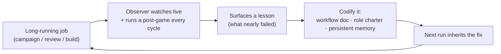

# [SUPERSEDED] The Workflow Observer: How a Dedicated Watcher Makes Our Processes Self-Improving

> **⚠️ SUPERSEDED (2026-06-08).** This briefing has been merged with its companion (`2026.06.07-swe-team-roles-as-hallucination-defense.md`) into a single thesis-driven briefing: **`2026.06.08-redundant-minds-trust-in-space-improvement-in-time.md`** (this doc became the "improvement in time" axis). Retained unchanged for the dated record; read the merged briefing for the current canonical version.

**Audience:** Project & engineering managers
**Date:** 2026-06-07
**Author:** María 🌸 (Workflow Steward / Observer)
**Companion artifacts:** the observer logs, post-games, and role charters cited in §6.

---

## 1. The idea, in one paragraph

When we run **long-running, multi-agent jobs** — overnight test-coverage campaigns, multi-session design reviews, autonomous build crews — we now run them with a **dedicated Workflow Observer** riding alongside. The Observer doesn't do the work and doesn't direct it; its single job is **process correctness**: to notice what worked, what *nearly* failed, and what should change next time. Those observations are then **folded back into the workflows themselves.** The result is a set of processes that **get better every time we use them** — a self-improving loop, rather than the same mistakes on repeat.

We started this in earnest about two weeks ago (late May 2026), and the compounding has been visible — including, several times, **a lesson preventing its own recurrence within a day.**

## 2. The loop, in one picture

Three properties make this trustworthy rather than hand-wavy:

- **Two cadences.** The Observer catches some issues **live** (mid-run) and the rest in a **post-game run every cycle** — a short retrospective that is *mandatory*, not optional.
- **Three durable homes.** A lesson is never just a Slack comment. It lands in one of three places that the *next* run automatically reads: a **workflow document**, a **role charter** (auto-loaded into each agent's brief), or a **persistent memory**.
- **No premature generalization.** A one-off observation is logged, but it only **graduates into a canonical, reusable framework after a second run validates it.** We don't enshrine lucky guesses.

## 3. From generic to specific: the loop actually closing

The strongest evidence isn't the diagram — it's the cases where a lesson, once codified, **changed the next run's outcome.** Five, in increasing specificity:

### 3.1 The stall that taught us to watch for stalls — *and then caught the next one*
- **The incident (2026-06-06):** during an autonomous build, a reviewer's verdict sat **~90 minutes unactioned** while both supervisors went quiet; the user returned to "no signs of life."
- **The lesson codified:** the Observer must **actively** detect stalls (pull receipts when a hand-off goes quiet), never passively wait — and *the supervising pair must not both go dark.* Folded into the SWE-team charter + memory.
- **The payoff (2026-06-07, next day):** an identical-shaped stall recurred — a build lane sat dormant ~110 min. This time the Observer **caught it from the receipts and escalated**, the manager re-fired, and we diagnosed it as a *new variant* (a manager occupied on a user question letting the build gate go dark). **The lesson prevented its own repeat, and refined itself in the process.**
- *Sources:* `io/post-games/2026.06.06-arbiter-closed-loop-postgame.md`; `2026.06.07-session-103-full-arc-postgame.md`.

### 3.2 Scattered observations maturing into a reusable framework
- **The raw material:** live Observer logs across a multi-session coverage campaign captured findings F1–F8, design ideas, and a running "**confabulation-correction ledger**" (~6 instances where an agent's claimed result was caught and corrected against the actual bytes).
- **The graduation:** after a *second, validating* run, those logs were generalized into a **project-agnostic framework** any team can reuse — a pre-flight gate, a reliability spine, a degradation-handling loop, and a 10-entry failure-mode catalog.
- **Why it matters to PMs:** this is the "generic from specific" move done responsibly — the runbook is reusable precisely *because* it was earned over two real runs, not theorized.
- *Sources:* `2026.05.30-cosa-coverage-campaign-observer-log.md` → `2026.06.01-dependable-coverage-campaign-framework.md` (+ `2026.06.01-cosa-coverage-wave2-observer-log.md`).

### 3.3 The process catching its own leaders
- **The case (2026-06-06):** on a real build, the **adversarial review step overturned BOTH the Observer's and the Manager's stated position** on a technical fact they had both missed. No rubber-stamp — *including the manager's own claim.*
- **The lesson codified:** a "**enumerate every call site before ruling**" check, folded into the Reviewer charter; plus a fleet-wide "**receipts before claims**" discipline.
- **Why it matters:** a self-improving process has to be able to correct the people running it, not just the workers. This proved it can.
- *Source:* `2026.06.06-swe-team-first-run-postgame.md`.

### 3.4 Deviation → doctrine → clean resolution, in hours
- **The deviation (2026-06-07):** when a worker went non-responsive, the manager **absorbed the worker's coding** instead of replacing the worker.
- **The lesson codified the same hour:** a **Cardinal Rule — "Manager's priority is MANAGE, not BUILD"** at the top of the Manager charter + a memory; a dead worker is *reaped and replaced*, never absorbed.
- **The validated outcome (same day, verified by receipts):** the manager reaped the dark worker, spawned a replacement who was productive **within ~10 minutes**, and stayed in the manager's chair. **The founding case in the charter now teaches the whole arc — deviation → correction → re-staff.**
- *Sources:* `workflow/swe-team-roles.md` (Manager charter, v1.1); memory `feedback_manager_manage_not_build`.

### 3.5 "Verify, don't assume" becoming a reflex
A family of small lessons, each born from a real miss, now operates as habit:
- **Verify-before-blame** — when the user returns thinking the fleet idled for hours, pull the git/commons receipts *first* (the cause is usually a notification-visibility gap, not idleness). Born from a 2026-06-06 mis-diagnosis (the silence was largely an upstream outage, not a coordination failure).
- **Repo ≠ filesystem** — a peer's "file is missing" is usually a search rooted in the wrong repo; verify with absolute paths. Born 2026-06-07.
- **Verify the allocated persona** — an agent's requested identity isn't a guarantee; confirm the real one. Born 2026-06-06 (requested one worker, got another, reported the wrong name).
- Each is **named, dated, and tied to a founding incident** — so it's auditable folklore-free.

## 4. Why this matters to a project manager

- **Compounding returns.** Each long-running job is cheaper and safer than the last, because last run's near-misses are this run's guardrails. The improvement curve is the asset.
- **Less human babysitting.** Every codified lesson removes a class of manual oversight. The same loop is now **building an automated version of the Observer** (a standing "vigilance" service) so the process keeps improving even when people are away — design captured in `2026.06.07-arbiter-deploy-architecture.md`.
- **Auditability, not folklore.** Every rule traces to a **dated incident + a primary evidence artifact** (a log line, a commit, a commons receipt). A new manager can read *why* each guardrail exists.
- **Self-correcting at every level.** The process can overrule the worker, the reviewer, *and* the manager — which is what keeps quality from depending on any single agent's good day.

## 5. The receipts (scale of the loop so far)

- **Arc:** ~2026-05-22 → present (~2 weeks), spanning cascaded-review runs, a multi-wave coverage campaign, an overnight all-tiers grind, and two autonomous build engagements.
- **Observer logs + post-games:** a dozen-plus dated artifacts (every cycle runs a post-game by mandate).
- **Codified lessons:** a growing library of named, dated guardrails living in workflow docs, role charters, and persistent memory — each cite-able to its founding case.
- **Failure-mode catalog:** a numbered, reusable list (e.g. **FM-20**, an unbounded-replay incident filed 2026-06-02) so known traps are designed around, not rediscovered.

## 6. References (for the curious manager)

| Theme | Artifact |
|-------|----------|
| Stall doctrine → next-day catch | `io/post-games/2026.06.06-arbiter-closed-loop-postgame.md` · `2026.06.07-session-103-full-arc-postgame.md` |
| Logs → reusable framework | `2026.05.30-cosa-coverage-campaign-observer-log.md` · `2026.06.01-dependable-coverage-campaign-framework.md` |
| Process overruling its leaders | `2026.06.06-swe-team-first-run-postgame.md` |
| Deviation → doctrine (manage-not-build) | `workflow/swe-team-roles.md` (Manager charter, v1.1) |
| Cascaded-review self-improvement | `2026.05.22-cascade-run-5-observer-log-post-game.md` · `2026.05.22-cascade-notif-sync-post-game.md` |
| Incident postmortem → failure-mode | `2026.06.02-sam-tts-storm-incident-postmortem.md` (FM-20) |
| The automated Observer (in build) | `2026.06.07-arbiter-deploy-architecture.md` |

---

*Prepared by the Workflow Steward. The honest through-line: I don't make the team faster by doing more work — I make the **process** smarter by making sure no hard-won lesson is ever learned twice.*
