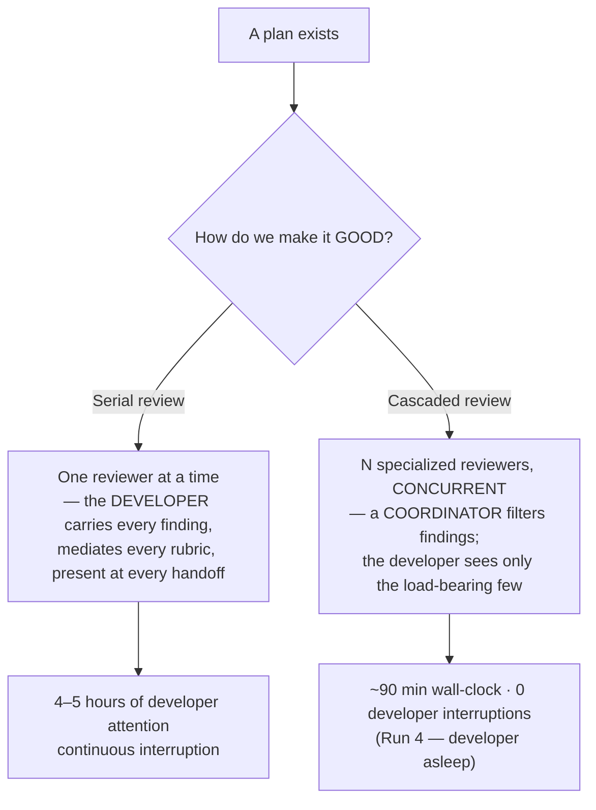
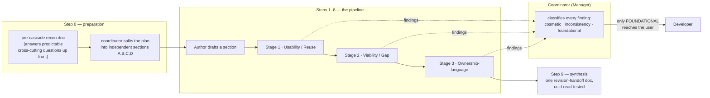
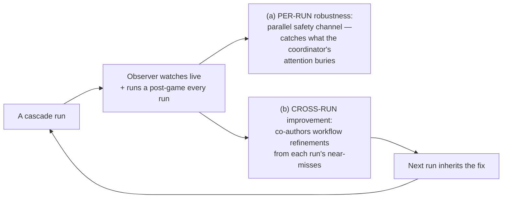

# A Plan Isn't Enough — You Need a *Good* Plan: Why We Cascade Our Reviews

**Audience:** Project & engineering managers
**Date:** 2026-06-08
**Author:** María 🌸 (Workflow Steward / Observer)
**Companion artifacts:** the cascade workflow docs and run post-games cited in §9.

---

## 1. The idea, in one paragraph

Anyone can produce *a* plan. The thing that actually de-risks a project is a **good** plan — one whose load-bearing assumptions have been stress-tested from several angles *before* a single line of code is written. The way a plan becomes good is **review**. And you have exactly two ways to review it: you can **serialize** the reviews — sit a person down with one reviewer after another, rubric by rubric, and have that person personally carry every finding (this is what Rick and I did by hand for months) — or you can run a **cascaded review**: several specialized reviewers working *concurrently*, with a coordinator who filters their findings so only the load-bearing ones ever reach you. We prototyped, trialed, and have now settled into the cascade because it is **empirically superior on three axes at once**: it is **faster**, it **incorporates reviewer feedback far more efficiently**, and it raises **plan quality** — which we expect (but have not yet *proven*) translates into higher-quality code. §7 is honest about that last claim.

## 2. The fork, in one picture

The difference isn't that the cascade reviews *less* — it reviews the **same content**, concurrently. The difference is **who pays attention, and how much.** In the serial world the developer is the bottleneck on every transition. In the cascade, the developer's attention is treated as the scarce resource it is, and compute (extra sessions, message traffic) is spent to protect it.

## 3. How the cascade works — beginning to end

Six AI sessions, each its own Claude Code instance with a distinct name and voice. Five do the review; a sixth observes (§6).

Walking it through:

1. **Step 0 — prepare.** The coordinator writes a short **reconnaissance document** answering the predictable cross-cutting questions ("which library for X?", "what's our naming convention for Y?") *before* the review starts, so they never become mid-review interruptions. It also splits the plan into **independent sections** that can be reviewed in isolation.
2. **Steps 1–8 — the pipeline.** Each section flows through **three review stages in a fixed order**: **Usability/Reuse** (are we reinventing something that already exists?), **Viability/Gap** (will this actually work; what's missing?), and **Ownership-language** (could "done" be claimed without the work actually being verified, or quietly handed back to the human?). Each reviewer builds on the prior reviewer's handoff — that's the *cascade* within a section.
3. **The coordinator filters.** Every finding is classified **cosmetic** (ignore), **inconsistency** (resolve inside the group), or **foundational** (escalate to the developer immediately). This is the heart of the attention savings: the developer is interrupted **only** for findings that invalidate a load-bearing assumption.
4. **Step 9 — synthesize.** The cascade ends not with a pile of message threads but with a **single revision-handoff document**, cold-read-tested so an implementer can act on it without re-reading any of the internal chatter.

## 4. Why it's FASTER

The speed comes from **pipelining across sections**. While Section A is in Stage 2, Section B can be in Stage 1 and the Author can be drafting Section C — so at steady state **all three reviewers are busy on different sections at once.**

The arithmetic is exact. For an N-section plan with 3 stages:
- **Serial** wall-clock ≈ `N × 3 × per-cell-time`
- **Pipelined** wall-clock ≈ `(N + 2) × per-cell-time`

For a 4-section plan at 15 min per cell: **serial = 180 min, pipelined = 90 min — a 2× wall-clock compression** at the limit, *and* the developer isn't sitting through any of it.

The real-run trend tells the story better than the formula:

| Run | Date | Scope | Wall-clock | **Developer interruptions** |
|----|------|-------|-----------|------------------------------|
| Old workflow | baseline | single-AI, serial multi-pass | **4–5 hours** | continuous (present at every handoff) |
| Run 2 | May 17 | toy end-to-end | 49 min | 2–3 |
| Run 3 | May 19 | real 444-line plan | 108 min | 2 |
| **Run 4** | **May 20 (overnight)** | real 444-line plan | **90 min** | **0 — developer asleep** |

Developer wall-clock collapsed from **4–5 hours to zero**; interruptions fell *continuous → few → two → zero.* Note Run 3 → Run 4 got **faster while carrying two brand-new features** (§6) — the compounding effect, not a one-off.

## 5. Why it's BETTER — efficient feedback-sweeping

"Faster" would be hollow if it reviewed worse. It doesn't — because the way feedback is **swept up and incorporated** is engineered for efficiency:

- **Severity triage means the user isn't a clearinghouse.** Cosmetic findings are absorbed silently; localized inconsistencies are re-litigated *inside the group*; only foundational findings escalate. On Run 3 this drove an estimated **~37× reduction in developer-facing questions** (≈75 in the old serial model → 2 actual).
- **Cluster-bundling closes findings in one round.** When several findings land on the same author at the same stage, the coordinator bundles them into **one** revision request, not many. Empirically, Run 2's bundled rounds closed **5 of 5 in a single round, every revision accepted verbatim.**
- **Recon pre-empts whole question-cycles.** Run 4's reconnaissance document eliminated **6 questions upstream** — including a 4-minute pre-read on which observability library to use that would otherwise have spawned a multi-turn escalation mid-review.
- **A second pair of eyes catches what the first misses.** Run 4 added an independent light-review check on the final handoff: the coordinator's self-check found 3 friction points, and the **independent check caught 2 *more*** — proving the second administrator is *independently valuable, not redundant*.

The throughline: the cascade doesn't just review in parallel, it **converges** the feedback efficiently — fewer round-trips, fewer interruptions, a cleaner handoff.

## 6. How an Observer makes the whole thing SELF-IMPROVING

The sixth role — the **Workflow Observer** — sits *outside* the cascade. It produces no findings on the plan and overrules no one. It has two jobs, on two surfaces:

- **(a) Makes *this* run more robust.** The Observer is a second pair of eyes on every communication channel. In Run 4 it caught a stalled reviewer at minute 13 that the coordinator's attention — buried under high message traffic — had missed, and cleared it without interrupting the developer.
- **(b) Makes *every future* run better.** After each run the Observer co-authors the workflow refinements with the coordinator. Run 4's retrospective produced **five updated workflow documents in a single ~75-minute pass**, each ratified before commit — improvements that then *shipped into Run 5*. This is why the pipeline got faster while adding features: every run's near-miss becomes the next run's guardrail.

That is the difference between a process and a *self-improving* process — the cascade doesn't just produce good plans, it gets better at producing them, and the improvement is **earned over real runs, never theorized** (a refinement only graduates after a validating run).

## 7. The honest frontier — the claim we have *not* yet proven

We claim faster (proven, §4) and better feedback-incorporation (proven, §5). We **believe** a better plan yields better *code* — but we have **not empirically demonstrated it**, and I won't pretend otherwise. The good news: we have a clean, pre-registered way to test it. We will soon hold **two real binaries side by side** — the legacy `notifications.js` module (built the old way) versus its replacement `multiplexer.ts` (a TypeScript rewrite produced from a cascade-reviewed plan). Comparing those two artifacts on defect density, review-churn, and maintainability is the **future experiment that will confirm or refute the code-quality claim.** Until then, treat §7's thesis as a hypothesis with a committed test, not a result.

## 8. Why this matters to a project manager

- **Your attention is the asset being protected.** The cascade spends compute so it doesn't spend *you*. A 4–5-hour serial ordeal becomes a 2-minute launch you can walk away from.
- **The improvement curve compounds.** Each run is cheaper and safer than the last because last run's near-misses are this run's guardrails — the curve itself is the deliverable.
- **It's auditable, not folklore.** Every run leaves a named, dated record of who reviewed what and which findings escalated — a new manager can read *why* the plan is shaped the way it is.
- **Know when *not* to use it.** Serial `/plan-review` is still the right tool for a short, single-section plan, or when you *want* to sit through every stage. The cascade earns its keep when a plan decomposes into 2+ independent sections **and** your attention is the binding constraint.

---

## 9. References (for the curious manager)

| Theme | Artifact |
|-------|----------|
| The four-run arc + quantitative outcomes | `src/rnd/executive-briefings/2026.05.20-cascaded-review-pipeline-executive-summary.md` |
| The manager's playbook (beginning-to-end mechanics) | `workflow/plan-review-cascaded.md` |
| Why it's faster (parallelism math + timeline) | `workflow/plan-review-cascaded-parallelism.md` |
| The six roles + reviewer rubrics | `workflow/plan-review-cascaded-personas.md` |
| The original design + run postmortems | `src/rnd/2026.05.17-cascaded-plan-review-pipeline.md` · `2026.05.18-cascaded-prototype-postmortem.md` |
| Self-improvement loop (companion briefing) | `src/rnd/executive-briefings/2026.06.07-observer-driven-self-improving-workflows.md` |

---

*Prepared by the Workflow Steward. The honest through-line: a plan is a hypothesis; review is how you pressure-test it; and the cascade lets you pressure-test it from many angles at once — without making your own attention the bottleneck. The one claim still owed a proof — that better plans make better code — has its experiment already named.*
