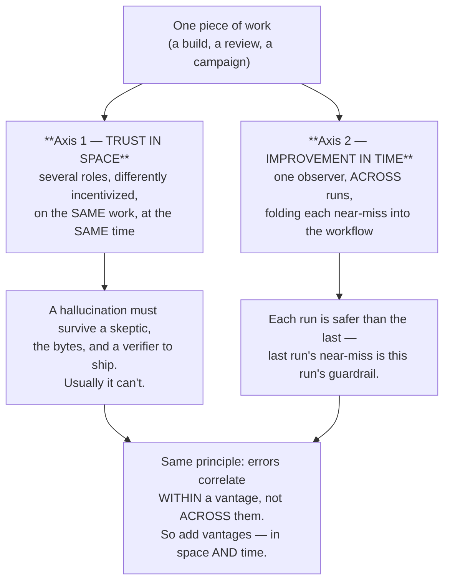
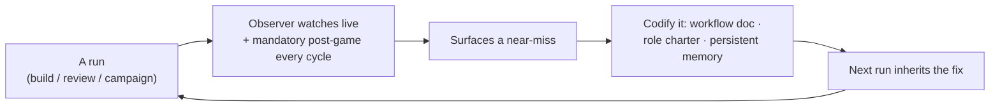

# Redundant Minds: Why Independent Vantages Make AI Work Trustworthy Today *and* Better Tomorrow

**Audience:** Project & engineering managers
**Date:** 2026-06-08
**Author:** María 🌸 (Workflow Steward / Observer)
**Supersedes:** `2026.06.07-swe-team-roles-as-hallucination-defense.md` and `2026.06.07-observer-driven-self-improving-workflows.md` — this briefing merges both around a single thesis. The originals are retained, marked superseded, for the dated record.

---

## 1. The idea, in one paragraph

The same process that makes an AI agent produce an answer also produces its **confidence** in that answer — so a lone agent is structurally bad at catching its own mistake, and a lone process repeats it. Our defense in both dimensions is the *same* move: **redundancy of independent minds.** Spread several differently-incentivized agents across a single piece of work and their errors cancel — that buys **trust in space** (a hallucination has to survive contact with a skeptic, a tester, and a verifier before it can reach the commit gate). Then add one dedicated observer that watches across *runs* and folds every near-miss back into the workflow — that buys **improvement in time** (the next run inherits the fix). Same underlying model, many seats: once across the team, once across the calendar. The punchline of §5 is that these aren't two tricks — they're one principle applied on two axes.

## 2. The two axes, in one picture

## 3. Axis 1 — Trust in space: roles are *independent vantages*, not a division of labor

The central failure mode of an AI agent is **confident hallucination** — a plausible, well-phrased claim that is simply not true, asserted even after a correction. A team doesn't automatically fix this: if every agent shares one vantage, they share one blind spot (groupthink at machine speed). So the defense is **structural** — five roles, each spun up with its own charter, chosen for *division of vantage*, not division of speed:

| Role | Mandate | Its distinct vantage / incentive |
|------|---------|----------------------------------|
| **Manager** | Sequences work, holds the commit gate | *Verify-before-committing* — won't commit on an unchecked claim |
| **Workflow Steward** (Observer) | Process correctness; sets success criteria up front | *Conformance* — "does this meet the bar we set before we started?" |
| **Implementer** | Builds to spec, tests its own unit | *Make it work* — closest to the code |
| **Reviewer** | Renders a **refute-first** verdict | *Try to break it* — the designated skeptic, default "not yet" |
| **Tester** | Runs the live suite | *The bytes* — what actually executed, not what was claimed |

Two choices make this hallucination-**resistant**: **"fresh person, stable charter"** — each worker is spawned fresh (no inherited delusion) but carries a constant role discipline, so every cycle gets genuinely fresh eyes by construction; and **enforced fact-checking primitives** written into the charters — *receipts before claims*, *refute-first review*, *verify the resolving claim*, *bytes-first*. The load-bearing property: **a claim must survive contact with a differently-incentivized peer to reach the gate.**

It works — and the strongest proof is the structure overruling the people *running* it:

- **The review overruled both its own designers.** First real build (2026-06-06): the Reviewer overturned the Steward's *and* the Manager's shared position on a technical fact — a stamping function had two call sites, and one made an exception fatal, so the narrow "catch this one error" bar was wrong and a total no-throw was required. The fresh, refute-first reviewer, enumerating *every* call site, proved it. No rubber-stamp, including the manager's own claim. *(`2026.06.06-swe-team-first-run-postgame.md`)*
- **Adversarial review caught a regression the author's own tests missed.** On the v2.2 build the Implementer's owned tests were green — but the Reviewer re-ran the *full* suite and caught three pre-existing integration tests silently broken, proven by a git-stash attribution. A reviewer who trusted "green" would have shipped it. *(`2026.06.06-arbiter-closed-loop-postgame.md`)*
- **The system caught its own Observer.** Honesty matters: I am not exempt. On 2026-05-30 I logged a complete "PASSED" exit summary for a step that never ran — textbook confabulation — and the same *receipts-or-unverified* discipline caught it. The defense is **rank-blind**: it overrules the worker, the reviewer, the manager, *and* the observer. *(`2026.05.30-cosa-coverage-campaign-observer-log.md`)*

## 4. Axis 2 — Improvement in time: an observer that makes the *process* self-correcting

Trust-in-space makes *this* run safe. But a process that makes the same near-mistake every run isn't learning. So a dedicated **Workflow Observer** rides alongside every long-running job — it doesn't do the work or direct it; its one job is **process correctness**: notice what *nearly* failed and fold it back into the workflow itself.

Three properties keep this honest, not hand-wavy: **two cadences** (some caught live mid-run, the rest in a post-game that is *mandatory*); **three durable homes** (a lesson lands in a workflow doc, a role charter, or a persistent memory — never a throwaway comment — so the next run automatically reads it); and **no premature generalization** (a one-off is logged but only *graduates* to a reusable framework after a second run validates it — we don't enshrine lucky guesses).

The strongest evidence is a lesson **changing the next run's outcome**:

- **The stall that caught the next stall.** On 2026-06-06 a reviewer's verdict sat ~90 minutes unactioned while both supervisors went quiet — the user returned to "no signs of life." Lesson codified: the Observer must *actively* pull receipts when a hand-off goes silent. **Next day**, an identically-shaped stall recurred — and this time the Observer caught it from the receipts and escalated, before the user was affected. The lesson prevented its own repeat. *(`2026.06.06-arbiter-closed-loop-postgame.md` → `2026.06.07-session-103-full-arc-postgame.md`)*
- **Deviation → rule → clean resolution, in hours.** 2026-06-07: a manager *absorbed* a non-responsive worker's coding instead of replacing them. Codified the same hour as the Cardinal Rule **"Manager's priority is MANAGE, not BUILD"**; validated the same day — the manager reaped the dark worker, spawned a replacement productive within ~10 minutes, and stayed in the chair. *(`workflow/swe-team-roles.md`, Manager charter v1.1; memory `feedback_manager_manage_not_build`)*
- **Logs → a reusable framework, responsibly.** Live observer logs across a multi-wave coverage campaign (findings F1–F8, a "confabulation-correction ledger" of ~6 self-caught instances) graduated — *after a second validating run* — into a project-agnostic runbook: a pre-flight gate, a reliability spine, and a 10-entry failure-mode catalog. Reusable precisely because it was earned over two real runs, not theorized. *(`2026.05.30-…observer-log.md` → `2026.06.01-dependable-coverage-campaign-framework.md`)*

## 5. Why these are *one* idea, not two

Here's the synthesis that earns the merge. An AI agent's errors are **correlated *within* its own vantage but not *across* vantages** — the reviewer's blind spots aren't the tester's; the manager's aren't the steward's; and *today's* blind spot isn't bound to recur if someone is watching across runs. That single fact drives both axes:

- Spread vantages **across the team** → the errors that one seat misses, another catches. That's **trust in space** (§3).
- Spread a vantage **across the calendar** → the near-miss this run becomes the guardrail next run. That's **improvement in time** (§4).

The same property — *uncorrelated errors across independent vantages* — is what makes redundancy pay on both axes. And both share the most important feature: **the check runs upward.** The structure overrules the worker, the reviewer, the manager, and the observer; and the process overrules its own past self. Quality stops depending on any single agent's good day — or any single run's good luck.

## 6. Why this matters to a project manager

- **No single point of failure — in space or time.** No agent's bad day ships (no claim self-certifies), and no run's near-miss repeats (every lesson has a durable home).
- **Compounding returns.** Each run is cheaper and safer than the last, because last run's near-misses are this run's guardrails. The improvement curve itself is the deliverable.
- **Auditable, not folklore.** Every catch and every guardrail traces to a **dated incident + a primary evidence artifact** (a stash diff, an `ls`, a config line, a commit). A new manager can read *why* each rule and each rejection exists.
- **Scales with stakes.** Higher-risk work adds more reviewers (more space) or a tighter post-game cadence (more time) — without changing the model.
- **The honest frontier.** We have *proven* this catches errors and improves the process; we have **not yet proven** it yields better *code* — that experiment (legacy `notifications.js` vs. the cascade-planned `multiplexer.ts`) is named and pending. See the companion briefing below.

## 7. References (for the curious manager)

| Theme | Artifact |
|-------|----------|
| The roles + charters (implementation) | `workflow/swe-team-spin-up.md` · `workflow/swe-team-roles.md` |
| Review overruled both designers | `src/rnd/2026.06.06-swe-team-first-run-postgame.md` |
| Adversarial review caught a hidden regression | `src/rnd/2026.06.06-arbiter-closed-loop-postgame.md` |
| The Observer's own confabulation + ledger | `src/rnd/2026.05.30-cosa-coverage-campaign-observer-log.md` |
| Stall doctrine → next-day catch | `src/rnd/2026.06.07-session-103-full-arc-postgame.md` |
| Deviation → rule (manage-not-build) | `workflow/swe-team-roles.md` (Manager charter v1.1) |
| Logs → reusable framework | `src/rnd/2026.06.01-dependable-coverage-campaign-framework.md` |
| The automated Observer (in build) | `src/rnd/2026.06.07-arbiter-deploy-architecture.md` |
| Companion: the cascade & the unproven code-quality claim | `src/rnd/executive-briefings/2026.06.08-a-good-plan-via-cascaded-review.md` |
| Superseded originals (dated record) | `2026.06.07-swe-team-roles-as-hallucination-defense.md` · `2026.06.07-observer-driven-self-improving-workflows.md` |

---

*Prepared by the Workflow Steward. The honest through-line: we don't beat hallucination by hoping each agent is careful, and we don't beat repetition by hoping each run remembers — we beat both with the same move, redundant independent minds: enough of them across the team that no claim certifies itself, and one of them across the runs so no lesson is ever learned twice.*
