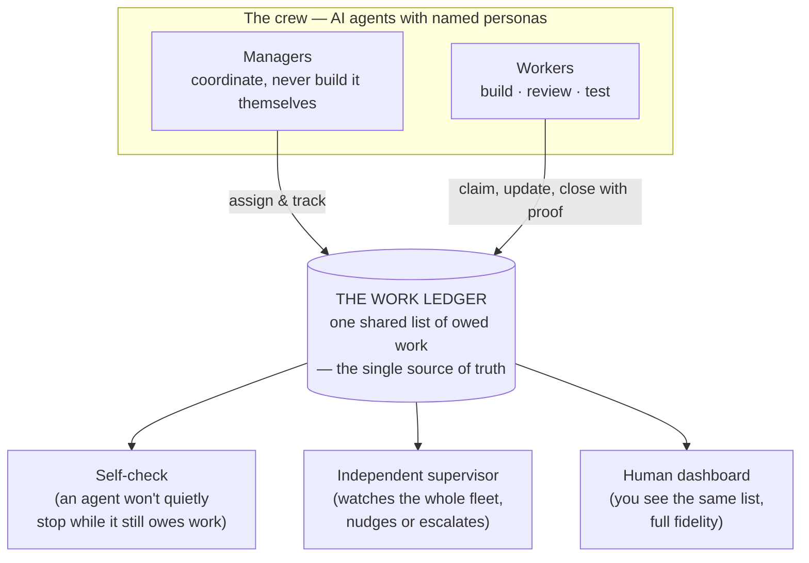

# How the Fleet Ships — An Operating-Model Explainer

**Date**: 2026-06-17 · **Author**: María 🌸 · **Audience**: project managers and leadership — *not* implementers
**Source material**: Mr. Radio's *Fleet Liveness & Unified Task-Store Architecture* + *Open Follow-Ups Plan* (lupin repo). This is the executive translation: the operating model, not the code.

> **One sentence**: We run a small crew of AI agents that share **one ledger of owed work**, keep **each other awake and moving** through long unattended sprints, and are allowed to mark something "done" **only when they can show proof** — with a human holding the few levers that are hard to undo.

---

## 1. Why this matters to you

When you ask a team of autonomous agents to work through a long sprint — overnight, across many hours, with little supervision — three things historically go wrong:

1. **Work gets lost.** Two agents disagree about what's still owed, because each is reading a different list.
2. **Agents go dark.** A session quietly stalls — finished-but-idle, stuck, or waiting on something — and nobody notices for an hour.
3. **"Done" isn't done.** An agent reports success, the tests are green, but the feature is actually broken — because the tests never exercised the real thing.

The system described here is our answer to all three. It is what lets us hand the fleet a large body of work and trust the result the next morning. Think of it as the **project-management operating system for a team of AI workers.**

---

## 2. The operating model in plain terms

Three ideas carry the whole thing:

**A. One ledger, not many.** Every unit of owed work — a task, a decision awaiting a ruling, a bug, a review request — lives in **one shared ledger**, and nowhere else. Because every agent and every watcher reads the *same* ledger, they cannot disagree about who owes what. This sounds obvious; it was the single biggest source of past failures, and we eliminated it *by design* rather than by patching.

**B. The work is self-describing.** Each item carries who owns it, who's chasing it, what it's blocked on, when to check on it again, and whether it's waiting on a human decision. A manager (or you) can glance at the ledger and understand the state of the sprint without reading any code or transcript.

**C. Nothing is "done" without a receipt.** The ledger physically refuses to let an agent close an item unless it cites evidence — a commit, a test run, a document, a log line. "Trust me, it's done" is not a state the system allows. This is the backbone of the accountability story in §5.

---

## 3. How a piece of work actually flows

The crew runs a standing loop for every build:

1. **A manager assigns work** to a worker with a complete, self-contained brief.
2. **The worker builds in isolation** (a private workspace, never the live system) and reports "green."
3. **A fresh, skeptical reviewer is brought in** — explicitly told to *reproduce, not trust* the worker's claim. This independent second set of eyes is deliberate: the builder and the checker are never the same agent.
4. **On approval, the manager commits and merges** the work — the crew has standing authority to do this once the work is green *and* reviewed.
5. **The matching ledger items are closed with the merge as the receipt**, and the workers are released.
6. **Publishing to the outside world stays a human decision.** The crew prepares everything; the human gives the word to push.

The important cultural point for a PM: **managers manage, they don't quietly take over the build.** If a worker stalls, the manager replaces it — it does not absorb the work itself. This keeps accountability legible and prevents one agent from becoming an untracked bottleneck.

---

## 4. How we keep agents alive across a long sprint

Two independent safety nets prevent the "went dark for an hour" failure:

- **The self-check (first line).** Before any agent goes idle, it asks the ledger "do I still owe anything?" If yes, it keeps going instead of stopping. This is deliberately *cheap* — it asks for a count, not the whole list, so it costs almost nothing to run every time.
- **The independent supervisor (second line).** A separate always-on watcher monitors the entire fleet for signs of life and progress. If a manager goes quiet while work is owed, or the whole fleet stalls, it nudges the session awake or escalates to the human. It can directly wake a dormant session.

Together these mean: **a long sprint doesn't rely on anyone watching the screen.** The fleet keeps itself moving, and a human only gets pulled in when something genuinely needs them.

*(Honest note: the supervisor currently over-warns in two cases — a manager that is finished, or one legitimately waiting on a human, can still trip a false "down" alarm. Making the supervisor "done-aware" and "waiting-on-human-aware" is the highest-value item in this week's follow-up work.)*

---

## 5. How we know the work is *real*, not just claimed

This is the part worth carrying upward, because it's what separates a demo from a dependable system.

**The receipts discipline** (from §2-C) means every "done" is backed by an artifact you can inspect. But we hold ourselves to a stricter bar than that, and it's worth understanding the principle:

> **A claim is only proven if the test could have failed.**

It's not enough for the system to *agree with itself*. If we check that two sources of truth match and they happen to match, we've shown they agree — we have *not* shown which one the system actually relies on. A real proof requires engineering a situation where a *wrong* implementation would visibly fail, and then showing it doesn't. We call the weaker version a "green-but-broken" result, and we actively hunt for it — a feature can pass its tests while being completely broken for a real user, if the tests only ever exercised a synthetic, friendly version of reality.

For leadership, the takeaway is simple: **when this fleet says "proven," it means an experiment that could have caught a lie didn't catch one** — not merely "the tests were green." Where we don't yet have that level of proof, we say so out loud and leave the item visibly open rather than checking a box we can't defend. (We are doing exactly that right now on one core claim — see §7.)

---

## 6. Where the human stays in control

The fleet is autonomous *inside a fenced yard* and gated *at the fence*:

| The crew does autonomously | The human is always asked |
|---|---|
| Spawn, review, replace, and release workers | **Publishing** work to the outside world (push) |
| Commit and merge reviewed, green work | Anything **irreversible or destructive** |
| Track, chase, and close its own owed work | Touching **shared infrastructure** everyone depends on |
| Make reversible, role-owned calls and log them | Any decision the human explicitly reserved for themselves |

The rule of thumb is **blast radius**: the easier something is to undo, the more freely the crew acts; the harder it is to undo, the more certainly a human is in the loop. This is what lets the crew move fast overnight without the human waking up to a surprise.

---

## 7. Maturity read — what's solid, what's still hardening

Honest status, because a maturity read is what leadership actually needs:

- **Live and working today**: the single shared ledger, the self-check, the independent supervisor, the human dashboard, and the manager/worker build loop. The migration to "one ledger" was completed and is in production.
- **Landing this week (in flight)**: making the supervisor done- and waiting-aware (stops false alarms); retiring the last piece of old scaffolding once we have evidence it's safe; and a handful of efficiency cleanups.
- **The one open proof we're holding honestly**: the system's central promise — that owed work is now read from the shared ledger and nothing else — is currently supported by inspection and a manual spot-check, **not** by an automated experiment of the kind §5 demands. We have deliberately **left that item open** and commissioned the real proof rather than declaring victory. That is the receipts discipline working as intended, on ourselves.

---

## 8. One-page glossary (for the food chain)

| Term | Plain meaning |
|---|---|
| **The fleet** | The crew of autonomous AI agents working a sprint together |
| **Persona** | An agent's stable named identity (so we can track who did what across the whole sprint) |
| **The (work) ledger / task store** | The one shared list of all owed work — the single source of truth |
| **Owed work** | Anything not yet done: tasks, decisions awaiting a ruling, bugs, review requests |
| **Self-check / heartbeat** | An agent's cheap "do I still owe anything?" check before it goes idle |
| **Arbiter / supervisor** | The independent always-on watcher that keeps the whole fleet alive and moving |
| **Manager vs. worker** | Manager coordinates and never builds it itself; worker builds, reviews, or tests |
| **Receipt** | The evidence (a commit, a test run, a document) required before anything can be marked done |
| **DoD — Definition of Done** | The agreed bar for "actually finished," including *proven to work* — not just "code written" |
| **Held / push** | Work is committed locally but not published; publishing is the human's call |
| **Green-but-broken** | Tests pass but the feature is actually broken — the failure mode our review process hunts for |

---

*Companion (implementer-level) references in the lupin repo: `src/docs/fleet-liveness-and-task-store-architecture.md` (full architecture) and `src/rnd/v0.1.8/2026.06.17-unified-task-store-followups-plan.md` (remaining work). Fresh-eyes review behind §7's open-proof note: `planning-is-prompting/src/rnd/2026.06.17-store-only-fresh-eyes-review-findings.md`.*
