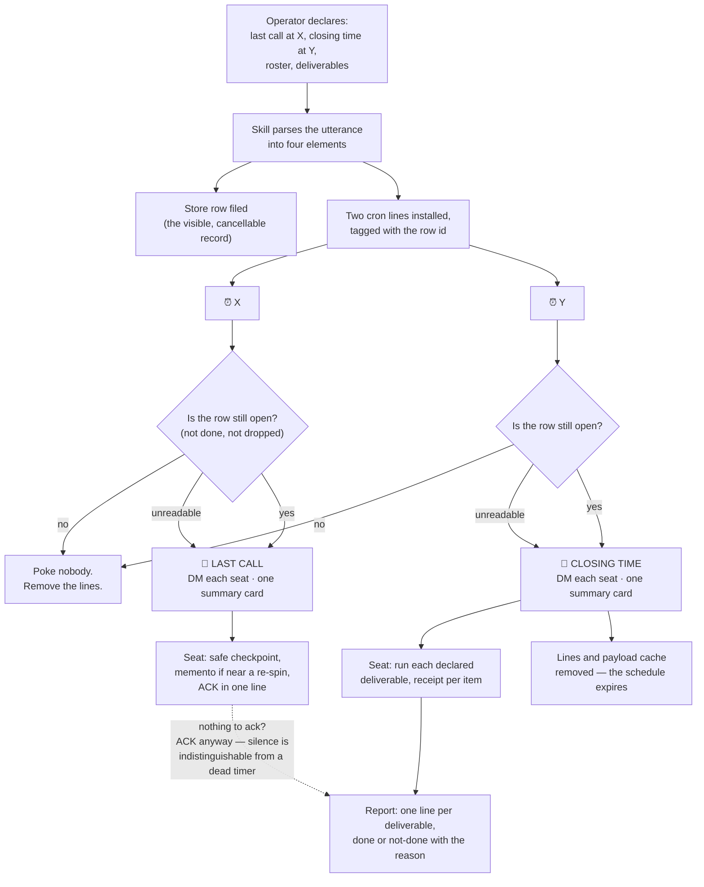

# Last Call 🔔 (canonical workflow)

**Status**: v1.0 — built 2026-09-23 on Rick's go, from the proposal `src/rnd/2026.09.22-scheduled-session-close-proposal.md` and his seven rulings of the same day (`TODO.md` § Decisions Log, commit `e9ccf57`).

**Purpose**: Turn one spoken sentence — *"we start wrapping up at 22:45 and run the full ritual at 23:00, and every manager gives me a push and a backup"* — into a **durable, cancellable, two-stage close** that survives a `/clear`, names who it binds, and names what each of them owes.

**When to use it**: whenever the operator declares an end time for the session, the shift or the day. The trigger is his sentence, not a clock.

**When NOT to use it**: ending one engagement (reap with mementos), freezing the fleet (`fleet-pause-resume.md`), or a single seat wrapping up on its own (`session-end.md` directly — a Last Call is for a roster, not for one seat).

**Key activities**: parse the declaration into four elements → file a store row → install two cron lines → **last call** (soft: stop starting, start finishing, ACK) → **closing time** (hard: run each declared deliverable, one receipted line each) → report and expire.

---

## 1. The two words, and why they are those words

| Word | Stage | Means |
|---|---|---|
| **last call** | soft, `wrap_at` | *Stop starting, start finishing.* It is **not** a stop order |
| **closing time** | hard, `close_at` | *Run your declared deliverables now, with a receipt each* |

Rick named it himself on 2026-09-23 — *"easy for me to remember"*. The glyph is 🔔.

---

## 2. The declaration — four elements, and the fourth is the payload

The operator's sentence must yield all four. Three of them are obvious; the fourth is the one that failed before.

| # | Element | In the founding instance (broadcast `7d802286`, 2026-09-22) | Generic name |
|---|---|---|---|
| 1 | A **soft** time | 22:45 | `wrap_at` |
| 2 | A **hard** time | 23:00 | `close_at` |
| 3 | A named **roster** | Tiffany, María, Mr. Radio | `participants` |
| 4 | A **deliverable set** per participant | push **and** backup | `deliverables` |

🔴 **Element 4 is the payload, not decoration.** Rick did not ask for a reminder to close; he asked for a reminder that names *both* deliverables, **because a manager had previously delivered one of the two**. A generic "wrap up now" poke reproduces exactly the failure he called out. *(That prior failure is Rick's report, not a measurement — nobody has gone back through the logs to identify the night.)*

**If the declaration is missing element 3 or 4, ask before filing.** The helper refuses an empty roster and an empty deliverable list by design; a Last Call that binds nobody, or that names nothing to deliver, is worse than none because it looks installed.

---

## 3. Who files it

| | |
|---|---|
| **Files the row and installs the cron** | the **FIRST-named** manager in the declaration |
| **Checks at last call, and files it if it is missing** | the **SECOND-named** manager |

That second check is the whole redundancy. A missing schedule looks exactly like a quiet one, which is the failure mode the context-pressure tick was built to close (`manager-context-monitoring.md`) — the same shape, the same fix.

---

## 4. Stage 1 — last call (soft)

**Meaning**: stop starting, start finishing.

| Do | Do not |
|---|---|
| finish the step in flight, reach a safe checkpoint | start a new investigation, spawn a new worker |
| write or amend the memento if a re-spin is near | begin anything that cannot be abandoned cleanly |
| surface anything that needs the operator **while he is still here** | open a new blocking ask that will time out |
| **ACK in one line** | stay silent |

🔴 **The ACK is mandatory, and it is the liveness check, not politeness** (Rick, Q1). A seat that has crashed, wedged or lost its timer is indistinguishable from a seat that is quietly working — and the entire point of a lead time is to find that out **while there is still time to act on it**. If nobody must ACK, the warning's only function is lost.

**Every named seat ACKs; the filer posts ONE summary card** naming who acked and who did not. Three separate cards in Rick's stream is the cost of the liveness check; one card is the cost he agreed to.

---

## 5. Stage 2 — closing time (hard)

For each participant, for each declared deliverable, **in the declared order**:

1. **Run it.**
2. **Produce a receipt** — a sha, a test-run id, a path, an exit code. Not a claim.
3. **Report one line**: deliverable · done/not-done · receipt, or the reason.

🔴 **Every declared deliverable gets a line, including the ones that could not be done** (Rick, Q5: *report and carry, never block*). An omission and a failure look identical from the operator's side — that is the original defect. **A checklist that permits a blank is a checklist that permits the original bug.**

⚠️ **The ritual runs what was declared and invents no scope.** One night the set is `push` + `backup`; another it is `backup` only, or `push` + `backup` + `post-game`. It does not decide that a push was "probably implied."

⚠️ **A declared deliverable IS the order for that item — and only that item.** `push` is normally the operator's discretion and never a seat's to initiate. Naming it in the declaration *is* the authorization. That widening is scoped to the named deliverable and expires with the schedule; nothing else in the standing gate list moves.

**The close runs even if the operator is still present** (Rick, Q4). A close that silently waits for him to leave is a close that never happens on the nights he stays. He controls it with `cancel` or `move`.

---

## 6. Durability — cron detects, a seat acts



**The split**: the durable half knows only *when* and *whom*. Every judgement — what "done" means, what is safe to commit, whether a peer is mid-run — stays with the seat that receives the poke.

### Why not an in-session timer

Three failure modes, all of them already measured in this fleet:

| Failure | Evidence | What it forces |
|---|---|---|
| **An in-session timer dies at `/clear`** | María's seat re-spun at 22:05 on 2026-09-22, between the broadcast and its 22:45 deadline | the schedule lives **outside** the session process |
| **A stale banner keeps repeating a lifted order** | the Skeleton Crew heartbeat banner repeated an exclusivity for ~11 hours after Rick lifted it by voice | the schedule needs an **expiry**, and a cancelled close must actually stop firing |
| **A status card cannot discover a misunderstanding** | five `notify` cards about the worktree fork surfaced nothing; one question did | the last call is a **poke to act**, and the ACK is what makes it a probe |

### Where the schedule lives (Rick, Q3)

**Cron + a store row.**

| Half | Holds | Why |
|---|---|---|
| **The store row** | the visible, inspectable, cancellable record | **dropping the row cancels the Last Call**, even on a machine where the cron lines were never removed |
| **The cron lines** | the exact wall-clock instant, tagged with the row id | cron fires at a moment; a chase cadence does not |
| **A small JSON payload cache** | the roster and the deliverable list | a **cache, never an authority**: it holds what to say, the row holds whether to say it |

**The row does NOT need promoting.** Rick asked this directly and ruled the holding area is fine: the fire-time check keys on *"not done and not dropped"*, which a `not_approved` row satisfies.

🔴 **An unreadable row rings anyway, and says the check did not run.** *"I could not look"* must never be spelled the same way as *"cancelled"*. A bell that goes quiet because `:7999` was bouncing — it is bounced routinely, six times on one measured day — is the exact failure the whole mechanism exists to prevent. One extra poke costs a card nobody needed; one missed close costs the night.

---

## 7. Roster semantics (Rick, Q2)

| Form | Binds | Resolved |
|---|---|---|
| **named personas** | exactly those | **at declaration**, and never re-resolved |
| **"all managers"** | live sessions whose persona is on the fleet roster | **at the bell** |
| **"everyone"** | every live session | **at the bell** |

**Named means named.** A seat spawned after the declaration is not bound by a named roster, and a named seat that has gone quiet is still poked rather than quietly dropped — that silence is exactly what the ACK exists to surface.

"all managers" reads `~/.claude/fleet-roster.env` (`COSA_VOICE_MANAGERS__<PROJECT>`) — the same user-level file the launcher, the arbiter drop-in and the context-pressure tick all read. A wildcard that resolves to nobody **says so** in the summary card rather than reporting a clean run.

---

## 8. Failure and partial completion

- **Report and carry, never block.** Blocking at closing time with the operator AFK produces a stalled seat and no report at all — the worst of both.
- **A named, receipted "not done, because X" is strictly more useful than a blank.**
- **An unmet deliverable becomes a store row** before the seat reports it, so it is owed work somebody can see tomorrow.
- **A failed DM is not a delivered DM.** The summary card names every seat the bell could not reach, with its HTTP status.

---

## 9. Cancellation, moving, and expiry

| Verb | What it does |
|---|---|
| **cancel** — *"cancel last call"* | **Drop the store row.** That is the fleet-visible cancellation, and the fire-time check honours it on every machine. Then run `last_call.py cancel --row <id>` to remove the local cron lines |
| **move** — *"move last call to 23:15"* | re-installs both lines at the new times, keeping the roster and the deliverables unchanged |
| **status** — *"what's the last call?"* | prints the installed schedules, each row's live status, and whether the bell will actually ring |

**Expiry is automatic, three ways**:
1. after the **closing-time** stage fires, the lines and the payload cache remove themselves;
2. a schedule more than 24 hours past its close is **swept** — a day-of-month cron line repeats annually, and last September's bell must not ring next September;
3. a line with **no payload cache** is an orphan: it pokes nobody and removes itself.

---

## 10. The helper

`workflow/scripts/last_call.py` — install, inspect, move, cancel, and the cron-side `fire` verb.

```bash
python3 workflow/scripts/last_call.py set --row <uuid> --wrap 22:45 --close 23:00 \
        --participants "Tiffany, María, Mr. Radio" --deliverables "push, backup" --filer "María"
python3 workflow/scripts/last_call.py status
python3 workflow/scripts/last_call.py move   --row <uuid> --wrap 23:15
python3 workflow/scripts/last_call.py cancel --row <uuid>
```

**Environment** (every path, no `__file__` chains): `PLANNING_IS_PROMPTING_ROOT` (required) · `LUPIN_ROOT` or `LAST_CALL_API_KEY_FILE` for the API key · `LAST_CALL_API_BASE` (default `http://localhost:7999`) · `LAST_CALL_STATE_DIR` · `LAST_CALL_LOG_DIR` · `LAST_CALL_ROSTER` · `LAST_CALL_OPERATOR` · `--crontab-file` is the test seam.

**Safety**: removal matches **only** a line whose trailing comment is exactly `# last-call-<8 hex>-wrap` / `-close`. Every other crontab line — the context ticks, the operator's own jobs — is structurally unmatched, not carefully avoided. The crontab is backed up before any write, and **no backup means no write**.

**Tests**: `workflow/scripts/test_last_call.py` — run `pytest workflow/scripts/test_last_call.py -q`. No case in it touches the real crontab, the real store or the real notification server.

---

## 11. Integration

| This | Relationship |
|---|---|
| `session-end.md` | closing time **invokes** the project's existing session-end procedure; it does not restate or fork it |
| `memento-management.md` | "write or amend the memento" at last call is the standard memento, not a new artifact |
| `manager-context-monitoring.md` | same cron-detects/seat-acts split, same tagged-line safety contract |
| `task-store-discipline.md` | the row is ordinary owed work; an unmet deliverable becomes a new row |
| `push-to-completion.md` | a declared `push` deliverable is the push order **for that item only** |

**Deliverable names are portable; deliverable procedures are not** (Rick, Q6: *fleet-wide, canonical here*). This document names the slots — `push`, `backup`, `post-game` — and each repo binds them to its own commands:

| Slot | planning-is-prompting | Bind yours here |
|---|---|---|
| `push` | `/plan-session-end` push step | your repo's push procedure |
| `backup` | `/plan-backup-write` | your repo's backup command |
| `post-game` | `/plan-post-game` | your repo's retro command |

---

## 12. Provenance

- **The founding instance**: broadcast `7d802286`, 2026-09-22 ~22:02 EDT. The two cron lines María installed by hand that night carried the deadlines across her own re-spin at 22:05. **That is the only part of the design with running evidence behind it**; this document makes it a first-class, cancellable, inspectable artifact instead of two lines in a scratchpad.
- **The proposal**: `src/rnd/2026.09.22-scheduled-session-close-proposal.md`, row `287e1cfb`.
- **The rulings**: Rick's walkthrough, 2026-09-23, seven `ask_multiple_choice` answers, every one `answered: true, default_used: false`. `TODO.md` § Decisions Log.
- **The build**: row `40210906`, Rick's go by `ask_yes_no` at ~17:43 EDT, 2026-09-23.

---

## Version history

- **1.0 (2026-09-23, Rachel 🕊️)** — first build. Two-stage close (last call · closing time), the four declaration elements with the deliverable set as the payload, the first-named/second-named filing rule, the mandatory ACK, report-and-carry on an unmet deliverable, cron + store row durability with the row as the cancellation authority, fire-time wildcard roster resolution, fail-open on an unreadable row, three-way expiry. Helper `workflow/scripts/last_call.py`, covered by `workflow/scripts/test_last_call.py`.
