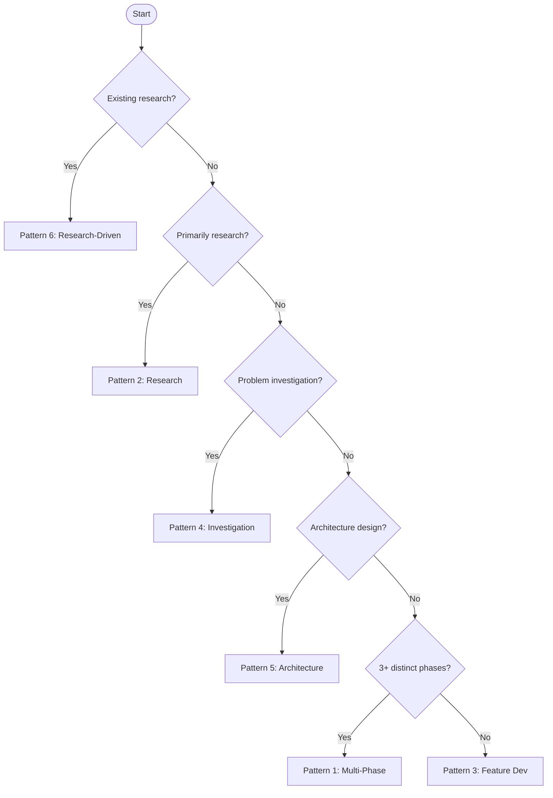
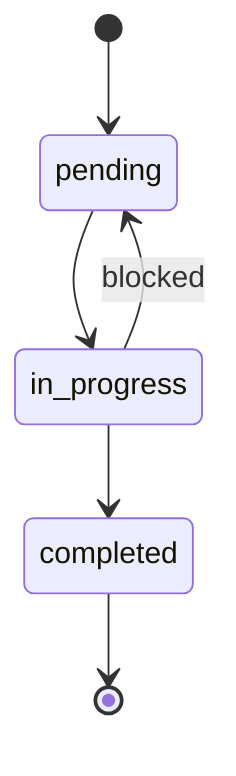
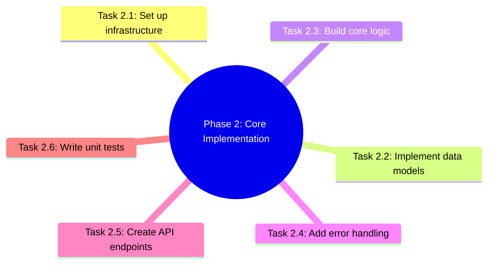
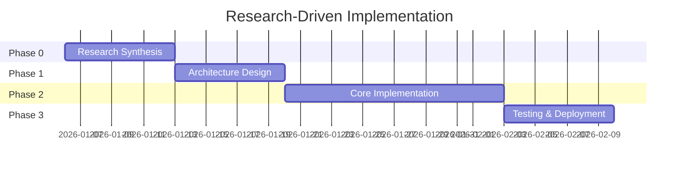
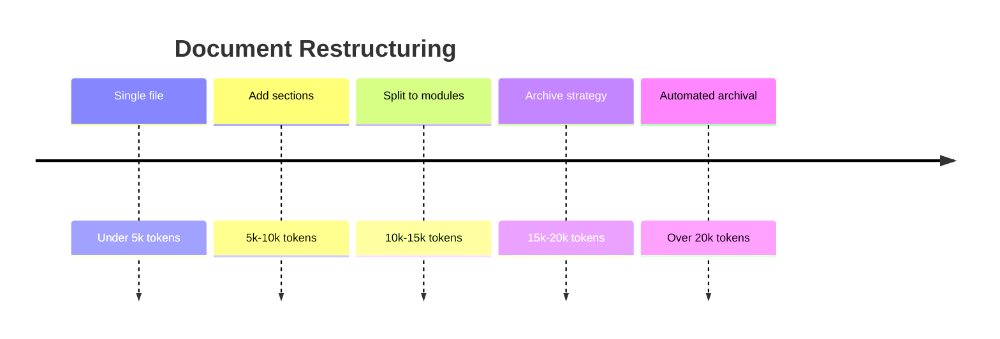
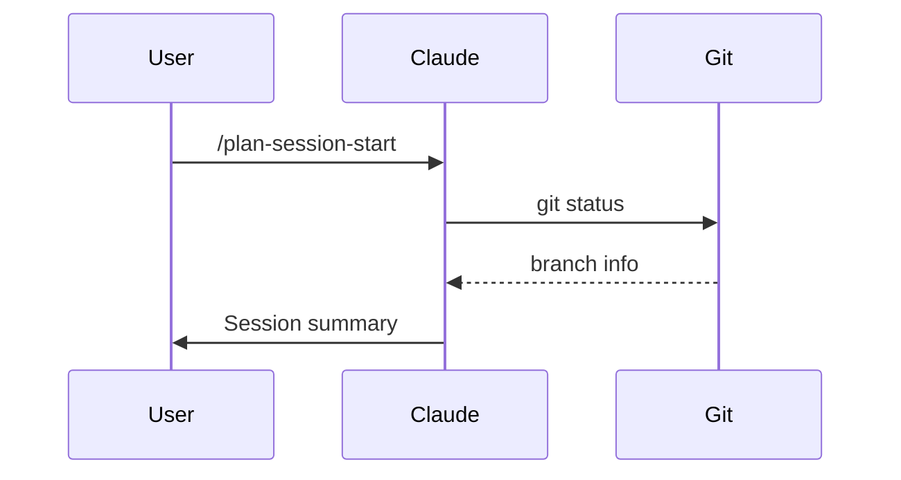
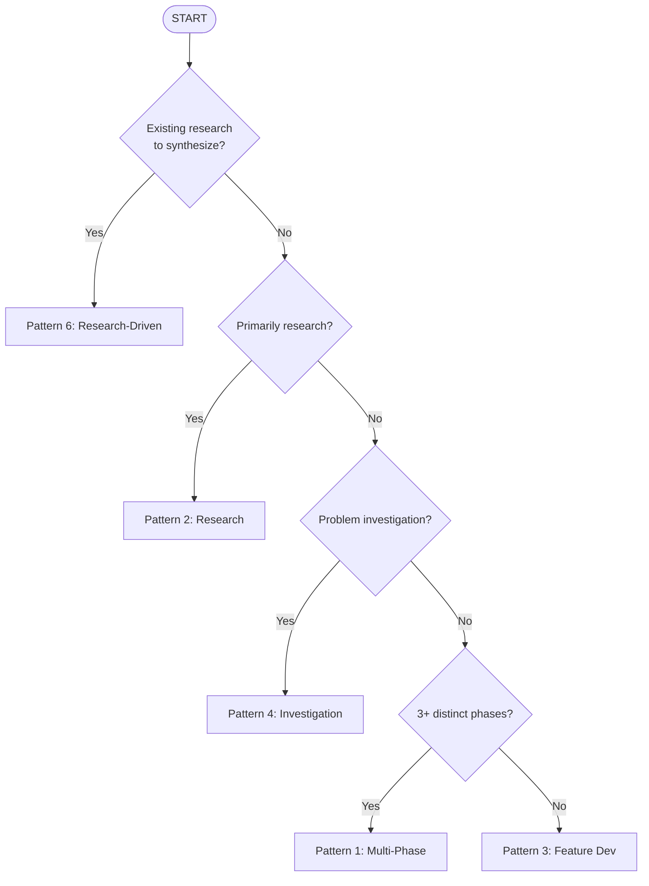
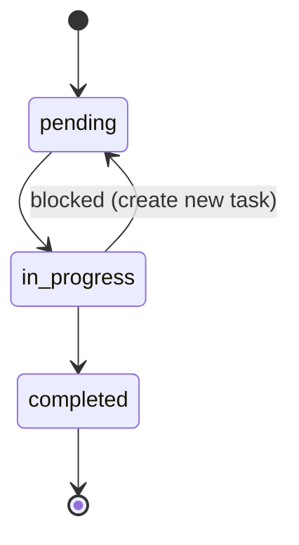
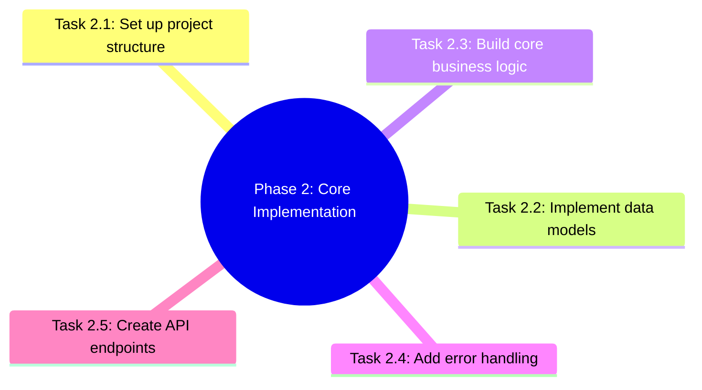
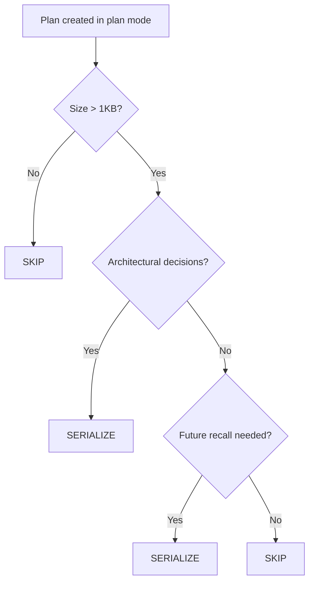

# Mermaid Diagrams

**Purpose**: Use Mermaid syntax for all diagrams in markdown files across all projects.

**When to use**: Whenever creating or modifying a diagram in any markdown file.

**Entry Point**: Behavioral directive (no slash command — this is a practice, not a procedure).

---

## The Directive

**MANDATE**: Use Mermaid syntax (` ```mermaid ` code blocks) for all diagrams in markdown files.

**Applies to**: All projects, all markdown files (workflow docs, CLAUDE.md, README, R&D docs, implementation docs).

**Rationale**: ASCII art diagrams are fragile (break on reflow), hard to maintain (manual spacing), and don't render as rich visuals. Mermaid provides a text-based diagramming standard that renders natively on GitHub, VSCode, Obsidian, and most markdown viewers while remaining readable as source.

---

## Exemptions

Two categories are **exempt** from Mermaid conversion:

### 1. Directory/File Trees

Keep `├── └──` notation for directory structures — Mermaid has no equivalent.

```
project/
├── src/
│   ├── main.py
│   └── utils.py
├── tests/
└── README.md
```

### 2. Terminal UI Chrome

Keep box-drawing characters for menu borders, section dividers, and structural formatting that represents terminal UI rather than conceptual diagrams.

```
┌─────────────────────────────────────┐
│ MENU HEADER                          │
└─────────────────────────────────────┘
```

---

## Diagram Type Catalog

Complete mapping of common use cases to Mermaid diagram types:

| Use Case | Mermaid Type | Syntax Keyword |
|----------|-------------|----------------|
| Decision trees, process flows | Flowchart | `flowchart TD` |
| State transitions, lifecycle | State Diagram | `stateDiagram-v2` |
| Task/concept hierarchies | Mind Map | `mindmap` |
| Project schedules, phased roadmaps | Gantt Chart | `gantt` |
| Chronological progressions | Timeline | `timeline` |
| Actor interactions over time | Sequence Diagram | `sequenceDiagram` |
| Database relationships | ER Diagram | `erDiagram` |
| Class/object relationships | Class Diagram | `classDiagram` |
| Proportional data | Pie Chart | `pie` |
| Git branching strategies | Git Graph | `gitGraph` |

### Selection Heuristic

- **"If this, then that"** → `flowchart TD`
- **"Goes from state A to state B"** → `stateDiagram-v2`
- **"These things are part of that thing"** → `mindmap`
- **"This happens, then this, over weeks"** → `gantt`
- **"First X happened, then Y"** → `timeline`
- **"Actor A sends to Actor B"** → `sequenceDiagram`

---

## Quick Reference: Syntax Patterns

### Flowchart (Decision Trees, Process Flows)



### State Diagram (Lifecycle, Status Transitions)



### Mind Map (Hierarchies, Breakdowns)



### Gantt Chart (Schedules, Phased Roadmaps)



### Timeline (Chronological Progressions)



### Sequence Diagram (Actor Interactions)



---

## Conversion Guide

When converting existing ASCII diagrams to Mermaid:

### Step 1: Identify the Diagram's Purpose

Ask: "What does this diagram communicate?"
- Decision flow? → `flowchart TD`
- State machine? → `stateDiagram-v2`
- Hierarchy/breakdown? → `mindmap`
- Schedule/phases? → `gantt`
- Progression over time? → `timeline`
- Actor interactions? → `sequenceDiagram`

### Step 2: Translate the Content

Map ASCII elements to Mermaid equivalents:

| ASCII Element | Mermaid Equivalent |
|---------------|-------------------|
| `├─ └─` tree branches | `mindmap` child nodes |
| `→ ↓` arrows | `-->` edges in flowchart |
| `[YES] [NO]` labels | `\|Yes\|` and `\|No\|` edge labels |
| `┌───┐ └───┘` boxes | `[Node text]` or `{Decision?}` |
| `Phase 1 → Phase 2` | `gantt` sections with dependencies |
| `State A → State B` | `stateDiagram-v2` transitions |

### Step 3: Test Rendering

- **GitHub**: Push and preview in browser
- **VSCode**: Install "Markdown Preview Mermaid Support" extension
- **Obsidian**: Mermaid renders natively
- **CLI**: Use `mmdc` (Mermaid CLI) for local rendering

### Step 4: Work Bottom-to-Top

When converting multiple diagrams in a single file, work from the bottom of the file upward. This preserves line numbers for remaining diagrams as you make edits.

---

## Before/After Examples

### Example 1: Decision Tree (flowchart TD)

**Before** (ASCII):
```
START
  |
  ├─ Do you have existing research? ─── YES → Pattern 6
  |    NO → Continue
  |
  ├─ Is this primarily research? ─── YES → Pattern 2
  |    NO → Continue
  |
  ├─ Is this problem investigation? ─── YES → Pattern 4
  |    NO → Continue
  |
  ├─ 3+ distinct phases? ─── YES → Pattern 1
  |    NO → Pattern 3
```

**After** (Mermaid):


### Example 2: State Machine (stateDiagram-v2)

**Before** (ASCII):
```
pending → in_progress → completed
   ↑          ↓
   └──────────┘ (if blocked)
```

**After** (Mermaid):


### Example 3: Hierarchy/Breakdown (mindmap)

**Before** (ASCII):
```
Phase 2: Core Implementation
  ├─ Task 2.1: Set up project structure
  ├─ Task 2.2: Implement data models
  ├─ Task 2.3: Build core business logic
  ├─ Task 2.4: Add error handling
  └─ Task 2.5: Create API endpoints
```

**After** (Mermaid):


### Example 4: Serialization Decision (flowchart TD)

**Before** (ASCII):
```
Plan created in plan mode
  └── Is it >1KB? ─── No ──→ SKIP
       └── Yes
            └── Architectural decisions? ─── Yes ──→ SERIALIZE
                 └── No
                      └── Future recall needed? ─── Yes ──→ SERIALIZE
                           └── No ──→ SKIP
```

**After** (Mermaid):


---

## Anti-Patterns

- **Don't use Mermaid for directory trees** — keep `├── └──` notation
- **Don't use Mermaid for simple tables** — use standard markdown tables
- **Don't use Mermaid for terminal UI chrome** — keep box-drawing characters
- **Don't nest Mermaid blocks inside other code blocks** — Mermaid blocks must be top-level
- **Don't over-complicate** — if a 2-line arrow conveys the idea, a full diagram isn't needed
- **Don't use Mermaid for inline notation** — `A → B` in prose is fine as-is

---

## Version History

- v1.0 (2026.02.14): Initial directive with full type catalog, conversion guide, and before/after examples
