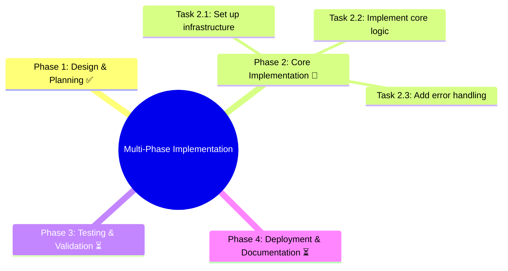
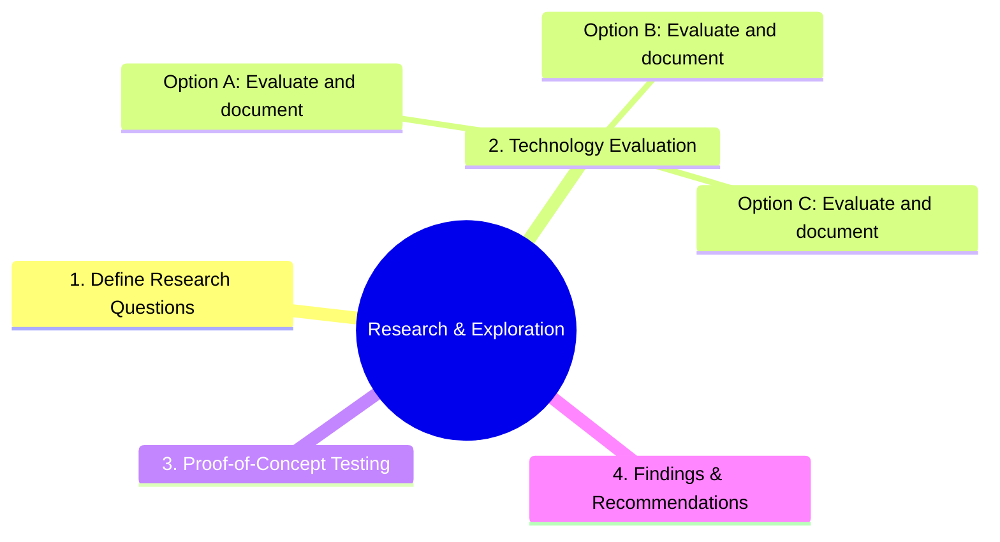
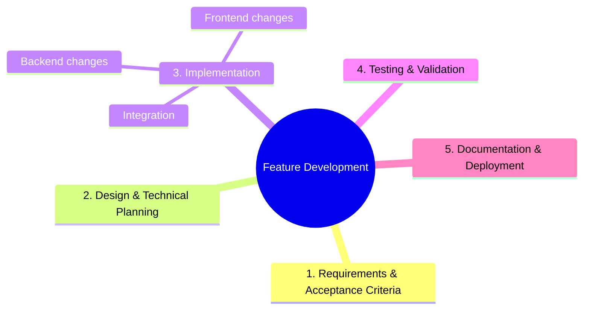
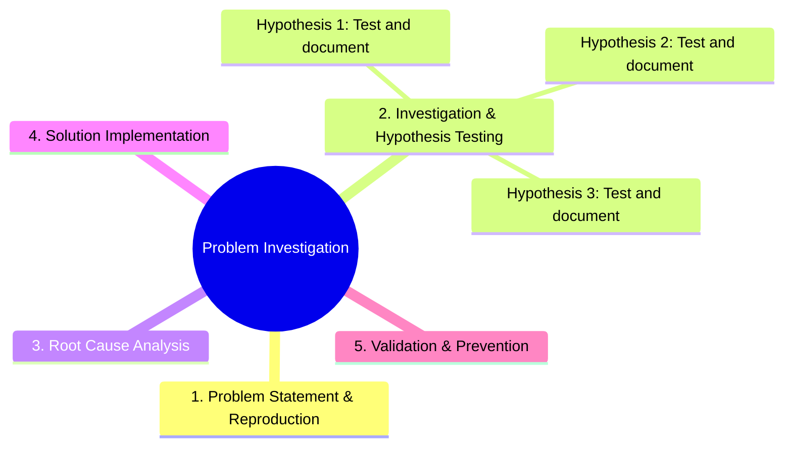
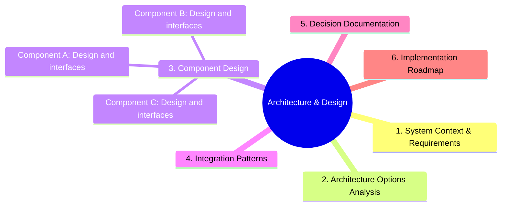
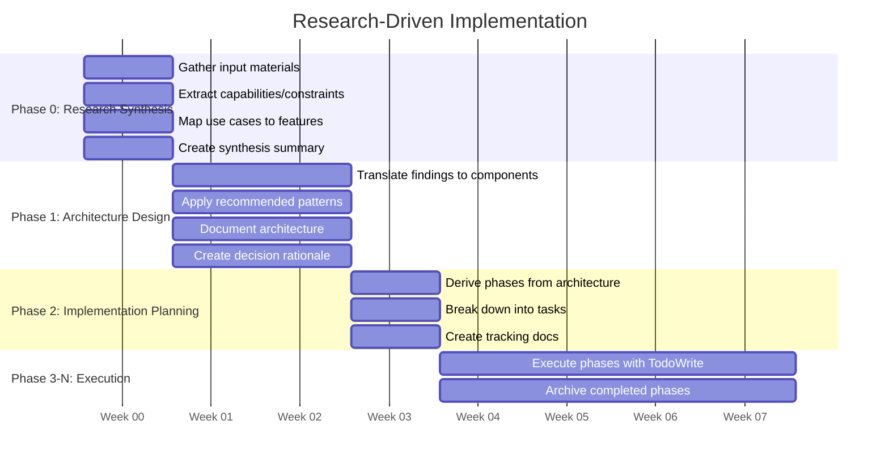
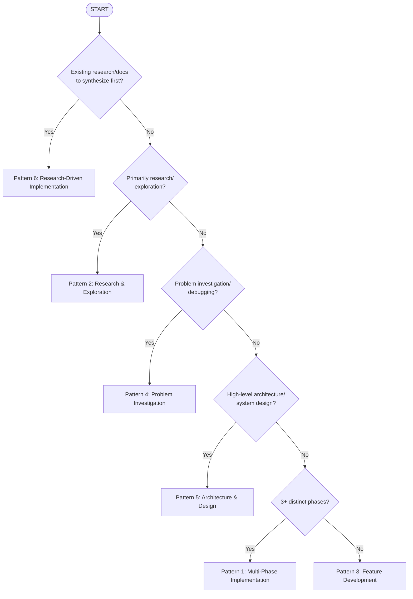
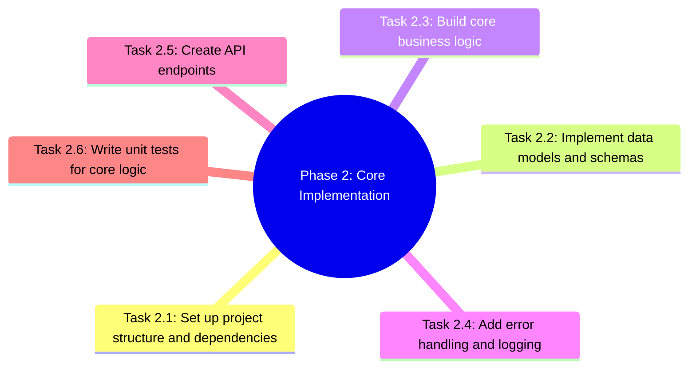
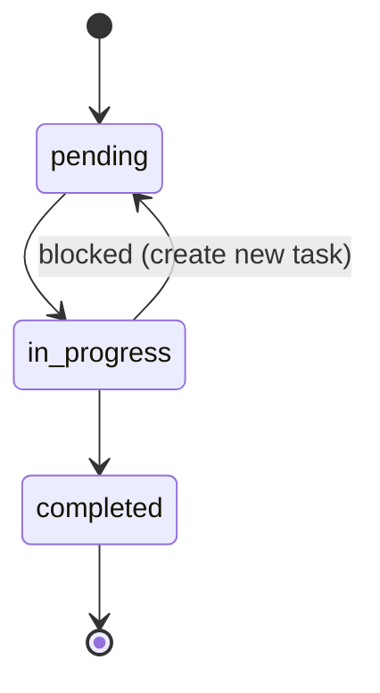

# Work Planning

**Purpose:** Framework for planning and breaking down work tasks using structured patterns that guide both human and AI thinking.

**When to use:** When starting new features, organizing complex tasks, structuring multi-step implementations, or approaching unfamiliar work.

**Key activities:**
- Classifying work type through discovery questions
- Selecting appropriate planning pattern
- Breaking down work into manageable tasks
- Creating TODO lists with TodoWrite tool
- Tracking progress with task states (pending, in_progress, completed)
- Archiving completed work and capturing learnings

---

## The "Planning is Prompting" Philosophy

**Core Insight**: The structure you create for planning work IS a form of prompting. By organizing work into patterns, phases, and tasks, you create a framework that prompts decision-making, action, and progress.

### How Structure Creates Prompts

When you create a structured plan, it continuously asks questions:
- "What phase am I in?" → Prompts context awareness
- "What's the next task?" → Prompts action
- "What decisions have been made?" → Prompts consistency
- "What's been completed?" → Prompts progress tracking
- "What's the definition of done?" → Prompts completion criteria

### Benefits of Structured Planning

1. **Shared Mental Model**: Human and AI align on goals, approach, and progress
2. **Reduced Cognitive Load**: Structure handles "what's next" so you can focus on "how to do it"
3. **Better Decision Making**: Patterns provide decision frameworks
4. **Progress Visibility**: TodoWrite creates real-time progress tracking
5. **Knowledge Capture**: Archival preserves learnings for future reference

---

## Interactive Discovery with Context-Aware Defaults

### The Enhancement Pattern

**Problem**: Traditional planning workflows require answering every question from scratch, even when context makes answers obvious.

**Solution**: This workflow analyzes available context (your work description, recent history, git state) to infer smart defaults, reducing cognitive load.

### How It Works

**1. Context Analysis** (Automatic):
- Scans your initial work description for keywords and intent
- Reviews recent sessions in history.md for pattern learning
- Checks git branch/status for current work clues
- Analyzes codebase state for project maturity indicators

**2. Smart Default Inference**:
- Work type: Keywords like "bug" → Investigation, "add" → Feature Development
- Scale: File count, systems mentioned → Small/Medium/Large estimate
- Duration: Timeline mentions ("by Friday", "next sprint") → Time horizon
- Pattern: Historical preferences + work characteristics → Suggested pattern

**3. Interactive Confirmation**:
- Workflow presents questions WITH suggested defaults
- User accepts defaults with 'y' or provides override
- Only need to think about non-standard aspects
- Batch acceptance for multiple related defaults

**4. Graceful Degradation**:
- No context available? → Ask questions normally
- Context unclear? → Present options without default
- User overrides? → Learn from correction

### Benefits

- **Faster Planning**: Accept sensible defaults instead of answering every question
- **Less Cognitive Load**: Focus on unusual aspects, not routine classification
- **Transparent Reasoning**: See WHY defaults were suggested
- **Full Control**: Override any default easily
- **Pattern Learning**: Workflow learns from your preferences over time

### Example Interaction

**Traditional flow** (8 manual answers required):
```
Q1: What type of work is this? [user must choose from 6 options]
Q2: What is the scale and complexity? [user must assess]
Q3: What is the time horizon? [user must estimate]
... (8 questions total)
```

**Enhanced flow** (context-aware defaults):
```
*Analyzing your description: "Add email notifications to existing app"*

Context detected:
- Work type: Feature Development (keyword "add" + "existing app")
- Scale: Medium (1-2 weeks)
- Pattern: Pattern 3 (Feature Development)

These defaults look correct? [y/n]: y ✓

*Creating TodoWrite list for Pattern 3...*
```

**User only engaged for ~5 seconds instead of ~5 minutes.**

### Context Sources (Prioritized)

1. **User's Work Description** (Primary):
   - Keywords: "add", "fix", "bug", "research", "design", "implement"
   - Mentioned systems/technologies
   - Timeline indicators
   - Complexity signals (number of components mentioned)

2. **Recent History** (Pattern Learning):
   - Last 3-5 projects: which patterns were used?
   - Typical duration for similar work types
   - User's preferences (tends toward thorough planning vs. quick execution)

3. **Git State** (Current Work Clues):
   - Branch name: `feature/email-notifications` → Feature Development
   - Recent commits: multi-phase work vs. single commit fixes
   - Files changed: scope indicator

4. **Codebase State** (Project Maturity):
   - Established patterns: architecture already decided
   - Test coverage: quality expectations
   - Documentation: thoroughness culture

### When This Pattern Applies

**Use Interactive Discovery** when:
- ✓ Starting new work with the planning workflow
- ✓ User provides initial work description (even brief)
- ✓ history.md exists with recent sessions
- ✓ Want to reduce planning overhead

**Skip to manual questions** when:
- ✗ Completely new project (no history)
- ✗ User explicitly requests full planning session
- ✗ Work is highly unusual (context won't help)
- ✗ Teaching/demonstration mode (want to see all questions)

---

## Work Planning Workflow

### Phase 0: Research Synthesis (Conditional - Use When Starting From Existing Research)

**When to use**: You have existing research materials, documentation, or recommendations to process BEFORE planning implementation

**Skip this phase if**: You already understand the technology/approach, or are doing your own research (use Pattern 2 instead)

**Purpose**: Transform external research documents into actionable insights that inform architecture and implementation planning

#### Process Steps

**Step 1: Gather Input Materials**

Collect all research sources you need to understand:
- Technical documentation (e.g., Google ADK documentation, framework guides)
- Use case recommendations or requirements documents
- Technical specifications or RFC documents
- Stakeholder requirements or product briefs
- Example implementations or reference architectures

**Step 2: Extract Key Information**

For each document, systematically identify:

1. **Capabilities**: What does this technology/approach enable?
   - Core features and functions
   - Integration points with other systems
   - Performance characteristics
   - Scalability considerations

2. **Constraints**: What limitations or requirements exist?
   - Technical constraints (API limits, token limits, latency requirements)
   - Compatibility requirements (versions, dependencies)
   - Resource constraints (memory, CPU, network)
   - Licensing or cost constraints

3. **Patterns**: What architectural patterns or best practices are recommended?
   - Recommended architectures
   - Design patterns
   - Integration patterns
   - Anti-patterns to avoid

4. **Integration Points**: How does this connect to existing systems?
   - APIs and interfaces
   - Authentication mechanisms
   - Data formats and protocols
   - Event/messaging patterns

5. **Decision Implications**: What design choices does this research suggest?
   - Technology stack recommendations
   - Architecture approach (microservices vs. monolith, async vs. sync)
   - Data storage strategies
   - Security considerations

**Step 3: Create Research Synthesis Document**

Create `src/rnd/YYYY.MM.DD-{topic}-research-synthesis.md` with this structure:

```markdown
# {Topic} Research Synthesis

**Created**: YYYY.MM.DD
**Source Materials**: List of documents reviewed
**Purpose**: Synthesize research to inform {project name} implementation

## Source Documents

1. **[Document Name]** ({URL or path})
   - Type: Documentation/Specification/Recommendation
   - Focus areas: {What you extracted from this}

2. **[Document Name]** ({URL or path})
   - Type: Documentation/Specification/Recommendation
   - Focus areas: {What you extracted from this}

## Key Capabilities Extracted

### From {Source 1}
- Capability 1: {Description and implications}
- Capability 2: {Description and implications}

### From {Source 2}
- Capability 3: {Description and implications}

## Constraints & Requirements

### Technical Constraints
- Constraint 1: {Description and impact on design}
- Constraint 2: {Description and impact on design}

### Integration Requirements
- Requirement 1: {What we must support}
- Requirement 2: {What we must support}

## Recommended Patterns & Approaches

### From {Source 1}
- Pattern: {Name and description}
  - When to use: {Context}
  - How to implement: {High-level approach}
  - Benefits: {Why this pattern}

### From {Source 2}
- Pattern: {Name and description}
  - When to use: {Context}
  - How to implement: {High-level approach}
  - Benefits: {Why this pattern}

## Design Implications

Based on research, the following design decisions are recommended:

1. **Architecture Approach**: {Monolith/Microservices/Hybrid and why}
2. **Technology Stack**: {Key technologies and rationale}
3. **Integration Strategy**: {How components will connect}
4. **Data Management**: {Storage, caching, retrieval approach}
5. **Security Model**: {Authentication, authorization approach}

## Use Case Mapping

### Use Case 1: {Name}
- **Requirements extracted**: {What this use case needs}
- **Relevant capabilities**: {Which researched features apply}
- **Implementation approach**: {High-level how to build this}

### Use Case 2: {Name}
- **Requirements extracted**: {What this use case needs}
- **Relevant capabilities**: {Which researched features apply}
- **Implementation approach**: {High-level how to build this}

## Open Questions & Risks

### Questions Requiring Further Investigation
- Question 1: {What's still unclear}
- Question 2: {What needs deeper research}

### Identified Risks
- Risk 1: {Potential issue and mitigation approach}
- Risk 2: {Potential issue and mitigation approach}

## Next Steps

With research synthesis complete, proceed to:
1. **Phase 1** (Discovery Questions): Answer based on synthesized understanding
2. **Phase 2** (Pattern Selection): Likely Pattern 6 (Research-Driven Implementation)
3. **Step 2** (Documentation): Create Pattern B (Architecture) and Pattern A (Implementation Tracking)
```

**Step 4: Create TodoWrite Checklist for Synthesis**

Track your research synthesis progress:

```javascript
TodoWrite({
  todos: [
    { content: "[PROJECT] Gather all research source materials", status: "completed", activeForm: "Gathering research materials" },
    { content: "[PROJECT] Extract capabilities from {Source 1}", status: "in_progress", activeForm: "Extracting capabilities from {Source 1}" },
    { content: "[PROJECT] Extract capabilities from {Source 2}", status: "pending", activeForm: "Extracting capabilities from {Source 2}" },
    { content: "[PROJECT] Document constraints and requirements", status: "pending", activeForm: "Documenting constraints" },
    { content: "[PROJECT] Identify recommended patterns", status: "pending", activeForm: "Identifying patterns" },
    { content: "[PROJECT] Map use cases to capabilities", status: "pending", activeForm: "Mapping use cases" },
    { content: "[PROJECT] Create research synthesis document", status: "pending", activeForm: "Creating synthesis doc" },
    { content: "[PROJECT] Transition to Phase 1 (Discovery)", status: "pending", activeForm: "Transitioning to Phase 1" }
  ]
})
```

**Step 5: Transition to Planning**

With synthesis complete, proceed to Phase 1 (Discovery) armed with:
- ✅ Clear understanding of technology/approach from research
- ✅ Concrete requirements derived from use cases
- ✅ Design constraints extracted from documentation
- ✅ Recommended patterns to follow
- ✅ Integration points identified
- ✅ Risk areas surfaced

Your synthesis document becomes a key reference throughout planning and implementation phases.

---

### Phase 1: Work Discovery & Classification

Before diving into implementation, understand what you're trying to accomplish.

#### Step 0: Context Analysis (Perform First)

**Before presenting questions**, analyze available context to infer smart defaults:

**Process**:
1. **Read user's work description** - Extract keywords, intent, scope signals
2. **Scan recent history.md** - Identify patterns in last 3-5 sessions
3. **Check git state** - Examine branch name, recent commits, changed files
4. **Assess codebase** - Detect project maturity, existing patterns

**Keyword Detection Examples**:
- "add", "implement", "build" + "to existing" → **Feature Development** likely
- "fix", "bug", "issue", "broken" → **Problem Investigation** likely
- "research", "evaluate", "compare", "explore" → **Research** likely
- "design", "architecture", "system" → **Architecture** likely
- "Google ADK", "framework", "SDK", "documentation" → **Research-Driven** likely

**Timeline Indicators**:
- "by Friday", "this week" → **Sprint** (1-2 weeks)
- "next sprint", "couple weeks" → **Short-term** (2-4 weeks)
- "next month", "Q2" → **Medium-term** (1-3 months)
- No timeline → Assess from scope

**Scale Signals**:
- Mentions 1-2 components/files → **Small**
- Mentions 3-5 systems/features → **Medium**
- Mentions 6+ components or "entire system" → **Large**

**Output of Context Analysis**:
- Present findings to user: "Based on your description and context, here's what I inferred..."
- Offer defaults for each discovery question
- Allow user to accept ('y') or override

---

#### Core Questions (Answer with Smart Defaults)

**Format**: For each question, present:
1. Context-based inference (what was detected)
2. Suggested default answer
3. Accept with 'y' or provide alternative

---

1. **What type of work is this?**

   **Context Inference**:
   - Description: "{user's work description}"
   - Keywords detected: "add email notifications", "existing app"
   - Git branch: `feature/email-notifications`
   - Recent history: Last 3 projects were Feature Development

   **Suggested**: Feature Development (adding to existing system)

   **Reasoning**: Keywords "add" + "existing app" indicate enhancement, not new build

   Accept suggestion? [y/n or specify different type]:

   **Options if not accepting default**:
   - Implementation (building something new)
   - Research (exploring options/approaches)
   - Problem Investigation (debugging/troubleshooting)
   - Architecture/Design (system structure/patterns)
   - Maintenance (updates, refactoring, cleanup)

2. **What is the scale and complexity?**

   **Context Inference**:
   - Components mentioned: "email service, templates, queue, user preferences" (4 systems)
   - Estimated tasks: Setup, templates, queue, triggers, testing (~8-12 tasks)
   - Complexity signals: Integration with existing app, new infrastructure

   **Suggested**: Medium (3-10 days, 1-3 developers, 5-15 tasks)

   **Reasoning**: Multiple systems involved but well-scoped boundaries

   Accept suggestion? [y/n or specify different scale]:

   **Options if not accepting default**:
   - Small: 1-3 days, single developer, < 5 tasks
   - Large: 10+ days, multiple developers, 15+ tasks
   - Exploratory: Unknown duration, discovery-oriented

3. **What is the time horizon?**

   **Context Inference**:
   - User mentioned: "need this for next sprint"
   - Scale assessment: Medium (3-10 days)
   - No major blockers identified

   **Suggested**: Sprint (1-2 weeks)

   **Reasoning**: "Next sprint" indicates 1-2 week timeline

   Accept suggestion? [y/n or specify different horizon]:

   **Options if not accepting default**:
   - Short-term: 2-4 weeks
   - Medium-term: 1-3 months
   - Long-term: 3+ months
   - Ongoing: No specific deadline

4. **Are there distinct phases or milestones?**

   **Context Inference**:
   - Work type: Feature Development (typically linear)
   - Scope: Single feature with dependencies
   - Pattern emerging: Requirements → Design → Implementation → Testing

   **Suggested**: Maybe, I have some phases in mind (linear workflow with natural breaks)

   **Reasoning**: Feature work typically has requirements → implementation → testing flow

   Accept suggestion? [y/n or specify different answer]:

   **Options if not accepting default**:
   - Yes, I can identify 3+ clear phases
   - No, it's more linear/continuous
   - Not sure yet

#### Contextual Questions (Answer with Smart Defaults)

5. **What are the success criteria?**

   **Context Inference**:
   - Work type: Feature Development (email notifications)
   - Typical criteria for this pattern: functional + user-facing + testable

   **Suggested Success Criteria**:
   - Emails sent successfully when triggered
   - User can configure notification preferences
   - Templates render correctly
   - Integration tests passing

   **Reasoning**: Standard feature acceptance criteria

   Accept suggestion? [y/n or add/modify criteria]:

   **Options for additional criteria**:
   - Performance metrics (delivery time, queue throughput)
   - Stakeholder approval
   - User acceptance testing

6. **What are the dependencies and constraints?**

   **Context Inference**:
   - Technical mentions: "SendGrid" (email service), "existing app" (integration point)
   - Timeline: "next sprint" (time constraint)

   **Suggested Dependencies/Constraints**:
   - Technical: SendGrid API, existing user database, app notification system
   - Timeline: Must complete in 1-2 weeks
   - Integration: Must work with current authentication system

   **Reasoning**: Extracted from description and context

   Accept suggestion? [y/n or add/modify]:

   **Categories for additional dependencies**:
   - Team dependencies (other developers, stakeholders)
   - Resource constraints (budget, tools, access)

7. **What is the risk level?**

   **Context Inference**:
   - Work type: Feature Development (familiar pattern)
   - Technologies: Sendgrid is well-documented
   - Integration: Adding to existing system (moderate complexity)
   - Timeline: Sprint timeline (not urgent/critical)

   **Suggested**: Medium (Some unknowns, moderate impact)

   **Reasoning**: Standard feature development, established tools, not mission-critical

   Accept suggestion? [y/n or specify different level]:

   **Options if not accepting default**:
   - Low: Well-understood work, low impact if delayed
   - High: Many unknowns, significant impact
   - Critical: Business-critical, high stakes

8. **Is this a one-time task or recurring pattern?**

   **Context Inference**:
   - Feature type: Email notification system (infrastructure component)
   - Applicability: Could be template for SMS, push notifications, etc.

   **Suggested**: Pattern (Creates reusable template for future work)

   **Reasoning**: Notification infrastructure often reused for other channels

   Accept suggestion? [y/n or specify different type]:

   **Options if not accepting default**:
   - One-time: Unique work, won't repeat
   - Recurring: Will do similar work again

---

**Discovery Complete**: With context analysis and smart defaults, you should have answers to all 8 questions. The workflow will now suggest a pattern based on these answers.

### Phase 2: Pattern Selection

Based on your discovery answers, select a planning pattern. Each pattern provides a different structure for organizing and tracking work.

#### Suggested Pattern (Based on Discovery Context)

**Context Analysis Summary**:
```
Work Type:         Feature Development
Scale:             Medium (3-10 days, 5-15 tasks)
Time Horizon:      Sprint (1-2 weeks)
Distinct Phases:   Maybe (linear workflow)
Success Criteria:  Functional + testable + user-facing
Dependencies:      SendGrid API, existing user system
Risk Level:        Medium
Recurring:         Pattern (reusable for other notifications)
```

**Pattern Recommendation**: **Pattern 3 (Feature Development)**

**Rationale**:
- ✓ Well-scoped feature with clear boundaries
- ✓ Adding to existing system (not building from scratch)
- ✓ Linear workflow (requirements → design → implementation → testing)
- ✓ Sprint timeline (1-2 weeks) fits Pattern 3 characteristics
- ✓ No need for multi-phase tracking (Pattern 1) or research docs (Pattern 2)

**Alternative Patterns to Consider**:
- **Pattern 1 (Multi-Phase Implementation)** - Only if scope grows significantly or phases become more complex
- **Pattern 4 (Problem Investigation)** - If this is primarily debugging existing notification system
- **Pattern 5 (Architecture & Design)** - If designing entire notification architecture from scratch

**Accept Pattern 3?** [y/n or specify pattern number 1-6]:

---

#### Pattern Library

**Reminder**: The pattern library below provides details on all patterns. Your suggested pattern is **Pattern 3**, but you can review all options before deciding.

##### Pattern 1: Multi-Phase Implementation

**Best for**: Complex implementation projects with clear milestones

**Characteristics**:
- Multiple distinct phases (design → build → test → deploy)
- 2+ weeks duration
- Requires detailed planning and tracking
- Clear separation between active and completed work

**Structure**:


**TodoWrite Pattern**:
```
[PROJECT] Phase 2: Core Implementation
  [PROJECT] Set up infrastructure
  [PROJECT] Implement core logic
  [PROJECT] Add error handling
```

**Example**: Building JWT authentication system with phases for token generation, validation, OAuth integration, session management, and security hardening.

---

##### Pattern 2: Research & Exploration

**Best for**: Exploratory projects focused on investigation and analysis

**Characteristics**:
- Research-heavy, implementation-light
- Multiple technologies/approaches to evaluate
- Emphasis on findings and recommendations
- May lead to future implementation project

**Structure**:


**TodoWrite Pattern**:
```
[PROJECT] Define research questions and scope
[PROJECT] Evaluate Option A: [Technology Name]
[PROJECT] Evaluate Option B: [Technology Name]
[PROJECT] Build proof-of-concept for top option
[PROJECT] Document findings and recommendations
```

**Example**: Evaluating WebSocket architectures (polling vs. long-polling vs. WebSockets vs. Server-Sent Events) with PoC implementations and performance comparisons.

---

##### Pattern 3: Feature Development

**Best for**: Well-defined features requiring systematic implementation

**Characteristics**:
- Clear feature boundaries
- Integration with existing system
- User stories and use cases
- Acceptance criteria defined upfront

**Structure**:


**TodoWrite Pattern**:
```
[PROJECT] Define requirements and acceptance criteria
[PROJECT] Design technical approach
[PROJECT] Implement backend changes
[PROJECT] Implement frontend changes
[PROJECT] Integration and testing
[PROJECT] Documentation and deployment
```

**Example**: Adding email notification feature to existing application with SMTP configuration, template system, queue management, and user preferences.

---

##### Pattern 4: Problem Investigation

**Best for**: Debugging complex issues requiring systematic investigation

**Characteristics**:
- Problem-focused (not feature-focused)
- Hypothesis testing and experimentation
- Detailed observations and findings
- Solution validation

**Structure**:


**TodoWrite Pattern**:
```
[PROJECT] Document problem statement and reproduction steps
[PROJECT] Test hypothesis: [Description]
[PROJECT] Test hypothesis: [Description]
[PROJECT] Identify root cause
[PROJECT] Implement solution
[PROJECT] Validate fix and add prevention measures
```

**Example**: Investigating WebSocket event routing bug with hypotheses about race conditions, state management, event ordering, and connection lifecycle.

---

##### Pattern 5: Architecture & Design

**Best for**: System-level architecture and design decisions

**Characteristics**:
- High-level system design
- Component relationships and interactions
- Design principles and patterns
- Long-term reference document

**Structure**:


**TodoWrite Pattern**:
```
[PROJECT] Define system context and requirements
[PROJECT] Analyze architecture options
[PROJECT] Design Component A
[PROJECT] Design Component B
[PROJECT] Define integration patterns
[PROJECT] Document key decisions
[PROJECT] Create implementation roadmap
```

**Example**: Designing microservices architecture with API gateway, authentication service, business logic services, database strategy, and inter-service communication patterns.

---

##### Pattern 6: Research-Driven Implementation

**Best for**: Building systems based on external research, documentation, or recommendations where you need to understand existing materials before planning

**Characteristics**:
- Starts with existing research materials (not your own research work)
- Requires synthesis and translation before planning
- Design decisions heavily influenced by research findings
- Implementation follows researched best practices and patterns
- Multi-phase workflow: Synthesis → Architecture → Planning → Execution

**When to use**:
- Building with new framework/SDK (e.g., Google ADK, LangChain, etc.)
- Have vendor documentation or architectural recommendations to follow
- Implementing based on technical specifications or RFCs
- Have use case requirements that need mapping to technology capabilities

**Structure**:


**TodoWrite Pattern**:

*Phase 0 (Research Synthesis):*
```
[PROJECT] Gather research source materials (e.g., SDK docs, use cases, specs)
[PROJECT] Extract capabilities and constraints from documentation
[PROJECT] Identify recommended patterns and best practices
[PROJECT] Map use cases to technology capabilities
[PROJECT] Create research synthesis summary document
[PROJECT] Transition to Phase 1 (Architecture Design)
```

*Phase 1 (Architecture Design):*
```
[PROJECT] Design system architecture based on research patterns
[PROJECT] Define components using researched capabilities
[PROJECT] Document design decisions with research rationale
[PROJECT] Create architecture diagrams and component specs
[PROJECT] Review architecture against use case requirements
```

*Phase 2 (Implementation Planning):*
```
[PROJECT] Derive implementation phases from architecture
[PROJECT] Break down Phase 1 tasks (e.g., ADK integration)
[PROJECT] Break down Phase 2 tasks (e.g., Tool registry)
[PROJECT] Identify cross-phase dependencies
[PROJECT] Create implementation tracking document
[PROJECT] Estimate timeline and resource needs
```

*Phase 3+ (Execution):*
```
[PROJECT] Phase 3.1: Set up SDK and dependencies
[PROJECT] Phase 3.2: Implement base framework
[PROJECT] Phase 3.3: Build component X following researched pattern
[PROJECT] Phase 3.4: Integrate components
... (continue through all implementation phases)
```

**Example**: Building agent system with Google ADK - synthesize ADK documentation and 2 use case recommendations, design agent architecture based on ADK's Agent-Tool-Memory pattern, derive implementation phases (ADK integration, tool registry, context management, use case 1 implementation, use case 2 implementation), execute with TodoWrite tracking.

**Integration with p-is-p-02**:
- Phase 0 creates: `src/rnd/YYYY.MM.DD-{topic}-research-synthesis.md`
- Phase 1 creates: Pattern B (Architecture & Design) docs
- Phase 2 creates: Pattern A (Implementation Tracking) docs
- Phases 3+ use: Pattern A for active work, archive completed phases

**Key Success Factors**:
- Thorough Phase 0 synthesis prevents rework later
- Research synthesis doc becomes key reference throughout project
- Design decisions explicitly trace back to research findings
- Implementation phases align with use case requirements
- TodoWrite discipline maintains focus through long project

---

### Pattern Selection Decision Tree

Use this decision tree to select the right pattern:



**Hybrid Patterns**: You can combine patterns for complex work. For example:
- Research synthesis (Pattern 6 Phase 0) → Architecture design (Pattern 5) → Implementation (Pattern 1)
- Research phase (Pattern 2) → Implementation phases (Pattern 1)
- Architecture design (Pattern 5) → Feature development (Pattern 3)
- Problem investigation (Pattern 4) → Solution implementation (Pattern 3)

### Phase 3: Work Breakdown

Once you've selected a pattern, break down the work into concrete tasks.

#### Suggested Initial Task Breakdown

**Based on**: Pattern 3 (Feature Development) + your work description

**Context**:
- Feature: Email notification system
- Components mentioned: SendGrid, templates, queue, user preferences
- Integration: Existing app + user system

**Proposed Phases**:

```
1. Requirements & Acceptance Criteria
   - Define email notification triggers (new message, mentions, etc.)
   - Design email template requirements (header, content, footer, unsubscribe)
   - Specify user preferences (frequency, types, opt-out)

2. Technical Design & Planning
   - Select/configure SendGrid account and API keys
   - Design template engine approach (Handlebars, Mustache, or SendGrid templates)
   - Design async queue system (Redis queue, database queue, or SQS)
   - Plan integration with existing user/notification systems

3. Implementation
   - Set up SendGrid integration and configuration
   - Create email template engine
   - Implement notification queue system
   - Add trigger logic (new message handler, mention handler)
   - Build user preferences management (UI + backend)

4. Testing & Validation
   - Unit tests for template rendering
   - Integration tests for SendGrid sending
   - End-to-end tests for trigger → email flow
   - Manual QA across email clients

5. Documentation & Deployment
   - API documentation for notification system
   - User guide for preferences
   - Deployment checklist
   - Monitoring setup
```

**Estimated Tasks**: ~12-15 tasks across 5 phases (fits Medium scale)

**TodoWrite Preview**:
```
[EMAIL] Define notification triggers and template requirements
[EMAIL] Set up SendGrid account and configuration
[EMAIL] Design template engine and queue system
[EMAIL] Implement SendGrid integration
[EMAIL] Create email template engine
[EMAIL] Implement notification queue system
[EMAIL] Add notification trigger logic
[EMAIL] Build user preferences management
[EMAIL] Write unit tests for templates
[EMAIL] Write integration tests for SendGrid
[EMAIL] End-to-end testing
[EMAIL] Documentation and deployment
```

**Accept this breakdown?** [y/n or describe modifications]:

**If modifying**: Describe which tasks to add/remove/change, and I'll update the breakdown accordingly.

---

#### Task Breakdown Principles

1. **Manageable Size**: Each task should be completable in 0.5-4 hours
2. **Clear Completion Criteria**: Know when a task is done
3. **Logical Ordering**: Dependencies clear, tasks flow naturally
4. **Testable Outcomes**: Each task produces verifiable output
5. **One Active Task**: Only one task in_progress at a time

#### Manual Breakdown Methodology (If Not Accepting Suggested Tasks)

**Step 1: Identify Major Phases**

Based on your selected pattern, list the major phases:
```
Example (Pattern 1 - Multi-Phase Implementation):
- Phase 1: Design & Planning
- Phase 2: Core Implementation
- Phase 3: Testing & Validation
- Phase 4: Deployment
```

**Step 2: Decompose Each Phase into Tasks**

For each phase, list 3-8 concrete tasks:


**Step 3: Define Completion Criteria for Each Task**

```
Task 2.3: Build core business logic
  Done when:
  - All business rules implemented
  - Code follows project style guide
  - Basic error cases handled
  - Core functions have docstrings
  - Integration points identified
```

**Step 4: Identify Dependencies**

```
Task 2.2 (Data models) must complete before Task 2.3 (Business logic)
Task 2.3 (Business logic) must complete before Task 2.6 (Unit tests)
Task 2.5 (API endpoints) can run parallel to Task 2.6 (Unit tests)
```

**Step 5: Create TodoWrite List**

Convert your breakdown into TodoWrite format:
```
[PROJECT] Set up project structure and dependencies
[PROJECT] Implement data models and schemas
[PROJECT] Build core business logic
[PROJECT] Add error handling and logging
[PROJECT] Create API endpoints
[PROJECT] Write unit tests for core logic
```

#### Task Granularity Guidelines

**Too Large** (needs splitting):
- "Build the entire authentication system"
- "Implement all API endpoints"
- "Complete the frontend"

**Right Size**:
- "Implement JWT token generation function"
- "Create login API endpoint with validation"
- "Build user profile component"

**Too Small** (can be combined):
- "Import library"
- "Write function docstring"
- "Add blank line"

**Rule of thumb**: If a task takes > 4 hours, split it. If a task takes < 15 minutes, combine it with related tasks.

### Phase 4: Execution & Tracking

Now execute the plan using TodoWrite for real-time progress tracking.

#### TodoWrite Best Practices

##### 1. Create Initial TODO List

At the start of work, create your complete TODO list:

```javascript
TodoWrite({
  todos: [
    { content: "[PROJECT] Set up project structure", status: "pending", activeForm: "Setting up project structure" },
    { content: "[PROJECT] Implement data models", status: "pending", activeForm: "Implementing data models" },
    { content: "[PROJECT] Build core business logic", status: "pending", activeForm: "Building core business logic" },
    { content: "[PROJECT] Add error handling", status: "pending", activeForm: "Adding error handling" },
    { content: "[PROJECT] Create API endpoints", status: "pending", activeForm: "Creating API endpoints" },
    { content: "[PROJECT] Write unit tests", status: "pending", activeForm: "Writing unit tests" }
  ]
})
```

##### 2. Mark Tasks In Progress (One at a Time)

Before starting a task, mark it as in_progress:

```javascript
TodoWrite({
  todos: [
    { content: "[PROJECT] Set up project structure", status: "in_progress", activeForm: "Setting up project structure" },
    { content: "[PROJECT] Implement data models", status: "pending", activeForm: "Implementing data models" },
    // ... rest remain pending
  ]
})
```

**IMPORTANT**: Only ONE task should be in_progress at any time. This enforces focus and prevents context-switching.

##### 3. Mark Tasks Completed Immediately

As soon as you finish a task, mark it completed and move to the next:

```javascript
TodoWrite({
  todos: [
    { content: "[PROJECT] Set up project structure", status: "completed", activeForm: "Setting up project structure" },
    { content: "[PROJECT] Implement data models", status: "in_progress", activeForm: "Implementing data models" },
    // ... rest remain pending
  ]
})
```

**Don't batch completions!** Update the TODO list immediately after each task.

##### 4. Add New Tasks as Discovered

As you work, you'll discover new tasks. Add them to the list:

```javascript
TodoWrite({
  todos: [
    { content: "[PROJECT] Set up project structure", status: "completed", activeForm: "Setting up project structure" },
    { content: "[PROJECT] Implement data models", status: "completed", activeForm: "Implementing data models" },
    { content: "[PROJECT] Build core business logic", status: "in_progress", activeForm: "Building core business logic" },
    { content: "[PROJECT] Add input validation (discovered during implementation)", status: "pending", activeForm: "Adding input validation" },
    { content: "[PROJECT] Add error handling", status: "pending", activeForm: "Adding error handling" },
    // ... rest of tasks
  ]
})
```

##### 5. Remove or Update Obsolete Tasks

If tasks become irrelevant, remove them entirely (don't just mark them as skipped):

```javascript
// Before: Had a task that's no longer needed
{ content: "[PROJECT] Integrate with old API", status: "pending", activeForm: "Integrating with old API" }

// After: Remove it entirely, don't keep it in the list
// (Simply omit it from the todos array)
```

##### 6. Handle Blockers and Errors

If you encounter blockers or errors, keep the task in_progress and create a new task for resolution:

```javascript
TodoWrite({
  todos: [
    { content: "[PROJECT] Build core business logic", status: "in_progress", activeForm: "Building core business logic" },
    { content: "[PROJECT] Debug missing dependency error (blocking core logic)", status: "pending", activeForm: "Debugging missing dependency" },
    // ... rest of tasks
  ]
})
```

Then switch to the blocker task and resolve it before continuing.

#### Progress Monitoring

**Self-Check Questions** (ask periodically):
- Am I still on the right track?
- Have I discovered new tasks that weren't in the original plan?
- Are any tasks taking longer than expected? Why?
- Should I adjust the plan based on what I've learned?

**Adaptive Replanning**:
- If tasks are taking 2x longer than expected → Split into smaller tasks
- If new requirements emerge → Add new phase or tasks
- If dependencies change → Reorder tasks
- If scope expands → Reassess timeline and communicate

**Completion Criteria**:

Never mark a task completed unless:
- You have FULLY accomplished what the task described
- Any tests are passing
- No unresolved errors or blockers remain
- The work meets the defined completion criteria

### Phase 5: Archival & Knowledge Capture

After completing work, capture learnings and archive for future reference.

#### Update History.md

Add a session entry documenting the work:

```markdown
## YYYY.MM.DD - Session N: [Brief Description]

### Completed: [Work Item Name]

**Pattern Used**: Pattern X ([Pattern Name])

**Tasks Completed**:
- ✓ Task 1 description
- ✓ Task 2 description
- ✓ Task 3 description

**Key Decisions**:
- Decision 1: [Brief description and rationale]
- Decision 2: [Brief description and rationale]

**Learnings**:
- Learning 1: [What you discovered]
- Learning 2: [What worked well or didn't work]

**Status**: [Completed | Partially completed | Blocked]

**Next Steps**: [What to do next, if applicable]
```

#### Document Decisions

For significant decisions made during the work:

```markdown
### Decision: [Short Title]

**Context**: [What prompted this decision?]

**Options Considered**:
1. Option A: [Description, pros, cons]
2. Option B: [Description, pros, cons]
3. Option C: [Description, pros, cons]

**Choice**: [Which option was selected]

**Rationale**: [Why this option was chosen]

**Consequences**: [What this decision implies for future work]

**Date**: YYYY.MM.DD
```

#### Capture Learnings

Document insights for future reference:

```markdown
### Learnings from [Work Item Name]

**What Worked Well**:
- Approach/technique that was effective
- Tool or library that helped
- Pattern that simplified the work

**What Didn't Work**:
- Approach that was inefficient
- Tool or library that caused issues
- Pattern that added complexity

**Would Do Differently Next Time**:
- Alternative approach to try
- Earlier decision to make
- Resource to allocate differently

**Reusable Patterns**:
- Template or pattern created
- Script or tool built
- Process improvement identified
```

#### Archive Completed Work

If using documentation patterns (from planning-is-prompting → workflow/history-management.md):

1. **Move completed phases to archive** when they're no longer actively referenced
2. **Keep active work lean** to stay within token budgets
3. **Maintain cross-references** between active and archived work
4. **Update index/navigation** to reflect current state

---

## TodoWrite Task State Management

### State Transitions



### State Definitions

**pending**: Task not yet started
- Task is identified and defined
- Waiting to be picked up
- May have dependencies that aren't met yet

**in_progress**: Currently working on this task
- Exactly ONE task should have this status at any time
- Active work is happening on this task
- Task is not blocked or waiting

**completed**: Task finished successfully
- All work for this task is done
- Completion criteria met
- Tests passing (if applicable)
- No unresolved errors or blockers

### State Management Rules

1. **One in_progress at a time**: Never have multiple tasks in_progress simultaneously
2. **Mark completed immediately**: Update status as soon as task finishes
3. **No "paused" or "blocked" states**: Create new tasks to resolve blockers instead
4. **Remove obsolete tasks**: Delete tasks that are no longer relevant rather than marking them skipped

### Content vs. ActiveForm

**content**: Imperative form - what needs to be done
- "Run tests"
- "Build the project"
- "Fix authentication bug"

**activeForm**: Present continuous - what's happening now
- "Running tests"
- "Building the project"
- "Fixing authentication bug"

---

## Examples from Real Projects

### Example 1: JWT Authentication Implementation (Pattern 1 - Multi-Phase)

**Discovery**:
- Work type: Implementation
- Scale: Large (8-12 weeks)
- Phases: 8 distinct phases identified
- Pattern: Multi-Phase Implementation

**Breakdown**:
```
Phase 1: JWT Token Generation [COMPLETED]
  ✓ Set up JWT library and configuration
  ✓ Implement token generation function
  ✓ Add token signing and verification
  ✓ Write unit tests for token operations

Phase 2: Token Validation Middleware [COMPLETED]
  ✓ Create Express middleware for token validation
  ✓ Add error handling for invalid tokens
  ✓ Implement token refresh logic
  ✓ Add middleware tests

Phase 3: OAuth Integration [IN PROGRESS]
  ✓ Set up OAuth provider configuration
  ✓ Implement OAuth flow for Google
  ↻ Implement OAuth flow for GitHub (current)
  ⧖ Add OAuth error handling
  ⧖ Write integration tests

Phase 4: Session Management [PLANNED]
Phase 5: Security Hardening [PLANNED]
...
```

**TodoWrite Pattern**:
```
[JWT] Implement OAuth flow for GitHub (current task)
[JWT] Add OAuth error handling
[JWT] Write integration tests for OAuth
```

---

### Example 2: WebSocket Architecture Research (Pattern 2 - Research)

**Discovery**:
- Work type: Research
- Scale: Medium (2-3 weeks)
- Goal: Evaluate WebSocket architectures and recommend approach
- Pattern: Research & Exploration

**Breakdown**:
```
1. Define Research Questions [COMPLETED]
  ✓ What are the scalability requirements?
  ✓ What are the latency requirements?
  ✓ What are the reliability requirements?

2. Technology Evaluation [IN PROGRESS]
  ✓ Option A: Socket.IO (evaluated)
  ✓ Option B: Native WebSockets (evaluated)
  ↻ Option C: Server-Sent Events (current)
  ⧖ Option D: Long Polling

3. Proof-of-Concept Testing [PLANNED]
  ⧖ Build PoC for top 2 options
  ⧖ Performance benchmark testing
  ⧖ Failure scenario testing

4. Findings & Recommendations [PLANNED]
```

**TodoWrite Pattern**:
```
[WS] Evaluate Server-Sent Events architecture (current task)
[WS] Evaluate Long Polling architecture
[WS] Build PoC for top 2 options
[WS] Run performance benchmarks
[WS] Document findings and recommendations
```

---

### Example 3: Email Notification Feature (Pattern 3 - Feature Development)

**Discovery**:
- Work type: Feature Development
- Scale: Medium (1-2 weeks)
- Feature: Add email notification system to existing app
- Pattern: Feature Development

**Breakdown**:
```
1. Requirements & Acceptance Criteria [COMPLETED]
  ✓ Define notification triggers
  ✓ Define email templates needed
  ✓ Define user preferences for notifications

2. Design & Technical Planning [COMPLETED]
  ✓ Select email service (SendGrid)
  ✓ Design template system
  ✓ Design queue system for async sending

3. Implementation [IN PROGRESS]
  ✓ Set up SendGrid integration
  ✓ Create email template engine
  ↻ Implement notification queue (current)
  ⧖ Add user preferences management
  ⧖ Create email notification triggers

4. Testing & Validation [PLANNED]
5. Documentation & Deployment [PLANNED]
```

**TodoWrite Pattern**:
```
[EMAIL] Implement notification queue system (current task)
[EMAIL] Add user preferences management
[EMAIL] Create email notification triggers
[EMAIL] Write integration tests
[EMAIL] Deploy and monitor
```

---

### Example 4: WebSocket Event Routing Bug (Pattern 4 - Problem Investigation)

**Discovery**:
- Work type: Problem Investigation
- Scale: Small-Medium (3-5 days)
- Issue: Events not routing to correct clients
- Pattern: Problem Investigation

**Breakdown**:
```
1. Problem Statement & Reproduction [COMPLETED]
  ✓ Document observed behavior
  ✓ Create minimal reproduction case
  ✓ Identify affected versions

2. Investigation & Hypothesis Testing [IN PROGRESS]
  ✓ Hypothesis 1: Race condition in connection handler (REJECTED - added logging, no race detected)
  ✓ Hypothesis 2: State management issue (REJECTED - state correctly maintained)
  ↻ Hypothesis 3: Event ordering problem (TESTING - found suspicious pattern)
  ⧖ Hypothesis 4: Connection lifecycle issue

3. Root Cause Analysis [PLANNED]
4. Solution Implementation [PLANNED]
5. Validation & Prevention [PLANNED]
```

**TodoWrite Pattern**:
```
[BUG] Test hypothesis: Event ordering problem (current task)
[BUG] Test hypothesis: Connection lifecycle issue
[BUG] Identify root cause from findings
[BUG] Implement solution
[BUG] Validate fix across all scenarios
[BUG] Add prevention measures (tests, monitoring)
```

---

## Pattern Selection Examples

### When to Use Each Pattern

| Work Characteristics | Recommended Pattern |
|----------------------|---------------------|
| Building new multi-phase system, 8+ weeks, clear milestones | Pattern 1: Multi-Phase Implementation |
| Evaluating technology options, research-focused, findings-oriented | Pattern 2: Research & Exploration |
| Adding well-scoped feature to existing system, 1-3 weeks | Pattern 3: Feature Development |
| Debugging complex issue, hypothesis-driven investigation | Pattern 4: Problem Investigation |
| Designing system architecture, high-level design decisions | Pattern 5: Architecture & Design |

### Hybrid Pattern Examples

**Research → Implementation**:
```
Phase 1: Research (Pattern 2)
  - Evaluate technology options
  - Build proof-of-concepts
  - Recommend approach

Phase 2-N: Implementation (Pattern 1)
  - Multi-phase implementation of chosen approach
  - Based on research findings
```

**Design → Feature Development**:
```
Phase 1: Architecture Design (Pattern 5)
  - System architecture
  - Component design
  - Integration patterns

Phase 2: Feature Implementation (Pattern 3)
  - Build features within designed architecture
  - Follow established patterns
```

---

## Troubleshooting

### "I don't know which pattern to use"

**Solution**: Start with Pattern 3 (Feature Development) as a default. It's the most flexible and can adapt to most work types. As you work, if you discover:
- Multiple clear phases → Switch to Pattern 1
- Need for research → Add Pattern 2 elements
- Debugging focus → Switch to Pattern 4
- Architecture design → Switch to Pattern 5

### "My tasks are too large and overwhelming"

**Solution**: Apply recursive breakdown:
1. Take the large task
2. Ask: "What are the 3-5 major steps to complete this?"
3. Those steps become sub-tasks
4. For each sub-task, ask again: "Can this be done in < 4 hours?"
5. If no, break it down further

### "I keep discovering new tasks mid-work"

**Solution**: This is normal! Add them to your TODO list as you discover them. This is adaptive planning - your initial plan was a hypothesis, and you're learning as you go.

### "I have multiple tasks in_progress"

**Solution**: Stop and refocus:
1. Pick ONE task to complete
2. Mark all other tasks as pending
3. Finish the one in_progress task completely
4. Then move to the next task

Context-switching is expensive. Single-task focus is more efficient.

### "I'm stuck and don't know how to proceed"

**Solution**:
1. Mark current task as still in_progress
2. Create a new task: "Research solution for [problem]" or "Get help with [issue]"
3. Work on that research/help task
4. Once unblocked, return to original task

---

## Integration with Other Workflows

This work planning workflow integrates with other planning-is-prompting workflows:

- **Session Start** (planning-is-prompting → workflow/session-start.md): Read history.md to understand previous work and TODO lists
- **Session End** (planning-is-prompting → workflow/session-end.md): Update history.md with completed work, learnings, and next steps
- **History Management** (planning-is-prompting → workflow/history-management.md): Archive completed phases to maintain token budgets
- **Commit Management** (planning-is-prompting → workflow/commit-management.md): Commit completed phases with descriptive messages

---

## Version History

- **2025.10.14**: Added interactive discovery with context-aware defaults - Phase 1 discovery questions now infer smart defaults from user description, git state, and history; Phase 2 suggests recommended pattern with rationale; Phase 3 provides suggested task breakdown based on pattern and context
- **2025.10.04**: Renamed from work-planning.md to p-is-p-01-planning-the-work.md for "Planning is Prompting" grouping
- **2025.10.04**: Initial comprehensive workflow created, adapted from Lupin design-planning-docs slash command
