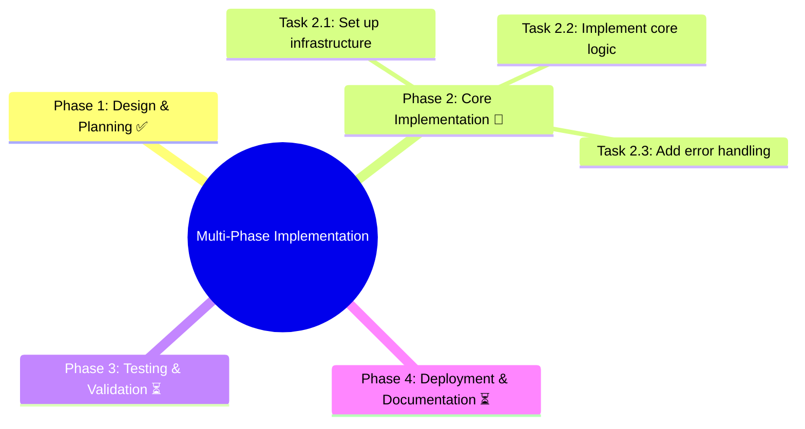
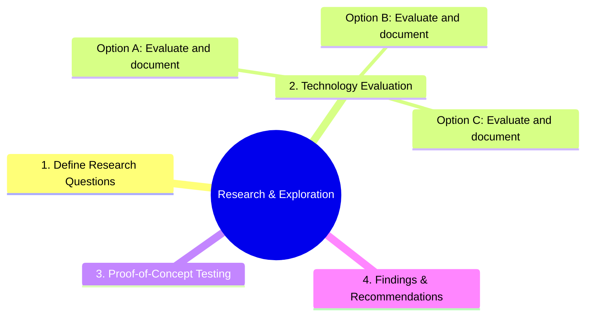
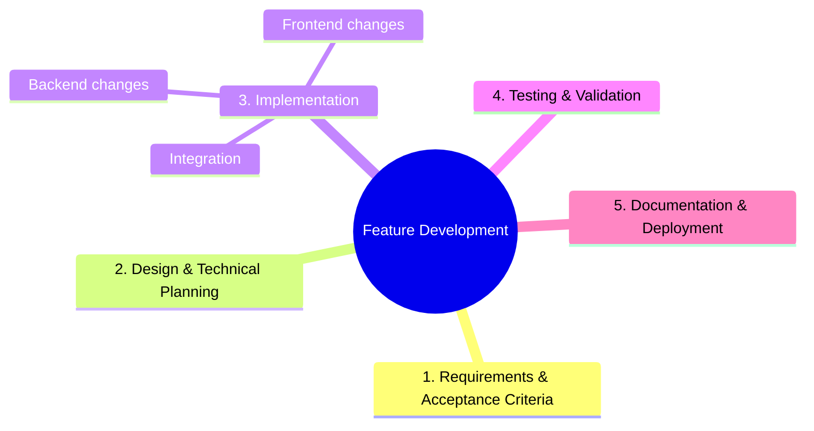
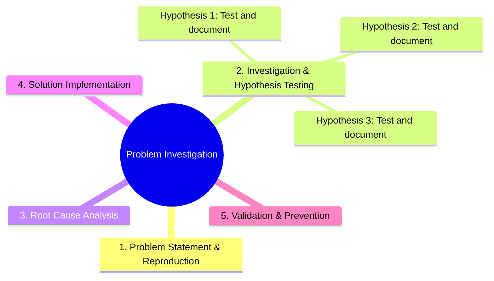
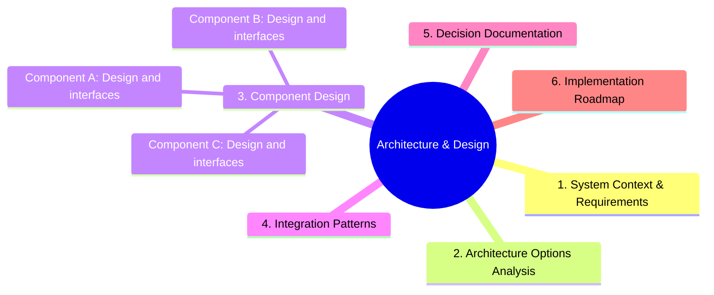
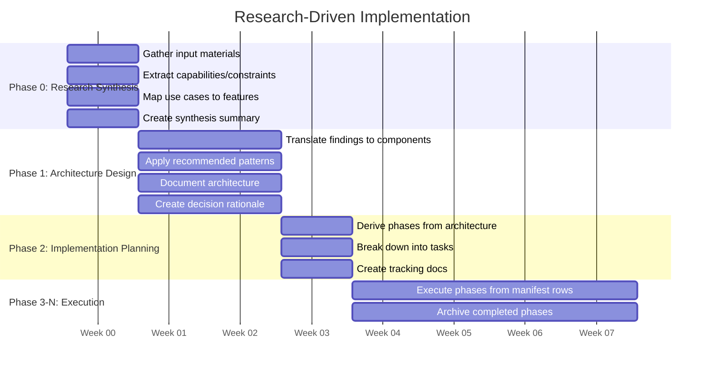
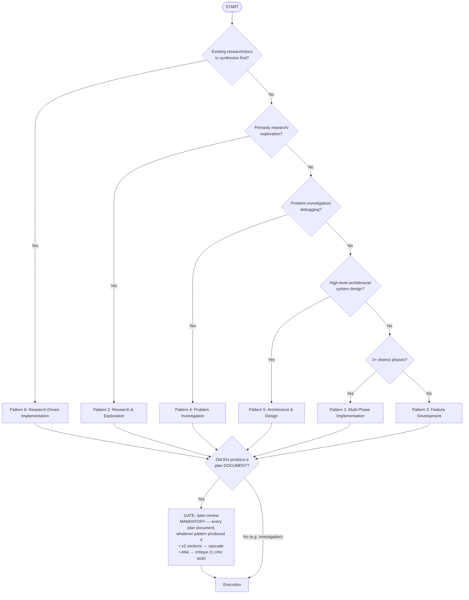
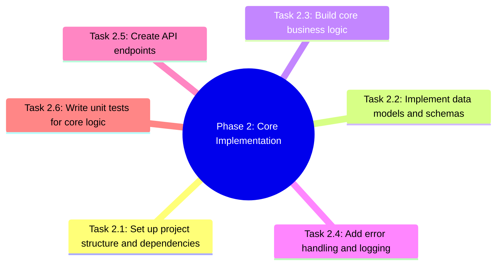

# Work Planning

**Purpose:** Framework for planning and breaking down work tasks using structured patterns that guide both human and AI thinking.

**When to use:** When starting new features, organizing complex tasks, structuring multi-step implementations, or approaching unfamiliar work.

**Key activities:**
- Classifying work type through discovery questions
- Selecting appropriate planning pattern
- Breaking down work into manageable tasks
- Recording the breakdown as task-store rows (a stub manifest when the plan has two or more phases)
- Tracking progress with store statuses (queued, in_progress, blocked, done) and receipts
- Archiving completed work and capturing learnings

---

## Where Owed Work Lives

**The task store is the only home of owed work.** Every task this workflow produces is a row in the unified task store, never an item in a native TodoWrite-style list. The store is what the stop-hook, the arbiter and your manager read; a list kept anywhere else is invisible to them. The mechanics (statuses, transitions, receipts, query hygiene) live in `task-store-discipline.md`. This document only says *when each tracking form applies*.

| The plan has | Track it with | Where the rows come from |
|---|---|---|
| **One phase** (Patterns 2, 3 and 4 as a rule) | Ordinary store rows, one per task | You create them with `task_create` |
| **Two or more phases** (Patterns 1, 5 and 6 always; any other pattern once its breakdown names two or more phases) | A stub manifest | The importer (planning-is-prompting → workflow/scripts/plan_stub_import.py) creates every row from the manifest in one run (see `plan-stub-manifest.md`). Nobody types these rows by hand |

**Two or more phases means a stub manifest, whatever the pattern.** The phase count decides the tracking form, and nothing else does. The "3+ distinct phases" test in the Pattern Selection Decision Tree chooses the *pattern* only (Pattern 1 or Pattern 3); it does not choose the tracking form, so a two-phase plan lands in Pattern 3 and still writes a manifest. In single-phase work the numbered groups of a breakdown are called *stages*, not phases: stages are rows under one epic, phases are manifest entries.

Rules that hold for both forms:

- **Titles.** A title you write by hand (single-phase rows) is one imperative line of about 60 characters or fewer; detail goes in the row `body` (`task-store-discipline.md` §3). That target is for hand-written titles only. A manifest row's title is stamped by the importer (`[PREFIX] Plan N · Phase X of Y · Step X of Y · <name>`) and its progress prefix is exempt from the 60: the plan author keeps the *name* short (aim for 40 characters or fewer) and the whole stamped title under the store's cap of 120 characters. The importer warns before a title would be trimmed.
- **A new row lands in the holding area, not on the board.** This applies when the board is configured to hold new rows, which is the default on the fleet's board. The store then mints a row a seat creates as `not_approved`, and refuses a create that asks for `queued`. The row becomes `queued`, and workable, only when the operator approves it; the importer never approves and neither do you. Ask your manager to request admission for rows you need to start on. This holds for hand-made rows and importer rows alike (`plan-stub-manifest.md` §1 rule 4). `task-store-discipline.md` does not describe this step yet: its §9 graph draws a row's life from `queued` onward, which is the state a row is in *after* admission.
- **Every row carries a `correlation_key`** in the form `epic:<slug>`. Workers pick an existing epic or use `epic:unassigned`; only a manager mints a new epic (`task-store-discipline.md` §7.1).
- **Priority.** A worker files `P5`; a raise is a manager or operator act (`task-store-discipline.md` §1).
- **Finished work gets no row.** If you adopt a plan mid-flight, start at the first unfinished task. Nobody creates a row in order to close it.
- **A row is done only with a receipt.** No receipt, not done.

---

## The "Planning is Prompting" Philosophy

**Core Insight**: The structure you create for planning work IS a form of prompting. By organizing work into patterns, phases, and tasks, you create a framework that prompts decision-making, action, and progress.

### How Structure Creates Prompts

When you create a structured plan, it continuously asks questions:
- "What phase am I in?" → Prompts context awareness
- "What's the next task?" → Prompts action
- "What decisions have been made?" → Prompts consistency
- "What's been completed?" → Prompts progress tracking
- "What's the definition of done?" → Prompts completion criteria

### Benefits of Structured Planning

1. **Shared Mental Model**: Human and AI align on goals, approach, and progress
2. **Reduced Cognitive Load**: Structure handles "what's next" so you can focus on "how to do it"
3. **Better Decision Making**: Patterns provide decision frameworks
4. **Progress Visibility**: store rows give real-time progress tracking that the whole fleet can read
5. **Knowledge Capture**: Archival preserves learnings for future reference

---

## Interactive Discovery with Context-Aware Defaults

### The Enhancement Pattern

**Problem**: Traditional planning workflows require answering every question from scratch, even when context makes answers obvious.

**Solution**: This workflow analyzes available context (your work description, recent history, git state) to infer smart defaults, reducing cognitive load.

### How It Works

**1. Context Analysis** (Automatic):
- Scans your initial work description for keywords and intent
- Reviews recent sessions in history.md for pattern learning
- Checks git branch/status for current work clues
- Analyzes codebase state for project maturity indicators

**2. Smart Default Inference**:
- Work type: Keywords like "bug" → Investigation, "add" → Feature Development
- Scale: File count, systems mentioned → Small/Medium/Large estimate
- Duration: Timeline mentions ("by Friday", "next sprint") → Time horizon
- Pattern: Historical preferences + work characteristics → Suggested pattern

**3. Interactive Confirmation**:
- Workflow presents questions WITH suggested defaults
- User accepts defaults with 'y' or provides override
- Only need to think about non-standard aspects
- Batch acceptance for multiple related defaults

**4. Graceful Degradation**:
- No context available? → Ask questions normally
- Context unclear? → Present options without default
- User overrides? → Learn from correction

### Benefits

- **Faster Planning**: Accept sensible defaults instead of answering every question
- **Less Cognitive Load**: Focus on unusual aspects, not routine classification
- **Transparent Reasoning**: See WHY defaults were suggested
- **Full Control**: Override any default easily
- **Pattern Learning**: Workflow learns from your preferences over time

### Example Interaction

**Traditional flow** (8 manual answers required):
```
Q1: What type of work is this? [user must choose from 6 options]
Q2: What is the scale and complexity? [user must assess]
Q3: What is the time horizon? [user must estimate]
... (8 questions total)
```

**Enhanced flow** (context-aware defaults):
```
*Analyzing your description: "Add email notifications to existing app"*

Context detected:
- Work type: Feature Development (keyword "add" + "existing app")
- Scale: Medium (1-2 weeks)
- Pattern: Pattern 3 (Feature Development)

These defaults look correct? [y/n]: y ✓

*Creating task-store rows for Pattern 3...*
```

**User only engaged for ~5 seconds instead of ~5 minutes.**

### Context Sources (Prioritized)

1. **User's Work Description** (Primary):
   - Keywords: "add", "fix", "bug", "research", "design", "implement"
   - Mentioned systems/technologies
   - Timeline indicators
   - Complexity signals (number of components mentioned)

2. **Recent History** (Pattern Learning):
   - Last 3-5 projects: which patterns were used?
   - Typical duration for similar work types
   - User's preferences (tends toward thorough planning vs. quick execution)

3. **Git State** (Current Work Clues):
   - Branch name: `feature/email-notifications` → Feature Development
   - Recent commits: multi-phase work vs. single commit fixes
   - Files changed: scope indicator

4. **Codebase State** (Project Maturity):
   - Established patterns: architecture already decided
   - Test coverage: quality expectations
   - Documentation: thoroughness culture

### When This Pattern Applies

**Use Interactive Discovery** when:
- ✓ Starting new work with the planning workflow
- ✓ User provides initial work description (even brief)
- ✓ history.md exists with recent sessions
- ✓ Want to reduce planning overhead

**Skip to manual questions** when:
- ✗ Completely new project (no history)
- ✗ User explicitly requests full planning session
- ✗ Work is highly unusual (context won't help)
- ✗ Teaching/demonstration mode (want to see all questions)

---

## Work Planning Workflow

### Phase 0: Research Synthesis (Conditional - Use When Starting From Existing Research)

**When to use**: You have existing research materials, documentation, or recommendations to process BEFORE planning implementation

**Skip this phase if**: You already understand the technology/approach, or are doing your own research (use Pattern 2 instead)

**Purpose**: Transform external research documents into actionable insights that inform architecture and implementation planning

#### Process Steps

**Step 1: Gather Input Materials**

Collect all research sources you need to understand:
- Technical documentation (e.g., Google ADK documentation, framework guides)
- Use case recommendations or requirements documents
- Technical specifications or RFC documents
- Stakeholder requirements or product briefs
- Example implementations or reference architectures

**Step 2: Extract Key Information**

For each document, systematically identify:

1. **Capabilities**: What does this technology/approach enable?
   - Core features and functions
   - Integration points with other systems
   - Performance characteristics
   - Scalability considerations

2. **Constraints**: What limitations or requirements exist?
   - Technical constraints (API limits, token limits, latency requirements)
   - Compatibility requirements (versions, dependencies)
   - Resource constraints (memory, CPU, network)
   - Licensing or cost constraints

3. **Patterns**: What architectural patterns or best practices are recommended?
   - Recommended architectures
   - Design patterns
   - Integration patterns
   - Anti-patterns to avoid

4. **Integration Points**: How does this connect to existing systems?
   - APIs and interfaces
   - Authentication mechanisms
   - Data formats and protocols
   - Event/messaging patterns

5. **Decision Implications**: What design choices does this research suggest?
   - Technology stack recommendations
   - Architecture approach (microservices vs. monolith, async vs. sync)
   - Data storage strategies
   - Security considerations

**Step 3: Create Research Synthesis Document**

Create `src/rnd/YYYY.MM.DD-{topic}-research-synthesis.md` with this structure:

```markdown
# {Topic} Research Synthesis

**Created**: YYYY.MM.DD
**Source Materials**: List of documents reviewed
**Purpose**: Synthesize research to inform {project name} implementation

## Source Documents

1. **[Document Name]** ({URL or path})
   - Type: Documentation/Specification/Recommendation
   - Focus areas: {What you extracted from this}

2. **[Document Name]** ({URL or path})
   - Type: Documentation/Specification/Recommendation
   - Focus areas: {What you extracted from this}

## Key Capabilities Extracted

### From {Source 1}
- Capability 1: {Description and implications}
- Capability 2: {Description and implications}

### From {Source 2}
- Capability 3: {Description and implications}

## Constraints & Requirements

### Technical Constraints
- Constraint 1: {Description and impact on design}
- Constraint 2: {Description and impact on design}

### Integration Requirements
- Requirement 1: {What we must support}
- Requirement 2: {What we must support}

## Recommended Patterns & Approaches

### From {Source 1}
- Pattern: {Name and description}
  - When to use: {Context}
  - How to implement: {High-level approach}
  - Benefits: {Why this pattern}

### From {Source 2}
- Pattern: {Name and description}
  - When to use: {Context}
  - How to implement: {High-level approach}
  - Benefits: {Why this pattern}

## Design Implications

Based on research, the following design decisions are recommended:

1. **Architecture Approach**: {Monolith/Microservices/Hybrid and why}
2. **Technology Stack**: {Key technologies and rationale}
3. **Integration Strategy**: {How components will connect}
4. **Data Management**: {Storage, caching, retrieval approach}
5. **Security Model**: {Authentication, authorization approach}

## Use Case Mapping

### Use Case 1: {Name}
- **Requirements extracted**: {What this use case needs}
- **Relevant capabilities**: {Which researched features apply}
- **Implementation approach**: {High-level how to build this}

### Use Case 2: {Name}
- **Requirements extracted**: {What this use case needs}
- **Relevant capabilities**: {Which researched features apply}
- **Implementation approach**: {High-level how to build this}

## Open Questions & Risks

### Questions Requiring Further Investigation
- Question 1: {What's still unclear}
- Question 2: {What needs deeper research}

### Identified Risks
- Risk 1: {Potential issue and mitigation approach}
- Risk 2: {Potential issue and mitigation approach}

## Next Steps

With research synthesis complete, proceed to:
1. **Phase 1** (Discovery Questions): Answer based on synthesized understanding
2. **Phase 2** (Pattern Selection): Likely Pattern 6 (Research-Driven Implementation)
3. **Step 2** (Documentation): Create Pattern B (Architecture) and Pattern A (Implementation Tracking)
4. **GATE** (`/plan-review`): every plan document produced above enters the gate before code is written — it dispatches to the cascade (≥ 2 sections) or the critique branch
```

**Step 4: Record the Synthesis Steps as Store Rows**

Track your research synthesis progress with one store row per step. If the research is Phase 0 of a Pattern 6 plan, these rows come from the plan's stub manifest (see Pattern 6 below) rather than from `task_create`. A standalone synthesis is one phase of work, so you create the rows yourself:

```
correlation_key: epic:<research-slug>
[SHORT_PROJECT_PREFIX] Gather all research source materials        not_approved
[SHORT_PROJECT_PREFIX] Extract capabilities from {Source 1}        not_approved
[SHORT_PROJECT_PREFIX] Extract capabilities from {Source 2}        not_approved
[SHORT_PROJECT_PREFIX] Document constraints and requirements       not_approved
[SHORT_PROJECT_PREFIX] Identify recommended patterns               not_approved
[SHORT_PROJECT_PREFIX] Map use cases to capabilities               not_approved
[SHORT_PROJECT_PREFIX] Create research synthesis document          not_approved
[SHORT_PROJECT_PREFIX] Transition to Phase 1 (Discovery)           not_approved
```

Create each row with `task_create` (`item_class="task"`, `priority="P5"`, `project=[PROJECT]`) the moment you know the step exists. The rows are shown as they stand right after you create them: held in the holding area (`not_approved`) until the operator admits them to `queued` (see *Where Owed Work Lives*). Once a row is admitted, move it with `task_transition`: to `in_progress` when you start it, and to `done`, with its receipt, when you finish.

**Step 5: Transition to Planning**

With synthesis complete, proceed to Phase 1 (Discovery) armed with:
- ✅ Clear understanding of technology/approach from research
- ✅ Concrete requirements derived from use cases
- ✅ Design constraints extracted from documentation
- ✅ Recommended patterns to follow
- ✅ Integration points identified
- ✅ Risk areas surfaced

Your synthesis document becomes a key reference throughout planning and implementation phases.

---

### Phase 1: Work Discovery & Classification

Before diving into implementation, understand what you're trying to accomplish.

#### Step 0: Context Analysis (Perform First)

**Before presenting questions**, analyze available context to infer smart defaults:

**Process**:
1. **Read user's work description** - Extract keywords, intent, scope signals
2. **Scan recent history.md** - Identify patterns in last 3-5 sessions
3. **Check git state** - Examine branch name, recent commits, changed files
4. **Assess codebase** - Detect project maturity, existing patterns

**Keyword Detection Examples**:
- "add", "implement", "build" + "to existing" → **Feature Development** likely
- "fix", "bug", "issue", "broken" → **Problem Investigation** likely
- "research", "evaluate", "compare", "explore" → **Research** likely
- "design", "architecture", "system" → **Architecture** likely
- "Google ADK", "framework", "SDK", "documentation" → **Research-Driven** likely

**Timeline Indicators**:
- "by Friday", "this week" → **Sprint** (1-2 weeks)
- "next sprint", "couple weeks" → **Short-term** (2-4 weeks)
- "next month", "Q2" → **Medium-term** (1-3 months)
- No timeline → Assess from scope

**Scale Signals**:
- Mentions 1-2 components/files → **Small**
- Mentions 3-5 systems/features → **Medium**
- Mentions 6+ components or "entire system" → **Large**

**Output of Context Analysis**:
- Present findings to user: "Based on your description and context, here's what I inferred..."
- Offer defaults for each discovery question
- Allow user to accept ('y') or override

---

#### Core Questions (Answer with Smart Defaults)

**Format**: For each question, present:
1. Context-based inference (what was detected)
2. Suggested default answer
3. Accept with 'y' or provide alternative

---

1. **What type of work is this?**

   **Context Inference**:
   - Description: "{user's work description}"
   - Keywords detected: "add email notifications", "existing app"
   - Git branch: `feature/email-notifications`
   - Recent history: Last 3 projects were Feature Development

   **Suggested**: Feature Development (adding to existing system)

   **Reasoning**: Keywords "add" + "existing app" indicate enhancement, not new build

   Accept suggestion? [y/n or specify different type]:

   **Options if not accepting default**:
   - Implementation (building something new)
   - Research (exploring options/approaches)
   - Problem Investigation (debugging/troubleshooting)
   - Architecture/Design (system structure/patterns)
   - Maintenance (updates, refactoring, cleanup)

2. **What is the scale and complexity?**

   **Context Inference**:
   - Components mentioned: "email service, templates, queue, user preferences" (4 systems)
   - Estimated tasks: Setup, templates, queue, triggers, testing (~8-12 tasks)
   - Complexity signals: Integration with existing app, new infrastructure

   **Suggested**: Medium (3-10 days, 1-3 developers, 5-15 tasks)

   **Reasoning**: Multiple systems involved but well-scoped boundaries

   Accept suggestion? [y/n or specify different scale]:

   **Options if not accepting default**:
   - Small: 1-3 days, single developer, < 5 tasks
   - Large: 10+ days, multiple developers, 15+ tasks
   - Exploratory: Unknown duration, discovery-oriented

3. **What is the time horizon?**

   **Context Inference**:
   - User mentioned: "need this for next sprint"
   - Scale assessment: Medium (3-10 days)
   - No major blockers identified

   **Suggested**: Sprint (1-2 weeks)

   **Reasoning**: "Next sprint" indicates 1-2 week timeline

   Accept suggestion? [y/n or specify different horizon]:

   **Options if not accepting default**:
   - Short-term: 2-4 weeks
   - Medium-term: 1-3 months
   - Long-term: 3+ months
   - Ongoing: No specific deadline

4. **Are there distinct phases or milestones?**

   **Context Inference**:
   - Work type: Feature Development (typically linear)
   - Scope: Single feature with dependencies
   - Pattern emerging: Requirements → Design → Implementation → Testing

   **Suggested**: Maybe, I have some phases in mind (linear workflow with natural breaks)

   **Reasoning**: Feature work typically has requirements → implementation → testing flow

   Accept suggestion? [y/n or specify different answer]:

   **Options if not accepting default**:
   - Yes, I can identify 3+ clear phases
   - No, it's more linear/continuous
   - Not sure yet

#### Contextual Questions (Answer with Smart Defaults)

5. **What are the success criteria?**

   **Context Inference**:
   - Work type: Feature Development (email notifications)
   - Typical criteria for this pattern: functional + user-facing + testable

   **Suggested Success Criteria**:
   - Emails sent successfully when triggered
   - User can configure notification preferences
   - Templates render correctly
   - Integration tests passing

   **Reasoning**: Standard feature acceptance criteria

   Accept suggestion? [y/n or add/modify criteria]:

   **Options for additional criteria**:
   - Performance metrics (delivery time, queue throughput)
   - Stakeholder approval
   - User acceptance testing

6. **What are the dependencies and constraints?**

   **Context Inference**:
   - Technical mentions: "SendGrid" (email service), "existing app" (integration point)
   - Timeline: "next sprint" (time constraint)

   **Suggested Dependencies/Constraints**:
   - Technical: SendGrid API, existing user database, app notification system
   - Timeline: Must complete in 1-2 weeks
   - Integration: Must work with current authentication system

   **Reasoning**: Extracted from description and context

   Accept suggestion? [y/n or add/modify]:

   **Categories for additional dependencies**:
   - Team dependencies (other developers, stakeholders)
   - Resource constraints (budget, tools, access)

7. **What is the risk level?**

   **Context Inference**:
   - Work type: Feature Development (familiar pattern)
   - Technologies: Sendgrid is well-documented
   - Integration: Adding to existing system (moderate complexity)
   - Timeline: Sprint timeline (not urgent/critical)

   **Suggested**: Medium (Some unknowns, moderate impact)

   **Reasoning**: Standard feature development, established tools, not mission-critical

   Accept suggestion? [y/n or specify different level]:

   **Options if not accepting default**:
   - Low: Well-understood work, low impact if delayed
   - High: Many unknowns, significant impact
   - Critical: Business-critical, high stakes

8. **Is this a one-time task or recurring pattern?**

   **Context Inference**:
   - Feature type: Email notification system (infrastructure component)
   - Applicability: Could be template for SMS, push notifications, etc.

   **Suggested**: Pattern (Creates reusable template for future work)

   **Reasoning**: Notification infrastructure often reused for other channels

   Accept suggestion? [y/n or specify different type]:

   **Options if not accepting default**:
   - One-time: Unique work, won't repeat
   - Recurring: Will do similar work again

---

**Discovery Complete**: With context analysis and smart defaults, you should have answers to all 8 questions. The workflow will now suggest a pattern based on these answers.

### Phase 2: Pattern Selection

Based on your discovery answers, select a planning pattern. Each pattern provides a different structure for organizing and tracking work.

#### Suggested Pattern (Based on Discovery Context)

**Context Analysis Summary**:
```
Work Type:         Feature Development
Scale:             Medium (3-10 days, 5-15 tasks)
Time Horizon:      Sprint (1-2 weeks)
Distinct Phases:   Maybe (linear workflow)
Success Criteria:  Functional + testable + user-facing
Dependencies:      SendGrid API, existing user system
Risk Level:        Medium
Recurring:         Pattern (reusable for other notifications)
```

**Pattern Recommendation**: **Pattern 3 (Feature Development)**

**Rationale**:
- ✓ Well-scoped feature with clear boundaries
- ✓ Adding to existing system (not building from scratch)
- ✓ Linear workflow (requirements → design → implementation → testing)
- ✓ Sprint timeline (1-2 weeks) fits Pattern 3 characteristics
- ✓ No need for multi-phase tracking (Pattern 1) or research docs (Pattern 2)

**Alternative Patterns to Consider**:
- **Pattern 1 (Multi-Phase Implementation)** - Only if scope grows significantly or phases become more complex
- **Pattern 4 (Problem Investigation)** - If this is primarily debugging existing notification system
- **Pattern 5 (Architecture & Design)** - If designing entire notification architecture from scratch

**Accept Pattern 3?** [y/n or specify pattern number 1-6]:

---

#### Pattern Library

**Reminder**: The pattern library below provides details on all patterns. Your suggested pattern is **Pattern 3**, but you can review all options before deciding.

##### Pattern 1: Multi-Phase Implementation

**Best for**: Complex implementation projects with clear milestones

**Characteristics**:
- Multiple distinct phases (design → build → test → deploy)
- 2+ weeks duration
- Requires detailed planning and tracking
- Clear separation between active and completed work

**Structure**:

```mermaid
mindmap
  root((Multi-Phase Implementation))
    Phase 1: Design & Planning ✅
    Phase 2: Core Implementation 🔄
      Task 2.1: Set up infrastructure
      Task 2.2: Implement core logic
      Task 2.3: Add error handling
    Phase 3: Testing & Validation ⏳
    Phase 4: Deployment & Documentation ⏳
```

**Tracking form: stub manifest** (two or more phases, so the plan ships a manifest and the importer creates the rows). Excerpt of the `phases` array, as it would stand with Phase 1 already finished; top-level fields are as in `plan-stub-manifest.md` §3:

```json
"phases" : [
    {
        "phase" : 1,
        "name"  : "Design and planning",
        "steps" : [
            { "key": "ph1-s1", "name": "Write the design note", "item_class": "task", "priority": "P5",
              "acceptance": "Design note reviewed", "depends_on": [], "done_receipt": "a1b2c3d" }
        ]
    },
    {
        "phase" : 2,
        "name"  : "Core implementation",
        "steps" : [
            { "key": "ph2-s1", "name": "Set up infrastructure", "item_class": "task", "priority": "P5",
              "acceptance": "Project builds from a clean checkout", "depends_on": [ "ph1-s1" ] },
            { "key": "ph2-s2", "name": "Implement core logic", "item_class": "task", "priority": "P5",
              "acceptance": "Core functions pass their unit tests", "depends_on": [ "ph2-s1" ] },
            { "key": "ph2-s3", "name": "Add error handling", "item_class": "task", "priority": "P5",
              "acceptance": "Every error path in the design note has a test", "depends_on": [ "ph2-s2" ] }
        ]
    },
    { "phase": 3, "name": "Testing and validation",       "steps": [], "expand_trigger": "Phase 2 closes" },
    { "phase": 4, "name": "Deployment and documentation", "steps": [], "expand_trigger": "Phase 3 closes" }
]
```

The importer turns this into rows titled `[SHORT_PROJECT_PREFIX] Plan 1 · Phase 2 of 4 · Step 1 of 3 · Set up infrastructure` and so on. Phase 1 gets no row because its step carries `done_receipt`; Phases 3 and 4 are single `STUB` rows until their trigger fires.

**Example**: Building JWT authentication system with phases for token generation, validation, OAuth integration, session management, and security hardening.

---

##### Pattern 2: Research & Exploration

**Best for**: Exploratory projects focused on investigation and analysis

**Characteristics**:
- Research-heavy, implementation-light
- Multiple technologies/approaches to evaluate
- Emphasis on findings and recommendations
- May lead to future implementation project

**Structure**:

```mermaid
mindmap
  root((Research & Exploration))
    1. Define Research Questions
    2. Technology Evaluation
      Option A: Evaluate and document
      Option B: Evaluate and document
      Option C: Evaluate and document
    3. Proof-of-Concept Testing
    4. Findings & Recommendations
```

**Tracking form: store rows** (one phase of work; one `task_create` row each, all under one `epic:<slug>` key):
```
[SHORT_PROJECT_PREFIX] Define research questions and scope
[SHORT_PROJECT_PREFIX] Evaluate Option A: [Technology Name]
[SHORT_PROJECT_PREFIX] Evaluate Option B: [Technology Name]
[SHORT_PROJECT_PREFIX] Build proof-of-concept for top option
[SHORT_PROJECT_PREFIX] Document findings and recommendations
```

**Example**: Evaluating WebSocket architectures (polling vs. long-polling vs. WebSockets vs. Server-Sent Events) with PoC implementations and performance comparisons.

---

##### Pattern 3: Feature Development

**Best for**: Well-defined features requiring systematic implementation

**Characteristics**:
- Clear feature boundaries
- Integration with existing system
- User stories and use cases
- Acceptance criteria defined upfront

**Structure**:

```mermaid
mindmap
  root((Feature Development))
    1. Requirements & Acceptance Criteria
    2. Design & Technical Planning
    3. Implementation
      Backend changes
      Frontend changes
      Integration
    4. Testing & Validation
    5. Documentation & Deployment
```

**Tracking form: store rows** (one phase of work; one `task_create` row each, all under one `epic:<slug>` key):
```
[SHORT_PROJECT_PREFIX] Define requirements and acceptance criteria
[SHORT_PROJECT_PREFIX] Design technical approach
[SHORT_PROJECT_PREFIX] Implement backend changes
[SHORT_PROJECT_PREFIX] Implement frontend changes
[SHORT_PROJECT_PREFIX] Integration and testing
[SHORT_PROJECT_PREFIX] Documentation and deployment
```
If you plan and report these as two or more phases of their own, write a stub manifest instead.

**Example**: Adding email notification feature to existing application with SMTP configuration, template system, queue management, and user preferences.

---

##### Pattern 4: Problem Investigation

**Best for**: Debugging complex issues requiring systematic investigation

**Characteristics**:
- Problem-focused (not feature-focused)
- Hypothesis testing and experimentation
- Detailed observations and findings
- Solution validation

**Structure**:

```mermaid
mindmap
  root((Problem Investigation))
    1. Problem Statement & Reproduction
    2. Investigation & Hypothesis Testing
      Hypothesis 1: Test and document
      Hypothesis 2: Test and document
      Hypothesis 3: Test and document
    3. Root Cause Analysis
    4. Solution Implementation
    5. Validation & Prevention
```

**Tracking form: store rows** (one phase of work; one `task_create` row each, all under one `epic:<slug>` key; a durable bug also gets its own `item_class="bug"` row, see `task-store-discipline.md` §3):
```
[SHORT_PROJECT_PREFIX] Document problem statement and reproduction steps
[SHORT_PROJECT_PREFIX] Test hypothesis: [Description]
[SHORT_PROJECT_PREFIX] Test hypothesis: [Description]
[SHORT_PROJECT_PREFIX] Identify root cause
[SHORT_PROJECT_PREFIX] Implement solution
[SHORT_PROJECT_PREFIX] Validate fix and add prevention measures
```

**Example**: Investigating WebSocket event routing bug with hypotheses about race conditions, state management, event ordering, and connection lifecycle.

---

##### Pattern 5: Architecture & Design

**Best for**: System-level architecture and design decisions

**Characteristics**:
- High-level system design
- Component relationships and interactions
- Design principles and patterns
- Long-term reference document

**Structure**:

```mermaid
mindmap
  root((Architecture & Design))
    1. System Context & Requirements
    2. Architecture Options Analysis
    3. Component Design
      Component A: Design and interfaces
      Component B: Design and interfaces
      Component C: Design and interfaces
    4. Integration Patterns
    5. Decision Documentation
    6. Implementation Roadmap
```

**Tracking form: stub manifest** (the six stages are phases, so the plan ships a manifest). Excerpt of the `phases` array with Phases 1 and 2 already finished; top-level fields are as in `plan-stub-manifest.md` §3. An operator ruling on the component split is a `decision` step, so it is counted and visible:

```json
"phases" : [
    { "phase": 1, "name": "System context and requirements",
      "steps": [ { "key": "ph1-s1", "name": "Define context and requirements", "item_class": "task", "priority": "P5",
                   "acceptance": "Requirements list reviewed", "depends_on": [], "done_receipt": "a1b2c3d" } ] },
    { "phase": 2, "name": "Architecture options",
      "steps": [ { "key": "ph2-s1", "name": "Analyze architecture options", "item_class": "task", "priority": "P5",
                   "acceptance": "Options compared in one table", "depends_on": [ "ph1-s1" ], "done_receipt": "b2c3d4e" } ] },
    { "phase": 3, "name": "Component design",
      "steps": [
          { "key": "ph3-s1", "name": "Design component A", "item_class": "task", "priority": "P5",
            "acceptance": "Interfaces and failure modes written down", "depends_on": [] },
          { "key": "ph3-s2", "name": "Design component B", "item_class": "task", "priority": "P5",
            "acceptance": "Interfaces and failure modes written down", "depends_on": [] },
          { "key": "ph3-s3", "name": "Design component C", "item_class": "task", "priority": "P5",
            "acceptance": "Interfaces and failure modes written down", "depends_on": [] },
          { "key": "ph3-s4", "name": "Rule on the component split", "item_class": "decision", "priority": "P5",
            "acceptance": "The operator has said which split to build", "depends_on": [ "ph3-s1", "ph3-s2", "ph3-s3" ] }
      ] },
    { "phase": 4, "name": "Integration patterns",     "steps": [], "expand_trigger": "Phase 3 closes" },
    { "phase": 5, "name": "Decision documentation",   "steps": [], "expand_trigger": "Phase 4 closes" },
    { "phase": 6, "name": "Implementation roadmap",   "steps": [], "expand_trigger": "Phase 5 closes" }
]
```

Phases 4 to 6 are `STUB` rows until their trigger fires. When each one expands, the work it carries becomes its steps:

```
Phase 4: Define integration patterns
Phase 5: Document key decisions
Phase 6: Create implementation roadmap
```

**Example**: Designing microservices architecture with API gateway, authentication service, business logic services, database strategy, and inter-service communication patterns.

---

##### Pattern 6: Research-Driven Implementation

**Best for**: Building systems based on external research, documentation, or recommendations where you need to understand existing materials before planning

**Characteristics**:
- Starts with existing research materials (not your own research work)
- Requires synthesis and translation before planning
- Design decisions heavily influenced by research findings
- Implementation follows researched best practices and patterns
- Multi-phase workflow: Synthesis → Architecture → Planning → Execution

**When to use**:
- Building with new framework/SDK (e.g., Google ADK, LangChain, etc.)
- Have vendor documentation or architectural recommendations to follow
- Implementing based on technical specifications or RFCs
- Have use case requirements that need mapping to technology capabilities

**Structure**:

```mermaid
gantt
    title Research-Driven Implementation
    dateFormat YYYY-[W]WW
    axisFormat Week %W
    section Phase 0: Research Synthesis
        Gather input materials           :p0a, 2026-W01, 1w
        Extract capabilities/constraints :p0b, 2026-W01, 1w
        Map use cases to features        :p0c, 2026-W01, 1w
        Create synthesis summary         :p0d, 2026-W01, 1w
    section Phase 1: Architecture Design
        Translate findings to components :p1a, after p0d, 2w
        Apply recommended patterns       :p1b, after p0d, 2w
        Document architecture            :p1c, after p0d, 2w
        Create decision rationale        :p1d, after p0d, 2w
    section Phase 2: Implementation Planning
        Derive phases from architecture  :p2a, after p1d, 1w
        Break down into tasks            :p2b, after p1d, 1w
        Create tracking docs             :p2c, after p1d, 1w
    section Phase 3-N: Execution
        Execute phases from manifest rows :p3a, after p2c, 4w
        Archive completed phases         :p3b, after p2c, 4w
```

**Tracking form: stub manifest** (always multi-phase). Write the manifest when the plan is written. Detail what the plan details, and enter each phase it has not broken down yet as one `STUB` row with its trigger. Excerpt of the `phases` array; top-level fields are as in `plan-stub-manifest.md` §3:

```json
"phases" : [
    { "phase": 0, "name": "Research synthesis",
      "steps": [
          { "key": "ph0-s1", "name": "Gather research source materials", "item_class": "task", "priority": "P5",
            "acceptance": "Every source (SDK docs, use cases, specs) is listed with its location", "depends_on": [] },
          { "key": "ph0-s2", "name": "Extract capabilities and constraints", "item_class": "task", "priority": "P5",
            "acceptance": "Capabilities and constraints are written down per source", "depends_on": [ "ph0-s1" ] },
          { "key": "ph0-s3", "name": "Identify recommended patterns", "item_class": "task", "priority": "P5",
            "acceptance": "Recommended patterns and best practices are listed per source", "depends_on": [ "ph0-s1" ] },
          { "key": "ph0-s4", "name": "Map use cases to capabilities", "item_class": "task", "priority": "P5",
            "acceptance": "Every use case names the capabilities it needs", "depends_on": [ "ph0-s2" ] },
          { "key": "ph0-s5", "name": "Write the research synthesis summary", "item_class": "task", "priority": "P5",
            "acceptance": "Synthesis document exists and cites every source", "depends_on": [ "ph0-s2", "ph0-s3", "ph0-s4" ] },
          { "key": "ph0-s6", "name": "Transition to Phase 1", "item_class": "task", "priority": "P5",
            "acceptance": "Synthesis is accepted as the input to architecture design", "depends_on": [ "ph0-s5" ] }
      ] },
    { "phase": 1, "name": "Architecture design",
      "steps": [
          { "key": "ph1-s1", "name": "Design architecture from research", "item_class": "task", "priority": "P5",
            "acceptance": "Each component traces to a research finding", "depends_on": [ "ph0-s6" ] },
          { "key": "ph1-s2", "name": "Define components from capabilities", "item_class": "task", "priority": "P5",
            "acceptance": "Each component names the researched capabilities it uses", "depends_on": [ "ph1-s1" ] },
          { "key": "ph1-s3", "name": "Document decisions with rationale", "item_class": "task", "priority": "P5",
            "acceptance": "Each design decision cites its research rationale", "depends_on": [ "ph1-s1" ] },
          { "key": "ph1-s4", "name": "Create diagrams and component specs", "item_class": "task", "priority": "P5",
            "acceptance": "Architecture diagrams and a spec per component exist", "depends_on": [ "ph1-s2" ] },
          { "key": "ph1-s5", "name": "Review architecture against use cases", "item_class": "task", "priority": "P5",
            "acceptance": "Every use case maps to a component", "depends_on": [ "ph1-s3", "ph1-s4" ] }
      ] },
    { "phase": 2, "name": "Implementation planning", "steps": [], "expand_trigger": "Phase 1 closes" },
    { "phase": 3, "name": "Execution",               "steps": [], "expand_trigger": "Phase 2 closes" }
]
```

Phases are numbered from 0, so "of N" is the highest phase number (here `Phase 3 of 3`). Phases 0 and 1 are broken down in full above, one step per task. Phases 2 and 3 are `STUB` rows until their trigger fires; when each one expands, the tasks below become its steps:

*Phase 2 (Implementation Planning):*
```
Derive implementation phases from architecture
Break down Phase 1 tasks (e.g., ADK integration)
Break down Phase 2 tasks (e.g., Tool registry)
Identify cross-phase dependencies
Create implementation tracking document
Estimate timeline and resource needs
```

*Phase 3+ (Execution):*
```
Phase 3.1: Set up SDK and dependencies
Phase 3.2: Implement base framework
Phase 3.3: Build component X following researched pattern
Phase 3.4: Integrate components
... (continue through all implementation phases)
```

Expand a stub by editing the manifest (keep every existing `key`) and re-running the importer; never add the rows by hand.

**Example**: Building agent system with Google ADK - synthesize ADK documentation and 2 use case recommendations, design agent architecture based on ADK's Agent-Tool-Memory pattern, derive implementation phases (ADK integration, tool registry, context management, use case 1 implementation, use case 2 implementation), execute with the manifest rows as the tracking surface.

**Integration with p-is-p-02**:
- Phase 0 creates: `src/rnd/YYYY.MM.DD-{topic}-research-synthesis.md` — **only once Gate 0 is passed**: the synthesis carries `authorized_by:` frontmatter naming the task, broadcast or plan that asked for this work. A synthesis nobody asked for is a working note; it goes to scratch and its findings become store rows. Canonical: `workflow/rnd-directory-policy.md`
- Phase 1 creates: Pattern B (Architecture & Design) docs
- Phase 2 creates: Pattern A (Implementation Tracking) docs
- Phases 3+ use: Pattern A for active work, archive completed phases

**Integration with `/plan-review` (the gate)**: every plan document this workflow produces — at any phase, under any pattern — **enters `/plan-review` before code is written.** The gate dispatches internally: ≥ 2 reviewable sections → `/plan-review-cascaded`; otherwise → the critique branch, which spawns one critic seat. See [`plan-review.md`](plan-review.md) §4a. **Do not route yourself to the cascade directly** — invoking `/plan-review` is what selects the route.

**Key Success Factors**:
- Thorough Phase 0 synthesis prevents rework later
- Research synthesis doc becomes key reference throughout project
- Design decisions explicitly trace back to research findings
- Implementation phases align with use case requirements
- Keeping the manifest and the board in step maintains focus through a long project

---

### Pattern Selection Decision Tree

Use this decision tree to select the right pattern:


```mermaid
flowchart TD
    Start([START]) --> Q1{Existing research/docs<br>to synthesize first?}
    Q1 -->|Yes| P6[Pattern 6: Research-Driven Implementation]
    Q1 -->|No| Q2{Primarily research/<br>exploration?}
    Q2 -->|Yes| P2[Pattern 2: Research & Exploration]
    Q2 -->|No| Q3{Problem investigation/<br>debugging?}
    Q3 -->|Yes| P4[Pattern 4: Problem Investigation]
    Q3 -->|No| Q4{High-level architecture/<br>system design?}
    Q4 -->|Yes| P5[Pattern 5: Architecture & Design]
    Q4 -->|No| Q5{3+ distinct phases?}
    Q5 -->|Yes| P1[Pattern 1: Multi-Phase Implementation]
    Q5 -->|No| P3[Pattern 3: Feature Development]
    P1 --> Gate
    P2 --> Gate
    P3 --> Gate
    P4 --> Gate
    P5 --> Gate
    P6 --> Gate
    Gate{Did this produce a<br>plan DOCUMENT?}
    Gate -->|Yes| Review["GATE: /plan-review<br>MANDATORY — every plan document,<br>whatever pattern produced it<br>• ≥2 sections → cascade<br>• else → critique (1 critic seat)"]
    Gate -->|"No (e.g. investigation)"| Code["Execution"]
    Review --> Code
```

> **The "3+ distinct phases?" question chooses the pattern, not the tracking form.** It sends a plan to Pattern 1 or Pattern 3 and that is all it decides. The tracking form has its own rule, stated in *Where Owed Work Lives*: two or more phases means a stub manifest, whatever the pattern. A plan with exactly two phases therefore comes out of this tree as Pattern 3 and still ships a manifest.

> **⚠️ THE PATTERN IS NOT THE TERMINAL DESTINATION.** Selecting a pattern is not the end of planning — **every pattern above can produce a plan document, and every plan document enters `/plan-review` before code is written** ([`plan-review.md`](plan-review.md) §4a). The gate is keyed on the **existence of the document**, not on the pattern that produced it. Work that produces no plan document has nothing to gate — out of scope by construction, not by exemption.

**Hybrid Patterns**: You can combine patterns for complex work. For example:
- Research synthesis (Pattern 6 Phase 0) → Architecture design (Pattern 5) → Implementation (Pattern 1)
- Research phase (Pattern 2) → Implementation phases (Pattern 1)
- Architecture design (Pattern 5) → Feature development (Pattern 3)
- Problem investigation (Pattern 4) → Solution implementation (Pattern 3)

### Phase 3: Work Breakdown

Once you've selected a pattern, break down the work into concrete tasks.

> **Expected Output Shape (when cascade-bound)**: if your plan will be reviewed via `/plan-review-cascaded`, your Phase 3 output **is the cascade's INPUT**. The cascade expects your output to satisfy a 4-property spec: ≥ 2 sections, section independence (cold-reviewer test), explicit acyclic cross-section dependencies (valid DAG), comparable section scope. See §Cascade-Readiness below for the production-side how-to + `workflow/plan-review-cascaded-input-spec.md` for the canonical spec, validation rubric, and remediation flowchart for what happens when the input doesn't comply.

#### Suggested Initial Task Breakdown

**Based on**: Pattern 3 (Feature Development) + your work description

**Context**:
- Feature: Email notification system
- Components mentioned: SendGrid, templates, queue, user preferences
- Integration: Existing app + user system

**Proposed Stages**:

```
1. Requirements & Acceptance Criteria
   - Define email notification triggers (new message, mentions, etc.)
   - Design email template requirements (header, content, footer, unsubscribe)
   - Specify user preferences (frequency, types, opt-out)

2. Technical Design & Planning
   - Select/configure SendGrid account and API keys
   - Design template engine approach (Handlebars, Mustache, or SendGrid templates)
   - Design async queue system (Redis queue, database queue, or SQS)
   - Plan integration with existing user/notification systems

3. Implementation
   - Set up SendGrid integration and configuration
   - Create email template engine
   - Implement notification queue system
   - Add trigger logic (new message handler, mention handler)
   - Build user preferences management (UI + backend)

4. Testing & Validation
   - Unit tests for template rendering
   - Integration tests for SendGrid sending
   - End-to-end tests for trigger → email flow
   - Manual QA across email clients

5. Documentation & Deployment
   - API documentation for notification system
   - User guide for preferences
   - Deployment checklist
   - Monitoring setup
```

**Estimated Tasks**: ~12-15 tasks across 5 stages (fits Medium scale)

**Store Rows Preview** (Pattern 3: one phase of work, one `task_create` row each, all under one `epic:<slug>` key):
```
[EMAIL] Define notification triggers and template requirements
[EMAIL] Set up SendGrid account and configuration
[EMAIL] Design template engine and queue system
[EMAIL] Implement SendGrid integration
[EMAIL] Create email template engine
[EMAIL] Implement notification queue system
[EMAIL] Add notification trigger logic
[EMAIL] Build user preferences management
[EMAIL] Write unit tests for templates
[EMAIL] Write integration tests for SendGrid
[EMAIL] End-to-end testing
[EMAIL] Documentation and deployment
```

The five groups above are stages of one feature, so they are rows, not phases. If you would instead report progress against them as "Phase X of 5", write a stub manifest.

**Accept this breakdown?** [y/n or describe modifications]:

**If modifying**: Describe which tasks to add/remove/change, and I'll update the breakdown accordingly.

---

#### Task Breakdown Principles

1. **Manageable Size**: Each task should be completable in 0.5-4 hours
2. **Clear Completion Criteria**: Know when a task is done
3. **Logical Ordering**: Dependencies clear, tasks flow naturally
4. **Testable Outcomes**: Each task produces verifiable output
5. **One Active Task**: Only one of your rows in_progress at a time

#### Cascade-Readiness (When the Plan Will Be Cascade-Reviewed)

> **Your output is the cascade's input.** This subsection describes how to shape your Phase 3 work breakdown so it satisfies the cascade's 4-property input spec (canonical reference: `workflow/plan-review-cascaded-input-spec.md`). Building the shape upstream during planning is far cheaper than letting the cascade's Step 0 reshape it after submission — see the input-spec doc §5 for the remediation cost table.

**When this applies**: the plan is expected to be **≥ 2 reviewable sections** — the shape that `/plan-review` dispatches to the cascade ([`plan-review.md`](plan-review.md) §4a). Cascaded review is used for larger plans, where the binding constraint is *reviewer (user) attention*, so sections are reviewed in a pipeline. If your plan is single-section, **skip this subsection** — it adds nothing, and the gate routes you to the critique branch on its own.

> ⚠️ **YOU DO NOT CHOOSE THE ROUTE — THE GATE DOES.** Always invoke **`/plan-review`**; it dispatches by size internally. Invoking `/plan-review-cascaded` directly **bypasses the §4a dispatch**, and a plan that self-assesses its way into the cascade never reaches the critique branch. One entry point exists precisely to *remove* this decision, not to relocate it into the planning phase.
>
> **And there is no "no review at all" option.** Every plan document enters the gate, whatever pattern produced it. Only work that produces *no plan document* has nothing to gate.

**Why structure for it at planning time**: a cascade consumes a plan that is *already* decomposed into independently-reviewable sections. If the planning output is not section-shaped, the cascade's Step 0 ("Cascade Preparation") has to reshape it first — and a plan that cannot be cleanly decomposed (single-section, or sections that can't be reviewed in isolation) fails the cascade's ≥ 2-section gate outright. Building the section shape *while planning* shrinks — ideally eliminates — that Step-0 reshaping gap.

**The four properties to build into the work breakdown**:

1. **≥ 2 sections** — decompose the work breakdown into at least two review sections. This is a **hard gate**: a one-section plan cannot be cascaded (the cascade refuses a section count below 2 unless the user explicitly overrides). A section is a coherent group of phases/tasks — coarser than a single task, finer than the whole plan.

2. **Section independence** — each section must be reviewable *without loading sibling sections*. This is the load-bearing property. Self-apply the **cold-reviewer test**: *hand one section to a reviewer who has read only it, plus the shared design/decisions context — can they produce a complete, correct review?* If reviewing section B first requires reading section A's prose to understand what B refers to or whether it is correct, B is not independent — either fold the shared thing into an explicit cross-section dependency (property 3), or re-cut the section boundary.

3. **Explicit, minimal, acyclic cross-section dependencies** — sections will have *some* dependencies; make them **explicit**, keep them **minimal**, and for each one document both directions — which section *provides* and which *consumes*. The dependency set must form a valid **DAG** (directed acyclic graph): a cycle means no valid section ordering exists, so the cascade pipeline cannot be built.

   ```mermaid
   flowchart LR
       A["Section A<br/>data model"] --> B["Section B<br/>API layer"]
       A --> C["Section C<br/>UI layer"]
       B --> C
   ```

   The graph above is a valid DAG — a topological order exists (A → B → C), so the cascade can pipeline it. A cycle — e.g. A depends on C *and* C depends on A — has no topological order; break it (merge the two sections, or re-cut the boundary) before the plan is cascade-ready.

4. **Comparable section scope** — aim for sections of *roughly* comparable size. This is a **soft preference, not a gate**: the cascade does not refuse uneven sections. It only improves pipelined throughput — the slowest section is the pipeline bottleneck. Treat it as a nice-to-have, never a blocker.

**Boundary — what NOT to do here**: produce a *sliceable* breakdown, and nothing more. The cascade's Step 0 still assembles the pre-cascade Recon checklist and the formal slicing manifest — those are Manager-side work that depends on cascade-internal configuration. Do not attempt them in the plan. Cascade-readiness *shrinks* Step 0; it does not replace it.

**Cross-references**: `/plan-review-cascaded` (the cascaded review gate); the cascade's Step 0 "Cascade Preparation" phase.

#### Manual Breakdown Methodology (If Not Accepting Suggested Tasks)

**Step 1: Identify Major Phases**

Based on your selected pattern, list the major phases:
```
Example (Pattern 1 - Multi-Phase Implementation):
- Phase 1: Design & Planning
- Phase 2: Core Implementation
- Phase 3: Testing & Validation
- Phase 4: Deployment
```

**Step 2: Decompose Each Phase into Tasks**

For each phase, list 3-8 concrete tasks:

```mermaid
mindmap
  root((Phase 2: Core Implementation))
    Task 2.1: Set up project structure and dependencies
    Task 2.2: Implement data models and schemas
    Task 2.3: Build core business logic
    Task 2.4: Add error handling and logging
    Task 2.5: Create API endpoints
    Task 2.6: Write unit tests for core logic
```

**Step 3: Define Completion Criteria for Each Task**

```
Task 2.3: Build core business logic
  Done when:
  - All business rules implemented
  - Code follows project style guide
  - Basic error cases handled
  - Core functions have docstrings
  - Integration points identified
```

**Step 4: Identify Dependencies**

```
Task 2.2 (Data models) must complete before Task 2.3 (Business logic)
Task 2.3 (Business logic) must complete before Task 2.6 (Unit tests)
Task 2.5 (API endpoints) can run parallel to Task 2.6 (Unit tests)
```

**Step 5: Record the Breakdown on the Task Board**

How you record it depends on the number of phases in the breakdown (see *Where Owed Work Lives* at the top).

*One phase.* Create one store row per task with `task_create`, all under one `epic:<slug>` key:
```
[SHORT_PROJECT_PREFIX] Set up project structure and dependencies
[SHORT_PROJECT_PREFIX] Implement data models and schemas
[SHORT_PROJECT_PREFIX] Build core business logic
[SHORT_PROJECT_PREFIX] Add error handling and logging
[SHORT_PROJECT_PREFIX] Create API endpoints
[SHORT_PROJECT_PREFIX] Write unit tests for core logic
```
Put each task's completion criteria from Step 3 in the row `body`, and each dependency from Step 4 in `blocked_by` (a precondition worth blocking on gets its own row; `task-store-discipline.md` §4.1).

*Two or more phases.* Write a stub manifest of every phase and step instead of hand-making rows, then run the importer:

1. Write `<plan-name>.stubs.json` per `plan-stub-manifest.md` §3. Each step carries its completion criteria as `acceptance` and its Step 4 dependencies as `depends_on`. A phase you have not broken down yet is one `STUB` entry with the event that expands it.
2. `python3 $PLANNING_IS_PROMPTING_ROOT/workflow/scripts/plan_stub_import.py validate <manifest>` until it is clean.
3. `python3 $PLANNING_IS_PROMPTING_ROOT/workflow/scripts/plan_stub_import.py import <manifest>` is a dry run. Read it, then re-run with `--write`. The rows land in the holding area; the operator approves them, the importer never does.
4. When the plan grows, edit the manifest and re-run the importer. Never add a row by hand.

The importer is planning-is-prompting → workflow/scripts/plan_stub_import.py. It lives in the planning-is-prompting repository, not in your project, so the commands name it by its full path under `$PLANNING_IS_PROMPTING_ROOT`. They work from any directory; give the importer the path to your manifest.

If the plan is handed to a review gate, the manifest is part of the handoff package (`plan-stub-manifest.md` §6).

#### Task Granularity Guidelines

**Too Large** (needs splitting):
- "Build the entire authentication system"
- "Implement all API endpoints"
- "Complete the frontend"

**Right Size**:
- "Implement JWT token generation function"
- "Create login API endpoint with validation"
- "Build user profile component"

**Too Small** (can be combined):
- "Import library"
- "Write function docstring"
- "Add blank line"

**Rule of thumb**: If a task takes > 4 hours, split it. If a task takes < 15 minutes, combine it with related tasks.

### Phase 4: Execution & Tracking

Now execute the plan, keeping the task store current as you go. The store is the only record of owed work; the rules are in `task-store-discipline.md`, and this phase only applies them to a plan.

#### Task Store Best Practices

##### 1. Create the Rows Up Front

At the start of work, every task in your breakdown is already a row: created by you with `task_create` (one phase), or created by the importer from your stub manifest (two or more phases). Either way the rows start in the holding area (`not_approved`) and you can work them only after the operator admits them to `queued`; ask your manager to request admission. Check what you owe with a scoped query, never the whole board:

```python
task_query( owner_persona="<me>", status="in_progress", terse=True )   # then a second pass with status="queued"
```

For a manifest plan, `python3 $PLANNING_IS_PROMPTING_ROOT/workflow/scripts/plan_stub_import.py status <manifest>` (planning-is-prompting → workflow/scripts/plan_stub_import.py) is read-only and reports phases done of total, steps done of total in the live phase, and what is blocked on whom.

##### 2. Mark Rows In Progress (One at a Time)

Before starting a task, move its admitted (`queued`) row to `in_progress`; the store asks for a non-blank `reason` when a row is started:

```python
task_transition( task_id="<row id>", to_status="in_progress", reason="starting: previous row closed" )
```

**IMPORTANT**: Only ONE of your rows should be `in_progress` at any time. This enforces focus and prevents context-switching.

##### 3. Close Rows Immediately, With a Receipt

As soon as you finish a task, close it and move to the next. The server refuses `done` without a receipt (a commit sha for most work; see `task-store-discipline.md` §4 for the receipt keys):

```python
task_transition( task_id="<row id>", to_status="done", receipt_refs={ "commit": "<sha>" } )
```

**Don't batch completions!** Close each row right after its task finishes. If you cannot cite a receipt, the work is not done.

##### 4. Add New Tasks as Discovered

As you work, you'll discover new tasks.

- **One phase**: create a new row with `task_create`, titled as a short imperative line, with the context in `body`. It lands in the holding area like any other new row.
- **Two or more phases**: edit the manifest (add the step, keep every existing `key`) and re-run the importer's `import` (planning-is-prompting → workflow/scripts/plan_stub_import.py), then `--write`. A hand-made row has no stable key, and the importer cannot keep it in step with the plan.

##### 5. Close Obsolete Tasks Honestly

If a task becomes irrelevant, do not delete it; the store has no delete, and `done` and `dropped` are terminal. Move it to `dropped` with a reason:

```python
task_transition( task_id="<row id>", to_status="dropped", reason="superseded: the old API is gone" )
```

In a manifest plan, a step removed from the manifest is reported by the importer, never deleted by it; dropping the row is the manager's call, with a reason.

##### 6. Handle Blockers and Errors

If you hit a blocker you cannot clear yourself, move the row to `blocked` and say what it waits on and when it will be chased:

```python
task_transition( task_id="<row id>", to_status="blocked",
                 blocked_by=[ { "kind": "item", "id": "<blocker row id>" } ],
                 next_chase_ts="<ISO timestamp>" )
```

If clearing the blocker is itself work (for example, "Debug missing dependency error"), give it its own row and point `blocked_by` at that row, because a dependency worth blocking on gets a row (`task-store-discipline.md` §4.1). Then work the blocker row and return to the original once it is closed.

#### Progress Monitoring

**Self-Check Questions** (ask periodically):
- Am I still on the right track?
- Have I discovered new tasks that weren't in the original plan?
- Are any tasks taking longer than expected? Why?
- Should I adjust the plan based on what I've learned?

**Adaptive Replanning**:
- If tasks are taking 2x longer than expected → Split into smaller tasks
- If new requirements emerge → Add new phase or tasks (new rows, or a manifest edit and an importer re-run)
- If dependencies change → Reorder tasks (edit `blocked_by`, or `depends_on` in the manifest)
- If scope expands → Reassess timeline and communicate

**Completion Criteria**:

Never move a row to `done` unless:
- You have FULLY accomplished what the task described
- Any tests are passing
- No unresolved errors or blockers remain
- The work meets the defined completion criteria
- You can cite a receipt for it

### Phase 5: Archival & Knowledge Capture

After completing work, capture learnings and archive for future reference.

#### Update History.md

Add a session entry documenting the work:

```markdown
## YYYY.MM.DD - Session N: [Brief Description]

### Completed: [Work Item Name]

**Pattern Used**: Pattern X ([Pattern Name])

**Tasks Completed**:
- ✓ Task 1 description
- ✓ Task 2 description
- ✓ Task 3 description

**Key Decisions**:
- Decision 1: [Brief description and rationale]
- Decision 2: [Brief description and rationale]

**Learnings**:
- Learning 1: [What you discovered]
- Learning 2: [What worked well or didn't work]

**Status**: [Completed | Partially completed | Blocked]

**Next Steps**: [What to do next, if applicable]
```

#### Document Decisions

For significant decisions made during the work:

```markdown
### Decision: [Short Title]

**Context**: [What prompted this decision?]

**Options Considered**:
1. Option A: [Description, pros, cons]
2. Option B: [Description, pros, cons]
3. Option C: [Description, pros, cons]

**Choice**: [Which option was selected]

**Rationale**: [Why this option was chosen]

**Consequences**: [What this decision implies for future work]

**Date**: YYYY.MM.DD
```

#### Capture Learnings

Document insights for future reference:

```markdown
### Learnings from [Work Item Name]

**What Worked Well**:
- Approach/technique that was effective
- Tool or library that helped
- Pattern that simplified the work

**What Didn't Work**:
- Approach that was inefficient
- Tool or library that caused issues
- Pattern that added complexity

**Would Do Differently Next Time**:
- Alternative approach to try
- Earlier decision to make
- Resource to allocate differently

**Reusable Patterns**:
- Template or pattern created
- Script or tool built
- Process improvement identified
```

#### Archive Completed Work

If using documentation patterns (from planning-is-prompting → workflow/history-management.md):

1. **Move completed phases to archive** when they're no longer actively referenced
2. **Keep active work lean** to stay within token budgets
3. **Maintain cross-references** between active and archived work
4. **Update index/navigation** to reflect current state

---

## Task Status and Transitions

The status model, the legal transitions, the receipts each close needs, and the query patterns are defined once, in `task-store-discipline.md` (§4 transitions and receipts, §6 query hygiene, §9 the transition graph). Do not restate them in a plan; point at them.

If you are used to a TodoWrite-style list, the nearest equivalents are:

| Old list state | Store status |
|---|---|
| (no equivalent: a new row waiting for approval) | `not_approved` (the holding area) |
| `pending` | `queued` (after the operator admits the row) |
| `in_progress` | `in_progress` |
| `completed` | `done` (with a receipt) |
| "paused" or "blocked" (a new task was created instead) | `blocked`, with `blocked_by` and `next_chase_ts` |
| removed as obsolete | `dropped` (with a reason) |

Hand-written task titles follow `task-store-discipline.md` §3: one short imperative line of about 60 characters or fewer, detail in the `body`. Manifest rows are titled by the importer; their progress prefix is exempt from the 60, the name stays short (aim for 40 characters or fewer) and the whole title stays under the store's cap of 120 (see *Where Owed Work Lives*).

### State Definitions

**not_approved**: Row created, not yet admitted to the board
- Every new row starts here, whether you made it or the importer did
- Only the operator's approval moves it to `queued`
- You cannot start work on it yet

**queued**: Task not yet started
- Task is identified and defined
- Waiting to be picked up
- May have dependencies that aren't met yet

**in_progress**: Currently working on this task
- Exactly ONE of your rows should have this status at any time
- Active work is happening on this task
- Task is not blocked or waiting (a row that is waiting moves to `blocked`)

**blocked**: Waiting on something you cannot clear yourself
- Names what it waits on (`blocked_by`) and when it will be chased (`next_chase_ts`)

**done**: Task finished successfully
- All work for this task is done
- Completion criteria met
- Tests passing (if applicable)
- No unresolved errors or blockers
- A receipt is cited

**dropped**: Task no longer relevant
- Closed with a reason; nothing is deleted

### State Management Rules

1. **One in_progress at a time**: Never have multiple rows `in_progress` simultaneously
2. **Close immediately**: Move a row to `done` as soon as its task finishes, with its receipt
3. **Blocked is a real status**: Move a waiting row to `blocked` with `blocked_by` and `next_chase_ts`; if clearing the blocker is itself work, give that work its own row
4. **Drop obsolete rows, with a reason**: Move a row that is no longer relevant to `dropped`; the store has no delete

---

## Examples from Real Projects

### Example 1: JWT Authentication Implementation (Pattern 1 - Multi-Phase)

**Discovery**:
- Work type: Implementation
- Scale: Large (8-12 weeks)
- Phases: 8 distinct phases identified
- Pattern: Multi-Phase Implementation

**Breakdown**:
```
Phase 1: JWT Token Generation [COMPLETED]
  ✓ Set up JWT library and configuration
  ✓ Implement token generation function
  ✓ Add token signing and verification
  ✓ Write unit tests for token operations

Phase 2: Token Validation Middleware [COMPLETED]
  ✓ Create Express middleware for token validation
  ✓ Add error handling for invalid tokens
  ✓ Implement token refresh logic
  ✓ Add middleware tests

Phase 3: OAuth Integration [IN PROGRESS]
  ✓ Set up OAuth provider configuration
  ✓ Implement OAuth flow for Google
  ↻ Implement OAuth flow for GitHub (current)
  ⧖ Add OAuth error handling
  ⧖ Write integration tests

Phase 4: Session Management [PLANNED]
Phase 5: Security Hardening [PLANNED]
...
```

**Tracking form: stub manifest.** This plan is adopted mid-flight, so it starts at Phase 3, its first unfinished phase. Phases 1 and 2 stay in the manifest with every step marked `done_receipt`, so the totals stay true, and they get no rows. Within Phase 3 the first two steps carry `done_receipt` as well. Excerpt of the `phases` array (top-level fields as in `plan-stub-manifest.md` §3; Phases 6 to 8 are further `STUB` entries like Phase 5):

```json
"phases" : [
    { "phase": 3, "name": "OAuth integration",
      "steps": [
          { "key": "ph3-s1", "name": "Set up OAuth provider configuration", "item_class": "task", "priority": "P5",
            "acceptance": "Provider settings load from config", "depends_on": [], "done_receipt": "3c4d5e6" },
          { "key": "ph3-s2", "name": "Implement OAuth flow for Google", "item_class": "task", "priority": "P5",
            "acceptance": "Google login round-trips in a test", "depends_on": [ "ph3-s1" ], "done_receipt": "4d5e6f7" },
          { "key": "ph3-s3", "name": "Implement OAuth flow for GitHub", "item_class": "task", "priority": "P5",
            "acceptance": "GitHub login round-trips in a test", "depends_on": [ "ph3-s2" ] },
          { "key": "ph3-s4", "name": "Add OAuth error handling", "item_class": "task", "priority": "P5",
            "acceptance": "Each provider error has a test", "depends_on": [ "ph3-s3" ] },
          { "key": "ph3-s5", "name": "Write OAuth integration tests", "item_class": "task", "priority": "P5",
            "acceptance": "Integration suite passes", "depends_on": [ "ph3-s4" ] }
      ] },
    { "phase": 4, "name": "Session management", "steps": [], "expand_trigger": "Phase 3 closes" },
    { "phase": 5, "name": "Security hardening", "steps": [], "expand_trigger": "Phase 4 closes" }
]
```

The importer's dry run for this plan lists the Phase 3 row, the three open Phase 3 steps and one `STUB` row per later phase, so the first row on the board reads `Phase 3 of 8`, not `Phase 1 of 8`. The lines for the phases printed in the excerpt above, exactly as the dry run prints them (it goes on to print one more `STUB` line each for Phases 6 to 8):

```
  CREATE   ph3            [JWT] Plan 1 · Phase 3 of 8 · OAuth integration
  CREATE   ph3-s3         [JWT] Plan 1 · Phase 3 of 8 · Step 3 of 5 · Implement OAuth flow for GitHub
  CREATE   ph3-s4         [JWT] Plan 1 · Phase 3 of 8 · Step 4 of 5 · Add OAuth error handling
  CREATE   ph3-s5         [JWT] Plan 1 · Phase 3 of 8 · Step 5 of 5 · Write OAuth integration tests
  CREATE   ph4            [JWT] Plan 1 · Phase 4 of 8 · STUB · Session management (expand when Phase 3 closes)
  CREATE   ph5            [JWT] Plan 1 · Phase 5 of 8 · STUB · Security hardening (expand when Phase 4 closes)
```

These stamped titles run from 47 to 84 characters. That is within the rule: the progress prefix is exempt from the 60-character target for hand-written titles, every step name is under 40 characters, and every whole title is under the cap of 120.

---

### Example 2: WebSocket Architecture Research (Pattern 2 - Research)

**Discovery**:
- Work type: Research
- Scale: Medium (2-3 weeks)
- Goal: Evaluate WebSocket architectures and recommend approach
- Pattern: Research & Exploration

**Breakdown**:
```
1. Define Research Questions [COMPLETED]
  ✓ What are the scalability requirements?
  ✓ What are the latency requirements?
  ✓ What are the reliability requirements?

2. Technology Evaluation [IN PROGRESS]
  ✓ Option A: Socket.IO (evaluated)
  ✓ Option B: Native WebSockets (evaluated)
  ↻ Option C: Server-Sent Events (current)
  ⧖ Option D: Long Polling

3. Proof-of-Concept Testing [PLANNED]
  ⧖ Build PoC for top 2 options
  ⧖ Performance benchmark testing
  ⧖ Failure scenario testing

4. Findings & Recommendations [PLANNED]
```

**Tracking form: store rows** (the open work only; finished work gets no row; `epic:ws-architecture-research`). Shown after admission: each row was created in the holding area (`not_approved`) and the operator admitted it to `queued` before work started:
```
[WS] Evaluate Server-Sent Events architecture      in_progress
[WS] Evaluate Long Polling architecture            queued
[WS] Build PoC for top 2 options                   queued
[WS] Run performance benchmarks                    queued
[WS] Document findings and recommendations         queued
```

---

### Example 3: Email Notification Feature (Pattern 3 - Feature Development)

**Discovery**:
- Work type: Feature Development
- Scale: Medium (1-2 weeks)
- Feature: Add email notification system to existing app
- Pattern: Feature Development

**Breakdown**:
```
1. Requirements & Acceptance Criteria [COMPLETED]
  ✓ Define notification triggers
  ✓ Define email templates needed
  ✓ Define user preferences for notifications

2. Design & Technical Planning [COMPLETED]
  ✓ Select email service (SendGrid)
  ✓ Design template system
  ✓ Design queue system for async sending

3. Implementation [IN PROGRESS]
  ✓ Set up SendGrid integration
  ✓ Create email template engine
  ↻ Implement notification queue (current)
  ⧖ Add user preferences management
  ⧖ Create email notification triggers

4. Testing & Validation [PLANNED]
5. Documentation & Deployment [PLANNED]
```

**Tracking form: store rows** (the open work only; finished work gets no row; `epic:email-notifications`). Shown after admission: each row was created in the holding area (`not_approved`) and the operator admitted it to `queued` before work started:
```
[EMAIL] Implement notification queue system        in_progress
[EMAIL] Add user preferences management            queued
[EMAIL] Create email notification triggers         queued
[EMAIL] Write integration tests                    queued
[EMAIL] Deploy and monitor                         queued
```

---

### Example 4: WebSocket Event Routing Bug (Pattern 4 - Problem Investigation)

**Discovery**:
- Work type: Problem Investigation
- Scale: Small-Medium (3-5 days)
- Issue: Events not routing to correct clients
- Pattern: Problem Investigation

**Breakdown**:
```
1. Problem Statement & Reproduction [COMPLETED]
  ✓ Document observed behavior
  ✓ Create minimal reproduction case
  ✓ Identify affected versions

2. Investigation & Hypothesis Testing [IN PROGRESS]
  ✓ Hypothesis 1: Race condition in connection handler (REJECTED - added logging, no race detected)
  ✓ Hypothesis 2: State management issue (REJECTED - state correctly maintained)
  ↻ Hypothesis 3: Event ordering problem (TESTING - found suspicious pattern)
  ⧖ Hypothesis 4: Connection lifecycle issue

3. Root Cause Analysis [PLANNED]
4. Solution Implementation [PLANNED]
5. Validation & Prevention [PLANNED]
```

**Tracking form: store rows** (the open work only; finished work gets no row; `epic:websocket-event-routing`). Shown after admission: each row was created in the holding area (`not_approved`) and the operator admitted it to `queued` before work started. By convention (this workflow's own, not a store rule), the rejected hypotheses are treated as findings, so they go in the `body` of the open rows or in history.md, not in rows of their own:
```
[BUG] Test hypothesis: Event ordering problem       in_progress
[BUG] Test hypothesis: Connection lifecycle issue   queued
[BUG] Identify root cause from findings             queued
[BUG] Implement solution                            queued
[BUG] Validate fix across all scenarios             queued
[BUG] Add prevention measures (tests, monitoring)   queued
```

---

## Pattern Selection Examples

### When to Use Each Pattern

| Work Characteristics | Recommended Pattern |
|----------------------|---------------------|
| Building new multi-phase system, 8+ weeks, clear milestones | Pattern 1: Multi-Phase Implementation |
| Evaluating technology options, research-focused, findings-oriented | Pattern 2: Research & Exploration |
| Adding well-scoped feature to existing system, 1-3 weeks | Pattern 3: Feature Development |
| Debugging complex issue, hypothesis-driven investigation | Pattern 4: Problem Investigation |
| Designing system architecture, high-level design decisions | Pattern 5: Architecture & Design |

### Hybrid Pattern Examples

**Research → Implementation**:
```
Phase 1: Research (Pattern 2)
  - Evaluate technology options
  - Build proof-of-concepts
  - Recommend approach

Phase 2-N: Implementation (Pattern 1)
  - Multi-phase implementation of chosen approach
  - Based on research findings
```

**Design → Feature Development**:
```
Phase 1: Architecture Design (Pattern 5)
  - System architecture
  - Component design
  - Integration patterns

Phase 2: Feature Implementation (Pattern 3)
  - Build features within designed architecture
  - Follow established patterns
```

---

## Troubleshooting

### "I don't know which pattern to use"

**Solution**: Start with Pattern 3 (Feature Development) as a default. It's the most flexible and can adapt to most work types. As you work, if you discover:
- Multiple clear phases → Switch to Pattern 1
- Need for research → Add Pattern 2 elements
- Debugging focus → Switch to Pattern 4
- Architecture design → Switch to Pattern 5

### "My tasks are too large and overwhelming"

**Solution**: Apply recursive breakdown:
1. Take the large task
2. Ask: "What are the 3-5 major steps to complete this?"
3. Those steps become sub-tasks
4. For each sub-task, ask again: "Can this be done in < 4 hours?"
5. If no, break it down further

### "I keep discovering new tasks mid-work"

**Solution**: This is normal! Add a row for each as you discover it (a manifest edit and importer re-run for a multi-phase plan). This is adaptive planning - your initial plan was a hypothesis, and you're learning as you go.

### "I have multiple tasks in_progress"

**Solution**: Stop and refocus:
1. Pick ONE row to complete
2. Move all your other `in_progress` rows back to `queued`
3. Finish the one `in_progress` row completely, and close it with a receipt
4. Then move to the next row

Context-switching is expensive. Single-task focus is more efficient.

### "I'm stuck and don't know how to proceed"

**Solution**:
1. Create a row for the help you need: "Research solution for [problem]" or "Get help with [issue]"
2. Move the stuck row to `blocked`, with `blocked_by` pointing at that new row and a `next_chase_ts`
3. Work on that research/help row
4. Once unblocked, move the original row back to `in_progress`, with a `reason` (the store asks for one whenever a row is started), for example `reason="unblocked: help row closed"`

---

## Integration with Other Workflows

This work planning workflow integrates with other planning-is-prompting workflows:

- **Task Store** (planning-is-prompting → workflow/task-store-discipline.md): the home of owed work: statuses, transitions, receipts and query hygiene for every row this workflow creates
- **Plan Stub Manifest** (planning-is-prompting → workflow/plan-stub-manifest.md): how a plan with two or more phases becomes board rows in one importer run
- **Session Start** (planning-is-prompting → workflow/session-start.md): Read history.md to understand previous work, and query the store for what you owe
- **Session End** (planning-is-prompting → workflow/session-end.md): Update history.md with completed work, learnings, and next steps
- **History Management** (planning-is-prompting → workflow/history-management.md): Archive completed phases to maintain token budgets
- **Commit Management** (planning-is-prompting → workflow/session-end.md §3–§4): Commit completed phases with descriptive messages
- **Cascaded Plan Review** (planning-is-prompting → workflow/plan-review-cascaded.md): For ≥ 2-section plans reviewed under a reviewer-attention constraint — structure the Phase 3 work breakdown per the *Cascade-Readiness* subsection so the plan is born cascade-shaped

---

## Version History

- **2026.10.01**: Replaced TodoWrite tracking with task-store rows and the stub manifest. New "Where Owed Work Lives" section (one phase: ordinary `task_create` rows; two or more phases: a stub manifest imported by `plan_stub_import.py`; finished work gets no row). Every "TodoWrite Pattern" block (Patterns 1-6, the Phase 3 preview, Examples 1-4) became a store-rows or manifest-excerpt block. Phase 3 Step 5 is now "Record the Breakdown on the Task Board". Phase 4 "TodoWrite Best Practices" became "Task Store Best Practices" (rows, `task_transition`, receipts, `blocked_by`, `dropped` with a reason). "TodoWrite Task State Management" shrank to a pointer at `task-store-discipline.md` plus a status mapping. Troubleshooting and Integration entries updated. The planning method (discovery, patterns, breakdown, cascade-readiness, archival) is unchanged. Review fixes, same day: the title rule now separates hand-written titles (about 60 characters) from importer-stamped ones (name of 40 or fewer, whole title under the cap of 120); new rows are shown landing in the holding area (`not_approved`) until the operator admits them; "two or more phases means a manifest, whatever the pattern" is stated once and repeated at the decision tree, and single-phase groups are called stages; State Definitions, the state rules and the Pattern 5 and Pattern 6 step lists are restored in task-store terms; the importer is cited as planning-is-prompting → workflow/scripts/plan_stub_import.py; the rejected-hypotheses note is labelled a convention.
- **2026.05.22**: Added "Cascade-Readiness" subsection to Phase 3 (Work Breakdown) — guidance for shaping a plan's work breakdown into ≥ 2 independently-reviewable, acyclically-dependent sections so the plan is born ready for `/plan-review-cascaded`; plus a cross-reference under "Integration with Other Workflows"
- **2025.10.14**: Added interactive discovery with context-aware defaults - Phase 1 discovery questions now infer smart defaults from user description, git state, and history; Phase 2 suggests recommended pattern with rationale; Phase 3 provides suggested task breakdown based on pattern and context
- **2025.10.04**: Renamed from work-planning.md to p-is-p-01-planning-the-work.md for "Planning is Prompting" grouping
- **2025.10.04**: Initial comprehensive workflow created, adapted from Lupin design-planning-docs slash command
