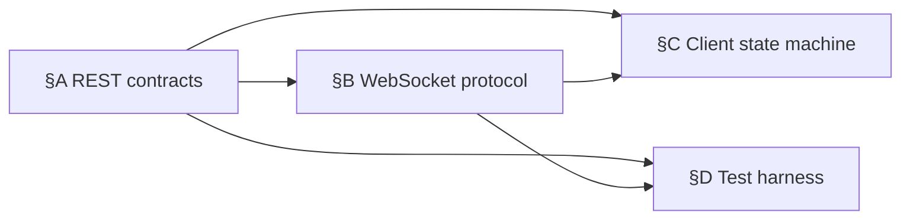

# Cascaded Plan-Review — Input Spec

**Purpose**: the canonical specification of what shape a planning document must have for the cascaded plan-review pipeline (`/plan-review-cascaded`) to ingest it. **Your planner output is the cascade's input** — this doc tells you what the cascade expects.

**Audience**:
- **Planners** (Authors of plans destined for cascaded review) — read §3 ("What the planner must deliver")
- **Managers** (running the cascade Step 0 light-review) — read §4 + §5
- **Workflow Stewards** — read all

**Status**: v1.0 (2026-05-28). Promoted from `src/rnd/2026.05.22-cascade-readiness-in-p-is-p-docs.md` §4 (the contract ratified by Mr Radio 🦉, Run 5 Manager, 2026-05-22) into a canonical workflow-doc home.

---

## §1 Why this doc exists

The cascaded plan-review pipeline (`/plan-review-cascaded`) ingests a planning document and farms its sections out to three concurrent reviewers (Usability/Reuse, Viability/Gap, Ownership-Language Audit). For the pipeline to fire cleanly, the planning document must have a specific shape. If it doesn't, the cascade's **Step 0 (Cascade Preparation)** has to reshape it — costing Manager revision turns and potentially user attention.

The cheapest remediation is the one you avoid by producing a cascade-ready output **upstream**, during planning. This doc is the specification of that target shape.

**The two-layer contract** (Mr Radio's §4 split):

- **§2a Planner-pre-satisfiable** — 4 properties the planner can produce directly. PUSH these upstream into the planning workflow.
- **§2b Intrinsically Step-0** — 2 properties the Manager produces from the planner's sliceable breakdown. KEEP cascade-side.

A planner can satisfy §2a fully and never see §2b. The Manager handles §2b at Step 0.

---

## §2 The contract

### §2a — Planner-pre-satisfiable (PUSH upstream)

| # | Property | Gate type | Why it matters |
|---|---|---|---|
| 1 | **≥ 2 sections** | HARD gate | `prototype_scope < 2` is refused unless user explicitly overrides. A single-section plan cannot be cascaded — there is no pipeline. (`plan-review-cascaded.md:11`/`:102`; `plan-review-cascaded-common.md:113`) |
| 2 | **Section independence** | HARD gate (load-bearing) | Each section must be reviewable without loading sibling sections. This is what enables three reviewers to work different sections concurrently. The **cold-reviewer test**: can a reviewer who has loaded only one section + the shared anchors produce a complete, correct review? If no, the section is not independent. (`section_sizing_heuristic = independence_criterion`, `plan-review-cascaded-defaults.md:152`) |
| 3 | **Explicit, minimal, acyclic cross-section dependencies** | HARD gate (valid DAG required) | Dependencies are inevitable; make them explicit. Document both directions — which section *provides* and which *consumes*. The dependency set must form a valid **DAG** — a cycle has no valid topological order, so the cascade pipeline cannot be built. |
| 4 | **Comparable section scope** | SOFT preference (not a gate) | Roughly comparable section size improves *pipelined* throughput — the slowest section is the pipeline bottleneck. The cascade does not refuse uneven sections; treat as a nice-to-have. |

### §2b — Intrinsically Step-0 (KEEP cascade-side)

| # | Property | Who produces it |
|---|---|---|
| 1 | **Formal slicing manifest + Q-decision matrix** | Manager at Step 0, from the planner's sliceable breakdown. (Both review AND authoring cascades produce these — Mr Radio's correction: an earlier draft tagged them authoring-only; Run 5, a pure-review cascade, produced both.) |
| 2 | **Pre-cascade Recon checklist assembly** | Manager at Step 0. The checklist is assembled by Step 0; the planning doc need only surface its project context legibly. **Run-5 lesson (PG-5)**: mandates cited in Recon must have **scope-applicability verified** — Run 5 cited the Lupin-wide 100%-coverage mandate without checking that `HeartbeatPokerJob` lived in the then-separate CoSA sub-repo (mandate-excluded at the time; post-2026-05-29 merge CoSA inherits the gate — the verify-scope principle stands regardless). |

A planner produces a *sliceable* breakdown plus project-context legibility. The Manager turns that into §2b. Do not attempt §2b at planning time — it depends on cascade-internal configuration.

---

## §3 What the planner must deliver (the "Expected Output Shape" view)

This is §2a restated as a planner-facing checklist. Tick each off before submitting your plan to the cascade.

### ✓ Property 1 — ≥ 2 sections

**Definition**: the work breakdown decomposes the work into ≥ 2 review sections. A section is a coherent group of phases/tasks — coarser than a single task, finer than the whole plan.

**Why it matters**: a single-section plan cannot be pipelined. The cascade's value proposition depends on three reviewers working different sections concurrently; with one section, there's nothing to parallelize.

**How to test before submission**: count your sections. If the count is < 2, you have a candidate plan for serial `/plan-review` (not `/plan-review-cascaded`) — or you need to re-decompose.

**How to produce it**: see `workflow/p-is-p-01-planning-the-work.md` §Cascade-Readiness — guidance on decomposing into review sections.

### ✓ Property 2 — Section independence

**Definition**: each section is reviewable without loading sibling-section prose. Required reading per section: the section itself + shared anchors (decision log; `00-index.md` if a doc-set).

**Why it matters**: this is the load-bearing property. Without it, "Stage 2 reviewer working Section B" and "Stage 1 reviewer working Section A" cannot proceed concurrently — Stage 2 would need to wait for Stage 1 to finish on A so they could load A's prose into B's context. Independence is what enables steady-state parallelism.

**How to test before submission** (the **cold-reviewer test**): pick any one of your sections. Hand it (only it, plus the shared anchors) to a reviewer. Can they produce a complete, correct review without reading any other section? If yes, the section is independent. If no, either:
- Fold the shared dependency into Property 3 (explicit cross-section dependency), OR
- Re-cut the section boundary

**How to produce it**: see `workflow/p-is-p-01-planning-the-work.md` §Cascade-Readiness.

### ✓ Property 3 — Explicit, minimal, acyclic cross-section dependencies

**Definition**: the cross-section dependency graph is a valid DAG. Every dependency is explicitly stated (both provider and consumer direction). The set is minimal — only dependencies that genuinely exist.

**Why it matters**: dependencies determine the section ordering for the cascade pipeline. A cycle means no valid topological order exists; the pipeline cannot be built.

**How to test before submission**:
1. List every cross-section dependency. Format: "Section §X provides ⟨thing⟩; Section §Y consumes ⟨thing⟩."
2. Draw the dependency graph (mentally or on paper).
3. Topologically sort it. If a topological sort exists, you have a valid DAG. If you hit a cycle, break it (merge the two cyclic sections, or re-cut the boundary) before submission.

**How to produce it**: see `workflow/p-is-p-01-planning-the-work.md` §Cascade-Readiness — includes a mermaid DAG example.

### ✓ Property 4 — Comparable section scope (soft preference)

**Definition**: your sections are roughly comparable in size — measured by phases, tasks, or estimated implementation hours.

**Why it matters**: at the pipeline limit, the slowest section is the bottleneck. If §D is 5× the size of §A, your pipeline wall-clock is gated by §D not §A.

**How to test before submission**: order your sections by estimated size. If the largest is > 2× the smallest, consider re-cutting.

**Soft, not hard**: the cascade will run with uneven sections. This is a throughput optimization, not a gate.

---

## §4 Validation gate — Step 0 light-review 6-criterion rubric

After the planner submits a plan to the cascade, the **Step 0 light-review** runs as the validation gate. Performed by **RECYCLED Persona 4** (Stage 2 Viability/Gap reviewer; see `plan-review-cascaded-stage-specs.md` §0 Cast Manifest — no new persona allocated for the light-review).

**The 6 criteria** (from `plan-review-cascaded-common.md` §Step 0 light-review rubric):

| # | Criterion | What it tests | Maps to §3 property |
|---|---|---|---|
| 1 | **Slice independence check** | Each slice's "independence" claim holds; cross-slice dependencies are explicit in both directions | Property 2 |
| 2 | **Q-decision completeness check** | Every Q has a PROPOSED stance + alternatives + recommendation; no hidden conditionals | (§2b — Manager) |
| 3 | **Recon item resolvability check** | Every Recon item names where the verification happens (code-write, integration test, manual recon). **PG-5 caveat**: mandates have scope-applicability verified against the design's actual code location | (§2b — Manager, with PG-5 lesson) |
| 4 | **Source citation check** | Every requirement traces back to either the raw design doc or a pre-existing R&D doc (no "magic" requirements without provenance) | Planner discipline |
| 5 | **Sequencing soundness check** | Recommended order respects all stated cross-slice dependencies (no cycles; no out-of-order dependencies) | Property 3 |
| 6 | **Author-onboarding completeness check** | Standing memory guidance applicable to the slice is listed in the §6 pre-cascade Recon checklist | (§2b — Manager) |

**Output**: thumbs-up OR list of specific Step 0 gaps. Posted as `kind: "step_0_light_review"` to the cascade's parent topic.

**Cost**: ~15-20 min reviewer-time.

---

## §5 Remediation flowchart — what happens when the plan fails the gate

```
                    Planning doc submitted
                              │
                              ▼
              ┌─────────────────────────────────┐
              │  Step 0 light-review            │
              │  by RECYCLED Persona 4          │
              │  (Stage 2 Viability/Gap rev)    │
              │  6-criterion rubric, ~15-20 min │
              └────────────────┬────────────────┘
                               │
                       ┌───────┴────────┐
                       │                │
                       ▼                ▼
                     PASS         FAIL (1+ criterion gap)
                       │                │
                       │                ▼
                       │     ┌─────────────────────────────┐
                       │     │  Manager addresses gaps     │
                       │     │  • Cast Manifest fix        │
                       │     │  • Slicing refinement       │
                       │     │  • Recon enrichment         │
                       │     │  • Q-decision tightening    │
                       │     │  • Source-citation backfill │
                       │     │  (1-revision-turn cap)      │
                       │     └─────────────┬───────────────┘
                       │                   │
                       │                   ▼
                       │       ┌─────────────────────────┐
                       │       │  Re-test 6-criterion    │
                       │       │  rubric                 │
                       │       └─────────────┬───────────┘
                       │                     │
                       │              ┌──────┴──────┐
                       │              │             │
                       │              ▼             ▼
                       │            PASS      STILL FAIL
                       │              │             │
                       │              │             ▼
                       │              │   ┌─────────────────────────┐
                       │              │   │  ESCALATE TO USER       │
                       │              │   │  • Deeper prep-quality  │
                       │              │   │    issue indicated      │
                       │              │   │  • User decides:        │
                       │              │   │    - Restructure plan   │
                       │              │   │      (back to planner)  │
                       │              │   │    - Postpone cascade   │
                       │              │   │    - Override + proceed │
                       │              │   │      (rare)             │
                       │              │   └─────────────┬───────────┘
                       │              │                 │
                       ▼              ▼                 ▼
                  ╔═══════════════════════════════════════╗
                  ║   cascade_input_ready state achieved  ║
                  ║         (Step 1 fires)                ║
                  ╚═══════════════════════════════════════╝
```

### §5.1 The cost of remediation vs upstream prevention

| Path | Manager cost | User cost |
|---|---|---|
| Plan arrives spec-compliant → PASS first try | 0 revision turns | 0 attention units |
| Plan arrives with 1-2 gaps → Manager fixes (1 turn) → PASS | 1 revision turn (~15-30 min) | 0 attention units |
| Plan arrives with severe gaps → STILL FAIL → escalation | 1 revision turn + escalation overhead | 1-2 attention units |

**The cheapest remediation is the one you avoid by satisfying the spec upstream.** A planning doc that arrives cascade-ready costs zero Manager revision turns and zero user attention. The Cascade-Readiness guidance in `workflow/p-is-p-01-planning-the-work.md` §Phase 3 is the upstream mechanism.

---

## §6 Worked example — the cascade-notif-sync planning output

Anchored to the 2026-05-22 `cascade-notif-sync` Run (Tiffany 💍's lupin-mobile notification-client-sync plan; closed shippable; 25 findings, 0 foundational, 0 user-escalated).

### §6.1 Cast Manifest (at the TOP of the planning doc)

```
| Role | Persona | Recycled? |
|---|---|---|
| Author | Tiffany 💍 | — |
| Manager | Mr. Radio 🦉 | — |
| Stage 1 Reviewer (Usability/Reuse) | Tiberius 🌑 | — |
| Stage 2 Reviewer (Viability/Gap) | Krishna 🦚 | ✓ Also Step 0 light-review |
| Stage 3 Reviewer (Ownership-Language) | Sam 🎙️ | — |
| Step 0 light-reviewer | Krishna 🦚 (Persona 4 recycled) | RECYCLED |
| Step 9 light-reviewer | TBD at Step 8 — most-impacted-section reviewer | RECYCLED |
| Workflow Steward (optional) | María 🌸 | Stood by; not invoked |
| Heartbeat Scheduler | external daemon | — |
```

### §6.2 Sections (Property 1: ≥ 2 sections — PASS, 4 sections)

- **§A — REST endpoint contracts**: sync poll endpoint + ack endpoint; payload shapes; auth flow
- **§B — WebSocket protocol**: push payload schema; delivery-confirm; reconnect semantics
- **§C — Client state machine**: Redux store shape; retry queue; offline-online transitions
- **§D — Test harness**: live-capture REST tests; WS probe; integration smoke

### §6.3 Independence claims (Property 2 — cold-reviewer test)

Each section claims independence and self-tests:

- **§A**: reviewable knowing only the public REST contract format + the project's standing endpoint conventions. PASS.
- **§B**: reviewable knowing only the public WebSocket protocol shape + the project's commons-bus conventions. PASS.
- **§C**: reviewable knowing only the client-state-machine pattern + Redux conventions. PASS.
- **§D**: reviewable knowing only test-harness conventions + the project's test-venue routing. PASS.

### §6.4 Cross-section dependencies (Property 3 — DAG)



Topological order exists: §A → §B → §C, §D (parallel after §B). Valid DAG. PASS.

### §6.5 Comparable section scope (Property 4 — soft)

Estimated implementation hours: §A 3h / §B 3h / §C 4h / §D 2h. Largest-smallest ratio = 2.0×. Within tolerance.

### §6.6 Self-test scoreboard

| Step 0 light-review criterion | Result |
|---|---|
| 1. Slice independence check | ✓ PASS |
| 2. Q-decision completeness check | ✓ PASS |
| 3. Recon item resolvability check (PG-5 scope verification) | ✓ PASS |
| 4. Source citation check | ✓ PASS |
| 5. Sequencing soundness check (DAG) | ✓ PASS |
| 6. Author-onboarding completeness check | ✓ PASS |

**Verdict**: 6/6 PASS at submission. Zero Manager revision turns. Step 1 fires immediately. (Actual `cascade-notif-sync` outcome: 25 findings across the run, 0 foundational, 0 user-escalated — the plan was that well-shaped at submission.)

---

## §7 Cross-References

### Upstream — how to produce spec-compliant output

- **`workflow/p-is-p-00-start-here.md`** — Decision Matrix entry for /plan-review-cascaded with the 4-property summary + pointer here
- **`workflow/p-is-p-01-planning-the-work.md` §Phase 3 §Cascade-Readiness** — production-side how-to with mermaid DAG example
- **`workflow/p-is-p-02-documenting-the-implementation.md` §Structuring for Cascaded Review** — doc-set-version of the section independence property

### Downstream — how the cascade ingests it

- **`workflow/plan-review-cascaded-stage-specs.md` §0 Cast Manifest** — the cast roster template that lives at the top of the planning doc
- **`workflow/plan-review-cascaded-common.md` §Step 0** — the canonical Step 0 light-review rubric (this doc lifts and reframes for planner-side audience)
- **`workflow/plan-review-cascaded-parallelism.md`** — the parallelism mechanics + 4-section worked example
- **`workflow/plan-review-cascaded.md` §Step 0** — the review-cascade Step 0 prose
- **`workflow/plan-authoring-cascaded.md` §Step 0** — the authoring-cascade sibling (same spec applies; authoring-cascade produces additional §2b artifacts at Step 0.3 + 0.4)

### Empirical anchors

- **`src/rnd/2026.05.22-cascade-readiness-in-p-is-p-docs.md` §4** — the original Mr Radio-ratified spec from which this doc is promoted
- **`src/rnd/2026.05.22-cascade-notif-sync-post-game.md`** — the cascade-notif-sync Run that anchors §6 worked example
- **`src/rnd/2026.05.22-run-5-serial-vs-parallel-root-cause.md`** — the PG-5 root-cause analysis that informs the Recon scope-applicability lesson in §4 criterion 3
- **`src/rnd/2026.05.22-cascade-run-5-observer-log-post-game.md`** — the Run 5 observer log + post-game

---

## §8 Version History

- **v1.0 (2026-05-28)** — Initial promotion from `src/rnd/2026.05.22-cascade-readiness-in-p-is-p-docs.md` §4 (Mr Radio-ratified contract) into a canonical workflow-doc home. Adds §3 planner-facing checklist view, §4 validation rubric (lifted from common.md §Step 0), §5 remediation flowchart, §6 cascade-notif-sync worked example. Authored by María 🌸 (Workflow Steward — planner + facilitator + observer) at Rick's voice-msg request.
