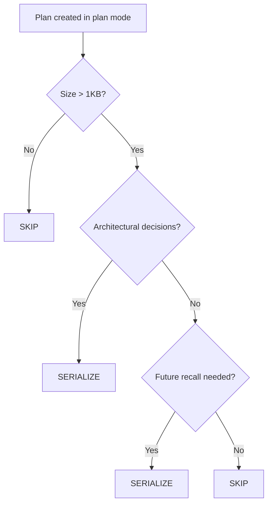

# Plan File Serialization

**Purpose**: Preserve non-trivial Claude Code plan files with semantic names for cross-session recall.

**When to Use**: After plan mode produces a substantive plan (>1KB, architectural decisions, multi-step implementation).

**Entry Point**: Behavioral directive (no slash command — this is a practice, not a procedure).

---

## The Problem

Claude Code stores plan files in `~/.claude/plans/` using randomly generated names following an `[adjective]-[gerund]-[noun].md` pattern. The names have **zero semantic correlation** to the plan content:

| Random Name | Actual Content |
|-------------|---------------|
| `dreamy-wiggling-pretzel.md` | User-visible args whitelist for runtime argument expeditor |
| `transient-bouncing-widget.md` | Unified smoke test framework verification plan |
| `gleaming-gathering-gem.md` | Notification API reference documentation |
| `compiled-popping-hamming.md` | CS pioneer name suggests nothing about content |
| `elegant-cuddling-wave.md` | Session-end workflow redesign plan |
| `dynamic-sleeping-hummingbird.md` | Database migration strategy |

### Scale of the Problem

After 31 days of usage (as of 2026.02.13):

| Metric | Value |
|--------|-------|
| Total plan files | 169 |
| Total size | 1.6 MB |
| Daily creation rate | ~5.4 files/day |
| Searchability | Zero (random names) |
| Cross-session recall | Impossible without reading each file |

### Naming Convention Analysis

The Claude Code naming scheme uses three word categories:

| Position | Category | Examples |
|----------|----------|----------|
| 1st | Adjective | dreamy, elegant, composed, cached, dynamic |
| 2nd | Gerund (-ing) | wiggling, cuddling, bouncing, sleeping, toasting |
| 3rd | Noun | pretzel, wave, widget, hummingbird, kazoo |

Some nouns reference CS pioneers (hamming, abelson, stroustrup, papert, hollerith), but even these carry no semantic meaning about plan content.

### The Existing Ad-Hoc Pattern

Important plans are already being manually copied to project `src/rnd/` directories with semantic names:

```
~/.claude/plans/gleaming-dazzling-mountain.md
  → src/rnd/2026.01.05-cosa-voice-mcp-migration-plan.md
```

One plan even had an explicit "Step 0: Archive This Plan to R&D" section. This workflow formalizes that organic pattern.

---

## The Directive

**MANDATE**: After plan mode produces a non-trivial plan, serialize it to the project's `src/rnd/` directory with a semantic name.

### Naming Format

```
yyyy.mm.dd-descriptive-slug.md
```

- **Date prefix**: `yyyy.mm.dd` (matches project research document convention)
- **Descriptive slug**: 3-6 hyphenated words capturing the plan's **SUBJECT**, not random words
- **Extension**: `.md` (markdown)

### Serialization Examples

| Claude Code Name | Serialized Name |
|-----------------|-----------------|
| `dreamy-wiggling-pretzel.md` | `2026.02.07-runtime-args-whitelist-expeditor.md` |
| `transient-bouncing-widget.md` | `2026.02.13-unified-smoke-test-verification.md` |
| `gleaming-gathering-gem.md` | `2026.02.13-notification-api-reference-doc.md` |
| `elegant-cuddling-wave.md` | `2026.02.10-session-end-workflow-redesign.md` |
| `dynamic-sleeping-hummingbird.md` | `2026.02.11-database-migration-strategy.md` |

---

## Decision Criteria: When to Serialize

### Serialize (Yes)

| Criterion | Explanation |
|-----------|-------------|
| Architectural decisions | Plan involved design choices affecting system structure |
| Extended development time | Plan took >30 minutes to develop through iterative refinement |
| Cross-session recall needed | Plan will be referenced in future sessions |
| Multi-step implementation | Plan breaks down into phases or ordered steps |
| Novel approach | Plan documents a new pattern or technique |

### Skip (No)

| Criterion | Explanation |
|-----------|-------------|
| Trivial fix | Plan was for a typo, one-line change, or simple rename |
| Small size | Plan is <1KB (likely just a quick task list) |
| Abandoned/superseded | Plan was replaced by a better approach |
| Session-specific | Plan is only relevant to the current session |

### Quick Decision Flowchart



---

## Serialization Patterns

### Pattern A: Proactive (During Planning)

Add a "Step 0: Archive to R&D" at the beginning of the plan itself:

```markdown
## Step 0: Archive This Plan

Serialize this plan to:
  <project>/src/rnd/yyyy.mm.dd-descriptive-slug.md
```

**When to use**: When you know during planning that the plan is significant.

### Pattern B: Reactive (During Session-End)

During the session-end workflow, check if plan mode was used and prompt for serialization:

```
Session used plan mode → Was the plan non-trivial?
  → Yes: Copy to src/rnd/ with semantic name
  → No: Skip
```

**When to use**: Default pattern for most sessions.

### Pattern C: In-Plan Context (Self-Documenting)

Include the serialization destination in the plan's own Context section:

```markdown
## Context

**Plan file**: ~/.claude/plans/dreamy-wiggling-pretzel.md
**Serialized to**: src/rnd/2026.02.07-runtime-args-whitelist-expeditor.md
```

**When to use**: When you want the plan to be self-referencing.

---

## Integration Points

### Session-End Workflow

Add a check during session-end (after history.md update, before commit):

```
Check: Did this session use plan mode?
  → Yes: Was the plan non-trivial (>1KB, architectural)?
    → Yes: Prompt to serialize
    → No: Skip
  → No: Skip
```

### history.md

When a plan is serialized, reference the file path in the session entry:

```markdown
- Designed runtime args whitelist expeditor
  - Plan: src/rnd/2026.02.07-runtime-args-whitelist-expeditor.md
```

### README.md

When adding a new R&D document, add a link in the project's README if an R&D section exists.

---

## Naming Convention Reference

### Claude Code Format (Non-Semantic)

```
[adjective]-[gerund]-[noun].md
```

- Generated randomly at plan creation
- No correlation to plan content
- Cannot be searched by topic
- Examples: `dreamy-wiggling-pretzel.md`, `compiled-popping-hamming.md`

### Serialized Format (Semantic)

```
yyyy.mm.dd-[subject]-[qualifier].md
```

- Date of plan creation or serialization
- 3-6 hyphenated words describing the plan's subject
- Searchable by topic, date, or keyword
- Examples: `2026.02.07-runtime-args-whitelist-expeditor.md`

### Slug Writing Guidelines

| Guideline | Good | Bad |
|-----------|------|-----|
| Capture the subject | `database-migration-strategy` | `plan-for-stuff` |
| Be specific | `cosa-voice-mcp-migration` | `notification-changes` |
| Use 3-6 words | `session-end-workflow-redesign` | `redesign` |
| Avoid filler | `smoke-test-verification` | `plan-for-smoke-test-verification-work` |

---

## Anti-Patterns

- **Don't serialize tiny plans** (<1KB) — they clutter the R&D directory
- **Don't serialize abandoned plans** — they create confusion about current approaches
- **Don't use the random Claude Code name** as the serialized name
- **Don't forget the date prefix** — it enables chronological browsing
- **Don't skip the README link** — R&D documents should be discoverable
- **Don't duplicate the plan** if it's already been superseded by implementation

---

## Version History

- **v1.0** (2026.02.13): Initial recommendation based on 169-file analysis of `~/.claude/plans/`
