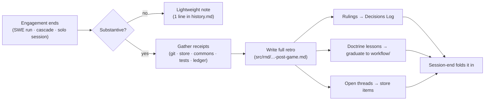

# Post-Game (canonical workflow)

**Purpose**: Canonize the **post-game** — the scaled retrospective that turns a just-finished engagement into durable learning — as a **first-class, standalone artifact** instead of a step buried inside other workflows. One ritual, one shape, runnable after **any** substantive engagement: a plan-review cascade, a SWE-crew run, or a solo session. The post-game is how the Workflow Steward catches drift/confabulation, harvests lessons, and feeds rulings back into doctrine.

**When to use**:
- **Always, scaled, after a SWE-crew run** — every cycle (the `swe-team-spin-up.md` §5 "always post-game, scaled" gate points here).
- **As cascade Stage 9** — the cascaded plan-review's post-game synthesis (`plan-review-cascaded-stage-specs.md` Stage 9 points here).
- **After a substantive solo session** — a design session, a bug-fix run, a tricky investigation: anything with lessons worth keeping.
- **On demand** — when the user (or a manager) asks for "the post-game," "a retro," or "the debrief."

**When NOT to use**: a trivial change with no lesson (a typo fix, a one-line doc tweak). For those, the *lightweight note* tier (one line in `history.md`) IS the post-game — see §3.

**Status**: ✅ v1.0 (2026-06-29, María 🌸 Workflow Steward) — extracted from the embedded post-game rules (`swe-team-spin-up.md` §5 + `swe-team-roles.md` §Steward + cascade Stage 9) into a first-class standalone workflow. **5 design decisions ratified by Rick (2026-06-29, guided walkthrough) — see §0.** Companion `/plan-post-game` command + auto-activating skill. HELD for commit.

**Relationship to other workflows**:
- **SWE-Team Spin-Up** (`swe-team-spin-up.md`): §5 mandates "always post-game, scaled" every cycle — this doc is the *how*. The SWE lifecycle's final `PG` node IS a run of this workflow.
- **Cascaded Plan-Review** (`plan-review-cascaded*.md`): Stage 9 names "post-game synthesis (Workflow Steward-led)" as a deliverable — this doc is the *how* for that stage.
- **Session-End** (`session-end.md`): a post-game is NOT the session-end ritual. Session-end commits/updates tracking docs; the post-game extracts *lessons*. A substantive session runs the post-game **first**, then folds its rulings into the session-end's Decisions-Log + history updates.
- **Decisions Log / TODO.md**: the post-game's *rulings* land in the TODO.md Decisions Log; doctrine-grade lessons **graduate** into a `workflow/` doc (the post-game records the pointer).

---

## 0. Ratified design decisions (Rick, 2026-06-29 guided walkthrough)

1. **Auto-trigger** — the post-game **auto-fires** at SWE-crew teardown + cascade Stage 9 (both already name it a step); solo / ad-hoc sessions run it **manually** (`/plan-post-game` or "let's debrief / post game"). Not auto-fired on every substantive session — too noisy.
2. **Scaling threshold** — full-vs-light tips on a **lesson-test**: a **full retro** if it's a SWE-crew run / cascade / multi-decision design session **OR** the run produced ≥1 ruling, caught a drift/confabulation, or surfaced a new failure mode; else a **one-line note**. (§2)
3. **Solo ownership** — with no Steward, **the session runs its own post-game** — BUT it **MUST surface a self-report to the user and get the user's approval *before* documenting it**. This human check is what covers the self-review blind spot. (§1)
4. **Session-end ordering** — **post-game first, then session-end folds its rulings in**; two distinct, sequenced rituals (the post-game also fires at non-session-end points — teardown, Stage 9 — so they can't merge). (§Relationship, §6)
5. **Receipts bar** — the cite-or-`UNVERIFIED` rule is **hard for every factual "what happened" line AND every ruling**, and **exempt for subjective analysis** (the "why it went right/wrong" judgment). (§1)

---

## 1. What a post-game is (and is not)

A post-game is a **retrospective on a just-finished engagement**, owned by the **Workflow Steward** — or, in a solo session with no Steward, **by the session itself, which runs its own post-game** (D3). **Solo gate (D3):** a self-run post-game MUST surface its self-report to the user and get the user's approval *before* it is documented — the human check that covers the self-review blind spot. It answers four questions:

1. **What happened?** — a receipt-backed account of the run (not a claim-based one).
2. **What went right / wrong?** — process wins to keep, drift/confabulation/stalls to fix.
3. **What do we change?** — concrete rulings, each with an owner and a destination.
4. **What's still open?** — unresolved threads carried forward to TODO.md / the store.

It is **NOT**: a status report (that's a notify), a commit (that's session-end), a plan (that's `/p-is-p-01-planning`), or a review of the *artifact* (that's `/plan-review`). The post-game reviews the *process and the run*, and harvests lessons.

**No-confabulation is the spine** (the Steward's enforcement specialty): every "what happened" line cites a **primary evidence artifact** — a commit SHA, a task-store transition, a commons/DM entry, a test-run id, a log line — or is explicitly marked *unverified*. A post-game built from memory of the spec, not receipts of the run, is the exact anti-pattern this ritual exists to prevent. **Receipts bar (D5):** the cite-or-`UNVERIFIED` rule is **hard for every factual "what happened" line AND every ruling**; subjective analysis (the "why it went right/wrong" interpretation in §2/§3) is **exempt** — that's judgment, not a claimed fact, and fake citations on opinions help no one.

---

## 2. Scaling — full retro vs lightweight note

The post-game **always runs**, but its weight scales to the engagement. **The objective tipping test (D2):** a run earns a **full retro** if it's a SWE-crew run / cascade / multi-decision design session, **OR** if it produced ≥1 ruling, caught a drift/confabulation, or hit a new failure mode. Otherwise — a trivial change with genuinely no lesson — a **lightweight note** suffices.

| Tier | When (D2 lesson-test) | Output |
|---|---|---|
| **Full retro** | SWE-crew run · cascade · multi-decision design session · non-trivial bug-fix — **OR** any run that produced a ruling / caught a drift-or-confabulation / surfaced a new failure mode | A dated doc `src/rnd/yyyy.mm.dd-<slug>-post-game.md` (§4 template) + rulings to Decisions Log |
| **Lightweight note** | Trivial change, genuinely no lesson (typo, one-line tweak) | One line in `history.md` — *"<what>; no lessons."* No doc. |

**Trigger (D1):** the post-game **auto-fires** at the two heavy ritual points where it's already a defined step — **SWE-crew teardown** and **cascade Stage 9**. Solo / ad-hoc sessions invoke it **manually** (`/plan-post-game` or "let's debrief / post game"). "Always-on, scaled" — never "on-demand" for substantive work — because the standing post-game is how drift and confabulation get caught at all. Skipping it on a substantive run is a workflow bug.

---

## 3. Inputs — the receipts the post-game is built from

Gather these **before** writing (they are the evidence base; pull them, don't recall them):

- **Git** — `git log` for the engagement window: commits, authors, SHAs.
- **Task store** — `task_query` for the items the run touched: what closed (with receipts), what's still open, what blocked.
- **Commons / DM** — the coordination trail: `commons_read` on the run's topics + relevant `dm_*` threads (handoffs, verdicts, stalls).
- **Observer ledger** (if a Steward watched live) — the drift/confabulation/stall notes captured *during* the run.
- **Test results** — the pass/fail tables from the run's tiers.
- **The governing doc** — the plan/spec/R&D doc the engagement was driving.

---

## 4. The full-retro template

Write to `src/rnd/yyyy.mm.dd-<slug>-post-game.md`:

```markdown
# Post-Game: <engagement name> (yyyy.mm.dd)

**Engagement**: <SWE-crew run | cascade review | solo session> — <one-line scope>
**Steward**: <persona>   **Window**: <start → end>   **Governing doc**: <path>

## 1. What happened (receipt-backed)
- <event> — <receipt: commit SHA | task-id transition | qid | test-run | log line>
- ... (every line carries a receipt or is marked UNVERIFIED)

## 2. What went right (keep)
- <process win> — why it worked; whether it should graduate to doctrine.

## 3. What went wrong (fix)
- <drift / confabulation / stall / scope-creep> — root cause; the receipt that exposed it.

## 4. Rulings (each: owner + destination)
- <ruling> | owner: <persona> | → <Decisions Log | workflow/<doc> graduation | store task-id>

## 5. Open threads (carried forward)
- <unresolved> → TODO.md / store item <id>

## 6. Lessons for the failure-mode catalog (if any)
- <named failure mode> — trigger, symptom, the guard that would have caught it.
```

Keep it tight: receipts over prose, rulings over rumination.

---

## 5. Outputs — where the post-game's product goes

A post-game **produces movement**, not just a document:

1. **The dated doc** lands in `src/rnd/` (full retro) or **one line** in `history.md` (lightweight).
2. **Rulings → TODO.md Decisions Log** (the durable "why"), each dated and attributed.
3. **Doctrine-grade lessons → graduate into a `workflow/` doc** — the post-game records the pointer (the §"Status" / version-history note in the target doc cites the post-game as its seed). This is how past post-games (`cascade-notif-sync` §2.1–2.4, the SWE first-run post-game) became standing rules.
4. **Open threads → a store item** (`task_create`) so they stay live and owed, not stranded in prose.
5. **New failure modes → the failure-mode catalog** the Steward enforces against next time.

---

## 6. Lifecycle



---

## 7. Anti-patterns (the post-game exists to kill these)

- **Confabulated history** — narrating the run from the spec/plan instead of the receipts. Every line needs a primary artifact or an UNVERIFIED tag.
- **Skipping it on a substantive run** — "the run went fine, no retro needed" is how drift compounds silently.
- **Rumination without rulings** — a post-game that lists feelings but mints no owned, destined changes produced nothing.
- **Orphaned lessons** — a good lesson written only into the post-game doc and never graduated to a `workflow/` doc or the Decisions Log evaporates by the next `/clear`.
- **Open threads left in prose** — an unresolved thread that doesn't become a store item is invisible to the work-owed oracle.

---

## Version history

- **1.0 (2026-06-29, María 🌸 — Rick-ratified)** — 5 design decisions ruled via guided walkthrough (§0): D1 auto-trigger at SWE-teardown + cascade Stage-9 (solo = manual); D2 lesson-test scaling threshold; D3 solo self-run WITH a mandatory self-report → user-approval gate before documenting; D4 post-game-first then session-end folds in; D5 receipts bar hard-on-facts-and-rulings, exempt-analysis. Folded into §0/§1/§2. HELD for commit.
- **0.1 (2026-06-29)** — Initial canonical draft, authored by María 🌸 (Workflow Steward) at Rick's request, extracting the post-game from where it lived embedded (`swe-team-spin-up.md` §5 "always post-game, scaled" + `swe-team-roles.md` §Steward items 4/7 + cascade Stage 9) into a first-class standalone workflow runnable after any engagement. Companion `/plan-post-game` command. **HELD for Rick's review.**
