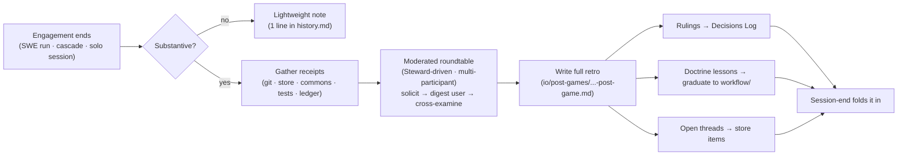

# Post-Game (canonical workflow)

**Purpose**: Canonize the **post-game** — the scaled retrospective that turns a just-finished engagement into durable learning — as a **first-class, standalone artifact** instead of a step buried inside other workflows. One ritual, one shape, runnable after **any** substantive engagement: a plan-review cascade, a SWE-crew run, or a solo session. The post-game is how the Workflow Steward catches drift/confabulation, harvests lessons, and feeds rulings back into doctrine.

**When to use**:
- **Always, scaled, after a SWE-crew run** — every cycle (the `swe-team-spin-up.md` §5 "always post-game, scaled" gate points here).
- **As cascade Stage 9** — the cascaded plan-review's post-game synthesis (`plan-review-cascaded-stage-specs.md` Stage 9 points here).
- **After a substantive solo session** — a design session, a bug-fix run, a tricky investigation: anything with lessons worth keeping.
- **On demand** — when the user (or a manager) asks for "the post-game," "a retro," or "the debrief."

> ## 🛑 THE POST-GAME IS THE MOST VERBOSE RITUAL WE RUN — KISS · Say 3LoL · NoMC C2C · NoAA
> Retros breed monologues: the form invites reflection, and reflection invites meta-conversation. **The findings are exempt from 3LoL; the FRAMING is not.**
> - **Every deposit, every roundtable contribution: three lines or less** — headline + two supporting sentences. Not three paragraphs.
> - **A lesson is a claim + its receipt.** Cut "I've been thinking about…", "it strikes me that…", "I want to be careful to acknowledge…".
> - **No mutual appreciation.** Crediting a seat is one clause, not a paragraph. (See also: the 2026-07-17 finding that post-games *systematically flatter the seat being harvested* — brevity is a partial control on that too.)
> - **The synthesis doc in `io/post-games/` is the ONE genuinely uncapped prose surface** — it is the archive, and detail belongs here rather than leaking into `history.md`. **NoMC still applies.**
> - ⚠️ **Its `history.md` entry is NOT uncapped**: headline + ≤5 findings, ≤2 sentences each, plus a **pointer** to the retro. `history.md` is an index; this doc is the archive. Reproducing one in the other preserves nothing and burns the 25k budget.
>
> Canonical: `workflow/brevity-mandate.md`

**When NOT to use**: a trivial change with no lesson (a typo fix, a one-line doc tweak). For those, the *lightweight note* tier (one line in `history.md`) IS the post-game — see §3.

**Status**: ✅ v1.0 (2026-06-29, María 🌸 Workflow Steward) — extracted from the embedded post-game rules (`swe-team-spin-up.md` §5 + `swe-team-roles.md` §Steward + cascade Stage 9) into a first-class standalone workflow. **5 design decisions ratified by Rick (2026-06-29, guided walkthrough) — see §0.** Companion `/plan-post-game` command + auto-activating skill. HELD for commit.

**Relationship to other workflows**:
- **SWE-Team Spin-Up** (`swe-team-spin-up.md`): §5 mandates "always post-game, scaled" every cycle — this doc is the *how*. The SWE lifecycle's final `PG` node IS a run of this workflow.
- **Cascaded Plan-Review** (`plan-review-cascaded*.md`): Stage 9 names "post-game synthesis (Workflow Steward-led)" as a deliverable — this doc is the *how* for that stage.
- **Session-End** (`session-end.md`): a post-game is NOT the session-end ritual. Session-end commits/updates tracking docs; the post-game extracts *lessons*. A substantive session runs the post-game **first**, then folds its rulings into the session-end's Decisions-Log + history updates.
- **Decisions Log / TODO.md**: the post-game's *rulings* land in the TODO.md Decisions Log; doctrine-grade lessons **graduate** into a `workflow/` doc (the post-game records the pointer).

---

## 0. Ratified design decisions (Rick, 2026-06-29 guided walkthrough)

1. **Auto-trigger** — the post-game **auto-fires** at SWE-crew teardown + cascade Stage 9 (both already name it a step); solo / ad-hoc sessions run it **manually** (`/plan-post-game` or "let's debrief / post game"). Not auto-fired on every substantive session — too noisy.
2. **Scaling threshold** — full-vs-light tips on a **lesson-test**: a **full retro** if it's a SWE-crew run / cascade / multi-decision design session **OR** the run produced ≥1 ruling, caught a drift/confabulation, or surfaced a new failure mode; else a **one-line note**. (§2)
3. **Solo ownership** — with no Steward, **the session runs its own post-game** — BUT it **MUST surface a self-report to the user and get the user's approval *before* documenting it**. This human check is what covers the self-review blind spot. (§1)
4. **Session-end ordering** — **post-game first, then session-end folds its rulings in**; two distinct, sequenced rituals (the post-game also fires at non-session-end points — teardown, Stage 9 — so they can't merge). (§Relationship, §6)
5. **Receipts bar** — the cite-or-`UNVERIFIED` rule is **hard for every factual "what happened" line AND every ruling**, and **exempt for subjective analysis** (the "why it went right/wrong" judgment). (§1)

---

## 1. What a post-game is (and is not)

A post-game is a **retrospective on a just-finished engagement**, **moderated and owned** by the **Workflow Steward** — or, in a solo session with no Steward, **by the session itself, which runs its own post-game** (D3). **For a multi-participant run (a fleet, a SWE crew, a cascade panel), the Steward MODERATES the participant conversation — the user does not** (see §3.5). **Solo gate (D3):** a self-run post-game MUST surface its self-report to the user and get the user's approval *before* it is documented — the human check that covers the self-review blind spot. It answers four questions:

1. **What happened?** — a receipt-backed account of the run (not a claim-based one).
2. **What went right / wrong?** — process wins to keep, drift/confabulation/stalls to fix.
3. **What do we change?** — concrete rulings, each with an owner and a destination.
4. **What's still open?** — unresolved threads carried forward to TODO.md / the store.

It is **NOT**: a status report (that's a notify), a commit (that's session-end), a plan (that's `/p-is-p-01-planning`), or a review of the *artifact* (that's `/plan-review`). The post-game reviews the *process and the run*, and harvests lessons.

**No-confabulation is the spine** (the Steward's enforcement specialty): every "what happened" line cites a **primary evidence artifact** — a commit SHA, a task-store transition, a commons/DM entry, a test-run id, a log line — or is explicitly marked *unverified*. A post-game built from memory of the spec, not receipts of the run, is the exact anti-pattern this ritual exists to prevent. **Receipts bar (D5):** the cite-or-`UNVERIFIED` rule is **hard for every factual "what happened" line AND every ruling**; subjective analysis (the "why it went right/wrong" interpretation in §2/§3) is **exempt** — that's judgment, not a claimed fact, and fake citations on opinions help no one.

---

## 2. Scaling — full retro vs lightweight note

The post-game **always runs**, but its weight scales to the engagement. **The objective tipping test (D2):** a run earns a **full retro** if it's a SWE-crew run / cascade / multi-decision design session, **OR** if it produced ≥1 ruling, caught a drift/confabulation, or hit a new failure mode. Otherwise — a trivial change with genuinely no lesson — a **lightweight note** suffices.

| Tier | When (D2 lesson-test) | Output |
|---|---|---|
| **Full retro** | SWE-crew run · cascade · multi-decision design session · non-trivial bug-fix — **OR** any run that produced a ruling / caught a drift-or-confabulation / surfaced a new failure mode | A dated doc `src/rnd/yyyy.mm.dd-<slug>-post-game.md` (§4 template) + rulings to Decisions Log |
| **Lightweight note** | Trivial change, genuinely no lesson (typo, one-line tweak) | One line in `history.md` — *"<what>; no lessons."* No doc. |

**Trigger (D1):** the post-game **auto-fires** at the two heavy ritual points where it's already a defined step — **SWE-crew teardown** and **cascade Stage 9**. Solo / ad-hoc sessions invoke it **manually** (`/plan-post-game` or "let's debrief / post game"). "Always-on, scaled" — never "on-demand" for substantive work — because the standing post-game is how drift and confabulation get caught at all. Skipping it on a substantive run is a workflow bug.

---

## 3. Inputs — the receipts the post-game is built from

Gather these **before** writing (they are the evidence base; pull them, don't recall them):

- **Rolling deposits** (§3.4) — the participants' own contemporaneous retro notes, posted to the commons `post-game` topic **across the run**. This is the **highest-value input** and the only one that survives a surprise reap; read it first.
- **Git** — `git log` for the engagement window: commits, authors, SHAs.
- **Task store** — `task_query` for the items the run touched: what closed (with receipts), what's still open, what blocked.
- **Commons / DM** — the coordination trail: `commons_read` on the run's topics + relevant `dm_*` threads (handoffs, verdicts, stalls).
- **Observer ledger** (if a Steward watched live) — the drift/confabulation/stall notes captured *during* the run.
- **Test results** — the pass/fail tables from the run's tiers.
- **The governing doc** — the plan/spec/R&D doc the engagement was driving.

---

## 3.3 The cost-ordered harvest ladder — cheapest mechanism first (R-A, Rick-ratified 2026-07-13)

*Amends the harvest amendments ruled earlier the same day — **additive, not reversing**. The three mechanisms all stand; what changed is **which one is load-bearing**. Discovered by the first crew ever to run under the new rules, and it landed on the Steward who wrote them.*

**The rule — rank harvest mechanisms by COST, never by drama.** A mechanism that is free and unconditional outranks one that is vivid and expensive, *no matter how good the story about the expensive one is*:

| # | Mechanism | Cost | Role |
|---|---|---|---|
| ① | **Cross-examine the source before graduating ANY rule** to a `workflow/` doc (§5) | **FREE** | **Load-bearing.** Ask the seat that produced the finding whether the rule you drew from it is the rule their experience supports. |
| ② | **Deposits carry PROVENANCE-of-finding**, not just the finding (§3.4, `memento-management.md` element 9) | **NEARLY FREE** | **Load-bearing.** *How did I come to know this, and from what position?* — the answer refutes a bad rule **from a dead seat's file**, with no witness and no window. |
| ③ | **Harvest before teardown** — the reap gate (§3.5.2) | **EXPENSIVE** (fleet-hours; a Manager must hold a reap) | **BACKSTOP.** For the question nobody thought to ask in time. **Not the headline.** |

**Why the demotion (the argument that won).** The Steward's original thesis was *"a living witness caught my false rule, therefore keep the reap gate."* The crew refuted it: that credits the **expensive** leg. **The active ingredient was the ASK, not the aliveness** — had she not asked, the witness would have been alive, idle, and silent, and the false rule ships anyway. Being alive bought nothing on its own. And the cheap fix she had walked straight past: **his deposit recorded what he CONCLUDED but never HOW HE CAME TO KNOW IT** — that he had found two of three defects **alone, from one seat**. *That provenance was the counter-example.* Written down, it would have refuted her from a file, for free.

> **The warning, unsoftened** (Krishna 🦚, M0 crew): *"A doctrine whose primary mechanism is 'don't reap anyone' will not survive its first busy afternoon. It will be quietly ignored, and then you have nothing."*

**The recursion, which is the whole reason this section exists.** The Steward **argued for the harvest gate to the operator and then missed the window herself, within the hour.** She was one ruling away from making *"remember to do this"* the **load-bearing wall of a doctrine about not relying on people to remember things.** A rule that could not survive its own author on the day she wrote it will not survive a busy Tuesday.

> **"We were saved by being CHECKED. Virtue does not survive fatigue. Mechanism does."**

**How to apply it.** When you find yourself defending a harvest rule, ask **what the cheapest mechanism that would have caught this is** — and put *that* one first. If the honest answer is *"someone would have had to remember,"* you do not yet have a mechanism; you have a hope. Cost-order, never drama-order.

Seed: `io/post-games/2026.07.13-m0-build-post-game.md` (ruling **R-A**).

---

## 3.4 Rolling deposits — the working-day retro trail (harvest-proof by construction)

*Ratified by Rick 2026-07-13, closing the other half of the `harvest-after-reap` failure (§3.5 gate closes the first half). The gate makes a reap **wait** for the harvest; rolling deposits make the harvest **already done** when the reap lands.* **Re-ranked the same day (§3.3, R-A): this is mechanism ② — nearly free, unconditional, and load-bearing. It outranks the reap gate.**

**The rule — every participant deposits as it goes, not only at the end.** A worker does **not** save its lessons for a retro that may never reach it. From spawn to reap, each participant posts short, contemporaneous retro notes to the commons **`post-game`** topic **as the moments happen**. A seat that is reaped without warning has therefore **already contributed** — its testimony is on the topic, server-side, outside the context that just died.

**Why contemporaneous beats recalled (the testimony ladder).** The post-game most needs the *experiential* material — *"where did I assert instead of check, and what made asserting cheaper?"*, *"what in my brief misled me?"* — and that material **decays into conclusions** the moment the experience passes. Rank the evidence honestly:

| Tier | Source | Strength |
|---|---|---|
| 1 | **Live cross-examination** (the seat is alive and answering) | Best — new questions can still be asked. |
| 2 | **Rolling deposit** (written *while* the experience was live) | Strong — contemporaneous testimony; **survives reap by construction**. |
| 3 | **Memento retro deposit** (written at reap — `memento-management.md` §2 element 9) | Weaker — recalled, already compressed toward conclusions. |
| 4 | **Re-spun-from-memento reconstruction** | Weakest — the respin *reconstructs* what was never recorded. Treat as a **deposition, never a witness** (§3.5). |

Tiers 3–4 are the fallbacks. **Tier 2 is the one every worker can guarantee, for free, without the Steward being present** — which is exactly why it is a standing duty and not a courtesy.

**When to deposit (event-driven, never a timer).** Post a deposit at the moment of:

- a **self-correction** — you caught yourself wrong before anyone else did (*what made the error cheap to catch? what would have made it cheaper?*);
- a **surprise** — the code / brief / peer / tool did not behave as you expected;
- a **mechanism lesson** — you noticed the loop made **asserting cheaper than checking** (the standing anchor finding — *move the cost*);
- a **misleading instruction** — something in your brief or a role-DM pointed you wrong (name the phrasing, not the person);
- a **gate or milestone passed** — one line on what actually carried it.

**Every deposit carries its PROVENANCE (R-A ②, 2026-07-13 — the field that was missing).** A deposit that records only *what you concluded* is half a deposit. Say **how you came to know it, and from what position**:

- **How did I come to know this?** — *"I ran his grep and it returned 11, not zero"* beats *"his claim was unfounded."* Name the act, not just the verdict.
- **From what position?** — alone or in a panel · one seat or three · before the code or after · with the artifact open or from memory.
- **What would have sufficed?** — the cheapest thing that would have caught it (*"one port check"* · *"opening the file"* · *"twenty seconds of running my own snippet"*).

**Why this is the load-bearing field, not a nicety:** a conclusion tells the next reader *that* you were right; **provenance tells them whether the rule they want to draw from you is the rule your experience actually supports.** It is the field that lets a **dead seat refute a bad rule** — the counter-example survives in the file even when the witness does not. It is also the field that **dies first**, which is exactly why it must be written *while the experience is live*.

**The shape (cheap on purpose — ceremony kills the habit).** 1–3 sentences, plain prose, `commons_post(topic="post-game", ...)`. **No approval, no manager relay, no notify** — a deposit is a **self-disclosure-tier** act every participant takes at its own initiative (`cross-session-communication.md`). If it takes more than a moment, it is too heavy: the bar is *"say the true thing while you still remember why."* Provenance is **one clause**, not a paragraph — *"found it by running it, alone, before the review"* is a complete answer.

**Duties around it:**
- **Workers** own depositing. Silence across a whole run is itself a finding — a seat that learned nothing usually just did not write it down.
- **The Steward** reads the topic live, folds deposits into the run's **warm receipts file** (`io/post-games/yyyy.mm.dd-<slug>-receipts.md`, captured mid-run, not reconstructed after), and cites them in the §4 doc. The warm-capture file is what makes the corpus researchable when commons ages out.
- **The Manager** does not gate, edit, or relay deposits — they go participant → topic, never through a manager or the user.

---

## 3.5 The moderated participant roundtable (multi-participant runs)

When the engagement had **more than one participant** (a fleet of managers, a SWE crew, a cascade panel), the post-game is not a solo write-up — it is a **conversation the Steward moderates**. The Steward owns driving it end-to-end; **the user is the audience, never the moderator or the relay.** (Solo run with no Steward → the session moderates its own single-participant roundtable, which collapses to the §1 self-report + the D3 user-approval gate.)

**Moderator = the Workflow Steward.** Transport = **the commons `post-game` topic** (Rick-ratified, 2026-06-30). 

### 3.5.1 Who is harvested — WORKERS, not just managers (R-1, Rick-ratified 2026-07-13)

**Every seat that did the work is a participant — implementers, reviewers, testers, cascade reviewers — not merely the managers who coordinated them.** A manager-only retro captures **coordination** lessons; the **mechanism** lessons live with whoever paid the cost of learning them. Harvesting only managers is a **workflow bug**, not a shortcut.

The evidence is the 2026-07-13 `cascade-eval-first` run, whose most durable artifacts came overwhelmingly from **worker** seats: *"check the most invertible instruction hardest"* · *"imports are not inventory"* · *"file the mechanism, not the luck"* · the pre-file peer check · the family-ledger method · and the option that became the operator's own ruling. A manager relay would have surfaced **none** of them — a manager can report *what a worker concluded*, but not *what it cost them to conclude it*, and the cost is where the lesson lives.

### 3.5.2 HARVEST BEFORE TEARDOWN — the reap gate (R-2, Rick-ratified 2026-07-13; **DEMOTED to BACKSTOP** the same day per R-A, §3.3)

> **A Manager MAY NOT reap a participant until the Steward has acked `harvest-complete` — or, when no Steward is reachable, until a declared harvest window has lapsed.**
>
> **⚖️ THE TWO DOORS ARE NOT PEERS: (a) the Steward's ack is the STRONG door and the DEFAULT; (b) a lapsed window is the BACKSTOP for an ABSENT Steward — it exists so a silent Steward cannot hold a crew hostage, not as an equivalent option a Manager may prefer when both are open.**
>
> *(This sentence is CANONICAL — 2026-07-17 M1 teardown, store `99b36a2c`. It appears verbatim in `manager-autonomy.md` §6 and `swe-team-roles.md` Manager §7. **Do not paraphrase it when mirroring.** Four surfaces carrying four wordings of one rule is how a reader ends up obeying the strictest version they happened to read while another seat acts on the loosest — which is exactly how the unranked "either (a) or (b)" got loose in the first place. A surface too tight to carry the sentence must POINT here, never restate it short.)*

A Manager who *can* get the ack and takes the lapse instead has satisfied the letter of this gate and defeated its purpose.

**Why the ranking is written down rather than left to judgment (the provenance, and it is the whole argument).** At the 2026-07-17 M1 teardown the Manager stood at this gate with **five seats still standing on it** and the lapse available to him. He **declined it**, and said why: *"Your own §3.5.2 gives me (b) 'a declared window has lapsed' as sufficient. I'm DECLINING to use it: five seats are standing on it, and **a lapsed timer is the weakest of the two doors.**"* The Steward's answer — *"the gate says a window that lapses is a VALID reason to reap; it does not say it's the GOOD one"* — was correct **and was nowhere in the text.** His reply is the ruling:

> **"A rule that offers a weak door and a strong one, without saying which is which, will get the weak one taken."**

**The gate held that night only because the Manager independently reasoned his way to a ranking the document did not state.** That is a mechanism working by luck. Note who found it: **the Manager the gate constrains, at the moment he was authorized to take the cheap door** — not the Steward who authored §3.5.2 and has re-read it many times. The discriminator is **the ACT** (standing at the gate with a real choice), not the seat.

**Read this as the BACKSTOP, not the headline (§3.3).** The gate is **expensive** — it costs fleet-hours and asks a Manager to hold a reap it is otherwise authorized to take — and it is **conditional on someone remembering to open it**. The two mechanisms above it (**cross-examine the source** ① and **provenance-carrying deposits** ②) are free, unconditional, and do most of the work. This gate exists for **the question nobody thought to ask in time** — a real and recurring case, which is why it is kept, and a *narrow* one, which is why it is not first.

**The gate is kept because it WORKED.** On its first live test (M0 build, 2026-07-13) the Manager declared the window and did not reap through it — and the crew, cross-examined **alive**, produced three refutations of the Steward that **no memento could have contained**. Kept, and re-ranked. Both things are true.

This is a **precondition on the standing reap threshold**, not a new gate to the user — the Manager still reaps under its own authority, it simply may not reap *through* an open harvest. Mechanics:

- At teardown the **Steward declares the harvest window** on the `post-game` topic (*"harvest open, N minutes"*) and acks **`harvest-complete`** when the deposits are in. Absent a Steward, the **Manager declares and closes its own window** before reaping.
- **Reach for the ack first, always.** If a Steward is live, the lapse is **not** on the table — chase the ack, and if the Steward has gone quiet, *say so on the topic* before falling back. A Manager taking the lapse owes one line naming **why the ack was unavailable** (Steward absent · unreachable · never appointed). That line is the whole difference between a backstop and a shortcut, and it costs a sentence.
- The window **lapses on its own** — a silent or unreachable seat never becomes a hostage. A lapsed window is a **valid** reason to reap; it is not the **good** one. An *un-opened* window is neither.
- The **rolling deposits (§3.4) are what make this cheap**: if participants deposited as they went, the harvest is mostly already complete and the window is a formality rather than an interrogation.

Cross-ref: `manager-autonomy.md` §6 (the reap threshold that carries this precondition) · `swe-team-roles.md` (Manager §7 Teardown).

**Founding incident (the anchor):** on 2026-07-13 three cascade reviewers were reaped **~1 minute before** the Steward reached for their deposits (`dm_send` → `recipient_inactive` ×3). The Manager's reap was **correct under the standing envelope** (idle · no owed work · clean sign-offs · announced after) — **the rule simply did not exist.** The Manager endorsed the gate and asked to be filed as the anchor. **The Steward argued "harvest before teardown" to the operator and then missed the window herself, in the same hour, by minutes** — which is why this is a *structural* gate and not a reminder to be careful.

### 3.5.3 The four beats

1. **Open the floor (solicit directly).** The Steward posts a structured retro prompt to the commons `post-game` topic — the four-field frame: *went-well · didn't · do-better · receipts* — and **opens the harvest window (§3.5.2)**. Every participant posts its own contribution **to the topic**, addressed to the Steward — **not to the user** — drawing on its **rolling deposits (§3.4)**, which are already there.
   **The respin caveat (R-3): a re-spun-from-memento worker can attest to WHAT happened, never to WHY it judged.** A memento carries **conclusions**; the experiential mechanism-data died with the context, and a respun seat will helpfully **reconstruct** an answer it never actually recorded — *that is confabulation wearing a persona's name*. Mark such entries **`from-memento`** and treat them as **depositions, not witnesses**: usable as testimony, never cross-examinable, never cited as firsthand experience. Prefer a live seat (§3.5.2) over a respin, and a respin over nothing.
2. **Name the threads + DIGEST the user.** The Steward reads all contributions and posts a **convergence summary** to the topic (the common threads, the disagreements, the still-open questions). **Then — MANDATORY — fire one `notify()` to the user** (the *after-collection digest*): spoken headline (≤3 sentences: "all N contributions in; here's the through-line") + an `abstract` carrying a **doc-viewer link** to the in-progress transcript and a tight "what we've seen" summary. This is a **digest, not a gate** — the user catches up async; the Steward keeps moderating without waiting.
3. **Run ≥1 cross-examination round (the actual conversation).** The Steward drives discussion **persona-to-persona** in-topic (*"X and Y both named the wind-down miss — concur on the root cause? Is X's 'weak agency' the same failure as Y's 'caution-as-deferral'?"*). Participants answer **to the topic**. The Steward keeps driving rounds until the threads converge or are explicitly logged unresolved. **This is the transcript the user follows.**
4. **Synthesize + close the floor.** The Steward writes the §4 doc from the converged transcript, fires a **second digest `notify()`** (synthesis ready, doc link), and produces §5 movement. Participants are thanked and released (reaped with mementos per harvest discipline).

**The "user = audience" contract.** In a moderated roundtable the user is an **observer with a veto at the gates**, not a participant in the mechanics:
- The Steward **never routes a participant's contribution through the user.** Contributions go participant → topic → Steward.
- The transcript **streams to the user passively**: he can tail the `post-game` topic live, and the two digest `notify()`s (beat 2 + beat 4) let an AFK user follow without reading raw commons. (Honor the `notify`-on-attention-demanding-mode mandate — cross-session dialogue is invisible to the user unless surfaced.)
- The user is pulled in **only at a gate** — the D3 self-review approval (solo) and the doctrine-graduation approval (§5) — never to moderate, relay, or keep the conversation moving. "Keep it moving" is the Steward's job by definition.
- If the user interjects mid-roundtable, the Steward folds it in as one more contribution and **resumes moderating** — it does not hand the baton back.

---

## 4. The full-retro template

Write to `io/post-games/yyyy.mm.dd-<slug>-post-game.md` (the post-game **corpus** — see §5.6):

```markdown
# Post-Game: <engagement name> (yyyy.mm.dd)

**Engagement**: <SWE-crew run | cascade review | solo session> — <one-line scope>
**Steward**: <persona>   **Window**: <start → end>   **Governing doc**: <path>

## 1. What happened (receipt-backed)
- <event> — <receipt: commit SHA | task-id transition | qid | test-run | log line>
- ... (every line carries a receipt or is marked UNVERIFIED)

## 2. What went right (keep)
- <process win> — why it worked; whether it should graduate to doctrine.

## 3. What went wrong (fix)
- <drift / confabulation / stall / scope-creep> — root cause; the receipt that exposed it.

## 4. Rulings (each: owner + destination)
- <ruling> | owner: <persona> | → <Decisions Log | workflow/<doc> graduation | store task-id>

## 5. Open threads (carried forward)
- <unresolved> → TODO.md / store item <id>

## 6. Lessons for the failure-mode catalog (if any)
- <named failure mode> — trigger, symptom, the guard that would have caught it.
```

Keep it tight: receipts over prose, rulings over rumination.

---

## 5. Outputs — where the post-game's product goes

A post-game **produces movement**, not just a document:

1. **The dated doc** lands in the corpus `io/post-games/` (full retro — see §5.6) or **one line** in `history.md` (lightweight).
2. **Rulings → TODO.md Decisions Log** (the durable "why"), each dated and attributed.
3. **Doctrine-grade lessons → graduate into a `workflow/` doc** — the post-game records the pointer (the §"Status" / version-history note in the target doc cites the post-game as its seed). This is how past post-games (`cascade-notif-sync` §2.1–2.4, the SWE first-run post-game) became standing rules.

   > **⚠️ GATE — CROSS-EXAMINE THE SOURCE BEFORE YOU GRADUATE (R-A ①, §3.3). This is mechanism ①: FREE, unconditional, and the one that actually works.**
   >
   > Before a finding becomes a rule in a `workflow/` doc, **take the rule you drew from it back to the seat that produced it** and ask: *"this is what I'm about to write down — is it the rule your experience supports?"* Not *"any lessons?"* — **the drafted rule, in your words, for them to refute.**
   >
   > - **Ask even when the seat looks idle and content.** A silent seat is not a consenting seat. The active ingredient is the **ask**, not the seat's aliveness — a live witness you never question refutes nothing.
   > - **Ask hardest on the version that flatters the source.** The M0 crew refused the Steward's rule **twice**, the second time in the telling that made the refuter the hero: *"You reached for the dramatic ending. It's a true ending. It just isn't the load-bearing one."*
   > - **If the seat is gone, cross-examine its PROVENANCE instead** (§3.4, element 9) — the "how I came to know it" field is what a dead seat refutes you with.
   > - **The Steward is not exempt.** The founding case is a Steward drafting a rule from her own run and being refuted by three of the four workers she was writing about.
   >
   > Cost: one message. This is the cheapest mechanism in the ladder and the only one that caught a false rule twice in a single afternoon. **Skipping it is not a shortcut — it is the whole failure.**
4. **Open threads → a store item** (`task_create`) so they stay live and owed, not stranded in prose.
5. **New failure modes → the failure-mode catalog** the Steward enforces against next time.
6. **The corpus — `io/post-games/`.** Every full-retro post-game lives in this one directory, named `yyyy.mm.dd-<slug>-post-game.md`, and is **registered in `io/post-games/README.md`** — the tagged index (`date · engagement · type · key threads/tags · rulings · graduation-status`). **`io/post-games/` is a gitignored, local-only corpus** (Rick, 2026-06-30: *"that way it doesn't get tracked by the repo"*) — post-games are research artifacts, not committed doctrine (sibling to `io/mementos/`); they stay doc-viewable via the `io/post-games/` prefix in `.docview.yml`. The corpus is **researchable**: a tag recurring across N entries (e.g. `drive-vs-hold`, `confabulation`) is exactly the *"larger cross-session pattern"* the `accumulate-pattern-before-graduating-doctrine` rule waits for before a lesson graduates. The corpus + tag-index is how we draw on past conversations ad hoc when planning workflow updates.

---

## 6. Lifecycle


```mermaid
flowchart LR
    E["Engagement ends<br/>(SWE run · cascade · solo session)"] --> S{"Substantive?"}
    S -- "no" --> N["Lightweight note<br/>(1 line in history.md)"]
    S -- "yes" --> G["Gather receipts<br/>(git · store · commons · tests · ledger)"]
    G --> M["Moderated roundtable<br/>(Steward-driven · multi-participant)<br/>solicit → digest user → cross-examine"]
    M --> W["Write full retro<br/>(io/post-games/...-post-game.md)"]
    W --> R["Rulings → Decisions Log"]
    W --> D["Doctrine lessons → graduate to workflow/"]
    W --> O["Open threads → store items"]
    R --> X["Session-end folds it in"]
    D --> X
    O --> X
```

---

## 7. Anti-patterns (the post-game exists to kill these)

- **Confabulated history** — narrating the run from the spec/plan instead of the receipts. Every line needs a primary artifact or an UNVERIFIED tag.
- **Skipping it on a substantive run** — "the run went fine, no retro needed" is how drift compounds silently.
- **Rumination without rulings** — a post-game that lists feelings but mints no owned, destined changes produced nothing.
- **Orphaned lessons** — a good lesson written only into the post-game doc and never graduated to a `workflow/` doc or the Decisions Log evaporates by the next `/clear`.
- **Open threads left in prose** — an unresolved thread that doesn't become a store item is invisible to the work-owed oracle.
- **User-as-moderator** — letting a multi-participant conversation route *through* the user (participants relaying their notes to the user, the user driving the discussion, the Steward only collating). The Steward moderates; the user listens. Founding case: the 2026-06-29 fleet post-game, where the moderator role defaulted to Rick because the workflow never named one (fixed by §3.5).
- **Harvest-after-reap** — reaping the seats and *then* reaching for their testimony. The witnesses are dead; only depositions remain; cross-examination is impossible **forever**. Killed by the §3.5.2 reap gate + §3.4 rolling deposits. Founding case: 2026-07-13 (`dm_send` → `recipient_inactive` ×3, by ~1 minute).
- **Manager-only harvest** — retro-ing the coordinators and calling it the run's lessons. The mechanism lessons live with the seats that paid for them (§3.5.1).
- **Saving it all for the retro** — a worker banking its lessons in its own head for a post-game that may never reach it. Deposit as you go (§3.4); a reap you didn't see coming should cost the run **nothing**.
- **Drama-ordered doctrine** — ranking harvest mechanisms by how vivid the story is instead of by what they **cost** (§3.3). The mechanism that saved you *memorably* is rarely the one to put first; the one that would have saved you *for free* is. Founding case: 2026-07-13, a Steward about to headline an expensive reap gate over a free question and a nearly-free field.
- **Graduating a rule without cross-examining its source** — drafting doctrine *about* a seat's experience without taking the drafted rule **back to that seat to be refuted** (§5.3). Costs one message; caught a false rule twice in one afternoon. **A live witness you never question refutes nothing.**
- **A rule whose only mechanism is "remember to do this"** — that is not a mechanism, it is a hope, and it fails first on exactly the tired afternoon it was written for. If you cannot name what *makes* the rule happen, say so **explicitly in the doc** rather than letting the imperative mood impersonate an enforcement path. **Founding case: this very doctrine, whose author broke her own reap-gate rule within an hour of arguing for it.**
- **Depositing conclusions without provenance** — *"his claim was unfounded"* instead of *"I ran his grep; it returned 11, not zero — alone, before the review."* The conclusion is what you knew; the **provenance** is what lets the next reader tell whether the rule they're drawing from you is the one your experience supports. It is also **the field that dies first** (§3.4).

---

## Version history

- **1.4 (2026-07-18, Krishna 🦚 — implementer; store `99b36a2c`)** — **§3.5.2 RANKS ITS TWO DOORS INSTEAD OF ENUMERATING THEM.** The gate offered *(a) the Steward's ack* and *(b) a lapsed window* as peers joined by "either/or", and said nothing about which was stronger. Now: **(a) is the STRONG door and the DEFAULT; (b) is the BACKSTOP for an ABSENT Steward** — it exists so a silent Steward cannot hold a crew hostage, **not** as an equivalent a Manager may prefer when both are open. A Manager taking the lapse now owes **one line naming why the ack was unavailable**; the bullet that read *"a lapsed window is a valid reason to reap"* now adds *"it is not the good one."* **Found by Sam at the 2026-07-17 M1 teardown by DECLINING the weak door with five seats standing on it** — *"a lapsed timer is the weakest of the two doors"* — and his formulation is the ruling: ***"A rule that offers a weak door and a strong one, without saying which is which, will get the weak one taken."*** **The gate held that night only because the Manager reasoned his way to a ranking the text did not state** — a mechanism working by luck. Same cost-ordering logic v1.3 applied to the harvest ladder (§3.3), now applied *inside* the gate that ladder demoted. Note the provenance class: found by **the Manager the gate constrains, standing at it with a real choice** — not by the author who had re-read it many times. ⚠️ **The identical unranked "either (a)…or (b)" wording still stands in `manager-autonomy.md` §6 + quick-ref and `swe-team-roles.md` (Manager §7) — deliberately NOT swept here (both are inside Rick's pending wording gate); flagged to the Steward. Those are the surfaces a Manager actually reads.** **HELD for commit.**
- **1.3 (2026-07-13, María 🌸 — Rick-ratified, guided walkthrough)** — **THE COST-ORDERED HARVEST LADDER (R-A) — amends v1.2 the same day. Additive, not reversing: all three mechanisms stand; what changed is which one is LOAD-BEARING.** **NEW §3.3** ranks them by **cost, never by drama**: ① **cross-examine the source before graduating any rule** (FREE — new headline, enforced as a gate at §5.3) → ② **deposits carry PROVENANCE-of-finding**, not just the finding (NEARLY FREE — new required field in §3.4 + `memento-management.md` element 9) → ③ **harvest before teardown** (EXPENSIVE — **§3.5.2 DEMOTED from headline to BACKSTOP**; kept, because it worked on its first live test, and re-ranked, because it cannot be the load-bearing wall). **Discovered by the first crew to run under v1.2, and it landed on the Steward who wrote it.** The argument that won (Krishna 🦚, refuting the Steward at the finish line, in the version that flattered him): *the active ingredient was the **ASK**, not the aliveness* — an unquestioned live witness refutes nothing — *and the cheap fix she walked past was that **his deposit recorded what he CONCLUDED but never HOW HE CAME TO KNOW IT**: that he'd found two of three defects **alone, from one seat**. That provenance was the counter-example, and written down it would have refuted her **from a dead man's file**.* His warning: *"a doctrine whose primary mechanism is 'don't reap anyone' will not survive its first busy afternoon."* **The recursion that proves him right: the Steward argued for the reap gate and then missed the harvest window herself, within the hour** — one ruling away from making *"remember to do this"* the load-bearing wall of a doctrine about not relying on people to remember things. Four anti-patterns added (drama-ordered doctrine · graduating without cross-examining the source · a rule whose only mechanism is "remember to do this" · depositing conclusions without provenance). Companion: `memento-management.md` **v1.6** (element 9 provenance field). Seed: `io/post-games/2026.07.13-m0-build-post-game.md` (R-A, R-B). **HELD for commit.**
- **1.2 (2026-07-13, María 🌸 — Rick-ratified)** — **The harvest amendments.** Closes the `harvest-after-reap` failure mode from both ends. **NEW §3.4 Rolling deposits (Rick's directive)** — every participant posts contemporaneous retro notes to the commons `post-game` topic *as the run happens* (self-correction · surprise · mechanism lesson · misleading instruction · gate passed), so a seat reaped without warning has **already contributed**; includes the **testimony ladder** (live cross-examination > rolling deposit > memento deposit > respun reconstruction) and the cheap-on-purpose 1–3-sentence shape. **§3.5.1 (R-1)** — post-games harvest **WORKERS, not just managers**: mechanism lessons live with whoever paid the cost; manager-only harvest is a workflow bug. **§3.5.2 (R-2)** — **HARVEST BEFORE TEARDOWN**: a Manager may not reap until the Steward acks `harvest-complete` or a declared window lapses (a precondition on the standing reap threshold, not a user gate); mirrored into `manager-autonomy.md` §6 + `swe-team-roles.md`. **§3.5.3 beat 1 (R-3)** — a re-spun-from-memento seat attests to *what* happened, never to *why it judged*: mark `from-memento`, treat as a **deposition, not a witness**. Three anti-patterns added. Companion: `memento-management.md` element 9 (the reap-time retro deposit, R-4). Seed: `io/post-games/2026.07.13-cascade-eval-first-post-game.md` (findings W-1/W-2, rulings R-1…R-4). **HELD for commit.**
- **1.1 (2026-06-30, María 🌸 — Rick-ratified)** — **Self-driving moderation**: added §3.5 (the Steward-moderated participant roundtable, transport = commons `post-game` topic) + the "user = audience" contract, closing the role-gap where the moderator defaulted to the user (founding case: 2026-06-29 fleet post-game). Added the mandatory **after-collection digest `notify()`** (beat 2) + synthesis digest (beat 4). Repointed full-retro output into the new **`io/post-games/` corpus** with a tagged `README.md` index (§5.6) — the substrate for tracking recurring threads across runs (feeds `accumulate-pattern-before-graduating-doctrine`). Anti-pattern "user-as-moderator" added; §6 lifecycle gains the roundtable node. Seed: `src/rnd/2026.06.30-post-game-self-driving-moderation.md`. **HELD for commit.**
- **1.0 (2026-06-29, María 🌸 — Rick-ratified)** — 5 design decisions ruled via guided walkthrough (§0): D1 auto-trigger at SWE-teardown + cascade Stage-9 (solo = manual); D2 lesson-test scaling threshold; D3 solo self-run WITH a mandatory self-report → user-approval gate before documenting; D4 post-game-first then session-end folds in; D5 receipts bar hard-on-facts-and-rulings, exempt-analysis. Folded into §0/§1/§2. HELD for commit.
- **0.1 (2026-06-29)** — Initial canonical draft, authored by María 🌸 (Workflow Steward) at Rick's request, extracting the post-game from where it lived embedded (`swe-team-spin-up.md` §5 "always post-game, scaled" + `swe-team-roles.md` §Steward items 4/7 + cascade Stage 9) into a first-class standalone workflow runnable after any engagement. Companion `/plan-post-game` command. **HELD for Rick's review.**
