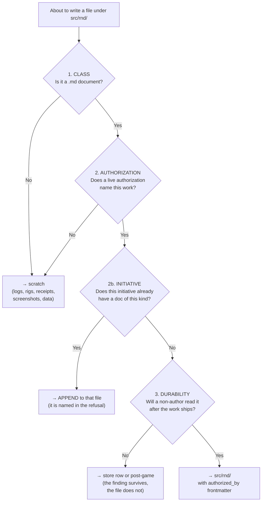

# R&D Directory Policy

**Purpose**: Keep `src/rnd/` a directory of **authorized deliverables** rather than a shared notebook, by making authorization a written precondition of the file's existence instead of a judgment the author makes about their own work.

**When to use**: Before creating any file under `src/rnd/`. Also when auditing an R&D directory that has already filled with scratch work, and when installing the guard into a consuming project.

**Key activities**: classify the artifact → resolve its authorization → write it to `src/rnd/` or to the transient scratch directory → let the guard enforce the same cut on the next author.

---

## The Problem, Measured

Measured **2026.09.22** against `[PROJECT]` (lupin), September 2026 additions under `src/rnd/`, via `git log --all --diff-filter=A`:

| Metric | Count |
|---|---|
| Artifacts added to `src/rnd/` in September | **153** |
| Of those, non-`.md` (`.log` 11, `.sh` 8, `.failset` 7, `.meta` 6, `.py` 4, `.wav` 3, `.tsv` 3, `.cjs` 2, `.json` 1) | **45** |
| Markdown documents | **108** |
| Markdown cited from any durable surface | **9** |
| Markdown carrying YAML frontmatter | **0** |
| Markdown that is deliverable-shaped (`-plan`, `-spec`, `-design`, `-proposal`, `-checklist`, `-workflow`, `-inventory`, `-census`, `-manifest`, `-audit`) | **25** |
| Markdown that is narrative/diary-shaped | **83** |

The whole directory holds **1,366** markdown files, **440** of which carry no date prefix at all.

### The Root Cause Is Not Misbehavior — It Is the Rule Set

A sweep of this repository's own workflow corpus:

| Metric | Count | How counted |
|---|---|---|
| Files mentioning `src/rnd/` at all | 56 | grep |
| Files a regex read as write-instructions | 14 | grep — **wrong, see below** |
| Files that **actually instruct a write** (the doors) | **6** | **read by hand, one at a time** |
| Of those 6 doors, how many require **authorization** | **0** | read by hand |

⚠️ **This table was wrong twice before it was right, and the two wrong numbers are left here on purpose.** First draft: "55 doors" — the *mentions* count relabelled as instructions, 9× over. Second: "14" — a regex for `(write|create|save|serialize|store|add).{0,60}src/rnd`, which faithfully matched eight **changelog lines** reading "added … `src/rnd/2026.06.30-…`". A version-history entry citing a file is not an instruction to write one.

⇒ **Do not publish a grep count as a finding about a corpus this small.** Fifty-six files is an afternoon of reading. Both wrong numbers survived because the grep was plausible and nobody opened the files — including me, twice, after writing a policy whose whole subject is unverified claims accumulating in a repository.

### The Six Doors

| Door | What it says |
|---|---|
| `workflow/claude-config-global.md` | *"All research and planning documents should be stored in the `src/rnd` directory."* |
| `workflow/plan-serialization.md` | *"MANDATE: After plan mode produces a non-trivial plan, serialize it to `src/rnd/`."* |
| `workflow/INSTALLATION-GUIDE.md` | installs that mandate into every new project |
| `workflow/installation-wizard.md` | the installer's copy of it |
| `workflow/p-is-p-01-planning-the-work.md` | *"Phase 0 creates: `src/rnd/YYYY.MM.DD-{topic}-research-synthesis.md`"* |
| `.claude/commands/plan-post-game.md` | *"Output location: `src/rnd/yyyy.mm.dd-<slug>-post-game.md`"* |

**The widest door is one sentence in the global config, and its load-bearing word is undefined.** *"All research and planning documents"* — nothing anywhere says what makes a document **research**. A seat that has just spent forty minutes chasing a bug has, by any honest reading of that sentence, produced a research document. The line is not being abused. It is being obeyed.

⇒ **Six doors, no lock on any of them.** The scratch work is not the fleet breaking the rules. It is the fleet following them.

`workflow/plan-serialization.md` is the clearest instance, and worth naming because its criteria read as rigorous while gating nothing:

| Its "Serialize (Yes)" criterion | Who judges it | What it actually admits |
|---|---|---|
| "Architectural decisions" | the author | every author believes their own sub-project is architectural |
| "Extended development time (>30 min)" | the author | a measure of effort spent, not of value to anyone else |
| "Cross-session recall needed" | the author | the author always expects to want it back |
| "Novel approach" | the author | novelty to *you* is not novelty to the repo |

Its "Skip" criteria test only **triviality** — size, abandonment, one-line fixes. Nothing tests **authorization**. A worker's 40 KB unrequested deep-dive passes every gate in that document, because the operator's word appears nowhere in it.

And that document governs only **plan-mode plans**. The 83 diary-shaped files are not plans; they are findings notes, written under no governing rule whatsoever. The directory has one narrow rule for one narrow class and open season for everything else.

---

## The Policy

> **`src/rnd/` holds authorized deliverables.** A file may be created there only if it passes all four tests below. Work that fails any test goes to the **transient scratch directory that dies with the worktree**, not into the repository.

### The Four Tests — All Four, In Order



### Rule 0 — Load-Bearing Overrides Every Other Verdict

**These four tests govern CREATION. They do not authorize DELETION.** Before any existing file under `src/rnd/` is removed, one question comes first and outranks all four:

> **Does code or a test name this file's path?**

Measured on the same September corpus: **26 of the 106 surviving documents are cited by code or a test.** This repository runs a *citation guard* — tests such as `test_sword_of_damocles_switch.py` and `test_parity_test_cites_its_legacy_source.py` name their design document by path and fail if it is gone. `git rm` on one of those turns the unit tier red.

⇒ An artifact that fails the authorization test and is load-bearing is **not deleted**. It takes one of two exits, in this order:

| Exit | When | Action |
|---|---|---|
| **Promote** | the document is genuinely the design of record for live code | grant it authorization, add frontmatter, keep it |
| **Retarget** | the citation should have pointed at a workflow doc, a store row, or a docstring | move the content, repoint the citation, **then** delete — in that order, one commit |

**"Delete everything the operator didn't ask for" is not a safe instruction, and must never be issued as one.** The authorization test says a file *should not have been created*. Only the load-bearing check says whether it can now be *removed*. A directory this old has grown load into itself, and that load is real regardless of how the file got there.

⚠️ **This applies to the non-`.md` rule too.** Test 1 reads as judgment-free and is not: at least one shell rig under a probe-receipts directory (`harvest.sh`) is cited by a test. **Run the load-bearing check before the class sweep, not after.**

#### Test 1 — Class

**Only `.md` documents enter `src/rnd/`.** At *any* authorization level, these never do:

| Never in `src/rnd/` | Goes to |
|---|---|
| Logs, `.failset`, `.meta`, run output | scratch |
| Probe rigs, drivers, harness shell scripts, one-off `.py`/`.cjs` | scratch |
| Screenshots, `.wav`, `.png`, rendered HTML probes | scratch, or the test fixture tree if a test reads it |
| `.tsv`/`.json`/`.csv` data dumps | scratch |

A receipt is evidence for a claim made *somewhere else*. Cite the run; do not check the run in. If a receipt must outlive the worktree, it belongs in the store row's `receipt_refs`, which is what that field is for.

**On a new write this test needs no judgment.** On an existing tree it does: Rule 0 runs first. The all-time non-`.md` population under `src/rnd/` in the surveyed project is **173 files** — 59 `.py`, 13 `.json`, 12 `.log`, 11 `.txt`, 10 `.png`, 9 `.sh`, 7 `.failset`, 6 `.meta`, 4 `.js`, 4 `.html`, 3 `.wav`, 3 `.tsv`, 2 `.csv`, 2 `.cjs`, 1 `.patch` — and the `.py` and `.sh` among them are exactly where a test is most likely to have reached in.

#### Test 2 — Authorization

The document must carry frontmatter naming a **live authorization that someone other than the author granted**:

```yaml
---
authorized_by: task:3a2f726b-caa5-469c-94aa-67d95f0c3936
---
```

Accepted forms:

| Form | Example | Resolves against |
|---|---|---|
| `task:<uuid>` | `task:3a2f726b-…` | the task store — the row must exist and be non-terminal |
| `broadcast:<id>` | `broadcast:643da7f9-…` | the broadcast log |
| `plan:<path>` | `plan:src/rnd/2026.09.22-foo.md` | an already-authorized plan this document implements |

**A row you created for your own sub-project is not authorization.** Authorization runs *downward* — from the operator, or from a manager acting inside a standing grant the operator gave. A seat cannot mint its own permission and then cite it; that is the laundering this test exists to stop.

#### Test 2b — One Document Per Initiative Per Kind

**Operator ruling, 2026-09-22.** Authorization gates *whether*; this gates *how many*.

> The second document naming the same initiative **and the same kind** is refused. Append to the one that exists.

**Why the authorization test alone is not enough.** The September corpus was never 108 topics — it was **16 active days**, and a handful of initiatives fragmented into a file per thought:

| | |
|---|---|
| September `.md` | 108 |
| Distinct days | **16** |
| Files per active day | 6.75 |
| Worst single day (Sept 10) | **17 files** |

Of those 17, at least **six** are one initiative — the petition / request-door work (`request-door-design`, `petition-answer-by-design`, `petition-ratio-exemption-and-deadline`, `answer-door-credentials-and-who-answered-design`, `request-rules-rescope`, `multiplexer-misses-petition-ask`).

⇒ **Every one of those six sat under work the operator had asked for.** An authorization gate admits all of them. Authorized work is exactly where the torrent comes from, which is why the grant needed a second half.

**The `doc_kind` discriminator, and why it is not a loophole.** One initiative legitimately yields several *artifacts* — a plan, then a design, then a post-game of the run that implemented it:

```yaml
---
authorized_by: task:3a2f726b-caa5-469c-94aa-67d95f0c3936
doc_kind: post-game        # plan | design | census | review | spec | post-game
---
```

Without it, the gate would refuse a post-game because a plan already cited the same row — a real need colliding with a rule, which is the fastest way to get a guard switched off entirely. It is declared, not inferred, so the author states the claim and the reviewer can see it.

**This gate teaches, it does not merely refuse.** The message names the existing file to append to. A refusal that does not say where the content should go is a wall, not a gate, and there is a test asserting the filename appears in the output.

#### Test 3 — Durability

> **Will someone who is not the author read this after the work ships?**

If the honest answer is no, the artifact is a working note. A working note with a real finding in it belongs in:

- a **store row** — if it is owed work, a bug, or a decision someone must make;
- a **post-game** — if it is a lesson from a finished run;
- a **workflow doc** — if it has graduated into a rule.

All three outlive the worktree. None of them is a loose file. **The finding survives; the file does not.**

This is the test the 83 diary-shaped documents fail. Titles shaped like sentences — `the-cap-was-in-the-tree-and-not-in-the-process`, `two-corrections-against-my-own-findings`, `a-guard-that-declines-to-run-and-reports-success` — are the tell. They are a seat narrating its own debugging in real time. That narration has value; a file in the repository is the wrong container for it.

---

## Where Ephemeral Work Goes Instead

| Kind of work | Destination | Lifetime |
|---|---|---|
| Run output, probe rigs, receipts | the session scratchpad directory | the session |
| Working notes during a build | worktree-local `.scratch/` (gitignored) | dies with the worktree |
| A finding worth keeping | a **store row** | permanent, queryable |
| A lesson from a finished run | a **post-game** under `src/rnd/` (authorized by the run) | permanent |
| An authorized deliverable | `src/rnd/yyyy.mm.dd-slug.md` + frontmatter | permanent |

**Install `.scratch/` in the project's `.gitignore` when installing this policy.** A destination that is not gitignored is not a destination; it is a delay.

---

## The Four Dispositions (for auditing an existing directory)

Sort by **inbound reference first**, because that is what decides whether deletion is even available:

| Class | Signal | Disposition | Needs a human? |
|---|---|---|---|
| **Load-bearing** — cited by code or a test | a test names the path | **promote or retarget. Never a bare delete** | manager |
| **Cited from the operator's own record** — `CLAUDE.md`, `TODO.md`, `history.md`, `src/docs/` | inbound citation | **keep**; no retrofit required | no |
| **Non-`.md`, not load-bearing** | Class | delete | no — rule, not judgment |
| **Deliverable-shaped, orphan** | Authorization unknown | triage against the store | manager |
| **Diary-shaped, orphan** | Durability | mint the finding as a row, **then** dispose | **operator decides delete vs. archive** |

On the September corpus that sorted to: **26** load-bearing · **9** in the operator's record · **71** orphan (26 loose at the `src/rnd` root, 45 inside a version directory).

### Rule A — An Audit Must Prove Each Of Its Own Signals Fired

**Measured twice in one afternoon, on both halves of this very cleanup:**

| Who | Claimed | Actually |
|---|---|---|
| The census owner | classified the corpus on **six** signals | ran the file-corpus tiers only; **signal 5, "named on a task-store row," was never run** and the result was reported as if all six had fired |
| The policy author | "**55** doors direct writes into `src/rnd`", then "**14**" | **6**. The 55 was a *mentions* count relabelled; the 14 was a regex that matched eight **changelog** lines |

**Neither of these is carelessness, and that is the point — both instruments were plausible.** A grep that returns 14 rows looks exactly like a grep that returns 14 correct rows. A five-of-six classification looks exactly like six-of-six. Nothing in either result announced what was missing.

⇒ **Before an audit's number is acted on, each signal must be shown to have fired at least once, by name.** Print the signal, print a matching row, print the count. A signal with zero hits is either genuinely empty or never ran, and those two states are indistinguishable from the summary.

🔴 **The cost here was nearly a live deliverable.** Running the missing signal 5 turned up **12 documents the operator ordered himself** inside a 71-file "orphan" set already approved for deletion — including the deliverable of a **P0 still `in_progress`**. A literal execution of the approved ruling would have deleted the work product of a live ticket. The correct move was made: the census owner **re-asked rather than reinterpreting** the earlier ruling, and the operator revised it to *delete 59, keep 12*.

⇒ And **authorization is itself an inbound signal**, alongside citations and test references. An "orphan" is a document with no inbound reference *of any kind* — including none from the operator's own order.

### Rule B — Delinking Is Not Line Deletion

When removing an index entry for a deleted document, **a single line in `README.md` can serve two documents.** A naive `grep -vF <deleted-name>` removes the whole line — and with it the *only* index entry for a document that survived.

**Caught in the live cleanup**: `README.md` line 184 linked a deleted document *and* the surviving `2026.09.06-unmerged-branch-orphaning-mechanism.md`. Deleting the line would have orphaned a file that had just passed every keep test.

⇒ **Diff removed-lines against the survivor list before applying, and repoint the line rather than dropping it.** The check is cheap; the failure is silent, because an index that has lost an entry still parses, still renders, and still looks complete.

### Three Rules That Prevent the Audit From Doing Harm

**1. Citation exempts; it never convicts.** In the September corpus only 9 of 153 artifacts were cited from any durable surface. Condemning on *absence* of a citation would condemn 94% of the directory, including approved plans that nobody happened to link. Use citation as a **keep** signal only.

**2. Exclude `src/rnd/README.md` from the citation haystack.** An R&D index that lists its own directory's contents makes every file in that directory "cited," and the signal reads green while measuring nothing. Valid citation surfaces are: `CLAUDE.md`, `CLAUDE.local.md`, `TODO.md`, `history.md` and `history/`, `src/docs/`, `src/workflow/`, and task-store rows.

**3. Frontmatter is a forward-only control.** Zero of the 108 September documents carry any frontmatter. The guard governs the *next* write; it cannot retro-classify an existing file. Do not plan a retrofit pass — 106 hand-judgments wearing a schema is not a migration. The guard and the backlog triage are two separate machines.

---

## Enforcement

**A rule that depends on remembering is not installed.** Two arms, because the first one is bypassable:

| Arm | Hook | Catches | Bypassable by |
|---|---|---|---|
| **Write guard** | `PreToolUse` on `Write`/`Edit` | the author, at the moment of writing, with a message explaining where it goes instead | a shell heredoc or `cp` |
| **Commit guard** | `pre-commit` | every newly-**added** `src/rnd/` path regardless of how it got there | nothing in-tree |

The commit guard is the one that actually holds. The write guard exists because a refusal at write time teaches; a refusal at commit time only blocks.

**Both arms ship with a positive control** — a fixture the guard *must* refuse — because a guard that silently declines to run reports success. See `workflow/scripts/rnd_write_guard.py` and its tests.

### Escape Hatch

`RND_GUARD_ALLOW=1` for the one case the rule cannot anticipate. It is logged, not silent. A guard with no escape hatch gets disabled wholesale the first time it is wrong.

---

## Integration Points

| Surface | Change |
|---|---|
| `workflow/plan-serialization.md` | add the authorization test ahead of its "Serialize (Yes)" table; its criteria are necessary, not sufficient |
| `workflow/post-game.md` | post-games are authorized by the run they retrospect — name it in frontmatter |
| `workflow/session-end.md` | the serialization prompt asks for the authorization, not just the slug |
| Project `.gitignore` | add `.scratch/` |
| Project `CLAUDE.md` | cite this document; do not copy it |

---

## Anti-Patterns

- **Don't self-authorize.** A row you minted for your own sub-project is not the operator asking for the work.
- **Don't check in receipts.** Cite the run; put the reference in the store row.
- **Don't convict on missing citations.** 94% of a real directory has none.
- **Don't let `README.md` launder the directory** by citing its own contents.
- **Don't retrofit frontmatter** onto an existing backlog — triage it instead.
- **Don't delete a diary-shaped document before its finding is minted as a row.** The file is the only copy; the finding is what has value.
- **Don't treat "I spent 30 minutes on it" as a reason to keep it.** Effort spent is not value to a reader.
- **Don't write an R&D document to report on R&D clutter.** The census that produced this policy's numbers lives in a session scratchpad and was never committed. An audit that adds a file to the directory it is auditing has already failed its own test — and it is the most tempting file in the whole cleanup to write, because it feels like the deliverable.
- **Don't issue "delete what wasn't authorized" as an instruction.** It reads as decisive and is unsafe; see Rule 0.

---

## Version History

- **v1.1** (2026.09.22): Added **Rule A** (an audit must prove each of its own signals fired) and **Rule B** (delinking is not line deletion), both earned during the live cleanup rather than reasoned out in advance. Corrected the door count **55 → 14 → 6**, the first two being grep artifacts published as findings; the wrong numbers are kept in the text deliberately. Named the widest door: the undefined word *"research"* in `claude-config-global.md`, now gated at source.
- **v1.0** (2026.09.22): Initial policy. Authored by María 🌸 with Mr. Radio 🦉 under task `3a2f726b-caa5-469c-94aa-67d95f0c3936`. Evidence: 153-artifact September census of lupin `src/rnd/`, plus a door/authorization sweep of this repository's own workflow corpus.

### Outcome of the first application

| | |
|---|---|
| September `.md` before | 108 (106 tracked) |
| Deleted | **59** |
| Survived | **47** = 26 load-bearing + 9 operator-record + 12 operator-ordered |
| Unminted findings rescued as store rows | 1 (`18ec288d`) |
| `README.md` dangling index entries removed | 41 (261 → 220 lines), zero dangling links remaining |

**One document in 71 named no store row anywhere.** Every other orphan cited at least one — which is why Rule A matters more than any quality judgment: the corpus was far better connected than its filenames suggested, and the signal that proved it was the one that had never been run.
