# Session Start Workflow

This document contains the comprehensive start-of-session workflow for initializing a new Claude Code session. This prompt should be executed when beginning work.

## Overview

At the start of work sessions, perform the following initialization ritual with **[SHORT_PROJECT_PREFIX]** prefix for all notifications. Send notifications after completing each step to keep me updated on progress.

**Key Principle**: The initialization steps themselves form a TodoWrite checklist for visual progress tracking.

---

## Preliminary: Send Start Notification

**Purpose**: Immediately notify user that session initialization has begun

**Timing**: Execute BEFORE creating TodoWrite list (before Step 0)

**Command**:
```python
notify( "Starting session initialization, loading config and history...", notification_type="progress", priority="low" )
```

**Why This Matters**:
- Provides immediate awareness that Claude is awake and working
- Especially helpful for long initializations (large history files, many workflows)
- Sets user expectation that initialization is in progress
- Complements the work direction question (which comes in Step 5)

**Note**: This is a low-priority "I'm starting" ping. The high-priority work direction question comes in Step 5, via `ask_multiple_choice()`.

---

## Step 0: Create Session Start TODO List

**Purpose**: Track initialization progress visually using TodoWrite

**Mandate**: ALWAYS create a TodoWrite list at the start of session initialization

**Template TODO Items**:
```
[SHORT_PROJECT_PREFIX] Load configuration files
[SHORT_PROJECT_PREFIX] Discover available workflows
[SHORT_PROJECT_PREFIX] Load session history
[SHORT_PROJECT_PREFIX] Identify active work and outstanding TODOs
[SHORT_PROJECT_PREFIX] Present session context and await direction
```

**Instructions**:
1. Use TodoWrite tool to create initialization checklist
2. Mark first item as `in_progress`
3. Update status after completing each step
4. Mark as `completed` when step finishes

**Example**:
```json
[
  {"content": "[PLAN] Load configuration files", "status": "in_progress", "activeForm": "[PLAN] Loading configuration"},
  {"content": "[PLAN] Discover available workflows", "status": "pending", "activeForm": "[PLAN] Discovering workflows"},
  {"content": "[PLAN] Load session history", "status": "pending", "activeForm": "[PLAN] Loading history"},
  {"content": "[PLAN] Identify outstanding work", "status": "pending", "activeForm": "[PLAN] Identifying work"},
  {"content": "[PLAN] Present session context", "status": "pending", "activeForm": "[PLAN] Presenting context"}
]
```

---

## Step 1: Notification System Overview

**Three-Phase Pattern**: This workflow uses progress notifications during initialization, then a blocking question once ready.

**MCP Tools**: cosa-voice MCP server (v0.3.0) - no bash commands needed

**Available Tools**:
- `notify()` - Fire-and-forget announcements (progress updates)
- `ask_yes_no()` - Binary yes/no decisions
- `converse()` - Open-ended questions
- `ask_multiple_choice()` - Menu selections (blocking, mirrors AskUserQuestion)
- `ask_open_ended_batch()` - Batch open-ended questions (single screen, blocking)

**When to Send Notifications**:
1. **Start Notification** (Preliminary step, before Step 0):
   - Low-priority progress notification
   - Signals initialization has begun
   - Command: `notify( "Starting session initialization...", notification_type="progress", priority="low" )`

2. **Progress Notification** (Step 4, after loading history):
   - Low-priority progress notification
   - Signals history loaded, analyzing work
   - Command: `notify( "History loaded, analyzing outstanding work...", notification_type="progress", priority="low" )`

3. **Work Direction Question** (Step 5, AFTER identifying outstanding work):
   - HIGH-PRIORITY blocking `ask_multiple_choice()` call
   - Asks user what they want to work on WITH actual options
   - Only sent AFTER outstanding work is identified (so options are meaningful)

4. **Error Notifications** (As needed):
   - Urgent priority
   - Sent if critical errors occur during initialization

**Priority Levels**:
- `urgent`: Critical errors during initialization
- `high`: Work direction question (Step 5) - uses `ask_multiple_choice()`
- `medium`: Not used in session-start
- `low`: Progress notifications (Preliminary, Step 4)

**Notification Types**: task, progress, alert, custom

**Key Simplifications** (cosa-voice MCP):
- No `[PREFIX]` needed - project auto-detected from working directory
- No `--target-user` parameter - handled internally
- Native MCP tool calls - no bash execution

**Rationale for This Pattern**:

**Progress Notifications (Low Priority)**:
- User immediately knows Claude is awake and working
- Reduces anxiety during long initializations
- Sets clear expectation: "initialization in progress"
- Informational only, doesn't demand immediate attention

**Work Direction Question (High Priority, Blocking)**:
- Sent AFTER outstanding work is identified
- Contains actual options based on what was found in history
- User receives notification AND question together
- Blocking: workflow waits for user response before proceeding
- Better UX: Question has context, options are meaningful

**Key Insight**: Don't ask "what do you want to work on?" until you know what the options are. The blocking question in Step 5 combines notification + question into a single interaction with real context.

---

## Step 2: Load Configuration

**Purpose**: Load global and project-specific configuration to understand preferences, workflows, and project context

**Process**:

1. **Read Global Configuration**:
   ```bash
   # Read global user preferences
   cat ~/.claude/CLAUDE.md
   ```

2. **Read Project Configuration**:
   ```bash
   # Read project-specific preferences
   cat ./CLAUDE.md
   ```

3. **Extract Key Information**:
   - **[SHORT_PROJECT_PREFIX]**: Project identifier for TODOs and notifications
   - **Project name**: Full project name
   - **Notification settings**: Email, API key, priorities
   - **Project-specific workflows**: Custom slash commands or workflow references
   - **History location**: Path to history.md file
   - **Testing preferences**: Smoke tests, unit tests, integration tests
   - **Code style preferences**: Formatting, naming conventions

4. **Validate Configuration**:
   - Confirm [SHORT_PROJECT_PREFIX] is defined
   - Check that history.md path exists
   - Verify notification system is configured

5. **Report Summary**:
   ```
   Configuration Loaded:
   - Project: Planning is Prompting
   - Prefix: [PLAN]
   - History: /path/to/project/history.md
   - Workflows: Session management, p-is-p planning, history management
   - Notifications: Configured (cosa-voice MCP)
   ```

**Update TodoWrite**: Mark "Load configuration files" as completed, mark next item as in_progress

---

## Step 3: Discover Available Workflows

**Purpose**: Identify and summarize available slash commands and workflow documents

**Process**:

1. **List Slash Commands**:
   ```bash
   ls -1 .claude/commands/
   ```

2. **Categorize Workflows**:

   Group discovered slash commands by category:

   **Session Management**:
   - `/plan-session-start` - Initialize new session
   - `/plan-session-end` - Wrap up session with history/commits

   **History Management**:
   - `/plan-history-management` - Archive, check, analyze history.md

   **Planning Workflows**:
   - `/p-is-p-00-start-here` - Entry point for Planning is Prompting
   - `/p-is-p-01-planning` - Work planning (classify → pattern → breakdown)
   - `/p-is-p-02-documentation` - Implementation documentation

   **Other Workflows**:
   - (List any additional project-specific workflows)

3. **Report Summary**:
   ```
   Available Workflows:

   Session Management (2):
     • /plan-session-start
     • /plan-session-end

   History Management (1):
     • /plan-history-management

   Planning Workflows (3):
     • /p-is-p-00-start-here
     • /p-is-p-01-planning
     • /p-is-p-02-documentation
   ```

**Update TodoWrite**: Mark "Discover available workflows" as completed, mark next item as in_progress

---

## Step 3.5: Initialize Session Tracking (Parallel Session Safety v2.0)

**Purpose**: Initialize file tracking for parallel session safety. When multiple Claude sessions work on the same repository simultaneously, this tracking ensures each session only commits its own changes.

**Mechanism**: Multi-section `.claude-session.md` manifest file in project root. Each session has its own section, enabling true parallel session support.

**Format Version**: 2.0 (Multi-Session)

---

### Process

1. **Get Session Information**:
   ```python
   session_info = get_session_info()
   session_id = session_info["session_id"]
   current_timestamp = datetime.now().isoformat()
   ```

2. **Check for Existing Manifest**:
   ```bash
   ls .claude-session.md 2>/dev/null
   ```

3. **Detect Manifest Version and Handle**:

   **If NO manifest exists** → Create new v2.0 manifest (go to Step 4)

   **If manifest exists** → Read and detect version:

   ```
   If file starts with "# Claude Session Manifest (Multi-Session)":
       → v2.0 format (proceed to Step 3a)
   Else if file starts with "# Claude Session Manifest":
       → v1.0 format (migrate to v2.0, then proceed to Step 3a)
   ```

   **v1.0 → v2.0 Migration** (automatic, transparent):
   - Read existing v1.0 manifest
   - Extract session ID, started timestamp, project, touched files
   - Rewrite as v2.0 format with single section
   - Proceed as if v2.0 was found

   **Step 3a: Search for Current Session's Section**:

   Search manifest for `## Session: {my_session_id}`:

   **If FOUND + status is `active`**:
   - This is a context clear recovery - RESUME this section
   - Update `**Last Activity**` timestamp
   - Display: "Resuming session tracking (context clear recovery)"
   - Skip to Step 5 (display status)

   **If FOUND + status is `committed`**:
   - Previous session committed but manifest not cleaned
   - Create NEW section for this session (go to Step 4)

   **If NOT FOUND**:
   - New parallel session joining existing manifest
   - Append new section (go to Step 4)

   **Step 3b: Check for Stale Sessions** (optional, informational):

   Scan all sections for sessions with `status: active` and `Last Activity` > 24 hours old:

   ```python
   # If stale sessions found, display warning (non-blocking)
   notify(
       message=f"Found {n} stale session(s) in manifest (>24h inactive)",
       notification_type="alert",
       priority="low",
       abstract="**Stale sessions**:\n- Session abc123 (last active 2 days ago)\n- Session def456 (last active 36 hours ago)\n\nThese may be abandoned. Consider cleaning up at session-end."
   )
   ```

4. **Create/Append Session Section**:

   **If creating NEW manifest** (v2.0 from scratch):

   ```markdown
   # Claude Session Manifest (Multi-Session)

   **Format Version**: 2.0
   **Last Updated**: [current ISO timestamp]

   ---

   ## Session: [session_id]

   **Started**: [ISO timestamp]
   **Last Activity**: [ISO timestamp]
   **Status**: active
   **Project**: [project name from CLAUDE.md]

   ### Touched Files

   *No files modified yet*

   ---
   ```

   **If APPENDING to existing v2.0 manifest**:

   1. Update `**Last Updated**` timestamp at top of file
   2. Append new section before final `---`:

   ```markdown
   ## Session: [new_session_id]

   **Started**: [ISO timestamp]
   **Last Activity**: [ISO timestamp]
   **Status**: active
   **Project**: [project name]

   ### Touched Files

   *No files modified yet*

   ---
   ```

5. **Display Tracking Status**:

   ```
   ══════════════════════════════════════════════════════════
   Parallel Session Safety Initialized (v2.0)
   ══════════════════════════════════════════════════════════
   Session ID: [session_id]
   Manifest: .claude-session.md
   Status: [created | resumed | joined (N other active sessions)]
   Tracking: Active - will log all file modifications
   ══════════════════════════════════════════════════════════
   ```

   **Status variants**:
   - `created` - New manifest, this is the only session
   - `resumed` - Context clear recovery, continuing previous tracking
   - `joined (N other active sessions)` - Parallel session, N others are also active

---

### v2.0 Manifest Format Reference

```markdown
# Claude Session Manifest (Multi-Session)

**Format Version**: 2.0
**Last Updated**: 2026-01-31T10:30:00

---

## Session: 5c8a3081

**Started**: 2026-01-31T09:00:00
**Last Activity**: 2026-01-31T10:25:00
**Status**: active
**Project**: planning-is-prompting

### Touched Files

- 2026-01-31T09:15:00 | src/auth.py
- 2026-01-31T09:30:00 | src/utils.py

---

## Session: a357ab00

**Started**: 2026-01-31T08:00:00
**Last Activity**: 2026-01-31T10:20:00
**Status**: active
**Project**: planning-is-prompting

### Touched Files

- 2026-01-31T08:30:00 | src/database.py
- 2026-01-31T09:45:00 | tests/test_db.py

---
```

**Section Fields**:

| Field | Description |
|-------|-------------|
| `## Session: {ID}` | Section header with 8-char session ID |
| `**Started**` | ISO timestamp when session began |
| `**Last Activity**` | ISO timestamp of most recent file edit |
| `**Status**` | `active`, `committed`, or `stale` |
| `**Checkpoints**` | (Optional) Count of mid-session commits |
| `**Project**` | Project name from CLAUDE.md |
| `### Checkpoint N (hash) \| timestamp` | (Optional) Files committed in checkpoint N |
| `### Touched Files` | List of `- timestamp \| filepath` entries |

**Checkpoint Tracking** (for sessions using `/plan-session-checkpoint`):

When a session uses mid-session checkpoints, the manifest includes:
- `**Checkpoints**: N` counter tracking number of checkpoints
- `### Checkpoint N (hash) | timestamp` sections listing files committed in each checkpoint

Example with checkpoints:
```markdown
## Session: 5c8a3081

**Started**: 2026-01-31T09:00:00
**Last Activity**: 2026-01-31T16:45:00
**Status**: active
**Checkpoints**: 2
**Project**: planning-is-prompting

### Checkpoint 1 (abc1234) | 2026-01-31T11:30:00

- auth.py
- utils.py

### Checkpoint 2 (def5678) | 2026-01-31T14:15:00

- database.py

### Touched Files

- 2026-01-31T09:15:00 | auth.py
- 2026-01-31T09:30:00 | utils.py
- 2026-01-31T12:00:00 | database.py
- 2026-01-31T15:00:00 | api.py           ← Not yet committed
```

**Status Values**:

| Status | Meaning |
|--------|---------|
| `active` | Session is running or may resume after context clear |
| `committed` | Session completed commit successfully |
| `stale` | Marked stale (>24h inactive, auto-detected) |

---

### MANDATE: Track ALL File Modifications

**CRITICAL**: After **EVERY** Edit or Write tool call, you **MUST**:

1. **Find your session's section** in `.claude-session.md` (search for `## Session: {your_id}`)
2. **Append to your section's `### Touched Files`**:
   ```markdown
   - [ISO timestamp] | [relative file path]
   ```
3. **Update your section's `**Last Activity**` timestamp**

**Example - Finding and updating your section**:

```markdown
## Session: 5c8a3081

**Started**: 2026-01-31T09:00:00
**Last Activity**: 2026-01-31T10:35:00  ← UPDATE this
**Status**: active
**Project**: planning-is-prompting

### Touched Files

- 2026-01-31T09:15:00 | src/auth.py
- 2026-01-31T09:30:00 | src/utils.py
- 2026-01-31T10:35:00 | src/config.py  ← APPEND this
```

**Implementation Rules**:
- After each Edit tool call → append the edited file path to **YOUR section ONLY**
- After each Write tool call → append the written file path to **YOUR section ONLY**
- Duplicates are OK (same file edited multiple times)
- Use relative paths from project root
- Always update **YOUR** Last Activity timestamp (not another session's)

---

### ⚠️ SESSION ISOLATION (CRITICAL)

**Multiple Claude sessions may run on the same repository simultaneously.** You **MUST** follow these rules:

| ❌ NEVER | ✅ ALWAYS |
|----------|----------|
| Modify another session's `## Session:` section | Find YOUR section by YOUR session ID first |
| Overwrite the entire manifest file | Use targeted edits within YOUR section |
| Delete another session's tracking data | Only delete YOUR section (and only when committing) |
| Read another session's files and stage them | Stage only files from YOUR `### Touched Files` |
| Change another session's `**Status**` | Only update YOUR status after YOUR commit |

**Before EVERY manifest edit, verify**:
```
□ I know my session ID (from get_session_info())
□ I found "## Session: {my_id}" in the manifest
□ My edit is ONLY within that section
□ Other sessions' sections remain UNCHANGED
```

**If another session's data gets corrupted, that Claude instance will commit wrong files or lose tracking entirely.**

---

### Why Multi-Session Format Matters

**v1.0 Problem**: Single-session manifest meant parallel sessions would overwrite each other's tracking, or one session would skip tracking entirely.

**v2.0 Solution**: Each session has its own section, enabling:

| Capability | v1.0 | v2.0 |
|------------|------|------|
| Single session tracking | ✓ | ✓ |
| Context clear recovery | ✓ | ✓ |
| Parallel sessions | ✗ | ✓ |
| Conflict detection at commit | ✗ | ✓ |
| Session-scoped commits | Partial | ✓ |

**Example Scenario with v2.0**:
```
Session A: Modified src/auth.py, src/utils.py
  → Section "5c8a3081" contains: auth.py, utils.py

Session B (parallel): Modified src/database.py, tests/test_db.py
  → Section "a357ab00" contains: database.py, test_db.py

At Session A's /plan-session-end:
  git status shows: all 4 files modified
  Session A's section shows: auth.py, utils.py
  Conflict check: No overlap with Session B's files ✓
  Result: Commits only auth.py and utils.py ✓

At Session B's /plan-session-end:
  git status shows: database.py, test_db.py (auth.py, utils.py already committed)
  Session B's section shows: database.py, test_db.py
  Result: Commits database.py and test_db.py ✓
```

---

### Manifest Lifecycle (v2.0)

| Event | Action |
|-------|--------|
| Session-start (new) | Create manifest with single section |
| Session-start (resume) | Find section by ID, update Last Activity |
| Session-start (parallel) | Append new section to existing manifest |
| Every Edit/Write | Append to YOUR section only, update Last Activity |
| Session-end | Read YOUR section, check conflicts, selective commit |
| After successful commit | Update YOUR section status to `committed`, add commit hash |
| Cleanup (optional) | Remove `committed` sections older than 7 days |
| Context clear | Manifest persists, section found by session ID on resume |

**Key Benefit**: The manifest file **survives context clears** AND **supports parallel sessions**. Each session maintains independent tracking.

---

### Backward Compatibility

**Automatic v1.0 → v2.0 Migration**:

When session-start detects a v1.0 manifest, it automatically migrates:

1. Read v1.0 content (Session ID, Started, Project, Touched Files)
2. Rewrite as v2.0 format with single section
3. Continue normally

**Detection Logic**:
```
If file starts with "# Claude Session Manifest (Multi-Session)":
    → v2.0 (use directly)
Else if file starts with "# Claude Session Manifest":
    → v1.0 (migrate, then use)
```

Migration is transparent - user sees no difference except "Migrated manifest to v2.0 format" in display.

---

### .gitignore Recommendation

Add `.claude-session.md` to your project's `.gitignore`:
```bash
echo ".claude-session.md" >> .gitignore
```

This prevents accidentally committing the session manifest.

---

## Step 4: Load Session History

**Purpose**: Read recent session history to understand project state, progress, and context

**Process**:

1. **Quick Token Count** (Optional):
   ```bash
   ~/.claude/scripts/get-token-count.sh /path/to/history.md
   ```

   Example output:
   ```
   Words: 4,597
   Tokens: 6,115 (estimated)
   Status: 24.5% of 25,000 token limit
   Health: ✅ HEALTHY
   ```

2. **Read History File**:
   ```bash
   # Focus on recent sessions (last 3-7 days recommended)
   head -n 100 history.md
   ```

3. **Extract Current Status**:

   Read the top 3 lines of history.md (status summary):
   ```
   **Current Status**: [Brief project state description]
   **Next Steps**: [What's coming next]
   ```

4. **Identify Recent Session**:

   Find the most recent session entry (top of file, reverse chronological):
   ```
   ### YYYY.MM.DD - Session N: [Session Title]

   **Accomplishments**:
   - [List of completed work]

   **TODO for Next Session**:
   - [ ] Task 1
   - [ ] Task 2
   ```

5. **Report Summary**:
   ```
   Session History Loaded:

   Current Status:
   - "Planning is Prompting" core workflows complete
   - Next: Test workflows, populate remaining stubs

   Most Recent Session: 2025.10.04 - Session 4
   Token Health: ✅ HEALTHY (6,115 / 25,000 tokens)
   ```

**When to Read More History**:
- If recent sessions reference important implementation docs
- If context from older sessions is needed
- If approaching major milestone or phase transition

**When to Skip History**:
- Brand new project with minimal history
- Starting completely new feature unrelated to recent work

6. **Send Progress Notification**:

   **Purpose**: Notify user that history is loaded and outstanding work is being analyzed

   **Timing**: Send after loading history, before identifying outstanding work in Step 5

   **Command**:
   ```python
   notify( "History loaded, analyzing outstanding work...", notification_type="progress", priority="low" )
   ```

   **Note**: This is a progress update only. The actual question asking what to work on comes in Step 5, AFTER outstanding work has been identified and options are known.

**Update TodoWrite**: Mark "Load session history" as completed, mark next item as in_progress

---

## Step 4.5: Review TODO.md

**Purpose**: Check persistent TODO tracking file for pending work items

**Canonical Workflow**: See planning-is-prompting → workflow/todo-management.md

**Process**:

1. **Check if TODO.md exists** in project root:
   ```bash
   ls TODO.md 2>/dev/null
   ```

2. **If TODO.md exists**:

   a. **Read the file**:
   ```bash
   cat TODO.md
   ```

   b. **Extract pending items**:
   - Look for items under `## Pending` section
   - Items are formatted as `- [ ] Item description`

   c. **Display summary**:
   ```
   ══════════════════════════════════════════════════════════
   TODO.md - Persistent Work Items
   ══════════════════════════════════════════════════════════

   Pending Items (3):
   - [ ] Implement user authentication
   - [ ] Update API documentation
   - [ ] Fix pagination bug

   Last updated: 2026-01-26 (Session 49)
   ```

3. **If TODO.md does NOT exist**:
   - Note: "No TODO.md found - will be created at session-end if needed"
   - Continue to Step 5

4. **Merge with history.md TODOs** (if any):
   - If both TODO.md and history.md have TODO items, **prefer TODO.md as authoritative**
   - history.md TODOs may exist in older repos not yet migrated
   - Display combined list in Step 5

**Key Principle**: TODO.md is the single source of truth for pending work. If it exists, use it. If not, fall back to history.md TODO sections (legacy pattern).

---

## Step 5: Identify Outstanding Work

**Purpose**: Gather outstanding TODO items and determine work direction

**Process**:

1. **Gather TODO Items**:

   **Primary Source**: TODO.md (if exists from Step 4.5)
   - Use items from `## Pending` section
   - These are the authoritative pending items

   **Fallback Source**: history.md (legacy pattern)
   - Only if TODO.md doesn't exist
   - Find the "TODO for Next Session" section from most recent session in history.md:
   ```
   **TODO for Next Session**:
   - [ ] Test p-is-p workflows in practice
   - [ ] Populate session-start.md workflow
   - [ ] Add example inputs/outputs to README.md
   - [ ] Demonstrate in other repos
   ```

2. **Check for Implementation Documents**:

   Look for references to active planning documents in history.md header or recent sessions:
   - Implementation document paths (e.g., `src/rnd/2025.10.01-feature-name.md`)
   - Active planning workflows
   - Architecture decision records
   - Research documents

3. **Count Outstanding Items**:
   ```
   Found 4 outstanding TODO items from 2025.10.04
   Found 1 active implementation document: src/rnd/2025.09.28-auth-system.md
   ```

4. **Display Outstanding Work Summary**:

   **DO NOT auto-carry-forward old TODOs** - instead, display what was found and ask for direction.

   First, display the summary in Claude Code:
   ```
   ══════════════════════════════════════════════════════════
   Outstanding Work from Last Session (2025.10.04)
   ══════════════════════════════════════════════════════════

   TODO Items:
   - [ ] Test p-is-p workflows in practice
   - [ ] Populate session-start.md workflow
   - [ ] Add example inputs/outputs to README.md
   - [ ] Demonstrate in other repos

   Active Documents:
   - None (tracking in history.md)
   ```

5. **Ask User for Direction via MCP**:

   **CRITICAL**: This is when you ask the user what they want to work on - AFTER you know what the options are.

   **IMPORTANT CONSTRAINT**: `ask_multiple_choice()` supports **2-4 options maximum**. The number of TODOs found determines the presentation strategy.

   ---

   ### Case A: Zero TODOs Found

   Skip TODO selection; present simplified menu:

   ```python
   ask_multiple_choice( questions=[
       {
           "question": "Session ready! No outstanding TODOs found.",
           "header": "Direction",
           "multiSelect": False,
           "options": [
               {"label": "New task", "description": "Describe what you'd like to work on"},
               {"label": "Browse history", "description": "Review past sessions for context"}
           ]
       }
   ], priority="high" )
   ```

   ---

   ### Case B: Exactly 1 TODO Found

   Present the specific TODO as a selectable option (3 options total):

   ```python
   ask_multiple_choice( questions=[
       {
           "question": "Session ready! Found 1 outstanding TODO.",
           "header": "Direction",
           "multiSelect": False,
           "options": [
               {"label": "[TODO truncated]", "description": "[Full TODO text]"},
               {"label": "Start fresh", "description": "Work on something else"},
               {"label": "Modify list", "description": "Add/remove items before starting"}
           ]
       }
   ], priority="high" )
   ```

   **Example with real TODO**:
   ```python
   options = [
       {"label": "Populate commit-ma...", "description": "Populate workflow/commit-management.md stub"},
       {"label": "Start fresh", "description": "Work on something else"},
       {"label": "Modify list", "description": "Add/remove items before starting"}
   ]
   ```

   ---

   ### Case C: Exactly 2 TODOs Found

   Present BOTH TODOs as individual selectable options (4 options - exactly at max):

   ```python
   ask_multiple_choice( questions=[
       {
           "question": "Session ready! Found 2 outstanding TODOs.",
           "header": "Direction",
           "multiSelect": False,
           "options": [
               {"label": "[TODO 1 truncated]", "description": "[Full TODO 1 text]"},
               {"label": "[TODO 2 truncated]", "description": "[Full TODO 2 text]"},
               {"label": "Start fresh", "description": "Work on something else"},
               {"label": "Modify list", "description": "Add/remove items before starting"}
           ]
       }
   ], priority="high" )
   ```

   **Example with real TODOs**:
   ```python
   options = [
       {"label": "Migrate genie-in-t...", "description": "Consider migrating genie-in-the-box to cosa-voice MCP tools"},
       {"label": "Populate commit-ma...", "description": "Populate workflow/commit-management.md stub"},
       {"label": "Start fresh", "description": "Work on something else"},
       {"label": "Modify list", "description": "Add/remove items before starting"}
   ]
   ```

   ---

   ### Case D: 3 TODOs Found (5 options, single call)

   Present all 3 TODOs plus fallback options:

   ```python
   ask_multiple_choice( questions=[
       {
           "question": "Session ready! Found 3 outstanding TODOs.",
           "header": "Direction",
           "multiSelect": False,
           "options": [
               {"label": "[TODO 1 truncated]", "description": "[Full TODO 1 text]"},
               {"label": "[TODO 2 truncated]", "description": "[Full TODO 2 text]"},
               {"label": "[TODO 3 truncated]", "description": "[Full TODO 3 text]"},
               {"label": "Start fresh", "description": "Work on something else"},
               {"label": "Modify list", "description": "Add/remove items before starting"}
           ]
       }
   ], priority="high" )
   ```

   ---

   ### Case E: 4 TODOs Found (6 options, single call)

   Present all 4 TODOs plus fallback options:

   ```python
   ask_multiple_choice( questions=[
       {
           "question": "Session ready! Found 4 outstanding TODOs.",
           "header": "Direction",
           "multiSelect": False,
           "options": [
               {"label": "[TODO 1 truncated]", "description": "[Full TODO 1 text]"},
               {"label": "[TODO 2 truncated]", "description": "[Full TODO 2 text]"},
               {"label": "[TODO 3 truncated]", "description": "[Full TODO 3 text]"},
               {"label": "[TODO 4 truncated]", "description": "[Full TODO 4 text]"},
               {"label": "Start fresh", "description": "Work on something else"},
               {"label": "Modify list", "description": "Add/remove items before starting"}
           ]
       }
   ], priority="high" )
   ```

   ---

   ### Case F: 5 TODOs Found (6 options, single call)

   Present all 5 TODOs plus unified "Other..." escape hatch:

   ```python
   # All 5 TODOs + "Other" for custom input (user can type anything)
   ask_multiple_choice( questions=[
       {
           "question": "Session ready! Found 5 outstanding TODOs.",
           "header": "Direction",
           "multiSelect": False,
           "options": [
               {"label": "[TODO 1 truncated]", "description": "[Full TODO 1 text]"},
               {"label": "[TODO 2 truncated]", "description": "[Full TODO 2 text]"},
               {"label": "[TODO 3 truncated]", "description": "[Full TODO 3 text]"},
               {"label": "[TODO 4 truncated]", "description": "[Full TODO 4 text]"},
               {"label": "[TODO 5 truncated]", "description": "[Full TODO 5 text]"},
               {"label": "Other...", "description": "Start fresh, modify list, or describe what you want"}
           ]
       }
   ], priority="high" )
   ```

   **Note**: "Other..." serves as a unified escape hatch - user can type "start fresh", "modify list", or any custom direction.

   ---

   ### Case G: 6+ TODOs Found (Progressive Disclosure)

   When there are more TODOs than can fit in 6 options, use a **two-step approach**:

   **Step 5a - Mode Selection** (first question):

   ```python
   ask_multiple_choice( questions=[
       {
           "question": f"Session ready! Found {n} outstanding TODOs.",
           "header": "Direction",
           "multiSelect": False,
           "options": [
               {"label": f"Continue TODOs ({n})", "description": "Choose which TODO to work on first"},
               {"label": "Start fresh", "description": "Work on something else"},
               {"label": "Modify list", "description": "Add/remove items before starting"}
           ]
       }
   ], priority="high" )
   ```

   **If user selects "Continue TODOs (N)"** → proceed to Step 5b

   **Step 5b - TODO Selection** (second question):

   Show the first 5 TODOs as individual options, plus a "See more" option if > 5:

   ```python
   # Build options from first 5 TODOs
   options = [
       {"label": "[TODO 1 truncated]", "description": "[Full TODO 1 text]"},
       {"label": "[TODO 2 truncated]", "description": "[Full TODO 2 text]"},
       {"label": "[TODO 3 truncated]", "description": "[Full TODO 3 text]"},
       {"label": "[TODO 4 truncated]", "description": "[Full TODO 4 text]"},
       {"label": "[TODO 5 truncated]", "description": "[Full TODO 5 text]"},
   ]

   # Add 6th option based on remaining count
   if remaining_todos > 0:
       options.append( {"label": f"See {remaining_todos} more...", "description": "View remaining TODOs"} )
   else:
       options.append( {"label": "Back", "description": "Return to previous menu"} )

   ask_multiple_choice( questions=[
       {
           "question": "Which TODO would you like to work on first?",
           "header": "Select TODO",
           "multiSelect": False,
           "options": options
       }
   ] )
   ```

   **If user selects "See N more..."** → repeat Step 5b with next batch of TODOs

   ---

   ### Label Formatting Rules

   | Field | Max Length | Purpose |
   |-------|------------|---------|
   | `label` | ~25-30 chars | Quick scan identifier, truncated with "..." |
   | `description` | Full text | Complete TODO text - never truncate |

   **Truncation Guidelines**:
   - Truncate at word boundary when possible
   - Use ellipsis (...) to indicate truncation
   - For file paths: Keep filename, truncate directory
   - For action phrases: Keep verb and key noun

   **Good Examples**:
   ```python
   # Long TODO: "Consider migrating genie-in-the-box to cosa-voice MCP tools"
   {"label": "Migrate genie-in-t...", "description": "Consider migrating genie-in-the-box to cosa-voice MCP tools"}

   # Short TODO: "Fix auth bug"
   {"label": "Fix auth bug", "description": "Fix auth bug"}

   # Path-heavy TODO: "Update src/tests/integration/test_auth.py"
   {"label": "Update test_auth.py", "description": "Update src/tests/integration/test_auth.py"}
   ```

   ---

6. **Wait for User Response**:

   **CRITICAL**: STOP here and wait for user input. Do NOT proceed to Step 6 until user responds.

   **Note**: The `ask_multiple_choice()` call is blocking - it waits for user response.

   **Response Handling by Selection**:

   | User Selection | Action |
   |----------------|--------|
   | [Specific TODO] | Create TodoWrite with that item as `in_progress`, others as `pending` |
   | "Start fresh" | Clear old TODOs, wait for user to describe today's work |
   | "Modify list" | Show all TODOs, ask what to add/remove/change |
   | "Other..." | Parse user's custom text: may be "start fresh", "modify list", or custom direction |
   | "Continue TODOs (N)" | Proceed to Step 5b for individual TODO selection (Case G only) |
   | "See N more..." | Show next batch of TODOs (repeat Step 5b with offset, Case G only) |
   | "Back" | Return to Step 5a mode selection (Case G only) |
   | "New task" | Wait for user to describe new work (zero-TODO case) |
   | "Browse history" | Show recent session summaries for context |

   **After selection is resolved**:
   - Create new TodoWrite list with selected TODO as `in_progress`
   - Apply [SHORT_PROJECT_PREFIX] to each item
   - Read implementation docs if referenced
   - Proceed to Step 6

**Update TodoWrite**: Mark "Identify outstanding work" as completed, mark next item as in_progress

---

## Step 6: Present Context & Await Direction

**Purpose**: Provide comprehensive session summary and confirm readiness to begin work

**Process**:

1. **Summarize Session Context**:

   ```
   ══════════════════════════════════════════════════════════
   Session Initialized - Ready to Work
   ══════════════════════════════════════════════════════════

   Project: Planning is Prompting
   Prefix: [PLAN]

   Current Status:
   - Core p-is-p workflows complete (00, 01, 02)
   - Slash commands created and tested
   - Repository structure established

   Today's Focus:
   [Based on user's response from Step 5]

   Available Workflows:
   - /p-is-p-00-start-here - Planning entry point
   - /p-is-p-01-planning - Work planning
   - /plan-session-end - Session wrap-up
   - /plan-history-management - History archival

   History Health: ✅ HEALTHY (6,115 / 25,000 tokens)

   ──────────────────────────────────────────────────────────
   Ready to begin. What would you like to work on first?
   ══════════════════════════════════════════════════════════
   ```

2. **Highlight Key Context**:
   - Current project phase or milestone
   - Any blockers or decisions from last session
   - Recent accomplishments (for continuity)
   - Relevant workflow recommendations

3. **Integration with Planning Workflows**:

   **If starting new feature/research/architecture work**:
   ```
   💡 Suggestion: This looks like new work. Consider using:
   → /p-is-p-00-start-here (decide which workflow to use)
   → /p-is-p-01-planning (create structured plan)
   ```

   **If continuing existing work**:
   ```
   📋 Continuing from last session:
   → TodoWrite list created with outstanding items
   → First task marked as in_progress
   → Ready to execute
   ```

4. **Wait for User Direction**:

   **Note**: By this point, the user has already responded to the `ask_multiple_choice()` question in Step 5 and indicated their work direction. This step presents the final context summary.

   User may respond with:
   - Specific task to work on ("Let's start with task #2")
   - New work request ("I need to debug the authentication system")
   - Question about project state ("What's the status of feature X?")
   - Workflow invocation ("/p-is-p-01-planning to plan this work")

**Update TodoWrite**: Mark "Present session context" as completed

---

## Project-Specific Context

**Project**: Planning is Prompting (example - replace with your project)

**Prefix**: [PLAN] (replace with your project's [SHORT_PROJECT_PREFIX])

**History Location**: `/mnt/DATA01/include/www.deepily.ai/projects/planning-is-prompting/history.md`

**Current Phase**: Repository established, core workflows complete, testing phase

**Active Documents**: None (tracking in history.md)

**Available Workflows**:
- Session management: /plan-session-start, /plan-session-end
- History management: /plan-history-management
- Planning workflows: /p-is-p-00-start-here, /p-is-p-01-planning, /p-is-p-02-documentation

---

## Special Considerations

**Working with Multiple Repos**:
- Always use [SHORT_PROJECT_PREFIX] in TODOs and notifications for clarity
- Configure project-specific prefix in ./CLAUDE.md
- Notifications help identify which project needs attention

**Integration with Planning is Prompting Workflows**:
- New work → Consider `/p-is-p-00-start-here` to choose workflow
- Complex features → Use `/p-is-p-01-planning` for structured planning
- Large projects → May need `/p-is-p-02-documentation` for implementation docs

**Error Handling**:
- Missing history.md → Create new file with status summary
- Missing CLAUDE.md → Ask user for [SHORT_PROJECT_PREFIX]
- No outstanding TODOs → Skip Step 5 options, proceed to Step 6
- Configuration conflicts → Report to user, request clarification

**First Session in New Project**:
- Step 4 will show minimal/no history → This is normal
- Step 5 will show no outstanding TODOs → This is expected
- Focus on Step 2 (configuration) and Step 6 (direction setting)

---

## Quick Reference

**Typical Session Start Flow**:

```mermaid
flowchart TD
    P["Preliminary: Send start notification (low)"] --> S0["0. Create TodoWrite checklist"]
    S0 --> S1["1. Notification System Overview (ref only)"]
    S1 --> S2["2. Load configs → Extract PREFIX"]
    S2 --> S3["3. Discover workflows → List slash commands"]
    S3 --> S4["4. Load history → Read last 3-7 days<br>Send progress notification (low)"]
    S4 --> S5["5. Find TODOs → ask_multiple_choice()<br>HIGH priority, BLOCKING"]
    S5 -->|WAIT for response| S6["6. Present context → Await work direction"]
```


**Notification Timing**:
- **Preliminary (before Step 0)**: "Starting session initialization..." (low priority, type=progress)
- **Step 4 (after loading history)**: "History loaded, analyzing outstanding work..." (low priority, type=progress)
- **Step 5 (after identifying work)**: `ask_multiple_choice()` with actual options (HIGH priority, BLOCKING)
  - **Key Insight**: Only ask "what do you want to work on?" AFTER you know what the options are
  - **Rationale**: User receives notification AND question together, with real context

**Key Decision Points**:
- Step 5: User chooses Continue TODOs / Start fresh / Modify list (via `ask_multiple_choice()`)
- Step 6: User provides work direction or invokes planning workflow

---

## Design Pattern: Example-Based Message Generation

**Purpose**: Provide natural message variety in high-frequency workflows without triggering permission prompts or requiring bash execution.

**Problem Statement**: When workflows need varied messages to avoid robotic repetition, implementing variation through bash scripts creates UX friction (permission prompts, interruption of flow). Fixed messages solve the permission problem but sacrifice naturalness over many sessions.

**Solution**: Example-based generation - workflow documents provide 4-6 example messages, Claude generates natural variations at runtime based on the examples and required elements.

**Important Note**: This pattern is for fire-and-forget `notify()` calls. When you need user input, use blocking tools like `ask_multiple_choice()` instead - see Step 5 for the work direction question pattern.

---

### When to Use This Pattern

**High-Frequency, Cross-Session Workflows** (use Pattern B):
- Session-end completion messages
- Progress update notifications
- Milestone achievement messages
- Any fire-and-forget message sent multiple times per week

**When NOT to Use This Pattern**:
- When you need user input → Use `ask_multiple_choice()`, `ask_yes_no()`, or `converse()` instead
- When the message should contain options/questions → Use blocking MCP tools
- When exact wording matters → Use fixed messages

**Characteristics requiring this pattern**:
- ✓ Executed frequently (multiple times per day/week)
- ✓ Fire-and-forget (no user interaction needed)
- ✓ Benefits from variety (avoid robotic repetition)
- ✓ Maintains consistent tone and required elements

**Ad-Hoc, Infrequent Workflows** (can use fixed messages):
- One-time installation wizards
- Error messages (consistency preferred)
- Critical security warnings (exact wording matters)
- Legal/compliance notifications (must not vary)

---

### How It Works

**1. Provide Example Messages** (4-6 variations):

Show variety in tone, emphasis, and structure while maintaining core elements:

```markdown
**Example Messages** (showing variety in tone and emphasis):
1. "Session complete! All changes committed and history updated."
2. "All done! Wrapped up the session - changes saved, history recorded."
3. "Session wrapped up successfully. Everything's committed and documented."
4. "Finished! Session documented, changes committed, ready for next time."
5. "Session complete - all good! History updated, changes pushed."
6. "Done for now! Everything's saved and documented for next session."
```

**2. Specify Required Elements**:

List what MUST be included in every generated variation:

```markdown
**Required Elements** (include in your generated message):
- Friendly, conversational tone
- Indicate what was accomplished
- Signal completion state
```

**3. Specify Style Guidelines**:

Constrain generation to maintain consistency:

```markdown
**Style Guidelines**:
- Length: 1-2 sentences maximum
- Tone: Friendly but professional
- Structure: Completion statement + brief summary
```

**4. Claude Generates Variation**:

At workflow execution time, Claude:
- Reads the examples to understand tone/style range
- Ensures all required elements are present
- Follows style guidelines for consistency
- Creates a natural variation that fits the context
- No bash execution, no permission prompts

---

### Pattern Comparison

**Pattern A: Fixed Single Message**
```markdown
**Command**:
notify( "Hey, I've finished loading everything...", notification_type="task", priority="high" )
```

**Pros**: Simple, predictable, no complexity
**Cons**: Robotic repetition, exact same message every session
**When to use**: Infrequent workflows, error messages, legal text

---

**Pattern B: Example-Based Generation** (This Pattern)
```markdown
**Message Generation Pattern**: Create natural variation based on these examples...
[6 example messages]
**Required Elements**: [list]
**Style Guidelines**: [constraints]
**Command**: notify( "{your_generated_variation}", notification_type="task", priority="high" )
```

**Pros**: Infinite variety, context-aware, natural feel
**Cons**: Less predictable, requires trust in generation quality
**When to use**: High-frequency workflows, progress updates, session start/end
**Example**: This workflow

---

### Implementation Template

Use this template when implementing Pattern B in other workflows:

```markdown
## Step X: Send [Type] Notification

**Purpose**: [What this notification accomplishes]

**Timing**: [When to send it in the workflow]

**Message Generation Pattern**: Create a natural variation based on these examples:

**Example Messages** (showing variety in tone and emphasis):
1. "[Example message 1 - comprehensive tone]"
2. "[Example message 2 - concise tone]"
3. "[Example message 3 - friendly tone]"
4. "[Example message 4 - technical tone]"
5. "[Example message 5 - energetic tone]"
6. "[Example message 6 - calm tone]"

**Required Elements** (include in your generated message):
- [Required element 1]
- [Required element 2]
- [Required element 3]

**Style Guidelines**:
- Length: [constraint]
- Tone: [constraint]
- Structure: [constraint]

**Command**:
```python
notify( "{your_generated_variation}", notification_type="[type]", priority="[priority]" )
```

**Rationale**: [Why generation is better than fixed for this use case]
```

---

### Benefits of This Pattern

**1. Natural Variety**:
- Never exact repetition across sessions
- Feels more natural than fixed messages
- Can adapt to context (e.g., "Found 5 TODOs" vs. "Fresh start")

**2. Transparent Execution**:
- No bash scripts to execute
- No permission prompts
- Seamless workflow experience

**3. Consistent Quality**:
- Required elements ensure completeness
- Style guidelines maintain tone
- Examples show acceptable range

**4. Future-Proof**:
- As workflows evolve, messages can naturally evolve
- No need to update fixed lists
- Adapts to new contexts automatically

**5. Maintainable**:
- Clear documentation of expectations
- Easy to audit (review examples and constraints)
- Simple to update guidelines if needed

---

### For Future Workflow Authors

When creating new high-frequency workflows:

**1. Ask: Does this message need variety?**
- If yes → Consider Pattern B (example-based generation)
- If no → Use Pattern A (fixed message)
- Never use bash random selection (Anti-Pattern)

**2. Write good example sets:**
- Show range of acceptable tones (friendly, technical, casual, energetic)
- Demonstrate different emphases (comprehensive, concise, process-focused)
- Keep core elements consistent across all examples
- Aim for 4-6 examples (fewer = less variety, more = diminishing returns)

**3. Be specific about required elements:**
- What information MUST be conveyed?
- What tone MUST be maintained?
- What structure MUST be followed?

**4. Provide clear constraints:**
- Length limits (prevent rambling)
- Tone guidelines (maintain professionalism)
- Structure patterns (maintain consistency)

**5. Test the pattern:**
- Run workflow 3-5 times
- Verify natural variety without drift
- Ensure no permission prompts
- Confirm all required elements present

---

### History of This Pattern

**Session 23 (2025.10.22)**: Added message variety using bash random selection
- Problem: Permission prompts interrupted workflow
- Impact: Poor UX, broke seamless initialization

**Session 25 (2025.10.23)**: Removed random selection, used fixed message
- Solution: Eliminated permission prompts
- Trade-off: Lost message variety

**Session 26 (2025.10.23)**: Implemented Pattern B (example-based generation)
- Solution: Claude generates variations at runtime
- Result: Natural variety + no permission prompts + seamless execution

**Design Insight**: Workflow documents should guide Claude's behavior, not execute scripts. When variety is needed, provide examples and constraints for generation rather than bash execution.

---

### Related Patterns

- **Session-End Notifications**: Apply this pattern for completion messages
- **Progress Updates**: Apply for milestone notifications
- **Error Messages**: Use fixed messages (consistency preferred)
- **Interactive Prompts**: Use fixed text (exact wording may matter)

**See Also**:
- `workflow/cosa-voice-integration.md` - cosa-voice MCP notification patterns
- `workflow/session-end.md` - Session completion workflow (candidate for Pattern B)

---

## Version History

- **2026.01.31 (Session 55)**: **Major upgrade to v2.0 multi-session manifest format**. Step 3.5 now supports multiple concurrent sessions with independent tracking sections. Added: automatic v1.0→v2.0 migration, session search by ID, context clear recovery, stale session detection, Last Activity timestamps. Each session gets its own `## Session: {ID}` section. Enables true parallel session safety with conflict detection at commit time (~200 lines rewritten).
- **2026.01.29 (Session 53)**: Added Step 3.5 for parallel session safety with `.claude-session.md` manifest file (v1.0). Creates persistent file-based tracking of all Edit/Write operations. Survives context clears. Documented manifest lifecycle and tracking mandate (~120 lines added).
- **2026.01.07 (Session 42)**: Expanded to 6-option support (from 4). Cases D/E/F now use single MCP call for 3/4/5 TODOs respectively. Progressive disclosure (Case G) only needed for 6+ TODOs. Updated Lupin notification model to allow 2-6 options. Case F uses "Other..." as unified escape hatch (~70 lines added).
- **2026.01.07 (Session 41)**: Implemented dynamic TODO option generation in Step 5 - TODOs now presented as individual selectable options instead of bundled into "Continue TODOs". Added 4 cases (0, 1, 2, 3+ TODOs) with progressive disclosure for 3+. Added label formatting rules and response handling table (~150 lines added).
- **2026.01.06 (Session 40)**: Fixed notification order of operations - removed premature "ready" notification from Step 4, moved work direction question to Step 5 using `ask_multiple_choice()`. Key insight: only ask "what do you want to work on?" AFTER outstanding work is identified.
- **2025.10.23 (Session 26)**: Implemented Pattern B (example-based generation) for ready notification; added Design Pattern documentation section (~150 lines)
- **2025.10.23 (Session 25)**: Removed bash random selection, implemented fixed message to eliminate permission prompts (~35 lines simplified)
- **2025.10.23 (Session 24)**: Moved notification timing from Step 6 to Step 4 for better UX (~80 lines modified)
- **2025.10.22 (Session 23)**: Added two-notification pattern and message variety with bash random selection (~140 lines)
- **2025.10.XX**: Initial session-start workflow creation
