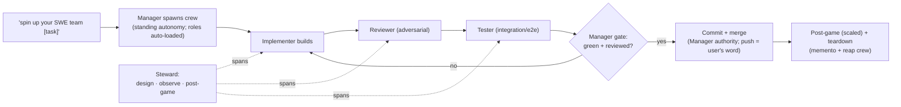

# SWE-Team Spin-Up (canonical workflow)

**Purpose**: Canonize the standing software-engineering crew so the whole arrangement instantiates from **one directive** — *"spin up your SWE team"* — with every member coming online already knowing its role, expectations, gates, and reporting discipline. No per-session role re-explanation.

**When to use**: any build-shaped engagement (implement → review → test a feature/fix) that warrants more than a solo session — i.e. work that benefits from a dedicated implementer, an adversarial reviewer, and an integration tester under a manager, with a steward watching for drift.

**Status**: ✅ Ratified 2026-06-06 (Rick, via guided walkthrough — all 7 design decisions) · 🛡️ **BATTLE-TESTED 2026-06-06** — first real run (Heartbeat Arbiter v2.1, Thread B) shipped: committed `7973376`, live-apply 88 tests green. Design record + ruling table: `src/rnd/2026.06.05-swe-team-spin-up-workflow.md` §6; first-run post-game: `src/rnd/2026.06.06-swe-team-first-run-postgame.md`. Authored by María 🌸 (Workflow Steward).

**Relationship to other workflows**:
- **Manager Spawn/Harvest Autonomy** (`src/rnd/2026.06.04-manager-spawn-harvest-autonomy.md`) is the *can-spawn* **mechanics** half ("spawn freely; edit carefully"; the standing/gated/hygiene envelope). **This workflow is the composition** — "spawn THIS roster with THESE roles." They compose: autonomy *authorizes*; this workflow *specifies the shape*.
- The **cascaded plan-review cast** (`workflow/plan-review-cascaded*.md`) is *review-shaped* (N personas reviewing a plan section-by-section). The SWE team is *build-shaped*. Some role overlap (reviewer/steward), different lifecycle — distinct but cross-referenced.

---

## 1. The model — standing pair + spin-up crew

Two layers, never collapsed (ratified Q6):

- **Standing pair (the backbone — pre-exists every spin-up):**
  - **Manager** — sequences work, holds the **quality gate** (green AND reviewed), owns **standing commit + merge authority** (no per-commit user gate; **push** is the user's session-end call, executed by the Manager on their word), spawns/harvests the crew under standing autonomy.
  - **Workflow Steward** — design author + live observer + post-game synthesizer. Plans the work, watches the run, catches drift/confabulation, runs the retrospective. **Not an implementer.**
- **Spin-up crew (the ephemeral workers — what "spin up" instantiates):**
  - **Implementer(s)** · **Reviewer(s)** (adversarial) · **Tester(s)** (integration/e2e).

> "Spin up your SWE team" instantiates **only the crew**, against a task. Teardown reaps **only the crew**; the standing pair persists.

**Roster shape is SCALABLE** (ratified Q1): the default is one each (implementer / reviewer / tester), but it is **N-of-a-role** — a task may take two implementers or a second reviewer. "3" is a default, not a cap.

**Persona binding** (ratified Q2): a **fresh session (person) per spawn** — fresh session = fresh MCP, per the standing-permission rule — but a **stable role-charter**. The role-charter is the durable identity; the *person* rotates with availability, the *role-identity* persists (traceable by role through git log/history).

---

## 2. Roster & role charters

| Role | Layer | Charter lives in |
|------|-------|------------------|
| Manager | standing | `workflow/swe-team-roles.md` § Manager |
| Workflow Steward | standing | `workflow/swe-team-roles.md` § Steward |
| Implementer | spin-up crew | `workflow/swe-team-roles.md` § Implementer |
| Reviewer | spin-up crew | `workflow/swe-team-roles.md` § Reviewer |
| Tester | spin-up crew | `workflow/swe-team-roles.md` § Tester |

The per-role **charter text** is the durable artifact each spawned member auto-loads on spin-up — the **"load document"** (ratified Q4: one canonical `workflow/swe-team-roles.md`, a section per role; the spawn slices the relevant role section into that member's brief). The required shape + content of that document is specified in **§7** below.

---

## 3. Activation surface (layered — ratified Q3)

The team can be brought online three composable ways — they are layers over the **same** mechanism, not alternatives:

1. **Slash command (the canonical surface):** `/spin-up-swe-team [task]` — a thin wrapper the Manager runs. It references `workflow/swe-team-roles.md` and spawns the crew with each member's role section as its brief.
2. **Broadcast-triggerable:** Rick broadcasts *"@Manager spin up your SWE team for X"* → the Manager runs the command underneath. (Natural-language entry; the command does the deterministic work.)
3. **Intent-encapsulated:** an Agent Skill so *"spin up your SWE team"* auto-activates the command by intent.

**Underlying engine:** the cosa-voice **`spawn_sessions`** MCP tool (already live). The slash command and skill are ergonomic layers over it — **the first spin-up does not depend on the shim**; the Manager can spawn directly via `spawn_sessions` using the role charters.

**Shim install note:** a Claude Code slash command is **auto-discovered** the moment the file exists in the invoking repo's `.claude/commands/` — no restart, no install step. It must live in the repo where the Manager invokes (or be made global via `/plan-install-wizard`).

**Persona fidelity — verify the allocated persona, never narrate the request (2026-06-06 finding):** `spawn_sessions`' `persona_preference` is a **request, not a guarantee** — if the requested persona is unavailable the child's SessionStart may allocate a different one. *(First real spin-up: the Manager requested **Clayton 😎** but the live worker came up as **Rachel 🕊️**; reports said "Clayton honored" — the requested name narrated as fact, not the allocated one. Caught by the user, not the fleet — the exact no-confabulation anti-pattern.)* **Rule:** after spawn, the Manager MUST verify the **actual allocated persona** (`list_spawned_sessions`) and use THAT name in all narration. If a specific persona is required for narrative continuity, have the worker `request_persona` to it **and confirm** before referring to it by that name.

---

## 4. Lifecycle

---

## 5. Lifecycle gates (ratified Q5)

- **Hard commit gate (non-negotiable):** **green AND adversarially-reviewed** before any commit. No silent skips. This is the Test-Ownership mandate + adversarial-review discipline made mechanical — the Manager holds it.
- **Always post-game, scaled:** the Steward runs a retrospective **every cycle** — a *full* retro for substantive runs, a *lightweight note* for trivial ones. Always-on (never "on-demand") because the standing post-game is how the Steward catches drift/confabulation — the role's whole point.
- **Commit + merge are the Manager's call** (standing authority, once green AND reviewed) — **NO per-commit/per-merge user gate** (Rick 2026-06-16). The quality gate makes work commit-ready; the Manager then commits + merges. **PUSH to origin stays the user's session-end call** — the Manager executes the push on the user's word (never punts the git op to the user).
- **Standing-pair keep-alive (2026-06-06 lesson):** during an autonomous build the Manager + Steward must NOT both go dark — a re-loop/handoff with no one awake to actuate stalls silently (proven live: a ~90-min unactioned re-loop verdict). The fleet-stall keep-alive belongs to the **arbiter layer** (the standing arbiter daemon taps the Manager on stall), NOT the per-session Stop-hook (which correctly won't poke a *legitimate* wait). **Layering (no interim crutch — Rick GO 2026-06-29):** Stop-hook = per-session lazy-stop + owed-work self-check (folded debounce, no brute-force tick) · arbiter = fleet-stall poker + dark-session backstop. The standing arbiter now covers fleet-stall detection directly; the old interim poker / `/loop` timer stopgap is **retired** — do NOT stand up a manual timer to keep a session alive. The Steward still actively watches for stalls as a human-judgment backstop (see `swe-team-roles.md` §Steward), but is no longer the *mechanism*.

---

## 6. Teardown (ratified Q7)

- **Symmetric, one directive:** *"stand down the SWE team"* reaps **all crew workers** in one directive — mirroring spin-up.
- **Mementos on by default:** each worker writes a memento to its stable, derivable slot (`io/mementos/<persona-slug>.md` — one per persona, no timestamp) before reap, so its role specialization survives for a **warm re-spawn** via `seed_memento`. The Manager derives the seed path from the persona; nobody hands a path around (see `memento-management.md` §3.2).
- **Standing pair persists** — only the crew is reaped.
- **Composes with** the Manager's ad-hoc harvest autonomy: the Manager can still reap individual workers mid-run; *"stand down the SWE team"* is the clean end-of-engagement sweep.

---

## 7. The Load Document — spec for `workflow/swe-team-roles.md`

The **load document** is the per-role charter artifact each spawned member auto-loads. The Steward owns this *structure spec*; whoever authors the file builds to it.

**Location:** `workflow/swe-team-roles.md` (single canonical doc — ratified Q4).

**Shape:** one `##` section per role (Manager · Steward · Implementer · Reviewer · Tester). The spawn slices the relevant role section into that member's `task_prompt`/seed.

**Each role section MUST contain:**
1. **Mandate** — the one-sentence charge ("what you own").
2. **Knows on arrival** — context the role presupposes (the task, the repo, the gate it answers to).
3. **Expectations & gates** — what the role must produce and the gate it feeds (per §5): implementers build to spec + own their unit tests; reviewers refute, don't rubber-stamp; testers own the cross-unit/whole-chain "does it actually run" check.
4. **Reporting cadence** — when/where to report (the Manager's collection topic `dm-<manager>`; status on phase transitions; honest blockers immediately).
5. **Test-ownership** — per the Test-Ownership mandate: the role writes + runs its own tier; never hands manual QA back to the human.
6. **No-confabulation discipline** — never report a result reconstructed from spec; cite a primary evidence artifact (log line, job-id, commons entry, exit summary) for every claimed outcome, or mark it unverified.
7. **Harvest/teardown behavior** — write a memento on stand-down (per §6).

**Content source for the charters:** the ratified rulings in `src/rnd/2026.06.05-swe-team-spin-up-workflow.md` §6 (esp. Q5 gates) + the standing mandates in global `~/.claude/CLAUDE.md` (Test Ownership · no-confabulation · cross-session communication).

---

## 8. Build & install status

**Build queue (post-ratification):**
1. ✅ This workflow doc — `workflow/swe-team-spin-up.md`.
2. ✅ The **load document** — `workflow/swe-team-roles.md` (per §7).
3. ⏳ The `/spin-up-swe-team [task]` slash command + intent wrapper (§3); add the README link. *(Manager's lane.)*
4. ✅ First real spin-up (Heartbeat Arbiter v2.1, Thread B) — **APPROVED** (green + reviewed + tested) 2026-06-06; commit held for Rick's word. Post-game: `src/rnd/2026.06.06-swe-team-first-run-postgame.md`.

**Installer note:** this doc is **not** part of the `/plan-install-wizard` package automatically. It joins the installer only when registered in the wizard catalog (`workflow/INSTALLATION-GUIDE.md` + the wizard) + README — a deliberate follow-up step.

---

## Version history

- **1.1 (2026-06-29, María 🌸 — Rick GO)** — §5 standing-pair keep-alive: **retired the interim-poker / `/loop` stopgap language.** The standing arbiter is now the fleet-stall *mechanism* + the per-session Stop-hook is the owed-work self-check (folded debounce, no brute-force tick); the Steward is the human-judgment backstop, not the mechanism. Part of the fleet-wide crutch-retirement (task `d0cffe5c`). HELD for review.
- **1.0 (2026-06-06)** — Initial canonical workflow, authored by María 🌸 (Workflow Steward) from the ratified seed `src/rnd/2026.06.05-swe-team-spin-up-workflow.md` §6 (Rick ruled all 7 decisions via guided walkthrough; Tiberius 👑 manager-rec). Composes with the Manager Spawn/Harvest Autonomy workflow.
