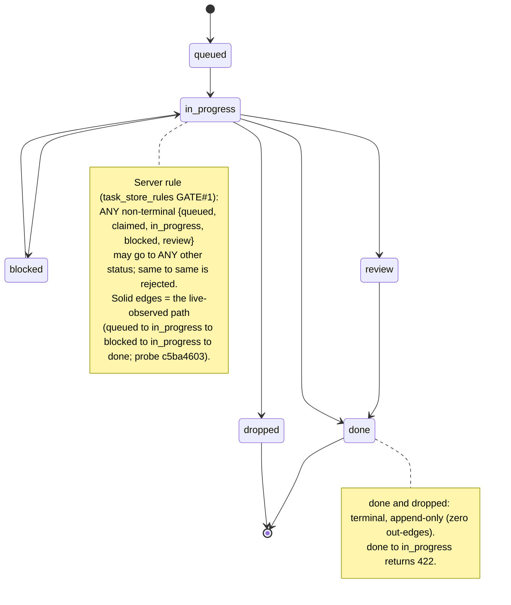

# Task-Store Discipline (canonical workflow)

**Purpose**: the day-to-day practice for using the unified task-store — when to create items, how to transition them, what stays in markdown, and what every session owes the store. This is the PIP-side Phase-2 companion to the Lupin-side service build.

**Status**: v1.1 (2026-06-15, María — owner; Krishna E2E receipts + exhaustive edge matrix folded — verified behavior) — authored against design v0.4.1 (`src/rnd/2026.06.11-unified-task-store-design.md`, all rulings folded) + the committed MCP wrapper spec (Lupin `src/rnd/v0.1.8/2026.06.11-task-store-phase1/02-mcp-wrapper-spec.md`). **Syncs with the Phase-2 hook crew before freeze** — write-path hooks kick off 2026-06-12 night (ruling D3); wrapper names follow the `taskstore_*` collision review if it renames.

**When to use**: any session in a repo where the task-store is live (Phase 1+). Until then this doc is forward-guidance; the existing TODO.md/TaskList practice stands.

**Venue-agnostic** (Krishna, Phase-2.1 E2E note): the conventions hold identically whether the store is served on `:7999` (dev / hand-demo) or `:8000` (the integrated service) — same server code; only the backing Postgres differs. Receipts captured against `:7999` apply verbatim to `:8000`.

---

## 1. The one-sentence practice

**Use your harness task list as you always have; the store follows you.** Whatever the harness's native surface is — the Task\* tool family (TaskCreate/TaskUpdate/TaskList/TaskGet) on current harnesses, TodoWrite on older ones — the `PostToolUse` hook mirrors it into the store via correlation-keyed upserts, no duplicates on rewrites. (Don't pin a tool name in your own practice docs either; `stop.py` §0.3 corrected the same retired-name assumption.) **One mechanical limit (Tiffany flag #3, Phase-2 contract)**: a hook-mirrored completion lands as **`review`, never `done`** — the hook has no receipts to attach, and `→done` requires them. **`done` is always an explicit, receipted act.** The disciplines below cover what the hook canNOT infer: cross-session obligations, receipts, blocks, and gates.

## 2. Who writes, who reads (F4 — managers-first)

- **Everyone READS** from day one: `task_query` is [READ]-tier, no gating.
- **Managers-first WRITES** at launch: manager-figure sessions (per `workflow/manager-autonomy.md` §2.1 predicate) write via hook + explicit calls; worker items arrive via manager/DM auto-create paths. Enforcement is social + audit-trail, not tool gating.
- **Widening rider (Rick, double-anchored)**: write scope widens to ALL sessions after Phase 1–2 prove out — do not let this get lost.

## 3. Creating items — when an explicit `task_create` is owed

The hook covers your own TodoWrite list. Create EXPLICITLY when the obligation is **cross-session or durable beyond your list**:

| Situation | item_class | Notes |
|---|---|---|
| Work you assign to another persona | `task` | `owner_persona` = them, `accountable_manager` = you |
| A decision Rick must rule | `decision` | framing payload (options/pros/cons/rec) in `body`; feeds `/plan-decide` |
| A review you request by DM | `review_request` | usually AUTO-CREATED from the qid (T4) — create manually only if you bypassed DM |
| A bug worth surviving the session | `bug` | bug-fix-queue.md folds in later; until then file BOTH (queue stays canonical for bug-fix-mode) |
| A user-gated boundary you're holding | `gate` | `gate_class=ricks_court` makes Rick's court a query |

Identity (`created_by`/`actor`) is bridge-stamped — never a parameter, never spoofable.

## 4. Transitions — the receipts discipline

- **`→done` REQUIRES `receipt_refs`** — key-whitelisted + shape-validated server-side (`commit` 7–40 hex · `qid` uuid · `test_run` id · `doc_path` exists · `log_line` `<path>:<lineno>` exists). A bare "trust me" completion is REJECTED with the server's errors verbatim. This is the no-confabulation rule, mechanized: if you can't cite a receipt, the work isn't done.
- **Receipt path SHAPE is enforced** (VERIFIED 2026-06-15, Krishna E2E): `doc_path`/`log_line` must be `<registered-scope>/<rel-path>` — a bare `src/rnd/…` → `422` *"receipt path scope 'src' is not a registered repo scope"*; `log_line` must end `:<lineno>`. Cite receipts as `lupin/src/…:NN`, never bare `src/…`. (Worked example: §10.1 Rejection B.)
- **`→blocked` REQUIRES BOTH** ≥1 typed `blocked_by` ref (`{kind: item|persona|user, id}`) AND `next_chase_ts` — a blocked item says what it waits ON and when it will be chased. No "pending X" graves. `{kind:user}` ⇒ the oracle treats it as not-owed (STALL ≠ QUIET).
- **`done` and `dropped` are TERMINAL** — no transitions out; corrections are a new item linking the old id.
- **`→dropped` REQUIRES a reason — ENFORCED** (C12 pulled forward, Tiberius-ruled 2026-06-12 after Tiffany's wire-gap flag): `task_events` carries a nullable `reason` column; the server rejects a reasonless drop. The escape hatch around the receipts rule is closed.
- **`authority` rides every write** (`standing` | `user_direct` | `manager_relay`) — the blast-radius model joins the audit trail.

## 5. The truth boundary (F3 — what stays markdown)

| Surface | Role under the store |
|---|---|
| **Store** | CANONICAL for live work — machines read ONLY this |
| **TODO.md** | durable human narrative + sections RENDERED from the store (session-end); narrative prose stays hand-authored; **never hand-edit a rendered section**, fix the store |
| **Harness TaskList** | session-START seed from `task_query(owner=me, status≠done)` (T5 practice); hook closes the write side |
| **bug-fix-queue.md** | canonical for bug-fix-mode until its fold-in phase |
| **history.md / src/rnd** | unchanged — completion record + design record |

## 6. Query patterns (R4 — determinism is the point)

- Manager board glance: `task_query()` (everything, newest first)
- My owed work: `task_query(owner_persona=me, status="in_progress")` (+ `queued`)
- Rick's court: `task_query(gate_class="ricks_court")`
- Fleet owed-work (arbiter/oracle): same queries via REST — the oracle consumes the SAME store (T7), fail-open on store-down (I1: the Stop-hook path never blocks on the store).

## 7. Correlation — what sessions must know

- Same-subject rewrites UPSERT (no duplicates); a changed subject supersedes (old item `→dropped` reason `superseded-by-rewrite`). On Task\*-tool harnesses the hook payload carries the stable harness task id, so derivation precedence (a) applies universally and the (b) content-hash fallback is dormant (Tiffany flag #2).
- `/clear` re-correlates via the STABLE session id — your list survives rehydration.
- **Cross-SESSION respawn does NOT auto-correlate** (successor hashes to its own sid): at session-start seed, ADOPT inherited items via the audited `POST /api/tasks/{id}/correlate` endpoint (ruled 2026-06-12 — re-registers your harness task id onto the item's `correlation_key`, with the adoption on the event trail). A respawned session that skips adoption forks items — fail-visible by design.

## 8. Failure modes

- Store down → READ paths fall back to files (I1), WRITE paths must not silently drop (hook timeout + spool + replay — Phase-2 C8); a session that can't write FLAGS ONCE, never fakes.
- Non-compliance (a session not writing) = practice bug, not liveness signal (I4): fail-open + flag-once.

## 9. Legal transition graph (server-enforced)

VERIFIED 2026-06-15 (Krishna E2E, probe `c5ba4603` on `:7999`; venue-agnostic — identical on `:8000`). The item-status state machine **as the server enforces it**, from `task_store_rules` (ratified GATE#1):

- **States** — non-terminal: `queued`, `claimed`, `in_progress`, `blocked`, `review` · **terminal**: `done`, `dropped`.
- **Rule**: every non-terminal status may transition to every OTHER status. `done` and `dropped` are **append-only sinks** (zero out-edges). A no-op (`same → same`) is rejected.
- **Terminal lockout OBSERVED**: `done → in_progress` → `422` → *"item is terminal ('done') — done/dropped are append-only, no transitions out"*.

> **Verification scope — EDGE-VERIFIED (v1.1, exhaustive)**: Krishna probed every edge live (2026-06-15, self-cleaning on `:7999`, 37 probe tasks). The 5 non-terminal states form a **fully-connected digraph** — every non-terminal → every other state returns `200` (30/30). **Rejected `422`**: every no-op (`same → same`, all 5) and every terminal-source edge (`done`/`dropped` → anything — zero out-edges, append-only sinks). **Payload-gated** (legal, extra fields required): `→done` (`receipt_refs`), `→blocked` (`blocked_by` + `next_chase_ts`), `→dropped` (`reason`). Venue-agnostic to `:8000`. *Dev-hygiene*: the store is append-only (no DELETE on terminal rows), so labeled `edge-probe` rows persist in `task_query` results — expected history, not pollution.

## 10. Worked examples

VERIFIED 2026-06-15 (Krishna E2E on `:7999`, probe `c5ba4603`; audit event ids 58–62, queryable; venue-agnostic — identical on `:8000`). Every call + response below is a **real server response**, observed verbatim.

> **Two different mechanisms — don't conflate them** (Krishna's distinction, after Rick hit the confusion live): **citing a task to a commit / PR / DM** is `receipt_refs` at `→done` time (§10.1) — Rick's phrase *"correlate to a commit"* maps HERE. **`task_correlate`** is separate: it re-stamps the item's IDENTITY / upsert key for **cross-session respawn adoption** (§10.3). One proves the work; the other stops a respawned session from forking the item.

### 10.1 The receipt-on-done gate (receipt #1)
- **Accepted** — `→done` with `receipt_refs = {"commit":"0ca22758", "doc_path":"lupin/src/rnd/v0.1.8/2026.06.15-task-store-phase2.1/01-build-plan.md", "log_line":"lupin/…/01-build-plan.md:115"}` → `200`, persisted verbatim in the audit event.
- **Whitelisted keys** (≥1 required): `commit`, `test_run`, `qid`, `doc_path`, `log_line`.
- **Rejection A (empty)** → `422` → *"receipt_refs must be a non-empty object with at least one whitelisted key ('commit', 'test_run', 'qid', 'doc_path', 'log_line')"*.
- **Rejection B (path shape)** → `422` → *"receipt path scope 'src' is not a registered repo scope"* + *"receipt log_line … must be '<scope>/<rel-path>:<lineno>'"*. ⇒ cite as `<registered-scope>/<rel-path>` with `log_line` ending `:<lineno>`; never a bare `src/…`. (See §4.)

### 10.2 The `→blocked` path (receipt #2)
- **Rejection (missing both)** → `422` → *"next_chase_ts is REQUIRED when transitioning to 'blocked' (I3 — no 'pending X' graves)"* + *"blocked_by must be a non-empty list of typed refs [{kind, id}]"*.
- **Accepted** — `blocked_by=[{"kind":"persona","id":"maria"}]`, `next_chase_ts="2026-06-16T09:00:00-04:00"` → `200`, both persisted. Typed-ref `kind` ∈ `item | persona | user`.

### 10.3 Cross-session adoption via `task_correlate` (receipt #4)
- **Accepted** — `task_correlate(correlation_key="cc-task:7e8fb0d6:demo-worked-example")` on a non-terminal item → `200`; audit event `transition="re-correlated"`, `reason="correlation_key: None -> cc-task:7e8fb0d6:demo-worked-example"`.
- **Use** — a respawned successor session ADOPTS an inherited item (re-stamps its identity/upsert key) instead of forking a duplicate. This is §7's cross-session-respawn adoption, mechanized.

### 10.4 A full lifecycle walk (synthesis)
- Walked live (probe `c5ba4603`, event ids 58–62): `queued → in_progress → blocked → in_progress → done` — the `→blocked` fields from §10.2, the `→done` `receipt_refs` from §10.1, then the §9 terminal lockout confirming `done` is a sink. Cross-session adoption (§10.3) overlays at any non-terminal point.

## 11. Known gaps & friction (living — Krishna's adoption-gaps inventory)

Daily-use friction + known gaps live in a separate, living inventory Krishna authors + owns (hub-spoke; keeps this doc prescriptive): **`lupin/src/rnd/v0.1.8/2026.06.15-task-store-phase2.1/02-adoption-gaps-inventory.md`** (in progress, 2026-06-15). Open items surfaced so far — each a Rick go/no-go, NONE closed without his word:

- **(A) Discoverability** — ZERO pointer to the tools / this discipline doc in project OR global `CLAUDE.md` (the biggest adoption blocker; a `CLAUDE.md` pointer block is being recommended to Rick).
- **(D) Query ergonomics** — single status filter only: no any-open set, no owner-OR-accountable, no title search (§6's patterns are thinner than daily use wants).
- **(E) Chase consumer is flag-OFF** + `start()` not wired into boot — a `→blocked` item records `next_chase_ts` but **nothing chases it yet**; the §4/§10.2 blocked discipline is recorded-but-inert until this lands.
- **(F) Write-scope widening** — the F4 managers-first rider (`manager-autonomy.md` §2.1) is arguably triggered now Phase-2.1 is green; surfacing as a Rick decision (cross-ref the TODO double-anchored widening follow-up).

(B) receipt path-scope shape and (C) `receipt_refs`-vs-`task_correlate` are **handled in this doc** (§10.1 Rejection B + the §10 mechanism-distinction callout); the inventory cross-refs them rather than duplicating.

---

## Cross-references

- Design of record: `src/rnd/2026.06.11-unified-task-store-design.md` (v0.4.1)
- MCP wrapper contract: Lupin `src/rnd/v0.1.8/2026.06.11-task-store-phase1/02-mcp-wrapper-spec.md`
- Manager predicate + fleet allocation: `workflow/manager-autonomy.md` §2.1, §7
- Session-end TODO.md render integration: `workflow/session-end.md` (Phase-4 addition lands there, not here)
- Decision items: `workflow/decision-walkthrough.md` (`/plan-decide` reads `item_class=decision`)

## Version History

- **v0.1 (2026-06-12, María)** — DRAFT authored S109 under Rick's AFK push directive, ahead of the Phase-2 write-path kickoff (D3) so the hook crew builds against stated practice. Pending: hook-crew sync, `taskstore_*` naming review, Phase-4 session-end §-addition.
- **v0.2 (2026-06-12, María)** — pre-freeze sync FOLDED same-hour (the read-before-freeze loop working as designed): Tiffany flags ×3 (harness Task\* vs retired TodoWrite naming → generalized to harness-task-list-first per Tiberius's steer · hook-mirrored completion lands `review` never `done`, done = explicit+receipted act · dropped-reason wire gap) + Tiberius rulings ×2 (C12 pulled forward — `task_events.reason` + dropped-requires-reason now ENFORCED · audited `POST /api/tasks/{id}/correlate` adoption endpoint closes the cross-session respawn residual).
- **v0.3 WIP (2026-06-15, María — owner, S110-cont-2)** — ownership confirmed (Rick tapped María to own the daily-use conventions doc; Krishna coordinates + feeds verified semantics from the live Phase-2.1 E2E). Stood up two scaffolds for the v0.2→v1.0 evolution — §9 legal-transition-graph (server-enforced; mermaid pending) + §10 Worked Examples (4 placeholder subsections matching Krishna's 4 receipts) — both held as **visibly-empty PENDING-RECEIPT placeholders** (no-confab). Added the venue-agnostic note (`:7999` hand-demo == `:8000`; same server code, only the backing Postgres differs — Krishna). **The provenance shift is the point of v1.0**: §4/§7's design/spec-derived rules become VERIFIED behavior when Krishna's green receipts (accepted `receipt_refs` shapes + verbatim `422` + transition matrix + correlate sequence) fold in. Pending: those receipts → v1.0 bump.
- **v1.0 (2026-06-15, María — owner, S110-cont-2)** — Krishna's GREEN E2E receipts FOLDED (probe `c5ba4603` on `:7999`, audit events 58–62; venue-agnostic to `:8000`). §9 transition graph → verified mermaid (live-observed path + `done` terminal-lockout `422` + the `task_store_rules` GATE#1 enum rule). §10 Worked Examples filled verbatim: receipt-on-done gate with TWO real `422`s (empty + path-scope shape), `→blocked` required-fields, `task_correlate` cross-session adoption — with Krishna's mechanism-distinction (cite-to-commit = `receipt_refs`; `task_correlate` = adopt-across-sessions) split into separate subsections. §4 gained the receipt path-scope shape rule (`<scope>/<rel>:<lineno>`, never bare `src/…` — bonus finding, not in the build-plan prose). NEW §11 Known gaps & friction pointer → Krishna's living adoption-gaps inventory. Provenance shift COMPLETE: design-derived → verified. Open (→ v1.1): Krishna's exhaustive per-edge probe (upgrades §9 to edge-verified) + the §11 gap go/no-gos (Rick).
- **v1.1 (2026-06-15, María — owner, S110-cont-2)** — Krishna's EXHAUSTIVE edge matrix folded (37 probe tasks, self-cleaning on `:7999`): §9 verification-scope upgraded from rule-derived to **edge-verified** — 5 non-terminals = fully-connected digraph (30/30 `200`), no-op + terminal-source edges `422`, the 3 payload-gated edges (`→done`/`→blocked`/`→dropped`). Added the append-only probe-row dev-hygiene note. §9 is now ground-truth, not enum-cited. Remaining open: §11 gap go/no-gos (Rick).
