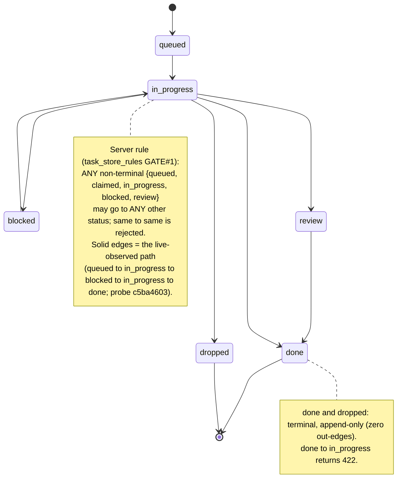

# Task-Store Discipline (canonical workflow)

**Purpose**: the day-to-day practice for using the unified task-store — when to create items, how to transition them, what stays in markdown, and what every session owes the store. This is the PIP-side Phase-2 companion to the Lupin-side service build.

**Status**: v1.7 (2026-07-07, María — §6 query-hygiene MANDATE: never pull the unfiltered board — scope `owner_persona`+`status`+`terse=True`; 90→2 collapse proof; §11-D any-open gap flagged as an OPTIONAL lupin enhancement; Rick directive after a 90-row full-board pull) · v1.6 (2026-06-29, María — §3 title-hygiene HARDENED: ~60-char target + ratified client-truncation/store-guard enforcement, task-list redesign `3b85863e`) · v1.5 (2026-06-23, María — title-hygiene convention §3 [`47ba26fd`] + non-repo receipt form §4/§10.1 [`18eebb46`], Rick board-completion push) · v1.4 (2026-06-17, María — store-only body-sweep) · v1.3 (2026-06-17, María — §0 store-only TRANSITION banner added [ratified target + not-live-until-cutover caveat] + F4 RETIRED per Rick) · v1.2 (2026-06-16, María — owner; ⚠️ §1/§2 write-gate Known-Limitation added — the harness auto-mirror silently drops non-lupin-manager writes, bug `9bf1dc4a`) · v1.1 (2026-06-15, Krishna E2E receipts + exhaustive edge matrix folded — verified behavior) — authored against design v0.4.1 (`src/rnd/2026.06.11-unified-task-store-design.md`, all rulings folded) + the committed MCP wrapper spec (Lupin `src/rnd/v0.1.8/2026.06.11-task-store-phase1/02-mcp-wrapper-spec.md`). **Syncs with the Phase-2 hook crew before freeze** — write-path hooks kick off 2026-06-12 night (ruling D3); wrapper names follow the `taskstore_*` collision review if it renames.

**When to use**: any session in a repo where the task-store is live. Store-only is **LIVE fleet-wide as of the 2026-06-17 cutover** (§0) — this doc is operative practice, not forward-guidance.

**Venue-agnostic** (Krishna, Phase-2.1 E2E note): the conventions hold identically whether the store is served on `:7999` (dev / hand-demo) or `:8000` (the integrated service) — same server code; only the backing Postgres differs. Receipts captured against `:7999` apply verbatim to `:8000`.

---

## 0. ✅ STORE-ONLY IS LIVE (cutover executed 2026-06-17)

**Ratified 2026-06-17** (Rick GO broadcast `42c3e814` + UNANIMOUS cascade review — synthesis `lupin/src/rnd/v0.1.8/2026.06.16-store-canonical-task-mgmt-cascade-review.md`; plan `src/rnd/2026.06.16-store-canonical-task-management.md`): the fleet is moving to a **store-only** task model — the native Claude Code harness task list is being **jettisoned** as a fleet-liveness substrate. One unified store, three readers (Stop-hook count-poke + arbiter + a fleet-status-style UI card); the harness→store mirror is retired. This deletes the mirror bug family (`9bf1dc4a`/`9b23d5bc`) and the dual-source-of-truth bug (`82e4eaf0`) by construction.

> **✅ LIVE as of the 2026-06-17 cutover.** The store-count poke seam shipped and the heartbeat flag `heartbeat.owed_source_from_store=True` is set + confirmed in `~/.claude/settings.json` — the Stop-hook oracle now reads the STORE, not the native transcript (cutover run by Mr Radio: `drain --apply` → store/transcript count-parity 4/4 → flag flip, strictly after which this doctrine went live per cascade rev A; the harness→store mirror is retired). The dual-write interim is OVER: **write owed work to the store via `task_create`; do NOT rely on the native harness list for liveness — query the store on demand (`task_query`) to see your list.** §1–§3 below are now store-only; the pre-cutover dual-write / harness-mirror material is explicitly fenced as 🗄️ **HISTORICAL** where it is kept as a record. The operative rule is the Mandate immediately below.

### Mandate (IN FORCE as of the 2026-06-17 cutover) — the unified store is the ONLY task list
1. You **MUST** write every unit of owed work (your tasks, work you assign, decisions, bugs, gates) to the unified store (`task_*` / `:7999`). One and only system of record.
2. You **MUST NOT** use the native harness list to track owed work — jettisoned; not a mirror source, not a fallback, not a parallel ledger.
3. **NEVER** let owed work live only in your context/head — invisible to the poke, the arbiter, the fleet.

> **Companion — why you keep the list honest.** This doc is the *mechanics* of owed work; `workflow/role-goals.md` is the *goal* those mechanics serve. "Done" in both role goals is defined against this store: a Manager is done when `task_query` over their + their workers' scope returns zero open (each closed with a receipt); a Worker transitions each assigned item to `done` with a receipt as they finish. The store is the scoreboard the goals are measured on.
4. The store **ALWAYS** wins (single source: the poke and the arbiter both read it, so they cannot diverge). To *see* your list, **query the store on demand** (a terse/projection query — cascade rev G) — never keep a second copy.
5. Keep status current with evidence: `→blocked` carries typed `blocked_by` + `next_chase_ts`; `→done` carries a receipt. No receipt → not done.
6. The human-visible list is a **UI card rendered from the store** (like the fleet-status card), **NEVER** the native widget.

**Who writes (F4 — ✅ RETIRED 2026-06-17):** ALL workers write their own owed work to the store via `task_create` (managers-first-writes is **struck** — Rick reversed his 2026-06-16 ratification via direct confirmation; `POST /api/tasks` was never manager-gated, so worker-liveness holds). See §2.

**Cutover order (cascade rev A — do NOT skip):** (1) ship the store-count seam behind a heartbeat flag, default=old transcript path → (2) drain active sessions into the store → (3) verify store owed-count == transcript owed-count per session → (4) flip the flag → store-source → (5) ONLY THEN this §0 goes LIVE + the harness→store mirror retires (evidence-gated: deprecated logged no-op until its fire-log goes quiet fleet-wide).

---

## 1. The one-sentence practice

**MANDATE — open a STORE task item for every unit of work, without being asked.** Before you start a unit of work, create a store item for it (`task_create`) and keep its status current as you go. This is a **standing, always-on reflex** — not a thing you wait to be told to do each session, and not bookkeeping for its own sake: the item IS the sign-of-life the work-owed oracle and the manager-tick loop read. A unit of work that exists only in your head — **or only in the native harness list** — is invisible to the fleet. **Scope (store-only, LIVE 2026-06-17)**: binding on ALL sessions — every persona writes its own owed work to the store (F4 "managers-first" RETIRED, §2).

**Write to the store, not the harness list.** Post-cutover the native harness list is **no longer a liveness source** and the harness→store mirror is **retired** — so the lever for your own work is the MCP `task_create` verb. To *see* your list, **query the store** (`task_query`), never keep a second copy in the harness list. *(🗄️ HISTORICAL — pre-cutover, the harness `TaskCreate` auto-mirrored to the store and was the recommended first lever; that mirror is now retired. The dual-write material below is preserved as a record, NOT a live instruction.)*

> **🗄️ HISTORICAL (pre-cutover; the harness→store mirror is RETIRED, so this defect is moot BY CONSTRUCTION — kept as a record, NOT a live instruction). ⚠️ KNOWN LIMITATION — the auto-mirror SILENTLY DROPPED writes from non-lupin-manager sessions (VERIFIED 2026-06-16, María; bug `9bf1dc4a`).** The (now-retired) myth-kill held ONLY for sessions that passed the F4 manager-figure write-gate, and that gate was mis-scoped. `manager_figure.py` `derive_project_name()` (lines 59–61) resolves the project from `LUPIN_ROOT`'s basename → **always `"lupin"`**, never the session's real project; `is_manager_figure()` (line 121) then checks the persona against `COSA_VOICE_PREFERRED_PERSONA__LUPIN` only. Consequences, both fail-CLOSED and SILENT (`not_manager` returns cleanly — no error, no log):
>  - A session in **any other project** (e.g. `planning-is-prompting`, project `plan`) — or any persona not in the lupin chain — fails the gate, so its harness `TaskCreate` items are **never POSTed** (confirmed: `task_query(project="plan")` → 0; every stored item is `project=lupin`).
>  - Even if the gate passed, the item would be **mis-stamped `project="lupin"`** (`task_store_mirror.py:360`), not the real project.
>
> **🗄️ HISTORICAL — DUAL-WRITE WORKAROUND (pre-cutover; now CLOSED — mirror retired, store-only is live).** *(Record of the pre-cutover two-consumer split, NOT a live instruction.)* The two task surfaces were read by two DIFFERENT consumers: (1) the **stop-hook self-poke owed-work oracle reads the HARNESS TRANSCRIPT** (it replays your `TaskCreate`/`TaskUpdate` calls) → this is your **LIVENESS** wake; (2) the **unified store / arbiter reads the STORE** (`task_query` / `/api/tasks`) → this is **AUDITABILITY**. (CONFIRMED 2026-06-16 by primary heartbeat-events evidence: a plan session's self-poke fired `work_owed=true` purely off its harness transcript while its store rows were zero.) So a non-lupin-manager session that needs an item to be BOTH live-visible AND auditable must write it TWICE — harness `TaskCreate` (liveness) AND an explicit MCP `task_create` mirror (auditability). Do NOT rely on the auto-mirror outside a lupin-manager session — verify with `task_query`. **Fix of record** (Mr Radio's lupin crew): derive the project from the session bridge's real project — the same source `get_session_info` returns — not `LUPIN_ROOT`.
>
> **⚠️ Related but SEPARATE — `/clear` correlation-key collision (bug `9b23d5bc`, systemic).** Even for a lupin-manager session whose writes DO mirror, the harness task counter RESETS after `/clear`, so post-`/clear` harness items reuse correlation keys (`…:1/:2/:3`) that already map to earlier store rows — the mirror UPSERTS onto and CORRUPTS the old row instead of creating a new one (observed: a new task flipped an unrelated old item to `in_progress`, no new row created). This silently corrupts EXISTING rows and is the scarier of the two mirror defects. Until fixed, after a `/clear` verify your harness items created NEW store rows (`task_query`), not overwrote old ones.

**🗄️ HISTORICAL (pre-cutover; mirror retired). Do NOT use the native harness list as your owed-work surface — write to the store (`task_create`) and query it (`task_query`).** *(Record of the retired mirror behavior:)* Whatever the harness's native surface is — the Task\* tool family (TaskCreate/TaskUpdate/TaskList/TaskGet) on current harnesses, TodoWrite on older ones — the `PostToolUse` hook mirrors it into the store via correlation-keyed upserts, no duplicates on rewrites. (Don't pin a tool name in your own practice docs either; `stop.py` §0.3 corrected the same retired-name assumption.) **One mechanical limit (Tiffany flag #3, Phase-2 contract)**: a hook-mirrored completion lands as **`review`, never `done`** — the hook has no receipts to attach, and `→done` requires them. **`done` is always an explicit, receipted act.** The disciplines below cover what the hook canNOT infer: cross-session obligations, receipts, blocks, and gates.

## 2. Who writes, who reads (F4 — ✅ RETIRED: ALL workers write)

- **Everyone READS** from day one: `task_query` is [READ]-tier, no gating.
- **ALL workers WRITE their own owed work** (F4 "managers-first" **RETIRED 2026-06-17**, Rick's direct confirmation — see §0). Every session writes via `task_create`; workers no longer wait for a manager to create+assign their items. Rationale (cascade rev H): `POST /api/tasks` is auth-only, never manager-gated — F4 lived only in the now-retired mirror — so worker-liveness holds and the store-only single-source needs every owed item present regardless of role. Enforcement stays social + audit-trail, not tool gating.
- **(🗄️ HISTORICAL — pre-cutover interim, now CLOSED):** the dual-write rule (harness for liveness + `task_create` for auditability) applied only until the store-count seam shipped. Post-cutover: **write to the store, single source.**
- **Superseded**: the old "managers-first at launch + widening rider" framing is closed — all sessions write their own owed work.
- **(🗄️ HISTORICAL — mirror retired):** the manager-figure write-gate defect (`9bf1dc4a`, project derived from `LUPIN_ROOT`) silently dropped non-lupin sessions' harness writes — moot now the mirror is retired and all sessions write directly via `task_create`.

## 3. Creating items — when an explicit `task_create` is owed

**The two creation methods, delineated — do NOT conflate them** (ruling, Rick 2026-06-16: the MCP `task_create` is **KEPT, not deleted**; its purpose is documented here as explicitly distinct from the harness method):

| Method | What it is FOR | What it mints | Reach for it when |
|---|---|---|---|
| **Harness `TaskCreate`** (native tool; auto-mirrored by the hook) | YOUR OWN work stubs | a generic, **self-owned `task`** — the mirror hardcodes `item_class="task"`, `owner_persona`=`accountable_manager`=you (`task_store_mirror.py:356–362`) | the work is yours and you will do it — the default, ~90% of items |
| **MCP `task_create`** (explicit verb) | the cases the harness mint **structurally cannot express** | a **typed** item (`decision` / `gate` / `bug` / `review_request`) and/or one **owned by another persona**, carrying structured fields (`owner_persona`, `accountable_manager`, `gate_class`, framing `body`) | assigning work to another persona · minting a `decision` for the user's court · filing a durable `bug` · raising a `gate` |

Both methods write to the **same store** — the hook POSTs to the **same `/api/tasks` endpoint** the MCP verb uses; they differ ONLY in *expressiveness*, not destination. **The MCP verb is NOT a "more durable" or "more proper" way to create your own stub** — for your own work it is strictly redundant with, and costlier than, the harness tool (schema tool-search + call + confirm-query vs. one native call). *(Forward note: an experiment to teach the harness mirror to read `metadata.item_class` / `owner_persona` / `gate_class` may later let the harness express the typed/assigned cases too — at which point the MCP verb is revisited. Until that lands and proves out, the verb stays as the only path for the right-hand column.)*

**Title hygiene (MANDATE — title = one imperative line ≤ ~60 chars; detail → `body`).** A task's `title` is a short, one-line imperative LABEL (~one phrase, **target ≤ ~60 characters**), NOT a description field. All descriptive / context text — provenance, options, rationale, repro steps — goes in `body`. Paragraph-length titles are an anti-pattern: they wreck the terse board glance (`task_query(terse=True)`) and the `/plan-decide` framing (both surface the title alone), and — per the 2026-06-29 task-list row redesign — the notifications + multiplexer clients now render the title in a fixed row beside an 8-char `id_hash` ID column and a 📄 detail affordance. **Rollout is convention-forward, not a big-bang re-cut**: write new rows short; backfill an over-long title opportunistically when its row is next touched (a wholesale re-titling pass is just churn). **Enforcement is ratified + landing, no longer deferred** (task-list redesign, lupin `3b85863e`): the clients **truncate the title to ~60 + ellipsis** (full text on hover), and `task_create` will **soft-trim** an over-long title to ~60 and move the overflow into `body` when `body` is empty (**non-rejecting** — your write never fails, but a paragraph-title silently loses its tail from the visible label). So write a short title, or the system shortens it for you. (This very doc's rows model it: e.g. `47ba26fd` carries a short title with all detail in its body.)

The hook covers your own harness task list. Create EXPLICITLY via the MCP verb when the obligation is **cross-session or durable beyond your list**:

| Situation | item_class | Notes |
|---|---|---|
| Work you assign to another persona | `task` | `owner_persona` = them, `accountable_manager` = you |
| A decision Rick must rule | `decision` | framing payload (options/pros/cons/rec) in `body`; feeds `/plan-decide` |
| A review you request by DM | `review_request` | the qid→auto-create path (T4) is DESIGNED, not yet built (cold-review C10, open — verified 2026-06-16: the only server-side `create_item` caller is `POST /api/tasks` itself); until it lands, create manually via the MCP verb |
| A bug worth surviving the session | `bug` | bug-fix-queue.md folds in later; until then file BOTH (queue stays canonical for bug-fix-mode) |
| A user-gated boundary you're holding | `gate` | `gate_class=ricks_court` makes Rick's court a query |

Identity (`created_by`/`actor`) is bridge-stamped — never a parameter, never spoofable.

### 3.1 Filing hygiene — INLINE THE DECISIVE EXCERPT (binding on every seat)

> **When a row's NEXT STEP depends on an artifact, paste the decisive excerpt INTO the row body at filing time.** A path is not evidence. `/tmp` paths, session scratchpads, worktrees and `--bg` log files are all EPHEMERAL by construction: the row outlives them, and a NEXT STEP pointing at a vanished file is a row that expired without saying so.

Ruled 2026-07-21 (Mr. Radio 🦉), store row `644313b9`, effective immediately.

**THE REASON IS AN ASYMMETRY, NOT TIDINESS** — and the asymmetry is the whole argument:

| | cost |
|---|---|
| the FILER, artifact in hand | **seconds** — one paste |
| the PICKER-UPPER, artifact gone | **hours**, PLUS a scheduling dependency to regenerate it (in the founding case, a manager-gated quiet-tree window — a scarce resource) |

⇒ **The cost lands on the person with the least context and the least ability to pay it.** That is what makes it a rule rather than a preference.

**Rejected alternatives, recorded so they are not re-proposed:** moving artifacts to a durable path only MOVES the rot (something still has to survive, and nothing guarantees it); building machinery to snapshot artifacts buys tooling for a problem that does not recur often enough to earn it; and "just regenerate it later" has already cost the fleet once.

⚠️ **THE RULE APPLIES TO ITS OWN RULING.** Row `644313b9` was deliberately NOT closed when this was ruled, because at that moment the ruling existed only in a DM and in outgoing spawn briefs — *an unwritten convention, which is precisely the failure mode the row was filed about, one level up.* Closing on "it was ruled" would have made the doctrine the next artifact to expire silently. **This section IS the close condition.** A seat that never saw the DM now files correctly.

## 4. Transitions — the receipts discipline

- **`→done` REQUIRES `receipt_refs`** — key-whitelisted + shape-validated server-side (`commit` 7–40 hex · `qid` uuid · `test_run` id · `doc_path` exists · `log_line` `<path>:<lineno>` exists). A bare "trust me" completion is REJECTED with the server's errors verbatim. This is the no-confabulation rule, mechanized: if you can't cite a receipt, the work isn't done.
- **Receipt path SHAPE is enforced** (VERIFIED 2026-06-15, Krishna E2E): `doc_path`/`log_line` must be `<registered-scope>/<rel-path>` — a bare `src/rnd/…` → `422` *"receipt path scope 'src' is not a registered repo scope"*; `log_line` must end `:<lineno>`. Cite receipts as `lupin/src/…:NN`, never bare `src/…`. (Worked example: §10.1 Rejection B.)
- **Non-repo artifacts have NO repo-relative path — cite `qid` or `commit`, never a path key.** A `~/.claude` task (e.g. a MEMORY.md compaction, file at `~/.claude/projects/<slug>/memory/MEMORY.md`) lives outside every registered repo tree, so it has no `<scope>/<rel-path>` form — a `doc_path`/`log_line` for it is REJECTED (`422` *"scope 'memory' is not a registered repo scope"*). The **sanctioned receipt for a non-repo completion is a non-path key — `qid`** (a DM / question correlation id, e.g. the done-ping that announced the work) **or `commit`** — neither is scope-validated. This is the standing answer today; a dedicated abs-path / synthetic `home`-scope receipt form is a deferred lupin-side follow-on (do NOT block a non-repo `→done` waiting on it). (Worked example: §10.1.)
- **`→blocked` REQUIRES BOTH** ≥1 typed `blocked_by` ref (`{kind: item|persona|user, id}`) AND `next_chase_ts` — a blocked item says what it waits ON and when it will be chased. No "pending X" graves. `{kind:user}` ⇒ the oracle treats it as not-owed (STALL ≠ QUIET).
- **`done` and `dropped` are TERMINAL** — no transitions out; corrections are a new item linking the old id.
- **`→dropped` REQUIRES a reason — ENFORCED** (C12 pulled forward, Tiberius-ruled 2026-06-12 after Tiffany's wire-gap flag): `task_events` carries a nullable `reason` column; the server rejects a reasonless drop. The escape hatch around the receipts rule is closed.
- **`authority` rides every write** (`standing` | `user_direct` | `manager_relay`) — the blast-radius model joins the audit trail.

### 4.1 A DEPENDENCY WORTH BLOCKING ON GETS A ROW (binding on every seat)

**If you would not file it, you may not block on it.** A precondition named only in prose — *"until the demos ship"*, *"blocked on Cheech's Phase-1 probe"*, *"pending Rick's ruling"* — cannot be scheduled, chased, transitioned, or resolved by anything. It is a wait with no counterparty.

⇒ **Mint the precondition as an item and point `blocked_by` at it.** That is the whole rule.

**Why it is a rule and not a check.** Lupin row `00a6bde2` split the problem in two, and only one half is machine-detectable:

| arm | shape | detectable? |
|---|---|---|
| **(A)** body cites an **id** — *"waiting on `86ce4c43`"* | resolvable | ✅ scanner shipped (`scan-prose-task-refs.py`) |
| **(B)** body cites a **premise** — *"until the demos ship"* | no token to resolve | ❌ **nothing can find it, ever** |

**(B) is not a detection problem. It is an authoring one.** No oracle can be built for it, because the dependency was never written as anything a machine can follow. The only instrument is this rule, applied when the row is written.

⚠️ **AND A CLEAN (A) SCAN IS NOT A CLEAN BOARD.** The scanner reports what it examined precisely because a green result over the id-citing arm reads as *"no dangling preconditions"* while the entire unscannable (B) half sits underneath it. Measured on one live board: **5 canonical citations against 531 abbreviated 8-hex tokens** the tier deliberately refuses to resolve. The examined surface was two orders of magnitude smaller than the unexamined one.

**The worked instance.** `31f6d447` was blocked on a precondition that existed only as a sentence in its own body. The remedy was to mint it as `e919d895` and re-point the edge — and **that mint is the fix for the class, not merely for that row.**

**Corollaries, each earned by a live failure:**

- **A premise-scoped instruction has an expiry nothing reads.** *"Do not chase Rick on it"* was true when written and false eight minutes later — the order had been scoped (*"until we get our demos ready for Monday"*) and the clause that bounded it was dropped in the retelling. **Carry the bound with the instruction or the instruction outlives its reason.**
- **A `{kind:persona}` edge should carry `session_id`** (lupin `70b354a0`, 2026-07-27). Overflow persona names are re-granted after a reap, so a bare-name edge can silently re-point at a different session and be "satisfied" by someone who never had the context — a false GREEN, not a false wait.
- **Prefer `dropped`-with-a-reason over hard deletion.** A dropped row reads as DEAD; a deleted one reads as UNRESOLVED, which is indistinguishable from a typo. **Only one of those is a finding.**

## 5. The truth boundary (F3 — what stays markdown)

| Surface | Role under the store |
|---|---|
| **Store** | CANONICAL for live work — machines read ONLY this |
| **TODO.md** | durable human narrative + sections RENDERED from the store (session-end); narrative prose stays hand-authored; **never hand-edit a rendered section**, fix the store |
| **Harness TaskList** | **RETIRED as a liveness/seed surface (store-only, 2026-06-17)** — query the store on demand (`task_query`); do not seed or maintain the native list as owed-work |
| **bug-fix-queue.md** | canonical for bug-fix-mode until its fold-in phase |
| **history.md / src/rnd** | unchanged — completion record + design record |

## 6. Query patterns (R4 — determinism is the point)

**MANDATE — NEVER pull the unfiltered board; scope every read.** A bare `task_query()` returns the ENTIRE store — every persona, every status, all history (`done`/`dropped` included) — and it grows without bound. Using it to answer "what do I owe" is a token-burn anti-pattern: it dumps hundreds of terminal rows to surface one open handful. **Always scope by `owner_persona` + `status`, and always pass `terse=True`** unless you specifically need a row's `body`. *(Live 2026-07-07, the case that prompted this hardening: a manager asked for his open items pulled ~90 rows; `owner_persona=<self>` returned 89, of which **only 2 were non-terminal** — `status`-scoping collapses the wall ~45×, and `terse=True` further shrinks each surviving row to the id/title/status/priority projection — the terse flag's whole purpose.)*

- **My owed work — the daily reflex:** `task_query(owner_persona=me, status="in_progress", terse=True)`, then a second `status="queued"` pass (+ `blocked` if you hold blocked items). This is the ONLY read you need to see your list — do NOT glance the whole board to find your own rows.
- **Manager board glance:** `task_query(terse=True)` — terse ALWAYS; add `accountable_manager=me` to scope to your lane and `status=` to drop terminal rows. Reserve the unfiltered, non-terse form for a **deliberate audit**, never a routine glance.
- **Rick's court:** `task_query(gate_class="ricks_court")` (naturally small).
- **Fleet owed-work (arbiter/oracle):** same queries via REST — the oracle consumes the SAME store (T7), fail-open on store-down (I1: the Stop-hook path never blocks on the store).

**Known filter gap (§11-D) — no one-shot "any-open" set.** `status` is single-value exact-match, so there is no single filter for "all non-terminal." To see ALL your open work, either run the cheap terse passes above (`in_progress` → `queued` → `blocked`) or query `owner_persona=me, terse=True` and drop the terminal rows client-side. A native `status__in` / `any_open` filter is an OPTIONAL lupin-side enhancement (logged §11-D) — a convenience, NOT a blocker; the scoped two-pass already collapses the board.

### 6.1 STEP 0 — a scoped NON-terse read before the first action in a domain

> **`terse=True` is right about tokens and SILENT about load-bearing bodies. This subsection is the mechanism that covers the gap — not a reminder to be careful.**

**THE TENSION, stated plainly.** §6 mandates `terse=True` for every board glance and says to reach for the full shape *"only when you actually need a row's body."* **You cannot know a body is load-bearing from its title. That is the entire failure mode** — a scoped instrument (`terse=True`) sitting beside an unscoped obligation (know what you owe · know what has already been done · know who holds the seat).

**WHAT IT COST, once, measurably** (store row `5a8aa45b`, filed by Sam against himself 2026-07-16). A terse glance returned the title *"gpt-oss STREAMS ITS CHAIN-OF-THOUGHT — a naive judge harness"*. He read it as a parked warning for a future builder. The body he did not open carried **an already-completed live probe of both judges** and **a standing order naming who may make GCP spend calls.** He re-ran the finished experiment, and violated an order he had never read — *in the sentence the order forbids* (*"don't reason your way to 'this one's cheap and safe'"*). **A standing order lives in a BODY. It is invisible to the query the doctrine tells you to run.**

**⚠️ AND A TITLE CAN BE FALSE, NOT MERELY LOSSY — PERMANENTLY.** Row `8fc44a98`'s 60-char title asserts *"3 already sent outsi[de]"*. Nothing was ever sent anywhere; the full retraction is in the body. That row is now `done` — **terminal, so it cannot transition; `task_amend` appends to body only; there is no title-edit verb; and the prescribed repair was drop-and-recreate, which a `done` row cannot accept.** Every mandated terse glance shows the falsehood and nothing shows the correction, and **no mechanism this store has can now fix it.** Three correct rules — terminal means terminal, amend appends, titles are capped — compose into a remedy nobody can reach.

### ⇒ THE MECHANISM

> **Before the first build / probe / spend action in a domain, run ONE `task_query` scoped to that domain with `terse=False`, and read the bodies. Write it into the plan document AS A NUMBERED STEP.**

```python
# Step 0 of the plan — narrow filter, full bodies. NOT the unfiltered board.
task_query( project="<domain>", status="queued", terse=False )
```

**Three properties, and each is doing work:**

1. **SCOPED, so it is affordable.** The filter is narrow — this does NOT re-open the unfiltered board §6 rightly forbids. The anti-pattern §6 kills is the *unscoped* read, not the *un-terse* one, and conflating those is what left this gap open.
2. **NUMBERED, so it is a step and not a virtue.** An obligation that lives only in a seat's judgment is discharged by the seat that feels prepared — which is exactly the seat that skips it.
3. **IN THE PLAN DOC, so someone ELSE can see whether it ran.** This is the load-bearing property. The failure it prevents is *"I did not know what was already known,"* and **a seat cannot audit itself for what it never saw.** Putting the step in a reviewed artifact moves the check to a reader who can compare the plan against the board — the same structure as any reporting-honesty control (see cross-session-communication.md §4.6).

**WHEN IT APPLIES:** any plan that will spend, probe a metered or shared surface, touch another seat's lane, or build in a domain where prior work may exist. **NOT** every conversational turn — the daily owed-work reflex in §6 stays terse.

---

## 7. Correlation — what sessions must know

- Same-subject rewrites UPSERT (no duplicates); a changed subject supersedes (old item `→dropped` reason `superseded-by-rewrite`). On Task\*-tool harnesses the hook payload carries the stable harness task id, so derivation precedence (a) applies universally and the (b) content-hash fallback is dormant (Tiffany flag #2).
- `/clear` re-correlates via the STABLE session id — your list survives rehydration.
- **Cross-SESSION respawn does NOT auto-correlate** (successor hashes to its own sid): at session-start seed, ADOPT inherited items via the audited `POST /api/tasks/{id}/correlate` endpoint (ruled 2026-06-12 — re-registers your harness task id onto the item's `correlation_key`, with the adoption on the event trail). A respawned session that skips adoption forks items — fail-visible by design.

### 7.1 The epic layer — `correlation_key` also groups rows into stories (2026-08-18)

**Why it exists.** Rick, 2026-08-18: *"Because the task list is largely opaque to me… I can't keep track of our larger high level endeavors… I think I'm missing something like the epic that described a higher level use case while the bug reports tied in to it."* A flat list of 37 rows hides which ones are one story. Grouping them puts the answer in a field, so a roll-up is a **render** instead of an act of memory.

**The rules, five of them:**

| # | Rule | Why |
|---|---|---|
| 1 | Every row names its epic at `task_create` — the verb already takes `correlation_key` | Costs one argument; retrofitting costs an evening |
| 2 | Format is `epic:<short-kebab-slug>` | **The prefix is load-bearing** — it is the only thing that distinguishes an epic key from an adoption key |
| 3 | No blanks. Work belonging to no epic gets `epic:unassigned` | **A blank is indistinguishable from forgetting**, and a rule you cannot audit is a preference |
| 4 | Only a **manager** mints a new epic; workers pick an existing one or use `epic:unassigned` and say so | An epic layer with forty epics is the flat list again |
| 5 | The page is regenerated from the field, never hand-edited | Two answers is worse than none |

⚠️ **THIS FIELD NOW HAS TWO WRITERS, AND §7 ABOVE IS THE OTHER ONE.** Cross-session respawn adoption stamps `cc-task:<sid>:<harness-id>` into the same `correlation_key`. **A successor that adopts an inherited row destroys that row's epic key.** Adoption is existing, correct practice — this is a genuine collision, not a hypothetical. The `epic:` prefix is what turns it from silent data loss into something the audit below names.

⇒ **The real fix is a dedicated `epic` column plus `epic` in `VALID_ITEM_CLASSES`**, so an epic can be a row carrying its own story and adoption cannot clobber it. Until then the audit is the control.

#### The audit — a SET DIFFERENCE, not a filter

**The obvious query does not work, and knowing why saves the next reader an hour:**
- `terse=True` does **not** return `correlation_key` (the projection is id / title / status / blocked_by / next_chase_ts / priority / park_reason_stale), so a terse read cannot see the field at all.
- `task_query(correlation_key=…)` is **exact-match only**. There is no `NOT LIKE 'epic:%'`, so drift cannot be queried for directly.
- Reading non-terse to see the field returns every row's full body — tens of thousands of tokens. Impractical as a routine check.

**So invert it.** Take the full non-terminal list terse (cheap), take each known epic terse (cheap), and difference the id sets:

```python
all_rows = task_query( unscoped_audit=True, terse=True, include_parked=True, limit=300 )
grouped  = set()
for key in KNOWN_EPIC_KEYS:                      # keep this list in the roll-up doc
    grouped |= { t["id"] for t in task_query( correlation_key=key, terse=True,
                                              include_parked=True )["tasks"] }
drift = { t["id"] for t in all_rows["tasks"] } - grouped
```

Anything in `drift` either was minted without an epic or had its epic key overwritten by an adoption. Both are the failure this catches.

🔴 **`include_parked=True` IS MANDATORY ON BOTH SIDES.** Park-active rows are hidden by default, and a parked row **rejoins the owed count automatically** when its chase passes — arriving epic-less if the audit never saw it. Measured 2026-08-18: the default-scoped read returned **28** rows and the parked-inclusive read returned **37**. Nine rows, including a P1, were invisible to an audit that would otherwise have certified the board clean.

#### It is automated — you do not run this by hand

`workflow/scripts/generate_epic_board.py` does the whole thing and writes **`docs/epic-board.md`** — a fixed path, so the doc-viewer URL is stable and a browser tab can stay open on it:

```
/app/docs?path=planning-is-prompting/docs/epic-board.md
```

A crontab entry (`# epic-board`) regenerates it every 10 minutes, so an open tab is stale by at most that; the page carries its own **generated-at stamp and row count on the first line** so staleness is visible rather than assumed. `/plan-board` regenerates on demand. Cron was chosen over a SessionStart hook deliberately: it keeps the board fresh when *nobody* is live, which is exactly when a person sits down and opens the tab.

**The script does NOT use the set difference above.** It reads every row non-terse and groups on the real field, because a script can afford the full bodies and an agent's context cannot. The set difference exists for the in-context check; the script is the better instrument and should be preferred whenever you can shell out.

⚠️ **Three query traps, all measured, all of which yield a confident wrong board** — they are documented at length in the script's own docstring, and each has a test that goes red when the trap returns:
1. The REST parameter is **`hide_parked=false`**, not `include_parked=true` — that is the *MCP argument name*, and FastAPI **silently drops** it. Without it, 9 park-active rows vanish, including a P1. (I hit this myself while building the tool meant to catch it; a deliberately bogus parameter returned the identical count, which is how it surfaced.)
2. A non-terse read **truncates at a 100,000-char budget** — `limit=500` returned 13 of 31. The script paginates and reports if it could not drain.
3. A terse read **does not carry `correlation_key`** at all, so terse cannot build this board.

The only hand-maintained input is `workflow/epic-stories.json` — epic key → title + one-line story. A manager minting an epic adds its line in the same turn.

#### Falsify it before trusting it — ✅ BOTH CONTROLS RUN, 2026-08-18

**An audit nobody has watched fire is a comment with a green tick.** So it was watched, both ways, on the live store:

| # | Control | Result |
|---|---|---|
| 1 | Mint a row with **no** `correlation_key` (`8b6b05be`) | ✅ named in `drift` |
| 2 | `task_correlate` a `cc-task:…` key over a live epic key (`697a85fe`) — a **simulated §7 adoption** | ✅ named in `drift`; its epic went 3 rows → 2 |

**The arithmetic**: full non-terminal list = **38**, the twelve epic queries summed to **36**, `drift` = exactly those two ids and nothing else. No false positives.

Both restored in the same turn — `697a85fe` re-stamped (event 7940), the probe row `→dropped` with its reason (event 7941). Control-2 is the important one: it is the **only** proof that an adoption silently eating an epic key is detectable rather than invisible.

⇒ **Re-run both after any change to the audit.** A set difference that stops naming a planted row has stopped working, and it will fail silently — the same shape as the block-mode guard that recorded 88 outbound connections and passed everything.

## 8. Failure modes

- Store down → READ paths fall back to files (I1), WRITE paths must not silently drop (hook timeout + spool + replay — Phase-2 C8); a session that can't write FLAGS ONCE, never fakes.
- Non-compliance (a session not writing) = practice bug, not liveness signal (I4): fail-open + flag-once.

## 9. Legal transition graph (server-enforced)

VERIFIED 2026-06-15 (Krishna E2E, probe `c5ba4603` on `:7999`; venue-agnostic — identical on `:8000`). The item-status state machine **as the server enforces it**, from `task_store_rules` (ratified GATE#1):

- **States** — non-terminal: `queued`, `claimed`, `in_progress`, `blocked`, `review` · **terminal**: `done`, `dropped`.
- **Rule**: every non-terminal status may transition to every OTHER status. `done` and `dropped` are **append-only sinks** (zero out-edges). A no-op (`same → same`) is rejected.
- **Terminal lockout OBSERVED**: `done → in_progress` → `422` → *"item is terminal ('done') — done/dropped are append-only, no transitions out"*.


```mermaid
stateDiagram-v2
    [*] --> queued
    queued --> in_progress
    in_progress --> blocked
    blocked --> in_progress
    in_progress --> review
    review --> done
    in_progress --> done
    in_progress --> dropped
    done --> [*]
    dropped --> [*]
    note right of in_progress
      Server rule (task_store_rules GATE#1):
      ANY non-terminal {queued, claimed, in_progress, blocked, review}
      may go to ANY other status; same to same is rejected.
      Solid edges = the live-observed path
      (queued to in_progress to blocked to in_progress to done; probe c5ba4603).
    end note
    note right of done
      done and dropped: terminal, append-only (zero out-edges).
      done to in_progress returns 422.
    end note
```

> **Verification scope — EDGE-VERIFIED (v1.1, exhaustive)**: Krishna probed every edge live (2026-06-15, self-cleaning on `:7999`, 37 probe tasks). The 5 non-terminal states form a **fully-connected digraph** — every non-terminal → every other state returns `200` (30/30). **Rejected `422`**: every no-op (`same → same`, all 5) and every terminal-source edge (`done`/`dropped` → anything — zero out-edges, append-only sinks). **Payload-gated** (legal, extra fields required): `→done` (`receipt_refs`), `→blocked` (`blocked_by` + `next_chase_ts`), `→dropped` (`reason`). Venue-agnostic to `:8000`. *Dev-hygiene*: the store is append-only (no DELETE on terminal rows), so labeled `edge-probe` rows persist in `task_query` results — expected history, not pollution.

## 10. Worked examples

VERIFIED 2026-06-15 (Krishna E2E on `:7999`, probe `c5ba4603`; audit event ids 58–62, queryable; venue-agnostic — identical on `:8000`). Every call + response below is a **real server response**, observed verbatim.

> **Two different mechanisms — don't conflate them** (Krishna's distinction, after Rick hit the confusion live): **citing a task to a commit / PR / DM** is `receipt_refs` at `→done` time (§10.1) — Rick's phrase *"correlate to a commit"* maps HERE. **`task_correlate`** is separate: it re-stamps the item's IDENTITY / upsert key for **cross-session respawn adoption** (§10.3). One proves the work; the other stops a respawned session from forking the item.

### 10.1 The receipt-on-done gate (receipt #1)
- **Accepted** — `→done` with `receipt_refs = {"commit":"0ca22758", "doc_path":"lupin/src/rnd/v0.1.8/2026.06.15-task-store-phase2.1/01-build-plan.md", "log_line":"lupin/…/01-build-plan.md:115"}` → `200`, persisted verbatim in the audit event.
- **Whitelisted keys** (≥1 required): `commit`, `test_run`, `qid`, `doc_path`, `log_line`.
- **Rejection A (empty)** → `422` → *"receipt_refs must be a non-empty object with at least one whitelisted key ('commit', 'test_run', 'qid', 'doc_path', 'log_line')"*.
- **Rejection B (path shape)** → `422` → *"receipt path scope 'src' is not a registered repo scope"* + *"receipt log_line … must be '<scope>/<rel-path>:<lineno>'"*. ⇒ cite as `<registered-scope>/<rel-path>` with `log_line` ending `:<lineno>`; never a bare `src/…`. (See §4.)

### 10.2 The `→blocked` path (receipt #2)
- **Rejection (missing both)** → `422` → *"next_chase_ts is REQUIRED when transitioning to 'blocked' (I3 — no 'pending X' graves)"* + *"blocked_by must be a non-empty list of typed refs [{kind, id}]"*.
- **Accepted** — `blocked_by=[{"kind":"persona","id":"maria"}]`, `next_chase_ts="2026-06-16T09:00:00-04:00"` → `200`, both persisted. Typed-ref `kind` ∈ `item | persona | user`.

### 10.3 Cross-session adoption via `task_correlate` (receipt #4)
- **Accepted** — `task_correlate(correlation_key="cc-task:7e8fb0d6:demo-worked-example")` on a non-terminal item → `200`; audit event `transition="re-correlated"`, `reason="correlation_key: None -> cc-task:7e8fb0d6:demo-worked-example"`.
- **Use** — a respawned successor session ADOPTS an inherited item (re-stamps its identity/upsert key) instead of forking a duplicate. This is §7's cross-session-respawn adoption, mechanized.

### 10.4 A full lifecycle walk (synthesis)
- Walked live (probe `c5ba4603`, event ids 58–62): `queued → in_progress → blocked → in_progress → done` — the `→blocked` fields from §10.2, the `→done` `receipt_refs` from §10.1, then the §9 terminal lockout confirming `done` is a sink. Cross-session adoption (§10.3) overlays at any non-terminal point.

## 11. Known gaps & friction (living — Krishna's adoption-gaps inventory)

Daily-use friction + known gaps live in a separate, living inventory Krishna authors + owns (hub-spoke; keeps this doc prescriptive): **`lupin/src/rnd/v0.1.8/2026.06.15-task-store-phase2.1/02-adoption-gaps-inventory.md`** (in progress, 2026-06-15). Open items surfaced so far — each a Rick go/no-go, NONE closed without his word:

- **(A) Discoverability** — ZERO pointer to the tools / this discipline doc in project OR global `CLAUDE.md` (the biggest adoption blocker; a `CLAUDE.md` pointer block is being recommended to Rick).
- **(D) Query ergonomics** — single status filter only: no any-open set, no owner-OR-accountable, no title search (§6's patterns are thinner than daily use wants).
- **(E) Chase consumer is flag-OFF** + `start()` not wired into boot — a `→blocked` item records `next_chase_ts` but **nothing chases it yet**; the §4/§10.2 blocked discipline is recorded-but-inert until this lands.
- **(F) Write-scope widening** — the F4 managers-first rider (`manager-autonomy.md` §2.1) is arguably triggered now Phase-2.1 is green; surfacing as a Rick decision (cross-ref the TODO double-anchored widening follow-up).

(B) receipt path-scope shape and (C) `receipt_refs`-vs-`task_correlate` are **handled in this doc** (§10.1 Rejection B + the §10 mechanism-distinction callout); the inventory cross-refs them rather than duplicating.

---

## Cross-references

- Design of record: `src/rnd/2026.06.11-unified-task-store-design.md` (v0.4.1)
- MCP wrapper contract: Lupin `src/rnd/v0.1.8/2026.06.11-task-store-phase1/02-mcp-wrapper-spec.md`
- Manager predicate + fleet allocation: `workflow/manager-autonomy.md` §2.1, §7
- Session-end TODO.md render integration: `workflow/session-end.md` (Phase-4 addition lands there, not here)
- Decision items: `workflow/decision-walkthrough.md` (`/plan-decide` reads `item_class=decision`)

## Version History

- **v0.1 (2026-06-12, María)** — DRAFT authored S109 under Rick's AFK push directive, ahead of the Phase-2 write-path kickoff (D3) so the hook crew builds against stated practice. Pending: hook-crew sync, `taskstore_*` naming review, Phase-4 session-end §-addition.
- **v0.2 (2026-06-12, María)** — pre-freeze sync FOLDED same-hour (the read-before-freeze loop working as designed): Tiffany flags ×3 (harness Task\* vs retired TodoWrite naming → generalized to harness-task-list-first per Tiberius's steer · hook-mirrored completion lands `review` never `done`, done = explicit+receipted act · dropped-reason wire gap) + Tiberius rulings ×2 (C12 pulled forward — `task_events.reason` + dropped-requires-reason now ENFORCED · audited `POST /api/tasks/{id}/correlate` adoption endpoint closes the cross-session respawn residual).
- **v0.3 WIP (2026-06-15, María — owner, S110-cont-2)** — ownership confirmed (Rick tapped María to own the daily-use conventions doc; Krishna coordinates + feeds verified semantics from the live Phase-2.1 E2E). Stood up two scaffolds for the v0.2→v1.0 evolution — §9 legal-transition-graph (server-enforced; mermaid pending) + §10 Worked Examples (4 placeholder subsections matching Krishna's 4 receipts) — both held as **visibly-empty PENDING-RECEIPT placeholders** (no-confab). Added the venue-agnostic note (`:7999` hand-demo == `:8000`; same server code, only the backing Postgres differs — Krishna). **The provenance shift is the point of v1.0**: §4/§7's design/spec-derived rules become VERIFIED behavior when Krishna's green receipts (accepted `receipt_refs` shapes + verbatim `422` + transition matrix + correlate sequence) fold in. Pending: those receipts → v1.0 bump.
- **v1.0 (2026-06-15, María — owner, S110-cont-2)** — Krishna's GREEN E2E receipts FOLDED (probe `c5ba4603` on `:7999`, audit events 58–62; venue-agnostic to `:8000`). §9 transition graph → verified mermaid (live-observed path + `done` terminal-lockout `422` + the `task_store_rules` GATE#1 enum rule). §10 Worked Examples filled verbatim: receipt-on-done gate with TWO real `422`s (empty + path-scope shape), `→blocked` required-fields, `task_correlate` cross-session adoption — with Krishna's mechanism-distinction (cite-to-commit = `receipt_refs`; `task_correlate` = adopt-across-sessions) split into separate subsections. §4 gained the receipt path-scope shape rule (`<scope>/<rel>:<lineno>`, never bare `src/…` — bonus finding, not in the build-plan prose). NEW §11 Known gaps & friction pointer → Krishna's living adoption-gaps inventory. Provenance shift COMPLETE: design-derived → verified. Open (→ v1.1): Krishna's exhaustive per-edge probe (upgrades §9 to edge-verified) + the §11 gap go/no-gos (Rick).
- **v1.1 (2026-06-15, María — owner, S110-cont-2)** — Krishna's EXHAUSTIVE edge matrix folded (37 probe tasks, self-cleaning on `:7999`): §9 verification-scope upgraded from rule-derived to **edge-verified** — 5 non-terminals = fully-connected digraph (30/30 `200`), no-op + terminal-source edges `422`, the 3 payload-gated edges (`→done`/`→blocked`/`→dropped`). Added the append-only probe-row dev-hygiene note. §9 is now ground-truth, not enum-cited. Remaining open: §11 gap go/no-gos (Rick).
- **v1.7 (2026-07-07, María — owner)** — **§6 query-hygiene MANDATE** (Rick directive, voice, 2026-07-07). Root cause: a manager asked for his open items and `task_query()` returned the whole board (~90 rows) — because the read was unfiltered, not because the API can't filter. Confirmed the capacity already exists (`owner_persona` + `status` + `terse=True`) and proved the collapse live: `owner_persona=<self>` → 89 rows, **only 2 non-terminal**. Hardened §6 from a thin patterns list into a **narrow-filter MANDATE**: never pull the unfiltered board; scope every read by owner+status and always pass `terse=True`; the "my owed work" reflex is two cheap terse passes (`in_progress`→`queued`), not a board glance. Documented the §11-D gap (single-value `status`, no one-shot "any-open" set) as an OPTIONAL lupin enhancement, explicitly NOT a blocker. Discoverability pointer (global CLAUDE.md, closing §11-A) + a possible task-query-hygiene skill are drafted as RECOMMENDATIONS for Rick (global-config blast radius; held for his nod). Surfaced in the same session as model-field bug `35bdd68f` (done, lupin `c3144d18`).
- **v1.6 (2026-06-29, María — owner)** — **§3 title-hygiene hardened for the task-list row redesign** (design `e22c78ba`, lupin impl `3b85863e`; Rick-ratified via guided walkthrough). Added the concrete **≤ ~60-char title target**, and replaced v1.5's "optional/deferred soft-enforcement" note with the now-**ratified + landing** enforcement: both clients truncate the title to ~60 + ellipsis (full text on hover) beside an 8-char `id_hash` ID column + 📄 body-overlay, and `task_create` will soft-trim an over-long title to ~60 + move overflow into `body` when empty (non-rejecting). The net rule is unchanged (short imperative title; detail → `body`) — the teeth are now real. Plan: `src/rnd/2026.06.29-task-list-row-redesign-id-title-limit-body-overlay.md`. HELD for commit.
- **v1.5 (2026-06-23, María — owner)** — **Task-store conventions pass (Rick's board-completion push).** Landed the two governance items in one coherent edit. **§3: title-hygiene MANDATE** (`47ba26fd`) — `title` = one short imperative line (~one phrase); all descriptive/context text → `body`. Paragraph-titles wreck the terse board glance + `/plan-decide` framing (both surface the title alone). Rollout is convention-forward (write new rows short; backfill an over-long title opportunistically when next touched — no big-bang re-cut = churn); optional write-seam length-warning (flag-not-block) is a deferred lupin-side follow-on. **§4 + §10.1: non-repo receipt form** (`18eebb46`) — `~/.claude` artifacts (e.g. MEMORY.md compaction) have no `<scope>/<rel-path>`, so a `doc_path`/`log_line` is `422`-rejected ("scope 'memory' is not a registered repo scope"); the sanctioned receipt is a non-path key — `qid` or `commit` — neither scope-validated. A dedicated abs-path / synthetic `home`-scope form is a deferred lupin-side follow-on; do NOT block a non-repo `→done` on it. Both items deconflicted with Mr Radio's crew under Rick's board push (governance lane = María; mux/arbiter = his crew / Tiberius). No prior content altered.
- **v1.4 (2026-06-17, María — owner)** — **Store-only body-sweep (Rick GO, post-cutover).** v1.3's §0 LIVE banner was accurate but §1/§2/§5 bodies still read harness-first + dual-write in live voice (flagged by the 2026-06-17 fresh-eyes review, Finding 2 — `src/rnd/2026.06.17-store-only-fresh-eyes-review-findings.md`). Swept: §1 mandate → store `task_create` for ALL sessions (F4 retired); myth-buster → store-only with the retired harness-mirror lever fenced 🗄️ HISTORICAL; the `9bf1dc4a` Known-Limitation dual-write block fenced HISTORICAL (mirror retired → moot by construction); §2 interim/dual-write bullets fenced HISTORICAL; §5 Harness-TaskList row → RETIRED as a liveness/seed surface; When-to-use → operative, not forward-guidance. No bug-history deleted — preserved under explicit HISTORICAL fences. Part of the cross-surface doctrine sweep (task `0a63a384`): siblings session-start.md, claude-config-global.md + live `~/.claude/CLAUDE.md`, manager-autonomy.md, README.md, memento-management.md.
- **v1.3 (2026-06-17, María — owner)** — **Store-only transition landed (doctrine-first, not-live-until-cutover).** Added **§0 TRANSITION banner**: the ratified store-only target (Rick GO `42c3e814` + unanimous cascade), the 6-rule target mandate, the 🚧 not-live-until-cutover caveat (cascade rev A — keep dual-writing; do NOT stop `TaskCreate` before the seam ships or a session goes dark), and the 5-step cutover order. **§2 F4 RETIRED** — all workers write their own owed work via `task_create` (Rick reversed his 2026-06-16 managers-first ratification; `POST /api/tasks` was never manager-gated). §1/§3's harness-first + dual-write guidance is PRESERVED as the operative interim until cutover; it sheds the harness-first framing only when Lane A ships. Build tracking: plan `src/rnd/2026.06.16-store-canonical-task-management.md` (v3), cascade synthesis `lupin/src/rnd/v0.1.8/2026.06.16-store-canonical-task-mgmt-cascade-review.md`.
- **v1.2 (2026-06-16, María — owner)** — ⚠️ Write-gate Known-Limitation added to §1 (after the myth-kill) + §2: the harness auto-mirror SILENTLY DROPS writes from non-lupin-manager / non-lupin-project sessions because `manager_figure.py derive_project_name()` resolves project from `LUPIN_ROOT` (always `"lupin"`) and `is_manager_figure()` checks only the LUPIN persona chain → fail-closed `not_manager` → zero POST (VERIFIED: `task_query(project="plan")` → 0; bug `9bf1dc4a`). Documents the dual-write workaround (harness for heartbeat-pickup + MCP `task_create` for auditability) until the lupin fix lands (derive project from the session bridge, not `LUPIN_ROOT`). Surfaced by Rick's 2026-06-16 SWE-team pop-quiz engagement (María + Mr Radio). NOTE: the harness-completion→`review`-never-`done` limit (§1, already documented) is a SEPARATE, by-design mechanism, not this defect.
