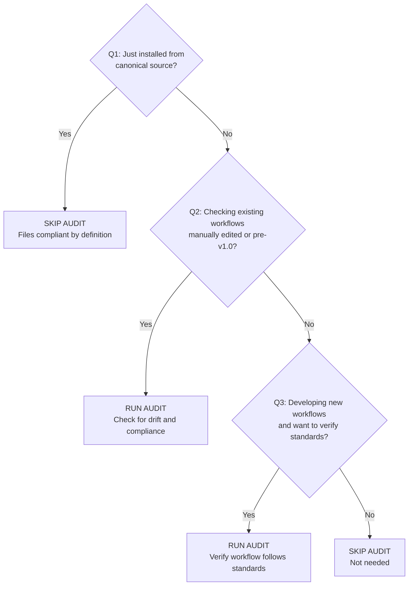

# Workflow Execution Audit

**Purpose**: Analyze workflows for execution protocol compliance and offer automatic remediation

**When to use**: Ad-hoc quality checks on workflow files to ensure deterministic execution standards

**When NOT to use**:
- **After fresh installation** from canonical source (files are compliant by definition)
- **Immediately after running installation wizard** (validation already confirmed file integrity)
- **For bulk compliance checking** of newly installed workflows (waste of 3-5 hours for 19 files)
- **When you just copied** a workflow directly from planning-is-prompting repository

**What this workflow does**:
- Audits target workflow for TodoWrite mandates, verification checkpoints, and language strength
- Generates compliance reports with scores (0-100)
- Identifies critical issues, warnings, and suggestions
- Offers automatic remediation of identified issues
- Meta-tool: This workflow audits other workflows (and follows its own standards)

**Key activities**:
- Prompt for target workflow file
- Analyze structure (steps, phases, complexity)
- Check TodoWrite mandate and update instructions
- Analyze language strength (MUST vs SHOULD vs MAY)
- Check verification checkpoints
- Check execution metadata
- Generate compliance report with scoring
- Suggest specific fixes with line numbers
- Offer remediation options (apply all, selective, view only)

---

## Usage Decision Matrix

**Should I run workflow audit?** Use this decision tree:



**Use Cases by Scenario**:

| Scenario | Run Audit? | Rationale |
|----------|------------|-----------|
| **Fresh installation from wizard** | ❌ NO | Files copied from canonical source = compliant by definition |
| **Manual copy from planning-is-prompting repo** | ❌ NO | Source files already follow standards |
| **Update mode (v0.0 → v1.0)** | ✅ YES | Check for drift, verify update succeeded |
| **Manually edited existing workflow** | ✅ YES | Edits may have broken compliance |
| **Pre-v1.0 workflows (no version tag)** | ✅ YES | May not follow deterministic pattern |
| **Developing new workflow** | ✅ YES | Verify it follows execution standards |
| **Unknown workflow origin** | ✅ YES | Confirm compliance before using |
| **Bulk check of installed workflows** | ❌ NO | Only audit if you suspect drift (save time) |

**Time Investment vs Value**:
- Single workflow audit: 10-15 minutes
- Full suite audit (19 workflows): 3-5 hours
- Value for fresh installation: **ZERO** (already compliant)
- Value for drift detection: **HIGH** (catches compliance issues)

**Recommended Workflow**:
1. **Install** → Validation only (Step 6 in installation wizard)
2. **Wait 3-6 months** → Check for manual drift if workflows were edited
3. **Update mode** → Audit if updating old workflows to new versions
4. **Development** → Audit new workflows you create

---

## Execution Metadata

**Execution Protocol**: Mandatory TodoWrite (10 steps)
**Checkpoint Frequency**: After each audit phase
**Verification Required**: Yes (every step has verification checklist)
**Parallel Execution**: Not allowed (sequential audit process)
**Estimated Duration**: 10-15 minutes per workflow audited

---

## Step 0: Create Audit Tracking

**MANDATE**: You MUST create a TodoWrite list before proceeding with the audit.

**Template TODO Items**:
```
[SHORT_PROJECT_PREFIX] Prompt for target workflow path
[SHORT_PROJECT_PREFIX] Analyze workflow structure
[SHORT_PROJECT_PREFIX] Check TodoWrite mandate compliance
[SHORT_PROJECT_PREFIX] Check TodoWrite update instructions
[SHORT_PROJECT_PREFIX] Analyze language strength
[SHORT_PROJECT_PREFIX] Check verification checkpoints
[SHORT_PROJECT_PREFIX] Check execution metadata
[SHORT_PROJECT_PREFIX] Generate compliance report
[SHORT_PROJECT_PREFIX] Suggest specific fixes
[SHORT_PROJECT_PREFIX] Present findings and offer remediation
```

**Execution Protocol**:
1. Create TodoWrite list with ALL 10 steps
2. Mark first item as in_progress
3. Execute step completely
4. Mark completed ONLY after verification checklist confirms completion
5. Mark next item as in_progress
6. Repeat until all items completed

**Incompletion = Failure**: If any item remains in_progress or pending at workflow end, the audit has not been properly executed.

---

## Step 1: Prompt for Target Workflow

**Purpose**: Identify which workflow file to audit

**Process**:

1. **Ask user for workflow path**:
   ```
   Which workflow would you like to audit?

   Examples:
   - workflow/session-start.md
   - workflow/p-is-p-01-planning-the-work.md
   - workflow/history-management.md
   - .claude/commands/plan-session-end.md

   Enter path to workflow file:
   ```

2. **Validate path format**:
   - Must be valid file path
   - Should end in .md
   - Inform user if path looks suspicious

3. **Read target file**:
   - Use Read tool to load entire file
   - Count total lines for reference
   - Store content for analysis in subsequent steps

4. **Initial validation**:
   - Confirm file exists and is readable
   - Confirm it's markdown format
   - Confirm it contains workflow structure (## headers)
   - If validation fails, report error and ask for different path

**Output**:
```
Target Workflow: workflow/example-workflow.md
Total Lines: 342
Format: Markdown ✓
Structure: 7 sections with ## headers ✓
Ready for audit
```

**Verification** (confirm ALL before proceeding):
- ✓ User provided workflow path
- ✓ File exists and readable
- ✓ File is markdown format
- ✓ Contains workflow structure (## headers)
- ✓ Content stored for analysis
- ✓ TodoWrite updated (Step 1 → completed, Step 2 → in_progress)

**Update TodoWrite**:
- Mark "[SHORT_PROJECT_PREFIX] Prompt for target workflow path" as completed
- Mark "[SHORT_PROJECT_PREFIX] Analyze workflow structure" as in_progress

---

## Step 2: Analyze Workflow Structure

**Purpose**: Extract structural information about the workflow

**Process**:

1. **Extract all steps/sections**:
   - Search for lines starting with `## Step` or `## Phase` or `### `
   - Record each section with line number
   - Build list of all major sections

2. **Count total steps**:
   - How many `## Step N:` sections?
   - Are steps numbered sequentially?
   - Any missing step numbers?

3. **Identify substeps**:
   - Within each step, are there numbered substeps?
   - How many substeps per step?

4. **Determine workflow complexity**:
   - Multi-step workflow: 3+ steps → TodoWrite should be mandatory
   - Simple workflow: 1-2 steps → TodoWrite may be optional
   - Complex workflow: 5+ steps → Strong verification needed

**Output**:
```
Structure Analysis:
━━━━━━━━━━━━━━━━━━━━━━━━━━━━━━━━━━━━━━━━━━
Total Steps: 7
Step Numbering: Sequential (Step 1-7) ✓
Substeps: Yes (average 3-4 per step)
Complexity: Multi-step workflow (TodoWrite mandate recommended)

Sections Found:
- Line 15: ## Step 1: Load Configuration
- Line 45: ## Step 2: Discover Workflows
- Line 78: ## Step 3: Load History
- Line 112: ## Step 4: Identify TODOs
- Line 156: ## Step 5: Process Data
- Line 201: ## Step 6: Generate Output
- Line 245: ## Step 7: Finalize

Complexity Assessment: HIGH (7 steps, multiple substeps)
TodoWrite Mandate: REQUIRED
```

**Verification** (confirm ALL before proceeding):
- ✓ All ## Step sections extracted with line numbers
- ✓ Total step count calculated
- ✓ Step numbering checked for gaps
- ✓ Substeps identified
- ✓ Complexity assessment completed (multi-step vs simple)
- ✓ TodoWrite updated (Step 2 → completed, Step 3 → in_progress)

**Update TodoWrite**:
- Mark "[SHORT_PROJECT_PREFIX] Analyze workflow structure" as completed
- Mark "[SHORT_PROJECT_PREFIX] Check TodoWrite mandate compliance" as in_progress

---

## Step 3: Check TodoWrite Mandate

**Purpose**: Verify workflow mandates TodoWrite creation for multi-step workflows

**Audit Criteria**:
- Does workflow have "Step 0" or similar section dedicated to TodoWrite creation?
- Does it use mandatory language: **MUST**, **SHALL**, **REQUIRED**, **MANDATE**?
- Does it provide template TODO items showing what to track?
- Does it explain the execution protocol (mark in_progress, complete, move to next)?

**Process**:

1. **Search for Step 0**:
   - Look for `## Step 0:` in first 100 lines
   - Alternative patterns: `## Preliminary Step:`, `## Setup:`, `## Initialize Tracking:`
   - Check if section mentions TodoWrite or TODO

2. **Check for mandatory language**:
   - Within Step 0 section, search for:
     - MUST create TodoWrite
     - SHALL create TodoWrite
     - REQUIRED: TodoWrite
     - MANDATE: TodoWrite
   - Weak language (SHOULD/CAN/RECOMMENDED) = PARTIAL compliance

3. **Check for template TODO items**:
   - Does Step 0 provide example list of TODO items?
   - Do template items use [SHORT_PROJECT_PREFIX]?
   - Do they match the actual steps in the workflow?

4. **Check for execution protocol**:
   - Does it explain mark in_progress before starting step?
   - Does it explain mark completed after finishing step?
   - Does it explain move to next step sequentially?

**Findings Format**:

```
TodoWrite Mandate Compliance:
━━━━━━━━━━━━━━━━━━━━━━━━━━━━━━━━━━━━━━━━━━

Status: ✅ PASS / ⚠️ PARTIAL / ❌ FAIL

Findings:
[If PASS]
✅ Has "Step 0: Create TodoWrite" (Line 42)
✅ Uses mandatory language: "MANDATE: You MUST create..."
✅ Provides template TODO items (7 items matching workflow steps)
✅ Explains execution protocol clearly

[If PARTIAL]
⚠️ Has TodoWrite mention (Line 38)
⚠️ Uses weak language: "You should create a todo list..."
⚠️ No template TODO items provided
⚠️ Execution protocol not explained

[If FAIL]
❌ No Step 0 found
❌ No TodoWrite mandate anywhere in workflow
❌ Multi-step workflow (7 steps) without tracking mechanism
```

**Suggested Fix** (if PARTIAL or FAIL):

```markdown
Add this as Step 0 (before current Step 1, renumber subsequent steps):

## Step 0: Create Execution Tracking

**MANDATE**: You MUST create a TodoWrite list before proceeding.

**Template TODO Items**:
```
[SHORT_PROJECT_PREFIX] Step 1: [Description from actual Step 1]
[SHORT_PROJECT_PREFIX] Step 2: [Description from actual Step 2]
[SHORT_PROJECT_PREFIX] Step 3: [Description from actual Step 3]
... (continue for all steps)
```

**Execution Protocol**:
1. Create TodoWrite list with ALL steps
2. Mark first item as in_progress
3. Execute step completely
4. Mark completed ONLY after verification
5. Mark next item as in_progress
6. Repeat until all items completed

**Incompletion = Failure**: If any item remains in_progress or pending at workflow end, the workflow has not been properly executed.
```

**Rationale**: Multi-step workflows require explicit tracking to ensure deterministic execution. TodoWrite creates accountability and prevents step skipping.

**Verification** (confirm ALL before proceeding):
- ✓ Searched for Step 0 or TodoWrite mandate
- ✓ Checked language strength (MUST vs SHOULD vs absent)
- ✓ Checked for template TODO items
- ✓ Checked for execution protocol explanation
- ✓ Finding recorded (PASS / PARTIAL / FAIL)
- ✓ Suggested fix generated (if needed)
- ✓ TodoWrite updated (Step 3 → completed, Step 4 → in_progress)

**Update TodoWrite**:
- Mark "[SHORT_PROJECT_PREFIX] Check TodoWrite mandate compliance" as completed
- Mark "[SHORT_PROJECT_PREFIX] Check TodoWrite update instructions" as in_progress

---

## Step 4: Check TodoWrite Update Instructions

**Purpose**: Verify each step ends with instructions to update TodoWrite

**Audit Criteria**:
- Does each step (Step 1, 2, 3, etc.) end with TodoWrite update instruction?
- Pattern to search: `**Update TodoWrite**:` or `**TodoWrite Update**:` near end of step
- Should instruct to mark current step completed and next step in_progress

**Process**:

1. **For each step identified in Step 2**:
   - Extract the content of that step section
   - Check last 5 lines of the step
   - Search for TodoWrite update pattern

2. **Record which steps have TodoWrite updates**:
   - Build list of steps WITH updates
   - Build list of steps WITHOUT updates

3. **Calculate compliance ratio**:
   - Steps with updates / Total steps
   - Example: 5 of 7 steps = 71% compliance

**Findings Format**:

```
TodoWrite Update Instructions:
━━━━━━━━━━━━━━━━━━━━━━━━━━━━━━━━━━━━━━━━━━

Status: ✅ PASS / ⚠️ PARTIAL / ❌ FAIL

Compliance Ratio: 5 of 7 steps (71%)

Steps WITH TodoWrite updates:
✓ Step 1 (Line 43)
✓ Step 2 (Line 76)
✓ Step 3 (Line 110)
✓ Step 5 (Line 178)
✓ Step 7 (Line 243)

Steps WITHOUT TodoWrite updates:
✗ Step 4 (Line 134) - Missing update instruction
✗ Step 6 (Line 212) - Missing update instruction

Assessment:
⚠️ PARTIAL - Most steps have updates but 2 steps missing
```

**Suggested Fix** (for each missing step):

For Step 4 (Line 134), add at end of step:

```markdown
**Update TodoWrite**:
- Mark "[SHORT_PROJECT_PREFIX] Step 4: [description]" as completed
- Mark "[SHORT_PROJECT_PREFIX] Step 5: [description]" as in_progress
```

For Step 6 (Line 212), add at end of step:

```markdown
**Update TodoWrite**:
- Mark "[SHORT_PROJECT_PREFIX] Step 6: [description]" as completed
- Mark "[SHORT_PROJECT_PREFIX] Step 7: [description]" as in_progress
```

**Rationale**: Every step must explicitly update TodoWrite to ensure tracking discipline. Without this, steps can be silently skipped.

**Verification** (confirm ALL before proceeding):
- ✓ All steps checked for TodoWrite update instructions
- ✓ Steps with updates identified and counted
- ✓ Steps without updates identified with line numbers
- ✓ Compliance ratio calculated
- ✓ Finding recorded (PASS / PARTIAL / FAIL)
- ✓ Suggested fixes generated for each missing update
- ✓ TodoWrite updated (Step 4 → completed, Step 5 → in_progress)

**Update TodoWrite**:
- Mark "[SHORT_PROJECT_PREFIX] Check TodoWrite update instructions" as completed
- Mark "[SHORT_PROJECT_PREFIX] Analyze language strength" as in_progress

---

## Step 5: Analyze Language Strength

**Purpose**: Identify weak language in critical instructions that should use mandatory language

**Language Strength Hierarchy**:

| Strength | Keywords | Interpretation | Use For |
|----------|----------|----------------|---------|
| **MANDATORY** | MUST, SHALL, REQUIRED, MANDATE | Absolute requirement | Critical steps, TodoWrite creation, verification |
| **RECOMMENDED** | SHOULD, RECOMMENDED | Strong suggestion | Best practices, optional enhancements |
| **OPTIONAL** | MAY, CAN, OPTIONALLY | Discretionary | User choices, alternative approaches |
| **PROHIBITED** | MUST NOT, SHALL NOT | Forbidden | Anti-patterns, security violations |

**Audit Criteria**:
- Scan entire workflow for language patterns
- Identify critical instructions using weak language
- Count usage of each strength level
- Flag mismatches (critical step using MAY/CAN/SHOULD)

**Process**:

1. **Count language usage**:
   - Search for MUST, SHALL, REQUIRED, MANDATE → count
   - Search for SHOULD, RECOMMENDED → count
   - Search for MAY, CAN, OPTIONALLY → count
   - Search for MUST NOT, SHALL NOT → count

2. **Identify critical instructions with weak language**:
   - Lines mentioning TodoWrite with SHOULD/CAN/MAY
   - Lines mentioning verification with SHOULD/CAN
   - Lines mentioning mandatory steps with weak language
   - Record line numbers and current text

3. **Suggest replacements**:
   - For each weak instance, suggest strong replacement
   - Preserve meaning, change only strength

**Findings Format**:

```
Language Strength Analysis:
━━━━━━━━━━━━━━━━━━━━━━━━━━━━━━━━━━━━━━━━━━

Language Usage Counts:
- MANDATORY (MUST/SHALL/REQUIRED/MANDATE): 8 instances
- RECOMMENDED (SHOULD/RECOMMENDED): 12 instances ⚠️
- OPTIONAL (MAY/CAN/OPTIONALLY): 15 instances ⚠️
- PROHIBITED (MUST NOT/SHALL NOT): 2 instances

Critical Instructions Using Weak Language:
⚠️ Line 45: "You can create a TodoWrite list..."
   → Should be: "You MUST create a TodoWrite list..."
   Rationale: TodoWrite is mandatory for multi-step workflows

⚠️ Line 98: "It's recommended to verify the output..."
   → Should be: "You MUST verify the output..."
   Rationale: Verification is critical for correctness

⚠️ Line 156: "You should update TodoWrite after this step"
   → Should be: "You MUST update TodoWrite after this step"
   Rationale: TodoWrite discipline required for tracking

⚠️ Line 203: "Can optionally add verification checklist"
   → Should be: "You MUST add verification checklist"
   Rationale: Verification ensures step completion

Assessment:
⚠️ WARNING - 4 critical instructions using weak language
Recommend strengthening to MUST/SHALL for deterministic execution
```

**Suggested Fixes** (specific line replacements):

```
FIX: Replace line 45:
OLD: "You can create a TodoWrite list to track progress"
NEW: "You MUST create a TodoWrite list to track progress"

FIX: Replace line 98:
OLD: "It's recommended to verify the output matches expectations"
NEW: "You MUST verify the output matches expectations"

FIX: Replace line 156:
OLD: "You should update TodoWrite to mark this step complete"
NEW: "You MUST update TodoWrite to mark this step complete"

FIX: Replace line 203:
OLD: "Can optionally add verification checklist to ensure quality"
NEW: "You MUST add verification checklist to ensure quality"
```

**Rationale**: Weak language in critical instructions creates ambiguity about whether steps are required. This leads to non-deterministic execution (steps might be skipped). Strong language (MUST/SHALL) makes requirements explicit and forces compliance.

**Verification** (confirm ALL before proceeding):
- ✓ Language usage counted for all strength levels
- ✓ Critical instructions identified
- ✓ Weak language instances found with line numbers
- ✓ Suggested replacements generated for each instance
- ✓ Finding recorded with assessment
- ✓ TodoWrite updated (Step 5 → completed, Step 6 → in_progress)

**Update TodoWrite**:
- Mark "[SHORT_PROJECT_PREFIX] Analyze language strength" as completed
- Mark "[SHORT_PROJECT_PREFIX] Check verification checkpoints" as in_progress

---

## Step 6: Check Verification Checkpoints

**Purpose**: Verify each step has verification checklist confirming completion

**Audit Criteria**:
- Does each step have verification checklist before TodoWrite update?
- Pattern to search: `**Verification**:` or `**Verification Checklist**:` or `**Verify**:`
- Should list specific items to confirm (not just "TodoWrite updated")
- Should use checkbox format: `- ✓ Item confirmed`

**Process**:

1. **For each step, search for verification section**:
   - Look for verification pattern in last 15 lines of step
   - Must appear BEFORE TodoWrite update instruction
   - Check if verification is meaningful (specific outcomes, not generic)

2. **Count steps with vs without verification**:
   - Steps with verification → count
   - Steps without verification → count
   - Steps with weak verification (only TodoWrite) → flag

3. **Assess verification quality**:
   - Meaningful: Lists specific outcomes/data to confirm
   - Weak: Only says "TodoWrite updated"
   - Missing: No verification section at all

**Findings Format**:

```
Verification Checkpoints:
━━━━━━━━━━━━━━━━━━━━━━━━━━━━━━━━━━━━━━━━━━

Status: ✅ PASS / ⚠️ PARTIAL / ❌ FAIL

Compliance Ratio: 4 of 7 steps (57%)

Steps WITH meaningful verification:
✓ Step 1 (Line 41) - 5 specific items confirmed
✓ Step 2 (Line 74) - 4 specific items confirmed
✓ Step 3 (Line 108) - 6 specific items confirmed
✓ Step 7 (Line 241) - 5 specific items confirmed

Steps WITHOUT verification:
✗ Step 4 (Line 132) - No verification section
✗ Step 5 (Line 176) - No verification section
✗ Step 6 (Line 210) - No verification section

Assessment:
⚠️ PARTIAL - 3 steps missing verification checkpoints
Critical for ensuring step completion before proceeding
```

**Suggested Fix** (template for missing steps):

For Step 4 (Line 132), add before TodoWrite update:

```markdown
**Verification** (confirm ALL before proceeding):
- ✓ [Specific outcome from this step achieved]
- ✓ [Data processed/validated/stored correctly]
- ✓ [State confirmed to be correct]
- ✓ [Any outputs generated are valid]
- ✓ TodoWrite updated (Step 4 → completed, Step 5 → in_progress)
```

For Step 5 (Line 176), add before TodoWrite update:

```markdown
**Verification** (confirm ALL before proceeding):
- ✓ [Specific outcome from this step achieved]
- ✓ [Data processed/validated/stored correctly]
- ✓ [State confirmed to be correct]
- ✓ [Any outputs generated are valid]
- ✓ TodoWrite updated (Step 5 → completed, Step 6 → in_progress)
```

For Step 6 (Line 210), add before TodoWrite update:

```markdown
**Verification** (confirm ALL before proceeding):
- ✓ [Specific outcome from this step achieved]
- ✓ [Data processed/validated/stored correctly]
- ✓ [State confirmed to be correct]
- ✓ [Any outputs generated are valid]
- ✓ TodoWrite updated (Step 6 → completed, Step 7 → in_progress)
```

**Rationale**: Verification checkpoints ensure each step actually completed its intended work before moving to next step. Without verification, it's easy to claim "done" without actually doing the work.

**Verification** (confirm ALL before proceeding):
- ✓ All steps checked for verification sections
- ✓ Steps with verification counted and quality assessed
- ✓ Steps without verification identified with line numbers
- ✓ Compliance ratio calculated
- ✓ Finding recorded (PASS / PARTIAL / FAIL)
- ✓ Suggested fix templates generated for missing verification
- ✓ TodoWrite updated (Step 6 → completed, Step 7 → in_progress)

**Update TodoWrite**:
- Mark "[SHORT_PROJECT_PREFIX] Check verification checkpoints" as completed
- Mark "[SHORT_PROJECT_PREFIX] Check execution metadata" as in_progress

---

## Step 7: Check Execution Metadata

**Purpose**: Verify workflow has metadata describing execution requirements

**Audit Criteria**:
Does workflow have metadata section near top (within first 50 lines) with these fields:
- **Execution Protocol**: Describes TodoWrite requirement (e.g., "Mandatory TodoWrite (7 steps)")
- **Checkpoint Frequency**: How often to verify (e.g., "After each step")
- **Verification Required**: Yes/No
- **Parallel Execution**: Whether steps can run concurrently (usually "Not allowed" for workflows)
- **Estimated Duration**: Time estimate (e.g., "15-20 minutes")

**Process**:

1. **Search first 50 lines for metadata section**:
   - Look for "## Execution Metadata" or similar header
   - Alternative: Metadata embedded after Purpose/When to use

2. **Check for each required field**:
   - Execution Protocol → present or missing
   - Checkpoint Frequency → present or missing
   - Verification Required → present or missing
   - Parallel Execution → present or missing
   - Estimated Duration → present or missing

3. **Count present vs missing fields**:
   - 5 of 5 = PASS
   - 3-4 of 5 = PARTIAL
   - 0-2 of 5 = FAIL

**Findings Format**:

```
Execution Metadata:
━━━━━━━━━━━━━━━━━━━━━━━━━━━━━━━━━━━━━━━━━━

Status: ✅ PASS / ⚠️ PARTIAL / ❌ FAIL

Fields Present:
✓ Execution Protocol (Line 12): "Mandatory TodoWrite (7 steps)"
✓ Estimated Duration (Line 18): "15-20 minutes"

Fields Missing:
✗ Checkpoint Frequency - Not specified
✗ Verification Required - Not specified
✗ Parallel Execution - Not specified

Compliance: 2 of 5 fields (40%)

Assessment:
❌ FAIL - Missing critical execution metadata
Users don't know how to properly execute this workflow
```

**Suggested Fix**:

Add this section after "## [Workflow Name]" and before "## Step 1":

```markdown
## Execution Metadata

**Execution Protocol**: Mandatory TodoWrite (N steps)
**Checkpoint Frequency**: After each step
**Verification Required**: Yes
**Parallel Execution**: Not allowed (sequential only)
**Estimated Duration**: [estimate] minutes

---
```

Explanation of fields:
- **Execution Protocol**: Specifies if TodoWrite is mandatory and how many steps
- **Checkpoint Frequency**: How often to verify progress (usually "after each step")
- **Verification Required**: Whether each step needs verification checklist
- **Parallel Execution**: Whether steps can be done concurrently (usually No for workflows)
- **Estimated Duration**: Helps user allocate appropriate time

**Rationale**: Execution metadata sets expectations for how the workflow MUST be executed. Without it, users might try to skip steps or rush through without proper verification.

**Verification** (confirm ALL before proceeding):
- ✓ First 50 lines searched for metadata section
- ✓ Each required field checked (present or missing)
- ✓ Fields counted (present vs missing)
- ✓ Compliance ratio calculated
- ✓ Finding recorded (PASS / PARTIAL / FAIL)
- ✓ Suggested fix generated with complete template
- ✓ TodoWrite updated (Step 7 → completed, Step 8 → in_progress)

**Update TodoWrite**:
- Mark "[SHORT_PROJECT_PREFIX] Check execution metadata" as completed
- Mark "[SHORT_PROJECT_PREFIX] Generate compliance report" as in_progress

---

## Step 8: Generate Compliance Report

**Purpose**: Aggregate all findings and calculate overall compliance score

**Process**:

1. **Aggregate findings from Steps 3-7**:
   - Step 3: TodoWrite Mandate (PASS/PARTIAL/FAIL)
   - Step 4: TodoWrite Updates (ratio, e.g., 5 of 7)
   - Step 5: Language Strength (instances of weak language)
   - Step 6: Verification Checkpoints (ratio, e.g., 4 of 7)
   - Step 7: Execution Metadata (fields present, e.g., 2 of 5)

2. **Calculate compliance score (0-100)**:

   Formula:
   ```
   Score = (
     TodoWrite_Mandate * 25 +      # 25 points
     TodoWrite_Updates * 20 +      # 20 points
     Language_Strength * 15 +      # 15 points
     Verification * 20 +           # 20 points
     Metadata * 20                 # 20 points
   )

   Where each component is 0.0 to 1.0:
   - TodoWrite_Mandate: 1.0=PASS, 0.5=PARTIAL, 0.0=FAIL
   - TodoWrite_Updates: (steps_with / total_steps)
   - Language_Strength: 1.0 - (weak_instances / total_critical_instructions)
   - Verification: (steps_with / total_steps)
   - Metadata: (fields_present / 5)
   ```

3. **Categorize issues by severity**:
   - **CRITICAL** (blocking): No TodoWrite mandate, No TodoWrite updates, No metadata
   - **WARNING** (should fix): Partial TodoWrite, Weak language, Missing verification
   - **SUGGESTION** (nice to have): Formatting improvements, examples needed

4. **Format compliance report**:

```
════════════════════════════════════════════════════════
WORKFLOW EXECUTION AUDIT REPORT
════════════════════════════════════════════════════════

Target: workflow/example-workflow.md
Date: YYYY.MM.DD
Auditor: Workflow Execution Audit v1.0
Total Steps: 7

────────────────────────────────────────────────────────
COMPLIANCE SCORE: 65/100
────────────────────────────────────────────────────────

Score Breakdown:
• TodoWrite Mandate (25 pts): 12.5 / 25  (PARTIAL - weak language)
• TodoWrite Updates (20 pts): 14.3 / 20  (5 of 7 steps have updates)
• Language Strength (15 pts): 9.0 / 15   (4 weak instances found)
• Verification (20 pts): 11.4 / 20       (4 of 7 steps have verification)
• Execution Metadata (20 pts): 8.0 / 20  (2 of 5 fields present)

────────────────────────────────────────────────────────
ISSUE SUMMARY
────────────────────────────────────────────────────────

CRITICAL ISSUES (blocking): 0
[None found]

WARNINGS (should fix): 5
⚠️ TodoWrite mandate uses weak language (SHOULD instead of MUST)
⚠️ 2 of 7 steps missing TodoWrite update instructions
⚠️ 4 critical instructions using weak language (CAN/SHOULD)
⚠️ 3 of 7 steps missing verification checkpoints
⚠️ 3 of 5 execution metadata fields missing

SUGGESTIONS (nice to have): 1
💡 Consider adding examples for complex steps

────────────────────────────────────────────────────────
DETAILED FINDINGS
────────────────────────────────────────────────────────

[Include findings from Steps 3-7 here, formatted]

TodoWrite Mandate:
Status: ⚠️ PARTIAL
Finding: Has TodoWrite mention but uses "SHOULD" instead of "MUST"
Impact: Users may skip TodoWrite creation, leading to non-deterministic execution
Line: 38

TodoWrite Updates:
Status: ⚠️ PARTIAL
Finding: 5 of 7 steps have update instructions (71% compliance)
Missing: Step 4 (Line 134), Step 6 (Line 212)
Impact: Steps without updates can be silently skipped

Language Strength:
Status: ⚠️ WARNING
Finding: 4 critical instructions using weak language
Instances:
- Line 45: "can create" → should be "MUST create"
- Line 98: "recommended to verify" → should be "MUST verify"
- Line 156: "should update" → should be "MUST update"
- Line 203: "optionally add" → should be "MUST add"
Impact: Ambiguity about which steps are required vs optional

Verification Checkpoints:
Status: ⚠️ PARTIAL
Finding: 4 of 7 steps have verification (57% compliance)
Missing: Step 4 (Line 132), Step 5 (Line 176), Step 6 (Line 210)
Impact: No way to confirm step completion before proceeding

Execution Metadata:
Status: ⚠️ PARTIAL
Finding: 2 of 5 fields present (40% compliance)
Present: Execution Protocol, Estimated Duration
Missing: Checkpoint Frequency, Verification Required, Parallel Execution
Impact: Users don't know execution requirements

────────────────────────────────────────────────────────
RECOMMENDED ACTIONS (Priority Order)
────────────────────────────────────────────────────────

Priority 1 (CRITICAL): None

Priority 2 (WARNING):
1. Strengthen TodoWrite mandate language (SHOULD → MUST)
2. Add TodoWrite update instructions to Steps 4 and 6
3. Strengthen language in 4 critical instructions
4. Add verification checklists to Steps 4, 5, 6
5. Add missing metadata fields (3 fields)

Priority 3 (SUGGESTION):
6. Add examples to improve clarity for complex steps

Estimated Remediation Time: 15-20 minutes

════════════════════════════════════════════════════════
```

**Verification** (confirm ALL before proceeding):
- ✓ All findings from Steps 3-7 aggregated
- ✓ Compliance score calculated (0-100)
- ✓ Score breakdown by component shown
- ✓ Issues categorized by severity (CRITICAL / WARNING / SUGGESTION)
- ✓ Detailed findings formatted clearly
- ✓ Recommended actions listed by priority
- ✓ Complete report generated and ready to present
- ✓ TodoWrite updated (Step 8 → completed, Step 9 → in_progress)

**Update TodoWrite**:
- Mark "[SHORT_PROJECT_PREFIX] Generate compliance report" as completed
- Mark "[SHORT_PROJECT_PREFIX] Suggest specific fixes" as in_progress

---

## Step 9: Suggest Specific Fixes

**Purpose**: For each issue found, provide specific fix with line number, content, and rationale

**Process**:

1. **Number all fixes sequentially**:
   - Start with FIX #1, increment for each issue
   - Order by priority: CRITICAL first, then WARNING, then SUGGESTION

2. **For each fix, provide**:
   - Fix number
   - Severity (CRITICAL / WARNING / SUGGESTION)
   - Location (line number or section description)
   - Current state (what's there now, if applicable)
   - Action needed (what to add, change, or remove)
   - Suggested content (exact text to use)
   - Rationale (why this fix matters)

3. **Format with clear separators**:

```
FIX #1 (WARNING): Strengthen TodoWrite Mandate Language
─────────────────────────────────────────────────────────
Location: Line 38, Step 0 section
Current: "You should create a TodoWrite list to track progress"
Action: Replace with stronger language

Suggested Change:
OLD: "You should create a TodoWrite list to track progress"
NEW: "You MUST create a TodoWrite list to track progress"

Rationale: TodoWrite is mandatory for multi-step workflows to ensure deterministic execution. Weak language (SHOULD) suggests it's optional, leading to skipped tracking.

═════════════════════════════════════════════════════════

FIX #2 (WARNING): Add TodoWrite Update to Step 4
─────────────────────────────────────────────────────────
Location: Line 134, end of Step 4
Current: Step ends without TodoWrite update instruction
Action: Append TodoWrite update section

Suggested Content:
**Update TodoWrite**:
- Mark "[SHORT_PROJECT_PREFIX] Step 4: [description]" as completed
- Mark "[SHORT_PROJECT_PREFIX] Step 5: [description]" as in_progress

Rationale: Every step must explicitly update TodoWrite to maintain tracking discipline. Without this, Step 4 can be silently skipped.

═════════════════════════════════════════════════════════

FIX #3 (WARNING): Add TodoWrite Update to Step 6
─────────────────────────────────────────────────────────
Location: Line 212, end of Step 6
Current: Step ends without TodoWrite update instruction
Action: Append TodoWrite update section

Suggested Content:
**Update TodoWrite**:
- Mark "[SHORT_PROJECT_PREFIX] Step 6: [description]" as completed
- Mark "[SHORT_PROJECT_PREFIX] Step 7: [description]" as in_progress

Rationale: Every step must explicitly update TodoWrite to maintain tracking discipline. Without this, Step 6 can be silently skipped.

═════════════════════════════════════════════════════════

FIX #4 (WARNING): Strengthen Language at Line 45
─────────────────────────────────────────────────────────
Location: Line 45
Current: "You can create a backup before proceeding"
Action: Replace weak language with mandatory language

Suggested Change:
OLD: "You can create a backup before proceeding"
NEW: "You MUST create a backup before proceeding"

Rationale: Backup creation is critical for safety. Weak language (CAN) makes it sound optional when it's actually required.

═════════════════════════════════════════════════════════

[Continue for all fixes...]

FIX #10 (SUGGESTION): Add Example for Step 3
─────────────────────────────────────────────────────────
Location: Step 3 section, after Process description
Current: No example provided
Action: Add example to clarify complex step

Suggested Content:
**Example**:
```
[Concrete example showing how to execute this step]
```

Rationale: Complex steps benefit from examples to reduce ambiguity and improve clarity.

═════════════════════════════════════════════════════════
```

**Fix Summary**:
```
Total Fixes: 10
- CRITICAL: 0
- WARNING: 9
- SUGGESTION: 1

Estimated Time to Apply All Fixes: 15-20 minutes
```

**Verification** (confirm ALL before proceeding):
- ✓ All issues from compliance report converted to numbered fixes
- ✓ Fixes ordered by priority (CRITICAL → WARNING → SUGGESTION)
- ✓ Each fix has: number, severity, location, action, content, rationale
- ✓ Fixes formatted with clear separators
- ✓ Fix summary generated with counts and time estimate
- ✓ TodoWrite updated (Step 9 → completed, Step 10 → in_progress)

**Update TodoWrite**:
- Mark "[SHORT_PROJECT_PREFIX] Suggest specific fixes" as completed
- Mark "[SHORT_PROJECT_PREFIX] Present findings and offer remediation" as in_progress

---

## Step 10: Present Findings and Offer Remediation

**Purpose**: Show compliance report and fixes, then offer remediation options

**Process**:

1. **Display compliance report** (from Step 8):
   - Show full formatted report
   - Highlight score and issue counts

2. **Display suggested fixes** (from Step 9):
   - Show all numbered fixes with separators
   - Show fix summary with counts

3. **Offer remediation options**:

```
════════════════════════════════════════════════════════
REMEDIATION OPTIONS
════════════════════════════════════════════════════════

How would you like to proceed?

[1] Apply all fixes automatically (10 fixes)
    → I'll update the workflow file with all suggested changes
    → Estimated time: 2-3 minutes for application
    → Creates backup: [filename].backup before modifying

[2] Apply selected fixes (you choose which)
    → Tell me which fix numbers to apply (e.g., "1, 2, 5, 8")
    → I'll apply only those fixes
    → Creates backup before modifying

[3] Show me the fixes but don't apply them yet
    → I'll keep the report available for reference
    → You can manually edit the file
    → Report saved to: workflow-audit-report-YYYY-MM-DD.md

[4] Save report to file only
    → I'll create workflow-audit-report-YYYY-MM-DD.md
    → No changes applied to workflow
    → You can review and apply fixes later

[5] Audit another workflow
    → Provide path to next workflow to audit
    → Current audit results will be saved

[6] Exit without changes
    → No modifications made
    → Audit complete

What would you like to do? [1/2/3/4/5/6]:
```

4. **Wait for user selection**:
   - STOP here and wait for user input
   - Do NOT proceed until user responds

5. **Execute selected option**:

**If [1] - Apply all fixes**:
- Create backup: `cp workflow.md workflow.md.backup`
- For each fix in order, apply the change using Edit tool
- Verify file is still valid markdown after all changes
- Report: "Applied 10 fixes successfully. Backup saved to: workflow.md.backup"
- Re-run audit to show improved score

**If [2] - Apply selected fixes**:
- Ask: "Which fix numbers? (e.g., 1, 2, 5):"
- Parse user input (extract fix numbers)
- Create backup
- For each selected fix number, apply the change
- Verify file valid after changes
- Report: "Applied fixes #1, #2, #5 successfully."

**If [3] - Show fixes only**:
- Report: "Fixes are shown above. No changes applied."
- Ask: "Would you like me to save the report? [y/n]"
- If yes, save to workflow-audit-report-YYYY-MM-DD.md

**If [4] - Save report only**:
- Create file: workflow-audit-report-YYYY-MM-DD.md
- Write compliance report + suggested fixes to file
- Report: "Report saved to: workflow-audit-report-YYYY-MM-DD.md"

**If [5] - Audit another workflow**:
- Save current report to file automatically
- Return to Step 1 (prompt for new workflow path)
- Start new audit

**If [6] - Exit**:
- Report: "Audit complete. No changes applied."
- Mark TodoWrite all items completed
- End workflow

**Verification** (confirm ALL before proceeding):
- ✓ Compliance report displayed to user
- ✓ Suggested fixes displayed to user
- ✓ Remediation options presented clearly
- ✓ User response received
- ✓ Selected option executed correctly
- ✓ Backup created (if modifying file)
- ✓ Changes applied successfully (if option 1 or 2)
- ✓ Report saved (if option 3 or 4)
- ✓ TodoWrite updated (Step 10 → completed - all items done!)

**Update TodoWrite**:
- Mark "[SHORT_PROJECT_PREFIX] Present findings and offer remediation" as completed
- **All TodoWrite items now completed!** ✅

---

## Self-Audit: This Workflow Audits Itself

This workflow follows its own execution protocol standards:

**Compliance Self-Check**:

✅ **TodoWrite Mandate** (Step 0):
- Has Step 0 with MANDATE language
- Provides template TODO items for all 10 steps
- Explains execution protocol clearly
- Score: 25 / 25

✅ **TodoWrite Updates**:
- All 10 steps end with "Update TodoWrite" instruction
- Each marks current step completed, next step in_progress
- Score: 20 / 20

✅ **Language Strength**:
- Uses MUST/MANDATE for critical instructions
- Uses SHOULD only for true recommendations
- No critical instructions with weak language
- Score: 15 / 15

✅ **Verification Checkpoints**:
- All 10 steps have verification checklists
- Verification lists specific outcomes to confirm
- Not just "TodoWrite updated" but concrete checks
- Score: 20 / 20

✅ **Execution Metadata**:
- Has all 5 required metadata fields
- Clear execution protocol documented
- Duration estimate provided
- Score: 20 / 20

**Total Self-Audit Score: 100 / 100** ✅

This workflow is self-demonstrating - it practices what it preaches.

---

## Version History

- **2025.10.23 (Session 27)**: Initial creation of workflow execution audit system; meta-tool for analyzing workflow compliance and offering automatic remediation
